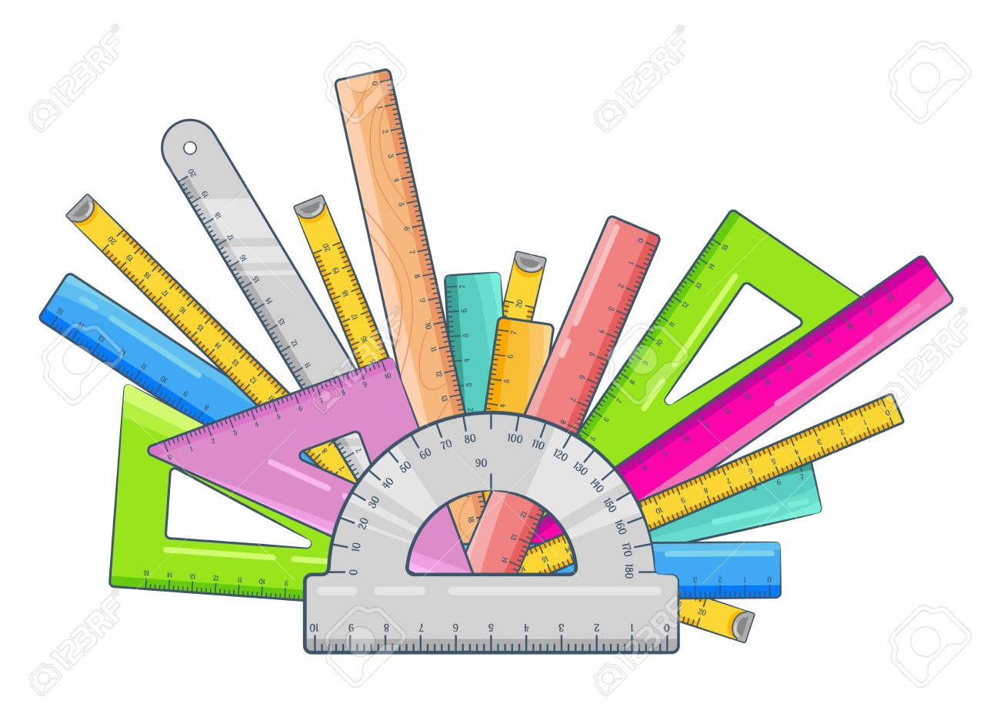
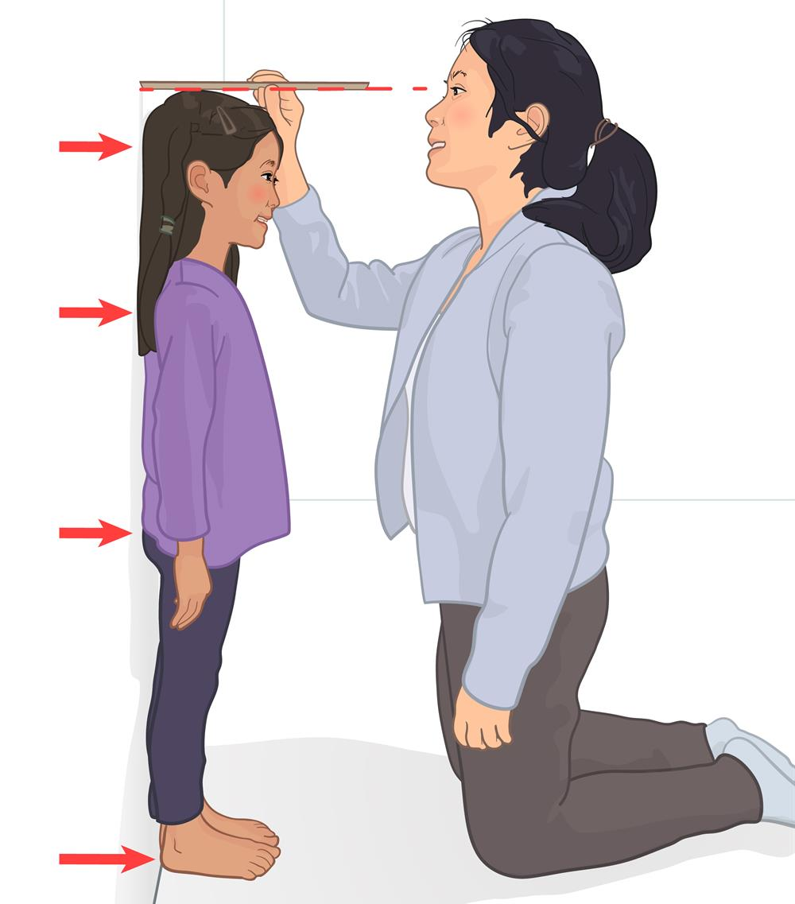
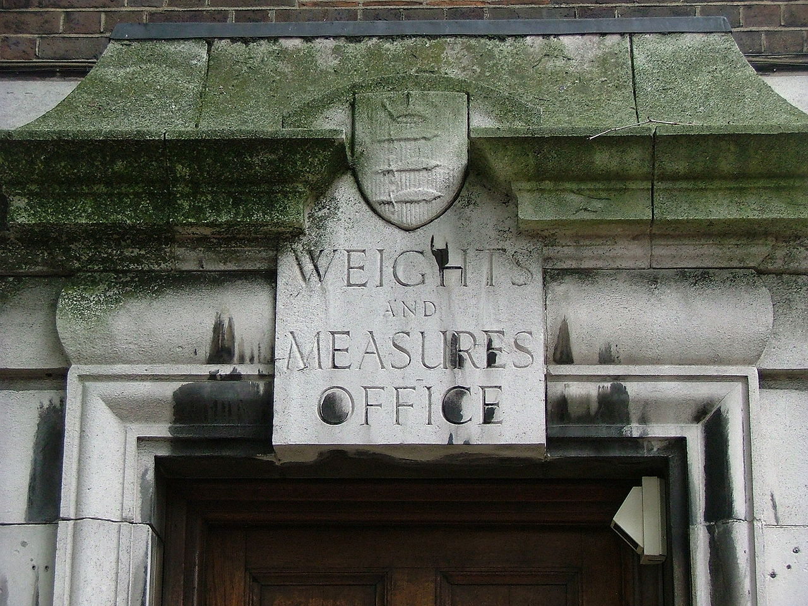

## Data Analysis in Political Science {background-image="libs/Images/background-data_blue_v3.png" .center}

```{r}
library(tidyverse)
library(readxl)
library(kableExtra)
library(modelsummary)
```

<br>

<br>

**(Spring 2024)**

<br>

<br>

::: r-stack
Justin Leinaweaver (Spring 2024)
:::

::: notes
Prep for Class

1. *Bring rulers to class*
:::


## Introductions {background-image="libs/Images/background-slate_v2.png" .center}

<br>

1. Name

2. Year in School

3. Major(s)

4. How much do you love statistics? (1 to 10 scale)

::: notes

Let's go around the room for introductions.

I'll go first.

1. I'm Dr. Justin Leinaweaver.

2. FSU undergrad, masters in IR at UCD and PhD at Trinity.
  + My eleventh year at Drury

3. I'm a political scientist
  + Research interests: international politics, environmental politics and bargaining / negotiations AND quantitative methods
  
4. I love stats a lot. 10.

<br>

### Your turn!

- *ON BOARD*: Stats scores!
:::


## Read the Syllabus! {background-image="libs/Images/background-slate_v2.png"}

<br>

- Components of the grade,
- Assignment requirements,
- Attendance policy,
- Participation points,
- Daily plan / readings,
- Buy the Wheelan book,
- etc.

::: notes

Please make sure to read the syllabus **before class** on Friday.

- Make sure you're particularly clear on these components.

<br>

We'll kick off class with a chance to discuss the syllabus

- Friday will be your chance to raise questions or concerns before I assume everybody has agreed to it!

<br>

### Deal?
:::


## {background-image="libs/Images/01_1-monkey_darts_politics.jpg" background-size='90%'}

::: notes

Welcome to Data Analysis in Political Science!

<br>

Over the last year (or more) you've taken some political science classes.

### What I'd like to know is, based on those experiences, what do we do in political science?

<br>

### - What specific exercises or assignments have you been asked to complete?

<br>

### - If those are the work of a political scientist, then what do political scientists do?

:::


## Read the Syllabus! {background-image="libs/Images/background-slate_v2.png" .center}

<br>

Our **goal** as political scientists:

::: {.incremental}
- To better **understand** the social world

<br>

- The method is **"science"**

<br>

- The key is **"measurement"**
:::

::: notes

The big goal of political science is to understand how the social world works,

- How do communities make rules?

- How do communities enforce the rules?

- Who gets to belong to a given community?

- What do we owe our community?

- What happens when our obligations to different communities conflict?

<br>

**REVEAL**: Science is empirical, verifiable, replicatable

- And since empirical means rooted in real-world observation...

<br>

**REVEAL**: Using "real world observations" means EVERYTHING is a measurement problem

<br>

And let me be super clear, measurement doesn't require numbers!

- The process by which you observe something and think about what you are seeing IS measurement.

- I see a classroom of students looking at me IS A MEASUREMENT.

- This means that getting better at measuring the world will benefit you in EVERY aspect of your life.

<br>

Given this focus, let's kick off our first class today with a simple measurement warm-up!

- **SLIDE**: I would like you to describe the heights of the class
:::


## Warm-up Exercise {background-image="libs/Images/background-teal4.png" .center}

<br>

**The Big Aim**

- Describe the distribution of student heights in our class

::: notes

What I would like you to do is describe for me the distribution of heights in this class.

<br>

Ideally, you will be able to provide me with descriptive summaries of our class more useful than an answer of trying to just eyeball the group of you.

<br>

**SLIDE**: Let's begin with a fairly simple method...
:::


## Warm-up Exercise {background-image="libs/Images/background-teal4.png" .center}

**Describe the distribution of student heights in our class**

<br>

Order the students in our class by height (shortest to tallest)?

::: notes

To answer this question I will ask you to stand up and organize yourselves into a line by height (from the shortest to the tallest)

- *Let them work on this on their own*

<br>

Ok, let me see your answer

### 1. Please describe for me how you completed this task. Be specific.

<br>

### 2. What are the sources of uncertainty in this answer?

<br>

### 3. Is this a "good" answer to the question? 
### - Is this a more useful description than eyeballing the class? Why or why not?

- (It definitely is!)
- Gives us a sense of the middle, the spread around the middle, the extremes
- Helps us answer questions about the general heights of our class as a group
- etc.

<br>

**SLIDE**: Let's tweak our exercise and try it again...
:::


## Warm-up Exercise {background-image="libs/Images/background-teal4.png" .center}

**Describe the distribution of student heights in our class**

<br>

What is the specific range of heights of the students in our class (minimum to maximum in inches)?

::: notes

Work together and get ready to report back to me!

- I brought rulers if you need them!

- *Let them work on this on their own*

<br>

Ok, let me see your answer

### 1. Please describe for me how you completed this task. Be specific.

<br>

### 2. What are the sources of uncertainty in this answer?

<br>

### 3. Is this a "good" answer to the question? 

### - Is this a more useful description than putting the class in line order? Why or why not?

<br>

Depends on the purpose of the measurement!

- Usefully quantifies the max difference in the class
    - Important if designing a space shuttle and need to make sure we all fit!

- BUT doesn't tell us anything about the distribution within the range
    - So, a bad description if the question is to get a sense of heights within the range
    
<br>

### Make sense?

<br>

**SLIDE**: One more time!
:::


## Warm-up Exercise {background-image="libs/Images/background-teal4.png" .center}

**Describe the distribution of student heights in our class**

<br>

What is the average height of the students in our class (to the nearest millimeter)?

::: notes

*Let them work on this on their own*

<br>

Ok, let me see your answer

### 1. Please describe for me how you completed this task. Be specific.

<br>

### 2. What are the sources of uncertainty in this answer?

<br>

### 3. Is this a "good" answer to the question? 

### - Is this a more useful description than putting the class in line order or calculating the range? Why or why not?

<br>

Again, depends entirely on the question being asked!

- Although in this case, beware false precision!
:::


## What do we learn about "height" from our warm-up exercises? {background-image="libs/Images/background-teal4.png" .center}

<br>

- Order by height

- Range in inches

- Average in millimeter

::: notes
**Ok, what do we learn about "height" from our warm-up measurement exercises?**

<br>

Describing the "height" of the class can be done in a BUNCH of different ways and not all of them required a ruler!

<br>

We first used rank ordering to describe the class which gave us a sense of the distribution of heights

- Are we a tall or short group collectively?

- Would we make a good basketball team?

<br>

We then shifted to summarizing the heights of the class
- In other words, maybe we don't need to know everyone's height!

<br>

The range is a number that tells us how spread out we are as a group

- Want to sell class t-shirts? The range (min and max) tells you how many sizes to offer

<br>

The average tells us something about the middle of the class

- What is a single number that represents the bulk of the class?

<br>

A big part of being a social scientist is figuring out which method is the "right" one to answer a given question.

<br>

**SLIDE**: Now, what about measurement...
:::


## What do we learn about "measurement" from our warm-up exercises? {background-image="libs/Images/background-teal4.png" .center}

<br>

- Order by height

- Range in inches

- Average in millimeter

::: notes
**What do we learn about measurement from our warm-up exercises?**

<br>

- **SLIDES** x 4: Measurement uncertainty depends on subject, technique, tool and validation
:::


## Science as Measurement {background-image="libs/Images/background-slate_v2.png" .center}

<br>

:::: {.columns}
::: {.column width="35%"}

<br>

+ **Subject**

+ Tool

+ Process

+ Validation
:::

::: {.column width="65%"}
```{r, fig.align='right'}

```
:::
::::

::: notes

I) Useful measurements require clear definitions of the subject you are studying

- I don't care how fancy your statistics are, you can't measure something until you define it

- AND if the definition is poorly specified or illogical than the measurements are useless!

<br>

### In what ways did you define the subjects of your measurement work?

<br>

"Subject" questions you may have considered:

- Who is a "student in the class"?

- Does hair count towards height? 

- Do shoes?

- What about cultural or religious dress that adds height but that you'd never leave the house without?

<br>

Bottom line, you cannot measure something until you carefully define the subject of your study.

- There's a lot of data out there and people make the mistake of interpreting it without first understanding WHAT it actually focuses on

:::


## Science as Measurement {background-image="libs/Images/background-slate_v2.png" .center}

<br>

:::: {.columns}
::: {.column width="35%"}

<br>

+ Subject

+ **Tool**

+ Process

+ Validation
:::

::: {.column width="65%"}
```{r, fig.align='right'}

```
:::
::::

::: notes

II) Useful measurements require the use of valid tools

- A "valid" tool is one that generates measures that accurately represent the key elements of your definition.

<br>

In our height example:

- Do the rulers focus on measuring length?

- Are the markings clear?

- Do the markings line up with the ends of the ruler well?

- Are the rulers long enough for the job at hand?
:::


## Science as Measurement {background-image="libs/Images/background-slate_v2.png" .center}

:::: {.columns}
::: {.column width="45%"}

<br>

<br>

+ Subject

+ Tool

+ **Process**

+ Validation
:::

::: {.column width="55%"}
```{r, fig.align='right'}

```
:::
::::

::: notes

III) Useful measurements require reliable processes

- A "reliable" process is clearly explained and generates the same results each time it is used.

<br>

In terms of our height measurements:

- Did everyone agree on a specific height measuring process?

- Did everyone follow it perfectly?

- Are the rulers sufficiently well made that they will not warp through use?
:::


## Science as Measurement {background-image="libs/Images/background-slate_v2.png" .center}

<br>

:::: {.columns}
::: {.column width="35%"}

<br>

+ Subject

+ Tool

+ Process

+ **Validation**
:::

::: {.column width="65%"}
```{r, fig.align='right'}

```
:::
::::

::: notes

IV) Useful measurements require external validation

- As a bonus, measurements are most certain when they are consistent with other attempts to measure the same concept.

<br>

Again, for the height exercise:

- Did the manufacturer of the ruler tie their work to an official or external authoritative source? Have the ruler length's been checked?

- Did you check each others' work when measuring?
:::


## Science as Measurement {background-image="libs/Images/background-teal4.png" .center}

<br>

<br>

::: {.r-fit-text}
**Every Measure is Uncertain**
:::

::: notes

Bottom line time!

<br>

Key lesson for all researchers: Every measure is uncertain.

- Our job is to find or create measures that are precise enough to answer the questions we are asking.

<br>

You clearly have a good enough sense of your height to navigate most parts of your life (e.g. can I fit in this room? Do I need bigger pants?)

- Even a cheap wooden 12" ruler will let us order the class by height! That's the point.

<br>

HOWEVER, a precise class average to a small degree of error will require WAY more effort to produce.

- Key if you're trying to launch a space ship, create fusion or argue that raising the minimum wage will raise or lower unemployment!
:::


## Useful measurements must: {background-image="libs/Images/background-teal4.png" .center}

<br>

1. Define the Concept

2. Specify the Tool

3. Specify the Process

4. Test for Robustness

::: notes

Let's write down some guidelines!

<br>

Useful measurements must always:

- Define the key concept (e.g. what is human height?)

- Specify the tool used (e.g. ruler type, size, material),

- Specify the process employed (e.g. how to stand, where, ruler held, etc.), and

- Consider how it can be validated.

<br>

### Make sense?

<br>

Good, let's try to measure something harder!
:::


## Assignment for Next Class {background-image="libs/Images/background-teal4.png" .center}

<br>

1. What was the population of the United States of America in 2020?

2. How many countries are there in the world today?

3. How many wars are currently ongoing in the world?

::: notes

Here's your first assignment for the class.

#### To earn your first participation point:

- Due **BEFORE CLASS** on Friday

- Submit to our discussion board on **Canvas**.

- I will give you the rest of class today to work on this.

<br>

### Are the questions clear? Do you understand what I'm asking?

:::


## Assignment for Next Class {background-image="libs/Images/background-teal4.png" .center}

<br>

1. Population of the USA in 2020?

2. Number of countries in the world today?

3. Number of wars in the world today?

<br>

**Measurement Elements:**

- Definitions, Tools, Process and Validation
]

::: notes

To clarify: I'm not asking you to find and adopt someone else's answer.

- This isn't a simple "let me Google that for you" exercise.

<br>

Your job is to think critically about how each of these questions is a significant measurement challenge.

- Think carefully about how an answer to each question depends on the elements we've discussed today: **definitions, tools, process and validation.**

<br>

### Make sense?

<br>

- **SLIDE**: A complete answer requires...
:::


## Assignment for Next Class {background-image="libs/Images/background-teal4.png" .center}

1. Population of the USA in 2020?
2. Number of countries in the world today?
3. Number of wars in the world today?

**The Assignment Requires:**

- A specific answer, 
- the source(s) used (APA), and 
- an argument, focused on measurement, that your answer is useful (3+ sentences).

::: notes

For each question you must provide:

1. A specific answer in a complete sentence, 

2. The source in APA format (see the Purdue OWL for guidance), and

3. An argument that this is a useful answer **focused on the measurement and the data**
    - **e.g. explain how you used the source(s) to define the concept, select a tool or accept the process they followed and why you are confident in it**
    - Do not rely on claims of authority (e.g. they are experts), our job is to evaluate the actual measures
    - 3-5 sentences

<br>

### Questions?

The discussion board on canvas will stop accepting entries when class starts on Friday.

This means the point depends on submitting in time!

Let's get to it!
:::

