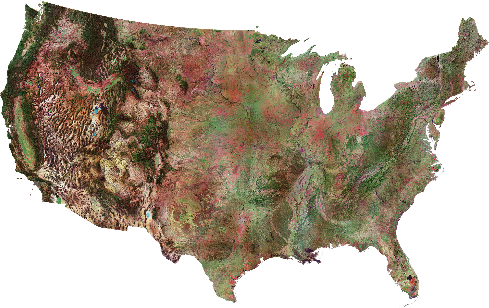

---
output:
  xaringan::moon_reader:
    css: ["default", "extra.css"]
    lib_dir: libs
    seal: false
    nature:
      highlightStyle: github
      highlightLines: true
      countIncrementalSlides: false
      ratio: '16:9'
---

```{r, echo = FALSE, warning = FALSE, message = FALSE}
##xaringan::inf_mr()
## For offline work: https://bookdown.org/yihui/rmarkdown/some-tips.html#working-offline
## Images not appearing? Put images folder inside the libs folder as that is the main data directory

library(tidyverse)
library(readxl)
library(stargazer)
##library(kableExtra)
##library(modelr)

knitr::opts_chunk$set(echo = FALSE,
                      eval = TRUE,
                      error = FALSE,
                      message = FALSE,
                      warning = FALSE,
                      comment = NA)
```

background-image: url('libs/Images/background-data_blue_v3.png')
background-size: 100%
background-position: center
class: middle, inverse

.size80[**Today's Agenda**]

<br>

.size50[

1. Syllabus review

2. Let's answer some questions with data!
]

<br>

.center[.size40[
  Justin Leinaweaver (Spring 2024)
]]

???

## Prep for Class
1. Review Canvas submissions


---

background-image: url('libs/Images/background-teal4.png')
background-size: 100%
background-position: center

.size60[.content-box-white[**Questions on the Syllabus?**]]

<br>

.size40[
||Proportion|
|:-----|:----:|
|Attendance and Participation|50%|
|||
|Assignments|50%|
|- Report: Analyze the Outcome Variable(s)||
|- Report: Analyze the Predictor Variable(s)||
|- Report: Bivariate Test of your Hypotheses||
|- Report: Multivariate Test of your Hypotheses||
|||

]

???

### Any questions about the class from your review of the syllabus?

<br>

Our job this semester is to design and execute a research project
- Your grade is heavy on being in class and collaborating to get this done

<br>

### Is the attendance policy clear?
1. Attendance cliff: > 4 unexcused absences = 'C'
2. YOUR JOB to request make-up assignments from excused absences

<br>

### Does everybody understand how to earn the participation points?
- Come to class on-time,
- Be engaged while in class (e.g., bring all needed materials, don’t distract others, etc.), and
- Submit all required daily assignments BEFORE class begins.

<br>

### Does everybody see where the readings for each class are assigned and know how to access them?

<br>

### Any questions on using Canvas?


---

background-image: url('libs/Images/01_2-Backup-Your-Computer.jpg')
background-size: 100%
background-position: bottom

???

Important Note: I expect each of you to save and backup your work in this class to the cloud on a daily basis. 

- I will not accept lost or broken computers as excuses for incomplete assignments and missed deadlines.

<br>

### Is everybody already backing up to the cloud (e.g. iCloud, OneDrive, Dropbox, etc.)?

OneDrive backup is FREE for Drury students!

- Let me know if you need help with this.


---

background-image: url('libs/Images/background-blue_cubes_lighter3.png')
background-size: 100%
background-position: center
class: middle

.center[.size60[.content-box-white[**Assignment for Today**]]]

.size50[
1. Population of the USA in 2020?
2. Number of countries in the world today?
3. Number of wars in the world today?
]

.center[.size50[**Complete answers include specificity, sourcing and an argument that this measurement is useful.**]]

???

Our first participation assignment was due today.

<br>

Before we get to the answers, let's talk in broad strokes about the assignment.

### How did it go? How did you attack this?

<br>

*Split class into groups (3-4?)*

- Go sit with your group!

<br>

**SLIDE**: Let's dig in!


---

background-image: url('libs/Images/background-blue_cubes_lighter3.png')
background-size: 100%
background-position: center
class: middle

.size40[.center[.content-box-white[**Population of the USA in 2020**]]]

<br>

```{r, echo = FALSE, fig.align = 'center', out.width = '50%'}

```

.size40[
1. "Best" answer (with confidence interval)?

2. Key sources of uncertainty? Subject, Tool, Process, Validation
]

???

Groups, discuss all the submitted answers to our first question and get ready to report back two things

1. What is our "best" answer to the question (e.g. with confidence interval)?
    - You are NOT picking a single submission, but identifying a useful range that you are confident includes the "real" answer.
    
2. What are the primary sources of uncertainty in our answer?
    - Identify AT LEAST ONE source of uncertainty for each of the four aspects of measurement we discussed last class
    
<br>

### Everybody understand what I want?

- 5 mins, get to it!

<br>

Report back and discuss Q1: "Best" answer ranges on the board, explain each

<br>

Report back and discuss Q2: Sources of uncertainty on the board

<br>

**SLIDE**: List sources of uncertainty


---

background-image: url('libs/Images/01_2-census_mailer.jpg')
background-size: 100%
background-position: center
class: slideblue

???

Counting the population of the US is INCREDIBLY hard.

**Subject Definitions Matter**
- WHO should be counted? Citizens vs residents vs people
- WHAT should be counted? An average after all births, deaths, immigrations, etc? Or a snapshot on Jan 1st? Or July 1st? or Dec 31st?

**Tools Matter**
- The census form itself is both simple and complicated!
- Trump admin tried hard to add a citizenship question to the form wither to develop a better count of the undocumented OR to lay the groundwork for excluding those populations from congressional representation.

**Process Matters**
- NO single list of people held by the government, not even a list of just citizens
- Large homeless population very hard to count with mailers!
- Many undocumented afraid to answer the door when census takers knock
- Minority groups frequently undercounted because of how hard it is to locate individuals in an urban setting

**Validation Matters**
- Congress has put in place roadblocks to using statistical sampling procedures to verify these wildly innaccurate headcounts.

<br>

Given all this, report back, what kinds of questions can we answer vs not?

### Questions we can answer?

### Questions we cannot answer?


---

background-image: url('libs/Images/01_2-census_apportionment-2020-map01.png')
background-size: 70%
background-position: center
class: slideblue

???

### Is our census count likely to have been precise enough for this VERY important task (reapportioning reps in Congress)? Why or why not?

<br>

### Can you see here how urban areas appear to be losing out in the current process?

Politics in everything!


---

background-image: url('libs/Images/01_2-World-map-countries.jpg')
background-size: 100%
background-position: top
class: slideblue, center, bottom

.size45[.content-box-blue[**Number of countries in the world today?**]]

???

*Force groups to change membership!*

Still looking for two things:

1. Your "best" answer, and
2. Primary sources of uncertainty

<br>

5 mins, get to it!

<br>

Report back and discuss Q1: "Best" answer ranges on the board, explain each

<br>

Report back and discuss Q2: Sources of uncertainty on the board

<br>

**SLIDE**: List sources of uncertainty


---

background-image: url('libs/Images/01_2-UN_Map_Wikipedia.png')
background-size: 100%
background-position: center

???

**Subject Definitions Matter**
- What is a state? How much sovereign control is necessary?
- What about places of ongoing civil conflict (Libya, Ethiopia, South Sudan)?
- What about territories like Puerto Rico with many obligations to the US (pay taxes, serve in war) but not all the benefits (no social security)?

**Tools Matter**
- How do you translate complex conceptual definitions of statehood into clear and measurable criteria?

**Process Matters**
- If your tool focuses on wide recognition: What do we do about China's pressure campaign against Taiwan including both threats and bribery?

- If your tool focuses on recognition by IOs: Israel's threats against the UN and smaller countries for allowing Palestine observer status at the UN 

- If your tool focuses on economic or military strength: What about Russian support for breakaway "republics" across the old USSR (Transnistria, Abkhazia, Crimea, Donetsk, etc.)?


**Validation Matters**
- UN membership is a political exercise not a rigorous definition per international law but carries great weight in many aspects of the world.
    - See the struggles of the Taliban to claim Afghanistan's seat in the UN

<br>

Given all this, report back on Q2

### Questions we can answer?

### Questions we cannot answer?


---

background-image: url('libs/Images/01_2-ukraine_fighting.webp')
background-size: 100%
background-position: top
class: slideblue, center, bottom

.size45[.content-box-blue[**Number of current wars?**]]

???

*Force groups to change membership!*

Still looking for two things:

1. Your "best" answer, and
2. Primary sources of uncertainty

<br>

5 mins, get to it!

<br>

Report back and discuss Q1: "Best" answer ranges on the board, explain each

<br>

Report back and discuss Q2: Sources of uncertainty on the board

<br>

**SLIDE**: List sources of uncertainty


---

background-image: url('libs/Images/01_2-2023_Ongoing_conflicts_around_the_world.png')
background-size: 90%
background-position: center

???

The [wikipedia entry of "ongoing armed conflicts"](https://en.wikipedia.org/wiki/List_of_ongoing_armed_conflicts) is now one of the first things to pop up on a Google search of this question.

- Draws on a number of good quality sources but mixes them together in some ways the designers of those measures would probably be concerned by.

<br>

Measuring war is REALLY, REALLY hard

- Should we include ongoing non-lethal violence such as the Chinese navy assaulting Philippines ships in the SCS
    - Water canons, blinding lasers, close quarters maneuvers but no killing

- Should we include serious acts of economic violence like the US sanctions against Russia over its invasion of Ukraine?
    - What about NATO providing arms to Ukraine?

- Should we include serious acts of violence happening within a single state's borders such as:
    - China targeting Uighyur muslims (genocide?)
    - Myanmar military targeting Rohingya (also genocide?)
    - And many, many, many more
    
- Should we include violence by non-state actors (e.g. terrorism or rebellion) such as that done by ISIS in Iran and Syria or the Pakistani Taliban's attack on the Pakistani government?

<br>

Measuring "war" requires extreme care in defining the subject, tool, process and validation procedures you plan on using.

<br>

Given all this, report back on Q2

### Questions we can answer?

### Questions we cannot answer?

<br>

**SLIDE**: Ok, big takeaway...

<br>

<br>

#### Old Notes
**Definitions Matter**
- What is "war" in 2023?
- All of the following can be tied to increased costs in terms of blood and treasure for Russia: Economic sanctions, direct monetary support to Ukraine, direct provision of arms to Ukraine, training of Ukrainian soldiers BUT DO THEY ADD UP TO WAR?
- Correlates of War project: "sustained combat, involving organized armed forces, resulting in a minimum of 1,000 battle-related fatalities within a twelve month period"
    - MIDs: Militarized interstate disputes

**Tools Matter**
- How do you translate complex conceptual definitions of "war" into clear and measurable criteria?

**Process Matters**
- How do you get reliable information on what is happening on the ground in Russia (no free press) or Ukraine (active war ongoing)?

**Validation Matters**
- Lots of groups offering "reports" on destruction, alleged war crimes, fatalities, but almost all VERY conflicting.

<br>


---

background-image: url('libs/Images/background-blue_cubes_lighter3.png')
background-size: 100%
background-class: center
class: middle

.size50[
1. Science = Answering research questions with data

2. Data = Measurements of the empirical world

3. All measurements include uncertainty
]

.size10[
<br>
]

.size50[
.content-box-white[Therefore, all scientific knowledge is uncertain]
]

???

Our big takeaway!

- *Define empirical: "based on, concerned with, or verifiable by observation or experience rather than theory or pure logic" (OED).*

<br>

Here's the thing, some people see this as an argument that scientists don't actually know anything about the world.

- But that's the opposite of what this means.

- This is wildly empowering!

<br>

Science is not about revealing truth, it's about describing the world.

- We prefer descriptions based on how clear they are and how well they can describe their uncertainty

- Scientific progress is often a process focused on shrinking the uncertainty in our measures

<br>

Therefore, one of the KEY skills I want you to strengthen in this class is the ability to extract useful information from data.

- The better you come to understand the uncertainty in data, the more easily you can use that data to answer important questions!

- THAT will allow you to be a MUCH more effective data driven decision-maker.

<br>

My hope is that our work this week has helped you think a bit more deeply about population, the international state system and the nature of war.

- We don't have great answers for those three questions yet, but you should now have a MUCH better sense of what we don't know and why it will be hard to improve!

<br>

### Make sense?

- **SLIDE**: With that in mind...


---

background-image: url('libs/Images/01_2-quote-von-neumann.jpg')
background-size: 100%
background-position: center
class: slideblue

???

I have never come across a quote that spoke more to my experience of being a social scientist.

- This isn't just an excellent quote about math, but an excellent quote about the scientific process and the challenges of causal inference.

- Using data to answer questions is hard, but it just sort of gets easier with time and practice.

<br>

So, hang in there this semester and embrace the journey.

- By the end of the semester you too will have learned enough research design, math and programming skills to make some cool things and answer some challenging questions.

- My promise is that you'll even understand enough of what you're doing to be dangerous!


---

background-image: url('libs/Images/background-blue_cubes_lighter3.png')
background-size: 100%
background-class: center
class: middle

.size40[
.content-box-white[**This semester you will develop skills in:**]

- **Evaluating** data for validity/reliability,

- **Cleaning** the data,

- **Describing** the variation in the data,

- **Analyzing** the variation, and

- **Reporting** your findings in clear compelling ways.
]

???

We have three learning outcomes for this class and they are listed on the syllabus.

- You should definitely read them.

<br>

HOWEVER, I think this summarizes the hands-on goals for our semester nicely.


---

background-image: url('libs/Images/background-blue_triangles2.png')
background-size: 100%
background-position: center
class: middle

.size60[.content-box-white[**For Next Class**]]

<br>

.size55[
1. Huntington-Klein (2022) Chapter 1 "Designing Research"

2. Wheelan (2014) Chapter 7 "The Importance of Data"
]

???

