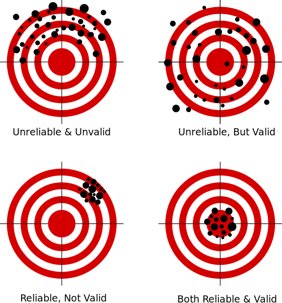

# Today's Agenda {background-image="Images/background-data_blue_v3.png"}

```{r}
library(tidyverse)
library(readxl)
```

<br>

::: {.r-fit-text}

Analyzing uncertainty in data

- Concept: Infringements on civil liberties and rights

:::

<br>

::: r-stack
Justin Leinaweaver (Spring 2025)
:::

::: notes
Prep for Class

1. Review Canvas submissions

2. Readings
    - *Brians, Craig Leonard, Lars Willnat, Jarol B. Manheim, and Richard C. Rich. 2011. “From Abstract to Concrete: Operationalization and Measurement.” In Empirical Political Analysis, Boston, MA: Longman, (ONLY p88-110)]*
    
<br>

Our work this week is intended to help frame the work of our semester

- Monday we tried to answer some fairly simple questions about the heights of our class

- Wednesday we tried to answer some fairly basic questions about our world

<br>

**What were your takeaways from these exercises?**

(SLIDE)

:::


## Science as Measurement {background-image="Images/background-slate_v2.png" .center}

<br>

1. Scientific knowledge is generated by answering research questions with data

2. Data is generated by measuring the empirical world

3. All measurements include uncertainty

::: notes

Remember, the goal of science is to answer important questions in ways that make completely clear the uncertainty in those answers

- That means the HOW YOU DID IT is EQUALLY important as the WHAT in your answers about the world

<br>

Today I want us to practice one more measurement exercise before we shift to analyzing data

- Remember, we can't analyze data unless we understand how it was produced

- SO, let's produce some data!

:::


## For Today {background-image="Images/background-slate_v2.png" .center}

Submit to Canvas a news event from the last few years that involves a government, anywhere in the world, infringing on the civil rights or liberties of its citizens. You may not submit an event already claimed by someone else in class.

1. APA citation and web link to the event
2. Describe the event
3. Explain the specific right or liberty being infringed upon

::: notes


:::


## Brians et al (2011) {background-image="Images/background-slate_v2.png" .center}

1. Concept

2. Operationalization

3. Instrumentation

4. Measurement

::: notes

**What is involved in the operationalization step?**
- ("...selecting observable phenomena to represent abstract concepts" (89).)

- ("To be useful...operational definitions must tell us precisely and explicitly what to do in order to determine what quantitative value should be associated with a variable in any given case (92).)

<br>

Let's take a look at the group definitions so far.

- See the spreadsheet linked in today's Canvas Module

**How well does each proposed definition operationalization the concept?**

- **Areas that need to be more precise?**

- **Areas that need to be more explicit?**

<br>

GROUPS: Take the feedback and refine your definitions to make it "precise" and "explicit".

Now we move to the next step of the process.

### Per the reading, what happens during the instrumentation stage?
+ (Convert your operationalization (definition) into a series of steps you can use to measure the concept in question)

<br>

Instrumentation is when you decide HOW you are going to measure the concept.

- Your instrument should be determined by your operationalization, and 

- A STRONG concern about **validity** and **reliability**.

<br>

### What does it mean to say an instrument is "valid"?
- ("...the extent to which our measures correspond to the concepts they are intended to reflect" (105).)

<br>

### What does it mean to say an instrument is "reliable"?
- (How stable are the results of our instrument?)
- Would different coders produce the same result using your instrument to measure the same case?

:::


## Evaluating Measurements {background-image="Images/background-slate_v2.png" .center}

{style="display: block; margin: 0 auto"}

::: notes

**Has anybody seen a diagram like this before?**

<br>

### If you were choosing a measure, how would you rank these from best to worst? Why?

- Left column is BAD
    - Validity is key. 
    - If you aren't measuring the idea you are targeting the results are meaningless.

- So, aim for the right column and work hard to move from top-right to bottom-right!
    - Assuming you have two valid measures, reliability helps you choose between them!

<br>

### Did the readings make sense on these points?

<br>

I know there's a ton of complexity in this chapter but you learn research design only by doing research.

- The dense parts will make much more sense as you encounter the specific problems they refer to.

:::


## Instrumentation {background-image="Images/background-slate_v2.png"}

{.absolute right=0 bottom=0 width="50%"}

1. A Nominal Instrument

2. An Ordinal Instrument

::: notes

Groups your job now is to develop TWO instruments for your operationalization

1. A nominal measure of your operationalization of "political violence", and 
2. An ordinal measure of your operationalization of "political violence"

<br>

### Per the reading, what is a nominal measure?
- ("...provides the least information about phenomena; it gives only a set of discrete categories to use in distinguishing between cases" (95).)

- ("Using nominal measurement is simply a way of sorting cases into groups designated by the names used in a classificatory scheme" (95).)

- e.g. nationality

<br>

**SLIDE**: So, the first instrument should simply be a "yes"/"no" type question.

:::


## Instrumentation {background-image="Images/background-slate_v2.png"}

{.absolute right=0 bottom=0 width="50%"}

1. A Nominal Instrument

    - Responses: "Yes" vs "No"

2. An Ordinal Instrument

::: notes

**Per the reading, what is an ordinal measure?**

- ("...allows us to both categorize and to order, or rank, phenomena. ... With ordinal measurement we can say which cases have more (or less) of the measured quality than other cases, and we can rank cases in the order of how much of the quality they exhibit" (95).)

- e.g. social class: lower, middle or upper class

<br>

**SLIDE**: So, the second instrument should produce ordinal responses

:::


## Instrumentation {background-image="Images/background-slate_v2.png"}

{.absolute right=0 bottom=0 width="50%"}

1. A Nominal Instrument

    - Responses: "Yes" vs "No"

2. An Ordinal Instrument
    
    - "None"
    - "Low"
    - "Medium"
    - "High"

::: notes

Ok, groups, time for the instrumentation stage.

- Take some time to instrument your operationalization of "political violence."

- In a few minutes we will test your instruments out!

<br>

### Questions?

- Upload your instruments on on the spreadsheet

<br>

### Groups, talk us through your instruments.

### - What are the biggest sources of error in your instruments?

<br>

Ok, let's test out what you've built.

+ I'm going to present you with a series of cases.

+ I want you to measure each case using your instruments.

+ You will add your measurement to our spreadsheet.

### Any questions before we start?

<br>

**Save discussion for the end, just focus on coding cases to let the groups find their groove**

:::


## Case 1 {background-image="Images/background-slate_v2.png"}


::: notes


:::


## Case 2 {background-image="Images/background-slate_v2.png"}


::: notes


:::


## Case 3 {background-image="Images/background-slate_v2.png"}


::: notes


:::


## Case 4 {background-image="Images/background-slate_v2.png"}


::: notes


:::


## Case 5 {background-image="Images/background-slate_v2.png"}


::: notes


:::


## Case 6 {background-image="Images/background-slate_v2.png"}


::: notes


:::


## Case 7 {background-image="Images/background-slate_v2.png"}


::: notes


:::


## Case 8 {background-image="Images/background-slate_v2.png"}


::: notes


:::


## Science as Measurement {background-image="Images/background-slate_v2.png" .center}

<br>

1. Scientific knowledge is generated by answering research questions with data

2. Data is generated by measuring the empirical world

3. All measurements include uncertainty

::: notes

Today let's develop the tools we need to identify and evaluate where uncertainty comes from


:::


## TBD {background-image="Images/background-slate_v2.png" .center}

1. Concept

2. Operationalization

3. Instrumentation

4. Measurement


## For Next Class {background-image="Images/background-slate_v2.png" .center}

<br>

1. Huntington-Klein (2022) Chapter 1 "Designing Research"

2. Wheelan (2014) Chapter 7 "The Importance of Data"

::: notes

Next week we start designing our class research project!

- These readings should set the table for it.

<br>

Be ready to explore the Wheelan chapter's analysis of how data can go wrong if we're not careful!
:::