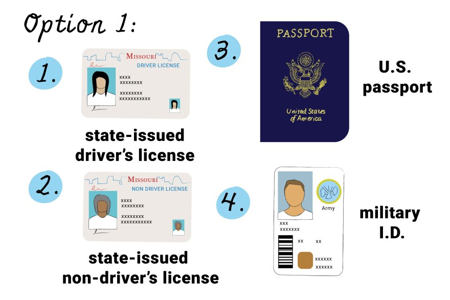

# Today's Agenda {background-image="Images/background-data_blue_v3.png"}

```{r}
library(tidyverse)
library(readxl)
```

<br>

::: {.r-fit-text}

**Science as Measurement**

- Practicing the Process of Generating Data

:::

<br>

::: r-stack
Justin Leinaweaver (Spring 2025)
:::

::: notes
Prep for Class

1. Review Canvas submissions

2. Create Google Sheet for capturing group definitions and scores
    - https://docs.google.com/spreadsheets/d/1WDEjXM4vRkMk8DINoNMu2CGvQQue34eMeDERaXZjx2E/edit?usp=sharing

3. Readings
    - *Brians, Craig Leonard, Lars Willnat, Jarol B. Manheim, and Richard C. Rich. 2011. “From Abstract to Concrete: Operationalization and Measurement.” In Empirical Political Analysis, Boston, MA: Longman, (ONLY p88-110)]*
    
<br>

Our work this week is intended to help frame the work of our semester

- Monday we tried to answer some fairly simple questions about the heights of our class using measurement

- Wednesday we tried to answer some fairly basic questions about our world using measurement

<br>

**SLIDE**: Key takeaways...

:::


## Science as Measurement {background-image="Images/background-data_blue_v3.png" .center}

<br>

::: {.r-fit-text}
1. Science means answering questions with data

2. Data is generated by measuring the empirical world

3. All measurements include uncertainty

4. So, all answers include uncertainty
:::

::: notes

Remember, the goal of science is to answer important questions in ways that make completely clear how uncertain those answers are.

- That means the answer is ONLY USEFUL IF the UNCERTAINTY is explained clearly

- Confident answers that don't come with uncertainty are basically useless for generating knowledge

<br>

Today I want us to practice one more measurement exercise before we shift to analyzing real-world data

- Remember, we can't analyze data unless we understand how it was produced

- SO, let's talk process and produce some data!

:::


## Brians et al (2011) {background-image="Images/background-data_blue_v3.png" .center}

<br>

::: {.r-fit-text}
**From Abstract to Concrete:**

**Operationalization and Measurement**

:::

1. Concept

2. Operationalization

3. Instrumentation

4. Measurement

::: notes

Brians et al (2011) describe the process of generating data as a series of steps

- I summarize their steps using these four headings

<br>

In brief, the measurement process involves:

1. Identifying a concept you want to measure,

2. Producing a precise definition of that concept,

3. Developing a tool you, or others, can use to represent that definition as data, and then

4. Applying that tool to the real-world to generate data

<br>

**Does everybody understand the big picture process described here and in the reading?**

<br>

For today you each submitted a recent case that you argue represents an example of a government, anywhere in the world, infringing on the civil rights or civil liberties of its citizens. 

- That idea represents the concept we are working to measure: Infringements on civil rights or liberties

<br>

*Split class into four groups (that's what is already on the spreadsheet)*

- *Since already logged in, have people work with those around them*

:::


## Brians et al (2011){background-image="Images/background-data_blue_v3.png" .center}

<br>

::: {.r-fit-text}
**Infringements on Civil Rights or Liberties**

1. Concept

2. **Operationalization**

3. Instrumentation

4. Measurement
:::

::: notes

**Per the reading, what do we do to complete Step 2 Operationalization?**

- (Explicitly and precisely define the concept of interest)

- (operationalization: "...selecting observable phenomena to represent abstract concepts" (89).)

- ("To be useful...operational definitions must tell us precisely and explicitly what to do in order to determine what quantitative value should be associated with a variable in any given case (92).)

<br>

GROUPS, review ALL of the cases submitted on Canvas by your classmates

- Take a few minutes to reflect on and discuss them, and

- Then use those cases to operationalize our chosen concept

- e.g. What are the observable phenomena you argue are necessary to classify something as an infringement on civil rights or liberties

<br>

**Questions on the exercise?**

- Remember, the goal is NOT to come up with a single operationalization for the whole class!

- Instead, our job is to help each group refine THEIR chosen definition to ensure it is precise and explicit

- When you have your operationalization I want you to upload it onto the Google Sheet I've posted for today on Canvas

- Go!

<br>

PRESENT and DISCUSS each

<br>

GROUPS: Take the feedback and refine your definitions to make it "precise" and "explicit".

:::


## Brians et al (2011){background-image="Images/background-data_blue_v3.png" .center}

<br>

::: {.r-fit-text}
**Infringements on Civil Rights or Liberties**

1. Concept

2. Operationalization

3. **Instrumentation**

4. Measurement
:::

::: notes

Now we move to the next step of the process.

- **Per the reading, what happens during the instrumentation stage?**

- (Convert your operationalization (definition) into a series of steps you can use to measure the concept in question)

<br>

Instrumentation is when you decide HOW you are going to measure the concept.

- Your instrument should be determined by your operationalization, and 

- A STRONG concern about **validity** and **reliability**.

<br>

**What does it mean to say an instrument is "valid"?**

- ("...the extent to which our measures correspond to the concepts they are intended to reflect" (105).)

<br>

**What does it mean to say an instrument is "reliable"?**

- (How stable are the results of our instrument?)

- Would different coders produce the same result using your instrument to measure the same case?

<br>

**SLIDE**: Visualize validity and reliability

:::


## Evaluating Measurements {background-image="Images/background-data_blue_v3.png" .center}

{style="display: block; margin: 0 auto"}

::: notes

**Has anybody seen a diagram like this before?**

<br>

### If you were choosing a measure, how would you rank these from best to worst? Why?

- Left column is BAD
    - Validity is key. 
    - If you aren't measuring the idea you are targeting the results are meaningless.

- So, aim for the right column and work hard to move from top-right to bottom-right!
    - Assuming you have two valid measures, reliability helps you choose between them!

<br>

### Did the readings make sense on these points?

<br>

I know there's a ton of complexity in this chapter but you learn research design only by doing research.

- The dense parts will make much more sense as you encounter the specific problems they refer to.

:::


## Instrumentation {background-image="Images/background-data_blue_v3.png"}

{.absolute right=0 bottom=0 width="50%"}

<br>

1. A Nominal Instrument

<br>

2. An Ordinal Instrument

::: notes

Groups your job now is to develop TWO instruments for your operationalization

1. A nominal measure of your operationalization of "Infringements on Civil Rights or Liberties", and 

2. An ordinal measure of your operationalization of "Infringements on Civil Rights or Liberties"

<br>

**Per the reading, what is a nominal measure?**

- ("...provides the least information about phenomena; it gives only a set of discrete categories to use in distinguishing between cases" (95).)

- ("Using nominal measurement is simply a way of sorting cases into groups designated by the names used in a classificatory scheme" (95).)

- e.g. nationality

<br>

**SLIDE**: So, the first instrument should simply be a "yes"/"no" type question.

:::


## Instrumentation {background-image="Images/background-data_blue_v3.png"}

{.absolute right=0 bottom=0 width="50%"}

<br>

1. A Nominal Instrument

    - Responses: "Yes" vs "No"

<br>

2. An Ordinal Instrument

::: notes

**Does everybody understand what there first instrument needs to look like?**

<br>

**Per the reading, what is an ordinal measure?**

- ("...allows us to both categorize and to order, or rank, phenomena. ... With ordinal measurement we can say which cases have more (or less) of the measured quality than other cases, and we can rank cases in the order of how much of the quality they exhibit" (95).)

- e.g. social class: lower, middle or upper class

<br>

**SLIDE**: So, the second instrument should produce ordinal responses

:::


## Instrumentation {background-image="Images/background-data_blue_v3.png"}

{.absolute right=0 bottom=0 width="50%"}

1. A Nominal Instrument

    - Responses: "Yes" vs "No"
    
<br>

2. An Ordinal Instrument
    
    - "None"
    - "Low"
    - "Medium"
    - "High"

::: notes

Ok, groups, time for the instrumentation stage.

- Take some time to instrument your operationalization of "infringements on civil rights and liberties"

- In a few minutes we will test your instruments out!

<br>

**Questions?**

- Get to it and be sure to upload your instruments onto the spreadsheet

<br>

**Groups, talk us through your instruments.**

- **What are the biggest sources of error in your instruments?**

<br>

Ok, let's test out what you've built.

- I'm going to present you with a series of cases.

- I want you to measure each case using your instruments.

- You will add your measurement to our spreadsheet.

<br>

IMPORTANT NOTE: This is an exercise in measurement, not your opinion

- We don't care how you personally react to each case, JUST measure it using your instruments

<br>

**Any questions before we start?**

- *Save discussion for the end, just focus on coding cases to let the groups find their groove*

:::


## Case 1 {background-image="Images/background-data_blue_v3.png"}

The government bans you from a social media platform for posting "hate" speech

{style="display: block; margin: 0 auto"}

::: notes


:::


## Case 2 {background-image="Images/background-data_blue_v3.png"}

The government shuts down a social media platform for being a "security risk"

{style="display: block; margin: 0 auto"}

::: notes


:::


## Case 3 {background-image="Images/background-data_blue_v3.png"}

The government prevents the publishing an unflattering story in the newspaper

{style="display: block; margin: 0 auto"}

::: notes


:::


## Case 4 {background-image="Images/background-data_blue_v3.png"}

The government jails a reporter to stop them publishing an unflattering story

{style="display: block; margin: 0 auto"}

::: notes


:::


## Case 5 {background-image="Images/background-data_blue_v3.png"}

The government bans the practice of a minority religion

{style="display: block; margin: 0 auto"}

::: notes


:::


## Case 6 {background-image="Images/background-data_blue_v3.png"}

The government requires the practice of a majority religion

{style="display: block; margin: 0 auto"}

::: notes


:::


## Case 7 {background-image="Images/background-data_blue_v3.png"}

The government adopts a strict voter ID law (limited options allowed)

{style="display: block; margin: 0 auto"}

::: notes


:::


## Case 8 {background-image="Images/background-data_blue_v3.png"}

The government bans the access of trans persons to public bathrooms matching their identity

{style="display: block; margin: 0 auto"}

::: notes


:::


## {background-image="Images/background-data_blue_v3.png" .center}

::: {.r-fit-text}
**Infringements on Civil Rights or Liberties**
:::

:::: {.columns}
::: {.column width="40%"}
**Measurement Process**

1. Concept

2. Operationalization

3. Instrumentation

4. Measurement
:::

::: {.column width="5%"}

:::

::: {.column width="55%"}
**Cases: Government...**

1. Bans you from social media
2. Shuts down social media
3. Censors the news media
4. Jails a reporter
5. Bans minority religion
6. Requires majority religion
7. Requires strict voter ID
8. Restricts trans bathroom access
:::
::::

::: notes

**So, how similar are all of your results across each case?**

- **Where are the big differences? Why?**

- REPORT back on each and DISCUSS

<br>


Ok, big question.

- **What do we learn about our key concept from your work today?**

<br>

We cannot study any concept without introducing error.

- It is a huge leap moving from concept to operationalization

    - Forces you to make many assumptions.

- It is a huge leap from operationalization to measurement.

    - Many more assumptions and trade-offs in the process of designing an instrument.

<br>

This means that the only way to learn something from someone else's work is think carefully about their process.

- This is why peer-reviewed research is so valuable.

- If the choices aren't transparent, the results are basically meaningless.

<br>

To me this means that anytime we hear someone making an argument about any concept they are almost certainly operating from a different understanding of the concept than me.

- We'd better get good at identifying assumptions, AND recognizing how those assumptions impact their conclusions.

- Being a credible expert means identifying the assumptions and understanding the costs and benefits of each choice.

**Make sense?**

:::


## For Next Class {background-image="Images/background-data_blue_v3.png" .center}

<br>

::: {.r-fit-text}

1. Huntington-Klein (2022) Ch 1 "Designing Research"

2. Huntington-Klein (2022) Ch 2 "Research Questions"

3. Review the data options spreadsheet

:::
::: notes

Next week we start designing our class research project!

- These readings should set the table for it.

<br>


:::