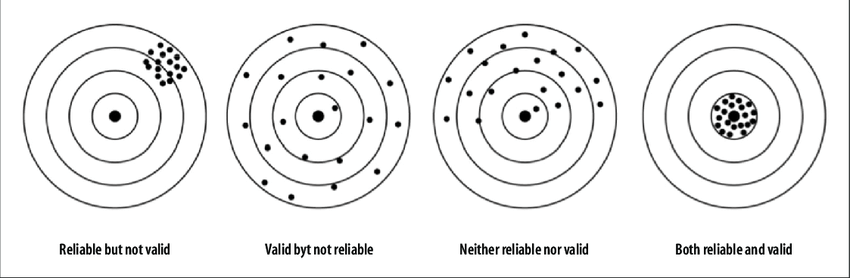

---
output:
  xaringan::moon_reader:
    css: ["default", "extra.css"]
    lib_dir: libs
    seal: false
    nature:
      highlightStyle: github
      highlightLines: true
      countIncrementalSlides: false
      ratio: '16:9'
---

```{r, echo = FALSE, warning = FALSE, message = FALSE}
##xaringan::inf_mr()
## For offline work: https://bookdown.org/yihui/rmarkdown/some-tips.html#working-offline
## Images not appearing? Put images folder inside the libs folder as that is the main data directory

library(tidyverse)
library(readxl)
library(stargazer)
##library(kableExtra)
##library(modelr)

knitr::opts_chunk$set(echo = FALSE,
                      eval = TRUE,
                      error = FALSE,
                      message = FALSE,
                      warning = FALSE,
                      comment = NA)
```

class: slideblue

.size80[**Today's Agenda**]

<br>

.size40[

1. Intro to data analysis

2. Explore the new data project / discuss the codebook

3. Explore the data using Excel

]

<br>
<br>

.center[.size40[
  Justin Leinaweaver (Fall 2021)
]]


---

class: middle, slideblue

.size40[**Four Principles Underpinning Data Analysis**

1. Data analysis is not a linear process

2. Tidy your data before exploring it

3. Variable type determines the tool

4. Evaluate validity and reliability before anything else
]


---

class: middle

.size40[**1. Data analysis is not a linear process**]

<br>

```{r, fig.align='center', out.width='100%'}
knitr::include_graphics("libs/Images/01_2-Analysis_Process.png")
```


---

class: middle

.size40[**2. Tidy your data before exploring it**]

<br>

```{r, fig.align='center', out.width='100%'}
knitr::include_graphics("libs/Images/01_2-tidy.png")
```


---

class: middle

.size40[**Tidy the data and save a working copy**]

<br>

```{r, fig.align='center', out.width='85%'}
knitr::include_graphics("libs/Images/01_2-tidy_fh1.png")
```

<br>

```{r, fig.align='center', out.width='85%'}
knitr::include_graphics("libs/Images/01_2-tidy_fh2.png")
```


---

class: middle

.size40[**3. Variable type determines the tool**]

```{r, fig.align='center', out.width='100%'}
knitr::include_graphics("libs/Images/01_2-levels_measurement.png")
```


---

background-image: url('libs/Images/01_2-chart_types.jpg')
background-size: 80%


---

class: middle

.size50[**4. Evaluate Validity & Reliability**]

<br>

```{r, fig.align = 'center', out.width = '100%'}

```


---

class: middle, slideblue

.size40[**Four Principles Underpinning Data Analysis**

1. Data analysis is not a linear process

2. Tidy your data before exploring it

3. Variable type determines the tool

4. Evaluate validity and reliability before anything else
]


---

class: slideblue

.size40[**The Big Idea**]

<br>

.size30[
To answer political science questions with data you will develop skills in:

- .textred[**Evaluating** data for validity/reliability]

- .textred[**Cleaning/Preparing** the data]

- **Describing** the variation in the data

- **Analyzing** the data to answer questions and test models of politics

- **Reporting** on your findings using clear writing and visualizations
]


---

class: middle, center, slidegreen

.size60[**Assignment 1: Getting Started**

What are the strengths and weaknesses of the methodology used in this data project?
]


---

class: middle, slidegreen

.size50[**Methodology Elements to Consider**]

<br>

.size40[1) Who are the researchers and what are their goals?]

--

.size40[2) Where does the data come from and how was it collected?]

--

.size40[3) Any validity or reliability concerns with these measures? (concepts defined, measured, sourced, etc.)]


---

class: middle, slidegreen

.size50[**Basic Data Analysis in Excel**]

### 1. Turn on the Filter
+ .size40[Highlight the first row, "Data" ribbon, "Filter" button]

### 2. Use the drop-downs for each variable to:
+ .size40['Sort' all data by one or more variables]
+ .size40['Filter' data to focus on only certain observations] 


---

class: middle, slidegreen

.size50[**Basic Data Analysis in Excel**

Zoom in on the US only, any big changes since 2013?

+ Can we audit these observations based on our own experience?]


---

class: middle, slidegreen

.size50[**Basic Data Analysis in Excel**

Focus on 2021 only, can we identify countries with a difference in PR and CL scores? 
]


---

class: middle, slidegreen

.size50[**Basic Data Analysis in Excel**

Groups of 3, pick one of the sets of questions (As, Bs, Cs, Ds to Gs) and look across the answers for 2021. 

+ How much variation is there in these questions across the countries? 

+ Do we need all of them? 
]


