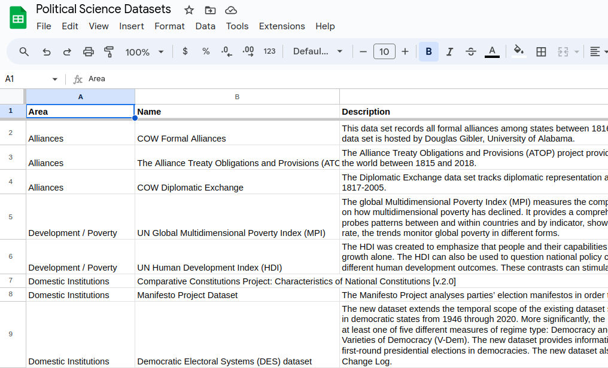
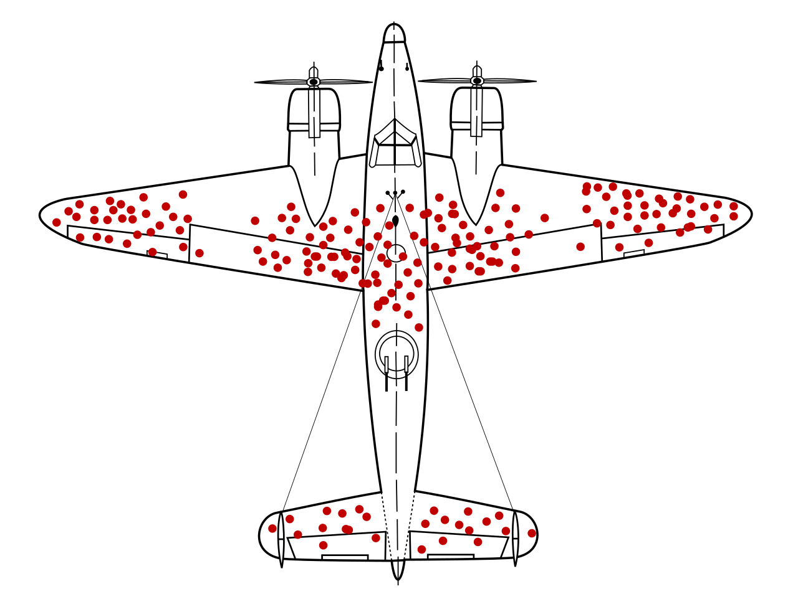
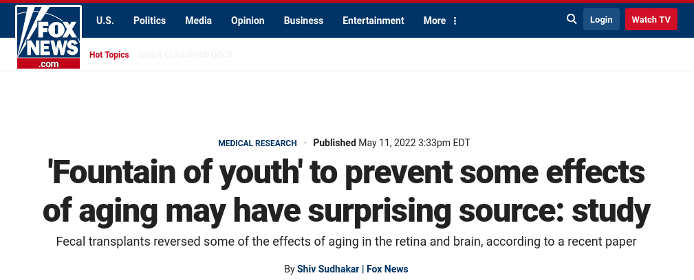
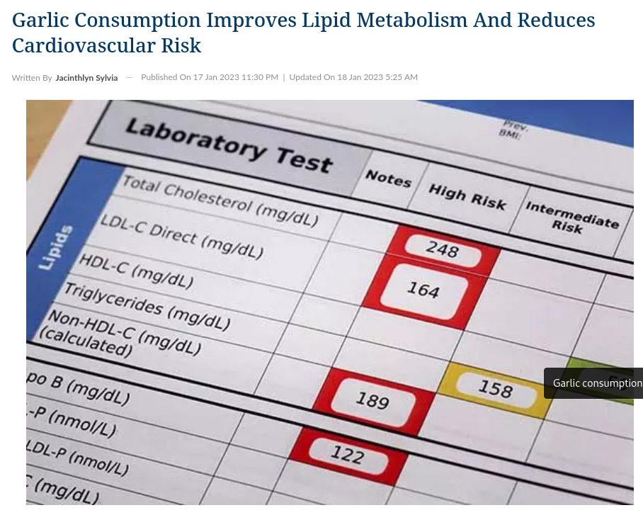

---
output:
  xaringan::moon_reader:
    css: ["default", "extra.css"]
    lib_dir: libs
    seal: false
    nature:
      highlightStyle: github
      highlightLines: true
      countIncrementalSlides: false
      ratio: '16:9'
---

```{r, echo = FALSE, warning = FALSE, message = FALSE}
##xaringan::inf_mr()
## For offline work: https://bookdown.org/yihui/rmarkdown/some-tips.html#working-offline
## Images not appearing? Put images folder inside the libs folder as that is the main data directory

library(tidyverse)
library(readxl)
library(stargazer)
##library(kableExtra)
##library(modelr)

knitr::opts_chunk$set(echo = FALSE,
                      eval = TRUE,
                      error = FALSE,
                      message = FALSE,
                      warning = FALSE,
                      comment = NA)
```

background-image: url('libs/Images/background-data_blue_v3.png')
background-size: 100%
background-position: center
class: middle, inverse

.size80[**Today's Agenda**]

<br>

.size50[

1. Review your puzzles

2. Introduce our data options
]

<br>

.center[.size40[
  Justin Leinaweaver (Spring 2024)
]]

???

## Prep for Class
1. Review Canvas submissions

2. Prep email with link to data options spreadsheet
    - https://docs.google.com/spreadsheets/d/1qLZjrK1QCzzX7W8TIUduyIdcCXSpPP-2r9DxI7VqQwk/edit?usp=sharing
    
    
    
---

background-image: url('libs/Images/background-blue_cubes_lighter3.png')
background-size: 100%
background-position: center
class: middle

.size60[**For Today**]

.size45[
1. Huntington-Klein, Nick. (2022). Chapter 1 - Designing Research

2. **Before class** submit a news article (or other evidence) to Canvas describing something in the political world you would like to better understand.
]

???

### Did everybody get their news article submitted? e.g. earn their participation point for today

<br>

The chapter I assigned you for today is very much just setting the table.

- Not a ton in chapter 1 that we need to analyze deeply, that will come with the next chapter.

- **SLIDE**: But there is at least one super important idea for our semester so let's highlight it.


---

background-image: url('libs/Images/background-blue_cubes_lighter3.png')
background-size: 100%
background-position: center
class: middle, center

.size60[**Huntington-Klein (2022) Chapter 1**]

.pull-left[

<br>

<br>

.size55["**Research design is hard..."**]
]

.pull-right[
```{r, echo = FALSE, fig.align = 'center', out.width = '100%'}
knitr::include_graphics("libs/Images/02_1-Major_Courses.png")
```
]

???

Ok, I know this doesn't strike you as a deep insight, but humor me!

<br>

Here is a list of the required classes for our major

- This is "the spine" of the major

- The first three introduce you to different area specializations, but more than half focus on training you to become a social scientist. 

<br>

A big part of 160 was designed to help you think like a political scientist.

- e.g. What kinds of questions do we ask? 

- How do we phrase a hypothesis?

- How have other political scientists answered these questions?

<br> 

**SLIDE**: My job this semester is to train you to use empirical observations to answer your own questions.


---

background-image: url('libs/Images/background-blue_cubes_lighter3.png')
background-size: 100%
background-position: center
class: middle

.size60[**Huntington-Klein (2022) Chapter 1**]

.size40[
"Research design is hard, and **just because you want to answer a question doesn’t mean there's necessarily a straightforward way of doing it**.
]

???

Quote part 1

SLIDE: Part 2


---

background-image: url('libs/Images/background-blue_cubes_lighter3.png')
background-size: 100%
background-position: center
class: middle

.size60[**Huntington-Klein (2022) Chapter 1**]

.size40[
"Research design is hard, and just because you want to answer a question doesn’t mean there's necessarily a straightforward way of doing it. 

But the **worst that could happen** is that we’d figure out that the answer will be difficult to get...

The **best that could happen** is that we can answer our question."
]

???

As I hope we started to see last week with our warm-up activities, using data to answer a question means having to grapple with measurement. 

- And thinking critically about measurement means thinking VERY carefully about the kinds of questions we can and cannot answer.

<br>

Many people seem to think that you need fancy statistics knowledge to unpack quantitative research.

- The media especially seems quite infatuated with the illusion of certainty provided by numbers.

<br>

**One of our key lessons this semester is to note that analyzing the research design is almost always WAY more informative than analyzing the statistics!**

- There are tons of "answers" out there, my job is to help you develop the tools to interpret the usefulness of those answers.

### Any questions on the reading?


---

background-image: url('libs/Images/background-blue_cubes_lighter3.png')
background-size: 100%
background-position: center
class: middle

.size60[**Research Proposal Brainstorming**]

???

For today you each brought an article or piece of evidence describing something in the political world you'd like to explore.

- Before we hear what you brought I'd like to help organize the cases with a series of questions.

- For each of these questions take a moment to write down your answer and then we'll present all the cases as answers to these questions.

### Make sense?


---

background-image: url('libs/Images/background-blue_cubes_lighter3.png')
background-size: 100%
background-position: center
class: middle

.size60[**Research Proposal Brainstorming**]

.size45[
1) What is the outcome you'd like to explain?
]

???

Think of the "thing" you selected in your news story or piece of evidence as an outcome in the world.

- e.g. something that is the result of political processes.

- Ex: Why are some people rich and some people poor?

- Ex: Why do wars begin?

All of these are things we need to better understand.

### Make sense?

<br>

Ok, write down, in as simple language as possible, a description of your chosen outcome.

<br>

### Everybody have theirs down?


---

background-image: url('libs/Images/background-blue_cubes_lighter3.png')
background-size: 100%
background-position: center
class: middle

.size55[**Research Proposal Brainstorming**]

.size45[
1) What is the outcome you'd like to explain?

2) Why do you find this outcome interesting?
]

???

Now write down a couple of sentences explaining why you find this outcome interesting.

- What drew your attention to it?

- You're not trying to convince anybody else of anything with this, just sharing why you found it fascinating enough to bring in.

<br>

### Everybody have that?


---

background-image: url('libs/Images/background-blue_cubes_lighter3.png')
background-size: 100%
background-position: center
class: middle

.size55[**Research Proposal Brainstorming**]

.size40[
1) What is the outcome you'd like to explain?

2) Why do you find this outcome interesting?

3) How hard would it be to measure this outcome?
]

???

Now, I want you to take a moment and think critically about the measurement challenge in your outcome.

- How hard would it be to clearly define and measure it?

- Be as specific as you can be here.

<br>

### Everybody have that?


---

background-image: url('libs/Images/background-blue_cubes_lighter3.png')
background-size: 100%
background-position: center
class: middle

.size55[**Research Proposal Brainstorming**]

.size40[
1) What is the outcome you'd like to explain?

2) Why do you find this outcome interesting?

3) How hard would it be to measure this outcome?

4) What is one predictor you believe might explain the variation in this outcome?
]

???

Last question.

What is one predictor in the world that you think could be used to explain this outcome?

<br>

Let's use a toy example

- Let's say your outcome of interest is the grade someone gets in a college class.

### What kinds of predictor variables do you think might explain why some people get As, Bs, Cs, etc?

- (Attendance, aptitude, time to study, etc.)

### Make sense?

Now take a minute to brainstorm predictors for your chosen political outcome.

<br>

Ok, let's hear your cases!


---

background-image: url('libs/Images/background-blue_cubes_lighter3.png')
background-size: 100%
background-position: center
class: middle

```{r, echo = FALSE, fig.align = 'center', out.width = '95%'}

```

???

In your email inbox should be a link to a Google Sheet I've made that includes 50+ data projects with interesting topics and accessible datasets.

<br>

Our big job this semester is to build a research project using these sources

- In terms of that goal, Our first task is to pick one of these data projects as our key outcome to explain.

- e.g. the dependent variable for our class research project.

<br>

### Has everybody been able to access the link?

### Any questions on the set-up of the sheet?


---

background-image: url('libs/Images/background-blue_cubes_lighter3.png')
background-size: 100%
background-position: center
class: middle

.size55[**For Today**]

.size35[
1. Wheelan chapter 7 "The Importance of Data"

2. **Before class** submit your revised proposal to Canvas:
    - What is your research question?
    - What is the data project we would use to measure the outcome of your question?
    - Why is this the right pairing of question and data to begin our class project?
]

???

Ok, everybody take a few minutes to review the proposal options on Canvas.

- Take note of the questions and the projects that intrigue you most

- You don't have to select them in pairs! 
    - We may be able to mix-and-match or tweak
    
<br>

**SLIDE**: Ok, let's circle up and talk!


---

background-image: url('libs/Images/background-blue_cubes_lighter3.png')
background-size: 100%
background-position: center
class: middle

.center[.size55[**A "Good" Research Project Requires a "Good" Question**]]

.pull-left[
.size35[
**Must:**

1. Be answerable, and

2. Improve our knowledge
]]

.pull-right[
.size35[
**Should:**
- Keep It Simple!
- Consider Potential Results
- Consider Feasibility
- Consider Design
- Consider Scale
]]

???

Let's start with the questions (pause the data conversation if possible).

### Which questions stand out for you? Why?

*NOTES on BOARD**

<br>

**SLIDE**: Ultimately, our goal for this semester is to produce a QUANTITATIVE research paper.


---

background-image: url('libs/Images/background-blue_cubes_lighter3.png')
background-size: 100%
background-position: center
class: middle, center

.center[.size50[**A "Good" .textblue[Quantitative] Research Project Requires a "Good" Measure of the Outcome**]]

<br>

```{r, fig.retina = 3, fig.align = 'center', fig.width = 7, fig.height=1.7, out.width='95%'}
## Manual DAG
d1 <- tibble(
  x = c(-3, 3),
  y = c(1, 1),
  labels = c("Predictor", "Outcome")
)

ggplot(data = d1, aes(x = x, y = y)) +
  geom_point(size = 8) +
  theme_void() +
  coord_cartesian(xlim = c(-4, 4)) +
  geom_label(aes(label = labels), size = 7) +
  annotate("segment", x = -1.9, xend = 2.1, y = 1, yend = 1, arrow = arrow())
```

???

In our class we are developing a quantitative research project

- e.g. one that uses data in the form of measurements and amounts

- Answering a research question with data requires translating the question into a conceptual map of variables!

<br>

This is called a Directed Acyclic Graph or DAG
- We'll get MUCH more into this in week 12

In simple terms this map represents how we believe the world actually works between these two variables in a single snapshot in time.
- The arrow represents our hypothesis about causality
- e.g. Students who miss fewer classes get better grades
- e.g. Countries with fewer meaningful elections experience more corruption

This doesn't replace the need for theory!
- We still need theory to explain WHY we believe the arrow points this way, but the DAG allows us to connect our question and theory to the data.

### Make sense?

<br>

The data projects you submitted all represent different options for the outcome variable.
- Finding a good measure of the outcome is the MOST important NEXT part of developing a good research project

### Which data projects stand out for you as the most intriguing outcomes? Why?

*NOTES on BOARD*

<br>


---

background-image: url('libs/Images/02_3-Research_stockart.jpg')
background-size: 100%
background-position: center

???

Ok, let's put it all together!

### What should our research question and outcome data project be?

Given this is a group project, in a sense, I want us to reach consensus on this. 

<br>

*After Project Chosen*

**SLIDE**: Let's open up the codebook together and take a look at how it is organized.


---

background-image: url('libs/Images/02_3-Outcomes.jpg')
background-size: 90%
background-position: top
class: slideblue, bottom, center

.size40[**Useful Measurements Consider**:]

.size35[Subject Variation, Tool and Process Design, and Validation]

???

For Monday your job will be to read the codebook and think critically about the measurements it describes.

- I especially want you to think about the elements of uncertainty we introduced in week 1 of the semester.

- Researchers who aim to provide "useful" measurements must think carefully about the variation in their subjects, the design of their tools and processes and how they can validate their results.

### Any questions or clarifications needed on these elements from week 1?

<br>

For now, let's make sure we understand how the Codebook is structured and organized.

### Talk me through the structure here, how is this organized?

<br>

### Given that your job for Monday is to critically analyze the measurements, which parts of this do we need to focus on and which parts can we skim through?

<br>

**SLIDE**: We'll talk assignment for Monday at the end of class, for now I'd like us to switch over to the Wheelan reading.


---

background-image: url('libs/Images/background-blue_cubes_lighter3.png')
background-size: 100%
background-position: center
class: middle

.pull-left[
```{r, echo = FALSE, fig.align = 'center', out.width = '80%'}
knitr::include_graphics("libs/Images/01_1-naked_stats.jpg")
```
]

.pull-right[
.size45[**Chapter 7**

1. Representative Samples

2. Making Comparisons

3. Data Mining
]

]

???

Now that we have a data project chosen, let's talk about data quality
- e.g. Wheelan ch 7

I like how this chapter flags a few important things we need to be on the lookout for when selecting data for a research project.

<br>

Wheelan starts the chapter by laying out the three types of tasks we typically ask our data to do.

### Any questions or need for clarification on these?

<br>

### I know we haven't read it yet, but which of these tasks do we think our dataset was designed primarily to do?

<br>

**SLIDE**: The much more important part of this chapter for our purposes is in what Wheelan describes as the "Garbage in, garbage out" problem


---

background-image: url('libs/Images/background-blue_cubes_lighter3.png')
background-size: 100%
background-position: center
class: middle, center

.size55[**Some Data is Hot Garbage**]

```{r, echo = FALSE, fig.align = 'center', out.width = '80%'}
knitr::include_graphics("libs/Images/02_3-Trump_Push_Poll.png")
```

???

THIS is not what Wheelan is talking about, but is worth noting.

- Some data is obviously hot garbage with no redeeming value.

- These kinds of push polls are used to generate fundraising contributions not measure anything serious.


---

background-image: url('libs/Images/02_3-garbage-in-garbage-out.webp')
background-size: 90%
background-position: top
class: middle, bottom, center, slideblue

.size50[Selection Bias, Publication Bias, Recall Bias, Survivorship Bias, Healthy User Bias]

???

Wheelan gives us a series of biases we need to be aware of and try to avoid in our own research.

- I think these are important examples, BUT...

<br>

HOWEVER, I go back to our discussion from week 1 when we measured your heights.

- In most cases, IFF we understand how a measure was derived, we can extract something useful from it.

- Even our attempts to measure the classes avg height gave us a confident enough result to know you all fit through the door!

<br>

Now, before I set you loose in analyzing the first codebook let's discuss these examples of things we need to be aware of when evaluating a data project or research finding.


---

background-image: url('libs/Images/background-blue_cubes_lighter3.png')
background-size: 100%
background-position: center
class: middle, center

.size50[.content-box-blue[**Selection Bias**]]

```{r, echo = FALSE, fig.align = 'center', out.width = '80%'}
knitr::include_graphics("libs/Images/02_3-Billionaire_habits.png")
```

```{r, echo = FALSE, fig.align = 'center', out.width = '80%'}
knitr::include_graphics("libs/Images/02_3-happy_kids.png")
```

???

### Per the reading, what is selection bias?
- (occurs when individuals or groups in a study differ systematically from the population of interest leading to a systematic error in an association or outcome.)

<br>

### How do we avoid this problem in our own research?

#### - Can we tweak our research question to help avoid this bias?

1. Be clear about WHO you are studying and WHY
    - Start by defining your population of interest, and
    - Make sure your data sample reflects that whole population

2. Be VERY careful when designing questions that focus on subsets of a population
    - You might accidentally be cherry-picking your data.
    
3. Make sure to study your observations that are missing data!
    - Do the people or countries missing data look different from the rest of the sample? That's a bad sign!
    - **SLIDE**: Let's dig into this third one...


---

background-image: url('libs/Images/background-blue_cubes_lighter3.png')
background-size: 100%
background-position: center
class: middle, center

.size50[.content-box-blue[**Survivorship Bias**]]

<br>

```{r, echo = FALSE, fig.align = 'center', out.width = '62%'}

```

???

Out of chapter order, but since survivorship bias IS a form of selection bias let's discuss it now.

### Per the reading, what is Survivorship Bias?
- (Survivorship bias or survival bias is the logical error of concentrating on entities that passed a selection process while overlooking those that did not.)

- (Survivorship bias is a type of sample selection bias that occurs when an individual mistakes a visible successful subgroup as the entire group.)

### Anybody seen this famous figure before? Know the story of it?

- Long story very short, during WWII the US was focused on finding ways to reduce aircraft casualties
    - e.g. Too many planes getting shot down

- This diagram represents the most common damage observed on planes that made it back to base.
    - The US military’s conclusion was simple: Since the wings and tail are obviously vulnerable to receiving bullets we need to increase the armor on them

- The statistician Abraham Wald stepped in and stopped this nonsense.
    - Clearly this diagram shows us that bullet holes in the wings and tail DON'T stop the pilots from getting home safely!
    - Wald saw this diagram and concluded the armor was needed on the engines!

- Survivorship Bias: The sample here ONLY included the planes that made it home safely, NOT the ones shot down.
    - "In other words what their diagram of bullet holes actually showed was the areas their planes could sustain damage and still be able to fly and bring their pilots home" [LINK](https://mcdreeamiemusings.com/blog/2019/4/1/survivorship-bias-how-lessons-from-world-war-two-affect-clinical-research-today).


---

background-image: url('libs/Images/background-blue_cubes_lighter3.png')
background-size: 100%
background-position: center
class: middle, center

.size35[.content-box-blue[**Selection/Survivorship Bias**]]

```{r, echo = FALSE, fig.align = 'center', out.width = '75%'}
knitr::include_graphics("libs/Images/02_3-consumption-co2-emissions.svg")
```

???

Because this is a form of the selection bias problem we talked about before we still rely on the fixes we just talked about.

- HOWEVER, I include this to reinforce its importance in your minds and to warn you that this bias sneaks in EVERYWHERE!

<br>

I have often heard people speak conclusively about which countries emit the most CO2 into the atmosphere and in very specific amounts.
- This map is designed to help us think about those emissions and how trade influences them
- In other words, do richer countries look "cleaner" because they are outsourcing polluting factories to poor countries.

### This is an incredibly important question but what is one of the biggest obstacles to answering it?
- (We have almost ZERO data on the countries of Africa!)

I'm not asking you to pretend Africa is the problem in this climate change problem, BUT how do we answer questions about pollution outsourcing if we lack an entire continent's worth of data???

<br>

The world is a messy place and we almost never have data on a completely representative sample.

- Often our samples exclude poor countries and peoples.

You have to be careful when drawing out big conclusions using samples missing specific types of people, places or thing.

### Make sense?


---

background-image: url('libs/Images/background-blue_cubes_lighter3.png')
background-size: 100%
background-position: center
class: middle, center

.size50[.content-box-blue[**Publication Bias**]]

<br>

```{r, echo = FALSE, fig.align = 'center', out.width = '90%'}

```

???

### Per the reading, what is publication bias?
- (Studies with crazy or unexpected findings more likely to get published)

<br>

### How do we avoid this problem in our own research?
#### - Can we tweak our research question to help avoid this bias?

This is where robustness and validation checks prove so important.

- Unexpected findings can be very exciting because you are changing what we thought we knew about the world, HOWEVER...

- The more unexpected the result, the higher the burden is on YOU to show that your research design is not accidentally creating it,

- The more unexpected the result, the greater the need for you to show your findings replicate (new samples, new approaches), AND

- The more unexpected the result, the more important you can show that you are building using data that is consistent with other sources of the same things.


---

background-image: url('libs/Images/background-blue_cubes_lighter3.png')
background-size: 100%
background-position: center
class: middle, center

.size50[.content-box-blue[**Publication Bias**]]

<br>

```{r, echo = FALSE, fig.align = 'center', out.width = '70%'}
knitr::include_graphics("libs/Images/02_3-publication_bias.jpg")
```

???

A second form of the publication bias problem is also known as the file drawer problem.

- Research with null results don't tend to get published so we don't hear about the studies showing no relationships.

- This means it's hard to evaluate research with strong findings because we don't know if others have found the opposite or no effect.

The most nefarious version of this is the researcher who runs ten tests and only reports the one that shows the key finding.

- This is, unfortunately, way too common in the world.


---

background-image: url('libs/Images/background-blue_cubes_lighter3.png')
background-size: 100%
background-position: center
class: middle, center

.size50[.content-box-blue[**Recall Bias**]]

<br>

```{r, echo = FALSE, fig.align = 'center', out.width = '55%'}

```

???

### Per the reading, what is Recall Bias?
- (A type of bias that occurs when participants in a research study or clinical trial do not accurately remember a past event or experience or leave out details when reporting about them.)

<br>

### How do we avoid this problem in our own research?
#### - Can we tweak our research question to help avoid this bias?

<br>

Self-reported data is incredibly hard to rely upon.
- Peoples' memories are fallible and malleable!

<br>

All the more important to reinforce these kinds of data with other research designs (controlled experiments) that allow external measurement in reliable ways.


---

background-image: url('libs/Images/background-blue_cubes_lighter3.png')
background-size: 100%
background-position: center
class: middle

.size55[**For Wednesday**]

.size40[
1. Huntington-Klein, Nick. (2022). Chapter 2 "Research Questions"

2. **Before class** submit your choice for:
    - Your pick for our first data project, and
    
    - An explanation why you'd like us to select it (3-5 sentences).
]

???

You have a reading and an assignment.

- The reading is meant to help you complete the assignment.

<br>

The explanation is your short argument to the class for why we should agree to pick the project you have selected.

### Questions on the assignment?

Excellent! Get to it!
