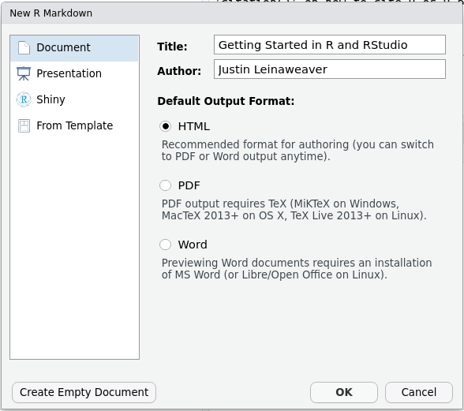
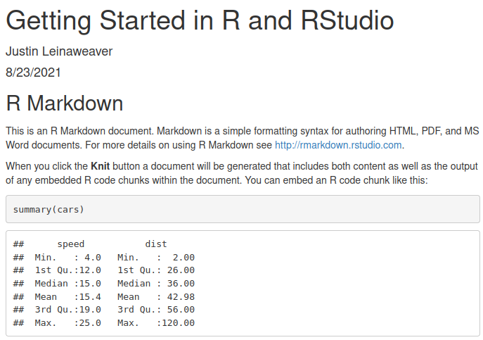
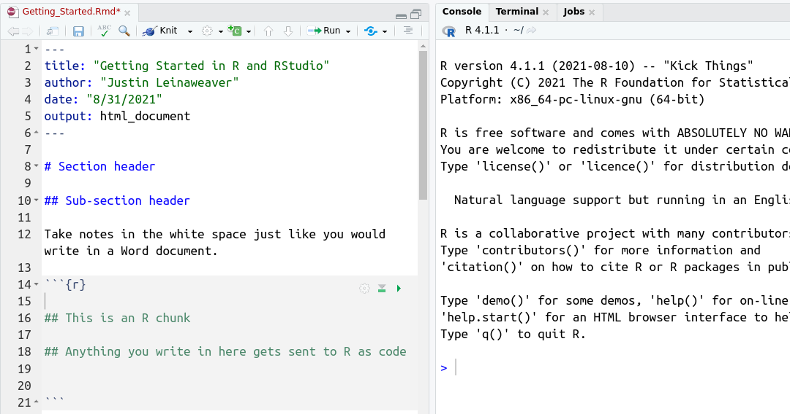
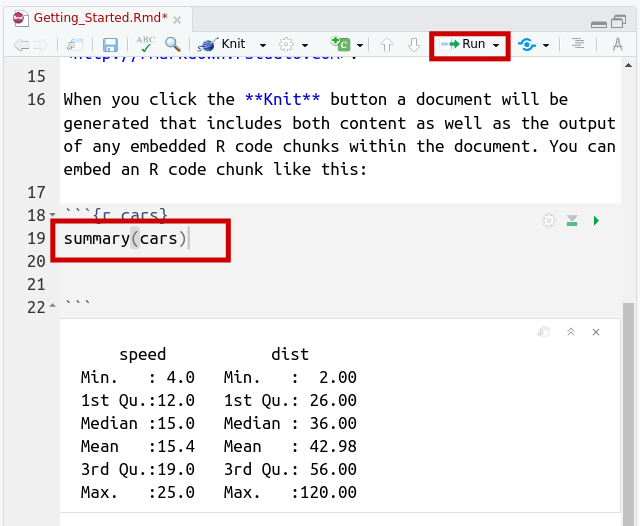
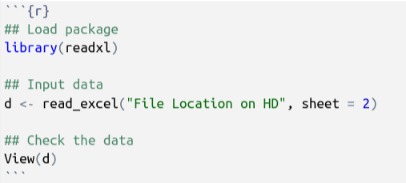

---
output:
  xaringan::moon_reader:
    css: ["default", "extra.css"]
    lib_dir: libs
    seal: false
    nature:
      highlightStyle: github
      highlightLines: true
      countIncrementalSlides: false
      ratio: '16:9'
---

```{r, echo = FALSE, warning = FALSE, message = FALSE}
##xaringan::inf_mr()
## For offline work: https://bookdown.org/yihui/rmarkdown/some-tips.html#working-offline
## Images not appearing? Put images folder inside the libs folder as that is the main data directory

library(tidyverse)
library(readxl)
library(stargazer)
##library(kableExtra)
##library(modelr)

knitr::opts_chunk$set(echo = FALSE,
                      eval = TRUE,
                      error = FALSE,
                      message = FALSE,
                      warning = FALSE,
                      comment = NA)
```

class: slideblue

.size80[**Today's Agenda**]

<br>

.size40[

1. Configure RStudio

2. Set up a basic file structure

3. Explore the basics of RStudio

]

<br>
<br>

.center[.size40[
  Justin Leinaweaver (Fall 2021)
]]


---

class: middle, slidegreen

.pull-left[
.size50[

1. Open RStudio

2. "Tools" &rarr; "Global Options"

3. Uncheck all boxes in "General"

]]

.pull-right[

```{r, fig.align='center', out.width='100%'}
knitr::include_graphics("libs/Images/02_1-global_options1.png")
```

]


---

class: middle, slidegreen

.pull-left[

.size50[
1. "Code" page

2. &#10004; soft-wrap R source files

]]

.pull-right[

```{r, fig.align='center', out.width='100%'}
knitr::include_graphics("libs/Images/02_1-global_options2.png")
```

]


---

class: middle, slidegreen

.pull-left[
.size50[

1. "Pane Layout" page

2. Move the "Console" to the top-right box

]]

.pull-right[

```{r, fig.align='center', out.width='100%'}
knitr::include_graphics("libs/Images/02_1-global_options3.png")
```

]


---

class: middle, slidegreen

.pull-left[
.size50[
1. "Rmarkdown" page

2. Uncheck "Show output inline..."

]]

.pull-right[

```{r, fig.align='center', out.width='100%'}
knitr::include_graphics("libs/Images/02_1-global_options4.png")
```

]


---

```{r, fig.align='center', out.width='85%'}
knitr::include_graphics("libs/Images/02_1-RStudio_setup.png")
```


---

class: middle, slidegreen

.size50[**How to Organize your Data**]

```{r, fig.align='center', out.width='65%'}
knitr::include_graphics("libs/Images/02_1-Folders.png")
```

.size40[
Include:

+ A top-level folder for the class,
+ A folder for your general notes, and 
+ Separate folders for each data project.
]


---

class: middle, slideblue

.size60[.center[**Let's make our first report!**]]

.pull-left[
.size40[
1. "File" &#8594; "New File" &#8594; "R Markdown"

2. Title: Getting Started in R and RStudio

3. Author: Your Name

]]

.pull-right[

```{r, fig.align='center', out.width='100%'}

```

]


---

class: middle, slideblue

```{r, fig.retina=3, fig.align='center', out.width='55%'}

```

.size40[
1. Save new script as "Getting_Started.Rmd" in your general notes folder

2. "File" &#8594; "Knit Document"

]


---

class: slideblue

```{r, fig.retina=3, fig.align='center', out.width='100%'}

```


---

class: middle, slideblue

.size70[.center[**Using R as a calculator**]]

<br>

.size40[
```{r}
tribble(
  ~Function, ~Description,
  "x + y", "Addition",
  "x - y", "Subtraction",
  "x * y", "Multiplication",
  "x / y", "Division",
  "x ^ y", "Exponentiation"
) |>
  knitr::kable(format = "html")
```
]


---

class: middle, slideblue

.code180[
```{r, echo=TRUE, eval=FALSE}
## Addition and subtraction
151 + 13 - 224

## Division
831/12

## Exponentiation
5^12

## Multiplication, division and parentheses
312 * (23/154)
```
]


---

class: middle, slidepurple

.size50[**Let's practice by exploring Covid's R<sub>e</sub>**]

<br>

.size40[
R<sub>0</sub> = Reproduction rate in a naive population

+ R<sub>0</sub> > 1 Virus spreading

+ R<sub>0</sub> < 1 Virus shrinking
]

--

<br>

.size40[
Estimated Number of Cases = R<sub>0</sub><sup>Time</sup>
]


---

```{r, fig.retina=3, fig.align = 'center', fig.asp=0.618, fig.width=6, out.width='95%', cache=TRUE}
library(gganimate)

## R = 2
d <- tibble(
    time = 1:10,
    R2 = 2^time,
    R3 = 3^time,
    R4 = 4^time
)

d |>
  filter(time < 8) |>
  ggplot(aes(x = time, y = R2)) +
  geom_line(size = 1.2) +
  theme_bw() +
  labs(x = "Time", y = "Infected", title = expression(paste(R[0], "= 2"))) +
  scale_x_continuous(breaks = 1:7) +
  geom_label(aes(label = R2), size = 5) +
  transition_reveal(time)
```


---

```{r, fig.retina=3, fig.align = 'center', fig.asp=0.618, fig.width=6, out.width='95%', cache=TRUE}
## R = 2 vs 3
new1 <- d |>
  filter(time < 8) |>
  pivot_longer(cols = R2:R3, names_to = "R_0", values_to = "Sick") |>
  filter(R_0 == "R3")

d |>
  filter(time < 8) |>
  pivot_longer(cols = R2:R3, names_to = "R_0", values_to = "Sick") |>
  ggplot(aes(x = time, y = Sick, color = R_0)) +
  geom_line(size = 1.2) +
  theme_bw() +
  labs(x = "Time", y = "Infected", title = expression(paste(R[0], "= 3")), color = "") +
  scale_x_continuous(breaks = 1:7) +
  annotate("label", x = 6.75, y = 150, label = "128", size = 4.5) +
  scale_color_manual(values = c("black", "red")) +
  geom_label(data = new1, aes(label = Sick)) +
  guides(color = "none") +
  transition_reveal(time)
```


---

```{r, fig.retina=3, fig.align = 'center', fig.asp=0.618, fig.width=7, out.width='95%', cache=TRUE}
## R = 2 vs 3 vs 4
new1 <- d |>
  filter(time < 8) |>
  pivot_longer(cols = R2:R4, names_to = "R_0", values_to = "Sick") |>
  filter(R_0 == "R4")

d |>
  filter(time < 8) |>
  pivot_longer(cols = R2:R4, names_to = "R_0", values_to = "Sick") |>
  ggplot(aes(x = time, y = Sick, color = R_0)) +
  geom_line(size = 1.2) +
  theme_bw() +
  labs(x = "Time", y = "Infected", title = expression(paste(R[0], "= 4")), color = "") +
  scale_x_continuous(breaks = 1:7) +
  annotate("label", x = 6.8, y = 128, label = "128", size = 4.5) +
  annotate("label", x = 6.8, y = 2187, label = "2,187", size = 4.5, color = "red") +
  scale_color_manual(values = c("black", "red", "blue")) +
  geom_label(data = new1, aes(label = Sick)) +
  guides(color = "none") +
  transition_reveal(time)
```


---

class: middle, slidepurple

.size60[**How does vaccination help?**]

<br>

.size40[
R<sub>e</sub> = R<sub>0</sub> x s<sub>p</sub>

+ R<sub>e</sub> is the effective R value

+ R<sub>0</sub> is the reproduction rate in a naive population

+ s<sub>p</sub> is the proportion of the population susceptible to the disease
]


---

class: middle, slidepurple

.size50[**What % susceptible gets us R<sub>e</sub> < 1?**]

<br>

.size40[
R<sub>e</sub> = 3 x s<sub>p</sub>

+ R<sub>e</sub> is the effective R value

+ R<sub>0</sub> for alpha Covid-19 &#8773; 3

+ s<sub>p</sub> is the proportion of the population susceptible to the disease
]


---

class: middle, slidepurple

.size50[**What % susceptible gets us R<sub>e</sub> < 1?**]

<br>

.size40[
R<sub>e</sub> = 3 x .33 = 0.99

+ R<sub>e</sub> is the effective R value

+ R<sub>0</sub> for alpha Covid-19 &#8773; 3

+ s<sub>p</sub> is the proportion of the population susceptible to the disease
]


---

class: middle, slidepurple

.size50[**How do vaccines impact the R<sub>0</sub>?**]

<br>

.size40[
R<sub>e</sub> = R<sub>0</sub> x (1 - V<sub>r</sub> x V<sub>e</sub>)

+ V<sub>r</sub> is the vaccination rate

+ V<sub>e</sub> is the vaccination effectiveness rate
]


---

class: middle, slidepurple

.size50[**How do vaccines impact the R<sub>0</sub>?**]

<br>

.size40[
R<sub>e</sub> = R<sub>0</sub> x (1 - V<sub>r</sub> x V<sub>e</sub>)

+ The delta variant's R<sub>0</sub> is &#8773; 8.5

+ V<sub>r</sub> &#8773; 46% in Greene County

+ V<sub>e</sub> &#8773; 75%
]


---

class: middle, slidepurple

.size50[**How do vaccines impact the R<sub>0</sub>?**]

<br>

.size40[
R<sub>e</sub> = 8.5 x (1 - .46 x .75) = 5.6

+ The delta variant's R<sub>0</sub> is &#8773; 8.5

+ V<sub>r</sub> &#8773; 46% in Greene County

+ V<sub>e</sub> &#8773; 75%
]


---

```{r, fig.retina=3, fig.align = 'center', fig.asp=0.618, fig.width=9, out.width='90%'}
## R = 5.6
d2 <- tibble(
    time = 1:10,
    R5_6 = round(5.6^time,0)
)

d2 |>
  filter(time < 8) |>
  ggplot(aes(x = time, y = R5_6)) +
  geom_line(size = 1.2) +
  theme_bw() +
  labs(x = "Time", y = "Infected", title = expression(paste(R[0], "= 5.6"))) +
  scale_x_continuous(breaks = 1:7) +
  geom_label(aes(label = R5_6), size = 5)
```


---

class: middle, slidepurple

.size50[**R<sub>e</sub> = 8.5 x (1 - .46 x .75) = 5.6**]

<br>

.size40[
1. What would the effect be of increasing V<sub>e</sub> with a booster to 95%?

2. What would the effect be of increasing V<sub>r</sub> to Greene County's target (70%)?

3. What if we do both?
]


---

class: middle, slidepurple

.size50[**R<sub>e</sub> = 8.5 x (1 - .46 x .75) = 5.6**]

<br>

.size40[
1. Booster? R<sub>e</sub> = 4.8

2. More vaccinations? R<sub>e</sub> = 4.0

3. Both? R<sub>e</sub> = 2.8
]


---

class: middle, slidepurple

.size50[**Using R for simple relationships**]

.size40[
```{r}
tribble(
  ~Function, ~Description,
  "x < y", "Less than",
  "x <= y", "Less or equal to", 
  "x > y", "Greater than", 
  "x >= y", "Greater or equal to",
  "x == y", "Equal to",
  "x != y", "Not equal to"
  ) |>
  knitr::kable(format = "html")
```
]


---

class: middle, slidepurple

.size40[**Using R for simple relationships**]

.code140[
```{r, echo=TRUE, eval=FALSE}
## Less than
22 < 234

## Less than or equal to
718 <= 5800

## Greater than
67 > 5366

## Greater than or equal to
67 >= 5366

## Equal to
7 == 32

## Not equal to
7 != 32
```
]


---

.size60[**Example**]

8.5 x (1 - ?% x .95) < 1

What proportion of the population must be vaccinated (with a booster) to get our R<sub>e</sub> below 1?


---

```{r, fig.retina=3, echo = TRUE}
## Save a vector of vaccination rate targets as 'x'
x <- c(.75, .80, .85, .90, .95)
```


---

```{r, fig.retina=3, echo = TRUE}
## Save a vector of vaccination rate targets as 'x'
x <- c(.75, .80, .85, .90, .95)
```

```{r, echo = TRUE}
## Input the new object into our formula
8.5 * (1 - x * .95)
```


---

.size40[Code for your report on our discord server]

```{r, echo = TRUE}
## Save a vector of vaccination rate targets as 'x'
x <- c(.75, .80, .85, .90, .95)
```

```{r, echo = TRUE}
## Input the new object into our formula
8.5 * (1 - x * .95)
```

```{r, echo = TRUE}
## Add an inequality to the formula
8.5 * (1 - x * .95) < 1
```


---

.size40[**Running your R code (without knitting)**]

.pull-left[

+ Option 1: "Run", "Run selected lines"

+ Option 2: Ctrl + Enter

+ On Mac: Cmd + Enter

]

.pull-right[

```{r, fig.retina=3, fig.align='center', out.width='100%'}

```

]


---

.size40[**Packages make R even more powerful**]

```{r, echo=TRUE, eval=FALSE}
## Inputting Excel Data with readxl

## Installation only necessary one time
install.packages("readxl")

## Run the library command when you 
## want to use the package
library(readxl)
```


---

.size50[**Setting up our first data project**]

1. Save the **tidy** data in your first data project folder

2. Create a new Rmd file: `Analyzing_Freedom_House.Rmd`

```{r, fig.retina=3, fig.align='center', out.width='100%'}

```


---

Assignment for Tuesday

Wheelan ch2

Johnson 2012 p361-376 (mathematical details on descriptive statistics)


