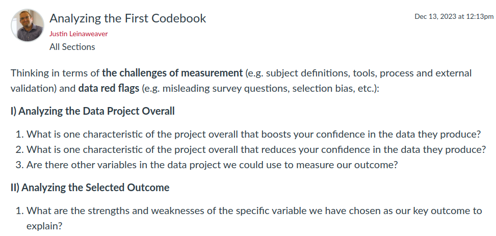

## Today's Agenda {background-image="Images/background-data_blue_v3.png" .center}

```{r}
library(tidyverse)
library(readxl)
library(kableExtra)
library(modelsummary)
```

<br>

<br>

**Select the Outcome for our Class Research Project**

<br>

<br>

::: r-stack
Justin Leinaweaver (Spring 2025)
:::

::: notes
Prep for Class

1. Review Canvas submissions

2. Class CANNOT pick last year's data project: The Gender Inequality Index

<br>

Big day today!

- We need to pick the project that will serve as our focus for the rest of the semester.
:::


## For Today {background-image="Images/background-blue_triangles_flipped.png" .center}

```{r, echo = FALSE, fig.align = 'center', out.width = '100%'}
knitr::include_graphics("Images/02_2-Assignment.png")
```

::: notes
**Has everybody submitted their proposal to Canvas?**

<br>

Alright, today you'll take turns pitching us on your proposals

- I'll try to load the news story you selected on the screens at the front of the room

- At the end we'll choose one (or merge a few) and that will be our primary focus for the term

<br>

### Questions before we start?

- Let's go!

- *ON BOARD: Build a topic list to refer back to*

<br>

*Make sure by the end of class we have:*
- A draft research question
- A data project for the outcome with a shared link to the codebook
- A first choice of variable that measures the outcome of our project
:::


## For Next Class {background-image="Images/background-blue_triangles_flipped.png" .center}

```{r, echo = FALSE, fig.align = 'center', out.width = '100%'}

```

::: notes

For Monday we all need to analyze the Codebook!

### Questions on the assignment?

:::