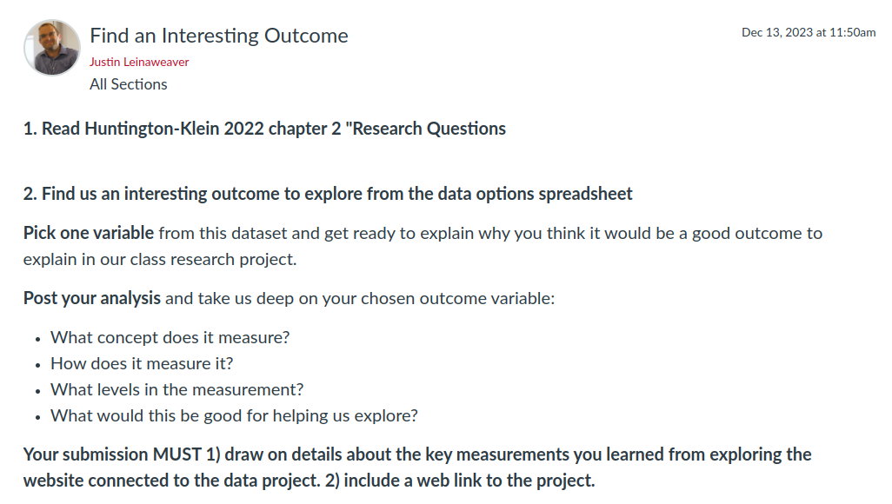
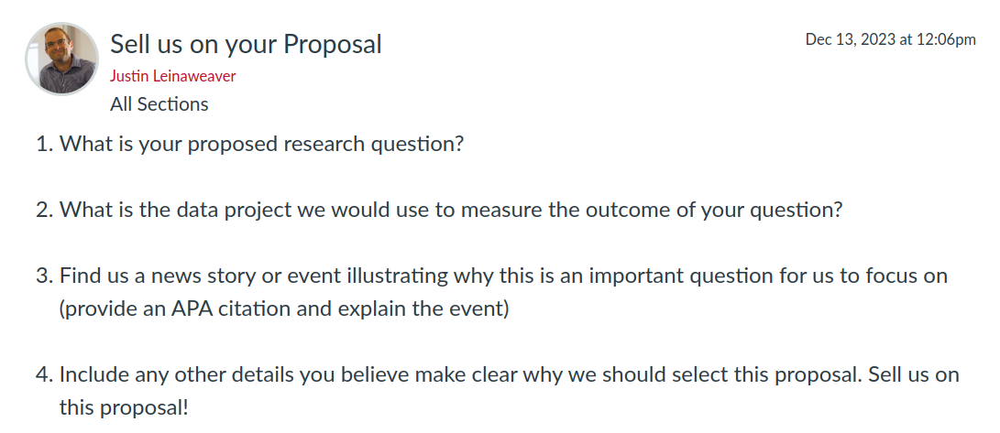

## Today's Agenda {background-image="libs/Images/background-data_blue_v3.png" .center}

```{r}
library(tidyverse)
library(readxl)
library(kableExtra)
library(modelsummary)
```

<br>

<br>

**Developing "good" research questions**

<br>

<br>

::: r-stack
Justin Leinaweaver (Spring 2024)
:::

::: notes
Prep for Class

1. Bring paper to class

2. Review canvas submissions

3. Links for today
    - [Huntington-Klein 2022 chapter 2 "Research Questions"](https://theeffectbook.net/ch-ResearchQuestions.html)
    - [Link to Data Sets Spreadsheet](https://docs.google.com/spreadsheets/d/1qOBt2M_yoIkeeuw6x3MMBMjEQsPquGDDkWUYF-aNtBo/edit#gid=0)

<br>

Let's kick things off with a refresher from last class!

- We started last class by discussing the first chapter from Huntington-Klein on research design

<br>

In simplest terms, research design is the process by which we learn how to connect research questions with data

- **SLIDE**: And important to remember...
:::


## {background-image="libs/Images/background-slate_v2.png" .center}

"Research design is hard, and just because you want to answer a question doesn’t mean there’s necessarily a straightforward way of doing it. 

<br>

But the worst that could happen is that we’d figure out that the answer will be difficult to get. Then, at least, we’ll know.

<br>

The best that could happen is that we can answer our question. And we do. And then we win a Nobel prize" (Huntington-Klein Chapter 1).

::: notes

Research design is hard.

- We know from our work last week that measurements are always uncertain

- Research design is the process of adapting uncertain measures to a specific research question

<br>

So, don't be daunted by this.

- Just keep working at it and it will inevitably get easier.

<br>

**SLIDE**: Last class we also discussed the Wheelan chapter's treatment of a series of "red flags" warning us about different ways data could mislead us.

:::


## {background-image="libs/Images/background-slate_v2.png" .center}

```{r, echo = FALSE, fig.align = 'center'}
knitr::include_graphics("libs/Images/02_3-garbage-in-garbage-out.webp")
```

<br>

Survey Design Biases, Selection Bias, Publication Bias, Recall Bias, Survivorship Bias, Healthy User Bias, and more

::: notes

**Give me an example of one of these forms of bias in action**

- **What should we be on the lookout for?**

:::


## {background-image="libs/Images/background-slate_v2.png" .center}

```{r, echo = FALSE, fig.align = 'center'}

```

::: notes

Today we continue our work in developing a class research project.

- As a first step we are focusing on data sources and research questions.

<br>

### Has everybody submitted their choice and explanation?

<br>

To get us started today I'd like us all to hear what you picked and why.

- So, let's go around the room and you can walk us through what you picked and why.

- Class, give feedback as you listen
    - Is there anything that needs clarification?
    
<br>

At this point, I don't want anyone abandoning their chosen data!

- We'll focus in on a single project as a class on Friday

<br>

Today's job is to develop a research question for your chosen outcome variable

- **SLIDE**: Stay focused on what you brought today and see it through!
:::


## "Research Questions" {background-image="libs/Images/background-slate_v2.png" .center}

**(Huntington-Klein 2022)**

<br>

::: {.r-fit-text}
**What is a research question?**
:::

::: notes

Today's reading is all about helping us see the difference between questions and RESEARCH questions.

- A very important distinction.

<br>

### Per the reading, what is the first key element that distinguishes a "question" from a "research question"?

- (**SLIDE**)

:::


## "Research Questions" {background-image="libs/Images/background-slate_v2.png" .center}

**(Huntington-Klein 2022)**

<br>

**A research question:**

1. Can be answered

::: notes

It means that it’s possible for there to be some set of evidence in the world that, if you found it, your question would have a believable answer. 

- The book chapter gives an example: what is the best James Bond movie?

<br>

### Why can't that be answered?

### - What if we collected survey data asking people to rank their favorite Bond movies in order? Wouldn't that do it?

- (That's a measure of "popularity" not "quality"!)

<br>

### Give me some examples of other questions that cannot be answered with empirical data.

<br>

### Everybody clear on the first criteria?

<br>

### What is the second key element that distinguishes a "question" from a "research question"?

- **SLIDE**

:::


## "Research Questions" {background-image="libs/Images/background-slate_v2.png" .center}

**(Huntington-Klein 2022)**

<br>

**A research question:**

1. Can be answered

2. Improves our understanding of how the world works.

::: notes

A good research question leads to an answer that will improve your understanding of how the world works.
- It should inform theory in some way.

<br>

### Alright then, what is "theory"?
- (Theory just means that there’s a *why* underpinning your view of the world)

- Theory explains why we think the relationships we see in the world are happening 

<br>

**SLIDE**: You've encountered a TON of theories in your time in poli sci so far
:::


## {background-image="libs/Images/02_2-soldier-British-trench-Western-Front-World-War.webp" .center}

::: notes

Essentially, the entire specialization of International Relations exists to propose and test alternative theories of why wars happen.

- Given that war is a devastating and risky activity, it is a puzzle that states keep starting them!

<br>

Selected IR theories to explain war:

- Neorealism: War is the result of states' worrying about their security

- Institutionalism: War is the result of survival fears overwhelming our institutions of international cooperation 

- Economic liberalism: War should be less likely in a world of interdependent trade and specialization

- and on, and on

<br>

None of these theories can be proven, BUT each makes specific predictions about the world and our research questions can help us set up projects to test them.

- Neorealists might propose a research question like: Does the risk of conflict increase when states invest in purely defensive technologies only? e.g. Do security dilemmas actually exist?

- Institutionalists might propose a research question like: Does UN involvement in a conflict zone shorten wars?

- And economic liberals might propose a research question like: Do states that participate more in international trade specialize in fewer types of goods and services?

<br>

### Does this theory piece make some sense?

:::


## "Research Questions" {background-image="libs/Images/background-slate_v2.png" .center}

**(Huntington-Klein 2022)**

<br>

**A research question:**

1. Can be answered

2. Improves our understanding of how the world works.

::: notes

You almost certainly have a million intuitions about how and why the world works like it does.

- Our aim is to design research projects that force us to clarify these assumptions in order to test them with empirical data.

- A good research question helps us begin that process

<br>

I especially like the advice from Huntington-Klein that: "A good test for whether a research question informs theory is to imagine that you find an unexpected result, and then wonder whether it would make you change your understanding of the world."

- If the data shows us that defensive military investments don't lead to war I would certainly hope that neorealists would reconsider their theory

<br>

### Any questions on these two basic requirements of a research question?

<br>

So, all academic projects in quantitative political science are framed as an answer to a research question.

- The question itself MUST be answerable with data and the answer must help us better understand the world (support or lead to revision of a theory).
:::


## Propose a research question using the data you selected before class{background-image="libs/Images/background-slate_v2.png" .center}

<br>

- Can it be answered?

- Does its answer improve our understanding of the world?

::: notes

Let's now apply this first part to your work for today.

<br>

Everybody take a moment to reflect on the data project they chose and the reasons that led you to it. 

- Then, on a piece of paper write down your proposed research question AND a short explanation of how it meets BOTH criteria

- Force yourself to write this down on paper, not electronically. 

- Writing by hand represents a different style of thinking and we want to track the revisions you make during class today.

<br>

### Everybody have their question and argument written down?

<br>

Go around the room and hear everyone's proposed question

- Make sure everybody has a question that can be answered and whose answer would improve our knowledge of the world. 

- For now, focus just on these two criteria only!

<br>

Now, take a moment to reflect on the feedback you received and the questions you saw and use that experience to revise your question.

<br>

**SLIDE**: Once you have a research question, we now have to make it a "good" one.
:::

    
    
## "Research Questions" {background-image="libs/Images/background-slate_v2.png" .center}

**(Huntington-Klein 2022)**

<br>

**How Do You Know if You’ve Got a Good One?**

:::: {.columns}
::: {.column width="50%"}
- Consider Potential Results

- Consider Feasibility

- Consider Scale
:::

::: {.column width="50%"}
- Consider Design

- Keep It Simple!
:::
::::

::: notes
Walk me through each of these. 

### What does each criteria mean and how do I use it to make my research question "better"?

- **Consider Potential Results**: "If you can’t say something interesting about your potential results, that probably means your research question and your theory aren’t as closely linked as you think!"

- **Consider Feasibility**: "A research question should be a question that can be answered using the right data, if the right data is available. But is the right data available?"
    - You picked the data project first so this should be done!

- **Consider Scale**: "What kind of resources and time can you dedicate to answering the research question? ... Given the confines of, say, a term paper, you could take some wild swings at that question, but you’re likely to do a much more thorough job answering questions with a lot less complexity."

- **Consider Design**: "So, an important part of evaluating whether you have a workable research question is figuring out if there’s a reasonable research design you can use to answer it. Figuring out whether you do have a reasonable research design is the topic of the rest of this book."

- **Keep It Simple!**: "Answering any research question can be difficult. Don’t make it even harder on yourself by biting off more than you can chew!"

<br>

### Everybody clear on these criteria?

Take a minute to reflect and revise
- Try to revise your question to improve it across these criteria

- You may end up with multiple versions, that's great! Keep them all!

<br>

Ok, let's mix it up again!
- Go around the room and hear all the questions

- Explain to each other how you think your question meets these criteria

- Try to help each other refine/tweak/improve the questions

<br>

Now, take a moment to reflect on the feedback you received and the questions you saw and use that experience to revise your question.
:::


## For Next Class {background-image="libs/Images/background-blue_triangles_flipped.png" .center}

```{r, echo = FALSE, fig.align = 'center', out.width = '100%'}

```

::: notes

Now you have the basic components of a research proposal:
- A research question, and

- A source for the outcome data

<br>

For Friday, I want each of you to submit your proposal to Canvas.

- Give us a compelling argument and evidence for why we should pick your proposal (even if you don't think we should choose it)!

<br>

### Questions on the assignment?
:::