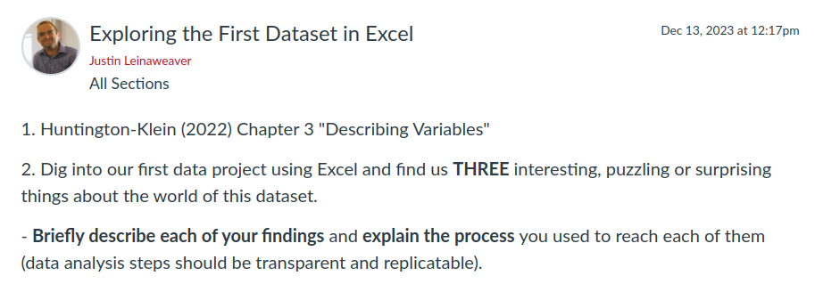

---
output:
  xaringan::moon_reader:
    css: ["default", "extra.css"]
    lib_dir: libs
    seal: false
    nature:
      highlightStyle: github
      highlightLines: true
      countIncrementalSlides: false
      ratio: '16:9'
---

```{r, echo = FALSE, warning = FALSE, message = FALSE}
##xaringan::inf_mr()
## For offline work: https://bookdown.org/yihui/rmarkdown/some-tips.html#working-offline
## Images not appearing? Put images folder inside the libs folder as that is the main data directory

library(tidyverse)
library(readxl)
library(stargazer)
##library(kableExtra)
##library(modelr)

knitr::opts_chunk$set(echo = FALSE,
                      eval = TRUE,
                      error = FALSE,
                      message = FALSE,
                      warning = FALSE,
                      comment = NA)
```

background-image: url('libs/Images/background-data_blue_v3.png')
background-size: 100%
background-position: center
class: middle, inverse

.size80[**Today's Agenda**]

<br>

.size50[
1. Introduce the first report

2. Critically analyze the project's codebook
]

<br>

.center[.size40[
  Justin Leinaweaver (Spring 2024)
]]

???

## Prep for Class
1. Review assignment submissions

2. Publish next board


---

background-image: url('libs/Images/background-blue_triangles2.png')
background-size: 100%
background-class: center
class: middle

.center[.size50[.content-box-blue[**Report 1: Analyzing our Outcome Variable(s)**]]]

.size45[
1. Due Feb 23rd (Canvas "Assignments")

2. PDFs only

3. Support ALL claims with evidence
    - APA formatted in-text citations
    - APA formatted bibliography
]

???

Per the syllabus, your first report is due to be submitted to Canvas on Feb 23rd

- Late submissions lose 10 points per day

<br>

You must submit the report as a pdf file to preserve formatting of figures and tables
- Word allows you to export as pdf

<br>

You must support all claims with evidence which means:
- in-text citations, 

- a bibliography, and 

- APA formatting

<br>

### Questions on those basic elements?

<br>

**SLIDE**: And what goes in the report?


---

background-image: url('libs/Images/background-blue_triangles2.png')
background-size: 100%
background-class: center
class: middle, center

.size80[.content-box-blue[**Report 1**]]

<br>

.size80[**Analyzing our Outcome Variable(s)**]

???

This first report focuses entirely on analyzing our first data project.

- Measurement is the end-all, be-all for any quantitative analysis and so we need to spend time analyzing it BEFORE we use it!

<br>

The report has four prompts and in each one it is your job to make and support an argument.

- Note that these requirements are on the Canvas assignment's page

<br>

**SLIDE**: Let's step through the arguments you'll be making


---

background-image: url('libs/Images/background-blue_triangles2.png')
background-size: 100%
background-class: center
class: middle

.center[.size50[.content-box-blue[**Report 1: Analyzing our Outcome Variable(s)**]]]

<br>

.size45[
1) Why is this project important?
]

???

<br>

1) In Section 1 your job is to sell the importance of this project to an interested reader

- Don't assume the reader is an expert in the subject area

- Don't assume the reader is familiar with the project at all

- This means you have to include enough background info on the project for them to understand your importance argument

--

.size45[
2) How confident should we be in the methodology?
]

???

<br>

2) Section 2 asks you to analyze the uncertainty in the data project and its measurements

- Your report should step through the strengths and weaknesses of the measurements in the project.
    -  Be specific and thorough here

- In other words, I want you to evaluate the sources of uncertainty in the data project, AND

- Discuss the implications of that uncertainty

--

.size45[
3) What do the measures currently show us?
]

???

<br>

3) In Section 3 of your report you will present your analysis of the most recent year available in the dataset

- We'll choose the year for this together based on what's available

--

.size45[
4) How are these measures changing across time?
]

???

<br>

4) Assuming the project gives us data across time, in Section 4 you will present an analysis of how the data has changed across time.

???

<br>

We will spend time in class on each of these elements, but you will have to do work outside class too.

- In addition, I'll give you a full week of classes before the due date to work on the report.

<br>

### Any questions on the structure of the report?


---

background-image: url('libs/Images/background-blue_triangles2.png')
background-size: 100%
background-class: center
class: middle, center

.size70[.content-box-blue[**Report Section 1**]]

<br>

.size60[
**Why is this project important?**
]

???

Let's kick things off with a quick discussion of the argument in Section 1.

<br>

*Small groups brainstorm premises!*

### If you were trying to sell an interested person on the idea that this is an important data project, what would you include in the argument?

<br>

- *Collect ideas ON BOARD*

<br>

**SLIDE**: Things to consider...


---

background-image: url('libs/Images/background-blue_triangles2.png')
background-size: 100%
background-class: center
class: middle

.size40[
.content-box-blue[**Section 1: Why is this project important?**]
 
- What was the project designed to do?

- Who is backing it financially?

- Who are the researchers and what are their credentials?

- Why is it important?

- Has the data been used in the world to accomplish things?
]

???

If I were you, I would think about things like these as I outlined my argument in Section 1.

<br>

### Questions on this?


---

background-image: url('libs/Images/background-blue_triangles2.png')
background-size: 100%
background-class: center
class: middle, center

.size70[.content-box-blue[**Report Section 2**]]

<br>

.size60[
**How confident should we be in the methodology?**
]

???

As I mentioned previously, Section 2 of your paper makes an argument about your confidence in the measures produced by the data project.

- Think of this like our uncertainty discussions from the first week of class.

<br>

**SLIDE**: Let's jump to the work you did before class today that ties very neatly into Section 2 of your paper.


---

background-image: url('libs/Images/background-blue_triangles_flipped.png')
background-size: 100%
background-position: center
class: middle

```{r, echo = FALSE, fig.align = 'center', out.width = '100%'}
knitr::include_graphics("libs/Images/02_3-Assignment.png")
```

???

For today I asked each of you to read the codebook(s) and to reflect on how the researchers converted their ideas into measurements.

- My aim is that by the end of today you each have a list of strengths and weaknesses you can use to write section 2 of the report.

<br>

And remember our key lesson from the first weeks of class: **Don't stress about the math!**

- Research design is WAY more important than the formulas!

<br>

Our focus today is on how the researchers define their ideas and convert them into numbers

- Those choices have a **MUCH** bigger impact than their choice to use harmonic means in constructing an index!

<br>

**SLIDE**: Let's step through some of the big overarching elements that inform our confidence about the data


---

background-image: url('libs/Images/03_1-Source_of_Data.jpg')
background-size: 100%
background-class: center
class: middle

???

Let's begin with the sources of the data being analyzed in this project.

- Small groups, get ready to report back on the source(s) of the data

- Make two lists, what are the strengths and weaknesses of these data sources

<br>

### Questions?

- Go!

<br>

*ON BOARD*

<br>

### Given these two lists, how precise can we be when interpreting these numbers?

### - In other words, how much uncertainty do these sources carry with them for our analyses?


---

background-image: url('libs/Images/background-blue_triangles_flipped.png')
background-size: 100%
background-position: center
class: middle

.center[.size70[.content-box-blue[**Operationalization**]]]

<br>

```{r, echo = FALSE, fig.align = 'center', out.width = '90%'}

```

???

After the data sources have been located, but before you can measure something specific, you must operationalize your concepts.

- *Brians, Craig Leonard, Lars Willnat, Jarol B. Manheim, and Richard C. Rich. 2011. “From Abstract to Concrete: Operationalization and Measurement.” In Empirical Political Analysis, Boston, MA: Longman, (ONLY p88-110)]*

<br>

Operationalization refers to ""...selecting observable phenomena to represent abstract concepts" (89).

- In other words, an "operational definition" tells us "precisely and explicitly what to do in order to determine what quantitative value should be associated with a variable in any given case" (p92).

- Let's say your interest is in measuring "democracy" then your operational definition would need to specify in great detail what precisely you mean by that word
    - e.g. free and fair elections, wide enfranchisement, rule of law, etc.
    
<br>

### Make sense?

<br>

### So, what are the key concepts in this data project?

- *ON BOARD*

<br>

Groups, take a few minutes to identify the operational definitions for these concepts and get ready to report back your evaluation of them

- Think about the operational definitions in terms of their clarity and validity

- Does the definition tell us "precisely and explicitly" what we are trying to measure?

<br>

### Questions?

- Go!

<br>

*REPORT BACK and DISCUSS*


---

background-image: url('libs/Images/03_1-tools.jpg')
background-size: 100%
background-class: center
class: top, center, inverse

.textwhite[.size70[**Instrumentation**]]

???

Instrumentation refers to how you convert your operational definition into a series of steps you can use to measure the concept in question.

- The clearer your operational definition, the easier it is to design your measurement tool

<br>

Groups, take a look at the tool used to produce the measures for our variable of interest

- Get ready to report back your evaluation of the tool

- Is it clear and does it map onto the operational definition?

- In other words, does this tool accurately represent the underlying concept or not?

<br>

### Questions?

- Go!

<br>

*REPORT BACK and DISCUSS*


---

background-image: url('libs/Images/03_1-how_to_hammer.jpg')
background-size: 100%
background-class: center
class: bottom, center, slideblue, inverse

.textwhite[.size60[**Tool + Process = Measurement**]]

???

Next we talk process.

- This is how the researchers use the tool to generate the actual measurements

- In other words, we give you a hammer (the tool) and then we give you instructions on how to use it (process) 

<br>

**SLIDE**: Before we talk "process" let's talk criteria for evaluation.


---

background-image: url('libs/Images/background-blue_triangles_flipped.png')
background-size: 100%
background-position: center
class: middle

.center[.size70[.content-box-blue[**Tool + Process = Measurement**]]]

<br>

```{r, echo = FALSE, fig.align = 'center', out.width = '90%'}
knitr::include_graphics("libs/Images/03_1-Reliability-and-Validity.png")
```

???

### Has anybody ever seen a representation like this?

### - What does this illustrate?

<br>

All data can be evaluated in terms of its validity and reliability.

<br>

Validity
- How well does the data produced reflect the concept you are trying to measure?

- If the tool is badly designed, then the measures are meaningless or incomplete.

- This is what we just analyzed in in the instrumentation step

<br>

Reliability
- Does the tool + process produce consistent results across uses
    - could be across time, across region or across different researchers

- If the instructions are confusing (bad process) then each person who uses the tool will produce data that cannot be collected together

- Often with cross-national data collection each member of the research team focuses on different countries and the process is what keeps everyone measuring the same things in the same way.

<br>

Groups, take a look at the process used to produce the measures for our variable of interest

- Get ready to report back on how reliable you believe this process to be

<br>

### Questions?

- Go!

<br>

*REPORT BACK and DISCUSS*


---

background-image: url('libs/Images/03_1-Data_Validation.png')
background-size: 100%
background-class: center
class: slideblue

???

Last key piece for us to evaluate is validation.

<br>

As we have noted, measurement is REALLY difficult even when you try to do everything "right."

- This means we find it valuable when a research project tries to validate its findings with other high quality work. 

<br>

Groups, take a look at the validation processes in this data project

- Get ready to report back on how they do this and how effective you believe that will be

<br>

### Questions?

- Go!

<br>

*REPORT BACK and DISCUSS*


---

background-image: url('libs/Images/background-blue_triangles2.png')
background-size: 100%
background-class: center
class: middle, center

.size70[.content-box-blue[**Report Section 2**]]

<br>

.size60[
**How confident should we be in the methodology?**
]

???

### Ok, how are we doing?

### - Does everybody have a ton of good material for Section 2?

<br>

### Any questions on our work for today?


---

background-image: url('libs/Images/background-blue_triangles_flipped.png')
background-size: 100%
background-position: center
class: middle

.size55[.content-box-blue[**For Next Class**]]

<br>

```{r, echo = FALSE, fig.align = 'center', out.width = '100%'}

```

???


For Wed you have a reading and an assignment.

- The reading is meant to help you complete the assignment.

<br>

For the assignment I'd like you to dig into the dataset using Excel

- Find us three interesting, puzzling or surprising things in the data (or just anything that stood out to you)

- Explain what you found and be specific.

<br>

### Questions on the assignment?
