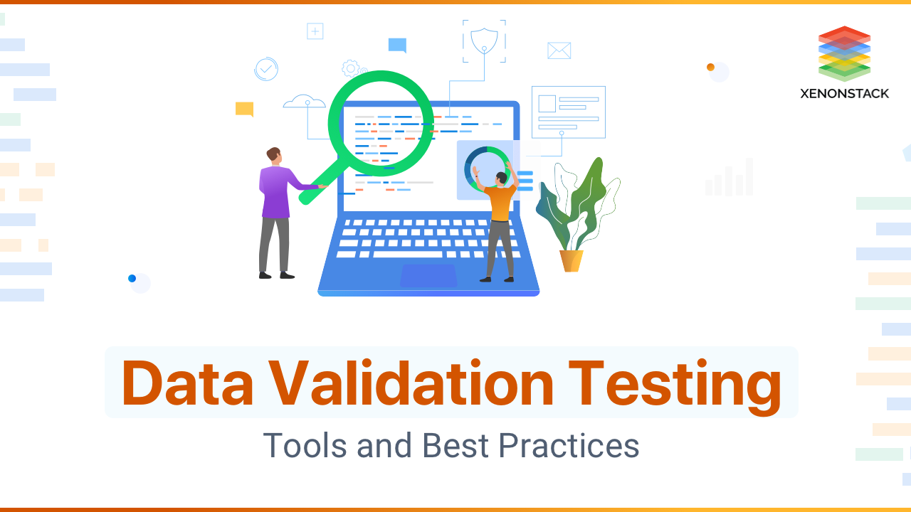

## Today's Agenda {background-image="Images/background-data_blue_v3.png" .center}

```{r}
library(tidyverse)
library(readxl)
library(kableExtra)
library(modelsummary)
```

<br>

::: {.r-fit-text}

1. Introduce the first report

2. Critically analyze the project's codebook

:::

<br>

::: r-stack
Justin Leinaweaver (Spring 2025)
:::

::: notes
Prep for Class

1. Review Canvas submissions

2. [Project Codebook]()

3. [Project Dataset]()

<br>

**SLIDE**: Let's start today with an overview of your first report

:::


## {background-image="Images/background-data_blue_v3.png" .center}

::: {.r-fit-text}
**Report 1**

**Analyzing our Outcome Variable(s)**
:::

<br>

1. COMPLETED draft due Feb 21st

2. PDFs only

3. Support ALL claims with evidence
    - APA formatted in-text citations
    - APA formatted bibliography

::: notes

Per the syllabus, a COMPLETED draft of your first report is due to be submitted to Canvas on Feb 21st

- Completed means all required components included, written in essay form with citations

- This draft submission IS your best effort to complete the paper

<br>

You must submit the report as a pdf file to preserve formatting of figures and tables

- Word allows you to export as pdf

<br>

You must support all claims with evidence which means:

- in-text citations, 

- a bibliography, and 

- APA formatting

<br>

**Questions on those basic elements?**

<br>

**SLIDE**: And what goes in the report?
:::


## {background-image="Images/background-data_blue_v3.png" .center}

::: {.r-fit-text}
**Report 1**

**Analyzing our Outcome Variable(s)**
:::

<br>

::: {.r-fit-text}
1) Why is this project important?

2) How confident should we be in the methodology?

3) What do the measures currently show us?

4) How are these measures changing across time?
:::

::: notes

This first report focuses entirely on analyzing our first data project.

- Measurement is the end-all, be-all for any quantitative analysis and so we need to spend time analyzing the outcome BEFORE we can explain it!

<br>

The report has four prompts and in each one it is your job to make and support an argument.

- That means each of these sections IS an argument with a clear macro, meso and micro structure

<br>

The idea behind the first report is to make sure we fully and deeply understand the outcome we have chosen BEFORE we try to explain it with data.

- **Big picture does this make sense?**

- Today I'll step you through Sections 1 and 2 in detail and we'll save Sections 3 and 4 for a few weeks out

<br>

**SLIDE**: Let's talk Section 1

:::


## {background-image="Images/background-data_blue_v3.png" .center}

::: {.r-fit-text}
**Report 1**

**Analyzing our Outcome Variable(s)**
:::

<br>

**Section 1: Why is this project important?**

::: {.fragment}

- What problem are the researchers trying to solve?

- How does the problem impact the real world?

- Why should we take these researchers seriously?
 
- How has the project impacted the world?

:::

::: notes

In Section 1 your job is to sell the importance of this project to an interested reader

- Don't assume the reader is an expert in the subject area

- Don't assume the reader is familiar with the project at all

- This means you have to include enough background info on the project for them to understand your importance argument

<br>

**If you were trying to sell an interested person on the idea that ANY data project was important, what aspects of it would you want to highlight?**

- **Think big picture here, what are the kinds of premises that would make this a compelling argument?**

- *Gather answers ON BOARD*

<br>

**REVEAL**: Here are the kinds of things I would consider including

<br>

**Questions on the Section 1 argument?**

<br>

**SLIDE**: On to Section 2...

:::


## {background-image="Images/background-data_blue_v3.png" .center}

::: {.r-fit-text}
**Report 1**

**Analyzing our Outcome Variable(s)**
:::

<br>

**Section 2: How confident should we be in the methodology?**

::: {.fragment}

- **Source:** Where does the raw data come from?

- **Operationalization:** Defining the concepts

- **Instrumentation:** Designing the tool

- **Measurement Process:** Using the tool

- **Validation:** Checking the data

:::

::: notes

Section 2 asks you to analyze the uncertainty in the data project and its measurements

- Your report should step through the strengths and weaknesses of the measurements in the project.
    -  Be specific and thorough here

- In other words, I want you to evaluate the sources of uncertainty in the data project, AND

- Discuss the implications of that uncertainty

<br>

**REVEAL**: Everybody write these down!

<br>

These elements can help you organize your critical analysis of any real-world data or measurement.

- We learn a great deal about the uncertainty in any measurement by investigating its sources, definitions, tools, processes and validation procedures.

<br>

**SLIDE**: Your assignment for today was meant to give you a jump-start on these analyses.

:::


## {background-image="Images/background-data_blue_v3.png" .center}

::: {.r-fit-text}
**For Today: Analyzing the First Codebook**
:::

<br>

1. Analyzing the Data Project Overall

    - What are the strengths and weaknesses of the overall data project? What variables should we consider using?
    
2. Analyzing the Selected Outcome 

    - What are the strengths and weaknesses of the specific variable we have chosen as our key outcome to explain? 

::: notes

For today I asked each of you to read the codebook(s) and to reflect on how the researchers converted their ideas into measurements.

- My aim is that by the end of today you each have a list of strengths and weaknesses you can use to write Section 2 of the report.

<br>

And remember our key lesson from the first weeks of class: **Don't stress about the math!**

- Research design is WAY more important than the formulas!

<br>

Our focus today is on how the researchers define their ideas and convert them into numbers

- Those choices have a **MUCH** bigger impact than their choice to use harmonic means in constructing an index!

<br>

**SLIDE**: Let's start with the first element of analyzing data
:::


## Source {background-image="Images/background-data_blue_v3.png" .center}

{style="display: block; margin: 0 auto"}

::: notes

Let's begin with the sources of the data being analyzed in this project.

- Small groups, get ready to report back on the source(s) of the data

- Make two lists, what are the strengths and weaknesses of these data sources

<br>

### Questions?

- Go!

- (*ON BOARD*)

<br>

**Given these two lists, how precise can we be when interpreting these numbers?**

- **In other words, how much uncertainty do these sources carry with them for our analyses?**

:::


## Operationalization {background-image="Images/background-data_blue_v3.png" .center}

<br>

```{r, echo = FALSE, fig.align = 'center'}
knitr::include_graphics("Images/03_1-Voltaire_Define_Terms.jpg")
```

::: notes

As we did in Week 1 of the class, we now need to evaluate the operationalization of the concepts in this data project

- To refresh: Operationalization refers to ""...selecting observable phenomena to represent abstract concepts" (89).

- In other words, an "operational definition" tells us "precisely and explicitly what to do in order to determine what quantitative value should be associated with a variable in any given case" (p92).

<br>

**So, what are the key concepts in this data project?**

- (*Make list ON BOARD*)

<br>

Groups, take a few minutes to identify the operational definitions for these concepts and get ready to report back your evaluation of them

- Think about the operational definitions in terms of their clarity and validity

- Does the definition tell us "precisely and explicitly" what we are trying to measure?

<br>

**Questions?**

- Go!

<br>

*REPORT BACK and DISCUSS*
:::


## {background-image="Images/03_1-tools.jpg"}

::: {.r-fit-text}
<p style="color: white;">Instrumentation</p>
:::

::: notes

Again, as you did in Week 1, instrumentation refers to how you convert your operational definition into a series of steps you can use to measure the concept in question.

- The clearer your operational definition, the easier it is to design your measurement tool

<br>

Groups, take a look at the tool used to produce the measures for our variable of interest

- Get ready to report back your evaluation of the tool

- Is it clear and does it map onto the operational definition(s)?

- In other words, does this tool accurately represent the underlying concept or not?

<br>

**Questions?**

- Go!

<br>

*REPORT BACK and DISCUSS*
:::


## {background-image="Images/background-data_blue_v3.png" .center}

::: {.r-fit-text}
**Tool + Process = Measurement**
:::

{style="display: block; margin: 0 auto"}

::: notes

Next we talk process.

- This is how the researchers use the tool to generate the actual measurements

- In other words, we give you a hammer (the tool) and then we give you instructions on how to use it (process) 

<br>

**Remind me, what concepts did we use in Week 1 to evaluate the quality of a measurement?**

- (**SLIDE**: Validity and Reliability)
:::


## {background-image="Images/background-data_blue_v3.png" .center}

::: {.r-fit-text}
**Tool + Process = Measurement**
:::


::: notes

Validity: How well does the data produced reflect the concept you are trying to measure?

- If the tool is badly designed, then the measures are meaningless or incomplete.

- This is what we just analyzed in in the instrumentation step

<br>

Reliability: Does the tool + process produce consistent results across uses

- could be across time, across region or across different researchers

- If the instructions are confusing (bad process) then each person who uses the tool will produce data that cannot be collected together

- Often with cross-national data collection each member of the research team focuses on different countries and the process is what keeps everyone measuring the same things in the same way.

<br>

Groups, take a look at the process used to produce the measures for our variable of interest

- Get ready to report back on how reliable you believe this process to be

<br>

**Questions?**

- Go!

<br>

*REPORT BACK and DISCUSS*
:::


## Validation {background-image="Images/background-data_blue_v3.png" .center}



::: notes

Last key piece for us to evaluate is validation.

<br>

As we have noted, measurement is REALLY difficult even when you try to do everything "right."

- This means we find it valuable when a research project tries to validate its findings with other high quality work. 

<br>

Groups, take a look at the validation processes in this data project

- Get ready to report back on how they do this and how effective you believe that will be

<br>

**Questions?**

- Go!

<br>

*REPORT BACK and DISCUSS*
:::


## {background-image="Images/background-data_blue_v3.png" .center}

::: {.r-fit-text}
**Report 1**

**Analyzing our Outcome Variable(s)**
:::

<br>

**Section 2: How confident should we be in the methodology?**

- **Source:** Where does the raw data come from?

- **Operationalization:** Defining the concepts

- **Instrumentation:** Designing the tool

- **Measurement Process:** Using the tool

- **Validation:** Checking the data

::: notes

**Ok, how are we doing?**

- **Does everybody have a good start to Section 2?**

<br>

**SLIDE**: For next class

:::


##  {background-image="Images/background-data_blue_v3.png" .center}

::: {.r-fit-text}

**For Next Class**

1. Huntington-Klein (2022) chapter 3

2. Canvas Assignment

:::

::: notes

For next class you have a reading and an assignment.

- The reading is meant to help you complete the assignment.

<br>

For the assignment I'd like you to dig into the dataset using Excel

- Focus on the 2023 data only (we'll get to the historical data later)

- Find us **THREE interesting, puzzling or surprising** things in the data

- Explain what you found AND explain the process you used to find them

<br>

**Questions on the assignment?**
:::