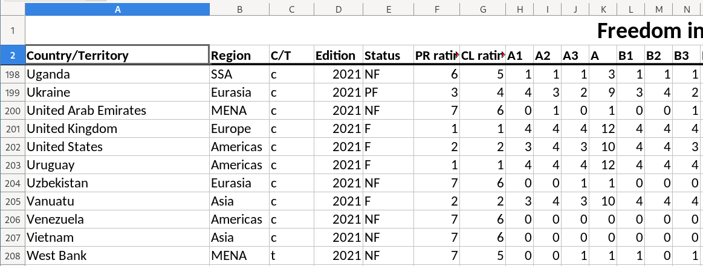

---
output:
  xaringan::moon_reader:
    css: ["default", "extra.css"]
    lib_dir: libs
    seal: false
    nature:
      highlightStyle: github
      highlightLines: true
      countIncrementalSlides: false
      ratio: '16:9'
---

```{r, echo = FALSE, warning = FALSE, message = FALSE}
##xaringan::inf_mr()
## For offline work: https://bookdown.org/yihui/rmarkdown/some-tips.html#working-offline
## Images not appearing? Put images folder inside the libs folder as that is the main data directory

library(tidyverse)
library(readxl)
library(stargazer)
##library(kableExtra)
##library(modelr)

knitr::opts_chunk$set(echo = FALSE,
                      eval = TRUE,
                      error = FALSE,
                      message = FALSE,
                      warning = FALSE,
                      comment = NA)
```

background-image: url('libs/Images/background-data_blue_v3.png')
background-size: 100%
background-position: center
class: middle, inverse

.size70[**Today's Agenda**]

<br>

.size50[
1. Four Principles of Data Analysis

2. Report on your early findings

3. Audit the data
]

<br>

.center[.size40[
  Justin Leinaweaver (Spring 2024)
]]

???

## Prep for Class
1. Review assignment submissions

2. Publish next discussion

3. ADD spreadsheet snapshot of chosen data to slides: line 447-ish

4. Note for you: I removed the "audit the data" exercise from the end of class. I think this new version's emphasis on codebook connections, then findings and process works much better


---

background-image: url('libs/Images/background-blue_triangles2.png')
background-size: 100%
background-class: center
class: middle

.center[.size50[.content-box-blue[**Report 1: Analyzing our Outcome Variable(s)**]]]

<br>

.size45[
1. **Why is this project important?**

2. **How confident should we be in the methodology?**

3. What do the measures currently show us?

4. How are these measures changing across time?
]

???

This week we have begun working on your first report.

- Last class we focused on the codebook in order to begin fleshing out arguments for the first two sections of the report.

<br>

### Any questions on the report or our work last class?

<br>

### Does everybody have a bunch of good material in their notes from last class?

<br>

As ever, be sure to **TAKE NOTES** as we work and **save them**!

- You should ABSOLUTELY be writing this report as we go!


---

background-image: url('libs/Images/background-blue_triangles_flipped.png')
background-size: 100%
background-position: center
class: middle

.size55[.content-box-blue[**For Today**]]

<br>

```{r, echo = FALSE, fig.align = 'center', out.width = '100%'}
knitr::include_graphics("libs/Images/03_1-Assignment.png")
```

???

Today's work is the logical extension of our codebook analyses.

- Once you have a good sense of how the researchers designed and collected their measurements, it's time to get your hands dirty!

- In other words, how is the data organized and what does it look like in big picture terms? 

<br>

### So, how was your first dive into our data using Excel?

### - Not yet about what you found but HOW you found the tool and the unguided exploration?

<br>

### Did anybody consult the links in the syllabus for advice on manipulating data in Excel?

<br>

**SLIDE**: We'll dig into what you did and what you found in a moment, but first let's set the stage with four important lessons for data analysis!


---

background-image: url('libs/Images/background-blue_triangles2.png')
background-size: 100%
background-class: center
class: middle

.size55[.content-box-blue[**The Key Principles of Data Analysis**]]

.size55[
1. Data analysis is .textred[**not**] a linear process

2. Always .textblue[**tidy**] your data before exploring it

3. Variable .textblue[**type**] determines the .textblue[**tool**]

4. .textblue[**Validity**] and .textblue[**reliability**] come first!
]

???

Think of these like guiding rules to get you off on the right foot.

- Let's step through each one.


---

background-image: url('libs/Images/background-blue_triangles2.png')
background-size: 100%
background-class: center
class: middle

.size50[.content-box-blue[**1. Data analysis is .textred[not] a linear process**]]

<br>

```{r, fig.align='center', out.width='100%'}
knitr::include_graphics("libs/Images/01_2-Analysis_Process.png")
```

???

The first principle of data analysis is to recognize that it is NOT a linear process.
- The day-to-day work of a data scientist almost never looks like a straightforward path through a puzzle.

- Each step represents a series of tasks you will need to do in order to answer questions using data.

<br>

**Key Takeaway 1:** The biggest time investment when doing quantitative research is typically in the "Import" and "Tidy" steps

- Finding, cleaning and organizing data happens before anything you might think of as "doing statistics."

- Super important: Get your data "clean" before you try to make anything with it

<br>

**Key Takeaway 2:** Developing your understanding is a process of playing with data, **NOT knowing the right thing to do from the get-go.**
- I cannot emphasize this enough, "understanding data" is a process

- Your job is to learn about the world and that comes from exploring the data

<br>

This means, don't freeze-up or get discouraged when looking at new data
    
- Just start making stuff with it and see what happens!

- Exploring the data IS the process of understanding the data
    
<br>

### Make sense?


---

background-image: url('libs/Images/background-blue_triangles2.png')
background-size: 100%
background-class: center
class: middle

.size50[.content-box-blue[**2. .textblue[Tidy] your data before exploring it**]]

<br>

```{r, fig.align='center', out.width='100%'}
knitr::include_graphics("libs/Images/01_2-tidy.png")
```

???

The second principle of data analysis is that you MUST tidy your data BEFORE you can do anything useful with it.

- Essentially, all stats packages and even Excel assume your data is tidy before the built-in tools can be used.

<br>

This means:

1. Columns are variables
    - e.g. separate concepts to be measured
    
2. Rows as observations
    - Each row refers to one observations
    - e.g. person, group, state, etc.

3. Each cell as a separate data point.

<br>

This is our goal. Take messy data and get it into this format.

<br>

### Everybody have this written down?

- **SLIDE**: Let's look at some examples.


---

background-image: url('libs/Images/background-blue_triangles2.png')
background-size: 100%
background-class: center
class: middle, center

.size50[.content-box-blue[**Freedom House: "Freedom in the World"**]]

<br>

```{r, echo = FALSE, fig.align = 'center', out.width = '100%'}

```

???

Freedom House produces measures of "freedom" around the world.

- This is what the spreadsheet they release looks like for each year of new scores

- Typically, the media focuses on the "Status" column which is a three level cataegorical variable: States are classified as either Free, Partly Free or Not Free

<br>

### How does this do on the three rules of tidy data?

1. (Columns are NOT yet variables: 2 levels of header)

2. (Rows ARE observations)
    - Observations here are state-year so each row needs to be one state at one year

3. (Each cell is a separate data point.)

<br>

**SLIDE**: This is a SUPER easy clean-up job.


---

background-image: url('libs/Images/background-blue_triangles2.png')
background-size: 100%
background-class: center
class: middle, center

.size40[.content-box-blue[**Freedom House: "Freedom in the World"**]]

<br>

```{r, echo = FALSE, fig.align = 'center', out.width = '78%'}
knitr::include_graphics("libs/Images/01_2-tidy_fh1.png")
```

.center[.size55[&#x2193;]]

```{r, echo = FALSE, fig.align = 'center', out.width = '78%'}
knitr::include_graphics("libs/Images/01_2-tidy_fh2.png")
```

???

### Make sense?

1. Each column is now a separate variable

2. Each row is a separate observation

3. Each cell is a distinct data point


---

background-image: url('libs/Images/background-blue_triangles2.png')
background-size: 100%
background-class: center
class: middle, center

.size40[.content-box-blue[**Freedom House: "Freedom in the World"**]]

<br>

```{r, echo = FALSE, fig.align = 'center', out.width = '90%'}
knitr::include_graphics("libs/Images/03_2-FH_Untidy.png")
```

???

Now, if what you want is historical Freedom House data you get this.

- All of the information is useful but this is definitely not tidy.

<br>

### How does this do on the three rules of tidy data?

1. (Columns are NOT variables)

2. (Rows are MULTIPLE observations
    - Observations here are state-year so each row needs to be one state at one year

3. (Each cell is a data point)
    - Ignoring the messy three column header it gets close on this one

<br>

### What would we need to do to fix it?

### - What should/could a tidy result look like?

- *ON BOARD*
    - Country, Region, C/T, Edition, Year, Status, ...
    
<br>

**SLIDE**: Let's fix it!


---

background-image: url('libs/Images/background-blue_triangles2.png')
background-size: 100%
background-class: center
class: middle, center


```{r, echo = FALSE, fig.align = 'center', out.width = '78%'}
knitr::include_graphics("libs/Images/03_2-FH_Untidy_Small.png")
```

.center[.size55[&#x2193;]]

```{r, echo = FALSE, fig.align = 'center', out.width = '78%'}
knitr::include_graphics("libs/Images/03_2-FH_Tidy2.png")
```

???

1. Columns are variables

2. Rows are country-year observations

3. Each cell is a data point

<br>

### Make sense?

### - Questions on what tidy data looks like?


---

background-image: url('libs/Images/background-blue_triangles2.png')
background-size: 100%
background-class: center
class: middle

.size50[.content-box-blue[**2. .textblue[Tidy] your data before exploring it**]]

<br>

```{r, fig.align='center', out.width='100%'}
##knitr::include_graphics("libs/Images/03_2-GII_Untidy.png")
```

???

One of your jobs for Friday will be to take our current dataset and tidy it!

### Questions on that task?

<br>

*optional: Let the class brainstorm how to do this*


---

background-image: url('libs/Images/background-blue_triangles2.png')
background-size: 100%
background-class: center
class: middle

.size45[.content-box-blue[**3. Variable .textblue[type] determines the .textblue[tool]**]]

<br>

```{r, fig.align='center', out.width='95%'}
knitr::include_graphics("libs/Images/01_2-levels_measurement.png")
```

???

The third principle of data analysis is that variable type determines the tool to use on it.

<br>

This chart represents some of the most common ways you can organize data by its type

- The most important distinction is this middle row.

- Is the variable measured using numbers or words?

<br>

Each type can then be broken down further

- Numerical can be continuous or discrete
    - And technically the continuous can be broken into subcategories too (ratio vs interval)

- Categorical outcomes can be ordered or not

<br>

### Looking at our data for today, which variables are numbers and which are words?

- Be careful! Very often numbers represent categories of words!

- This is why you have to review the codebook.

<br>

**SLIDE**: The handy thing is that once you can identify variables by type, you know exactly what kinds of analyses to perform!


---

background-image: url('libs/Images/background-blue_triangles2.png')
background-size: 100%
background-class: center
class: middle

```{r, fig.align='center', out.width='70%'}
knitr::include_graphics("libs/Images/03_2-Chart_Type_Data_Viz-1.png")
```

???

Don't let this picture overwhelm you!
- The logic here is what matters, not these specific recommendations.

- The lesson here is that tool selection depends on variable type.

<br>

Example: Are you trying to visualize the distribution of a single numeric variable? 
- Make a histogram!

<br>

Example: Are you trying to visualize a relationship between two numeric variables?
- Make a scatterplot!

<br>

A big part of your job early this semester will be organizing your notes around each type.
- e.g. "When I have a continuous variable I can..."

<br>

Once you learn to think this way, data analysis starts to look like cooking with recipes.
- You learn to describe what you want to make and our texts and notes will tell you how to do it!


---

background-image: url('libs/Images/background-blue_triangles2.png')
background-size: 100%
background-class: center
class: middle

.size50[.content-box-blue[**4. Evaluate Validity & Reliability**]]

<br>

```{r, echo = FALSE, fig.align = 'center', out.width = '90%'}
knitr::include_graphics("libs/Images/03_1-Reliability-and-Validity.png")
```

???

The fourth principle of data analysis is one that we've already had some experience with this semester

<br>

Remember:

- Validity: "Answers correspond to what they are intended to measure"

- Reliability: "Providing consistent measures in comparable situations"

<br>

This is absolutely the MOST important piece of analyzing data and it simply isn't done enough in stats type classes.

- We get so excited about methods and fancy pictures we forget that our knowledge is constrained by the data we are using.

<br>

Remember, all data includes uncertainty.

- If the data project does a bad job or is not transparent about how it handles all of this, then I don't care what they think about the development of some complex societal dynamic.

<br>

### Questions on this?


---

background-image: url('libs/Images/background-blue_triangles2.png')
background-size: 100%
background-class: center
class: middle

.size55[.content-box-blue[**The Key Principles of Data Analysis**]]

.size55[
1. Data analysis is .textred[**not**] a linear process

2. Always .textblue[**tidy**] your data before exploring it

3. Variable .textblue[**type**] determines the .textblue[**tool**]

4. .textblue[**Validity**] and .textblue[**reliability**] come first!
]

???

### Any questions on the four principles underpinning our work as data scientists?

<br>

**SLIDE**: One more brief detour before we talk about what you found in the dataset!


---

background-image: url('libs/Images/01_1-excel_dangerous.png')
background-size: 100%
background-position: center

???

Important word of caution!

<br>

Excel is a VERY dangerous tool because it wants to help you

- That's very kind of it to offer, but 

- Unfortunately, it is VERY, VERY stupid.

<br>

**SLIDE**: For example...


---

background-image: url('libs/Images/01_1-excel_danger2.png')
background-size: 100%
background-position: center

???

Excel is Dangerous #1: Beware Excel's auto-formatting features!

<br>

Like a drunk puppy, Excel is desperate to help but has no idea what you're trying to do or how to actually help.


---

background-image: url('libs/Images/03_2-Excel_Finger_Slip.png')
background-size: 95%
background-position: center
class: slideblue

???

Excel is Dangerous #2: Screwing up your data by accident is stupid easy 

<br>

There are so many examples

1. Each cell of the data can be edited (intentionally or by accident) and those changes don't get recorded or flagged anywhere.
    - A finger slip can completely transform your records and you would never know it!
    
2. The sort features are confusing and sometimes lead to sorting only one column rather than the whole sheet which breaks the data at the observation level.

3. The autofilter is handy for extracting subsets of the data but it's very easy to forget it is "on" and suddenly your analyses exhibit serious selection bias.

<br>

Bottom line, doing "science" requires being transparent in your choices and creating a record of them for others to review.

- Excel is a total failure at this and that is why it is completely inappropriate for doing science.


---

background-image: url('libs/Images/background-blue_triangles2.png')
background-size: 100%
background-class: center
class: middle, center

.size70[.content-box-blue[**Report Section 2**]]

<br>

.size60[
**How confident should we be in the methodology?**
]

???

For the rest of today I want to discuss what you found in the data and how you found it.

- Keep in mind, this exercise is meant to help us begin exploring the data AND is absolutely a continuation of our codebook investigation

<br>

Getting a sense of the data using a spreadsheet is the next step in evaluating the methodology in the data project

- The codebook walks you through the researchers' steps from concept to definition to tool and process.

- Reviewing the spreadsheet helps YOU evaluate the big leap from the codebook to the actual measures!

<br>

### Does that make sense?

<br>

Big Picture Questions:

### 1. How are the observations organized?

<br>

### 2. Can you connect each variable here with its measurement tool in the codebook?

### - Examples: Give me a variable in the spreadsheet and the page number in the codebook for the tool

<br>

*Distribute the variables in the dataset to each student (or pair or small group)*

- Groups, review the tool in the codebook and then scroll through all the values for that variable in the spreadsheet

- Get ready to report back on what you find from this comparison

- Any unexpected values? Cray outliers? Missing Data?

<br>

*REPORT BACK and DISCUSS each*

<br>

### How do these actual observations help us think critically about the codebook?

### - In other words, what can we take from this review that would be useful in Section 2 of your reports?


---

background-image: url('libs/Images/background-blue_triangles_flipped.png')
background-size: 100%
background-position: center
class: middle

.size55[.content-box-blue[**For Today**]]

<br>

```{r, echo = FALSE, fig.align = 'center', out.width = '100%'}
knitr::include_graphics("libs/Images/03_1-Assignment.png")
```

???

Ok, let's discuss what you found in your pre-class explorations?

- I'd like each of you to take a turn introducing one of your findings and explaining to us the process you used to reach it.

<br>

### Questions on what I'm asking?

- Take a sec to prep and then let's go!

<br>

As each person presents, your job in the audience is to follow the steps they suggest and make sure you can recreate their finding.

### Make sense?

<br>

Go!


---

background-image: url('libs/Images/background-blue_triangles_flipped.png')
background-size: 100%
background-position: center
class: middle

.size55[.content-box-blue[**For Next Class**]]

<br>

.size50[
1. Tidy our new dataset

2. Long and Teetor (2019) Sections 1.1 and 1.2

3. Healy (2019) Sections 2.1 - 2.4

4. (optional) Install R and RStudio on your computer
]

???

If you would like to be able to work on your personal computer this semester, bring it to our next class and we'll save time if you need help getting set-up!

<br>

Even if you'll be working on the lab computers we will spend class time configuring RStudio and getting comfortable using it.

<br>

### Questions on the assignment?
