## Today's Agenda {background-image="Images/background-data_blue_v4.png" .center}

```{r}
library(tidyverse)
library(readxl)

#library(kableExtra)
#library(modelsummary)

# Input the data
d24 <- read_excel("../Data_in_Class/Reporters_Without_Borders/Website-Copy_Paste/RSF-Website_Data-2024.xlsx", na="NA")

d <- read_excel("../Data_in_Class/Reporters_Without_Borders/Website-Copy_Paste/RSF-Website_Data-2015-2024.xlsx", na="NA")

```

<br>

::: {.r-fit-text}

1. Four Principles of Data Analysis

2. Report on your early findings

3. Audit the data

:::

<br>

::: r-stack
Justin Leinaweaver (Spring 2025)
:::

::: notes
Prep for Class

1. Review Canvas submissions

2. ADD spreadsheet snapshot of chosen data to slides: line 350-ish

:::


## {background-image="Images/background-data_blue_v4.png" .center}

**What do we learn about the world from analyzing the Press Freedom Index produced by Reporters Without Borders?**

1. The importance of the project in the real-world,
2. The key contributors of uncertainty in the project's data,
3. What we learn about the current world from analyzing the most recently available data, and
4. What we learn about the trajectory of press freedom in the world from analyzing the data across time


::: notes

This week we have begun working on your first report.

- Last class we focused on the codebook in order to begin fleshing out arguments for the first two sections of the report.

<br>

**Any questions on the report or our work last class?**

<br>

**Does everybody have a bunch of good material in their notes from last class?**

<br>

As ever, be sure to **TAKE NOTES** as we work and **save them**!

- You should ABSOLUTELY be writing this report as we go!

:::


##  {background-image="Images/background-data_blue_v4.png" .center}

::: {.r-fit-text}

**For Today**

1. Huntington-Klein (2022) chapter 3

2. Canvas Assignment

    - Explore the data!

:::

::: notes

Today's work is the logical extension of our codebook analyses.

- Once you have a good sense of how the researchers designed and collected their measurements, it's time to get your hands dirty!

- In other words, how is the data organized and what does it look like in big picture terms? 

<br>

**So, how was your first dive into our data using Excel?**

- **Not yet about what you found but HOW you found the tool and the unguided exploration?**

<br>

**Which of the links on Canvas for advice on manipulating data in Excel were helpful?**

<br>

**SLIDE**: We'll dig into what you did and what you found in a moment, but first let's set the stage with four important lessons for data analysis!
:::


## The Key Principles of Data Analysis {background-image="Images/background-data_blue_v4.png" .center}

<br>

::: {.r-fit-text}

1. Data analysis is **not** a linear process

2. Always **tidy** your data before exploring it

3. Variable **type** determines the **tool**

4. **Validity** and **reliability** come first!
:::

::: notes

Think of these like guiding rules to get you off on the right foot.

- Let's step through each one.

:::


## 1. Data analysis is not a linear process {background-image="Images/background-data_blue_v4.png" .center}

{style="display: block; margin: 0 auto"}

::: notes

The first principle of data analysis is to recognize that it is NOT a linear process.

- The day-to-day work of a data scientist almost never looks like a straightforward path through a puzzle.

- Each step represents a series of tasks you will need to do in order to answer questions using data.

<br>

**Key Takeaway 1:** The biggest time investment when doing quantitative research is typically in the "Import" and "Tidy" steps

- Finding, cleaning and organizing data happens before anything you might think of as "doing statistics."

- Super important: Get your data "clean" before you try to make anything with it

<br>

**Key Takeaway 2:** Developing your understanding is a process of playing with data, **NOT knowing the right thing to do from the get-go.**

- I cannot emphasize this enough, "understanding data" is a process

- Your job is to learn about the world and that comes from exploring the data

<br>

This means, don't freeze-up or get discouraged when looking at new data
    
- Just start making stuff with it and see what happens!

- Exploring the data IS the process of understanding the data
    
<br>

**Make sense?**

:::


## 2. Tidy your data before exploring it {background-image="Images/background-data_blue_v4.png" .center}

{style="display: block; margin: 0 auto"}

::: notes

The second principle of data analysis is that you MUST tidy your data BEFORE you can do anything useful with it.

- Essentially, all stats packages and even Excel assume your data is tidy before the built-in tools can be used.

<br>

This means:

1. Columns are variables

    - e.g. separate concepts to be measured
    
2. Rows as observations

    - Each row refers to one observations
    
    - e.g. person, group, state, etc.

3. Each cell as a separate data point.

4. You have audited the data to make sure it is "clean"
    
    - e.g. there are no transcription errors in the data, no autoformatting errors, etc

<br>

This is our goal. Take messy data and get it into this format.

<br>

**Everybody have this written down?**

- **SLIDE**: Let's look at some examples.

:::


## {background-image="Images/background-data_blue_v4.png" .center}

::: {.r-fit-text}
**Freedom in the World (Freedom House 2024)**
:::

{style="display: block; margin: 0 auto"}

::: notes

Freedom House produces measures of "freedom" around the world.

- This is what the spreadsheet they release looks like for each year of new scores

- Typically, the media focuses on the "Status" column which is a three level cataegorical variable: States are classified as either Free, Partly Free or Not Free

<br>

**How does this do on the three rules of tidy data?**

1. (Columns are NOT yet variables: 2 levels of header)

2. (Rows ARE observations)
    - Observations here are state-year so each row needs to be one state at one year

3. (Each cell is a separate data point.)

<br>

**SLIDE**: This is a SUPER easy clean-up job.

:::


## 2. Tidy your data before exploring it {background-image="Images/background-data_blue_v4.png" .center}

<br>

### Untidy
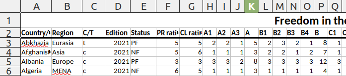

### Tidy
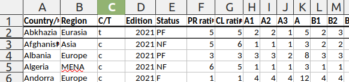

::: notes

Delete the extra header row and we're all good

- **Make sense?**

<br>

1. Each column is now a separate variable

2. Each row is a separate observation

3. Each cell is a distinct data point

:::


## {background-image="Images/background-data_blue_v4.png" .center}

::: {.r-fit-text}
**Freedom in the World (Freedom House 2024)**
:::

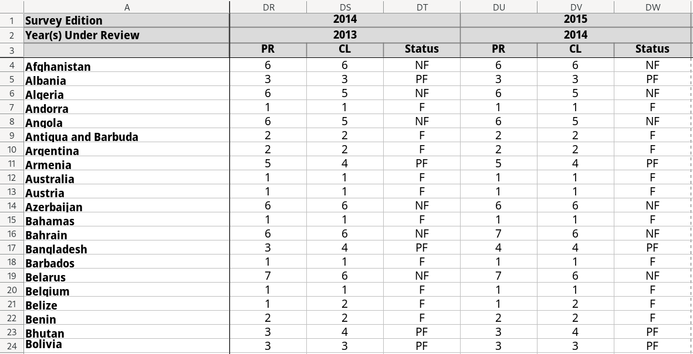{style="display: block; margin: 0 auto"}

::: notes

Freedom House also offers for download a history of its scores over time

- All of the information is useful but this is definitely not tidy.

<br>

**How does this do on the three rules of tidy data?**

1. (Columns are NOT variables)

2. (Rows are MULTIPLE observations
    - Observations here are state-year so each row needs to be one state at one year

3. (Each cell is a data point)
    - Ignoring the messy three column header it gets close on this one

<br>

**What would we need to do to fix it?**

- **What should/could a tidy result look like?**

- *ON BOARD*
    - Country, Region, C/T, Edition, Year, Status, ...
    
<br>

**SLIDE**: Let's fix it!

:::


## 2. Tidy your data before exploring it {background-image="Images/background-data_blue_v4.png" .center}

### Untidy
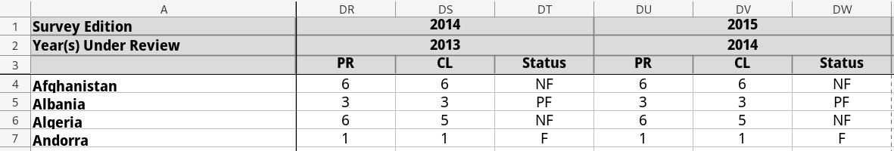

### Tidy
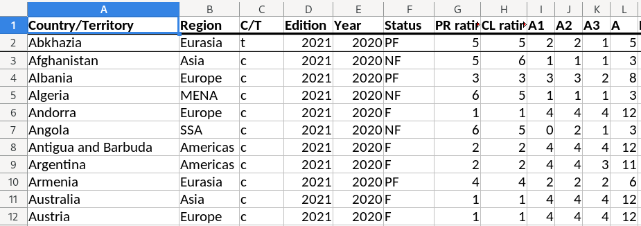

::: notes

1. Columns are variables

2. Rows are country-year observations

3. Each cell is a data point

<br>

**Make sense?**

- **Questions on what tidy data looks like?**
:::


## 2. Tidy your data before exploring it {background-image="Images/background-data_blue_v4.png" .center}

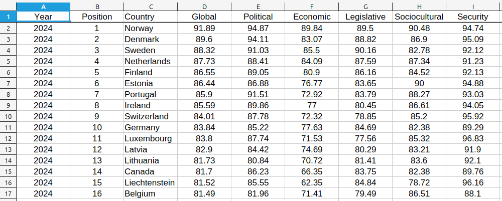{style="display: block; margin: 0 auto"}

::: notes

One of your jobs for Friday will be to take our current dataset and tidy it!

- **What needs to be done to this data?**

<br>

Nothing!

- The organizing part of this was easy as RSF provides tables in tidy format

- But the auditing was a MESS.

- We'll discuss that in a second...

<br>

**SLIDE**: On to the next principal!

:::


## 3. Variable type determines the tool {background-image="Images/background-data_blue_v4.png" .center}

{style="display: block; margin: 0 auto"}

::: notes

The third principle of data analysis is that variable type determines the tool to use on it.

<br>

This chart represents some of the most common ways you can organize data by its type

- The most important distinction is this middle row.

- Is the variable measured using numbers or words?

<br>

Each type can then be broken down further

- Numerical can be continuous or discrete

    - And technically the continuous can be broken into subcategories too (ratio vs interval)

- Categorical outcomes can be ordered or not

<br>

**Looking at our data for today, which variables are numbers and which are words?**

- Be careful! Very often numbers represent categories of words!

- This is why you have to review the codebook.

<br>

**SLIDE**: The handy thing is that once you can identify variables by type, you know exactly what kinds of analyses to perform!

:::


## 3. Variable type determines the tool {background-image="Images/background-data_blue_v4.png" .center}

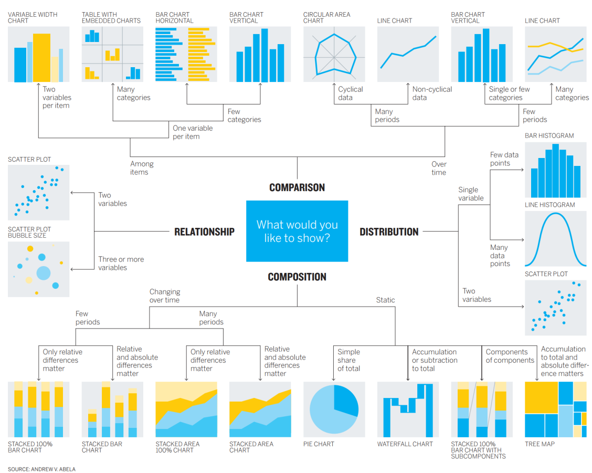{style="display: block; margin: 0 auto"}

::: notes

Don't let this picture overwhelm you!

- The logic here is what matters, not these specific recommendations.

- The lesson here is that tool selection depends on variable type.

<br>

Example: Are you trying to visualize the distribution of a single numeric variable? 

- Make a histogram!

<br>

Example: Are you trying to visualize a relationship between two numeric variables?

- Make a scatterplot!

<br>

A big part of your job early this semester will be organizing your notes around each type.

- e.g. "When I have a continuous variable I can..."

<br>

Once you learn to think this way, data analysis starts to look like cooking with recipes.

- You learn to describe what you want to make and our texts and notes will tell you how to do it!

:::


## 4. Evaluate Validity & Reliability {background-image="Images/background-data_blue_v4.png" .center}

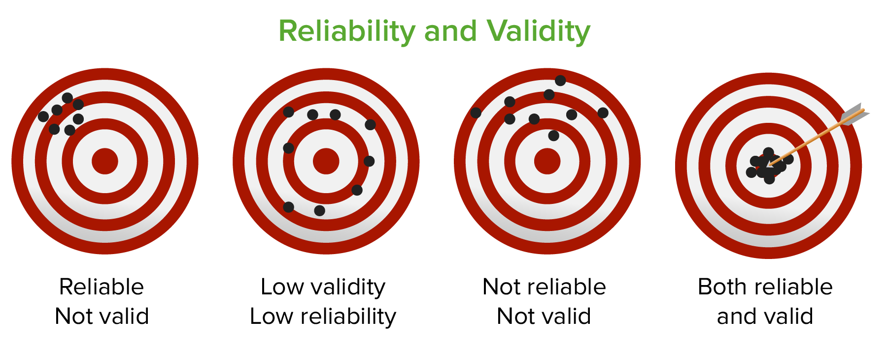{style="display: block; margin: 0 auto"}

::: notes

The fourth principle of data analysis is one that we've already had some experience with this semester

<br>

Remember:

- Validity: "Answers correspond to what they are intended to measure"

- Reliability: "Providing consistent measures in comparable situations"

<br>

This is absolutely the MOST important piece of analyzing data and it simply isn't done enough in stats type classes.

- We get so excited about methods and fancy pictures we forget that our knowledge is constrained by the data we are using.

<br>

Remember, all data includes uncertainty.

- If the data project does a bad job or is not transparent about how it handles all of this, then I don't care what they think about the development of some complex societal dynamic.

<br>

**Questions on this?**

:::


## The Key Principles of Data Analysis {background-image="Images/background-data_blue_v4.png" .center}

<br>

::: {.r-fit-text}

1. Data analysis is **not** a linear process

2. Always **tidy** your data before exploring it

3. Variable **type** determines the **tool**

4. **Validity** and **reliability** come first!

:::

::: notes
**Any questions on the four principles underpinning our work as data scientists?**

<br>

**SLIDE**: One more brief detour before we talk about what you found in the dataset!

:::


## {background-image="Images/background-data_blue_v4.png" .center}

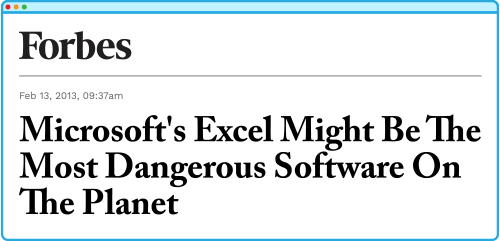{style="display: block; margin: 0 auto"}

::: notes

Important word of caution!

<br>

Excel is a VERY dangerous tool because it wants to help you

- That's very kind of it to offer, but 

- Unfortunately, it is VERY, VERY stupid.

<br>

**SLIDE**: For example...

:::


## Excel Auto-Formatting is Bad {background-image="Images/background-data_blue_v4.png" .center}

<br>

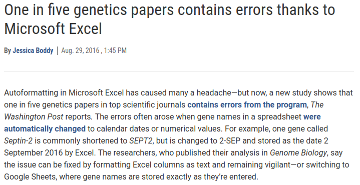{style="display: block; margin: 0 auto"}

::: notes

Excel is Dangerous #1: Beware Excel's auto-formatting features!

<br>

Like a drunk puppy, Excel is desperate to help but has no idea what you're trying to do or how to actually help.
:::


## Excel Allows Accidental Edits {background-image="Images/background-data_blue_v4.png" .center}

<br>

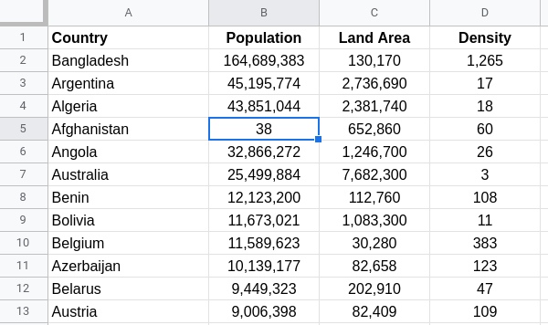{style="display: block; margin: 0 auto"}

::: notes

Excel is Dangerous #2: Screwing up your data by accident is stupid easy 

<br>

There are so many examples...

:::


## Excel Allows Accidental Edits {background-image="Images/background-data_blue_v4.png" .center}

:::: {.columns}
::: {.column width="50%"}


:::

::: {.column width="50%"}

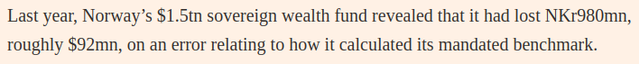

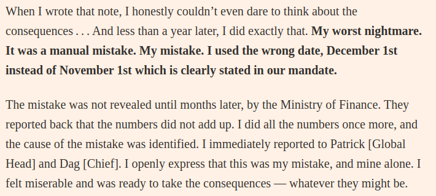

:::
::::

::: notes

[FT Article on Excel error in Norway costing $92 million! ](https://www.ft.com/content/db864323-5b68-402b-8aa5-5c53a309acf1)

<br>

This story highlights so many of the ways that Excel is a TERRIBLE tool

1. Each cell of the data can be edited (intentionally or by accident) and those changes don't get recorded or flagged anywhere.

    - A finger slip can completely transform your records and you would never know it!
    
2. The sort features are confusing and sometimes lead to sorting only one column rather than the whole sheet which breaks the data at the observation level.

3. The autofilter is handy for extracting subsets of the data but it's very easy to forget it is "on" and suddenly your analyses exhibit serious selection bias.

<br>

Bottom line, doing "science" requires being transparent in your choices and creating a record of them for others to review.

- Excel is a total failure at this and that is why it is completely inappropriate for doing science.

- And THAT is why we won't be using it in this class for our analyses!
:::


## For Today {background-image="Images/background-data_blue_v4.png" .center}

<br>

### Dig into our first data project using Excel and find us THREE interesting, puzzling or surprising things about the world of this dataset

::: notes

For today I asked each of you to explore the datset using Excel and to find us "things" that were of interest, that puzzled you or that seemed interesting.

<br>

I really like this assignment as a kicking off point for our data analysis work:

1. I need you to get comfortable looking at data and thinking about real world problems in terms of data

    - Data should not be scary and you should see this spreadsheet as an invitation to mess around
    
2. Trying to wrap your head around a big collection of data should help you understand why statistics exists

    - I am not here to teach you math for the sake of math or college credit, I am here to show you how statistics can help you play with data and extract meaning from it
    
    
3. I also need you to get comfortable thinking about this specific project in terms of data

    - e.g. HOW precisely do these researchers measure the concept of interest (press freedom)

<br>

So, let's dig in!

- TABLES: Each of you share one of your findings with the rest of the table

- Make sure everyone at your table can replicate your analysis and understands what you found interesting, puzzling, etc.

- Go!

<br>

Report back to me, what stood out as most interesting or intriguing in the dataset?

- *You follow along on the screen*

```{r}
d24 |> select(Global:Security) |> summary()
```

<br>

**SLIDE**: Apply to methodology analysis

:::


## Report 1 {background-image="Images/background-data_blue_v4.png" .center}

**What do we learn about the world from analyzing the Press Freedom Index produced by Reporters Without Borders?**

<br>

**Premise 2: The key contributors of uncertainty?**

- **Source:** Where does the raw data come from?

- **Operationalization:** Defining the concepts

- **Instrumentation:** Designing the tool

- **Measurement Process:** Using the tool

- **Validation:** Checking the data

::: notes

Let's go back to the second section of the report.

- Keep in mind, this exercise today was ALSO a continuation of our investigation of the methodology of this project

<br>

Getting a sense of the data using a spreadsheet is the next step in evaluating the methodology in the data project

- The codebook walks you through the researchers' steps from concept to definition to tool and process.

- Reviewing the spreadsheet helps YOU evaluate the big leap from the codebook to the actual measures!

<br>

**So, based on your hands-on analyses today what can we add to our work last class analyzing the methodology of this project?**

- **Key strengths and weaknesses to add?**

<br>

Now is a good time to mention my struggles to tidy the data on the RSF website

- Country name is weirdly identified: "Rank N-1" (but even this is inconsistent as some are English and some are French...)

- "Political Context" and "Rank_Pol" are reversed

- "Social Context" and "Rank_Soc" are reversed

- also appears to be some mistakes in rank columns so I deleted those

- Also some of the downloaded scores gave countries values above 100, which is supposed to be impossible

- **Should these errors in the downloadable files make their way into your discussion of the strengths and weaknesses of the methodology? Why or why not?**

<br>

**What do we learn about the strengths and weaknesses of the survey questions now that you've examined the data on the countries themselves?**

<br>

<br>

*SAVE IN CASE FUTURE SEMESTERS NEED THIS*

**Can you connect each variable here with its measurement tool in the codebook?**

- **Examples: Give me a variable in the spreadsheet and the page number in the codebook for the tool**

<br>

*Distribute the variables in the dataset to each student (or pair or small group)*

- Groups, review the tool in the codebook and then scroll through all the values for that variable in the spreadsheet

- Get ready to report back on what you find from this comparison

- Any unexpected values? Crazy outliers? Missing Data?

<br>

**How do these actual observations help us think critically about the codebook?**

- **In other words, what can we take from this review that would be useful in Section 2 of your reports?**

<br>

*REPORT BACK and DISCUSS each*

:::


## For Next Class {background-image="Images/background-data_blue_v4.png" .center}

<br>

::: {.r-fit-text}

1. Tidy our new dataset (if needed)

2. Long and Teetor (2019) Sections 1.1 and 1.2

3. Healy (2019) Sections 2.1 - 2.4

4. Install R and RStudio on your computer

:::

::: notes

If you would like to be able to work on your personal computer this semester, bring it to our next class and we'll save time if you need help getting set-up!

<br>

Even if you'll be working on the lab computers we will spend class time configuring RStudio and getting comfortable using it.

<br>

**Questions on the assignment?**
:::