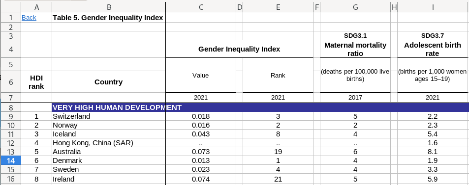
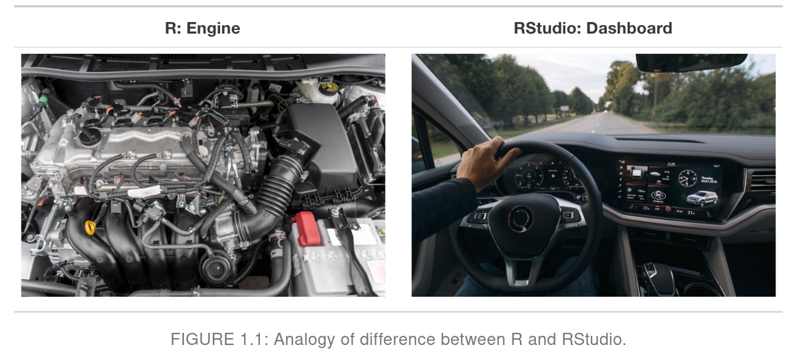
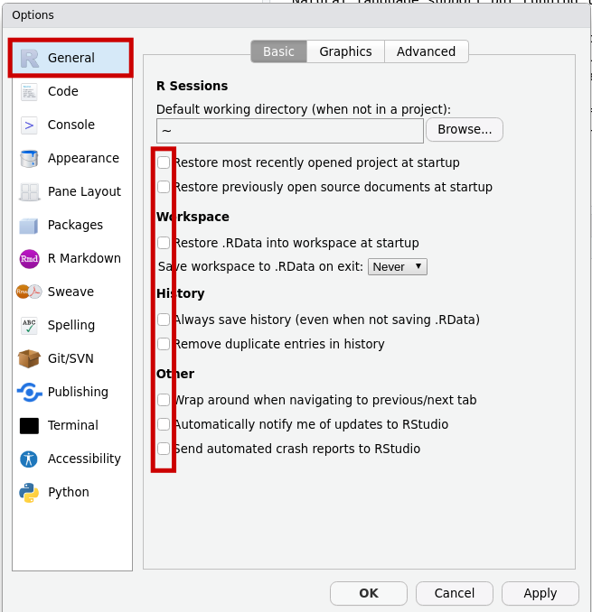
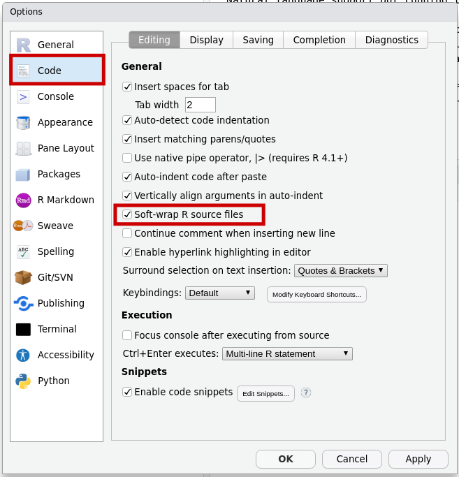
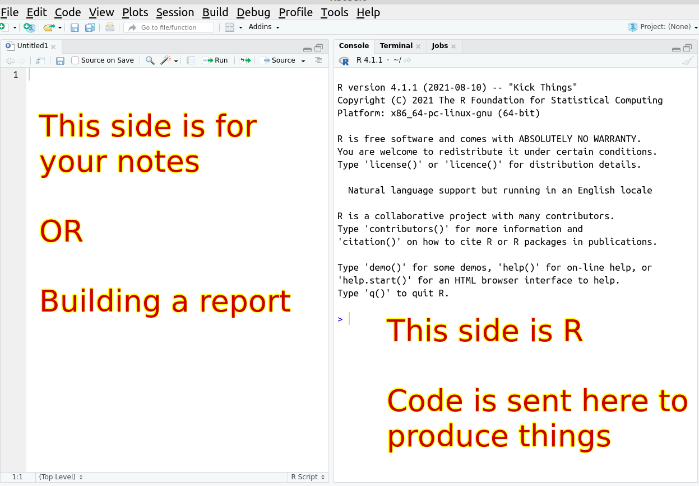
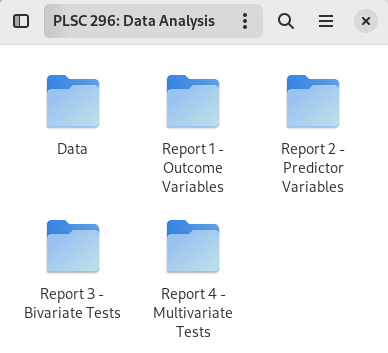
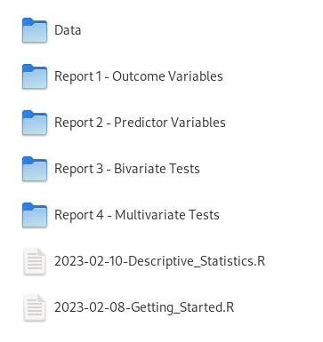

---
output:
  xaringan::moon_reader:
    css: ["default", "extra.css"]
    lib_dir: libs
    seal: false
    nature:
      highlightStyle: github
      highlightLines: true
      countIncrementalSlides: false
      ratio: '16:9'
---

```{r, echo = FALSE, warning = FALSE, message = FALSE}
##xaringan::inf_mr()
## For offline work: https://bookdown.org/yihui/rmarkdown/some-tips.html#working-offline
## Images not appearing? Put images folder inside the libs folder as that is the main data directory

library(tidyverse)
library(readxl)
library(stargazer)
##library(kableExtra)
##library(modelr)

knitr::opts_chunk$set(echo = FALSE,
                      eval = TRUE,
                      error = FALSE,
                      message = FALSE,
                      warning = FALSE,
                      comment = NA)
```

background-image: url('libs/Images/background-data_blue_v3.png')
background-size: 100%
background-position: center
class: middle, inverse

.size80[**Today's Agenda**]

<br>

.size50[
Installing and configuring R and RStudio
]

<br>

.center[.size40[
  Justin Leinaweaver (Spring 2024)
]]

???

## Prep for Class
1. Post tidied datasets (GII 2021 AND GII across time) on Canvas AFTER you check in on their homework

2. Change eval=FALSE to TRUE for final run of slides to include animation

3. Post these slides as pdf on Canvas


---

background-image: url('libs/Images/background-blue_triangles2.png')
background-size: 100%
background-class: center
class: middle

.size50[**2. .textblue[Tidy] your data before exploring it**]

<br>

```{r, fig.align='center', out.width='100%'}

```

???

### How did the data cleaning / tidying exercise go?

Let's see what you made!

- Everybody open their tidied data and let's walk around to see!

<br>

**SLIDE**: My version


---

background-image: url('libs/Images/04_1-GII_Tidy.png')
background-size: 100%
background-class: center
class: slideblue, top, center

.size50[**2. .textblue[Tidy] your data before exploring it**]

???

I'll post this version on Canvas so we can all work off the same copy of the data.


---

background-image: url('libs/Images/03_3-GII_1990-2020-Untidy.png')
background-size: 80%
background-class: center
class: slideblue

???

The UN also provides a dataset that includes data on GII and its composite measures back to 1990.

- Here you can see the first ten columns.

- This version of the dataset has 1,008 columns and that is awful to navigate in a spreadsheet

<br>

### Is this a tidy dataset? Why or why not?
- (Since each variable is presented as variable+year then it violates two of the rules)
    - Each column is not one variable,
    - Each row is not a single observation
    


---

background-image: url('libs/Images/03_3-GII_All_Years_Tidy.png')
background-size: 80%
background-class: center
class: slideblue

???

I've tidied the data for you and will post that on Canvas as well.

### Does everybody see how this tidy approach makes it easier to explore this data?

- 7 columns vs 1,008
- Simple sort and filter functions lets you zoom in on individual countries and variables


---

```{r, echo = FALSE, fig.align = 'center', out.width = '100%'}
knitr::include_graphics("libs/Images/01_1-learn_code.jpg")
```

???

This semester we learn to code!

1. Learning to code is like learning the language of data
    - No matter what career you end up pursuing, you will benefit from being literate in this language.

2. Learning to code means learning to break down complicated tasks into simple steps.
    - You'll be amazed by how much you can accomplish once you learn some very basic code.
    - This approach to problem-solving will likely also inform how you attack problems in other areas of your life.

3. We are training you to be scientists and scientific arguments require transparency and replicatability.
    - Doing analyses in code means having a written record of every step you took in your process
    - Other scientists can check your work or build on top of it!


---

```{r, echo = FALSE, fig.align = 'center', out.width = '100%'}
knitr::include_graphics("libs/Images/01_1-companies_using_R.png")
```

???

Lots of coding options and there's good reasons to learn ANY language.

<br>

So, why are we learning R?

1. It is free,

2. it is cross-platform, and

3. it is cutting-edge, and

4. it is used WIDELY by companies across the world.


---

background-image: url('libs/Images/01_1-NYT_Example.png')
background-size: 80%
background-position: center

???

NYT, WSJ, the Economist all use R to create dynamic visualizations


---

class: middle, center

.size40[**You will make animated plots in Week 13-ish!**]

<br>
<br>

```{r, fig.retina=3, fig.align='center', fig.asp=0.4, out.width='100%', fig.width=8, eval=TRUE}
library(gganimate)
library(gapminder)

gapminder |>
  filter(continent != "Oceania") |>
  ggplot(aes(x = gdpPercap, y = lifeExp, size = pop, color = country)) +
  geom_point(alpha = 0.7, show.legend = FALSE) +
  scale_x_log10() +
  facet_wrap(~ continent, ncol = 4) +
  scale_colour_manual(values = country_colors) +
  scale_size(range = c(3, 13)) +
  transition_time(year) + #<<
  labs(title = 'Year: {frame_time}', x = "GDP per capita (log 10)", y = "Life Expectancy") 
```

???

You'll make this exact plot in week 13 (snow days allowing).


---

background-image: url('libs/Images/background-blue_triangles2.png')
background-size: 100%
background-class: center
class: middle

.pull-left[
.center[.size50[**R**]]

<br>

```{r, fig.align='center', out.width='80%'}

```
]

.pull-right[
.center[.size50[**RStudio**]]

```{r, fig.align='center', out.width='100%'}

```
]

???

We'll save time at the end of class for installing the software on your personal computers.

But first, I want to start getting you familiar with the software by using it on the lab computers where it is already installed.

<br>

Confusingly, there are two pieces of software on these computers (and maybe three if multiple versions of R are installed).

- I want everyone to open RStudio, not R.

<br>

**SLIDE**: Why are there two pieces of software?


---

background-image: url('libs/Images/background-blue_triangles2.png')
background-size: 100%
background-class: center
class: middle

```{r, fig.align='center', out.width='100%'}

```

???

Key analogy: R is the engine and RStudio is the fancy dashboard we use to drive the car

- When you open RStudio, you are opening R!

- RStudio just makes it much, much easier to work with R to get things done.

<br>

You can absolutely do everything in R without RStudio.

You cannot do anything useful in RStudio without having R.

<br>

So, this semester you are learning to code in R but we'll be working in RStudio.

### Fair enough?


---

background-image: url('libs/Images/background-blue_triangles2.png')
background-size: 100%
background-class: center
class: middle

```{r, fig.align='center', out.width='92%'}
knitr::include_graphics("libs/Images/03_3-rstudio_blank.png")
```

???

### Does everybody have RStudio open? 
- It should look something like this.

<br>

By default, RStudio uses a four pane layout but we'll spend most of our time using two of them.


---

background-image: url('libs/Images/background-blue_triangles2.png')
background-size: 100%
background-class: center
class: middle

.pull-left[
.size50[

1. Open RStudio

2. "Tools" &rarr; "Global Options"

3. Uncheck all boxes in "General"

]]

.pull-right[

```{r, fig.align='center', out.width='100%'}

```

]

???


Let's go into the options!

- RStudio wants to be helpful so it tries to reopen all the stuff you were doing last time you used it.

- That's dangerous when working in a lab

- Also tends to create bad habits in terms of organizing your files
    - You need to keep yourself rooted in good file organization practices, no shortcuts!


---

background-image: url('libs/Images/background-blue_triangles2.png')
background-size: 100%
background-class: center
class: middle

.pull-left[

.size50[
1. "Code" page

2. &#10004; soft-wrap R source files

]]

.pull-right[

```{r, fig.align='center', out.width='100%'}

```

]

???

Wraps the text in your code to make it easier to read.

- Trust me.


---

background-image: url('libs/Images/background-blue_triangles2.png')
background-size: 100%
background-class: center
class: middle

.pull-left[
.size50[

1. "Pane Layout" page

2. Move the "Console" to the top-right box

]]

.pull-right[

```{r, fig.align='center', out.width='100%'}
knitr::include_graphics("libs/Images/02_1-global_options3.png")
```

]

???

Using the four drop-down windows you can reorganize the layout of the windows.

- I'd like you to start with this change so we can keep our notes side-by-side with the R Console.


---

background-image: url('libs/Images/background-blue_triangles2.png')
background-size: 100%
background-class: center
class: middle

.pull-left[
.size50[
1. "Rmarkdown" page

2. Uncheck "Show output inline..."

]]

.pull-right[

```{r, fig.align='center', out.width='100%'}
knitr::include_graphics("libs/Images/02_1-global_options4.png")
```

]

???

Another option RStudio is doing to try and help you that I think is annoying.

- Keep the code output in the console, not mixed into your notes.

- Again, trust me for now, feel free to change it later when you get comfortable


---

background-image: url('libs/Images/background-blue_triangles2.png')
background-size: 100%
background-class: center
class: middle

```{r, fig.align='center', out.width='82%'}

```


---

background-image: url('libs/Images/background-blue_triangles2.png')
background-size: 100%
background-class: center
class: middle

.size50[**Organize your Semester: Data and Notes**]

.pull-left[
.size35[
Include:
- A top-level folder for the class,

- A folder for the data, and 

- A folder for each report
]]

.pull-right[
```{r, fig.align='center', out.width='90%'}

```

]

???

I'm going to ask everyone to adopt this file organization structure for the semester.

- ALL code we write will assume this is where your files and data live.

### Questions on this?

<br>

These notes and data CANNOT live on the lab computer.

- These computers get wiped and refreshed from time-to-time to keep them running well.

- DON'T lose your data because of this!

<br>

My advice, if you're going to work on the lab computers.

- Set up this folder structure on a usb key, AND

- At the end of every class upload the changes to your cloud account (OneDrive)

<br>

REMEMBER, lost data/notes/reports due to poor data practices are on you!

<br>

### Any questions on the set-up / configuration stuff we've covered so far?

Ok, let's make some stuff!


---

background-image: url('libs/Images/background-blue_triangles2.png')
background-size: 100%
background-class: center
class: middle

.size40[.center[**Create a script file: 2023-02-08-Getting_Started.R**]]

.pull-left[
.center[.size30[
**Option 1**

"File" 

&#8595;

"New File" 

&#8595;

"R Script"
]]]

.pull-right[
.center[.size30[**Option 2**]]

```{r, fig.align='center', out.width='38%'}
knitr::include_graphics("libs/Images/03_3-New_Script.png")
```

]

???

A "script" file is a handy method for creating notes or building a data project in R.

Two options shown here.

- Create the new script and then save it with the filename "2023-02-08-Getting_Started."

- It will add the ".R" automatically.

- I have found that using the date + the purpose of the document makes for the most useful resource when looking back from the future.

<br>

In future, anytime you double-click to open a .R file it should open it directly in RStudio.


---

background-image: url('libs/Images/03_3-RStudio_Practice1.png')
background-size: 90%
background-class: center
class: slideblue

???

Hopefully, everybody is now looking at an RStudio screen like this.

- The Practice.R script file is open on the left

- The console is on the right

<br>

My request is that you create a new script file for each day of class and use that to take notes and practice code.

- Don't just keep adding onto the same one, it an get unwieldy.


---

background-image: url('libs/Images/03_3-RStudio_Practice2.png')
background-size: 90%
background-class: center
class: slideblue

???

You can take notes in an R script (and you SHOULD!) using the hash symbol.

- Each line you want to write that is NOT R code must start with a hash.

<br>

Get in the very good habit of annotating your code!

- Every time you write a line of code to do something add a note above it telling you what it does

- This is an invaluable habit!

<br>

Remember, each day's notes (e.g. script file) is a resource for you going forward.

- Your work in class is designed to help you create a record of all the skills we will learn that you may want to use in Senior Seminar!


---

background-image: url('libs/Images/background-blue_triangles2.png')
background-size: 100%
background-class: center
class: center, size40

**Scripts: Your "How to" for the Future!**

```{r, fig.retina=3, fig.align='center', out.width='45%'}

```

???


For example, on Friday we will practice using code to calculate descriptive statistics.

- e.g. mean, median, percentiles, IQRs, SD, etc

<br>

In future, anytime you need to do those things on new data all you have to do is open that script file and copy the code to the new project!

- Here you see I've created an R script file with the date and descriptive statistics.

### Make sense?

<br>

**SLIDE**: Let's start playing with R!


---

background-image: url('libs/Images/background-blue_triangles2.png')
background-size: 100%
background-class: center
class: middle

.size70[.center[**Using R as a Calculator**]]

<br>

.size40[
```{r}
tribble(
  ~Function, ~Description,
  "x + y", "Addition",
  "x - y", "Subtraction",
  "x * y", "Multiplication",
  "x / y", "Division",
  "x ^ y", "Exponentiation"
) |>
  kableExtra::kbl(align = c("c", "l"))
```
]

???

R is an insanely overpowered calculator.


---

background-image: url('libs/Images/background-blue_triangles2.png')
background-size: 100%
background-class: center
class: middle, slideblue

.code180[
```{r, echo=TRUE, eval=FALSE}
# Addition and subtraction
151 + 13 - 224

# Division
831/12

# Exponentiation
5^12

# Multiplication, division and parentheses
312 * (23/154)
```
]

???

Everybody copy down these notes.
- Feel free to swap in whatever numbers you want.

Notice the color difference between lines that are code and lines with a hash that are comments or notes


---

background-image: url('libs/Images/background-blue_triangles2.png')
background-size: 100%
background-class: center
class: middle

```{r, fig.align='center', out.width='100%'}
knitr::include_graphics("libs/Images/03_3-Run_Selected_Lines.png")
```

???

Once your code is written, put your mouse cursor on the line you want to run and press Ctrl-Enter OR click the first line on the 'Run' menu.

- This will send the code to the R Console on the right and give you the result.

Everybody take a minute to practice writing calculations and running the code.


---

background-image: url('libs/Images/background-blue_triangles2.png')
background-size: 100%
background-class: center
class: middle

.center[.size50[**Using R for simple relationships**]]

.size40[
```{r}
tribble(
  ~Function, ~Description,
  "x < y", "Less than",
  "x <= y", "Less or equal to", 
  "x > y", "Greater than", 
  "x >= y", "Greater or equal to",
  "x == y", "Equal to",
  "x != y", "Not equal to"
  ) |>
  kableExtra::kbl(align = c("c", "l"))
```
]

???

You'll also find R is very good at comparing values.

- I understand this looks abstract, but I assure you this is a very important element in statistics.


---

background-image: url('libs/Images/background-blue_triangles2.png')
background-size: 100%
background-class: center
class: middle

.center[.size40[**Using R for simple relationships**]]

.code170[
```{r, echo=TRUE, eval=FALSE}
# Less than
22 < 234

# Greater than
67 > 5366

# Equal to
7 == 32

# Not equal to
7 != 32
```
]

???

Everybody copy these down and take a minute to practice running these comparisons.

- Feel free to change the numbers to anything you want.

- The results should all be TRUE or FALSE


---

background-image: url('libs/Images/background-blue_triangles2.png')
background-size: 100%
background-class: center
class: middle

.center[.size50[**Using R for Vectors of Data**]]

.code170[
```{r, echo=TRUE, eval=FALSE}
# Save a list of numbers as the object 'x1'
x1 <- c(64, 57, 52, 58, 67)

# Print the numbers in the object
x1

# Do math on the vector
x1 + 10

x1 * 3
```
]

???

One of the remarkably powerful uses of R is that it will let you save lists of numbers (e.g. data) using a named object.

<br>

Imagine 'x1' here is a single variable describing the heights in inches for five people.

- Once you save the heights as an object you can now do calculations on all of the heights at once!

### Make sense?

<br>

Copy all this down and make sure you can run the code.


---

background-image: url('libs/Images/background-blue_triangles2.png')
background-size: 100%
background-class: center
class: middle

.center[.size50[**Installing Extra Packages**]]

.code170[
```{r, echo=TRUE, eval=FALSE}
# Install packages with extra tools

# Readxl let's you input Excel files into R
install.packages("readxl")

# Tidyverse makes tons of statistics work easier
install.packages("tidyverse")

```
]

???

One more configuration step, we need to install two packages.

- Packages are collections of extra features that you can add to R when you need them.

<br>

After a new install of R, we need to do each of these one time. Unless you update R you won't have to install these again.

- We'll start using these Friday.

<br>

Run each of these lines and let me know when they are done.


---


background-image: url('libs/Images/background-blue_cubes_lighter3.png')
background-size: 100%
background-position: center
class: middle

.size50[**Let's Install R!**]

.size30[
1. http://www.r-project.org/

2. Click on “CRAN.”

3. Select a site near you or “0-Cloud,”
]

.pull-left[
.size30[
**Windows**

+ "Download R for Windows"
+ "Download and Install R"
+ Select "base"
+ Download the .exe and run it
]]

.pull-right[
.size30[
**macOS**

+ "Download R for (Mac) OS X"
+ Click .pkg under "Latest release"
+ Run the .pkg file
]]

???

If you'd like to be able to work on your own computer then we need to install the software!

First step is to install R, then you can install RStudio.


---

background-image: url('libs/Images/background-blue_cubes_lighter3.png')
background-size: 100%
background-position: center
class: middle

.size70[**Let's Install RStudio!**]

<br>
<br>

.size40[https://posit.co/download/rstudio-desktop/]

<br>

.size50[1) Scroll down to "All Installers"]

<br>

.size50[2) Download and run the file for your OS]

???

After installing RStudio use the notes on the slides to configure your installation.


---

background-image: url('libs/Images/background-blue_cubes_lighter3.png')
background-size: 100%
background-position: center
class: middle

.size70[**For Friday**]

.size55[
1. Wheelan (2014) chapter 2 “Descriptive Statistics”

2. Johnson (2012) p361-376
]

???

Friday we start doing statistics in R!

- Two readings to get you ready to work.

<br>

### Questions on the assignment?
