# Today's Agenda {background-image="Images/background-data_blue_v3.png"}

```{r}
library(tidyverse)
library(readxl)
library(kableExtra)
library(modelsummary)
```

<br>

<br>

**Installing and configuring R and RStudio**

<br>

<br>

::: r-stack
Justin Leinaweaver (Spring 2025)
:::

::: notes
Prep for Class

1. Update slides with tidied versions of dataset

2. Post on Canvas after class
    - Two clean datasets: 1) Most recent snapshot, 2) All years
    - These slides as pdf
    
3. BEFORE CLASS change eval=FALSE to TRUE for final run of slides to include animation
:::


## 2. Tidy your data before exploring it {background-image="Images/background-slate_v2.png" .center}

<br>

```{r, fig.align='center'}
knitr::include_graphics("Images/01_2-tidy.png")
```

::: notes
**How did the data cleaning / tidying exercise go?**

<br>

Let's see what you made!

- Everybody open their tidied data and let's walk around to see!

<br>

**SLIDE**: My version

:::


## Most Recent Snapshot: 2023 Data {background-image="Images/background-slate_v2.png" .center}

<br>

```{r, fig.align='center'}
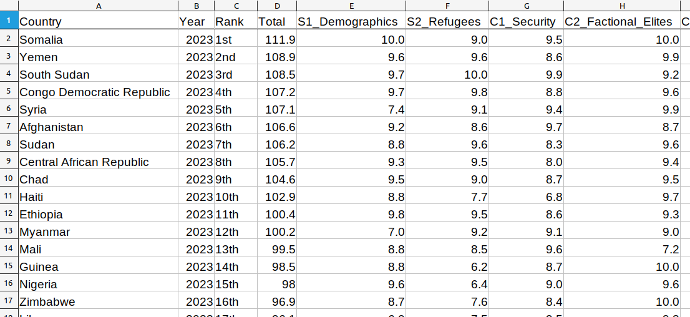
```

::: notes

Easy case for us today!

- The current year is basically tidy

<br>

*IF CLEANING WAS REQUIRED*

Here's my version focused on the most recent observations only.

- I'll post this on Canvas so we can all work off the same copy of the data.

<br>

I also pulled all of the data from the website back to 2006 and combined it all onto a single data sheet that I will also post on Canvas.

<br>

This is a MUCH longer datasheet, but that doesn't matter to R!

- Over 3,000 rows of data

- **SLIDE**: Programming is awesome for data science

:::


## {background-image="Images/background-slate_v2.png" .center}

<br>

```{r, fig.align = 'center'}

```

::: notes

This semester we learn to code!

<br>

1) Learning to code means learning to break down complicated tasks into simple steps
- You'll be amazed by how much you can accomplish once you learn some very basic code.

- This process will almost certainly begin to make impacts in the rest of your life too!

<br>

2) Learning to code means learning to do science in transparent and replicatable ways
- Doing analyses in code means having a written record of every step you took in your process

- Other scientists can check your work or build on top of it!

- You can return to these notes and steps in the future (Senior Seminar) and extract exactly what you need to do new things!

<br>

**SLIDE**: Learning to code is absolutely a CV item

:::


## {background-image="Images/background-slate_v2.png" .center}

<br>

```{r, fig.align = 'center'}
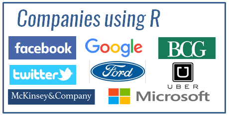
```

::: notes

No matter what career you end up pursuing, you will benefit from being:

1. More comfortable using a computer,

2. A better problem-solver, and

3. Having developed better habits in note taking and transparency

<br>

So, why are we learning R?

1. It is free,

2. it is cross-platform, and

3. it is cutting-edge, and

4. it is WIDELY used by companies across the world.

:::


## {background-image="Images/background-slate_v2.png" .center}

<br>

```{r, fig.align='center'}
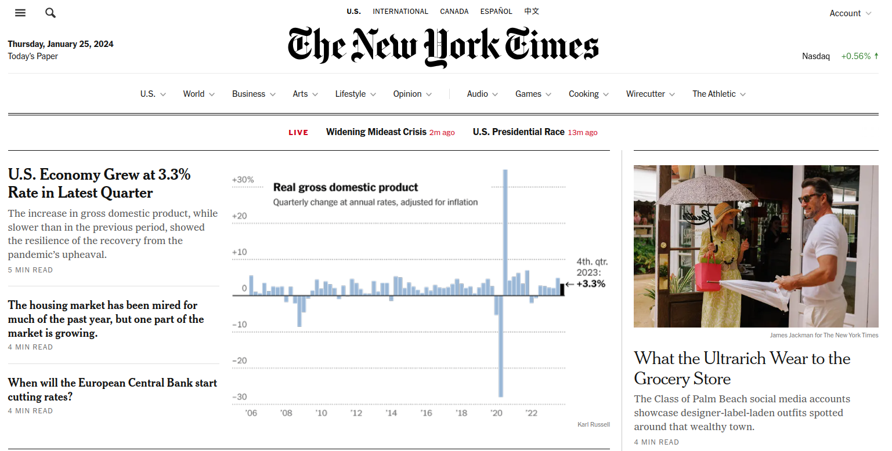
```

::: notes

R is the data visualization tool used by the NYT data team

:::


## {background-image="Images/background-slate_v2.png" .center}

<br>

:::: {.columns}
::: {.column width="50%"}
```{r, fig.align='center'}
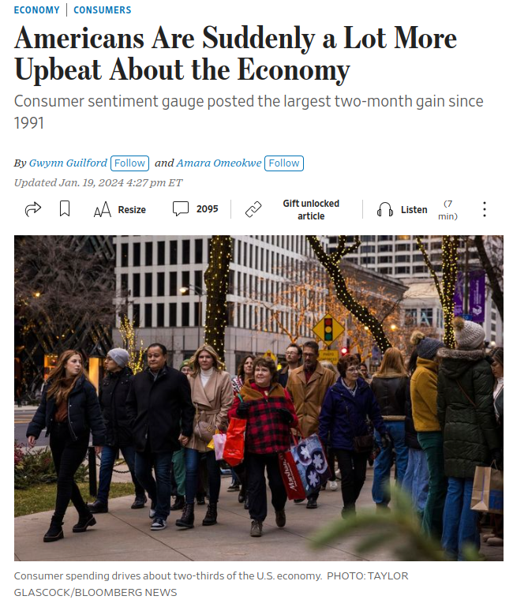
```
:::

::: {.column width="50%"}
```{r, fig.align='center'}
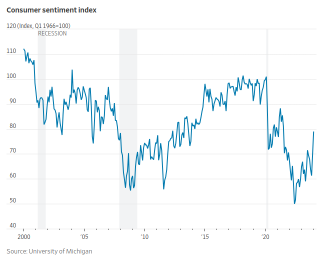
```
:::
::::

::: notes

R is the data visualization tool used by the WSJ data team

<br>

And the Economist, the Financial Times, and on and on and on

:::


## You can (and will) make animated plots! {background-image="Images/background-slate_v2.png" .center}

<br>

```{r, fig.retina=3, fig.align='center', fig.asp=0.4, out.width='100%', fig.width=8, eval=TRUE, cache=TRUE}
library(gganimate)
library(gapminder)

gapminder |>
  filter(continent != "Oceania") |>
  ggplot(aes(x = gdpPercap, y = lifeExp, size = pop, color = country)) +
  geom_point(alpha = 0.7, show.legend = FALSE) +
  scale_x_log10() +
  facet_wrap(~ continent, ncol = 4) +
  scale_colour_manual(values = country_colors) +
  scale_size(range = c(3, 13)) +
  transition_time(year) + #<<
  labs(title = 'Year: {frame_time}', x = "GDP per capita (log 10)", y = "Life Expectancy") 
```

::: notes

Along the way this semester we'll pepper in some fun approaches to using animation to create more dynamic visualizations

- A great tool for presentations and reports that live on the web

:::


## {background-image="Images/background-slate_v2.png" .center}

:::: {.columns}
::: {.column width="45%"}
**R**

```{r, fig.align='left'}
knitr::include_graphics("Images/03_3-R_Icon2.png")
```
:::

::: {.column width="10%"}

:::

::: {.column width="45%"}
**RStudio**

```{r, fig.align='right'}
knitr::include_graphics("Images/03_3-RStudio_Icon.png")
```
:::
::::

::: notes

Enough preamble, let's get into R!

- To begin today I'd like everyone to work with R on the lab computers

<br>

Confusingly, there are two pieces of software on these computers (and maybe three if multiple versions of R are installed).

- I want everyone to open RStudio, not R.

<br>

**SLIDE**: Why are there two pieces of software?

:::

## {background-image="Images/background-slate_v2.png" .center}

```{r, fig.align='center'}
knitr::include_graphics("Images/03_3-R_Engine.png")
```

::: notes

Key analogy: R is the engine and RStudio is the fancy dashboard we use to drive the car

- When you open RStudio, you are opening R!

- RStudio just makes it much, much easier to work with R to get things done.

<br>

You can absolutely do everything in R without RStudio.

- You cannot use RStudio without having R.

<br>

So, this semester you are learning to code in R but we'll be working in RStudio.

### Make sense?

:::

## {background-image="Images/background-slate_v2.png" .center}

```{r, fig.align='center'}
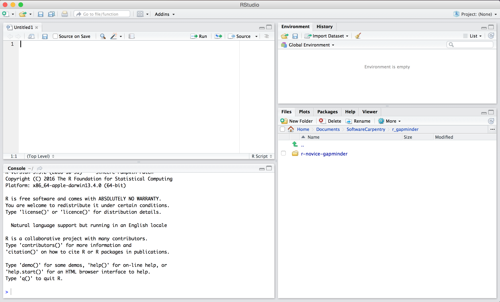
```

::: notes
**Does everybody have RStudio open?**

- It should look something like this.

<br>

By default, RStudio uses a four pane layout but we'll spend most of our time using two of them.

<br>

To start I want us to make a bunch of configuration changes that I think will make your life easier.

- I will post today's slides on Canvas for future reference

:::

## {background-image="Images/background-slate_v2.png" .center}

:::: {.columns}
::: {.column width="50%"}
1. Open RStudio

<br>

2. "Tools" &rarr; "Global Options"

<br>

3. Uncheck all boxes in "General"
:::

::: {.column width="50%"}
```{r, fig.align='center'}
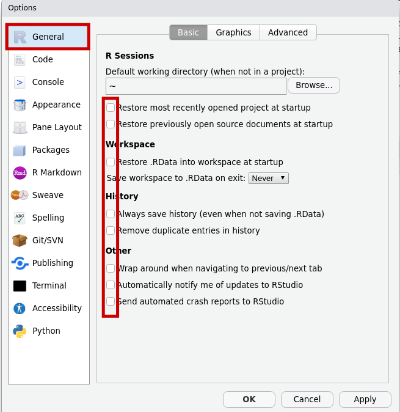
```
:::
::::

::: notes

Let's go into the options!

<br>

Unchecking all the boxes here tells RStudio we want to start from scratch whenever we open the program

- Good practice for doing science
    - You need to keep yourself rooted in good file organization practices, no shortcuts!

- Even better practice when working in a computer lab!

:::


## {background-image="Images/background-slate_v2.png" .center}

:::: {.columns}
::: {.column width="50%"}
1. "Code" page

<br>

2. &#10004; soft-wrap R source files
:::

::: {.column width="50%"}
```{r, fig.align='center'}
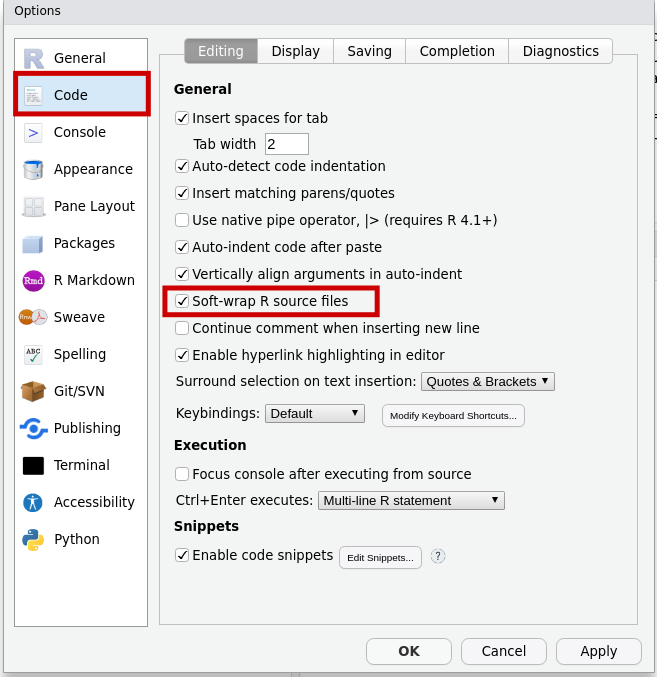
```
:::
::::

::: notes

Wraps the text in your code to make it easier to read.

- Trust me.

:::

## {background-image="Images/background-slate_v2.png" .center}

:::: {.columns}
::: {.column width="50%"}
1. "Pane Layout" page

<br>

2. Move the "Console" to the top-right box
:::

::: {.column width="50%"}
```{r, fig.align='center'}
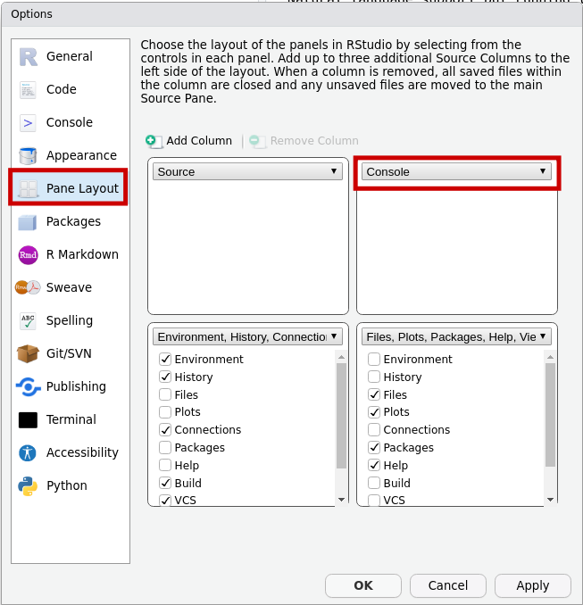
```
:::
::::

::: notes

Using the four drop-down windows you can reorganize the layout of the windows.

- I'd like you to start with this change so we can keep our notes side-by-side with the R Console.

:::


## {background-image="Images/background-slate_v2.png" .center}

:::: {.columns}
::: {.column width="50%"}
1. "Rmarkdown" page

<br>

2. Uncheck "Show output inline..."
:::

::: {.column width="50%"}
```{r, fig.align='center'}
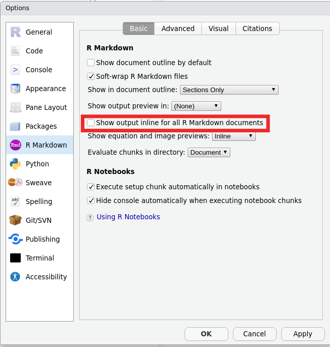
```
:::
::::

::: notes

Another option RStudio is doing to try and help you that I think is annoying.

- Keep the code output in the console, not mixed into your notes.

- Again, trust me for now, feel free to change it later when you get comfortable

:::


## {background-image="Images/background-slate_v2.png" .center}

```{r, fig.align='center'}
knitr::include_graphics("Images/02_1-RStudio_setup.png")
```


## Organize your Semester {background-image="Images/background-slate_v2.png" .center}

**Data and Notes**

<br>

:::: {.columns}
::: {.column width="50%"}
Include:

- A top-level folder for the class,

- A folder for the data, and 

- A folder for each report
:::

::: {.column width="50%"}
```{r, fig.align='center'}
knitr::include_graphics("Images/02_1-Folders.png")
```
:::
::::

::: notes

I'm going to ask everyone to adopt this file organization structure for the semester.

- ALL code we write will assume this is where your files and data live.

### Questions on this?

<br>

These notes and data CANNOT live on the lab computer.

- These computers get wiped and refreshed from time-to-time to keep them running well.

- DON'T lose your data because of this!

<br>

My advice, if you're going to work on the lab computers.

- Set up this folder structure on a usb key, AND

- At the end of every class upload the changes to your cloud account (OneDrive)

<br>

REMEMBER, lost data/notes/reports due to poor data practices are on you!

<br>

### Any questions on the set-up / configuration stuff we've covered so far?

Ok, let's make some stuff!

:::


## Create a script file: Getting_Started.R {background-image="Images/background-slate_v2.png" .center}

<br>

:::: {.columns}
::: {.column width="50%"}
**Option 1**

"File" 

&#8595;

"New File" 

&#8595;

"R Script"
:::

::: {.column width="50%"}
**Option 2**

```{r, fig.align='center'}
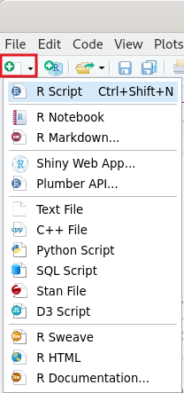
```
:::
::::

::: notes

A "script" file is a handy method for creating notes or building a data project in R.

<br>

Two options shown here.

- Create the new script and then save it with the filename "Getting_Started."

- It will add the ".R" automatically.

<br>

In future, anytime you double-click to open a .R file it should open it directly in RStudio.

:::

## {background-image="Images/background-slate_v2.png" .center}

```{r, fig.align='center'}
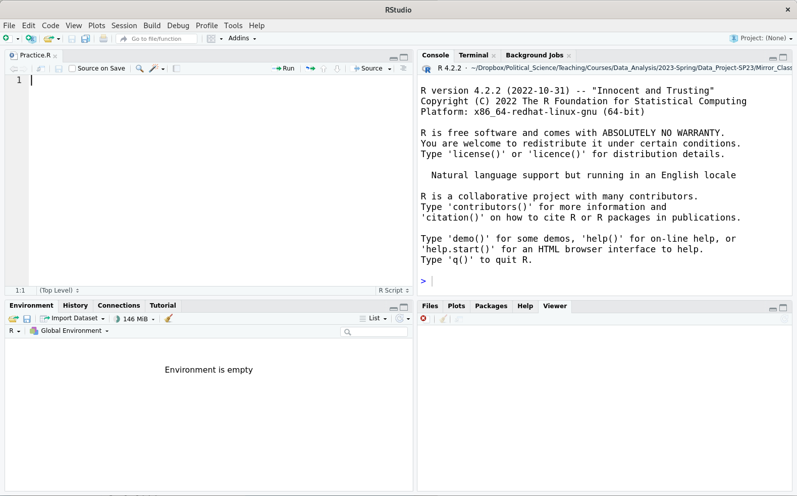
```

::: notes

Hopefully, everybody is now looking at an RStudio screen like this.

- My apologies that on the slide the file is labeled "Practice.R" instead of the "Getting Started.R"

<br>

And remember, you write your notes on the left and the R console produces stuff on the right

<br>

My request is that you create a new script file for each day of class and use that to take notes and practice code.

- Don't just keep adding onto the same one, it can get unwieldy.

:::


## {background-image="Images/background-slate_v2.png" .center}

```{r, fig.align='center'}
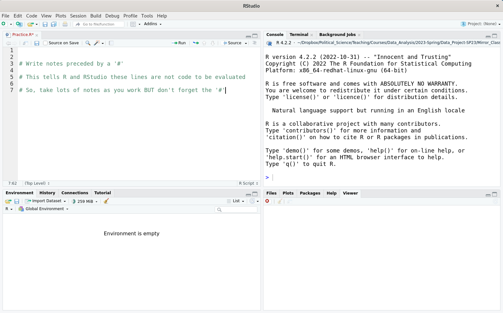
```

::: notes

You can take notes in an R script (and you SHOULD!) using the hash symbol.

- Each line you want to write that is NOT R code must start with a hash.

<br>

Get in the habit of annotating your code!

- Every time you write a line of code to do something add a note above it telling you what it does

- This is an invaluable habit!

<br>

Remember, each day's notes (e.g. script file) are a resource for you going forward.

- Your work in class is designed to help you create a record of all the skills we will learn that you may want to use in Senior Seminar!

- So, label your script files so you know where to go in future when you need something specific

<br>

For example, next week we will use code to calculate descriptive statistics.

- e.g. mean, median, percentiles, IQRs, SD, etc

- I will suggest you label your notes file for that class as "Descriptive statistics"!

<br>

### Make sense?

:::

## Using R as a Calculator {background-image="Images/background-slate_v2.png" .center}

<br>

:::: {.columns}
::: {.column width="50%"}
```{r}
tribble(
  ~Function, ~Description,
  "x + y", "Addition",
  "x - y", "Subtraction",
  "x * y", "Multiplication",
  "x / y", "Division",
  "x ^ y", "Exponentiation"
) |>
  kableExtra::kbl(align = c("c", "l"))
```
:::

::: {.column width="50%"}
```{r, echo=TRUE, eval=FALSE}
# Addition & subtraction
151 + 13 - 224

# Division
831/12

# Exponentiation
5^12

# Multiplication, 
# division and parentheses
312 * (23/154)
```
:::
::::

::: notes

R is an insanely overpowered calculator.

<br>

Everybody copy down these notes.
- Feel free to swap in whatever numbers you want.

<br>

Notice the color difference between lines that are code and lines with a hash that are comments or notes
:::


## {background-image="Images/background-slate_v2.png" .center}

<br>

```{r, fig.align='center'}
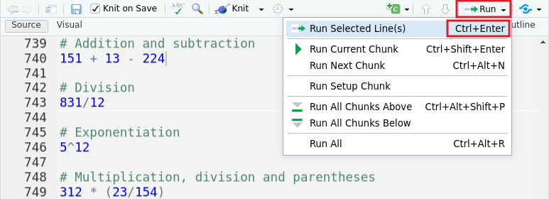
```

::: notes

Let's get our answers!

- Each of these lines IS programming code! Congrats!

<br>

We need to send your code to the console so R can "run" it.

<br>

Option 1: Put your mouse cursor on the line you want to run and press Ctrl-Enter

<br>

Option 2: Click the first line on the 'Run' menu.

<br>

Everybody take a minute to practice running the code you've written

:::


## Using R for simple relationships {background-image="Images/background-slate_v2.png" .center}

<br>

:::: {.columns}
::: {.column width="50%"}
```{r}
tribble(
  ~Function, ~Description,
  "x < y", "Less than",
  "x <= y", "Less or equal to", 
  "x > y", "Greater than", 
  "x >= y", "Greater or equal to",
  "x == y", "Equal to",
  "x != y", "Not equal to"
  ) |>
  kableExtra::kbl(align = c("c", "l"))
```
:::

::: {.column width="50%"}
```{r, echo=TRUE, eval=FALSE}
# Less than
22 < 234

# Greater than
67 > 5366

# Equal to
7 == 32

# Not equal to
7 != 32
```
:::
::::

::: notes

You'll also find R is very good at comparing values.

- I understand this looks abstract, but I assure you this is a very important element in statistics AND programming.

<br>

Everybody copy these down and take a minute to practice running these comparisons.

- Feel free to change the numbers to anything you want.

- The results should all be TRUE or FALSE

<br>

Important for your notes, checking if two values are EQUAL requires TWO equals signs.

- One equals sign works like the arrow we use to save a value

- Two equals signs ask the question "are these two values the same"?

<br>

### Everybody doing ok?

:::


## Using R for Vectors of Data {background-image="Images/background-slate_v2.png" .center}

```{r, echo=TRUE, eval=FALSE}
# Save a list of numbers as the object 'x1'
x1 <- c(64, 57, 52, 58, 67)

# Print the numbers in the object
x1

# Do math on the vector
x1 + 10
x1 * 3

# Check relationships on the vector
x1 > 56
```

::: notes

One of the remarkably powerful uses of R is that it will let you save lists of numbers (e.g. data) using a named object.

<br>

Imagine 'x1' here is a single variable describing the heights in inches for five people.

- Once you save the heights as an object you can now do calculations on all of the heights at once!

<br>

### Make sense?

<br>

Copy all this down and make sure you can run the code.
:::


## Installing Extra Packages {background-image="Images/background-slate_v2.png" .center}

```{r, echo=TRUE, eval=FALSE}
# Install packages with extra tools

# Readxl let's you input Excel files into R
install.packages("readxl")

# Tidyverse makes tons of statistics work easier
install.packages("tidyverse")
```

::: notes

One more configuration step, we need to install two packages.

- Packages are collections of extra features that you can add to R when you need them.

<br>

After a new install of R, we need to do each of these one time. Unless you update R you won't have to install these again.

- We'll start using these Friday.

<br>

Run each of these lines and let me know when they are done.

:::


## Let's Install R! {background-image="Images/background-slate_v2.png" .center}

1. http://www.r-project.org/

2. Click on “CRAN.”

3. Select a site near you or “0-Cloud”

:::: {.columns}
::: {.column width="50%"}
**Windows**

+ "Download R for Windows"
+ "Download and Install R"
+ Select "base"
+ Download the .exe and run it
:::

::: {.column width="50%"}
**macOS**

+ "Download R for (Mac) OS X"
+ Click .pkg under "Latest release"
+ Run the .pkg file
:::
::::

::: notes

If you'd like to be able to work on your own computer then we need to install the software!

First step is to install R, then you can install RStudio.
:::


## Let's Install RStudio! {background-image="Images/background-slate_v2.png" .center}

https://posit.co/download/rstudio-desktop/

<br>

1) Scroll down to "All Installers"

<br>

2) Download and run the file for your OS

::: notes

After installing RStudio use the notes on the slides to configure your installation.
:::


## For Next Class {background-image="Images/background-blue_triangles2.png" .center}

<br>

1. Wheelan (2014) chapter 2 “Descriptive Statistics”

2. Johnson (2012) p361-376

::: notes

Monday we start doing statistics in R!

- Two readings to get you ready to work.

<br>

### Questions on the assignment?
:::