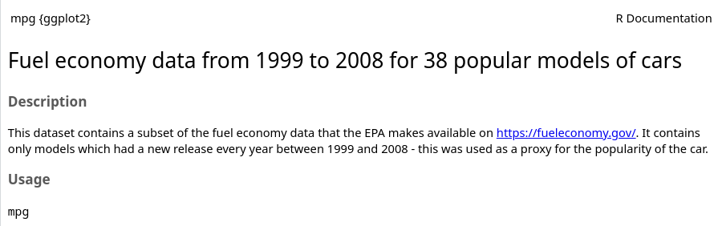
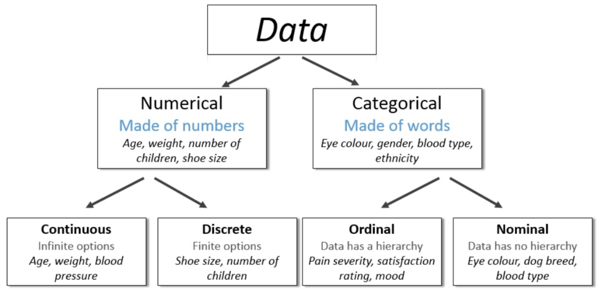

---
output:
  xaringan::moon_reader:
    css: ["default", "extra.css"]
    lib_dir: libs
    seal: false
    nature:
      highlightStyle: github
      highlightLines: true
      countIncrementalSlides: false
      ratio: '16:9'
---

```{r, echo = FALSE, warning = FALSE, message = FALSE}
##xaringan::inf_mr()
## For offline work: https://bookdown.org/yihui/rmarkdown/some-tips.html#working-offline
## Images not appearing? Put images folder inside the libs folder as that is the main data directory

library(tidyverse)
library(readxl)
library(stargazer)
##library(kableExtra)
##library(modelr)

knitr::opts_chunk$set(echo = FALSE,
                      eval = TRUE,
                      error = FALSE,
                      message = FALSE,
                      warning = FALSE,
                      comment = NA)
```

background-image: url('libs/Images/background-data_blue_v3.png')
background-size: 100%
background-position: center
class: middle, inverse

.size80[**Today's Agenda**]

<br>

.size50[
**Univariate Analyses 1**

Descriptive Statistics
]

<br>

.center[.size40[
  Justin Leinaweaver (Spring 2024)
]]

???

## Prep for Class
1. Assume throughout that they did the readings! Ask clarifying questions but don't start from scratch with the tools.

<br>

Let's get to work!


---

background-image: url('libs/Images/background-teal3.png')
background-size: 100%
background-position: center

.size70[**Our Research Project**]

<br>

.size45[
Report 1: Analyze the Outcome Variable(s)

Report 2: Analyze the Predictor Variable(s)

Report 3: Bivariate Test of your Hypotheses

Report 4: Multivariate Test of your Hypotheses
]

???

Our project this semester builds up, as all good projects must, in an iterative fashion.

- First we critically analyze the outcome we intend to explain
    - Why the variation in gender inequality across the world?
    
- Second we critically analyze the predictors we believe will explain the outcome

- Third we perform fairly simple tests to examine the relationship between the predictors and the outcome.

- Finally, we build a more thorough test of the possible relationship between them.

<br>

The nice thing about this is that this "normal" process also allows us to learn the coding and statistics we need in a slow, deliberate fashion.

- The first two reports are what we call univariate analyses or analyses that focus on a single variable

- This means we will spend the next week learning and practicing a series of simple, one variable tools and then we'll apply those tools in both reports 1 and 2!

- Lots of time to boost our confidence in the tools and to practice applying and interpreting them.

### Sound good?


---

background-image: url('libs/Images/background-teal3.png')
background-size: 100%
background-position: center
class: middle

.center[.size60[**Univariate Analyses**]]

.size40[
1. Descriptive Statistics
    - Counts, Proportions, Means, Medians, Standard Deviations, Percentiles, Ranges and Interquartile Ranges (IQR)

2. Visualizations
    - Bar plots, histograms, box plots and line plots
]

???

Over the next week these are the tools we'll be learning to code and interpret.

- This is the complete list of things I will expect to see you use and explain on the first two reports.

### Everybody have this written down?

- Use this like a checklist for yourself as we go

- Over the next week you should make sure you understand how to make each of these in R and how to interpret their results


---

class: middle

```{r, echo=FALSE}
options(width = 95)
set.seed(543)
d <- round(runif(506, 100, 250), 0)
d
```

???

Ok, so why do we need univariate analyses?

- Imagine you had collected all of this data
    - This could be dollars, pounds, degrees, anything.
- As a simple list this is an overwhelming amount of information for anyone to read let alone understand.

<br>

Univariate analyses refer to a series of tools that allow you to summarize a big list of data points into something more digestible
- What is the middle of this collection? 
    - e.g. an average
- How much does the data vary around the middle? 
    - e.g. Is everybody close to or far away from the average?
- What is the smallest and largest number in the data?
    - e.g. What are the top and bottom numbers that wrap around all the data?
    
<br>

So, if these were a list of house prices in SGF it would be super useful to know:
- What is the cheapest and most expensive house?
- How much is the average house?
- Are most houses close to the average or spread out across the whole range?

### Make sense?


---

background-image: url('libs/Images/background-teal3.png')
background-size: 100%
background-position: center
class: middle, center

.center[.size70[**Defining Statistics: Level 1**]]

.size55[
Statistics is a set of tools we use to summarize data

Summarize: "give a brief statement of the main points of (something)" (Oxford Dictionary).
]

???

The key here is to realize that this is the problem statistics was invented to solve.

*READ SLIDE*

Now, don't get me wrong, we learn a TON from summary, but we also have bigger ambitions!


---

background-image: url('libs/Images/background-teal3.png')
background-size: 100%
background-position: center
class: middle, center

.center[.size70[**Defining Statistics: Level 2**]]

.size50[
"The practice or science of collecting and analyzing numerical data in large quantities, especially for the purpose of **inferring proportions in a whole from those in a representative sample**" (Oxford Dictionary).
]

???

In simpler terms, statistics also gives us the tools to learn things about an entire population based only on the summaries of data from a sample of that population.

- e.g. This survey of 2,300 Americans tells us how popular Pres Biden is...

<br>

So, those are the big, initial goals.

- The takeaway is that univariate analyses and descriptive statistics, even if they seem simple, can be INCREDIBLY powerful tools for learning about the world.


---

background-image: url('libs/Images/background-blue_triangles2.png')
background-size: 100%
background-class: center
class: middle

.size40[.center[**New Script: 2023-02-10-Descriptive_Statistics.R**]]

.pull-left[
.center[.size30[
**Option 1**

"File" 

&#8595;

"New File" 

&#8595;

"R Script"
]]]

.pull-right[
.center[.size30[**Option 2**]]

```{r, fig.align='center', out.width='38%'}
knitr::include_graphics("libs/Images/03_3-New_Script.png")
```

]

???


---

class: middle, slidegreen

```{r, fig.align='center', out.width='90%'}

```

```{r}
mpg |>
  slice(1:6) |>
  kableExtra::kbl()
```

???

R includes a number of built in data sets for practice.

- Each extra package tends to bring more practice data as well.

<br>

The "mpg" data set is provided as part of an extra package.

- "This dataset contains a subset of the fuel economy data that the EPA makes available on https://fueleconomy.gov/."

- 'mpg' has data on 234 cars (observations) across 11 variables

<br>

**SLIDE**: To access the data set...


---

background-image: url('libs/Images/background-teal3.png')
background-size: 100%
background-position: center
class: middle

.code160[
```{r, echo=TRUE, eval=FALSE}
# Load the package that includes the data set 'mpg'
library(tidyverse)

# View the 'mpg' data set
View(mpg)

# List all of the variables in the data set
names(mpg)

# To access a single variable use '$'
mpg$manufacturer
mpg$year
```
]

???

Last week we used R as a calculator on single numbers and on a vector of numbers.

<br>

From here forward we'll be working with data sets that include multiple variables in them.
- e.g. the named object actually holds multiple variables inside it

<br>

First key observation about using R illustrated by this code:

- You will primarily write code in R to either input data or apply functions to that data.

- As you see here, functions are a word (or words) followed by parentheses.

### Questions on the code so far?


---

background-image: url('libs/Images/background-blue_triangles2.png')
background-size: 100%
background-class: center
class: middle

.size50[**3. Variable .textblue[type] determines the .textblue[tool]**]

```{r, fig.align='center', out.width='100%'}

```

???

Now, as we start calculating descriptive statistics don't forget our third principle of data analysis

- Variable Type Determines Tool

<br>

All "data" can be classified by its type.

- The most important distinction is this middle row.

- Is the variable measured using numbers or words?

<br>

**SLIDE**: We'll start our work on descriptive stats with categorical variables.


---

background-image: url('libs/Images/background-teal3.png')
background-size: 100%
background-position: center
class: middle

.center[.size45[**Descriptive Statistics on Categorical Variables**]]

<br>

.code170[
```{r, echo=TRUE, eval=FALSE}
# 1. Count the levels with table()
table(mpg$manufacturer)

# 2. Proportions Method 1
table(mpg$manufacturer)/234

# 3. Proportions Method 2
prop.table(table(mpg$manufacturer))
```
]

???

Categorical variables, e.g. those with observations defined as categories or levels, can be summarized as either counts or proportions.

### Everybody got the code written down and working?

That's all there is to it.
- Descriptive stats on categorical variables is super easy.

<br>

Let's make sure the intuition is clear.

### How do we manually convert the counts in the table into proportions?

<br>

### And, out of curiosity, what proportion of the cars in the data set are four-wheel drive?
```{r, echo=TRUE}
prop.table(table(mpg$drv))
```


---

background-image: url('libs/Images/background-teal3.png')
background-size: 100%
background-position: center
class: middle

.center[.size45[**Descriptive Statistics on Numerical Variables**]]

.center[.size40[**I. Measures of Central Tendency**]]

.code180[
```{r, echo=TRUE, eval=FALSE}
# 1. Find the average with mean() 
mean(mpg$cty)

# 2. Find the median value with median()
median(mpg$cty)
```
]

???

Let's find the middle!

### Everybody got the code written down and working?

<br>

Let's make sure the intuition is clear.

### What's the difference between the median and the mean?

### And what does it mean that the mean and median city mileage are so close to each other?
- (No massive outliers!)

<br>

### To practice, what's the average fuel economy on the highway in this data set?
```{r, echo=TRUE}
mean(mpg$hwy)
median(mpg$hwy)
```


---

background-image: url('libs/Images/background-teal3.png')
background-size: 100%
background-position: center
class: middle

.center[.size45[**Descriptive Statistics on Numerical Variables**]]

.center[.size40[**II. Measures of the Spread**]]

.code110[
```{r, echo=TRUE, eval=FALSE}
# 1. Find the minimum and maximum values 
min(mpg$cty)
max(mpg$cty)
range(mpg$cty)

# 2. Find ANY percentiles with quantile() or the IQR()
quantile(mpg$cty, probs = .1) 
quantile(mpg$cty, probs = .9) 
IQR(mpg$cty)

# 3. Do all of the above with summary()
summary(mpg$cty)

# 4. Find the standard deviation with sd() 
sd(mpg$cty)
```
]

???

Let's find the spread of the data!

### Everybody got the code written down and working?

<br>

Quick hit practice!

### What's the earliest and latest year in the data set?
```{r}
range(mpg$year)
```

### What is the difference between the 50th percentile for cty fuel economy and the median value of city fuel economy?
```{r}
median(mpg$cty)
quantile(mpg$cty, probs = .5)
```

<br>

### Any questions on this code or the interpretation of these tools?

*If they ask about percentiles*
- The most common definition of a percentile is a number where a certain percentage of scores fall below that number. 
- In statistics, a k-th percentile (percentile score or centile) is a score below which a given percentage k of scores in its frequency distribution falls (exclusive definition) or a score at or below which a given percentage falls (inclusive definition). 


*If they ask about Std Dev*: 
- Hopefully building visualizations in our next two classes will help make this concept clearer!
- Long story short, a measure of how far each data point is from the average...

```{r, fig.align='center', out.width='20%'}

```


---

background-image: url('libs/Images/background-teal3.png')
background-size: 100%
background-position: center
class: middle

.center[.size65[Descriptive Stats: Summary]]

.size45[
Categorical Variables
- table() and prop.table()

Numerical Variables
- mean(), median(), range(), quartile(), IQR(), sd() 
- summary()
]

???

### Any questions on these functions and how to interpret what they produce?


---

background-image: url('libs/Images/background-blue_cubes_lighter3.png')
background-size: 100%
background-position: center
class: middle

.size70[**For Monday**]

.size55[
1. Finish the practice exercises (next slide), and

2. Read Johnson (2012) p376-392 on univariate visualizations
]

???

### Questions on the assignment?


---

background-image: url('libs/Images/background-blue_cubes_lighter3.png')
background-size: 100%
background-position: center
class: middle

.center[.size45[**Practice Exercises for Monday**]]

.size30[
1. What proportion of US presidents since 1953 have been Republicans? (Built-in Data: presidential, Variable: party)
    
2. Why are the mean and median total populations in the midwest so different from each other? (Built-in Data: midwest, Variable: poptotal)

3. How many hours per day do you have to sleep to sleep longer than 75% of studied mammals? (Built-in Data: msleep, Variable: sleep_total)
    
4. Which mammal sleeps the least and which the most? (Built-in Data: msleep, Variable: sleep_total)
]


