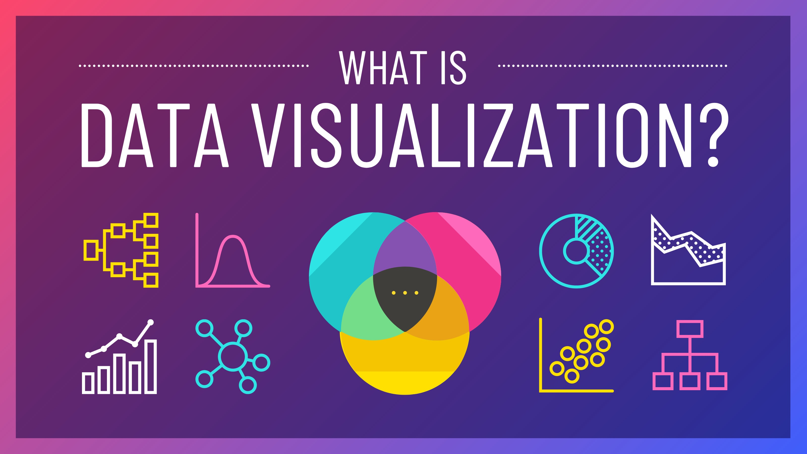
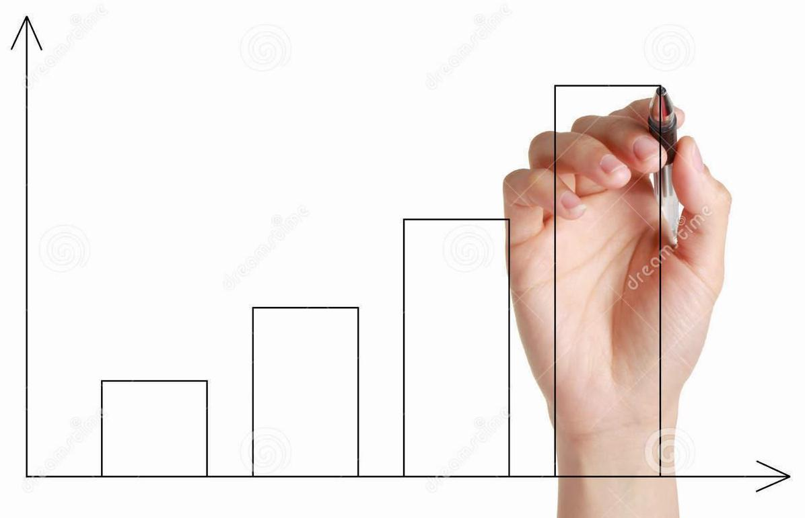
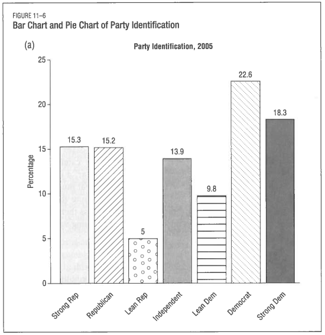
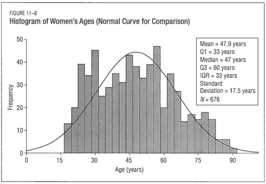
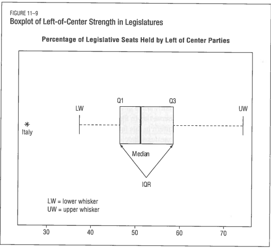
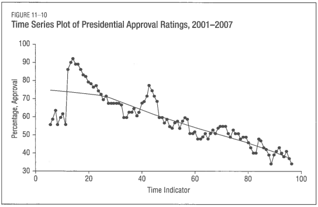

---
output:
  xaringan::moon_reader:
    css: ["default", "extra.css"]
    lib_dir: libs
    seal: false
    nature:
      highlightStyle: github
      highlightLines: true
      countIncrementalSlides: false
      ratio: '16:9'
---

```{r, echo = FALSE, warning = FALSE, message = FALSE}
##xaringan::inf_mr()
## For offline work: https://bookdown.org/yihui/rmarkdown/some-tips.html#working-offline
## Images not appearing? Put images folder inside the libs folder as that is the main data directory

library(tidyverse)
library(readxl)
library(stargazer)
##library(kableExtra)
##library(modelr)

knitr::opts_chunk$set(echo = FALSE,
                      eval = TRUE,
                      error = FALSE,
                      message = FALSE,
                      warning = FALSE,
                      comment = NA)
```

background-image: url('libs/Images/background-data_blue_v3.png')
background-size: 100%
background-position: center
class: middle, inverse

.size80[**Today's Agenda**]

<br>

.size50[
1. Review the descriptive statistics

2. Start building univariate visualizations
]

<br>

.center[.size40[
  Justin Leinaweaver (Spring 2024)
]]

???

## Prep for Class
1. Bring paper and rulers to class.


---

background-image: url('libs/Images/background-blue_cubes_lighter3.png')
background-size: 100%
background-position: center
class: middle

.center[.size45[.content-box-blue[**Practice Exercises for Monday**]]]

.size30[
1. What proportion of US presidents since 1953 have been Republicans? (Built-in Data: presidential, Variable: party)
    
2. Why are the mean and median total populations in the midwest so different from each other? (Built-in Data: midwest, Variable: poptotal)

3. How many hours per day do you have to sleep to sleep longer than 75% of studied mammals? (Built-in Data: msleep, Variable: sleep_total)
    
4. Which mammal sleeps the least and which the most? (Built-in Data: msleep, Variable: sleep_total)
]

???

### How did this go?


---

background-image: url('libs/Images/background-blue_cubes_lighter3.png')
background-size: 100%
background-position: center
class: middle

.center[.size50[**What proportion of US presidents since 1953 have been Republicans?**]]

<br>

.code150[
```{r, echo=TRUE}
prop.table(table(presidential$party))
```
]


---

background-image: url('libs/Images/background-blue_cubes_lighter3.png')
background-size: 100%
background-position: center
class: middle

.center[.size40[**Why are the mean and median total populations in the midwest so different from each other?**]]

.code130[
```{r, echo=TRUE, eval=FALSE}
# Measures of the Middle
mean(midwest$poptotal)
median(midwest$poptotal)
```

```{r, echo=TRUE, eval=TRUE}
# Measures of the Spread
sd(midwest$poptotal)
range(midwest$poptotal)
```
]

???

```{r, echo=TRUE, eval=TRUE}
# Measures of the Middle
mean(midwest$poptotal)
median(midwest$poptotal)
```


---

background-image: url('libs/Images/background-blue_cubes_lighter3.png')
background-size: 100%
background-position: center
class: middle

.center[.size45[**How many hours per day do you have to sleep to sleep longer than 75% of studied mammals?**]]

<br>

.code170[
```{r, echo=TRUE, eval=TRUE}
quantile(msleep$sleep_total, probs = .75)
```
]

???

### Out of curiosity, based on your average sleep which mammal are you closest to?

```{r, echo=TRUE}
filter(msleep, sleep_total > 7.5, sleep_total < 8.5) |>
select(name, sleep_total)
```


---

background-image: url('libs/Images/background-blue_cubes_lighter3.png')
background-size: 100%
background-position: center
class: middle

.center[.size45[**Which mammal sleeps the least and which the most?**]]

.code170[
```{r, echo=TRUE, eval=FALSE}
# Identify the range (min and max)
range(msleep$sleep_total)

# View() or use the filter() function
filter(msleep, sleep_total == 1.9)
filter(msleep, sleep_total == 19.9)
```
]

???

```{r, echo=TRUE, eval=TRUE}
# Option 1: Identify the range and then 
#           look at the data
range(msleep$sleep_total)

# Option 2: Use the filter() function
filter(msleep, sleep_total == 1.9) |>
  select(name)

filter(msleep, sleep_total == 19.9) |>
  select(name)
```


---

background-image: url('libs/Images/background-blue_cubes_lighter3.png')
background-size: 100%
background-position: center
class: middle, center

```{r, echo = FALSE, fig.align = 'center', out.width = '50%'}

```

.size45[
A method for summarizing data in more compelling, easier to understand and more informative methods than descriptive statistics.
]


---

background-image: url('libs/Images/background-blue_cubes_lighter3.png')
background-size: 100%
background-position: center
class: middle

.center[.size50[.content-box-blue[**Why draw visualizations by hand?**]]]

.pull-left[
```{r, echo = FALSE, fig.align = 'center', out.width = '100%'}

```
]

???

Today we will practice the univariate visualizations working entirely by hand!

- I've brought paper and rulers!

<br>

Please don't aim for making art today.

- We're trying to learn the intuitions underpinning each type of visualization.

<br>

Why do this?


---

background-image: url('libs/Images/background-blue_cubes_lighter3.png')
background-size: 100%
background-position: center
class: middle

.center[.size50[.content-box-blue[**Why draw visualizations by hand?**]]]

.pull-left[
```{r, echo = FALSE, fig.align = 'center', out.width = '100%'}

```
]

.pull-right[
.size45[
1. Principle 3 in action
]]

???

Learning these intutions by hand will help drive home the lesson of connnecting variable types to visualization tools.


---

background-image: url('libs/Images/background-blue_cubes_lighter3.png')
background-size: 100%
background-position: center
class: middle

.center[.size50[.content-box-blue[**Why draw visualizations by hand?**]]]

.pull-left[
```{r, echo = FALSE, fig.align = 'center', out.width = '100%'}

```
]

.pull-right[
.size45[
1. Principle 3 in action

2. Learn to think like a programmer
]]

???

Being a programmer, e.g. writing code, is a means of solving problems in small steps.

- Drawing a visualization by hand works the same way


---

background-image: url('libs/Images/background-blue_cubes_lighter3.png')
background-size: 100%
background-position: center
class: middle

.center[.size50[.content-box-blue[**Why draw visualizations by hand?**]]]

.pull-left[

<br>

<br>

<br>

.size30[
```{r, echo = FALSE, fig.align = 'center', out.width = '100%'}
mpg |>
  select(cty, hwy) |>
  pivot_longer(cols = cty:hwy, names_to = "Type", values_to = "Fuel_Economy") |>
  group_by(Type) |>
  summarize(
    N = n(),
    Mean = mean(Fuel_Economy),
    StdDev = sd(Fuel_Economy),
    Min = min(Fuel_Economy),
    Max = max(Fuel_Economy)
  ) |>
  kableExtra::kbl(digits = 2)
```
]]

.pull-right[
.size45[
1. Principle 3 in action

2. Learn to think like a programmer

3. Learn to "see" descriptive statistics
]]

???

The better you learn how specific descriptive stats connect to specific viz, the sooner you will learn to "see" the visualization in a table of descriptive statistics.


---

background-image: url('libs/Images/background-blue_cubes_lighter3.png')
background-size: 100%
background-position: center
class: middle

.center[.size45[.content-box-blue[**Principle 3: Variable Type Determines Tool**]]]

.size40[
**Univariate Visualizations**

+ If a **categorical** variable, make a **bar plot**

+ If a **numeric** variable, make a **box plot** or **histogram**

+ If a **numeric variable across time**, make a **line plot**
]

???

Here is our plan of atack for today.

- We will first draw bar plots of categorical variables,

- Then histograms and box plots for numeric variables, and

- Finally, line plots of numeric variables that change across time.

### Everybody have this written down?


---

background-image: url('libs/Images/background-blue_cubes_lighter3.png')
background-size: 100%
background-position: center
class: middle

.center[.size50[.content-box-blue[**Categorical Variable: Make a Bar Plot**]]]

.pull-left[
.size55[
**Bar Plots**

1. Counts

2. Proportions
]]

.pull-right[
```{r, echo = FALSE, fig.align = 'center', out.width = '100%'}

```
]

???

Bar plots, as the Johnson reading explains, represent the number (or proportion) of observations in each level using the height of a bar.

<br>

Drawing a bar plot is super easy:

1. Count the levels in the variable,

2. Draw the x axis with labels for each level,

3. Draw the y-axis with enough height to represent the largest count

4. Draw each bar to represent the number of observations in that level

### Make sense?


---

background-image: url('libs/Images/background-blue_cubes_lighter3.png')
background-size: 100%
background-position: center
class: middle, center

.size50[.content-box-blue[**Categorical Variable: Make a Bar Plot**]]

<br>

.size50[
**By hand**, draw a bar plot of drive train levels (drv) for the 234 cars in the mpg dataset.
]

.size30[Process: 1) Count the levels, 2) Draw X axis with labels, 3) Draw Y axis to max height, 4) Add the bars]

???


---

background-image: url('libs/Images/background-blue_cubes_lighter3.png')
background-size: 100%
background-position: center
class: middle

.center[.size50[.content-box-blue[**Categorical Variable: Make a Bar Plot**]]]

.pull-left[
```{r, echo=FALSE, fig.retina=3, fig.width=4, fig.asp=1, out.width='100%'}
mpg |>
  ggplot(aes(x = drv)) +
  geom_bar(width = .5, fill = c("blue1", "skyblue3", "lightblue")) +
  theme_bw() +
  labs(x = "", y = "Count of Observations") +
  #scale_x_discrete(limits = c("4", "f", "r"), labels = c("4 Wheel Drive", "Front Wheel Drive", "Rear Wheel Drive")) +
  scale_x_discrete(limits = c("r", "4", "f"), labels = c("Rear Wheel\n Drive", "4 Wheel\n Drive", "Front Wheel\n Drive")) +
  geom_hline(yintercept = seq(25, 100, 25), color = "white")
```
]

.pull-right[

<br>

<br>

.code150[
```{r, echo=TRUE, fig.retina=3}
table(mpg$drv)
```
]]

???

### How did we do?

I ordered my bars from least to most to help aid ease of interpretation.

<br>

Let's practice this one more time!


---

background-image: url('libs/Images/background-blue_cubes_lighter3.png')
background-size: 100%
background-position: center
class: middle, center

.size50[.content-box-blue[**Categorical Variable: Make a Bar Plot**]]

<br>

.size50[
**By hand**, draw a bar plot of **the proportion** of parties that have controlled the presidency since 1953 in the presidential data set.
]

.size30[Process: 1) Count the levels, 2) Draw X axis with labels, 3) Draw Y axis to max height, 4) Add the bars]

???


---

background-image: url('libs/Images/background-blue_cubes_lighter3.png')
background-size: 100%
background-position: center
class: middle

.center[.size50[.content-box-blue[**Categorical Variable: Make a Bar Plot**]]]

.pull-left[
```{r, echo=FALSE, fig.retina=3, fig.width=4, fig.asp=1, out.width='100%'}
presidential |>
  count(party) |>
  mutate(
    sum = sum(n),
    prop = n/sum
  ) |>
  ggplot(aes(x = party, y = prop)) +
  geom_col(width = .5, fill = c("blue1", "red3")) +
  theme_bw() +
  labs(x = "", y = "Proportion of Observations") +
  scale_y_continuous(labels = scales::percent_format()) +
  geom_hline(yintercept = seq(.2, .6, .2), color = "white")
```
]

.pull-right[

<br>

<br>

.code100[
```{r, echo=TRUE, fig.retina=3}
prop.table(table(presidential$party))
```
]]

???

### How did we do?

<br>

### Everybody comfortable with what bar plots are used for, how you make them and how we interpret them?


---

background-image: url('libs/Images/background-blue_cubes_lighter3.png')
background-size: 100%
background-position: center
class: middle, center

.size50[.content-box-blue[**Numerical Variable: Make a Bar Plot?**]]

<br>

.size50[
Why can't we simply make a bar plot for total population (`poptotal`) in the `midwest` data set?
]

???

Everybody try it!

- Use the table function to count the levels in midwestern populations


---

background-image: url('libs/Images/background-blue_cubes_lighter3.png')
background-size: 100%
background-position: center
class: middle, center

.size50[.content-box-blue[**Numerical Variable: Make a Bar Plot?**]]

.code40[
```{r, echo=FALSE}
options(width = 200)

# Count levels in the poptotal variable
table(midwest$poptotal)
```
]

???

In the realm of numerical data there may not be any overlap in numbers in the data set!

- This means we get a table of almost all '1's 
    - e.g. the odds of two cities having exactly 18,409 people are pretty darn low.
    
- That's, arguably, less informative than just giving someone the actual data.

### Make sense?

<br>

### So, what do we do?

    


---

background-image: url('libs/Images/background-blue_cubes_lighter3.png')
background-size: 100%
background-position: center
class: middle

.center[.size50[.content-box-blue[**Numerical Variable: Make a Histogram**]]]

```{r, echo = FALSE, fig.align = 'center', out.width = '70%'}

```

???

In a bar plot for a categorical variable, each bar represents the count of each level.

To build a bar plot for numeric data we group numbers that are close together into each bar.

- In histograms we call these groupings "bins"

<br>

This example from the book chapter shows a histogram of women's ages.

- It looks like five bars per 15 years so I'm guessing the bins are each five years wide.

### Does that make sense?

<br>

Let's practice building a histogram to see if that helps drive the intuition home for you.


---

background-image: url('libs/Images/background-blue_cubes_lighter3.png')
background-size: 100%
background-position: center
class: middle

.center[.size50[.content-box-blue[**Numerical Variable: Make a Histogram**]]]

<br>

.size35[
1. Make a binned table of city fuel economy (mpg data set)
    - Bin 1: 0 - 10
    - Bin 2: 11 - 20
    - Bin 3: 21 - 30
    - Bin 4: 31 - 40

2. Make a bar plot of these bins
]

???

1. Run the table function on the cty fuel economy variable
    - The add together the totals in each bin
    
2. THEN draw the bars for the new groups!


---

background-image: url('libs/Images/background-blue_cubes_lighter3.png')
background-size: 100%
background-position: center
class: middle, center

.size50[.content-box-blue[**Numerical Variable: Make a Histogram**]]

.pull-left[
```{r, echo=FALSE, fig.retina=3, fig.width=4, fig.asp=1, out.width='100%'}
mpg |>
  mutate(
    cty2 = case_when(
      cty < 10 ~ "0 - 10",
      cty < 20 ~ "11 - 20",
      cty < 30 ~ "21 - 30",
      cty < 40 ~ "31 - 40")
  ) |>
  ggplot(aes(x = cty2)) +
  geom_bar(width = .75, fill = "orange3") +
  theme_bw() +
  labs(x = "Fuel Economy (City)", y = "Proportion of Observations") +
  geom_hline(yintercept = seq(50, 150, 50), color = "white")
```
]

.pull-right[

<br>

.size40[
```{r, echo=FALSE}
mpg |>
  mutate(
    cty2 = case_when(
      cty < 10 ~ "0 - 10",
      cty < 20 ~ "11 - 20",
      cty < 30 ~ "21 - 30",
      cty < 40 ~ "31 - 40")
  ) |>
  count(cty2) |>
  kableExtra::kbl(col.names = c("City Fuel Economy", "Count"), align = "c")
```
]]

???

### Everybody have a bar plot that looks like this?


---

background-image: url('libs/Images/background-blue_cubes_lighter3.png')
background-size: 100%
background-position: center
class: middle, center

.size50[.content-box-blue[**Numerical Variable: Make a Histogram**]]

.pull-left[
```{r, echo=FALSE, fig.retina=3, fig.width=4, fig.asp=1, out.width='100%'}
mpg |>
  ggplot(aes(x = cty)) +
  geom_histogram(fill = "orange3", color = "white", bins = 5) +
  theme_bw() +
  labs(x = "Fuel Economy (City)", y = "",
       title = "5 Bins")
```
]

.pull-right[
```{r, echo=FALSE, fig.retina=3, fig.width=4, fig.asp=1, out.width='100%'}
mpg |>
  ggplot(aes(x = cty)) +
  geom_histogram(fill = "orange3", color = "white", bins = 25) +
  theme_bw() +
  labs(x = "Fuel Economy (City)", y = "",
       title = "25 Bins")
```
]

???

Using software you can easily adjust the size of the bins in order to find a version of the histogram that you feel best conveys the shape of the distribution.

- The five bins version is approx 5 mpg per bar

- The 25 bins version is slightly more than 1 mpg per bar

### Is everybody clear on how a histogram is like a bar plot applied to a numeric variable?

<br>

So, a histogram is a binned bar plot and it attempts to show us the shape of the distribution.

- BUT, as you see here, the size of the bins has a BIG effect on what the histogram looks like!


---

background-image: url('libs/Images/background-blue_cubes_lighter3.png')
background-size: 100%
background-position: center
class: middle

.center[.size50[.content-box-blue[**Numerical Variable: Make a Box Plot**]]]

.pull-left[
.size40[
**Box Plots**
- 25th percentile

- Median (50th)

- 75th percentile

- IQR x 1.5
]]

.pull-right[
```{r, echo = FALSE, fig.align = 'center', out.width = '100%'}

```
]

???

An alternative to the histogram is the box plot.

- Much simpler to make (by hand) and conveys much of the same information, BUT

- Typically harder for untrained people to understand

### Any questions on the components of a box plot?

<br>

Let's practice!

By hand, everybody draw me a box plot of city fuel economy in the mpg data set.

- Remember, the summary() function gets you everything you need.


---

background-image: url('libs/Images/background-blue_cubes_lighter3.png')
background-size: 100%
background-position: center
class: middle

.center[.size45[.content-box-blue[**Numerical Variable: Make a Box Plot**]]]

.pull-left[
<br>

```{r, echo=TRUE}
# Summary stats
summary(mpg$cty)

# Calculate the tails
median(mpg$cty) - IQR(mpg$cty)*1.5
median(mpg$cty) + IQR(mpg$cty)*1.5
```
]

.pull-right[
```{r, echo=FALSE, fig.retina=3, fig.width=5, fig.asp=1, out.width='100%', fig.align='center'}
mpg |>
  ggplot(aes(y = 1, x = cty)) +
  geom_boxplot(fill = "orange3") +
  theme_bw() +
  labs(x = "Fuel Economy (City)", y = "") +
  scale_y_continuous(limits = c(0.25, 1.75), breaks = c(0, .5, 1, 1.5, 2), labels = rep("", 5))
```
]

???

### How did we do?


---

background-image: url('libs/Images/background-blue_cubes_lighter3.png')
background-size: 100%
background-position: center
class: middle

.center[.size40[.content-box-blue[**Numerical Variable: Histograms and Box Plots**]]]

.pull-left[
```{r, echo=FALSE, fig.retina=3, fig.width=4, fig.asp=1, out.width='90%'}
mpg |>
  ggplot(aes(x = cty)) +
  geom_histogram(fill = "orange3", color = "white", bins = 25) +
  theme_bw() +
  scale_x_continuous(limits = c(0, 40)) +
  labs(x = "Fuel Economy (City)", y = "")
```
]

.pull-right[
```{r, echo=FALSE, fig.retina=3, fig.width=4, fig.asp=1, out.width='90%'}
mpg |>
  ggplot(aes(y = 1, x = cty)) +
  geom_boxplot(fill = "orange3") +
  theme_bw() +
  labs(x = "Fuel Economy (City)", y = "") +
  scale_x_continuous(limits = c(0, 40)) +
  scale_y_continuous(limits = c(0.25, 1.75), breaks = c(0, .5, 1, 1.5, 2), labels = rep("", 5))
```
]

???

### Does everybody see how these figures attempt to represent the same thing?

<br>

**SLIDE**: Let's try it this way


---

background-image: url('libs/Images/background-blue_cubes_lighter3.png')
background-size: 100%
background-position: center
class: middle, center

.center[.size40[.content-box-blue[**Numerical Variable: Histograms and Box Plots**]]]

<br>

```{r, echo=FALSE, fig.retina=3, fig.width=7, fig.asp=.75, out.width='60%'}
mpg |>
  ggplot(aes(x = cty)) +
  geom_histogram(fill = "white", color = "black", bins = 25) +
  theme_bw() +
  labs(x = "Fuel Economy (City)", y = "") +
  #geom_boxplot(fill = "orange3", aes(y = 20)) +
  scale_x_continuous(limits = c(0, 40)) +
  annotate("segment", x = quantile(mpg$cty, probs = .25)-1.5*IQR(mpg$cty), xend = quantile(mpg$cty, probs = .75)+1.5*IQR(mpg$cty), y = 20, yend = 20) +
  annotate("rect", xmin = quantile(mpg$cty, probs = .25), xmax = quantile(mpg$cty, probs = .75), ymin = 15, ymax = 25, fill = "orange3") +
  annotate("segment", x = median(mpg$cty), xend = median(mpg$cty), y = 15, yend = 25, linewidth = 1.5) +
  annotate("segment", x = quantile(mpg$cty, probs = c(.25, .75)), xend = quantile(mpg$cty, probs = c(.25, .75)), y = 15, yend = 25, linewidth = 1) +
  annotate("segment", x = quantile(mpg$cty, probs = .25), xend = quantile(mpg$cty, probs = .75), y = c(15, 25), yend = c(15, 25))
```

???

### Under what conditions should we prefer a histogram and when a box plot?


---

background-image: url('libs/Images/background-blue_cubes_lighter3.png')
background-size: 100%
background-position: center
class: middle

.center[.size40[.content-box-blue[**Numeric Variables Across Time: Line Plots**]]]

<br>

```{r, echo = FALSE, fig.align = 'center', out.width = '50%'}

```

.center[.size40[**Make a line plot of the US population since 1790 (data set: uspop)**]]

???

###


---

background-image: url('libs/Images/background-blue_cubes_lighter3.png')
background-size: 100%
background-position: center
class: middle

.center[.size40[.content-box-blue[**Numeric Variables Across Time: Line Plots**]]]

<br>

```{r, echo=FALSE, fig.retina=3, fig.width=7, fig.asp=0.618, out.width='70%', fig.align='center'}
tibble(
  pop = uspop,
  year = seq(1790, 1970, 10)
) |>
  ggplot(aes(x = year, y = pop)) +
  geom_line() +
  geom_point() +
  theme_bw() +
  labs(x = "", y = "Population (millions)")
```

???

### Everybody make this?

Line plots super easy, no?


---

background-image: url('libs/Images/background-blue_cubes_lighter3.png')
background-size: 100%
background-position: center
class: middle

.center[.size45[.content-box-blue[**Principle 3: Variable Type Determines Tool**]]]

.size40[
**Univariate Visualizations**

+ If a **categorical** variable, make a **bar plot**

+ If a **numeric** variable, make a **box plot** or **histogram**

+ If a **numeric variable across time**, make a **line plot**
]

???

### Any questions on the univarate analyses we've explored today?


---

background-image: url('libs/Images/background-blue_cubes_lighter3.png')
background-size: 100%
background-position: center
class: middle

.size70[**For Next Class**]

.size60[
1. Review ALL notes and code from today

2. Healy (2019) [Sections 3.1 - 3.4](https://socviz.co/makeplot.html)
]

???

From this point forward, a big part of your job in this class is to spend time after EVERY CLASS making sure you understand what we did today.

- That means reviewing your notes to make sure you understand 1) why we ran the code we did, 2) how to run the code AND 3) how to interpret the results. 


### Questions on the assignment?
