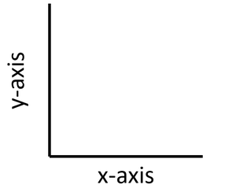
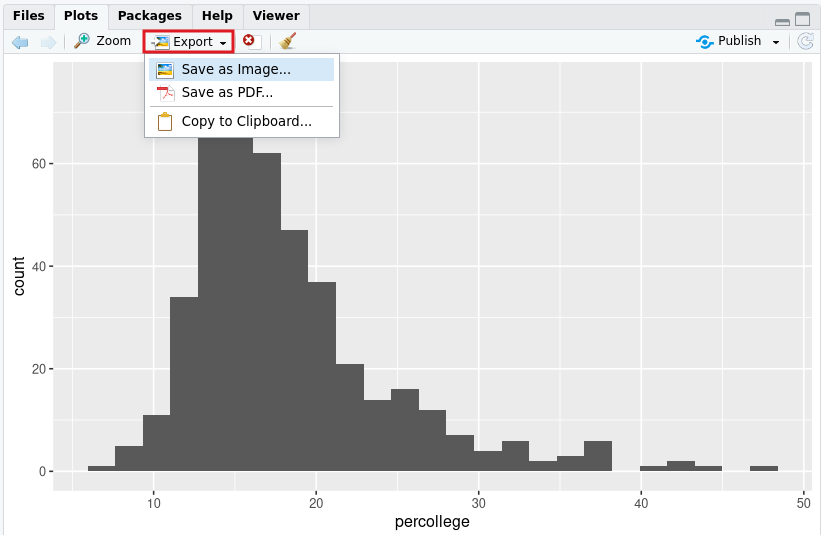
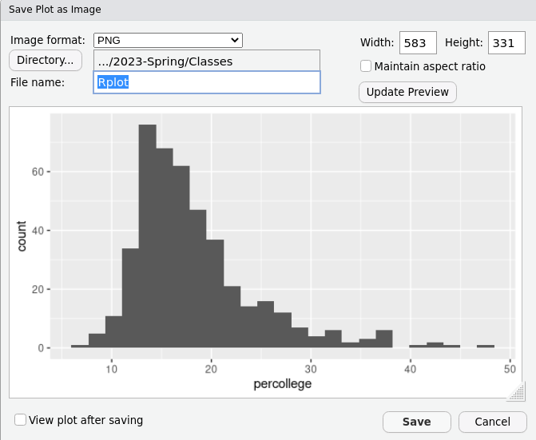
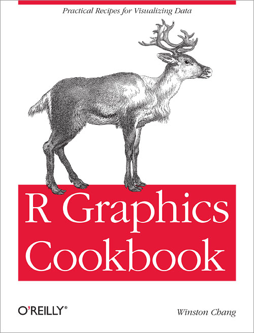

---
output:
  xaringan::moon_reader:
    css: ["default", "extra.css"]
    lib_dir: libs
    seal: false
    nature:
      highlightStyle: github
      highlightLines: true
      countIncrementalSlides: false
      ratio: '16:9'
---

```{r, echo = FALSE, warning = FALSE, message = FALSE}
##xaringan::inf_mr()
## For offline work: https://bookdown.org/yihui/rmarkdown/some-tips.html#working-offline
## Images not appearing? Put images folder inside the libs folder as that is the main data directory

library(tidyverse)
#library(readxl)
#library(stargazer)
##library(kableExtra)
##library(modelr)

knitr::opts_chunk$set(echo = FALSE,
                      eval = TRUE,
                      error = FALSE,
                      message = FALSE,
                      warning = FALSE,
                      comment = NA)
```

background-image: url('libs/Images/background-data_blue_v3.png')
background-size: 100%
background-position: center
class: middle, inverse

.size80[**Today's Agenda**]

<br>

.size60[
Build univariate visualizations in R
]

<br>

.center[.size40[
  Justin Leinaweaver (Spring 2024)
]]

???

## Prep for Class
1. ...

<br>

On Monday we used R to calculate our first statistics

- For categorical variables we counted levels (and converted some to proportions)

- For numerical variables we calculated descriptive statistics focused primarily on describing the middle and the spread of each variable

<br>

Last class we built visualizations of data by hand in order to reinforce the intuitions of each tool.

<br>

Today we combine those two tasks and build visualizations in R!


---

background-image: url('libs/Images/background-slate_v2.png')
background-size: 100%
background-class: center
class: middle

.center[.size40[.content-box-blue[**New Script: Univariate_Visualizations.R**]]]

.pull-left[
.center[.size30[
**Option 1**

"File" 

&#8595;

"New File" 

&#8595;

"R Script"
]]]

.pull-right[
.center[.size30[**Option 2**]]

```{r, fig.align='center', out.width='38%'}
knitr::include_graphics("libs/Images/03_3-New_Script.png")
```

]

???

Let's get set-up!

- Everybody create a new R script for notes and code on building univariate visualizations.


---

background-image: url('libs/Images/background-slate_v2.png')
background-size: 100%
background-position: center
class: middle

.center[.size60[**ggplot() for making visualizations**]]

```{r, echo = FALSE, fig.align = 'center', out.width = '20%'}
knitr::include_graphics("libs/Images/03_2-ggplot_logo.png")
```

.center[.size50[**Note: You have to load the tidyverse to use ggplot**]]

.code160[
```{r, echo=TRUE}
library(tidyverse)
```
]

???

### Questions on the basics of ggplot as introduced in the Healy reading?

<br>

A very valuable reference, keep it close to hand!


---

background-image: url('libs/Images/background-slate_v2.png')
background-size: 100%
background-position: center
class: middle

.center[.size55[.content-box-blue[**The GGplot Function: Two Basic Steps**]]]

<br>

.pull-left[
.center[.size50[
**Step 1**

Map your tidy data
]]
]

.pull-right[
```{r, echo = FALSE, fig.align = 'center', out.width = '70%'}

```
]

.code130[
```{r, echo=TRUE, eval=FALSE}
## GGplot Step 1: Map the Data
newobject <- ggplot(data = ?, aes(x = ?, y = ?))
```
]

???

For today, I will ask you to make visualizations in R in two discrete steps

- There's a one step method and you can move to that when you feel ready.

<br>

Step 1: Map the data in the ggplot() function

- Your "map" of the data has to tell ggplot() what your dataset is AND which variables you want in your visualization

- Here I'm showing a hypothetical plot with space for a variable on the y axis and one on the x axis

<br>

As the Healy reading made clear, we can save anything in R as a named object using the "<-" operator

- This object name becomes a shortcut to the code you already wrote

- So, you will save this "map" of the data in a new object


---

background-image: url('libs/Images/background-slate_v2.png')
background-size: 100%
background-position: center
class: middle

.center[.size55[.content-box-blue[**The GGplot Function: Two Basic Steps**]]]

<br>

.pull-left[
.center[.size50[
**Step 2**

Add a geom
]]
]

.pull-right[
.code140[
```{r, echo=TRUE, eval=FALSE}
# GGplot Step 2
# Add a geom
newobject + geom_bar()
newobject + geom_histogram()
newobject + geom_boxplot()
newobject + geom_line()
```
]
]

???

Step 2, tell ggplot what kind of picture to draw using this data.
- Everybody write these down!

<br>

REMEMBER, data analysis principle 3 is "Variable type determines tool"
- ggplot calls each tool a 'geom'

<br>

Let's practice doing these two steps to remake all the plots you drew by hand last class.


---

background-image: url('libs/Images/background-slate_v2.png')
background-size: 100%
background-position: center
class: middle, center

.size50[.content-box-blue[**Categorical Variable: Make a Bar Plot**]

<br>

**By hand**, draw a bar plot of drive train levels (drv) for the 234 cars in the mpg dataset.
]

.size35[

<br>

Process: 1) Count the levels, 2) Draw X axis with labels, 3) Draw Y axis to max height, 4) Add the bars]

???

Last class our first visualization was to make a bar plot of drive train levels by cars in the `mpg` dataset.

<br>

**SLIDE**: Let's now have R do this for us.


---

background-image: url('libs/Images/background-slate_v2.png')
background-size: 100%
background-position: center
class: middle

.center[
.size50[
.content-box-blue[**Categorical Variable: Make a Bar Plot**]

<br>

**In R** make a bar plot of drive train levels (`drv`) for the 234 cars in the `mpg` dataset.]

<br>

.code150[
```{r, echo=TRUE, eval=FALSE}
## GGplot Step 1: Map the data
plot1 <- ggplot(data = ?, aes(x = ?, y = ?))
```
]]

???

Ok, let's map the data

- Help me fill in the question mark spaces

<br>

### What is the dataset we are working with?
- (**SLIDE**)


---

background-image: url('libs/Images/background-slate_v2.png')
background-size: 100%
background-position: center
class: middle

.center[
.size50[
.content-box-blue[**Categorical Variable: Make a Bar Plot**]

<br>

**In R** make a bar plot of drive train levels (`drv`) for the 234 cars in the `mpg` dataset.]

<br>

.code150[
```{r, echo=TRUE, eval=FALSE}
## GGplot Step 1: Map the data
plot1 <- ggplot(data = mpg, aes(x = ?, y = ?))
```
]]

???

Easy.

<br>

Now, inside the aes function we specify what we want on the x and y axes of the plot.

<br>

We're building a bar plot which is a univariate visualization so we only have to specify one of the axes

- Let's build our bar plot on the x-axis

<br>

### What is the variable we want to map to the x axis?

- (**SLIDE**)


---

background-image: url('libs/Images/background-slate_v2.png')
background-size: 100%
background-position: center
class: middle

.code130[
```{r, echo=TRUE, eval=TRUE, fig.align='center', fig.asp=.618, fig.retina=3, out.width='70%', fig.width=5}
## GGplot Step 1: Map the Data
plot1 <- ggplot(data = mpg, aes(x = drv))

plot1
```
]

???

After you finish your data mapping, run the line to save the object and then type the name of the object into your console

- Run 'plot1'

<br>

By sending the data mapping to the console we can see how ggplot has set up the visualization.

- Here we see a blank plot with room reserved across the x-axis for the three levels of the `drv` variable.

<br>

### Everybody have this?

<br>

### According to your notes which geom do we need for making a bar plot?

- (**SLIDE**)


---

background-image: url('libs/Images/background-slate_v2.png')
background-size: 100%
background-position: center
class: middle

.code100[
```{r, echo=TRUE, eval=TRUE, fig.align='center', fig.retina=3, out.width='55%', fig.asp=.8, fig.width=4}
## GGplot Step 1: Map the Data
plot1 <- ggplot(data = mpg, aes(x = drv))

## GGplot Step 2: Add a geom
plot1 + geom_bar()
```
]

???

Step 2 we add a tool (geom) to the plot.

- ggplot works using `+` like you are adding functions together.

<br>

### Everybody have this plot made?

### - Understand the logic of the code?

<br>

### What would happen if you changed the 'x' in the map to a 'y'?

### - Don't do it yet, just tell me what you think should happen!

<br>

Try it!

- (**SLIDE**)


---

background-image: url('libs/Images/background-slate_v2.png')
background-size: 100%
background-position: center
class: middle

.code100[
```{r, echo=TRUE, eval=TRUE, fig.align='center', fig.retina=3, out.width='55%', fig.asp=.8, fig.width=4}
## GGplot Step 1: Map the Data
plot1 <- ggplot(data = mpg, aes(y = drv))

## GGplot Step 2: Add a geom
plot1 + geom_bar()
```
]

???

The visualization features of R are immense and, once you learn the code, SUPER easy to implement.

- **SLIDE**: For example...


---

background-image: url('libs/Images/background-slate_v2.png')
background-size: 100%
background-position: center
class: middle

.code100[
```{r, echo=TRUE, eval=TRUE, fig.align='center', fig.retina=3, out.width='55%', fig.asp=.8, fig.width=4}
## GGplot Step 1: Map the Data
plot1 <- ggplot(data = mpg, aes(y = drv))

## GGplot Step 2: Add a geom
plot1 + geom_bar(width = .5, fill = "blue")
```
]

???

Using the width argument in geom_bar you can adjust the bars themselves
- Basically any value is possible but from 0 to 1 is probably most useful

<br>

The "fill" argument allows us to color the bars

- Feel free to google colors in R and you'll see that basically any color the computer can make can be used.

<br>

### Any questions on making a basic bar plot in R?

- Feed it a categorical variable and let it do the work.

<br>

**SLIDE**: Let's practice


---

background-image: url('libs/Images/background-slate_v2.png')
background-size: 100%
background-position: center
class: middle

.center[.size55[.content-box-blue[**Categorical Variable: Make a Bar Plot**]]

<br>

<br>

.size50[**In R** make a bar plot of parties (`party`) that have controlled the presidency since 1953 in the `presidential` data set.]]

???


---

background-image: url('libs/Images/background-slate_v2.png')
background-size: 100%
background-position: center
class: middle

.code100[
```{r, echo=TRUE, eval=TRUE, fig.align='center', fig.retina=3, out.width='55%', fig.asp=.8, fig.width=4}
## GGplot Step 1: Map the Data
plot2 <- ggplot(data = presidential, aes(x = party))

## GGplot Step 2: Add a geom
plot2 + geom_bar(width = .5, fill = c("royalblue1", "firebrick3"))
```
]

???

Kind of cool that you can easily specify different colors for different bars.

<br>

### Any questions on making simple bar plots?

<br>

Now let's shift our focus to numeric variables.

<br>

### Think back to last class, what are the visualization tools we can use when summarizing a numeric variable?
- (Histograms and box plots!)


---

background-image: url('libs/Images/background-slate_v2.png')
background-size: 100%
background-position: center
class: middle

.center[.size50[.content-box-blue[**Numerical Variable: Make a Histogram**]]]

<br>

.size35[
1. Make a binned table of city (`cty`) fuel economy in the `mpg` data set
    - Bin 1: 0 - 10
    - Bin 2: 11 - 20
    - Bin 3: 21 - 30
    - Bin 4: 31 - 40

2. Make a bar plot of these bins
]

???

The first histogram we made last class required us to summarize a table with bins.

- The good news is that R will do all of this for us.


---

background-image: url('libs/Images/background-slate_v2.png')
background-size: 100%
background-position: center
class: middle

.center[.size50[.content-box-blue[**Numerical Variable: Make a Histogram**]]

<br>

.size50[**In R** make a histogram of city fuel economy (`cty`) in the `mpg` data set.

Note: Use geom_histogram()
]]

???

Everybody use the basic logic from our bar plots but replace the geom_bar with geom_histogram

- The dataset is `mpg`

- The variable of interest is `cty`

<br>

(**SLIDE**)


---

background-image: url('libs/Images/background-slate_v2.png')
background-size: 100%
background-position: center
class: middle

.code100[
```{r, echo=TRUE, eval=TRUE, fig.align='center', fig.retina=3, out.width='55%', fig.asp=.8, fig.width=4}
## GGplot Step 1: Map the Tidy Data
plot3 <- ggplot(data = mpg, aes(x = cty))

## GGplot Step 2: Add a geom
plot3 + geom_histogram()
```
]

???

### Everybody get this?


---

background-image: url('libs/Images/background-slate_v2.png')
background-size: 100%
background-position: center
class: middle

.pull-left[

.center[.size40[.content-box-blue[**By Hand**]]]

```{r, echo=FALSE, fig.retina=3, fig.asp=1, out.width='100%', fig.width=5}
mpg |>
  mutate(
    cty2 = case_when(
      cty < 10 ~ "0 - 10",
      cty < 20 ~ "11 - 20",
      cty < 30 ~ "21 - 30",
      cty < 40 ~ "31 - 40")
  ) |>
  ggplot(aes(x = cty2)) +
  geom_bar(width = .75, fill = "orange3") +
  theme_bw() +
  labs(x = "Fuel Economy (City)", y = "Proportion of Observations") +
  geom_hline(yintercept = seq(50, 150, 50), color = "white")
```
]

.pull-right[

.center[.size40[.content-box-blue[**R Defaults**]]]

```{r, echo=FALSE, fig.retina=3, fig.asp=1, out.width='100%', fig.width=5}
## GGplot Step 1: Map the Tidy Data
plot3 <- ggplot(data = mpg, aes(x = cty))

## GGplot Step 2: Add a geom
plot3 + geom_histogram()
```
]

???

On the left is what we made by hand with four bins and on the right is R's histogram which defaults to 30 bins

<br>

**SLIDE**: We can easily adjust the bins


---

background-image: url('libs/Images/background-slate_v2.png')
background-size: 100%
background-position: center
class: middle

.pull-left[

.center[.size35[.content-box-blue[**geom_histogram(bins = 5)**]]]

```{r, echo=FALSE, fig.retina=3, fig.asp=1, out.width='100%', fig.width=5}
ggplot(data = mpg, aes(x = cty)) +
  geom_histogram(bins = 5, color = "white")
```
]

.pull-right[

.center[.size35[.content-box-blue[**geom_histogram(bins = 20)**]]]

```{r, echo=FALSE, fig.retina=3, fig.asp=1, out.width='100%', fig.width=5}
ggplot(data = mpg, aes(x = cty)) +
  geom_histogram(bins = 20, color = "white")
```
]

???

R will let you adjust the number of bins using the 'bins' option.

- The plots look different because R defined the four bins differently from how we did it.

- The key is that both convey the same general distribution

<br>

Try it out!

<br>

### Questions on the histogram code?


---

background-image: url('libs/Images/background-slate_v2.png')
background-size: 100%
background-position: center
class: middle

.center[.size50[.content-box-blue[**Numerical Variable: Make a Box Plot**]]

<br>

.size50[**In R** make a box plot of city fuel economy (`cty`) in the `mpg` data set.

<br>

Note: Use geom_boxplot()
]]

???

Last class we also visualized numeric variables using a box plot.

- Super easy, everybody just replace histogram with boxplot


---

background-image: url('libs/Images/background-slate_v2.png')
background-size: 100%
background-position: center
class: middle

.code100[
```{r, echo=TRUE, eval=TRUE, fig.align='center', fig.retina=3, out.width='55%', fig.asp=.8, fig.width=4}
## GGplot Step 1: Map the Tidy Data
plot4 <- ggplot(data = mpg, aes(x = cty))

## GGplot Step 2: Add a geom
plot4 + geom_boxplot()
```
]

???

### Everybody get this?

<br>

### Any questions on the boxplot code?


---

background-image: url('libs/Images/background-slate_v2.png')
background-size: 100%
background-position: center
class: middle

.center[.size60[.content-box-blue[**Numerical Variable: Practice Both!**]]

<br>

<br>

.size55[**In R** make a **histogram AND a box plot** of the proportion of people that are college educated (`percollege`) in midwest cities (`midwest` data set).]]

???


---

background-image: url('libs/Images/background-slate_v2.png')
background-size: 100%
background-position: center
class: middle

.pull-left[
.code80[
```{r, echo=TRUE, eval=TRUE, fig.align='center', fig.retina=3, out.width='100%', fig.asp=.8, fig.width=4}
## GGplot Step 1: Map the Tidy Data
p5 <- ggplot(data = midwest, aes(x = percollege))

## GGplot Step 2: Add a geom
p5 + geom_histogram(bins = 25)
```
]
]

.pull-right[
.code80[
```{r, echo=TRUE, eval=TRUE, fig.align='center', fig.retina=3, out.width='100%', fig.asp=.8, fig.width=4}
## GGplot Step 1: Map the Tidy Data
p5 <- ggplot(data = midwest, aes(x = percollege))

## GGplot Step 2: Add a geom
p5 + geom_boxplot()
```
]
]

???

### Everybody get this?

<br>

### What do we learn from this data about the cities in the midwest?


---

background-image: url('libs/Images/background-slate_v2.png')
background-size: 100%
background-position: center
class: middle

.center[.size45[.content-box-blue[**Numeric Variables Across Time: Line Plots**]]

<br>

.size45[**In R** make a line plot of the US unemployment (`unemploy`) across time (`date`) using the `economics` data set.]]

.size45[
- Use geom_line()

- You must specify an X and a Y variable!
]

???

Last one, let's make our line plots using R!


---

background-image: url('libs/Images/background-slate_v2.png')
background-size: 100%
background-position: center
class: middle

.code130[
```{r, echo=TRUE, eval=TRUE, fig.align='center', fig.retina=3, out.width='47%', fig.asp=.8, fig.width=4}
## GGplot Step 1: Map the Tidy Data
plot6 <- ggplot(data = economics, aes(x = date, y = unemploy))

## GGplot Step 2: Add a geom
plot6 + geom_line()
```
]

???

When we did this by hand I had you do the most recent one year only to keep it feasible.

- This software approach means bigger data is no problem!

<br>

### Any questions on the code?


---

background-image: url('libs/Images/background-slate_v2.png')
background-size: 100%
background-position: center
class: middle

.center[.size45[.content-box-blue[**Principle 3: Variable Type Determines Tool**]]]

<br>

.size40[
**Univariate Visualizations**

+ If a **categorical** variable, make a **bar plot**

+ If a **numeric** variable, make a **box plot** or **histogram**

+ If a **numeric variable across time**, make a **line plot**
]

???

### Questions on making these plots in R?

<br>

**SLIDE**: Let's talk outputting the viz you make in R for copying into a Word Doc.


---

background-image: url('libs/Images/background-slate_v2.png')
background-size: 100%
background-position: center
class: middle

```{r, echo = FALSE, fig.align = 'center', out.width = '85%'}

```

???

Three useful options through the export menu.

- Comes down to your preference.


---

background-image: url('libs/Images/background-slate_v2.png')
background-size: 100%
background-position: center
class: middle

```{r, echo = FALSE, fig.align = 'center', out.width = '67%'}

```

???

If saving as an image it defaults to png.

- You can then click and drag the size of this window to adjust the dimensions of the image.

- The bigger the picture, the higher the resolution (and file size)

- So, make sure to get the image the right size and sharpness here before importing into Word

<br>

**SLIDE**: So, you're working from home and you get stuck, what should you do?


---

background-image: url('libs/Images/background-slate_v2.png')
background-size: 100%
background-position: center
class: middle

.pull-left[

<br>

.size40[
+ Recipes 3.3 for bar plots

+ Recipe 6.1 for histograms

+ Recipe 6.6 for box plots

+ Recipe 4.1 for line Plots

+ Recipe 10.26 for outputting visualizations
]]

.pull-right[
```{r, echo = FALSE, fig.align = 'center', out.width = '90%'}

```
]

???

SUPER useful reference book.

- Freely available online

- Laid out like a cookbook.
    - Each section is a recipe designed to help you solve a specific problem.

- I've linked to some very helpful ones throughout our syllabus.

<br>

Something not working? Notes incomplete?

- Try the cookbook!

- Just copy the recipes into your notes, update the names of the data and variables and it should work!


---

background-image: url('libs/Images/background-slate_v2.png')
background-size: 100%
background-position: center
class: middle

.pull-left[
.code80[
```{r, echo=TRUE, eval=TRUE, fig.align='center', fig.retina=3, out.width='100%', fig.asp=.8, fig.width=4}
# Split the Two Steps
p2 <- ggplot(data = presidential, aes(x = party))

p2 + geom_bar()
```
]
]

.pull-right[
.code80[
```{r, echo=TRUE, eval=TRUE, fig.align='center', fig.retina=3, out.width='100%', fig.asp=.8, fig.width=4}
# Combine the two steps

ggplot(data = presidential, aes(x = party)) + 
  geom_bar()
```
]
]

???

One note so you don't get confused when using the cookbook.

- Winston Chang makes visualizations in one step, not two like we've been doing today.

- Essentially, in either approach you are doing the same thing

- You add a map of the data with ggplot to a geom and you get as visualization

<br>

### Questions on this?


---

background-image: url('libs/Images/background-slate_v2.png')
background-size: 100%
background-position: center
class: middle

.size70[.content-box-blue[**For Next Class**]]

<br>

.size55[
1. World Development Indicators: The Story (2018, Oct 5)

2. Practice Exercises
]

???

Next class we'll start working with some data collected by the World Bank.

- The reading introduces you to the WDI database.

<br>

So, do that reading and the following practice exercises!


---

background-image: url('libs/Images/background-slate_v2.png')
background-size: 100%
background-position: center
class: middle

.code130[
```{r, echo=TRUE, eval=FALSE}
# Install new package (only 1 time)
install.packages("carData")

# Load the package to access the following datasets (each time)
library(carData)
```
]

.size40[
1. What is the regional breakdown of UN member states? (`UN` dataset, `region` variable)

2. How much variation is there in life expectancy rates around the world? (`UN` dataset, `lifeExpF` variable)

3. Visualize the growth in the US population since 1790  (`USPop` dataset, `population` variable)
]

???

The `carData` package gives us access to some useful datasets for practicing your univariate visualization skills

- I want us to start practicing delivering visualizations so I will ask you to submit your three visualizations to Canvas BEFORE class.

- Underneath each visualization I want a 1-3 sentence annotation explaining what you learned from this plot

<br>

### Questions on the assignment?

- Get to work!

