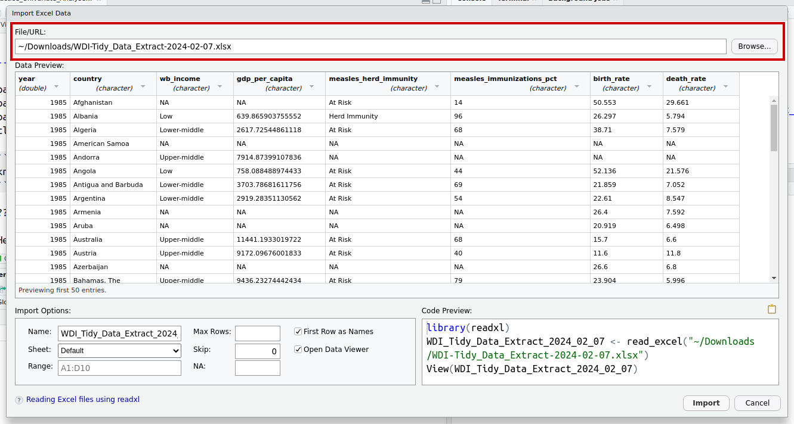
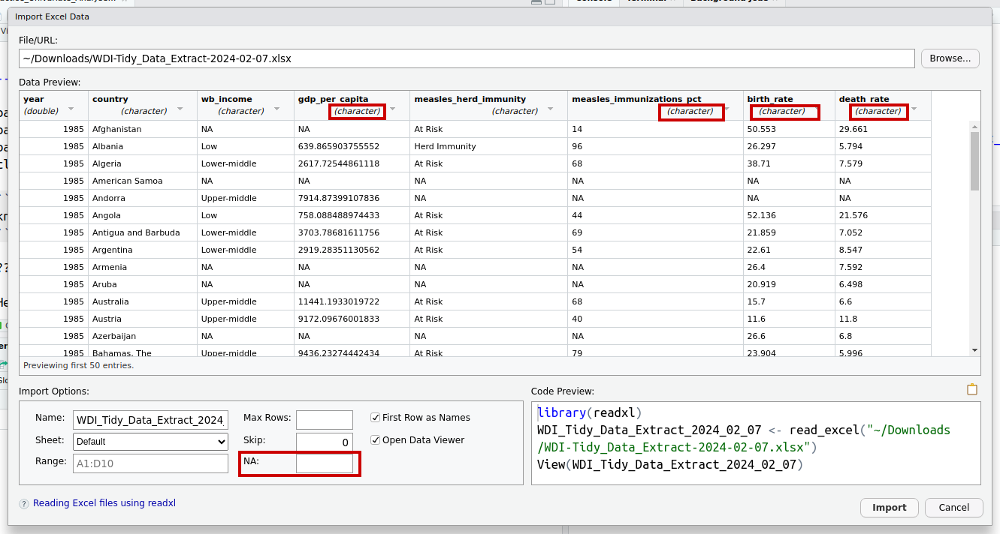
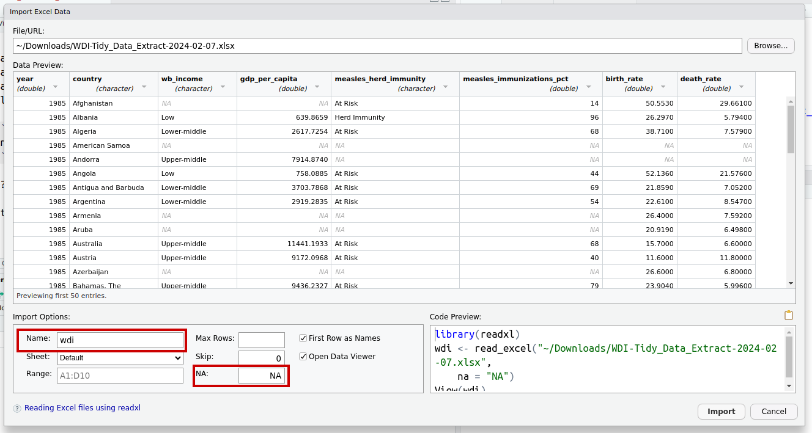

---
output:
  xaringan::moon_reader:
    css: ["default", "extra.css"]
    lib_dir: libs
    seal: false
    nature:
      highlightStyle: github
      highlightLines: true
      countIncrementalSlides: false
      ratio: '16:9'
---

```{r, echo = FALSE, warning = FALSE, message = FALSE}
##xaringan::inf_mr()
## For offline work: https://bookdown.org/yihui/rmarkdown/some-tips.html#working-offline
## Images not appearing? Put images folder inside the libs folder as that is the main data directory

library(tidyverse)
library(readxl)

knitr::opts_chunk$set(echo = FALSE,
                      eval = TRUE,
                      error = FALSE,
                      message = FALSE,
                      warning = FALSE,
                      comment = NA)

# Data for today
library(carData)

wdi <- read_excel("../Data_in_Class-SP24/World_Development_Indicators/WDI-Tidy_Data_Extract-2024-02-07.xlsx", na = "NA")
```

background-image: url('libs/Images/background-data_blue_v3.png')
background-size: 100%
background-position: center
class: middle, inverse

.size65[**Today's Agenda**]

<br>

.size40[
Practicing univariate analyses in R

- Review: Practice exercises

- New: Inputting Excel data & polishing visualizations

- Canvas: "WDI-Tidy_Data_Extract-2024-02-06.xlsx"
]

<br>

.center[.size40[
  Justin Leinaweaver (Spring 2024)
]]

???

## Prep for Class
1. Pull WDI data and post on Canvas
    - Both the original and the tidy version

2. Check Canvas submissions

<br>

Given the snow and us having to meet on Zoom I'll try to keep this short and to the point.

- I want to make sure you succeeded on your practice exercises, 

- you pick up a few new skills, and 

- then I get you working more on our new tools

<br>

**SLIDE**: Practice exercises


---

background-image: url('libs/Images/background-slate_v2.png')
background-size: 100%
background-position: center
class: middle

```{r, cache=TRUE, echo=TRUE, eval=TRUE, fig.retina=3, fig.align='center', fig.asp=.75, out.width='55%'}
# 1. What is the regional breakdown of UN member states? 
library(carData)

ggplot(data = UN, aes(y = region)) +
  geom_bar(fill = "mediumpurple")
```

???

### Everybody get this? (or the rotated version?)

<br>

While I'd like to spend some time in class discussing what we learn from these visualizations (e.g. analyses), Zoom ain't super conducive to that!

- Also, I can see you guys are absolutely headed in the right direction on this in the Canvas discussion board.

<br>

**SLIDE**: Let's pivot from this first practice exercise to our first new tool for today!


---

background-image: url('libs/Images/background-slate_v2.png')
background-size: 100%
background-position: center
class: middle

.pull-left[
```{r, cache=TRUE, eval=TRUE, fig.retina=3, fig.align='center', fig.asp=1.1, out.width='100%'}
# The labs() function
ggplot(data = UN, aes(y = region)) +
  geom_bar() +
  labs(x = "x Axis Label", y = "y Axis Label", caption = "Source: Where did the data come from?", 
       title = "A title like a thesis statement for the visualization")
```
]

.pull-right[
.center[.size45[
.content-box-white[
**Visualizations MUST include:**]

1. Informative titles,

2. Clear axis labels, and

3. Data sources
]]]

???

From this point forward, anytime you submit a visualization it must be polished enough that you could present it to a professional audience.

<br>

At a minimum, that means you include:

1. A title or figure caption that explains the key takeaway of the visualization in your argument,
    - Not just a simple description of the plot (that's what the axis labels are for!)

2. Clearly defined axis labels, and

3. A plot caption or figure label that identifies where the data came from

<br>

We can get even fancier, but this represents my minimum expectations from you this semester.

<br>

**SLIDE**: Let's add each piece one at a time


---

background-image: url('libs/Images/background-slate_v2.png')
background-size: 100%
background-position: center
class: middle

.code110[
```{r, cache=TRUE, echo=TRUE, eval=TRUE, fig.retina=3, fig.align='center', fig.asp=.8, out.width='55%'}
# The labs() function
ggplot(data = UN, aes(y = region)) +
  geom_bar() +
  labs(x = "Count", y = "United Nations Regions")
```
]

???

The labs function has a bunch of possible arguments, e.g. labels you can add to your plot

- Here I'm adding x and y axis labels

- Just separate each argument with a comma

<br>

Everybody make sure this works and give me a thumbs up when it does (zoom character)

<br>

**SLIDE**: Now we can add a caption


---

background-image: url('libs/Images/background-slate_v2.png')
background-size: 100%
background-position: center
class: middle

.code100[
```{r, cache=TRUE, echo=TRUE, eval=TRUE, fig.retina=3, fig.align='center', fig.asp=.8, out.width='55%'}
# The labs() function
ggplot(data = UN, aes(y = region)) +
  geom_bar() +
  labs(x = "Count", y = "United Nations Regions", caption = "Source: UNSD (2012)")
```
]

???

The caption argument adds a small note on the bottom right of the plot


---

background-image: url('libs/Images/background-slate_v2.png')
background-size: 100%
background-position: center
class: middle

.code100[
```{r, cache=TRUE, echo=TRUE, eval=TRUE, fig.retina=3, fig.align='center', fig.asp=.8, out.width='55%'}
# The labs() function
ggplot(data = UN, aes(y = region)) +
  geom_bar() +
  labs(x = "Count", y = "United Nations Regions", caption = "Source: UNSD (2012)",
       title = "The UN tracks data for a large number of non-member states")
```
]

???

Finally we add a thesis statement for our visualization

- No simple description titles in here!

- Your title should convey the key takeaway from the visualization for the reader

- The goal is that someone could go through your report only looking at the figures and follow along with your argument!

<br>

### Is everybody clear on my expectation for your polished visualizations?

<br>

### Any questions on using the labs function?

<br>

This represents the absolute baseline for a visualization in this class.

- However, as you add skills I will hopefully see you making your visualizations even more compelling.

- **SLIDE**: For example


---

background-image: url('libs/Images/background-slate_v2.png')
background-size: 100%
background-position: center
class: middle

.code100[
```{r, cache=TRUE, echo=TRUE, eval=TRUE, fig.retina=3, fig.align='center', fig.asp=.8, out.width='55%'}
# The labs() function
ggplot(data = UN, aes(y = region)) +
  geom_bar(fill = c(rep("darkblue", 8), "red")) +
  labs(x = "Count", y = "United Nations Regions", 
       caption = "Source: UNSD (2012)", 
       title = "The UN tracks data for a large number of non-member states")
```
]

???

We should continuously look for ways to draw the reader's eye to the key aspects of the visualization

- Your informative title helps, but there is much more we can do!

- In a paper all about data tracking around the world, making the NA bar stand out helps draw the readers eye to the key point!

<br>

### Make sense?

<br>

**SLIDE**: Practice exercise 2


---

background-image: url('libs/Images/background-slate_v2.png')
background-size: 100%
background-position: center
class: middle

```{r, cache=TRUE, echo=TRUE, eval=TRUE, fig.retina=3, fig.align='center', fig.asp=.8, out.width='60%'}
# 2. How much variation is there in life expectancy rates around the world?
practice2 <- ggplot(data = UN, aes(x = lifeExpF))
```

.pull-left[
```{r, cache=TRUE, echo=TRUE, eval=TRUE, fig.retina=3, fig.align='center', fig.asp=.8, out.width='100%'}
practice2 + geom_histogram()
```
]

.pull-right[
```{r, cache=TRUE, echo=TRUE, eval=TRUE, fig.retina=3, fig.align='center', fig.asp=.8, out.width='100%'}
practice2 + geom_boxplot()
```
]

???

### Everybody get these two plots?

<br>

Again, and given Zoom, we'll hold off on our pros and cons debate about each type of visualization.

<br>

Instead, let's practice our polishing!

- Everybody polish the histogram

- Add a title, caption and clear axis labels 

- (**SLIDE**)


---

background-image: url('libs/Images/background-slate_v2.png')
background-size: 100%
background-position: center
class: middle

.code110[
```{r, cache=TRUE, echo=TRUE, eval=FALSE, fig.retina=3, fig.align='center', fig.asp=.618, out.width='70%'}
ggplot(data = UN, aes(x = lifeExpF)) +
  geom_histogram() +
  labs(x = "Life Expectancy (years)", y = "Count", 
       caption = "Source: UNSD (2012)", 
       title = "Almost 1/3 of the states have a life expectancy below 70")
```

```{r, cache=TRUE, echo=FALSE, eval=TRUE, fig.retina=3, fig.align='center', fig.asp=.618, out.width='70%'}
# Color bars below 70
UN$life_color <- if_else(UN$lifeExpF <= 71, "TRUE", "FALSE")

ggplot(data = UN, aes(x = lifeExpF, fill = life_color)) +
  geom_histogram() +
  labs(x = "Life Expectancy (years)", y = "Count", 
       caption = "Source: UNSD (2012)", 
       title = "Almost 1/3 of the states have a life expectancy below 70") +
  guides(fill = "none") +
  scale_fill_manual(values = c("grey26", "red3"))

```
]

???

Coloring bars in a histogram is a little more complicated, but we'll get there.

<br>

### For now, does the aim of polishing a visualization make sense?

<br>

**SLIDE**: Last practice exercise - US population since 1790


---

background-image: url('libs/Images/background-slate_v2.png')
background-size: 100%
background-position: center
class: middle

```{r, cache=TRUE, echo=TRUE, eval=TRUE, fig.retina=3, fig.align='center', fig.asp=.618, out.width='60%'}
# 3. Visualize the growth in the US population since 1790
ggplot(data = USPop, aes(x = year, y = population)) +
  geom_line() +
  labs(x = "", y = "US Population (millions)", 
       caption = "Source: U.S. Census Bureau (2008)", 
       title = "The US has rapidly added population since 1780")
```

???

### Everybody get this?

<br>

### Any questions on polishing your plots for a professional audience?

<br>

We'll keep tweaking our plots, but this represents the basics you must include.


---

background-image: url('libs/Images/06_1-WDI_Front.png')
background-size: 75%
background-position: center
class: middle

???

Today and Wednesday I want us to explore data from the World Bank's WDI database

- As you hopefully got from the reading for today, the WDI is a very useful repository of data on countries around the world.

- I've posted the untidy data so you can see what the output from the WDI looks like

- HOWEVER, for our work in R please use the "tidy" version of the dataset

<br>

**SLIDE**: Next new skill, how to import data into Excel


---

background-image: url('libs/Images/background-slate_v2.png')
background-size: 100%
background-position: center
class: middle

```{r, fig.align='center', out.width='85%'}
knitr::include_graphics("libs/Images/05_1-RStudio_Import2.png")
```

???

You can import data purely with code, HOWEVER, in my experience new users have a MUCH easier time using the menus for this.

- **These importing data slides are on Canvas in case you forget how to do this.**

<br>

Step 1 is to open the import window


---

background-image: url('libs/Images/background-slate_v2.png')
background-size: 100%
background-position: center
class: middle

```{r, fig.align='center', out.width='95%'}
knitr::include_graphics("libs/Images/05_1-RStudio_Import3.png")
```

???

Here you see the excel input window 

- Note that all the choices you make here get written into code in the bottom-right corner.

- Useful for learning the code approach


---

background-image: url('libs/Images/background-slate_v2.png')
background-size: 100%
background-position: center
class: middle

```{r, fig.align='center', out.width='95%'}

```

???

Step 2: "Browse" to the data you saved on your hard drive

- It should then populate all the fields below with its best guesses


---

background-image: url('libs/Images/background-slate_v2.png')
background-size: 100%
background-position: center
class: middle

```{r, fig.align='center', out.width='100%'}

```

???

Step 3, use the preview code to make sure R "sees" the data as you expect it to

- VERY IMPORTANT to look at the data in the preview window

<br>

In this example you can see that R thinks all of our numeric variables are actually categorical variables!

- This is because it sees the NAs as words not as missing data!

- In a variable with words and numbers it is forced to treat all of the values as words

<br>

In the NA field put in 'NA' and after you click out of that box you should see the preview refresh to show numeric variables are now "double" which is a type of numeric variable

- **SLIDE**


---

background-image: url('libs/Images/background-slate_v2.png')
background-size: 100%
background-position: center
class: middle

```{r, fig.align='center', out.width='100%'}

```

???

Last step, name the dataset object

- This is what we will type in to access this data in R

<br>

### Make sense? Any questions on importing tidy Excel data using the menu?

- FYI: Code preview shows that importing data in code uses the read_excel() function.


---

background-image: url('libs/Images/background-slate_v2.png')
background-size: 100%
background-position: center
class: middle

```{r, echo=TRUE, eval=FALSE}
View(wdi)
```

.size18[
```{r}
wdi |>
  slice_head(n = 11) |>
  kableExtra::kbl(digits = 1, align = "c")
```
]

???

Let's talk through the data I've pulled for you from WDI

- All countries in the WDI from 2003 to 2021

- `wb_income` categorizes all states by their income level using the World Bank thresholds from 2021 (low, lower-middle, upper-middle and high)

- `gdp_per_capita` is gross domestic product divided by population

- `measles_herd_immunity` is a categorization of states as to whether they've achieved herd immunity in measles (e.g. 95%).

- `measles_immunizations_pct` is the actual percent of under 2s immunized against measles

- `birth_rate` is the number of births per 1,000 people

- `death_rate` is the number of deaths per 1,000 people

<br>

### Any questions on the data?

<br>

**SLIDE**: Filter to current year


---

background-image: url('libs/Images/background-slate_v2.png')
background-size: 100%
background-position: center
class: middle

```{r, echo=TRUE, eval=FALSE}
# Extract some observations from the dataset
wdi2021 <- filter(wdi, year == 2021)

View(wdi2021)
```

.size18[
```{r}
wdi2021 <- filter(wdi, year == 2021)

wdi2021 |>
  slice_head(n = 9) |>
  kableExtra::kbl(digits = 1, align = "c")
```
]

???

While I've given you data across time, I'd like us to work today focused on only the most recent year with complete data in the WDI: 2021.

<br>

Everybody create a new object called "wdi2021" and use the filter function to extract only those rows in our dataset from the year 2021

- The filter function requires the dataset and then the conditions you are interested in

- Remember the double equals sign means "equals to"

<br>

### Everybody got that?


---

background-image: url('libs/Images/background-slate_v2.png')
background-size: 100%
background-position: center
class: middle

.size60[.center[.content-box-blue[**Filter() is Very Useful**]]]

<br>

.code160[
```{r, echo=TRUE, eval=FALSE}
# Filter for one variable
filter(wdi, wb_income == "Low")
```

```{r, echo=TRUE, eval=FALSE}
# Filter by relative values
filter(wdi, death_rate > 20)
```

```{r, echo=TRUE, eval=FALSE}
# Filter by two variables
filter(wdi, country == "Ireland", year == 2008)
```
]

???

Filter is an INCREDIBLY useful function

- You can use it to filter a dataset by ANY variable or multiple variables

<br>

Practice with each of these lines of code

- Did it produce what you thought it would?

<br>

### Any questions on the filter function?

<br>

**SLIDE**: Ok, given the zoom nature of this let me give you practice work for Wednesday and we'll call it a day!


---

background-image: url('libs/Images/background-slate_v2.png')
background-size: 100%
background-position: center
class: middle

.size50[.content-box-blue[**For Next Class**]]

.size45[
.center[**What is the state of global development in 2021?**]
- WB Income
- gdp_per_capita
- measles_herd_immunity
- measles_immunizations_pct
- birth_rate
- death_rate
]

???

FIRST, produce a polished visualization for each of these six variables in our WDI dataset for 2021

<br>

SECOND, I want you to submit a short argument to Canvas before class that answers this question.

- I want your analysis of the visualizations not just simple descriptions of what you made

- The goals: You've done the analyses and now you have a deeper understanding of the world. Explain what you've learned!

<br>

### Questions on the assignment?

- Get to it!


