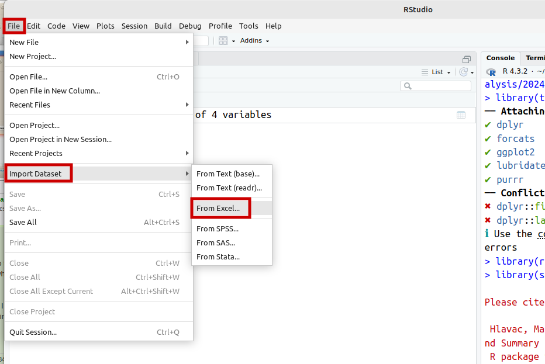
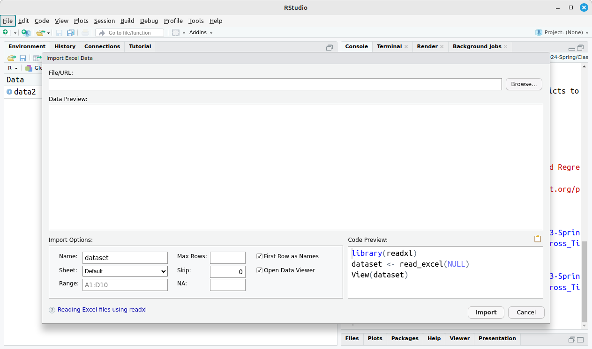
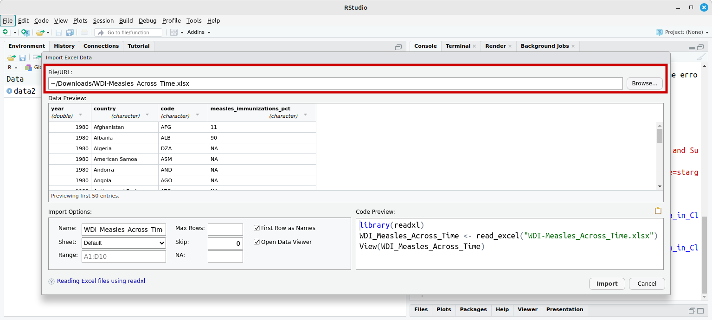
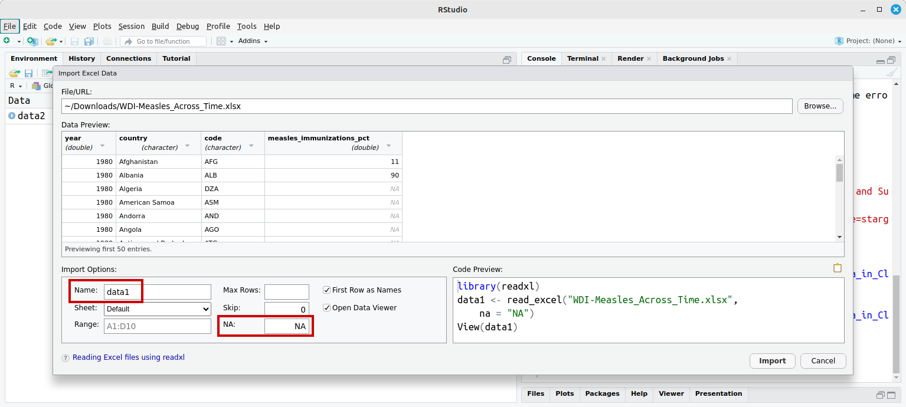

---
output:
  xaringan::moon_reader:
    css: ["default", "extra.css"]
    lib_dir: libs
    seal: false
    nature:
      highlightStyle: github
      highlightLines: true
      countIncrementalSlides: false
      ratio: '16:9'
---

```{r, echo = FALSE, warning = FALSE, message = FALSE}
##xaringan::inf_mr()
## For offline work: https://bookdown.org/yihui/rmarkdown/some-tips.html#working-offline
## Images not appearing? Put images folder inside the libs folder as that is the main data directory

library(tidyverse)
library(readxl)

knitr::opts_chunk$set(echo = FALSE,
                      eval = TRUE,
                      error = FALSE,
                      message = FALSE,
                      warning = FALSE,
                      comment = NA)

# Data for today
library(carData)

data1 <- read_excel("../Data_in_Class-SP24/World_Development_Indicators/WDI-Tidy_Data_Extract-2024-02-07.xlsx", na = "NA")
```

background-image: url('libs/Images/background-data_blue_v3.png')
background-size: 100%
background-position: center
class: middle, inverse

.size65[**Today's Agenda**]

<br>

.size40[
Practicing univariate analyses in R

- Review: Practice exercises

- New: Inputting Excel data & polishing visualizations

- Canvas: "WDI-Tidy_Data_Extract-2024-02-06.xlsx"
]

<br>

.center[.size40[
  Justin Leinaweaver (Spring 2024)
]]

???

## Prep for Class
1. Pull WDI data and post on Canvas
    - Both the original and the tidy version

2. Check Canvas submissions

<br>

*While students coming in*: Everybody make sure they finished the practice exercises for today AND grab the dataset we'll be using from Canvas.

<br>

**SLIDE**: Lots to do so let's dive in with your practice exercises for today!


---

background-image: url('libs/Images/background-slate_v2.png')
background-size: 100%
background-position: center
class: middle

```{r, cache=TRUE, echo=TRUE, eval=TRUE, fig.retina=3, fig.align='center', fig.asp=.8, out.width='60%'}
# 1. What is the regional breakdown of UN member states?
practice1 <- ggplot(data = UN, aes(y = region))
practice1 + geom_bar(fill = "mediumpurple")
```

???

Don't forget that accessing this dataset requires installing AND loading carData

<br>

### Everybody get this? (or the rotated version?)

<br>

### What did we learn from this?
- (Who are the NAs? Mostly non-state territories e.g. American Samoa, Guam, etc)

- Africa has a lot of countries!

<br>

**SLIDE**: Let's use this as an opportunity to practice polishing our visualizations for professional audiences (and your reports!)


---

background-image: url('libs/Images/background-slate_v2.png')
background-size: 100%
background-position: center
class: middle

.pull-left[
```{r, cache=TRUE, eval=TRUE, fig.retina=3, fig.align='center', fig.asp=1.1, out.width='100%'}
# The labs() function
practice1 + 
  geom_bar() +
  labs(x = "Count", y = "", caption = "Source: UNSD (2012)", 
       title = "UN tracking covers some non-member states")
```
]

.pull-right[
.center[.size45[
.content-box-white[
**Visualizations MUST include:**]

1. Informative titles,

2. Clear axis labels, and

3. Data sources
]]]

???

At a minimum, professional visualizations must include:

1. A title or figure caption that explains the key takeaway of the visualization in your argument,

2. Clearly defined axis labels, and

3. A plot caption or figure label that identifies where the data came from

<br>

We can get even fancier, but this represents my minimum expectations from you this semester.

<br>

### Do these criteria make sense?

<br>

**SLIDE**: How to do it...


---

background-image: url('libs/Images/background-slate_v2.png')
background-size: 100%
background-position: center
class: middle

.code110[
```{r, cache=TRUE, echo=TRUE, eval=TRUE, fig.retina=3, fig.align='center', fig.asp=.8, out.width='45%'}
# The labs() function
practice1 + 
  geom_bar() +
  labs(x = "Count") +
  labs(y = "") +
  labs(caption = "Source: UNSD (2012)") +
  labs(title = "UN tracking covers some non-member states")
```
]

???

We will primarily use the labs() function to label your plots 

- Each labs function is added using the '+' style that ggplot requires

- Essentially, within the ggplot function you can keep adding customizations

<br>

To keep things clear, I have added each of these elements using a separate labs() function.

- I want it to be clear that you can add whichever pieces you want/need

<br>

*Step through each argument: x, y, title, caption*

<br>

**SLIDE**: You can also do this with one labs function


---

background-image: url('libs/Images/background-slate_v2.png')
background-size: 100%
background-position: center
class: middle

.code110[
```{r, cache=TRUE, echo=TRUE, eval=TRUE, fig.retina=3, fig.align='center', fig.asp=.8, out.width='50%'}
# The labs() function
practice1 + 
  geom_bar() +
  labs(x = "Count", y = "", caption = "Source: UNSD (2012)", 
       title = "UN tracking covers some non-member states")
```
]

???

Here I'm doing the same thing as before with one labs function but multiple arguments each separated by a comma.

- Totally up to you

<br>

### Is everybody clear on my expectation for your polished visualizations?

<br>

### And clear on how to use the labs function?

<br>

This represents the absolute baseline for a visualization in this class.

- However, as you add skills I will hopefully see you making your visualizations even more compelling.

- **SLIDE**: For example


---

background-image: url('libs/Images/background-slate_v2.png')
background-size: 100%
background-position: center
class: middle

.code110[
```{r, cache=TRUE, echo=TRUE, eval=TRUE, fig.retina=3, fig.align='center', fig.asp=.8, out.width='50%'}
# The labs() function
practice1 + 
  geom_bar(fill = c(rep("darkblue", 8), "red")) +
  labs(x = "Count", y = "", caption = "Source: UNSD (2012)", 
       title = "UN tracking covers some non-member states")
```
]

???

We should continuously look for ways to draw the reader's eye to the key aspects of the visualization

- Your informative title helps, but there is much more we can do!

- In a paper all about data tracking around the world, making the NA bar stand out helps draw the readers eye to the key point!

<br>

### Make sense?

<br>

**SLIDE**: Practice question number 2, life expectancy in the world


---

background-image: url('libs/Images/background-slate_v2.png')
background-size: 100%
background-position: center
class: middle

```{r, cache=TRUE, echo=TRUE, eval=TRUE, fig.retina=3, fig.align='center', fig.asp=.8, out.width='60%'}
# 2. How much variation is there in life expectancy rates around the world?
practice2 <- ggplot(data = UN, aes(x = lifeExpF))
```

.pull-left[
```{r, cache=TRUE, echo=TRUE, eval=TRUE, fig.retina=3, fig.align='center', fig.asp=.8, out.width='100%'}
practice2 + geom_histogram()
```
]

.pull-right[
```{r, cache=TRUE, echo=TRUE, eval=TRUE, fig.retina=3, fig.align='center', fig.asp=.8, out.width='100%'}
practice2 + geom_boxplot()
```
]

???

### Everybody get these two plots?

<br>

### Which visualization is a more useful way to present the distribution of life expectancies around the world? Why?

<br>

Let's practice our polishing!

- Everybody add a title, caption and labels to the histogram!

- (**SLIDE**)


---

background-image: url('libs/Images/background-slate_v2.png')
background-size: 100%
background-position: center
class: middle

.code110[
```{r, cache=TRUE, echo=TRUE, eval=FALSE, fig.retina=3, fig.align='center', fig.asp=.618, out.width='70%'}
practice2 + 
  geom_histogram() +
  labs(x = "Life Expectancy (years)", y = "Count", 
       caption = "Source: UNSD (2012)", 
       title = "Almost 1/3 of the states have a life expectancy below 70")
```

```{r, cache=TRUE, echo=FALSE, eval=TRUE, fig.retina=3, fig.align='center', fig.asp=.618, out.width='70%'}
# Color bars below 70
UN$life_color <- if_else(UN$lifeExpF <= 71, "TRUE", "FALSE")

ggplot(data = UN, aes(x = lifeExpF, fill = life_color)) +
  geom_histogram() +
  labs(x = "Life Expectancy (years)", y = "Count", 
       caption = "Source: UNSD (2012)", 
       title = "Almost 1/3 of the states have a life expectancy below 70") +
  guides(fill = "none") +
  scale_fill_manual(values = c("grey26", "red3"))

```
]

???

Coloring bars in a histogram is a little more complicated, but we'll get there.

<br>

### For now, does the aim of polishing a visualization make sense?

<br>

**SLIDE**: Last practice exercise - US population since 1790


---

background-image: url('libs/Images/background-slate_v2.png')
background-size: 100%
background-position: center
class: middle

```{r, cache=TRUE, echo=TRUE, eval=TRUE, fig.retina=3, fig.align='center', fig.asp=.618, out.width='60%'}
# 3. Visualize the growth in the US population since 1790
practice3 <- ggplot(data = USPop, aes(x = year, y = population))

practice3 + 
  geom_line() +
  labs(x = "", y = "US Population (millions)", 
       caption = "Source: U.S. Census Bureau (2008)", 
       title = "The US has rapidly added population since 1780")
```

???

### Everybody get this?

<br>

### Any questions on polishing your plots for a professional audience?

<br>

We'll keep tweaking our plots, but this represents the basics you must include.


---

background-image: url('libs/Images/06_1-WDI_Front.png')
background-size: 75%
background-position: center
class: middle

???

Today we:

1. Continue practicing our univariate tools, 

2. We pick up some new skills, and 

3. We do it by exploring data from the World Bank's World Development Indicators.

<br>

As you hopefully got from the reading for today, the WDI is a very useful repository of data on countries around the world.

- I've posted the untidy data so you can see what the output from the WDI looks like

- HOWEVER, for our work in R please use the "tidy" version of the dataset

<br>

**SLIDE**: Let's talk about importing Excel data into R


---

background-image: url('libs/Images/background-slate_v2.png')
background-size: 100%
background-position: center
class: middle

```{r, fig.align='center', out.width='85%'}

```

???

You can import data purely with code, HOWEVER, in my experience new users have a MUCH easier time using the menus for this.

- These importing data slides are on Canvas in case you forget how to do this.

<br>

Step 1 is to open the import window


---

background-image: url('libs/Images/background-slate_v2.png')
background-size: 100%
background-position: center
class: middle

```{r, fig.align='center', out.width='95%'}

```

???

Here you see the excel input window 

- Note that all the choices you make here get written into code in the bottom-right corner.

- Useful for learning the code approach


---

background-image: url('libs/Images/background-slate_v2.png')
background-size: 100%
background-position: center
class: middle

```{r, fig.align='center', out.width='100%'}

```

???

Step 2: "Browse" to the data you saved on your hard drive

- Sorry that the file name on the screen is not matching yours

- WDI-Tidy_Data_Extract-2024-02-06.xlsx

<br>

After selecting your data you'll get a preview of it in R

- VERY IMPORTANT to look at the data in the preview window

<br>

In this example you can see that R thinks the variable for measles immunizations is a categorical variable (e.g. character)!

- This is because it sees the NAs as words not as missing data!


---

background-image: url('libs/Images/background-slate_v2.png')
background-size: 100%
background-position: center
class: middle

```{r, fig.align='center', out.width='100%'}

```

???

Step 3: Name the data AND specify how the dataset records missing data

- Can name it anything but let's all use "data1" today

- MAKE SURE you put "NA" in the NA field

<br>

After you update the NA field you should see the variables change in the preview window

- Numeric variables now are numeric and the NAs get italicized and made lighter so we understand it is missing data

<br>

### Make sense? Any questions on importing tidy Excel data using the menu?

- FYI: Code preview shows that importing data in code uses the read_excel() function.


---

background-image: url('libs/Images/background-slate_v2.png')
background-size: 100%
background-position: center
class: middle

```{r, echo=TRUE, eval=FALSE}
View(data1)
```

.size18[
```{r}
data1 |>
  slice_head(n = 11) |>
  kableExtra::kbl(digits = 1, align = "c")
```
]

???

Let's talk through the data I've pulled for you from WDI

- All countries in the WDI from 2003 to 2021

- `wb_income` categorizes all states by their income level using the World Bank thresholds from 2021 (low, lower-middle, upper-middle and high)

- `gdp_per_capita` is gross domestic product divided by population

- `measles_herd_immunity` is a categorization of states as to whether they've achieved herd immunity in measles (e.g. 95%).

- `measles_immunizations_pct` is the actual percent of under 2s immunized against measles

- `birth_rate` is the number of births per 1,000 people

- `death_rate` is the number of deaths per 1,000 people

<br>

### Any questions on the data?

<br>

**SLIDE**: Filter to current year


---

background-image: url('libs/Images/background-slate_v2.png')
background-size: 100%
background-position: center
class: middle

```{r, echo=TRUE, eval=FALSE}
# Extract some observations from the dataset
data2021 <- filter(data1, year == 2021)

View(data2021)
```

.size18[
```{r}
data2021 <- filter(data1, year == 2021)

data2021 |>
  slice_head(n = 9) |>
  kableExtra::kbl(digits = 1, align = "c")
```
]

???

While I've given you data across time, I'd like us to work today focused on only the most recent year with complete data in the WDI: 2021.

<br>

Everybody create a new object called "data2021" and use the filter function to extract only those rows in our dataset from the year 2021

- The filter function requires the dataset and then the conditions you are interested in

- Remember the double equals sign means "equals to"

<br>

### Everybody got that?


---

background-image: url('libs/Images/background-slate_v2.png')
background-size: 100%
background-position: center
class: middle

.size60[.center[.content-box-blue[**Filter() is Very Useful**]]]

<br>

.code160[
```{r, echo=TRUE, eval=FALSE}
# Filter for one variable
filter(data1, wb_income == "Low")
```

```{r, echo=TRUE, eval=FALSE}
# Filter by relative values
filter(data1, death_rate > 20)
```

```{r, echo=TRUE, eval=FALSE}
# Filter by two variables
filter(data1, country == "Ireland", year == 2008)
```
]

???

Filter is an INCREDIBLY useful function

- You can use it to filter a dataset by ANY variable or multiple variables

<br>

### Questions on the filter function?

<br>

**SLIDE**: Let's practice!


---

background-image: url('libs/Images/background-slate_v2.png')
background-size: 100%
background-position: center
class: middle

.size40[.content-box-blue[**Univariate Analyses of Global Child Protection in 2021**]]

<br>

.size40[
1. Visualize: How many countries have reached herd immunity for measles?

2. Visualize: What is the distribution of countries by the percent of 2 year olds immunized against measles?

3. Calculate: What are the descriptive statistics that describe the proportion of 2 year olds immunized against measles?
]

???

Focus only on 2021 as our most recent complete year of data

<br>

As noted, I have given you two measures of measles vaccinations in children around the world.

- `measles_immunizations_pct` is the percent of under 2s are immunized against measles

- `measles_herd_immunity` is a categorization of states as to whether they've achieved herd immunity (e.g. 95%).

<br>

I would like you to analyze those two variables in these three ways so we can learn something about childhood disease prevention in 2021.

- Make sure to polish your visualizations!

- Go!

<br>

**SLIDE**: Q1


---

background-image: url('libs/Images/background-slate_v2.png')
background-size: 100%
background-position: center
class: middle

.code100[
```{r, cache=TRUE, echo=TRUE, fig.align='center', fig.retina=3, fig.asp=.618, out.width='60%'}
# How many countries have reached herd immunity for measles?
measles1 <- ggplot(data = data2021, aes(x = measles_herd_immunity))

measles1 + 
  geom_bar(fill = c("red1", "blue3", "blue3")) +
  labs(x = "", y = "Count", caption = "Source: WDI (2021)",
       title = "The great majority of countries are at risk of measles outbreaks")
```
]

???

### Everybody get something like this for the first question?

<br>

### Ok, what do we learn from this visualization?

- *Force this discussion*

- (Big risk in the world)

- (Might be a serious missing data problem!)

<br>

**SLIDE**: the missing data problem


---

background-image: url('libs/Images/background-slate_v2.png')
background-size: 100%
background-position: center
class: middle

.center[.size55[.content-box-blue[**The Missing Data Problem**]]]

.pull-left[
```{r, cache=TRUE, echo=FALSE, fig.align='center', fig.retina=3, fig.asp=1, out.width='100%', fig.width=5}
# How many countries have reached herd immunity for measles?
measles1 <- ggplot(data = data2021, aes(x = measles_herd_immunity))

measles1 + 
  geom_bar(fill = c("red1", "blue3", "blue3")) +
  labs(x = "", y = "Count", caption = "Source: WDI (2021)")
```
]

.pull-right[
```{r, cache=TRUE, echo=FALSE, fig.align='center', fig.retina=3, fig.asp=1, out.width='100%', fig.width=5}
measles1 + 
  geom_bar(fill = c("red1", "blue3")) +
  labs(x = "", y = "Count", caption = "Source: WDI (2021)") +
  scale_x_discrete(limits = c("At Risk", "Herd Immunity"))
```
]

???

A constant challenge for you as a data researchers is deciding what to do about missing data.

### Do these two plots tell a different story? How?

- *Force this discussion*

<br>

### When do we use the left plot and when the right plot in a report?

- *Force this discussion*

<br>

First key lesson: Don't hide your missing data unless you are sure it doesn't create a selection bias problem for your analysis.

- That means you have to believe these countries are missing more or less at random

- If all the missing countries look alike (e.g. poor states) then removing them misrepresents the story

<br>

Almost 25 countries missing data here (approx 12%)

- My guess is that these countries undoubtedly look alike (e.g. lacking infrastructure)

- In other words, my guess is the risk bar should be much higher...

<br>

For now I'm not going to give you the code to remove the missing data.

- Let's work with our data as it exists and then decide what to do about it.

<br>

**SLIDE**: Histogram time!


---

background-image: url('libs/Images/background-slate_v2.png')
background-size: 100%
background-position: center
class: middle

.code110[
```{r, echo=TRUE, fig.align='center', fig.retina=3, fig.asp=.618, out.width='60%'}
# Histogram
measles2 <- ggplot(data = data2021, aes(x = measles_immunizations_pct))

measles2 + 
  geom_histogram(bins = 20, fill = "slateblue3") +
  labs(x = "Measles Immunizations (%)", y = "Count",
       caption = "Source: WDI (2021)",
       title = "??")
```
]

???

I tweaked the number of bins here to smooth out the distribution a bit.

- Histogram bins is often a matter of taste rather than hard and fast rule (although many "rules" are out there)

- Choose bins to help the reader see the distribution WITHOUT distorting it

<br>

### What title does this need?

### - What is a key conclusion you want the reader to draw from this?

<br>

- (25% of countries are woefully unprepared for a measles outbreak (<75%))

```{r}
prop.table(table(data2021$measles_immunizations_pct < 75))
```


---

background-image: url('libs/Images/background-slate_v2.png')
background-size: 100%
background-position: center
class: middle

.center[.size50[.content-box-blue[**Analyzing Child Protection in 2021**]]]

.pull-left[
```{r, echo=FALSE, fig.align='center', fig.retina=3, fig.asp=.7, out.width='100%'}
measles1 + 
  geom_bar(width = .5, fill = c("red1", "blue3", "pink")) +
  labs(x = "", y = "Count", caption = "Source: WDI (2021)",
       title = "The great majority of countries are at risk of measles outbreaks")
```
]

.pull-right[
```{r, echo=FALSE, fig.align='center', fig.retina=3, fig.asp=.7, out.width='100%'}
measles2 + 
  geom_histogram(bins = 20, fill = "slateblue3") +
  labs(x = "Measles Immunizations (%)", y = "Count",
       caption = "Source: WDI (2021)",
       title = "The world is making progress on measles vaccinations, \n but considerable work remains to reach herd immunity")
```
]

<br>

.center[
.code120[
```{r}
summary(data2021$measles_immunizations_pct)
```
]]

???

Alright, let's talk about what we've made.

### Which of these approaches tells the clearest story about global measles vaccinations in 2019?

- (Bar Plot: Cleanest story if message is more than half the world is at risk)

- (Histogram: Nicely helps us unpack the extensive variation in the "at risk" population)

- (Descriptives: Super handy for writing this up, e.g. the average is X, the minimum and maximum are...)

<br>

### Does everybody see how these three tools give us a WAY better grasp of the data than just looking at the spreadsheet?

<br>

THIS is the power of univariate analyses!

- I can't emphasize this enough, these simple tools add SO, SO much to a written argument.


---

background-image: url('libs/Images/background-slate_v2.png')
background-size: 100%
background-position: center
class: middle

.size50[.content-box-blue[**For Next Class**]]

.size45[
.center[**What is the state of global development in 2021?**]
- WB Income
- gdp_per_capita
- measles_herd_immunity
- measles_immunizations_pct
- birth_rate
- death_rate
]

???

For next class I want you to:

FIRST, produce a polished visualization for each of these six variables in our WDI dataset for 2021

- Good news is two of these are already done!

<br>

SECOND, I want you to submit a short argument to Canvas before class that answers this question.

- I want your analysis of the visualizations not just simple descriptions of what you made

- The goals: You've done the analyses and now you have a deeper understanding of the world. Explain what you've learned!

<br>

### Questions on the assignment?

- Get to it!


