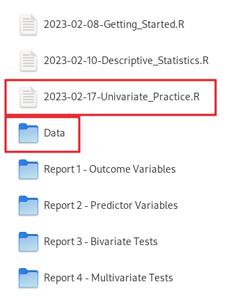
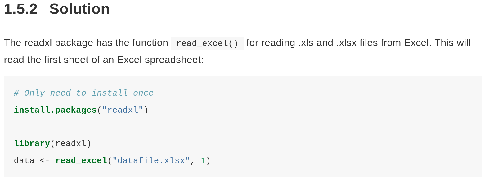

---
output:
  xaringan::moon_reader:
    css: ["default", "extra.css"]
    lib_dir: libs
    seal: false
    nature:
      highlightStyle: github
      highlightLines: true
      countIncrementalSlides: false
      ratio: '16:9'
---

```{r, echo = FALSE, warning = FALSE, message = FALSE}
##xaringan::inf_mr()
## For offline work: https://bookdown.org/yihui/rmarkdown/some-tips.html#working-offline
## Images not appearing? Put images folder inside the libs folder as that is the main data directory

library(tidyverse)
library(readxl)
library(stargazer)
##library(kableExtra)
##library(modelr)

knitr::opts_chunk$set(echo = FALSE,
                      eval = TRUE,
                      error = FALSE,
                      message = FALSE,
                      warning = FALSE,
                      comment = NA)
```

background-image: url('libs/Images/background-data_blue_v3.png')
background-size: 100%
background-position: center
class: middle, inverse

.size80[**Today's Agenda**]

<br>

.size45[
1. Inputting Excel files into R

2. Practicing univariate analyses

3. Polishing visualizations
]

<br>

.center[.size40[
  Justin Leinaweaver (Spring 2024)
]]

???

## Prep for Class
1. Pull WDI data and post on Canvas

<br>

*Jump to getting set-up slide*


---

background-image: url('libs/Images/background-blue_triangles2.png')
background-size: 100%
background-class: center
class: middle

.size55[.center[**Let's Get Set-up!**]]

.pull-left[

<br>

.size30[
**New Script**

2023-02-17-Univariate_Practice-WDI.R

<br>

**New Data**

2023-02-17-WDI_Data_Extract.xlsx
]
]

.pull-right[
```{r, fig.align='center', out.width='75%'}

```
]

???

Let's get set-up!

- Everybody create a new R script for our practice work today

- Everybody download the WDI data from Canvas and save it in your "Data" folder

*SAVE: WDI-Measles_Across_Time.xlsx*


---

background-image: url('libs/Images/background-blue_cubes_lighter3.png')
background-size: 100%
background-position: center
class: middle

.size60[.center[.content-box-blue[**Inputting Excel Data into R**]]]

<br>

```{r, fig.align='center', out.width='100%'}

```

.size35[.center[https://r-graphics.org/loading-data-from-an-excel-file.html]]

???

First new thing today: Inputting Excel data into R!

<br>

BEFORE we write the code for our work today, let's look at the cookbook recipe in Chang (2018).

- Change recipe 1.5

- Remember, the R Graphics Cookbook is a great reference book online for anytime you know WHAT you want to do but can't remember HOW to do it.

<br>

R Coding Lessons:

1. 'readxl' is an optional package you add only when you need to input an Excel file

2. Like ALL add-on packages, you only have to install it one time on your computer (unless you upgrade R)

3. You then load the package in each script that needs it using the library() function

### Make sense?

- **SLIDE**: Ok, let's apply this recipe to our new script.


---

background-image: url('libs/Images/background-blue_cubes_lighter3.png')
background-size: 100%
background-position: center
class: middle

.size60[.center[.content-box-blue[**Inputting Excel Data into R**]]]

<br>

```{r, echo=FALSE}
# Load readxl package
library(readxl)

# Input data as new object
data1 <- read_excel("../../Course_History/2023-Spring/Data_in_Class-SP23/WDI-2023-02/2023-02-17-WDI_Data_Extract.xlsx")
```

.code130[
```{r, echo=TRUE, eval=FALSE}
# Install package (one time)
install.packages("readxl")

# Load readxl package
library(readxl)

# Input data as new object
# Assumes Excel file in this folder
data1 <- read_excel("Data/2023-02-17-WDI_Data_Extract.xlsx")

# Check the data loaded
data1
```
]

???

This code assumes the excel file is in the data folder I asked you to create on our configuration day.

### Did everybody get the data loaded?

If you did, go help someone who is struggling!

- Solving other people's coding problems will make YOU a better coder!


---

background-image: url('libs/Images/background-blue_cubes_lighter3.png')
background-size: 100%
background-position: center
class: middle

.size40[.center[.content-box-blue[**Inputting Excel Data into R**]]]

```{r, fig.align='center', out.width='80%'}
knitr::include_graphics("libs/Images/05_1-RStudio_Import2.png")
```

???


---

background-image: url('libs/Images/background-blue_cubes_lighter3.png')
background-size: 100%
background-position: center
class: middle

.size40[.center[.content-box-blue[**Inputting Excel Data into R**]]]

```{r, fig.align='center', out.width='90%'}
knitr::include_graphics("libs/Images/05_1-RStudio_Import3.png")
```

???


---

background-image: url('libs/Images/background-blue_cubes_lighter3.png')
background-size: 100%
background-position: center
class: middle

.size40[.center[.content-box-blue[**Inputting Excel Data into R**]]]

```{r, fig.align='center', out.width='100%'}
knitr::include_graphics("libs/Images/05_1-RStudio_Import4_v2.png")
```

???


---

background-image: url('libs/Images/background-blue_cubes_lighter3.png')
background-size: 100%
background-position: center
class: middle

.size40[.center[.content-box-blue[**Inputting Excel Data into R**]]]

```{r, fig.align='center', out.width='100%'}
knitr::include_graphics("libs/Images/05_1-RStudio_Import5_v2.png")
```

???


---

class: middle

.size18[
```{r}
data1 |>
  slice_head(n = 11) |>
  select(-birth_rate, -death_rate) |>
  kableExtra::kbl(digits = 1)
```
]

???

Let's talk through the data set!

- `wb_income` categorizes all states per WB terms: low, lower-middle, upper-middle and high

- `gdp_per_capita` is gross domestic product divided by population

- `measles_immunizations_pct` is the percent of under 2s are immunized against measles

- `measles_herd_immunity` is a categorization of states as to whether they've achieved herd immunity (e.g. 95%).

<br>

**OMIT FOR NOW**
- `birth_rate` is the number of births per 1,000 people
- `death_rate` is the number of deaths per 1,000 people


---

background-image: url('libs/Images/background-blue_cubes_lighter3.png')
background-size: 100%
background-position: center
class: middle

.size60[.content-box-blue[**Univariate Analyses**]]

.size40[
**Analyzing Child Protection**
1. Make a bar plot of `measles_herd_immunity`

2. Make a histogram of `measles_immunizations_pct`

3. Calculate the descriptive statistics for `measles_immunizations_pct`
]

???

In the data set I have given you two measures of how a state protects children from Measles.

- `measles_immunizations_pct` is the percent of under 2s are immunized against measles

- `measles_herd_immunity` is a categorization of states as to whether they've achieved herd immunity (e.g. 95%).

<br>

Let's complete these three univariate analyses!


---

background-image: url('libs/Images/background-blue_cubes_lighter3.png')
background-size: 100%
background-position: center
class: middle

.center[.size55[.content-box-blue[**Univariate Analyses**]]]

<br>

.code120[
```{r, echo=TRUE, eval=FALSE}
# Bar Plot
measles1 <- ggplot(data = data1, aes(x = measles_herd_immunity))
measles1 + geom_bar()

# Histogram
measles2 <- ggplot(data = data1, aes(x = measles_immunizations_pct))
measles2 + geom_histogram()

# Descriptive Stats
summary(data1$measles_immunizations_pct)
```
]

???

### How did we do?

<br>

### How do the plots look?

- **SLIDE**: Let's clean up the bar plot!


---

background-image: url('libs/Images/background-blue_cubes_lighter3.png')
background-size: 100%
background-position: center
class: middle

.code130[
```{r, echo=TRUE, fig.align='center', fig.retina=3, fig.asp=.7, out.width='60%'}
# Bar Plot
measles1 <- ggplot(data = data1, aes(x = measles_herd_immunity))

measles1 + geom_bar()
```
]

???

Let's practice polishing a bar plot for including in a report.

- Change cookbook has lots of handy recipes on this.


---

background-image: url('libs/Images/background-blue_cubes_lighter3.png')
background-size: 100%
background-position: center
class: middle

.code130[
```{r, echo=TRUE, fig.align='center', fig.retina=3, fig.asp=.7, out.width='60%'}
measles1 <- ggplot(data = data1, aes(x = measles_herd_immunity))

measles1 + 
  geom_bar()
```
]

???

First step to polishing, change the organization of the code.

<br>

Once you create a ggplot object (measles1) you can then add to it in this style.

- Each piece of the ggplot function gets a separate line that ends with a '+'

- RStudio will automatically indent your code by two spaces to help you organize and read your code.

- This way you can keep adding to the ggplot object to add complexity to your picture

<br>

**Be VERY careful with this as a '+' with no line after it will stop your R script from working**

<br>

### Did everybody get this to work?

Ok, let's make some tweaks!


---

background-image: url('libs/Images/background-blue_cubes_lighter3.png')
background-size: 100%
background-position: center
class: middle

.code130[
```{r, echo=TRUE, fig.align='center', fig.retina=3, fig.asp=.7, out.width='60%'}
# Adjust width of the bars
measles1 + 
  geom_bar(width = .5) #<<
```
]

???

Inside the geom_bar function you can specify a width for the bars

- Take a sec to experiment with any values from 0 to 1

<br>

**SLIDE**: Let's add some color.


---

background-image: url('libs/Images/background-blue_cubes_lighter3.png')
background-size: 100%
background-position: center
class: middle

.code130[
```{r, echo=TRUE, fig.align='center', fig.retina=3, fig.asp=.7, out.width='60%'}
# Adjust the color of the bars
measles1 + 
  geom_bar(width = .5, fill = "blue") #<<
```
]

???

Inside the geom_bar function you can specify a color for the bars using the "fill" argument.

- e.g. The color you "fill" the bars with.

<br>

You can use essentially any color you can imagine but let's save color specification for later.

- For now, stick with the simple colors you can name.

- Try a few and see what happens

<br>

**SLIDE**: Now let's change the ordering of the bars.


---

background-image: url('libs/Images/background-blue_cubes_lighter3.png')
background-size: 100%
background-position: center
class: middle

.code120[
```{r, echo=TRUE, fig.align='center', fig.retina=3, fig.asp=.7, out.width='60%'}
# change the order of the bars
measles1 + 
  geom_bar(width = .5, fill = "blue") +
  scale_x_discrete(limits = c("Herd Immunity", "At Risk")) #<<
```
]

???

The function scale_x_discrete lets you change which levels in the categorical variable are shown and in what order.
- Chang Recipe 8.4

**SLIDE**: Everybody try reversing the order and see what happens


---

background-image: url('libs/Images/background-blue_cubes_lighter3.png')
background-size: 100%
background-position: center
class: middle

.center[.size50[.content-box-blue[**The Missing Data Problem**]]]

.pull-left[
```{r, echo=FALSE, fig.align='center', fig.retina=3, fig.asp=.7, out.width='100%'}
# change the order of the bars
measles1 + 
  geom_bar(width = .5, fill = "blue") +
  scale_x_discrete(limits = c("Herd Immunity", "At Risk")) #<<
```
]

.pull-right[
```{r, echo=FALSE, fig.align='center', fig.retina=3, fig.asp=.7, out.width='100%'}
# change the order of the bars
measles1 + 
  geom_bar(width = .5, fill = "blue") +
  scale_x_discrete(limits = c("Herd Immunity", "At Risk", NA)) #<<
```
]


???

### What are the pros and cons of removing vs including the NA count? 

### Which is the more "accurate" answer to the question about global vulnerability to measles?

<br>

**SLIDE**: Let's now clean up the axis labels.


---

background-image: url('libs/Images/background-blue_cubes_lighter3.png')
background-size: 100%
background-position: center
class: middle

.code100[
```{r, echo=TRUE, fig.align='center', fig.retina=3, fig.asp=.7, out.width='60%'}
measles1 + 
  geom_bar(width = .5, fill = "blue") +
  scale_x_discrete(limits = c("Herd Immunity", "At Risk")) +
  labs(x = "", y = "Count of Countries", title = "Measles Immunity Across the World") #<<
```
]

???

Time to clean up the labels with the labs() function

- Inside labs you can specify what you want on the x axis, the y axis, the title, a subtitle and a caption at the bottom

<br>

### How are we doing? Questions on polishing a bar plot?

Everybody take a minute to make sure you have all of this copied into your notes 

AND

Make some notes on what each line does and how you used it!

- Think of future you trying to understand the code, what could you tell yourself that will help?

<br>

**SLIDE**: Let's switch to the histogram now


---

background-image: url('libs/Images/background-blue_cubes_lighter3.png')
background-size: 100%
background-position: center
class: middle

.code110[
```{r, echo=TRUE, fig.align='center', fig.retina=3, fig.asp=.7, out.width='55%'}
# Histogram
measles2 <- ggplot(data = data1, aes(x = measles_immunizations_pct))
measles2 + geom_histogram()
```
]

.center[.size35[**To Do: 1) Bins to 15, 2) Add a fill color, 3) Add title and labels**]]

???

Here's the basic histogram we made.

### Everybody tweak this viz to do these three tasks


---

background-image: url('libs/Images/background-blue_cubes_lighter3.png')
background-size: 100%
background-position: center
class: middle

.code100[
```{r, echo=TRUE, fig.align='center', fig.retina=3, fig.asp=.7, out.width='60%'}
measles2 + 
  geom_histogram(bins = 15, fill = "orange") +
  labs(x = "Measles Immunizations (%)", y = "", title = "Global Measles Coverage (2019)")
  
```
]

???

### Everybody get this?

<br>

**SLIDE**: One other tweak I suggest for your histograms


---

background-image: url('libs/Images/background-blue_cubes_lighter3.png')
background-size: 100%
background-position: center
class: middle

.code100[
```{r, echo=TRUE, fig.align='center', fig.retina=3, fig.asp=.7, out.width='60%'}
measles2 + 
  geom_histogram(bins = 15, fill = "orange", color = "white") +
  labs(x = "Measles Immunizations (%)", y = "", title = "Global Measles Coverage (2019)")
```
]

???

Add a color argument to change the color of the lines around each box.

- I think "white" makes it much easier to read the histogram


---

background-image: url('libs/Images/background-blue_cubes_lighter3.png')
background-size: 100%
background-position: center
class: middle

.center[.size50[.content-box-blue[**Analyzing Child Protection**]]]

.pull-left[
```{r, echo=FALSE, fig.align='center', fig.retina=3, fig.asp=.7, out.width='100%'}
measles1 + 
  geom_bar(width = .5, fill = "blue") +
  scale_x_discrete(limits = c("Herd Immunity", "At Risk")) +
  labs(x = "", y = "Count of Countries", title = "Measles Immunity Across the World") #<<
```
]

.pull-right[
```{r, echo=FALSE, fig.align='center', fig.retina=3, fig.asp=.7, out.width='100%'}
measles2 + 
  geom_histogram(bins = 15, fill = "orange", color = "white") +
  labs(x = "Measles Immunizations (%)", y = "", title = "Global Measles Coverage (2019)")
```
]

<br>

.center[
.code120[
```{r}
summary(data1$measles_immunizations_pct)
```
]]

???

Alright, let's talk about what we've made.

### Which of these approaches tells the clearest story about global measles vaccinations in 2019?

- (Bar Plot: Cleanest story if message is half the world is at risk)

- (Histogram: Nicely helps us unpack the extensive variation in the "at risk" population)

- (Descriptives: Super handy for writing this up, e.g. the average is X, the minimum and maximum are...)

<br>

### Does everybody see how these three tools give us a WAY better grasp of the data than just looking at the spreadsheet?

THIS is the power of univariate analyses!

- I can't emphasize this enough, these simple tools add SO, SO much to a written argument.


---

background-image: url('libs/Images/background-blue_cubes_lighter3.png')
background-size: 100%
background-position: center
class: middle

.size55[.content-box-blue[**For Wednesday: Univariate Analyses**]]

.size45[
**Analyzing Country Wealth**
1. Polish a bar plot of `wb_income`

2. Polish a histogram of `gdp_per_capita`

3. Calculate the descriptive statistics for `gdp_per_capita`
]

???

Let's practice this one more time!

<br>

In the data set I have given you two measures of a state's wealth.

- One is the classification of states in terms of their income level
    - low, lower-middle, upper-middle and high

- The other is actual GDP per capita

<br>

Let's complete these three univariate analyses!


---

background-image: url('libs/Images/background-blue_cubes_lighter3.png')
background-size: 100%
background-position: center
class: middle

.code130[
```{r, echo=TRUE, eval=FALSE}
# Install animation package (one time)
install.packages("gganimate")

# Load the package
library(gganimate)

# Input the data
data2 <- read_excel("../../Course_History/2023-Spring/Data_in_Class-SP23/WDI-2023-02/WDI-Measles_Across_Time.xlsx")

# Histogram across time
data2 |>
  ggplot(aes(x = measles_immunizations_pct)) +
  geom_histogram() +
  transition_time(year) +
  labs(title = "Measles Immunizations ({as.integer(frame_time)})")
```
]


---

background-image: url('libs/Images/background-blue_cubes_lighter3.png')
background-size: 100%
background-position: center
class: middle

```{r, echo=FALSE, eval=TRUE, fig.align='center', fig.retina=3, fig.asp=.65, out.width='85%'}
library(gganimate)

data2 <- read_excel("../../Course_History/2023-Spring/Data_in_Class-SP23/WDI-2023-02/WDI-Measles_Across_Time.xlsx")

data2 |>
  ggplot(aes(x = measles_immunizations_pct)) +
  geom_histogram() +
  transition_time(year) +
  labs(title = "Global Measles Immunizations ({as.integer(frame_time)})",
       x = "Measles Immunizations (%)", y = "Country Counts")
```

???

### What lessons we can take from this animation?

### What is the trend in measles immunizations around the world?


---

background-image: url('libs/Images/background-blue_cubes_lighter3.png')
background-size: 100%
background-position: center
class: middle

.center[.size50[.content-box-blue[**Next Week: Report 1**]]]

<br>

.code120[
```{r, echo=TRUE, eval=FALSE}
# New Script: Report_1_Notes.R

# Load the packages
library(readxl)
library(tidyverse)

# Input the data
data1 <- read_excel("Data/GII-2021-Tidy.xlsx", na = "NA")
```
]

???

*SAVE*
data2 <- read_excel("Data/GII-1990_2021-Tidy.xlsx")
