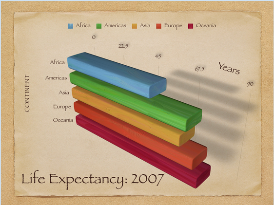

---
output:
  xaringan::moon_reader:
    css: ["default", "extra.css"]
    lib_dir: libs
    seal: false
    nature:
      highlightStyle: github
      highlightLines: true
      countIncrementalSlides: false
      ratio: '16:9'
---

```{r, echo = FALSE, warning = FALSE, message = FALSE}
##xaringan::inf_mr()
## For offline work: https://bookdown.org/yihui/rmarkdown/some-tips.html#working-offline
## Images not appearing? Put images folder inside the libs folder as that is the main data directory

library(tidyverse)
library(readxl)
#library(stargazer)
#library(kableExtra)
#library(modelr)

knitr::opts_chunk$set(echo = FALSE,
                      eval = TRUE,
                      error = FALSE,
                      message = FALSE,
                      warning = FALSE,
                      comment = NA)
```

background-image: url('libs/Images/background-blue_cubes_lighter2.png')
background-size: 100%
background-position: center
class: middle

.size80[**Today's Agenda**]

.size45[
Practice building, polishing and interpreting univariate analyses

- Script: 2023-02-17-Univariate_Practice-WDI.R

- Data: 2023-02-17-WDI_Data_Extract.xlsx
]

<br>

.center[.size40[
  Justin Leinaweaver (Spring 2024)
]]

???

## Prep for Class
1. 


---

background-image: url('libs/Images/06_1-WDI_Front.png')
background-size: 75%
background-position: center
class: middle

???

On Friday we began exploring data from the World Bank's WDI database.

- I'd like us to keep digging into this data today.

<br>

Two aims:

1. Practice building univariate analyses in R, and

2. Practice analyzing and interpreting the visualizations and statistics you are producing.

<br>

Before we get to work, let's talk about presenting visualization to professional audiences.


---

background-image: url('libs/Images/background-blue_cubes_lighter3.png')
background-size: 100%
background-position: center

```{r, echo = FALSE, fig.align = 'center', out.width = '78%'}

```

???

Ok, evaluate the quality of this visualization for me.

### What does it do well? What does it do badly?

<br>

Trick question! It does NOTHING good. NOTHING!

- Don't use 3-d if the 3-d provides ZERO new information

- Make the axis scales logical!

- I don't think these are continents...

- Where does this data come from?

- What do these bars actually show?

- Why are there drop shadows?!?!?

<br>

### Is everybody clear on this is an abomination?


---

background-image: url('libs/Images/background-blue_cubes_lighter3.png')
background-size: 100%
background-class: center
class: middle

.center[.size50[.content-box-blue[**Polishing your Visualizations**]]]

.size40[
1. Include an informative title

2. Add a figure label and caption

3. Identify the source(s)

4. Ensure the axis labels are clear and readable

5. Maximize the data-to-ink ratio

6. No chart junk!
]

???

Let's talk general rules of thumb when producing visualizations for a professional audience.

- This means producing high quality visualizations that would look good in any presentation, report, book, web post, poster, etc.

<br>

1. Include an informative title
    - EVERY visualization should have a title that tells the viewer the main point of the analysis
    - Don't force them to guess or to struggle to decipher the point, just tell them.

2. Add a label to the figure (with a figure number)
    - e.g. Figure 1, Figure 2, Figure 3
    - Otherwise it's impossible to refer to it in the text
    - Plus a caption to explain what is being shown in the visualization

3. Identify the source(s)
    - Somewhere on the Figure or in the label you MUST make clear where the data came from

4. Ensure the axis labels are clear and readable

5. Maximize the data-to-ink ratio
    - As much as possible, the "ink" should be tied directly to data
    - e.g. No extra 3-d nonsense!
    - e.g. No big empty spaces

6. No chart junk!
    - It's super easy to add nonsense to your plot and much of it simply distracts from the central point of the visualization.
    - Focus on the central argument of the viz!

<br>

### Questions on these?

- **SLIDE**: Example...


---

background-image: url('libs/Images/background-blue_cubes_lighter3.png')
background-size: 100%
background-class: center
class: middle

```{r, fig.align = 'center', out.width= '80%', fig.width = 8.5, fig.retina=3, fig.asp=.618}
d2 <- read_excel("../../Course_History/2023-Spring/Data_in_Class-SP23/WDI-2023-02/Wk6-WDI-Life_Expectancy_Data.xlsx") |>
  select(year = "Time", country = "Country Name", life_exp = "Life expectancy at birth, total (years) [SP.DYN.LE00.IN]")

d_world <- d2 %>% filter(country == "World")
d_other <- d2 %>% filter(country != "World")

d_other %>%
    ggplot(aes(x = reorder(country, life_exp), y = life_exp)) +
    geom_point(size = 2) +
    #geom_hline(yintercept = d_world$life_exp, color = "red", linewidth = 1.5) +
    #annotate("text", x = .25, y = 78, label = "Global Avg", size = 4, color = "red") +
    theme_bw() +
    coord_flip(ylim = c(60, 80), xlim = c(0,11)) +
    labs(x = "", y = "Life Expectancy (Years at birth)", title = "Life Expectancy by UN Region (2019)")
# Life Expectancies Vary Significantly Across the World
```

**Figure 1**: Global life expectancy for 2019 is taken from the World Bank's World Development Indicators (WDI) database and organized by UN region.

???

Let's call this level 1 of polished.

- The title is a clear, simple description
- The Figure label is good and includes the source info,
- The axis labels are clear
- There's no extraneous chart junk and no wasted space


---

background-image: url('libs/Images/background-blue_cubes_lighter3.png')
background-size: 100%
background-class: center
class: middle

```{r, fig.align = 'center', out.width= '80%', fig.width = 8.5, fig.retina=3, fig.asp=.618}
d2 <- read_excel("../../Course_History/2023-Spring/Data_in_Class-SP23/WDI-2023-02/Wk6-WDI-Life_Expectancy_Data.xlsx") |>
  select(year = "Time", country = "Country Name", life_exp = "Life expectancy at birth, total (years) [SP.DYN.LE00.IN]")

d_world <- d2 %>% filter(country == "World")
d_other <- d2 %>% filter(country != "World")

d_other %>%
    ggplot(aes(x = reorder(country, life_exp), y = life_exp)) +
    geom_point(size = 2) +
    geom_hline(yintercept = d_world$life_exp, color = "red", linewidth = 1.5) +
    annotate("text", x = .25, y = 75, label = "Global Avg", size = 4, color = "red") +
    theme_bw() +
    coord_flip(ylim = c(60, 80), xlim = c(0,11)) +
    labs(x = "", y = "Life Expectancy (Years at birth)", title = "The lack of development in Sub-Saharan Africa is a tragedy in global politics")
```

**Figure 1**: Global life expectancy for 2019 is taken from the World Bank's World Development Indicators (WDI) database and organized by UN region.

???

Let's call this level 2 of polished!

- Added descriptive statistics (the mean) for context

- Added a title that conveys an important conclusion

### Make sense?

<br>

### Questions on polishing a visualization?


---

background-image: url('libs/Images/background-blue_cubes_lighter3.png')
background-size: 100%
background-position: center
class: middle

.center[.size50[.content-box-blue[**Assignment for Wednesday**]
]]

.size45[
**1) Create a high quality, polished visualization for these six variables:**
- WB Income
- gdp_per_capita
- measles_herd_immunity
- measles_immunizations_pct
- birth_rate
- death_rate
]

???

Today you have two jobs.

Job 1: Produce six HIGHLY polished visualizations

- The good news is, we've already worked on the first four in class!

<br>

### Questions on Job 1?

- If you think of cool things you'd like to add to a visualization, ask me!


---

background-image: url('libs/Images/background-blue_cubes_lighter3.png')
background-size: 100%
background-position: center
class: middle

.center[.size50[.content-box-blue[**Assignment for Wednesday**]
]]

.size45[
**2) Submit to Canvas an argument that answers this question:**

.center[**What is the state of global development in 2019?**]

- Paragraph form
- Critical analysis, not simple description
- At least three pieces of evidence (polished figures)
]

???

Before class you must submit an argument answering this question that:

- Is in paragraph form (e.g. not just bullet points, complete sentences and each paragraph makes a complete point)

- Is built on critical analysis, not just simple descriptions of what you made,

- Includes at least THREE pieces of evidence inserted in the text to support your claims (figures MUST be highly polished)

<br>

Note, the RStudio export image tool will let you copy images and then you can paste them into the Canvas discussion board.

<br>

### Questions on the assignment?

Let's get to work!
