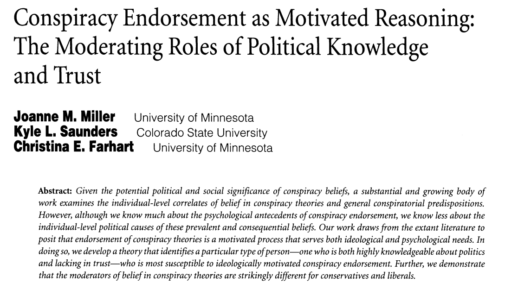

## Today's Agenda {background-image="Images/background-data_blue_v4.png"}

```{r}
library(tidyverse)
library(readxl)
library(kableExtra)
library(modelsummary)

load(file = "../../DATA/2026-Spring/ANES/ANES2020_Data_Extract.RData")

load(file = "../../DATA/2026-Spring/Miller_Saunders_Farhart2016/Miller_Saunders_Farhart2016.RData")
```

<br>

::: {.r-fit-text}

**Creating, Transforming and Indexing Variables**

:::

- Building and analyzing additive indicies

- Data 1: The American National Election Survey (ANES)

- Data 2: Miller, Saunders and Farhart (2016)

<br>

::: r-stack
Justin Leinaweaver (Spring 2026)
:::

::: notes
Prep for Class

1. Review Canvas submissions

<br>

**SLIDE**: Our work this week has focused on deepening the quality of our univariate analyses

:::


## {background-image="Images/background-data_blue_v4.png" .center}

**Univariate Analyses**

- Descriptive statistics (means, medians, modes, counts, SDs, etc)

- Visualizations (bar plots, box plots, histograms)

<br>

**This Week**

1. Modifying variables to help us analyze and present them

2. Creating new variables to better measure our concepts

::: notes

On Monday we focused on modifying variables

- Rescaling to move the decimal place, rescaling by taking the log, converting nominal variables into dummies and converting interval variables into ordinal ones

<br>

Last class we used some of those tools to build additive indicies of nominal and ordinal variables

<br>

For today I asked each of you to finish our work in that class building an index of American's political engagement and racial attitudes

- **SLIDE**: Let's talk through your results

:::


## {background-image="Images/background-data_blue_v4.png" .center .smaller}

**ANES questions on Americans' "recent political activities" (within the last 12 months)**

- Gave money to a candidate (polact.givecand)

- Gave money to a political party (polact.giveparty)

- Gave money to another political organization (polact.giveoth)

- Posted a political yard sign or a bumper sticker (polact.postsign)

- Attended a political meeting in person (polact.meetings)

- Attended a political meeting online (polact.onlinemeet)

- Did other work for a political cause (polact.othwork)

- Talked about 2020 vote choice with family or friends (polact.talkvote)

- Talked about politics with family or friends (polact.talkpol)

::: notes

Your first task was to build and analyze an index of Americans engagement with the political process

<br>

**What was the coding process you had to execute?**

- **In other words, what steps did you have to complete to do this?**

1. Variable conversion: Converted a nominal variable into a numeric dummy
2. Variable creation: Sum the dummies to build the index
3. Descriptive stats: Index
4. Visualize: Bar plot index

<br>

**Big picture, how did that go?**

- **Was everybody able to successfully build the index?**

<br>

**SLIDE**: Results and takeaways

<br>

*Construct an additive index of Americans' engagement with the political process using all nine variables we discussed in class (polact.givecand, polact.giveparty, polact.giveoth, polact.postsign, polact.meetings, polact.onlinemeet, polact.othwork, polact.talkvote, polact.talkpol). Submit a polished visualization of your constructed index AND your analysis of the results. Assuming this is a representative sample of Americans, how engaged were we in the political process in 2020?*

:::


## {background-image="Images/background-data_blue_v4.png" .center .smaller}

::: {.panel-tabset}

### Results

**Americans' Political Engagement Index (ANES)**

```{r, fig.align='center', fig.asp=.618, out.width="85%"}
anes$engagement_index <- 
  if_else(anes$polact.givecand == "1. Yes", 1, 0) +
  if_else(anes$polact.giveparty == "1. Yes", 1, 0) +
  if_else(anes$polact.giveoth == "1. Yes", 1, 0) +
  if_else(anes$polact.postsign == "1. Yes", 1, 0) +
  if_else(anes$polact.meetings == "1. Yes", 1, 0) +
  if_else(anes$polact.onlinemeet == "1. Yes", 1, 0) +
  if_else(anes$polact.othwork == "1. Yes", 1, 0) +
  if_else(anes$polact.talkvote == "1. Yes", 1, 0) +
  if_else(anes$polact.talkpol == "1. Yes", 1, 0)

# Simple bar plot
ggplot(anes, aes(x = engagement_index)) +
  geom_bar() +
  theme_bw() +
  scale_x_continuous(breaks = 0:9) +
  labs(x = "American's Political Engagement Index", y = "Count")

summary(anes$engagement_index)
```

### Code
```{r, echo=TRUE, eval=FALSE}
anes$engagement_index <- 
  if_else(anes$polact.givecand == "1. Yes", 1, 0) +
  if_else(anes$polact.giveparty == "1. Yes", 1, 0) +
  if_else(anes$polact.giveoth == "1. Yes", 1, 0) +
  if_else(anes$polact.postsign == "1. Yes", 1, 0) +
  if_else(anes$polact.meetings == "1. Yes", 1, 0) +
  if_else(anes$polact.onlinemeet == "1. Yes", 1, 0) +
  if_else(anes$polact.othwork == "1. Yes", 1, 0) +
  if_else(anes$polact.talkvote == "1. Yes", 1, 0) +
  if_else(anes$polact.talkpol == "1. Yes", 1, 0)

# Simple bar plot
ggplot(anes, aes(x = engagement_index)) +
  geom_bar() +
  theme_bw() +
  scale_x_continuous(breaks = 0:9) +
  labs(x = "American's Political Engagement Index", y = "Count")

summary(anes$engagement_index)
```

:::
::: notes

**What did you learn from analyzing this index?**

- That's a definite right-skew (e.g. positive skew)

<br>

**Which of the components of this index are the lowest and highest hanging fruit?**

- **In other words, which questions had the lowest and highest proportion of yes responses?**

- (**SLIDE**)

:::


## {background-image="Images/background-data_blue_v4.png" .center .smaller}

::: {.r-fit-text}
**"Recent political activities" (within the last 12 months)**
:::

<br>

:::: {.columns}
::: {.column width="40%"}
```{r, fig.asp=.95, fig.width=5}
# Simple bar plot
ggplot(anes, aes(x = engagement_index)) +
  geom_bar() +
  theme_bw() +
  scale_x_continuous(breaks = 0:9) +
  labs(x = "American's Political Engagement Index", y = "Count")
  
```
:::

::: {.column width="60%"}
```{r}
anes |>
  select(polact.givecand:polact.talkvote) |>
  pivot_longer(cols = polact.givecand:polact.talkvote, names_to = "question", values_to = "value") |>
  group_by(question) |>
  summarize(
    Responses = sum(!is.na(value)),
    Yes = sum(value  == "1. Yes", na.rm = T),
    Proportion = Yes/Responses
  ) |>
  arrange(desc(Proportion)) |>
  kable(digits = 2, align = c("l", "c", "c", "c")) |>
  kable_styling(font_size = 25)
```
:::
::::

::: notes

**Any surprises here?**

- (It probably makes sense that the two "talking" activities would be the easiest to complete for most people)

<br>

**Why do you think the `talkvote` variable is so much less than the `talkpol` variable?**

- **Do you think that is a normal difference or was this something specific to the 2020 election?**

<br>

Let's switch our focus to the racial attitudes index

- **SLIDE**: Canvas Q2

:::


## {background-image="Images/background-data_blue_v4.png" .center}

::: {.r-fit-text}
**ANES questions on Americans' "racial attitudes"**
:::

- Have concerned feelings for other racial/ethnic groups (anes$oth.race.concern)

- Imagine how they would feel before criticizing other groups (anes$oth.race.feel)

- Try to understand the perspective of other racial/ethnic groups (anes$oth.race.persp)

- Feel protective of someone due to race or ethnicity (anes$oth.race.protect)

::: notes

Your second task was to build and analyze an index of Americans' racial attitudes

<br>

**What was the coding process you had to execute?**

- **In other words, what steps did you have to complete to do this?**

1. Variable conversion: Converted an ordinal variable into an interval variable
2. Variable creation: Sum the intervals to build the index
3. Descriptive stats: Index
4. Visualize: Bar plot Index

<br>

**Big picture, how did that go?**

- **Was everybody able to successfully build the index?**

<br>

**SLIDE**: Results and takeaways

<br>

*2. Construct an additive index of Americans' "racial attitudes" using the four variables we discussed in class (oth.race.concern, oth.race.feel, oth.race.persp, oth.race.protect). Submit a polished visualization of your constructed index AND your analysis of the results. Assuming this is a representative sample of Americans, how would you describe the racial attitudes of voters in 2020?*

- Question scales 1-5: "1. Extremely often", "2. Very often", "3. Somewhat often", "4. Not too often", "5. Not often at all"

:::


## {background-image="Images/background-data_blue_v4.png" .center}

::: {.panel-tabset}

### Results

**Americans' Racial Bias (ANES)**

```{r, fig.align='center', fig.asp=.618, out.width="80%"}
anes$racial_index <- as.numeric(anes$oth.race.concern) +
  as.numeric(anes$oth.race.feel) +
  as.numeric(anes$oth.race.persp) +
  as.numeric(anes$oth.race.protect)

# Simple bar plot
ggplot(anes, aes(x = racial_index)) +
  geom_bar() +
  theme_bw() +
  scale_x_continuous(breaks = 4:20) +
  labs(x = "American's Racial Bias Index", y = "Count")

summary(anes$racial_index)
```

### Code

```{r, echo=TRUE, eval=FALSE}
anes$racial_index <- as.numeric(anes$oth.race.concern) +
  as.numeric(anes$oth.race.feel) +
  as.numeric(anes$oth.race.persp) +
  as.numeric(anes$oth.race.protect)

# Simple bar plot
ggplot(anes, aes(x = racial_index)) +
  geom_bar() +
  theme_bw() +
  scale_x_continuous(breaks = 4:20) +
  labs(x = "American's Racial Bias Index", y = "Count")

summary(anes$racial_index)
```
:::

::: notes

*Question scales 1-5: "1. Extremely often", "2. Very often", "3. Somewhat often", "4. Not too often", "5. Not often at all"*

<br>

To help me understand what is being visualized here I've renamed the index

- This reminds me that as the scores increase the respondent is showing a more negative attitude to other races

- **Make sense?**

<br>

**What did you learn from analyzing this index?**

- Higher scores correspond to more negative attitudes to other races

<br>

**SLIDE**: Wrapping up the canvas assignments

:::


## {background-image="Images/background-data_blue_v4.png" .center}

::: {.r-fit-text}

**Why create an additive index of variables?**

1. May create a better estimate of a complex concept

2. Allows a wider array of analysis tools

3. May reduce random measurement error
:::

::: {.fragment}
**Our Indicies**

1. Americans' political engagement

:::

::: {.fragment}
2. Americans' racial bias
:::
::: notes

Last class I proposed these three advantages to building an additive index.

<br>

**REVEAL**: Our index of American political engagement combined nine nominal variables into an interval variable

- **Are you convinced that this index is superior to the nine separate measures? Why or why not?**

<br>

**REVEAL**: Our index of American racial bias combined four ordinal variables into an interval variable

- **Are you convinced that this index is superior to the four separate measures? Why or why not?**

<br>

**SLIDE**: Today I want us to now apply our skills to replicating the work of a published research article

:::


## {background-image="Images/background-data_blue_v4.png" .center}



::: notes

For today I asked you to read the opening and set-up for a 2016 AJPS article by Miller, Saunders and Farhart titled:

- Conspiracy Endorsement as Motivated Reasoning: The Moderating Roles of Political Knowledge and Trust

<br>

RQ: Why are some people more likely to believe in conspiracy theories (CTs) than others?

<br>

Answer: Confirmation bias is a powerful motivator for believing comforting lies

- In other words, belief in CT is the result of an interaction between ideology, knowledge and trust

<br>

Over the next two weeks we'll replicate some of these tests

- Today I want us to use our univariate tools to get a solid foundation in the data and their key measures

<br>

**SLIDE**: Let's begin with the outcome variables

:::


## Miller, Saunders & Farhart (2016) {background-image="Images/background-data_blue_v4.png" .center .smaller}

<br>

:::: {.columns}
::: {.column width="50%"}
**Liberal Conspiracy Theories**

- Bush lied about WMDs?
- Government knew 9/11 was going to happen?
- Government breached the levees on purpose?
- Republicans stole 2004 election?
:::

::: {.column width="50%"}
**Conservative Conspiracy Theories**

- Obama born in the US?
- ACA create death panels?
- Climate change a hoax?
- Saddam Hussein involved in 9/11?
:::
::::

::: notes

The researchers designed eight questions meant to measure a resppondent's belief in conspiracy theories

- Four of the theories are designed to appeal to liberals and four of the theories were coded for conservatives

- This is all because of the mechanisms they propose to test in the paper focused on confirmation bias

<br>

Pairs / Small groups get ready to report back: **How confident are we that these questions will produce valid and reliable measures of belief in conspiracy theories?**

- The longer version of each question is in the pdf I shared on Canvas

- *REPORT back and DISCUSS*

<br>

Ok, let's start with some simple univariate analyses

- **My question is, which of the CTs in the dataset are most widely believed and which are the least?**

- (**SLIDE**)

:::


## {background-image="Images/background-data_blue_v4.png" .center}

```{r, fig.align='center', fig.width=13, fig.asp=.75}
d |>
  select(CT_Obama:CT_2004_election) |>
  mutate(
    across(CT_Obama:CT_2004_election, as.numeric)
  ) |>
  pivot_longer(cols = CT_Obama:CT_2004_election, names_to = "cts", values_to = "value") |>
  group_by(cts) |>
  summarize(
    Missing = sum(is.na(value)),
    Mean = mean(value, na.rm = T),
    SD = sd(value, na.rm = T)
  ) |>
  arrange(desc(Mean)) |>
  kable(digits = 2, col.names = c("Conspiracy Theories", "Missing", "Mean", "SD")) |>
  kable_styling(font_size = 35)
  
# Bar plots
# d |>
#   pivot_longer(cols = CT_Obama:CT_2004_election, names_to = "cts", values_to = "value") |>
#   ggplot(aes(y = value)) +
#   geom_bar() +
#   theme_bw() +
#   facet_wrap(~cts, scale = "free", ncol = 3)
```

- Variables recoded into 1-4 scale with 1 meaning "no belief in the CT" to 4 meaning the "most belief in the CT"

::: notes

*REPORT back and DISCUSS*

<br>

Ok, we know where this is going!

- Pairs / Small groups: I want you to build us an OVERALL index of CT belief that includes all eight questions

- **Which approach you practiced for today is the right method for combining these variables?**

    - e.g. Is this an if_else situation like the ANES political engagement index OR an as.numeric situation like the racial attitudes index?**

- (as.numeric!)

<br>

Ok, build that index and analyze the results!

- (**SLIDE**)

:::


## {background-image="Images/background-data_blue_v4.png"}

::: {.panel-tabset}

### Results

**Americans' Beliefs in Conspiracy Theories**

```{r, fig.align='center', fig.asp=.618, fig.width=7, out.width="70%"}
d$ct_index <- as.numeric(d$CT_Obama) + as.numeric(d$CT_DeathPanels) + as.numeric(d$CT_Govt_911) + as.numeric(d$CT_Katrina_Levees) + as.numeric(d$CT_Climate_Hoax) + as.numeric(d$CT_Bush_WMDs) + as.numeric(d$CT_Hussein_911) + as.numeric(d$CT_2004_election) 

summary(d$ct_index)

ggplot(d, aes(x = ct_index)) +
  geom_bar() +
  theme_bw() +
  scale_x_continuous(breaks = 8:32) +
  labs(x = "Conspiracy Theory Index (8-32)", y = "Count")
```

### Code

```{r, echo=TRUE, eval=FALSE}
d$ct_index <- as.numeric(d$CT_Obama) + 
  as.numeric(d$CT_DeathPanels) + 
  as.numeric(d$CT_Govt_911) + 
  as.numeric(d$CT_Katrina_Levees) + 
  as.numeric(d$CT_Climate_Hoax) + 
  as.numeric(d$CT_Bush_WMDs) + 
  as.numeric(d$CT_Hussein_911) + 
  as.numeric(d$CT_2004_election) 

summary(d$ct_index)

ggplot(d, aes(x = ct_index)) +
  geom_bar() +
  theme_bw() +
  scale_x_continuous(breaks = 8:32) +
  labs(x = "Conspiracy Theory Index (8-32)", y = "Count")
```
:::

::: notes

**Ok, is this good news for our country or not?**

- **Describe this distribution for me!**

<br>

**Out of curiosity, where would you end up on this scale?**

- Take the survey!

<br>

Let's do more rescaling to make this easier to understand

- Having the lowest value as 8 doesn't make a lot of sense outside the survey

- **What could we do to make this easier to understand?**

- (Subtract 8 from the index)

<br>

Everybody make a NEW index that is the current one minus 8 and redo the summary stats and the bar plot

- (**SLIDE**)

:::


## {background-image="Images/background-data_blue_v4.png" .center}

::: {.r-fit-text}
**Americans' Beliefs in Conspiracy Theories**
:::

```{r, fig.align='center', fig.asp=.618, fig.width=7, out.width="75%"}
d$ct_index2 <- (d$ct_index - 8)

summary(d$ct_index2)

ggplot(d, aes(x = ct_index2)) +
  geom_bar() +
  theme_bw() +
  scale_x_continuous(breaks = 0:24) +
  labs(x = "Conspiracy Theory Index (0-24)", y = "Count")
```

```{r, echo=TRUE}
d$ct_index2 <- d$ct_index - 8
```

::: notes

**Ok, does everybody see why this is better?**

<br>

**What else could we do to make this more informative for the average viewer?**

- (The 24 point scale seems arbitrary and difficult to unpack)

<br>

**What could we do to make this range easier to understand?**

- (Convert to proportions out of 100!)

<br>

Everybody make a NEW index that is the current one minus 8, divide by 24 and redo the summary stats and the bar plot

- (**SLIDE**)

:::


## {background-image="Images/background-data_blue_v4.png" .center}

::: {.r-fit-text}
**Americans' Beliefs in Conspiracy Theories**
:::

```{r, fig.align='center', fig.asp=.618, fig.width=7, out.width="75%"}
d$ct_index3 <- (d$ct_index - 8) / 24

summary(d$ct_index3)

ggplot(d, aes(x = ct_index3)) +
  geom_bar() +
  theme_bw() +
  scale_x_continuous(labels = scales::percent_format()) +
  labs(x = "Conspiracy Theory Index", y = "Count")
```

```{r, echo=TRUE}
d$ct_index3 <- (d$ct_index - 8) / 24
```

::: notes

**Better?**

- (Easier to interpret and to classify the respondents!)

<br>

We'll work on analyzing this index over the next few weeks!

- We'll want to see what predictors explain greater belief in conspiracy theories

<br>

**SLIDE**: Last job for today, let's shift our focus to the political knowledge questions

:::


## Political Knowledge {background-image="Images/background-data_blue_v4.png" .center}

:::: {.columns}
::: {.column width="50%"}
- Senate term length?
- Conservative party?
- John Roberts job?
- President Russia?
- Speaker of House?
- Biden's job?
- Cameron's job?
:::

::: {.column width="50%"}
- House majority?
- Nominates judges?
- Reviews laws?
- Override veto?
- Secretary of State?
- Secretary of Treasury?
- PM of Canada?
:::
::::

::: notes

The researchers designed 14 questions meant to measure a respondent's political knowledge

- The idea is that a more politically knowledgeable respondent should be less inclined to believe in conspiracy theories

<br>

Pairs / Small groups get ready to report back: **How confident are we that these questions will produce valid and reliable measures of political knowledge?**

- The longer version of each question is in the pdf I shared on Canvas

- *REPORT back and DISCUSS*

<br>

**How would you have done on this survey?**

- *DISCUSS*

<br>

Ok, let's once again review the questions separately with univariate analyses

- **My question is, which of the knowledge questions in the dataset were easiest and which the hardest?**

<br>

**SLIDE**: For next class

:::


## For Next Class {background-image="Images/background-data_blue_v4.png" .center}

1. Read p81-98 in Chapter 4

2. Complete Exercises 2 and 4

3. Build & evaluate the political knowledge index

::: {.fragment}

```{r, echo=TRUE, eval=FALSE}
# 1) Recode nominal variables into dummies
d$Majority_House2 <- 
  if_else(d$Majority_House == "Republican Party", 1, 0)
d$More_Conservative2 <- 
  if_else(d$More_Conservative == "Republican Party", 1, 0)
d$JRoberts_Job2 <- 
  if_else(d$JRoberts_Job == "Chief Justice of the Supreme Court", 1, 0)

# 2) Sum them to make the index
d$knowledge <- d$Majority_House2 + d$More_Conservative2 +
  d$JRoberts_Job2
```

:::

::: notes

Next week we move our focus to bivariate analyses

- So you have a reading in the textbook about the key concepts,

- Two exercises to ensure those concepts make sense, and

- One more chance to build and analyze an index!

<br>

**Which coding approach will you need for this political knowledge index? if_else or as.numeric?**

- (Back to if_else!)

- (**SLIDE**: Jump-start on the code)

<br>

**Any questions?**

<br>

Canvas Assignment: Chapter 4 Assessment (part 1)

1. Construct an additive index of political knowledge using the Miller, Saunders and Farhart (2016) data AND transform the index into a proportion so that each value represents that respondent's percentage correct across all of the questions. Submit a polished visualization of your constructed index AND your analysis of the results.
2. Submit your answers to Exercise 2 on p103
3. Submit your answers to Exercise 4 on p104
4. Was there anything specific in the excerpt that didn't make sense or that you'd like to make sure we discuss in class?

:::


