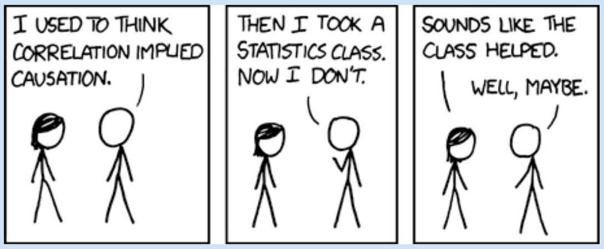

## Today's Agenda {background-image="Images/background-data_blue_v4.png" .center}

```{r}
library(tidyverse)
library(readxl)
library(kableExtra)
library(modelsummary)

load(file = "../../DATA/2026-Spring/Miller_Saunders_Farhart2016/Miller_Saunders_Farhart2016.RData")
```

<br>

::: {.r-fit-text}

**Introduction to Bivariate Analyses**

:::

- Proposing Explanations, Framing Hypotheses, and Making Comparisons

<br>

::: r-stack
Justin Leinaweaver (Spring 2026)
:::

::: notes
Prep for Class

1. Review Canvas submissions

2. Markers x 4

<br>

**SLIDE**: Let's kick things off with our wrap-up from last week

:::


## {background-image="Images/background-data_blue_v4.png" .center}

::: {.r-fit-text}
**Americans' Political Knowledge (Miller, Saunders & Farhart 2016)**
:::

:::: {.columns}
::: {.column width="50%"}
- Senate term length
- Conservative party
- John Roberts job
- President Russia
- Speaker of House
- Biden's job
- Cameron's job
:::

::: {.column width="50%"}
- House majority
- Nominates judges
- Reviews laws
- Override veto
- Secretary of State
- Secretary of Treasury
- PM of Canada
:::
::::

::: notes

Your first job for today was to construct an additive index of political knowledge using the Miller, Saunders and Farhart (2016) data and to present it as a proportion of the total possible correct.

- **How did this go?**

- (**SLIDE**: index results)

:::


## {background-image="Images/background-data_blue_v4.png" .center .smaller}

::: {.panel-tabset}

### Results

**Americans' Political Knowledge (Miller, Saunders & Farhart 2016)**

```{r, fig.align='center', fig.asp=.618, fig.width=7, out.width="70%"}
# Recode nominal variables into dummies
d$Majority_House2 <- if_else(d$Majority_House == "Republican Party", 1, 0)
d$More_Conservative2 <- if_else(d$More_Conservative == "Republican Party", 1, 0)
d$JRoberts_Job2 <- if_else(d$JRoberts_Job == "Chief Justice of the Supreme Court", 1, 0)
d$Pres_Russia2 <- if_else(d$Pres_Russia == "Vladimir Putin", 1, 0)
d$Speaker2 <- if_else(d$Speaker == "John Boehner", 1, 0)
d$JBiden_Job2 <- if_else(d$JBiden_Job == "Vice President of the United States", 1, 0)
d$DCameron_Job2 <- if_else(d$DCameron_Job == "Prime Minister of the United Kingdom", 1, 0)
d$Nominates_Judges2 <- if_else(d$Nominates_Judges == "The President", 1, 0)
d$Senate_Term2 <- if_else(d$Senate_Term == "6 years", 1, 0)
d$Reviews_Laws2 <- if_else(d$Reviews_Laws == "The Supreme Court", 1, 0)
d$Veto_Override2 <- if_else(d$Veto_Override == "2/3", 1, 0)
d$Sec_State2 <- if_else(d$Sec_State == "John Kerry", 1, 0)
d$Sec_Treasury2 <- if_else(d$Sec_Treasury == "Jacob Lew", 1, 0)
d$PM_Canada2 <- if_else(d$PM_Canada == "Stephen Harper", 1, 0)

d$knowledge_index <- d$Majority_House2 + d$More_Conservative2 + d$JRoberts_Job2 + d$Pres_Russia2 + d$Speaker2 + d$JBiden_Job2 + d$DCameron_Job2 + d$Nominates_Judges2 + d$Senate_Term2 + d$Reviews_Laws2 + d$Veto_Override2 + d$Sec_State2 + d$Sec_Treasury2 + d$PM_Canada2

# Rescale to proportion
d$knowledge_index2 <- d$knowledge_index / 14

summary(d$knowledge_index2) |>
  as.matrix() |>
  t() |>
  kable(digits = 2) |>
  kable_styling(font_size = 30)

ggplot(d, aes(x = knowledge_index2)) +
  geom_bar() +
  theme_bw() +
  scale_x_continuous(labels = scales::percent_format()) +
  labs(x = "Political Knowledge Index", y = "Count")
```

### Code

```{r, echo=TRUE, eval=FALSE}
# Recode nominal variables into dummies
d$Majority_House2 <- if_else(d$Majority_House == "Republican Party", 1, 0)
d$More_Conservative2 <- if_else(d$More_Conservative == "Republican Party", 1, 0)
d$JRoberts_Job2 <- if_else(d$JRoberts_Job == "Chief Justice of the Supreme Court", 1, 0)
d$Pres_Russia2 <- if_else(d$Pres_Russia == "Vladimir Putin", 1, 0)
d$Speaker2 <- if_else(d$Speaker == "John Boehner", 1, 0)
d$JBiden_Job2 <- if_else(d$JBiden_Job == "Vice President of the United States", 1, 0)
d$DCameron_Job2 <- if_else(d$DCameron_Job == "Prime Minister of the United Kingdom", 1, 0)
d$Nominates_Judges2 <- if_else(d$Nominates_Judges == "The President", 1, 0)
d$Senate_Term2 <- if_else(d$Senate_Term == "6 years", 1, 0)
d$Reviews_Laws2 <- if_else(d$Reviews_Laws == "The Supreme Court", 1, 0)
d$Veto_Override2 <- if_else(d$Veto_Override == "2/3", 1, 0)
d$Sec_State2 <- if_else(d$Sec_State == "John Kerry", 1, 0)
d$Sec_Treasury2 <- if_else(d$Sec_Treasury == "Jacob Lew", 1, 0)
d$PM_Canada2 <- if_else(d$PM_Canada == "Stephen Harper", 1, 0)

d$knowledge_index <- d$Majority_House2 + d$More_Conservative2 + d$JRoberts_Job2 + d$Pres_Russia2 + d$Speaker2 + d$JBiden_Job2 + d$DCameron_Job2 + d$Nominates_Judges2 + d$Senate_Term2 + d$Reviews_Laws2 + d$Veto_Override2 + d$Sec_State2 + d$Sec_Treasury2 + d$PM_Canada2

# Rescale to proportion
d$knowledge_index2 <- d$knowledge_index / 14

summary(d$knowledge_index2)

ggplot(d, aes(x = knowledge_index2)) +
  geom_bar() +
  theme_bw() +
  scale_x_continuous(labels = scales::percent_format()) +
  labs(x = "Political Knowledge Index", y = "Count")
```
:::

::: notes

**Ok, assuming this is a representative sample of Americans, what do we learn about the political knowledge in our country?**

- *DISCUSS*

<br>

**Any questions on the variable transformations or variable creation techniques we worked on last week?**

<br>

**SLIDE**: Shifting to our work for this week...

:::


## {background-image="Images/background-data_blue_v4.png" .center}

**Univariate Analyses**

- Evaluating measures of the empirical world AND using statistics to summarize or describe their distributions

<br>

::: {.fragment}

**Bivariate Analyses**

- "...involves the analysis of two variables (often denoted as X, Y), for the purpose of determining the empirical relationship between them" (Babbie 2009).

:::

::: notes

This week marks our shift from univariate analysis to bivariate analysis

<br>

By univariate analysis we mean BOTH:

1. Evaluating measures of the empirical world in terms of their validity and reliability, and

2. Using statistics to summarize or describe the distributions of those measures

3. (OFTEN ALSO) Can we draw inferences from this sample about the wider population?

<br>

To be clear, no one should EVER skip the univariate work.

- It is this work that matters WAY more for your conclusions than anything that follows

- I don't care how complicated your regression analysis is if your measures are too imprecise to mean anything

<br>

With the univariate work done you can then shift to the bivariate work

- **REVEAL**

- In simple terms, bivariate just means two variable

- So we are shifting from using statistics to describe one variable to using statistics to describe the relationship between variables

<br>

Today we'll focus on the concepts and understandings we need for setting up a useful bivariate analysis AND NEXT CLASS we'll start using the tools to make bivariate analyses

- **SLIDE**: Why do we need to spend a day setting up bivariate analysis instead of just doing them?

:::


## Correlation Does Not Imply Causation {.center background-image="Images/background-data_blue_v4.png"}

```{r, fig.align='center'}
knitr::include_graphics("Images/12_1-dinosaur_correlation.webp")
```

::: notes

Describing relationships is VERY tricky work

- And being casual about this is what steers SO many people wrong in the world around us

- Our brains are designed to find patterns in the world around us even when the patterns aren't really there!

<br>

You've probably all heard the phrase: "correlation does not imply causation."

- This represents a good warning that prevent us from reaching conclusions with our data that we cannot support

<br>

**SLIDE**: HOWEVER, it's not that simple

:::


## Correlation May Imply Causation {.center background-image="Images/background-data_blue_v4.png"}

<br>

::: columns
::: {.column width="50%"}
```{r, fig.align = 'center', fig.width = 6, fig.height=1.25}
## Manual DAG
d1 <- tibble(
  x = c(-3, 3),
  y = c(1, 1),
  labels = c("A", "B")
)

p1 <- ggplot(data = d1, aes(x = x, y = y)) +
  geom_point(size = 0, color = "white") +
  theme_void() +
  coord_cartesian(xlim = c(-4, 4), ylim = c(.5, 1.5)) +
  geom_label(aes(label = labels), size = 7)

p1 +
  annotate("segment", x = -1.9, xend = 2.2, y = 1, yend = 1, arrow = arrow())
```

```{r, fig.align = 'center', fig.width = 6, fig.height=2.5}
p1 +
  annotate("segment", x = -1.9, xend = 2.2, y = .85, yend = .85, arrow = arrow()) +
  annotate("segment", x = 2.2, xend = -1.9, y = 1.15, yend = 1.15, arrow = arrow())
```
:::

::: {.column width="50%"}
```{r, fig.align = 'center', fig.width = 6, fig.height=1.25}
p1 +
  annotate("segment", x = 2.2, xend = -1.9, y = 1, yend = 1, arrow = arrow())
```

```{r, fig.align = 'center', fig.width = 6, fig.height=2.5}
p1 +
  annotate("segment", x = .4, xend = 2.6, y = 1.32, yend = 1.05, arrow = arrow()) +
  annotate("segment", x = -.4, xend = -2.6, y = 1.32, yend = 1.05, arrow = arrow()) +
  annotate("text", x = 0, y = 1.4, label = "C", size = 8)
```
:::
:::

::: notes

Very often, when two things are correlated that tells us there is something important happening somewhere around the variables

<br>

Correlation can be evidence of a number of different plausible relationships

-   A causes B

-   B causes A

-   A causes B and B causes A

-   A and B are both caused by C

-   etc.

<br>

Correlation doesn't tell us which of these is happening, BUT it does tell us something is likely going on in this relationship!

<br>

**SLIDE**: And so the takeaway for us is...

:::


## Correlation and Causation {background-image="Images/background-data_blue_v4.png" .center}

<br>



::: notes

*Read the XKCD cartoon*

<br>

Bivariate analysis is often the first step toward making a causal argument

- BUT, doing that requires us to figure out if the patterns we see in the data mean what we think they mean

- AND EQUALLY IMPORTANTLY, how do we make a convincing argument to other scientists that changes in our predictor variable CAUSE changes in our outcome variable?

<br>

**SLIDE**: This is a big job, so let's start with the baseline concepts and approaches we will need going forward

:::


## Directed Acyclic Graphs (DAGs) {background-image="Images/background-data_blue_v4.png" .center}

<br>

```{r, fig.retina = 3, fig.align = 'center', fig.width = 6, fig.height=.85, out.width='85%'}
## Manual DAG
d1 <- tibble(
  x = c(-3, 3),
  y = c(1, 1),
  labels = c("Treatment", "Outcome")
)

ggplot(data = d1, aes(x = x, y = y)) +
  geom_point(size = 0, color = "white") +
  theme_void() +
  coord_cartesian(xlim = c(-4, 4)) +
  geom_label(aes(label = labels), size = 7) +
  annotate("segment", x = -1.9, xend = 1.9, y = 1, yend = 1, arrow = arrow())
```

+ 'Directed' = Paths indicate direction of effect

+ 'Acyclic' = No immediate feedback loops

+ 'Graphs' = Visualized

::: notes

The textbook chapter uses a lot of what it calls causal diagrams

- Technically these are examples of Directed Acyclic Graphs (DAGs)

- DAGs are incredibly useful tools for clarifying causal arguments and the distinction between theory and a model.

<br>

Let's use this slide to clarify any of the big concepts from the chapter that don't make sense

1. **What is the dependent variable in this DAG? How do you know?**

    - ("The observed effect is what we call the dependent variable because its magnitude depends upon some other causal variable")

2. **What is the independent variable in this DAG? How do you know?**

    - ("The causal variable")
    
3. **Do DAGs always represent probabilistic or deterministic models?**

    - (Can be either!)
    - (In the sciences this will almost always be probabilistic)
    - (The book confusingly refers to physics as an area of deterministic relationships but I think that's a wildly overbroad claim. In very narrow and uninteresting problems it might be, but in all the cutting-edge stuff it is not, e.g. quantum mechanics, astrophysics, etc)
    
<br>

SO, a DAG is a graphical representation of a model

- A model is a simplification of reality, and

- A theory is the explanation of WHY the arrow is there and points in this direction

<br>

**Questions on these baseline concepts?**

<br>

**SLIDE**: Generating Plausible Explanations

:::


## {background-image="Images/background-data_blue_v4.png" .center}

::: {.r-fit-text}
**Generating Plausible Explanations**

- Inductive reasoning

- Deductive reasoning
:::

::: notes

**Which approach to reasoning do we use most in the social sciences? Why?**

<br>

(Inductive!)

- Inductive reasoning starts by proposing explanations for a specific case, often based on personal observation, and generalizes insights to broader categories or theories.

- Deductive reasoning begins with general premises and derives specific, testable implications, using abstract reasoning to predict outcomes.

<br>

Let's see how you did this in the Canvas assignment for today

- Exercise 2 asks you to explain why some voters prefer major party presidential candidates and others vote third-party

- Let's hear what you came up with!

- *ON BOARD*: **Give me independent variables you believe cause third party voting (and explain why!)**

<br>

**SLIDE**: And Exercise 4 asks us to think about what makes a "good" testable hypothesis

:::


## {background-image="Images/background-data_blue_v4.png" .center}

::: {.r-fit-text}
**Why are these "bad" hypotheses?**
:::

::: {.incremental}

1. In a comparison of individuals, some people pay more attention to political campaigns than do other people.

2. Democracies are not likely to wage war with each other.

3. Age and party affiliation are related.

4. Some people support increased federal funding for the arts.

:::

::: notes

**REVEAL**

- No comparison or IV/DV.
- In a comparison of individuals, those with higher levels of education will pay more attention to political campaigns than those with lower levels of education.

<br>

**REVEAL**

- No explicit comparison or tendency.
- In a comparison of states, democratic states will be less likely to engage in war with each other than with non-democratic states.

<br>

**REVEAL**

- No tendency described.
- In a comparison of individuals, older people will be more likely to identify as Republicans than younger people.

<br>

**REVEAL**

- No IV/DV or comparison.
- In a comparison of individuals, those with higher education levels will be more likely to support increased federal funding for the arts than those with lower education levels.

<br>

**Questions on any of the concepts we've been discussing so far?**

<br>

Ok, our next job is to think about the types of connections possible in a causal diagram

- There are more than the three in the chapter, but these offer a very good start!

<br>

**SLIDE**: Let's start with the "chain" type

:::


## {background-image="Images/background-data_blue_v4.png" .center}

**What is the effect of increasing years of education on your salary earning potential?**

<br>

```{r, fig.align='center', fig.height=2.5, fig.width=9}
d1 <- tibble(
  x = c(-3, 3),
  y = c(1, 1),
  labels = c("Education", "Salary")
)

p1 <- ggplot(data = d1, aes(x = x, y = y)) +
  geom_point(size = 0, color = "white") +
  theme_void() +
  coord_cartesian(xlim = c(-4, 4), ylim = c(.5, 1.5)) +
  geom_label(aes(label = labels), size = 7)

p1 +
  annotate("segment", x = -1.9, xend = 2.2, y = 1, yend = 1, arrow = arrow())
```

::: notes

Imagine we are developing a research project whose aim is to estimate the causal effect of 'education' on 'salary.'

- Specifically, we'd like to develop a more precise estimate of how each additional year of education impacts your salary earning potential

- This is a very simple DAG meant to represent a causal model

<br>

Let's use this as a baseline for considering alternative connection types

- **SLIDE**: Ok, brainstorming time!

:::


## {background-image="Images/background-data_blue_v4.png" .center}

**What is the effect of increasing years of education on your salary earning potential?**

<br>

```{r, fig.align='center', fig.width=9, fig.height=5}
## Manual DAG
tibble(
  x = c(3, -3, 0),
  y = c(1, 1, 2),
  labels = c("Salary", "Education", "???")
) |>
  ggplot(aes(x = x, y = y)) +
  geom_point(size = 0, color = "white") +
  theme_void() +
  coord_cartesian(xlim = c(-4, 4), ylim = c(0.5, 2.5)) +
  geom_label(aes(label = labels), size = 7) +
  annotate("segment", x = .4, xend = 2.5, y = 1.85, yend = 1.15, arrow = arrow()) +
  annotate("segment", x = -2.5, xend = -.4, y = 1.15, yend = 1.85, arrow = arrow())
```

::: notes

A chain is a linear sequence where one variable affects another.

<br>

**What is a variable we could add to this DAG that would introduce a chain connection between education and salary?**

- (**SLIDE**: Experience!)

:::


## {background-image="Images/background-data_blue_v4.png" .center}


**What is the effect of increasing years of education on your salary earning potential?**

<br>

```{r, fig.align='center', fig.width=9, fig.height=5}
## Manual DAG
tibble(
  x = c(3, -3, 0),
  y = c(1, 1, 2),
  labels = c("Salary", "Education", "Experience")
) |>
  ggplot(aes(x = x, y = y)) +
  geom_point(size = 0, color = "white") +
  theme_void() +
  coord_cartesian(xlim = c(-4, 4), ylim = c(0.5, 2.5)) +
  geom_label(aes(label = labels), size = 7) +
  annotate("segment", x = .4, xend = 2.5, y = 1.85, yend = 1.15, arrow = arrow()) +
  annotate("segment", x = -2.5, xend = -.4, y = 1.15, yend = 1.85, arrow = arrow())
```

::: notes

**Does the chain type make sense?**

<br>

One note we will come back to in a few weeks is this: Do NOT include chains in your causal arguments!

- A chain variable will alter the results of your analyses in ways you do NOT want

- Your job is to recognize a chain effect in order to EXCLUDE it from your analyses

<br>

**SLIDE**: Let's now do our current DAG but add a collider connection

:::


## {background-image="Images/background-data_blue_v4.png" .center}

**What is the effect of increasing years of education on your salary earning potential?**

<br>

```{r, fig.align='center', fig.width=9, fig.height=5}
## Manual DAG
tibble(
  x = c(3, -3, 0),
  y = c(1, 1, 2),
  labels = c("Salary", "Education", "???")
) |>
  ggplot(aes(x = x, y = y)) +
  geom_point(size = 0, color = "white") +
  theme_void() +
  coord_cartesian(xlim = c(-4, 4), ylim = c(0.5, 2.5)) +
  geom_label(aes(label = labels), size = 7) +
  annotate("segment", x = .4, xend = 2.5, y = 1.85, yend = 1.15, arrow = arrow()) +
  #annotate("segment", x = -2.5, xend = -.4, y = 1.15, yend = 1.85, arrow = arrow()) +
  annotate("segment", x = -1.9, xend = 2.2, y = 1, yend = 1, arrow = arrow())
```

::: notes

In a collider, two IVs independently influence a single DV without being directly related.

<br>

**What is a variable we could add to this DAG that would cause salary BUT is NOT related to education?**

- (**SLIDE**: What about height?)


:::


## {background-image="Images/background-data_blue_v4.png" .center}

**What is the effect of increasing years of education on your salary earning potential?**

<br>

```{r, fig.align='center', fig.width=9, fig.height=5}
## Manual DAG
tibble(
  x = c(3, -3, 0),
  y = c(1, 1, 2),
  labels = c("Salary", "Education", "Height")
) |>
  ggplot(aes(x = x, y = y)) +
  geom_point(size = 0, color = "white") +
  theme_void() +
  coord_cartesian(xlim = c(-4, 4), ylim = c(0.5, 2.5)) +
  geom_label(aes(label = labels), size = 7) +
  annotate("segment", x = .4, xend = 2.5, y = 1.85, yend = 1.15, arrow = arrow()) +
  #annotate("segment", x = -2.5, xend = -.4, y = 1.15, yend = 1.85, arrow = arrow()) +
  annotate("segment", x = -1.9, xend = 2.2, y = 1, yend = 1, arrow = arrow())
```

::: notes

Research shows us that both education and height predict higher incomes

- So, my vote for a collider connection is to include height

<br>

**Does the collider connection make sense?**

<br>

Just like identifying chains, we identify colliders to make sure we do NOT include them in our analyses!

- If you include both height and education in your analysis your stats will likely show a connection between them!

- In other words, your results will suggest that going to college makes people taller on average!

- If someone proposes a collider, exclude it!

- Again, we'll get more into this in a few weeks

<br>

**SLIDE**: Last one, and most importantly, let's talk about a fork connection

:::


## {background-image="Images/background-data_blue_v4.png" .center}

**What is the effect of increasing years of education on your salary earning potential?**

<br>

```{r, fig.align='center', fig.width=9, fig.height=5}
## Manual DAG
tibble(
  x = c(3, -3, 0),
  y = c(1, 1, 2),
  labels = c("Salary", "Education", "???")
) |>
  ggplot(aes(x = x, y = y)) +
  geom_point(size = 0, color = "white") +
  theme_void() +
  coord_cartesian(xlim = c(-4, 4), ylim = c(0.5, 2.5)) +
  geom_label(aes(label = labels), size = 7) +
  annotate("segment", x = .4, xend = 2.5, y = 1.85, yend = 1.15, arrow = arrow()) +
  annotate("segment", x = -.4, xend = -2.5, y = 1.85, yend = 1.15, arrow = arrow()) #+
  #annotate("segment", x = -1.9, xend = 2.2, y = 1, yend = 1, arrow = arrow())
```

::: notes

A fork occurs when "a shared cause influences two separate variables that are not directly connected."

- For the sake of illustrating the fork let's pretend there is no conceivable connection between education and salary

- **What is a variable that we are confident causes both education and salary?**"

- (**SLIDE**: Gender!)

:::


## {background-image="Images/background-data_blue_v4.png" .center}

**What is the effect of increasing years of education on your salary earning potential?**

<br>

```{r, fig.align='center', fig.width=9, fig.height=5}
## Manual DAG
tibble(
  x = c(3, -3, 0),
  y = c(1, 1, 2),
  labels = c("Salary", "Education", "Gender")
) |>
  ggplot(aes(x = x, y = y)) +
  geom_point(size = 0, color = "white") +
  theme_void() +
  coord_cartesian(xlim = c(-4, 4), ylim = c(0.5, 2.5)) +
  geom_label(aes(label = labels), size = 7) +
  annotate("segment", x = .4, xend = 2.5, y = 1.85, yend = 1.15, arrow = arrow()) +
  annotate("segment", x = -.4, xend = -2.5, y = 1.85, yend = 1.15, arrow = arrow()) #+
  #annotate("segment", x = -1.9, xend = 2.2, y = 1, yend = 1, arrow = arrow())
```

::: notes

Prior research has pretty clearly established that:

1. Gender absolutely impacts the success of individuals in education nationally and globally

2. We also know there is a gender wage gap in our society (national and global)

<br>

It turns out that forks are going to be very important to our work moving forward into the world of causal arguments.

- But that can wait for next week

<br>

**SLIDE**: Practice

:::


## {background-image="Images/background-data_blue_v4.png" .center}


::: {.fragment}
- Data: Spring2026-WDI_Data_Class_Selections.xlsx

- On the board illustrate each type of connection type using these variables (3 DAGs)
:::
::: notes

**What questions do you have about these three types of connection in a causal diagram?**

<br>

Ok, let's practice these skills

- *Split class into four groups (maximize board space)*

- Go sit with your group!

<br>

**REVEAL**: Everybody open our WDI class data

- This dataset gives you 16 variables to consider

- Your job is to draw THREE DAGS on the board, one for each type

- **Questions?**

- Go!

<br>

*PRESENT and DISCUSS each*

<br>

**SLIDE**: For next class

:::


## For Next Class {background-image="Images/background-data_blue_v4.png" .center}

<br>

::: {.r-fit-text}
1. Finish Pollock and Edwards Chapter 4

2. Submit your answer to Exercise 6
:::

::: notes

**Questions on the assignment?**

:::