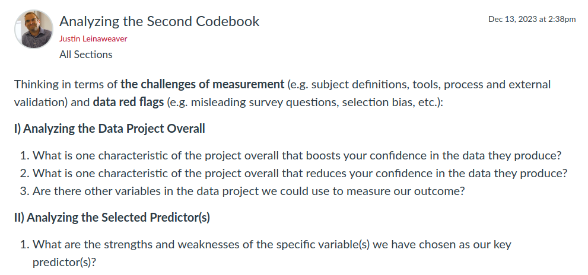

---
output:
  xaringan::moon_reader:
    css: ["default", "extra.css"]
    lib_dir: libs
    seal: false
    nature:
      highlightStyle: github
      highlightLines: true
      countIncrementalSlides: false
      ratio: '16:9'
---

```{r, echo = FALSE, warning = FALSE, message = FALSE}
##xaringan::inf_mr()
## For offline work: https://bookdown.org/yihui/rmarkdown/some-tips.html#working-offline
## Images not appearing? Put images folder inside the libs folder as that is the main data directory

library(tidyverse)
library(readxl)
library(stargazer)
##library(kableExtra)
##library(modelr)

knitr::opts_chunk$set(echo = FALSE,
                      eval = TRUE,
                      error = FALSE,
                      message = FALSE,
                      warning = FALSE,
                      comment = NA)
```

background-image: url('libs/Images/background-data_blue_v3.png')
background-size: 100%
background-position: center
class: middle, inverse

.size80[**Today's Agenda**]

<br>

.center[.size65[
Select the Predictor(s) for our Research Project
]]

<br>

.center[.size40[
  Justin Leinaweaver (Spring 2024)
]]

???

## Prep for Class
1. Data spreadsheet should already be on Canvas
    
    
    
    
---

background-image: url('libs/Images/background-blue_cubes_lighter3.png')
background-size: 100%
background-position: center
class: middle, center

.center[.size50[**A "Good" .textblue[Quantitative] Research Project Requires a "Good" Measure of the Outcome**]]

<br>

```{r, fig.retina = 3, fig.align = 'center', fig.width = 7, fig.height=1.7, out.width='95%'}
## Manual DAG
d1 <- tibble(
  x = c(-3, 3),
  y = c(1, 1),
  labels = c("Predictor", "State\nFragility")
)

ggplot(data = d1, aes(x = x, y = y)) +
  geom_point(size = 8) +
  theme_void() +
  coord_cartesian(xlim = c(-4, 4)) +
  geom_label(aes(label = labels), size = 7) +
  annotate("segment", x = -1.9, xend = 1.85, y = 1, yend = 1, arrow = arrow())
```

???

So far in this class we've selected the key variation we will try to explain

<br>

### What have we learned about state fragility from the Fragile States Index developed by the Fund for Peace?

### - What key elements made it into your reports?

- *Class leads discussion*

<br>

Our job for today is to select a predictor or set of related predictors that we will use to explain this outcome.

- These two pieces together will lead to our new and revised research question.

<br>

### What did we learn about research questions in week 2?

### - What do they have to do and how do we know if we have a good one?

- (**SLIDE**)


---

background-image: url('libs/Images/background-blue_cubes_lighter3.png')
background-size: 100%
background-class: center
class: middle

.size45[.content-box-white[**"Research Questions" (Huntington-Klein 2022)**]

<br>
]

.size55[**A research question:**

1. Can be answered, and

2. Improves our understanding of how the world works.
]

???

A good research question leads to an answer that will improve your understanding of how the world works.

<br>

In other words, it should inform theory in some way.
- Theory just means that there’s a *why* or a *because* lurking around somewhere.

- Theory explains why the relationships we see in the world are happening 

<br>

So, all academic projects in quantitative political science are framed as an answer to a research question.

- The question itself MUST be answerable with data and the answer must help us better understand the world (support or lead to revision of a theory).

<br>

### Make sense?

<br>

**SLIDE**: In week 2 we also discussed the criteria for a "good" research question


---

background-image: url('libs/Images/background-blue_cubes_lighter3.png')
background-size: 100%
background-class: center
class: middle

.center[.size45[.content-box-white[**"Research Questions" (Huntington-Klein 2022)**]

<br>

**How Do You Know if You’ve Got a Good One?**
]]

.pull-left[
.size40[
- Consider Potential Results

- Consider Feasibility

- Consider Scale
]]

.pull-right[
.size40[
- Consider Design

- Keep It Simple!
]]

???

### Questions on these criteria?

<br>

- **Consider Potential Results**: "If you can’t say something interesting about your potential results, that probably means your research question and your theory aren’t as closely linked as you think!"

- **Consider Feasibility**: "A research question should be a question that can be answered using the right data, if the right data is available. But is the right data available?"
    - You picked the data project first so this should be done!

- **Consider Scale**: "What kind of resources and time can you dedicate to answering the research question? ... Given the confines of, say, a term paper, you could take some wild swings at that question, but you’re likely to do a much more thorough job answering questions with a lot less complexity."

- **Consider Design**: "So, an important part of evaluating whether you have a workable research question is figuring out if there’s a reasonable research design you can use to answer it. Figuring out whether you do have a reasonable research design is the topic of the rest of this book."

- **Keep It Simple!**: "Answering any research question can be difficult. Don’t make it even harder on yourself by biting off more than you can chew!"


---

background-image: url('libs/Images/background-blue_cubes_lighter3.png')
background-size: 100%
background-position: center
class: middle

```{r, fig.retina = 3, fig.align = 'center', fig.width = 7, fig.height=1.7, out.width='95%', fig.align='center'}
## Manual DAG
ggplot(data = d1, aes(x = x, y = y)) +
  geom_point(size = 8) +
  theme_void() +
  coord_cartesian(xlim = c(-4, 4)) +
  geom_label(aes(label = labels), size = 7) +
  annotate("segment", x = -1.9, xend = 1.85, y = 1, yend = 1, arrow = arrow())
```

.pull-left[
.size40[
**Must:**

1. Be answerable, and

2. Improve our knowledge
]]

.pull-right[
.size35[
**Should:**
- Keep It Simple!
- Consider Potential Results
- Consider Feasibility
- Consider Design
- Consider Scale
]]

???

Ok, this is our aim, so...

<br>

Let's dig into the available data spreadsheet to choose our predictor(s) and refine our research question!

- Everybody take a few minutes on their own to choose a data project and refine our research question and then we'll share ideas.

<br>

*ON BOARD*


---

background-image: url('libs/Images/background-blue_triangles_flipped.png')
background-size: 100%
background-position: center
class: middle

```{r, echo = FALSE, fig.align = 'center', out.width = '100%'}

```

???

For Wednesday we need to analyze the new codebook!

<br>

### Questions on the assignment?


