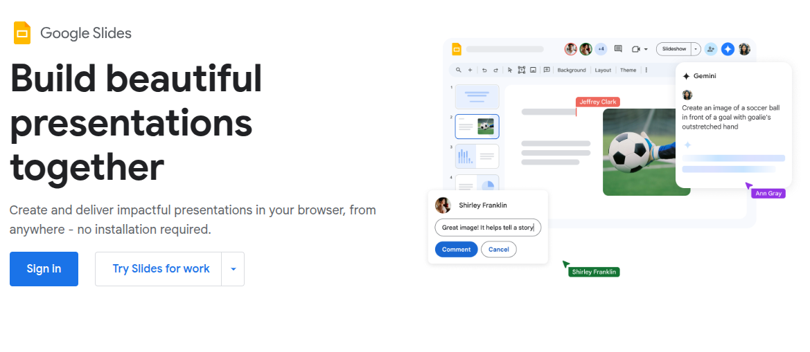

# Today's Agenda {background-image="Images/background-data_blue_v4.png"}

```{r}
#  background-size="1920px 1080px"
library(tidyverse)
library(readxl)
```

<br>

::: {.r-fit-text}

**Convert Report 1 into a presentation**

:::

<br>

<br>

::: r-stack
Justin Leinaweaver (Spring 2025)
:::

::: notes
Prep for Class

1. TBD

<br>

Draft report grades and feedback will be released today

- You'll have until March 7th to submit the final version of the paper

<br>

Today I want us to practice the exercise of converting a report into a presentation

- THIS is the way science often gets shared

- You complete a research paper and then you present your findings at an academic conference

- In interested scientists show up, ask tough questions and give you ideas to push the work further!

<br>

As I mentioned last class, I'm not a comms expert, I'm a data scientist

- This means I'm pretty good at building data visualizations but I do not mean to present myself as an expert at building beautiful presentations.

- Most of my work with slides is for teaching and since I teach up to 12 classes a week I err towards speed, functionality and clarity in my slides.

<br>

However, when I present research at an academic conference I make sure to invest a ton of time in prepping and revising those slides!

<br>

**SLIDE**: Let's use our readings for today to set us out on the right foot
:::


## Advice for Better Presentation Slides {background-image="Images/background-data_blue_v4.png" .center}

<br>

:::: {.columns}
::: {.column width='50%'}
Davis (2019) Consolidated

- One idea per slide

- Replace text with graphics

- Polish visualizations

- Apply the rule of thirds
:::
::: {.column width='50%'}
Naegle (2021) Consolidated

- One minute per slide

- Use informative headings

- Avoid cognitive overload
:::
::::

::: notes
Lots of very good, and overlapping, ideas across these two sources

- I really like how these two articles address what I often see as the biggest problems with slide presentations

- Too many words, not enough ideas, not enough pictures

<br>

**Any questions on the rules presented in these readings?**

<br>

**Notes**

[Davis list](https://www.sfmagazine.com/articles/2019/may/10-tips-to-improve-your-presentation-slides/)

1. Present one idea per slide
2. Change bulleted lists to graphical elements
3. Change bulleted lists to meaningful pictures
4. Use an original slide template
5. Modify default graph formats
6. Use pictures as your background
7. Use white space to improve readability
8. Resize, crop, and recolor pictures
9. Apply the rule of thirds
10. Eliminate unnecessary text

[Naegle List](https://www.ncbi.nlm.nih.gov/pmc/articles/PMC8638955/)

1. Rule 1: Include only one idea per slide
2. Rule 2: Spend only 1 minute per slide
3. Rule 3: Make use of your heading
4. Rule 4: Include only essential points
5. Rule 5: Give credit, where credit is due
6. Rule 6: Use graphics effectively
7. Rule 7: Design to avoid cognitive overload
8. Rule 8: Design the slide so that a distracted person gets the main takeaway
9. Rule 9: Iteratively improve slide design through practice
10. Rule 10: Design to mitigate the impact of technical disasters
:::


## {background-image="Images/background-data_blue_v4.png" .center}

::: {.r-fit-text}
**Build Your Presentation in Google Slides**
:::



::: notes

Alright, today I want each of you to design a simple presentation of your first research reports

- To be clear you are EACH designing your own presentation

- I am asking everyone to use Google Slides so we're all working from the same template and tools

- Before next class you will submit a link to your presentation on Canvas and then we'll review what you've made next class

<br>

**SLIDE**: Here's the layout I am requiring for the presentation

:::


## The Presentation Structure {background-image="Images/background-data_blue_v4.png" .center}

::: {.r-fit-text}
1. Title slide

2. The importance of the project (bullet points)

3. Uncertainty in the measures (strengths vs weaknesses)

4. Analyzing the current data

5. Analyzing the across time data

6. Conclusion (bullet points)
:::

::: notes

For this exercise I am limiting you to SIX slides. That's it!

- In essence, you are designing an adaptable presentation

- These six slides could be presented in 5-7 minutes OR 15 minutes

- Often you won't know precisely the time limit until you arrive at your panel!

<br>

**Any questions?**

- Go!

<br>

**Notes**

- Question: What do we learn about the world from analyzing the Press Freedom Index produced by Reporters Without Borders?

1. The importance of the project in the real-world,

2. The key contributors of uncertainty in the project's data,

3. What we learn about the current world from analyzing the most recently available data, and

4. What we learn about the trajectory of press freedom in the world from analyzing the data across time

:::

