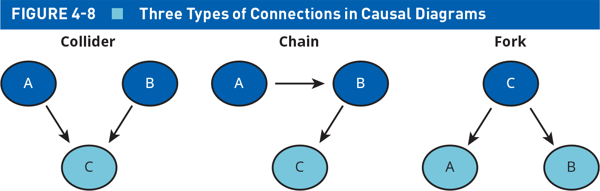
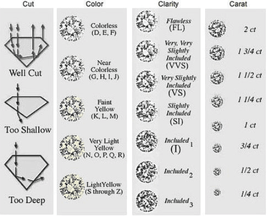
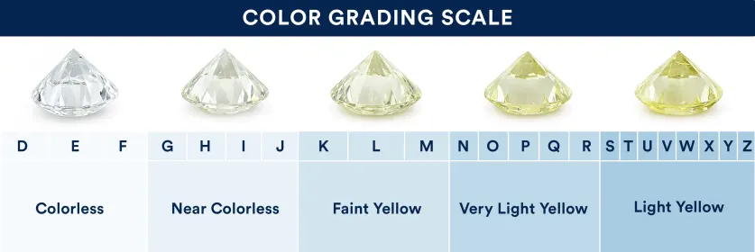
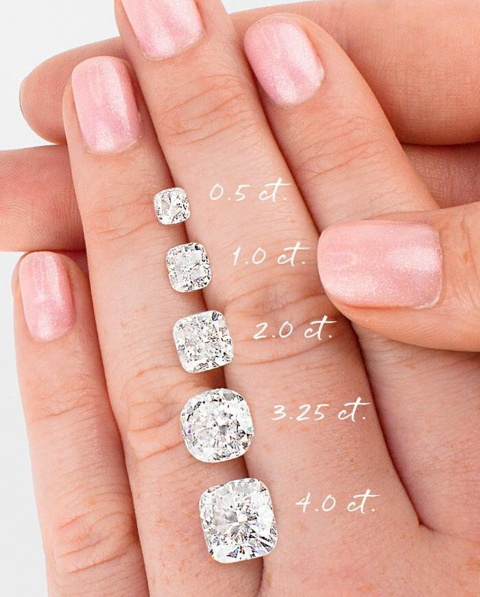

## Today's Agenda {background-image="Images/background-data_blue_v4.png" .center}

```{r}
library(tidyverse)
library(readxl)
library(kableExtra)

load(file = "../../DATA/2026-Spring/ANES/ANES2020_Data_Extract.RData")
```

<br>

::: {.r-fit-text}

**Introduction to Bivariate Analyses**

- Generating cross-tabs and group statistics

- Create a new R file: Bivariate_Descriptive_Stats.R

:::

<br>

::: r-stack
Justin Leinaweaver (Spring 2026)
:::

::: notes
Prep for Class

1. Review Canvas assignment submissions

<br>

Last class we did a crash course in the concepts we will need to perform useful bivariate analyses

- **SLIDE**: I want to keep emphasizing that bivariate builds on univariate analysis, ito doesn't replace it

:::


## {background-image="Images/background-data_blue_v4.png" .center}

**Univariate Analyses**

- Evaluating measures of the empirical world, AND 

- Using statistics to summarize or describe their distributions

<br>

**Bivariate Analyses**

- "...involves the analysis of two variables (often denoted as X, Y), for the purpose of determining the empirical relationship between them" (Babbie 2009).

::: notes

Until you have done a thorough univariate analysis, you should NOT be doing a bivariate analysis

<br>

**Remind me, why is it so crucial to begin every data project with univariate analysis?**

<br>

If the data isn't valid, reliable or showing actual variation then there's nothing to be done with it!

- Be DEEPLY suspicious of people with fancy stats who can't describe the data generating process!

- If you don't understand the measurement then you shouldn't be interpreting it

<br>

One of the big problems with "AI" automatic data analysis

- Like handing a gun to a toddler...

<br>

**SLIDE**: Our other big point of emphasis last class focused on DAGs

:::


## Directed Acycylic Graphs (DAGs) {background-image="Images/background-data_blue_v4.png" .center}

<br>



::: notes

These directed acyclic graphs give us a technique for making and evaluating causal arguments

- As we develop these arguments we will often brainstorm possibly related variables

- These "types" of connection can help us clarify those relationships

<br>

**Any questions on what we covered last class?**

- e.g. chains, colliders and forks?

    - Collider: two IVs independently influence a single DV without being directly related
    - Chain: A chain is a linear sequence where one variable affects another
    - Fork: Fork occurs when a shared cause influences two separate variables that are not directly connected

- e.g. probabilistic vs deterministic models

- e.g. inductive vs deductive reasoning

<br>

**SLIDE**: Today we introduce the tools you'll need for bivariate descriptive statistics

:::


## {background-image="Images/background-data_blue_v4.png"}

::: {.r-fit-text}
**Bivariate Analyses: Descriptive Statistics**
:::

<br>

Add the following to your notes:

```{r, echo=TRUE}
# Bivariate Descriptive Statistics

# Categorical x Categorical
# Cross-tabs: table(), proportions(margin = 2)

# Interval x Categorical
# Group statistics: aggregate() with summary()

# Load the tidyverse for practice data
library(tidyverse)
```

::: notes

*Read the slide*

- Categorical is an umbrella term for both nominal and ordinal variables

<br>

Only differences from univariate analysis:

1. We need the "margin" argument in proportions()

2. We'll use the aggregate function with the summary stats

<br>

**SLIDE**: To introduce these bivariate tools we'll start with built-in data

:::


## {background-image="Images/background-data_blue_v4.png" .center}

### **What explains why some diamonds are more expensive than others?**

<br>

```{r, echo=TRUE}
diamonds
```

::: notes

We will introduce the bivariate tools as means for analyzing relationships.

- That means we need a question to answer and an outcome to explain!

- So, what explains the variation in the prices of diamonds?

<br>

The `diamonds` dataset includes the prices and other characteristics of nearly 54,000 diamonds

- If you've loaded the tidyverse you should have access to the diamonds data

- Everybody make sure!

<br>

Here we see that `price` is an interval variable

- **SLIDE**: To give us extra options for bivariate analysis let's make an ordinal version of the `price` variable

:::


## {background-image="Images/background-data_blue_v4.png" .center}

### Create an ordinal version of price

```{r, echo=TRUE}
summary(diamonds$price)
```

<br>

```{r, echo=TRUE}
diamonds$price2 <- cut(diamonds$price,
    breaks = c(0, 950, 2401, 5324, 19000),
    labels = c("25th", "50th", "75th", "100th"))

# Check the new variable
table(diamonds$price2)
```

::: notes

Here I am using the summary function to identify the quartiles in diamond prices

- Everybody create the new variable and make sure it worked.

<br>

**SLIDE**: Now we have two versions of the outcome to play with

:::


## {background-image="Images/background-data_blue_v4.png" .center}

### **What explains why some diamonds are more expensive than others?**

:::: {.columns}
::: {.column width="50%"}
```{r, fig.asp=1, fig.width=6}
ggplot(diamonds, aes(x = price)) +
  geom_histogram(color = "black", fill = "darkgrey", bins = 15) +
  theme_bw() +
  labs(x = "Prices ($)", y = "Count") +
  scale_x_continuous(labels = scales::dollar_format(scale = 1/1000, suffix = "k"))
```
:::

::: {.column width="50%"}
```{r, fig.asp=1, fig.width=6}
ggplot(diamonds, aes(x = price2)) +
  geom_bar(fill = "darkgrey", width = .6) +
  theme_bw() +
  labs(x = "Diamond Prices in Quantiles", y = "Count")
```
:::
::::

::: notes

Here I've just made a quick univariate visualization of the two versions of the outcome variable

<br>

We'll use the interval version of price to allow us to develop a precise model of specific value

- To the dollar!

<br>

We'll use the ordinal version to examine broader trends in the data

- e.g. what characteristics broadly determine the value of a diamond?

- Useful because it means the outliers don't move the analysis as much

- Dangerous because we're throwing away data and pretending that all of the outliers fit in one box is a BIG assumption

<br>

**SLIDE**: Let's talk diamond value

:::


## {background-image="Images/background-data_blue_v4.png" .center}

### **What explains why some diamonds are more expensive than others?**

{style="display: block; margin: 0 auto"}

::: notes 

And here we have the four C's of diamond value

- Diamonds are evaluated per their cut, color, clarity and carats (or weight)

<br>

Let's start by building a model using the `cut` variable

- Diamonds can be classified by the quality of their cuts running from fair to ideal (5 levels)

- Lesser cuts will either be too shallow or too deep to sparkle really well

<br>

**SLIDE**: `Cut` is an ordinal variable and we'll start by using that to explain our ordinal variable version of price

:::


## {background-image="Images/background-data_blue_v4.png" .center}

**Bivariate Analyses: Categorical x Categorical**

```{r, echo=TRUE}
# Cross-tabs
table(diamonds$price2, diamonds$cut)
```

<br>

```{r, echo=TRUE}
# Cross-tabs (overall %s)
proportions(table(diamonds$price2, diamonds$cut))
```

::: notes

As always, the variable type determines the tool you want to use

- So, when summarizing the relationship between two categorical variables we stick with our old friends table and proportions

- A table with two variables is called a cross-tab

<br>

Adding a second variable to the table function is quite simple, it is just a comma separated list

- The first variable defines the rows and the second the columns

- As the textbook makes clear, your levels of the outcome variable should be on the rows, predictor levels are the columns

- If you convert the table to proportions then what you get is each cell of the table divided by the total number of observations

<br>

**Did everybody get these results?**

<br>

Reading the count table is quite easy to understand

- *Read across the 25th percentile of diamonds: 88 received a "fair" cut, 1,057 a "good" cut, etc*

- **Is that what you'd expect to see if the quality of the cut impacts the price of a diamond?**

- (Nope! Shouldn't this be backwards with cheap diamonds in the fair cut category???)

<br>

To read the proportion table just remember that each % is out of the whole sample

- Top-left: Almost none of the diamonds in the dataset are in the cheapest quartile with a "fair" cut

- Bottom-right corner: 9% of ALL the diamonds in the dataset are "ideal" cut and in the most expensive quartile

- **Make sense?**

<br>

**SLIDE**: We need one more tweak if we want to analyze this relationship using a cross-tab

:::


## {background-image="Images/background-data_blue_v4.png" .center}

**Bivariate Analyses: Categorical x Categorical**

```{r, echo=TRUE}
# Cross-tabs
table(diamonds$price2, diamonds$cut)
```

<br>

```{r, echo=TRUE}
# Cross-tabs (overall %s)
proportions(table(diamonds$price2, diamonds$cut), margin = 2)
```

::: notes

Per Rule 3 in the textbook we need to calculate the proprtions separately for each level of the predictor variable, NOT overall

- The margin argument let's you specify proportions by row or column

- We're using "2" which means by column

- We can tell that worked because if you add each column separately they will sum to 100%

- For all of our work testing hypotheses you will always use margin = 2 (assuming the DV levels are the rows)

<br>

This means you can think about each column as representing how diamonds of that cut quality are distributed through the levels of price

- 65% of fair cut diamonds are in the top 50% of prices!

- 58% of ideal cut diamonds are in the bottom half of prices!

<br>

What stands out to me in this data is that there doesn't appear to be a positive relationship here

- Arguably it may be a little negative!

- Looking across the levels of cut I see fairly similar distributions of prices

- This makes it look like diamond sellers can offer you each cut type at all price points!

<br>

**Questions on making these tables or interpreting the results?**

<br>

**SLIDE**: Let's practice

:::


## {background-image="Images/background-data_blue_v4.png" .center}

### **What explains why some diamonds are more expensive than others?**

<br>

{style="display: block; margin: 0 auto"}

::: notes 

Everybody build a cross-tab of diamond prices and color

- Let's see if colorless diamonds consistently carry larger price tags

- Go!

<br>

(**SLIDE**)

:::


## {background-image="Images/background-data_blue_v4.png" .center}

**Bivariate Analyses: Categorical x Categorical**

```{r, echo=TRUE}
# Cross-tabs
table(diamonds$price2, diamonds$color)
```

<br>

```{r, echo=TRUE}
# Cross-tabs (overall %s)
proportions(table(diamonds$price2, diamonds$color), margin = 2)
```

::: notes

**So, is color a better predictor of value? Why or why not?**

<br>

Nope!

- Again, plenty of colorless (D-F) in the cheap diamonds and plenty of near colorless in the expensive ones!

<br>

It's starting to look like the four Cs are nonsense...

<br>

**Questions on making or interpreting the cross-tabs?**

<br>

**SLIDE**: Cat x Interval

:::


## {background-image="Images/background-data_blue_v4.png" .center}

**Bivariate Analyses: Numeric x Categorical**

<br>

aggregate(data, y ~ x, FUN)

- "data" is the dataset

- "y" is the interval outcome

- "x" is a nominal or ordinal predictor

- "FUN" is the descriptive statistic you want to calculate

::: notes

Now let's shift to bivariate analysis of the relationship between a single categorical and a single numeric variable.

- For this we'll need a new function: aggregate()

<br>

The aggregate function looks a little different from what we've done so far

- The "data" argument you've seen before

- The "y tilde x" argument is what R refers to as a formula

    - "y" is the NUMERIC outcome you are trying to summarize

    - "x" is the CATEGORICAL predictor
    
- FUN is the argument where you specify a function to apply to the Y variable

    - e.g. summary, sd, mean, median, min, max, etc
    
<br>    

**SLIDE**: Example
:::


## {background-image="Images/background-data_blue_v4.png" .center}

::: {.r-fit-text}
**Bivariate Analyses: Numeric x Categorical**
:::

```{r, echo=TRUE}
aggregate(data = diamonds, price ~ cut, FUN = mean)

aggregate(data = diamonds, price ~ cut, FUN = median)
```

::: notes

Let's recheck our analysis of the cut variable but now focusing on the real price variable

- Here I am calculating the group means and the group medians

- **Handy, right?**

<br>

**Does this confirm our findings from the cross-tabs?**

- **Is the cut of a diamond a good predictor of its price?**

<br>

**SLIDE**: Maybe the mean and median are the wrong comparison!

:::


## {background-image="Images/background-data_blue_v4.png" .center .smaller}

::: {.r-fit-text}
**Bivariate Analyses: Numeric x Categorical**
:::

<br>

```{r}
options(width = 110)
```

```{r, echo=TRUE}
aggregate(data = diamonds, price ~ cut, FUN = summary)
```

::: {.fragment}
```{r, echo=TRUE}
aggregate(data = diamonds, price ~ color, FUN = summary)
```
:::

::: notes

**What do we learn about the effect of improving the cut of a diamond on its price?**

- Min and max basically the same for all cuts!

- Middle values either go DOWN with better cuts or stay fairly stable

<br>

Everybody check and see if our results about color are also confirmed this way?

- (**REVEAL**)

- Again, prices go UP as the color quality gets WORSE!

<br>

**SLIDE**: One more thing to check

:::


## {background-image="Images/background-data_blue_v4.png" .center}

### **What explains why some diamonds are more expensive than others?**

:::: {.columns}
::: {.column width="40%"}

:::

::: {.column width="60%"}

<br>

<br>

1. Convert carat into an ordinal variable (quartiles)

2. Check the effect on price using aggregate
:::
::::

::: notes

So, it looks like three of the four C's don't actually matter consistently (cut, clarity and color)

- That just leaves carats otherwise known as the size of the diamonds

- Everybody convert carat into an ordinal variable (quartiles) and then use aggregate to check if it predicts prices!

<br>

(**SLIDE**)

:::


## {background-image="Images/background-data_blue_v4.png" .center .smaller}

### **What explains why some diamonds are more expensive than others?**

<br>

```{r, echo=TRUE}
# Set-up the variables
summary(diamonds$carat)

diamonds$carat_cat <- cut(diamonds$carat, 
        breaks = c(0, .4, .7, 1.04, 6),
        labels = c("25th", "50th", "75th", "100th"))
```

<br>

```{r, echo=TRUE}
# Bivariate analysis
aggregate(data = diamonds, price ~ carat_cat, FUN = summary)
```

::: notes

**Conclusions?**

<br>

I think diamond sales might be a little scammy!

- The size of the diamond determines the value and the other three Cs are for marketing purposes

- BOOOOOOOOOOOO!

- But also, yay data!

<br>

**SLIDE**: Assignment for next class

:::


## For Next Class {background-image="Images/background-data_blue_v4.png" .center .smaller}

<br>

**Analyze our Additive Index of Americans' Political Engagement (ANES)**

:::: {.columns}

::: {.column width="50%"}
**Required Steps**

1. Choose a predictor

2. Propose a theory

3. Test your hypothesis

4. Explain your findings!
:::

::: {.column width="50%"}
**Predictor Options**

- party identification
- relig.how.often
- social.class
- trust.media
- respondent's marital status
- active.duty.mil
- allow.refugees
- divided.govt
:::

::::

::: notes

Everybody take a look at the assignment on Canvas

- **Questions on the assignment?**

<br>

Let's divy out the options so we get good coverage across the class!

- **Which ones do you want to do?**

<br>

Canvas ASSIGNMENT: Practicing Bivariate Descriptive Statistics

Last week we constructed and analyzed an additive index using ANES data that represents Americans' political engagement (political activities in the prio 12 months). I want you to perform a bivariate analysis that helps us understand the variation in this index across ONE of the predictors on the following list:

- party identification (partyid3)
- self reported social class (social.class)
- relig.how.often (5 point scale)
- social.class (4 point scale)
- trust.media (5 point scale)
- respondent's marital status (marital) 6 point scale
- active.duty.mil (3 point scale)
- allow.refugees (7 point)
- divided.govt (3 points)

I want you to do the following steps IN ORDER:

1. Propose a theory AND an associated hypothesis for how this predictor causes changes in our political engagement index as the outcome (e.g. increases or decreases). You must complete this step BEFORE analyzing the data
2. Run the analysis to test the relationship using bivariate descriptive statistics and report the results as a polished table
3. Explain what you have learned from this analysis. Is your theory supported by the data? Why or why not?

Please bear in mind that finding your theory is unsupported is as GOOD an outcome as finding it is supported. Our aim is to to generate knowledge and evaluate our theories, NOT to confirm our intuitions are correct!

:::


