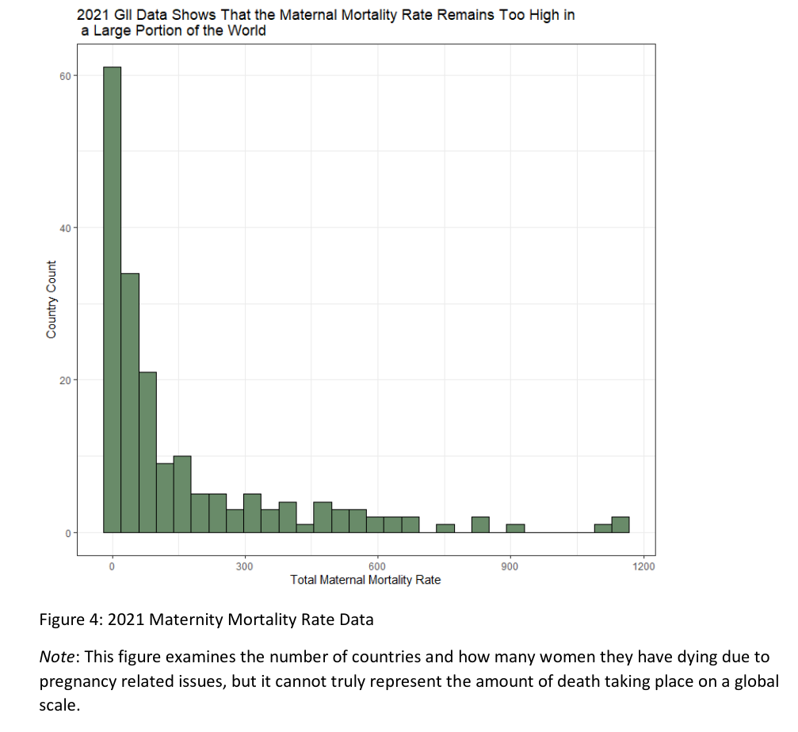
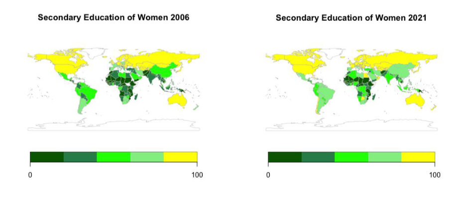
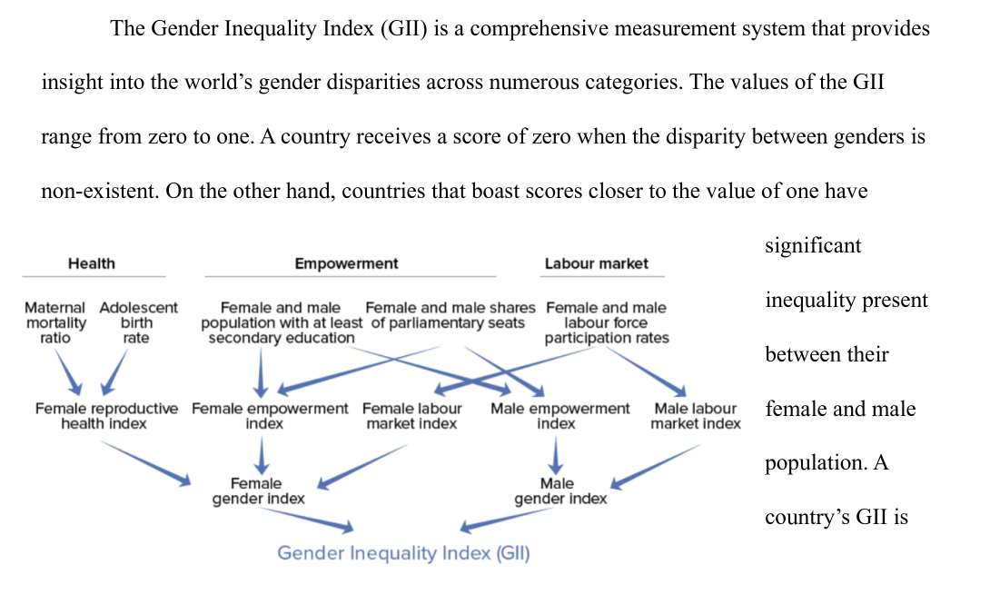
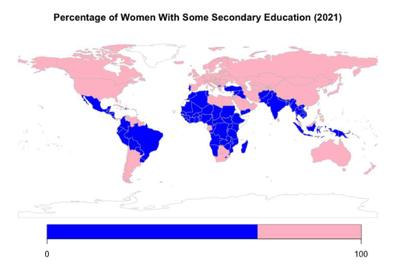
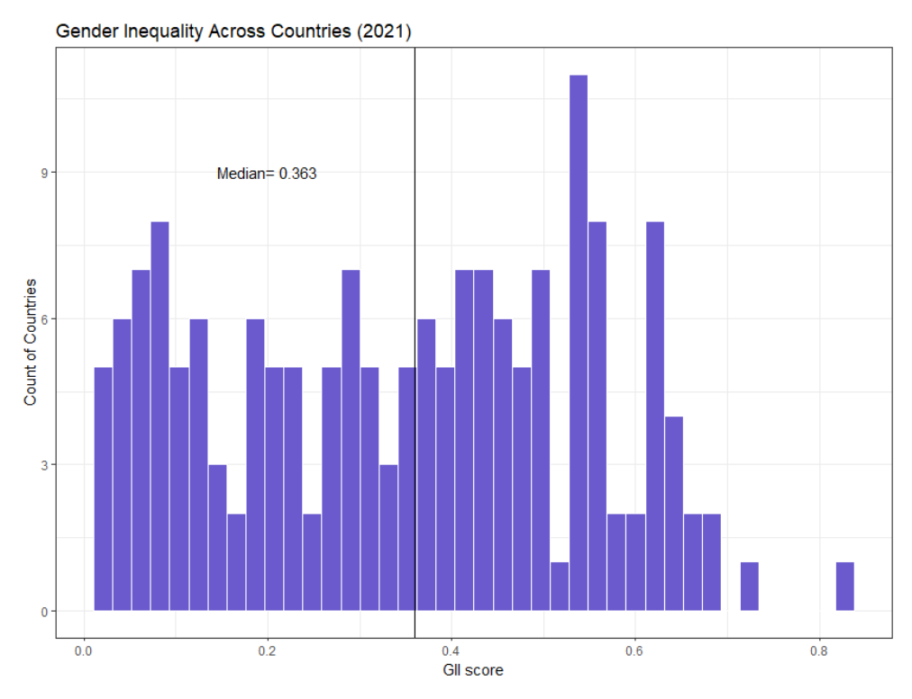
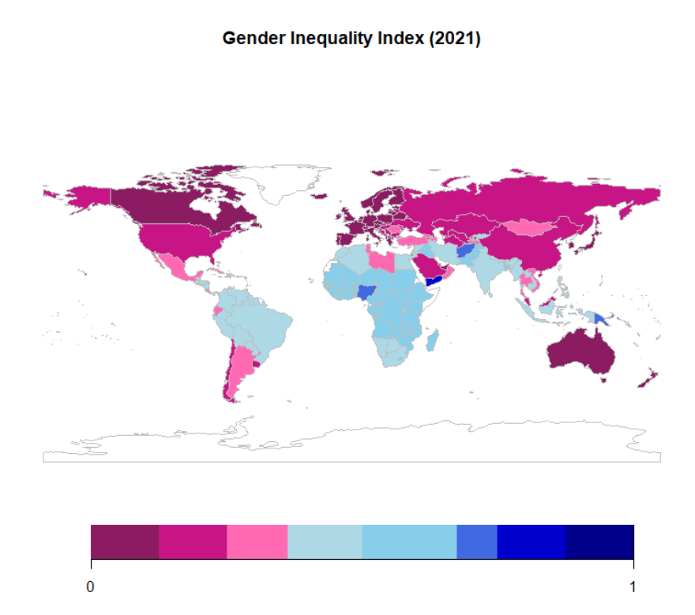
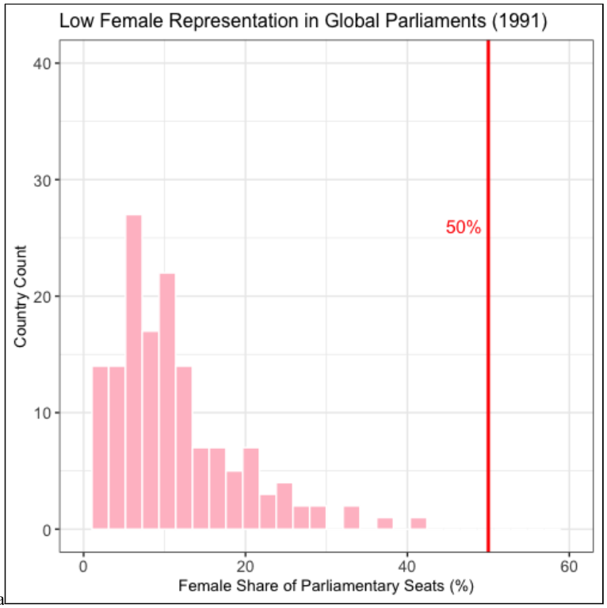
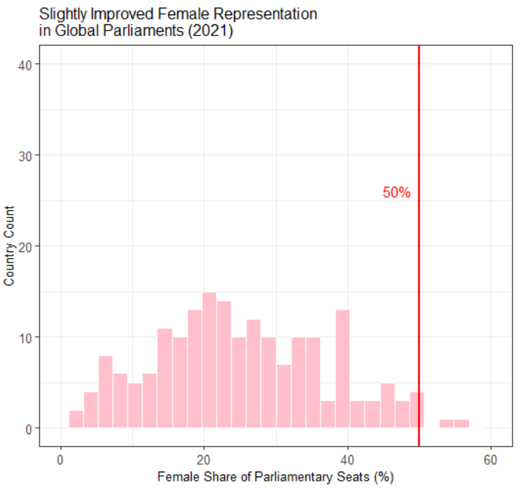

---
output:
  xaringan::moon_reader:
    css: ["default", "extra.css"]
    lib_dir: libs
    seal: false
    nature:
      highlightStyle: github
      highlightLines: true
      countIncrementalSlides: false
      ratio: '16:9'
---

```{r, echo = FALSE, warning = FALSE, message = FALSE}
##xaringan::inf_mr()
## For offline work: https://bookdown.org/yihui/rmarkdown/some-tips.html#working-offline
## Images not appearing? Put images folder inside the libs folder as that is the main data directory

library(tidyverse)
library(readxl)
library(stargazer)
##library(kableExtra)
##library(modelr)

knitr::opts_chunk$set(echo = FALSE,
                      eval = TRUE,
                      error = FALSE,
                      message = FALSE,
                      warning = FALSE,
                      comment = NA)
```

background-image: url('libs/Images/background-data_blue_v3.png')
background-size: 100%
background-position: center
class: middle, inverse

.size80[**Today's Agenda**]

<br>

.center[.size65[
Critically Analyze the Research Design of Data Project 2
]]

<br>

.center[.size40[
  Justin Leinaweaver (Spring 2024)
]]

???

## Prep for Class
1. ?

<br>

**SLIDE**: Let's start off today with highlights from your first reports!


---

background-image: url('libs/Images/background-blue_triangles2.png')
background-size: 100%
background-position: center
class: middle

```{r, echo = FALSE, fig.align = 'center', out.width = '60%'}

```

???

Claire's figures had excellent titles AND really good captions!

- I would just suggest also adding the data source information to the caption.

<br>

Anyone should be able to get something of value from just skimming the figures in your report.


---

background-image: url('libs/Images/background-blue_triangles2.png')
background-size: 100%
background-position: center
class: middle

```{r, echo = FALSE, fig.align = 'center', out.width = '95%'}

```

???

Cooper did a really nice job putting related figures side-by-side in the report.

- Scale is the same for both!

- Super helpful for the reader to make comparisons!


---

background-image: url('libs/Images/background-blue_triangles2.png')
background-size: 100%
background-position: center
class: middle

```{r, echo = FALSE, fig.align = 'center', out.width = '90%'}

```

???

I really liked how JC included the GII index figure from the UN site.

- This helped illustrate and support the arguments in both Sections 1 and 2

<br>

ASIDE: Please don't use text wrapping

- Publishers use it primarily when printing is a problem or pages are limited.

- For us, it just makes it harder to read the text.

<br>

**SLIDE**: Let's look at some excellent benchmarking!


---

background-image: url('libs/Images/background-blue_triangles2.png')
background-size: 100%
background-position: center
class: middle

```{r, echo = FALSE, fig.align = 'center', out.width = '75%'}

```

???

Keeley does a great job organizing her map around a really smart benchmark!

- She calculated the average secondary ed rate for men (67%) and used that as a baseline of comparison for the map of female education.

- This map gives us a super accessible way to see where in the world women are being educated at the same proportion as men.


---

background-image: url('libs/Images/background-blue_triangles2.png')
background-size: 100%
background-position: center
class: middle

.pull-left[
```{r, echo = FALSE, fig.align = 'center', out.width = '95%'}

```
]

.pull-right[
```{r, echo = FALSE, fig.align = 'center', out.width = '95%'}

```
]

???

Savanah connects her two plots of the same variable using a shared benchmark!

- The median GII is added to the histogram AND the colors are split at that level too!

- These reinforcing elements of the visualizations are awesome!


---

background-image: url('libs/Images/background-blue_triangles2.png')
background-size: 100%
background-position: center
class: middle

.pull-left[
```{r, echo = FALSE, fig.align = 'center', out.width = '95%'}

```
]

.pull-right[
```{r, echo = FALSE, fig.align = 'center', out.width = '95%'}

```
]

???

Hailey does this same exercise but across time.

- My apologies that the two are not the same dimensions, I had to take screenshots.

<br>

Hailey established and explained a benchmark in her report (50%) and now we can watch the distribution shift towards the benchmark across time.

- How cool is that!?!

<br>

I also want to say that Hailey produced the strongest arguments in the class for Sections 1 and 2.

- Really nicely done.

### Great work all! Any questions before we shift to our new data?

<br>


**SLIDE**: Our developing research project...


---

background-image: url('libs/Images/background-blue_triangles2.png')
background-size: 100%
background-position: center
class: middle, center

.size60[**Do country economic priorities explain variations in gender inequality?**]

<br>

```{r, fig.retina = 3, fig.align = 'center', fig.width = 7, fig.height=1.7, out.width='95%'}
## Manual DAG
d1 <- tibble(
  x = c(-3, 3),
  y = c(1, 1),
  labels = c("Government\n Expenditures", "Gender\n Inequality\n (GII)")
)

ggplot(data = d1, aes(x = x, y = y)) +
  geom_point(size = 8) +
  theme_void() +
  coord_cartesian(xlim = c(-4, 4)) +
  geom_label(aes(label = labels), size = 7) +
  annotate("segment", x = -1.9, xend = 1.85, y = 1, yend = 1, arrow = arrow())
```

???

I think this is coming along nicely!

<br>

**SLIDE**: Before we can test this relationship we need to go deep on our three chosen measures of government expenditures.


---

background-image: url('libs/Images/background-blue_triangles2.png')
background-size: 100%
background-class: center
class: middle

.size50[**Report 2: Analyzing our Predictor Variable(s)**]

.size50[
1. What is it and why is this project important?

2. How confident should we be in the methodology?

3. What do the measures currently show us?

4. How are these measures changing across time?
]

???

After Spring Break we write our second report.

- A focused univariate analysis of the predictor data set.

<br>

Our work today and Friday should help you make progress on the first two sections of the report.


---

background-image: url('libs/Images/background-blue_cubes_lighter3.png')
background-size: 100%
background-position: center
class: middle

.pull-left[
.size40[
**The Measures**

1. Military expenditure<sup>*</sup>

2. Current health expenditure<sup>*</sup>

3. Government expenditure on education, total<sup>*</sup>
]

.size25[<sup>*</sup> as a % of GDP]
]

.pull-right[
.size40[
**Analyze the Methodology:**
- Source of the Data

- Operationalization

- Measurement Process

- Data Validation
]]


???

Here's our job for today.

<br>

Let's refresh our memories on all four evaluation steps

### What does it mean to evaluate the source of the data?

### What does it mean to evaluate the operationalization of the concept?
- e.g. how a conceptual definition is turned into a measurement tool

### What does it mean to evaluate the measurement process?
- e.g. how is the tool applied?
- Is it 'valid'?
- Is it 'reliable'?

### What does it mean to evaluate the data validation?
- e.g. Any evidence of testing their measurements for robustness against other data sets or standards?


---

background-image: url('libs/Images/background-blue_cubes_lighter3.png')
background-size: 100%
background-position: center
class: middle

.pull-left[
.size40[
**The Measures**

1. Military expenditure<sup>*</sup>

2. Current health expenditure<sup>*</sup>

3. Government expenditure on education, total<sup>*</sup>
]

.size25[<sup>*</sup> as a % of GDP]
]

.pull-right[
.size40[
.content-box-white[**Pros and Cons for Each:**]
- Source of the Data

- Operationalization

- Measurement Process

- Data Validation
]]

???

*Split class into three groups, one per measure*

Groups, take 20 minutes to evaluate your measure across these four areas.

- Build us a pros and cons list for each item ON THE BOARD!

<br>

*Report back and discuss*


---

background-image: url('libs/Images/background-blue_cubes_lighter3.png')
background-size: 100%
background-position: center
class: middle

.size55[**For Next Class**]

.size45[
1. Wheelan (2014) chapter 3 "Deceptive Description"

2. **Submit to Canvas before class**: 

Start exploring the dataset in Excel and find us something interesting/puzzling/surprising or simply something you learned
]

???


