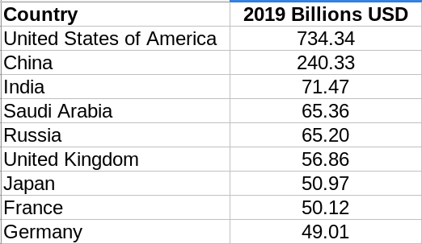
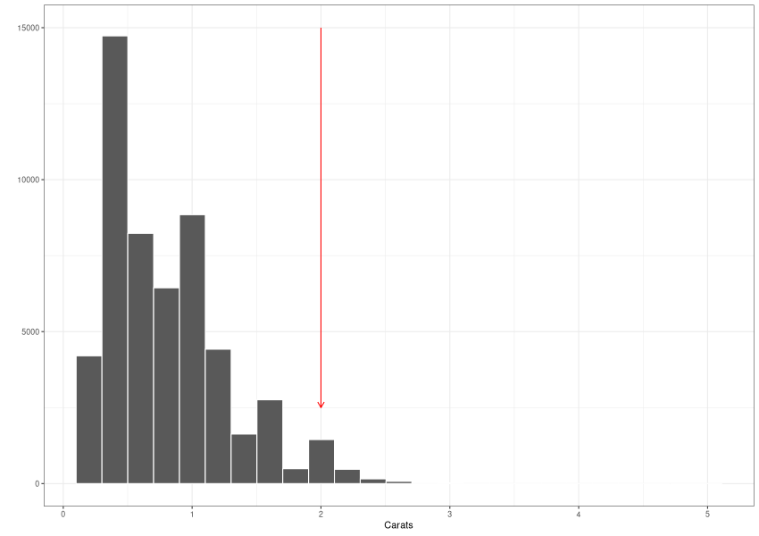
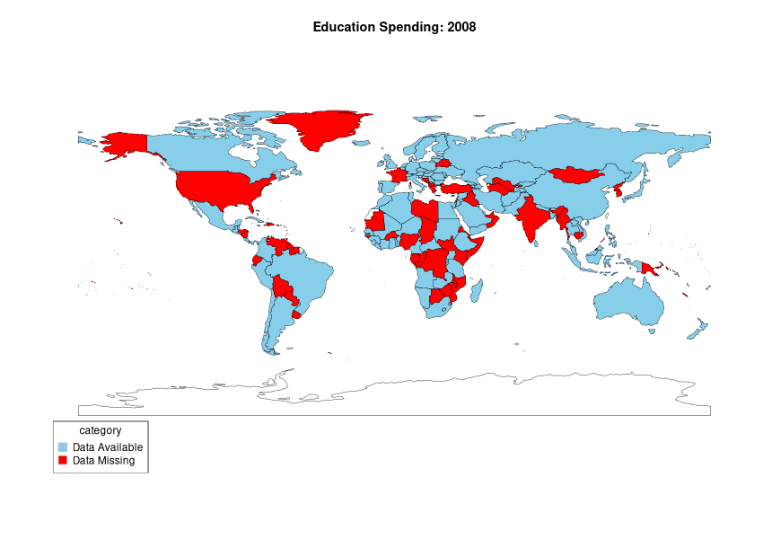

---
output:
  xaringan::moon_reader:
    css: ["default", "extra.css"]
    lib_dir: libs
    seal: false
    nature:
      highlightStyle: github
      highlightLines: true
      countIncrementalSlides: false
      ratio: '16:9'
---

```{r, echo = FALSE, warning = FALSE, message = FALSE}
##xaringan::inf_mr()
## For offline work: https://bookdown.org/yihui/rmarkdown/some-tips.html#working-offline
## Images not appearing? Put images folder inside the libs folder as that is the main data directory

library(tidyverse)
library(readxl)
#library(stargazer)
library(kableExtra)
##library(modelr)

knitr::opts_chunk$set(echo = FALSE,
                      eval = TRUE,
                      error = FALSE,
                      message = FALSE,
                      warning = FALSE,
                      comment = NA)
```

background-image: url('libs/Images/background-blue_cubes_lighter3.png')
background-size: 100%
background-position: center

.size80[**Today's Agenda**]

.size50[
1. Clarify the basic data structure

2. Report your early findings

3. Audit the data
]

<br>

.center[.size40[
  Justin Leinaweaver (Spring 2024)
]]

???

## Prep for Class
1. 


---

background-image: url('libs/Images/background-blue_triangles2.png')
background-size: 100%
background-position: center
class: middle, center

.size55[**Exploratory Analysis: What did you find?**]

.size30[
```{r}
d <- read_excel("../Project-SP23/PREDICTOR-Government_Spending/Project_Predictors-WDI-2008_2020.xlsx", na = "NA")

set.seed(243)
d |>
  filter(year == 2019) |>
  slice_sample(n = 10) |>
  kbl(digits = 2)
```
]

???

Let's explore the data (CAREFULLY) in Excel.

### 1. How are the observations organized?

<br>

### 2. Do we understand all of the measures here and can we connect them back to the codebook?

### - What does it mean for us that all three measures are a "% of GDP" instead of absolute spending?

<br>

**SLIDE**: Let's think about the military measure for a sec.


---

background-image: url('libs/Images/background-blue_triangles2.png')
background-size: 100%
background-position: center
class: middle, center

.pull-left[
.size30[
```{r}
d |> 
  filter(year == 2019) |> 
  arrange(desc(military)) |> 
  select(year:military) |>
  select(-country_code) |>
  slice_head(n = 10) |>
  mutate(
    Rank = 1:10
  ) |>
  select(Rank, everything()) |>
  kbl(digits = 2)
```
]]

.pull-right[

<br>

.size50[**SIPRI Data**]

```{r, echo = FALSE, fig.align = 'center', out.width = '100%'}

```
]

???

On the left are the top ten military spenders in our data (% of GDP).

On the right is the current table from SPIRI focused on total actual spending.

### What are the pros and cons of using % of GDP for our project?


---

background-image: url('libs/Images/background-blue_triangles2.png')
background-size: 100%
background-position: center
class: middle, center

.size55[**Exploratory Analysis: What did you find?**]

.size30[
```{r}
d <- read_excel("../Project-SP23/PREDICTOR-Government_Spending/Project_Predictors-WDI-2008_2020.xlsx", na = "NA")

set.seed(243)
d |>
  filter(year == 2019) |>
  slice_sample(n = 10) |>
  kbl(digits = 2)
```
]

???

### 3. What did you find from your pre-class explorations?

- *Share interesting/puzzling/surprising findings*

- *ON BOARD*


---

background-image: url('libs/Images/background-blue_triangles2.png')
background-size: 100%
background-position: center
class: middle, center

.size70[**Audit the Data: Missing Data**]

.size60[
1) How much missing data per variable? (overall)
]

???

Let's import the data into RStudio and start auditing!

<br>

The first big thing we need to grapple with here is the missing data problem.

- So, let's try to pinpoint how big the problem is.

### How can we do this?

- (**SLIDE**)


---

class: middle

.code130[
```{r, echo=TRUE, eval=FALSE}
# 1. How much missing data per variable (overall)?
summary(d$military)
summary(d$health)
summary(d$education)
```
]

<br>

.size35[
```{r}
d |>
  pivot_longer(cols = military:education, names_to = "Vars", values_to = "Values") |>
  group_by(Vars) |>
  summarize(
    Missing = sum(is.na(Values)),
    N = n(),
    Prop = Missing/N
  ) |>
  kbl(digits = 2, align = c('l', 'c', 'c', 'c'))
```
]

???

### Lessons from this? Cautions for us as we go forward?

- Looks like we may have a serious problem across all three measures!

- Missing between 1 in 5 and 1 in 3 countries is a ton.

<br>

Let's try to figure out how big a problem this will be.


---

background-image: url('libs/Images/background-blue_triangles2.png')
background-size: 100%
background-position: center
class: middle, center

.size70[**Audit the Data: Missing Data**]

.size60[
2) How much missing data per variable-year? 

(Check 2008, 2014 and 2020)
]

???

### How can we check this?

- (Filter and summarize!)


---

class: middle

.size35[
```{r}
table1 <- d |>
  filter(year %in% c(2008, 2014, 2020)) |>
  pivot_longer(cols = military:education, names_to = "Vars", values_to = "Values") |>
  group_by(Vars, year) |>
  summarize(
    Missing = sum(is.na(Values)),
    N = n(),
    Prop = Missing/N
  )

table1 |>
  filter(Vars == "education") |>
  kbl(digits = 2, align = c('l', 'c', 'c', 'c'))
```

<br>

.pull-left[
```{r}
table1 |>
  filter(Vars == "health") |>
  kbl(digits = 2, align = c('l', 'c', 'c', 'c'))
```
]

.pull-right[
```{r}
table1 |>
  filter(Vars == "military") |>
  kbl(digits = 2, align = c('l', 'c', 'c', 'c'))
```
]
]

???

### Lessons from this?

<br>

(**SLIDE**: Line plot of all years)


---

class: middle

```{r, fig.retina=3, fig.align='center', fig.asp=.618, fig.width=7, out.width='90%'}
d |>
  pivot_longer(cols = military:education, names_to = "Vars", values_to = "Values") |>
  group_by(Vars, year) |>
  summarize(
    Missing = sum(is.na(Values)),
    N = n(),
    Prop = Missing/N
  ) |>
  ggplot(aes(x = year, y = Prop, color = Vars)) +
  geom_point() +
  geom_line() +
  theme_bw() +
  scale_y_continuous(labels = scales::percent_format()) +
  labs(x = "", y = "Missing Data") +
  scale_x_continuous(breaks = 2008:2020)
```

???

### Lessons from this? Cautions for us as we go forward?

<br>

Clearly we have some missing data problems here, but...

- Almost all the missing data in health is in 2020 (reporting cycle incomplete)

- Education reporting coverage appears to be getting better over time (except 2020)

- Military looks like the biggest problem here.

<br>

Our next job is to check and see if there are regional patterns in the missing data

- It is preferable for us if our missing data is randomly spread around the world than if it is all in one region or area.

<br>

It looks like we may have a problem in military and education spending.

- **SLIDE**: Let's investigate these two variables for regional patterns in the missing data!


---

background-image: url('libs/Images/background-blue_triangles2.png')
background-size: 100%
background-position: center
class: middle

.center[.size55[**Audit the Data: Missing Data**]]

.size50[
Let's make maps of the military variable and highlight the missing countries
- Include: missingCountryCol = "purple"
]

```{r}
d |>
  slice_head(n = 5) |>
  kbl(digits = 2, align = c('c', 'l', 'c', 'c', 'c', 'c')) |>
  column_spec(3, background = "yellow")
```

???

*Assign a different year to each student (2008:2020)*

- Use rworldmap

- Join using ISO3 and the variable is country_code

<br>

Go see everybody's maps and let's see if we have any regional concerns in military spending!

<br>

```{r, echo=TRUE, eval=FALSE}
# Build a map of missing data
library(rworldmap)

d_2008 <- filter(d, year ==  2008)

d_2008_map <- joinCountryData2Map(dF = d_2008, joinCode = "ISO3", nameJoinColumn = "country_code")

mapCountryData(d_2008_map, nameColumnToPlot = "military", missingCountryCol = "purple")

# Version with NA as dummy variable
d_2008 <- filter(d, year ==  2008) |>
  mutate(
    Missing = if_else(is.na(military), "Data Missing", "Data Available")
  )

d_2008_map <- joinCountryData2Map(dF = d_2008, joinCode = "ISO3", nameJoinColumn = "country_code")

mapCountryData(d_2008_map, nameColumnToPlot = "Missing", colourPalette = c("skyblue", "red"))


```

<br>

**SLIDE**: My results as gif


---

class: middle

```{r}
# Code to share with class

# # Packages
# library(tidyverse)
# library(readxl)
# library(rworldmap)
# library(gifski)
# 
# # Load across time data and save as 'd'
# 
# # Create and save separate maps by year using a for loop
# for (i in 2008:2020) {
# 
#   # Create a subset for each year
#   # Create a new categorical variable for missing data
#   d_repo <- filter(d, year ==  i) |>
#   mutate(
#     Missing = if_else(is.na(military), "Data Missing", "Data Available")
#   )
# 
#   # Join WDI data to map data
#   d_repo_map <- joinCountryData2Map(dF = d_repo, joinCode = "ISO3", nameJoinColumn = "country_code")
# 
#   # Save each map as a png file
#   png(str_c("map-", i, "-military.png"),
#       width = 850,
#       height = 600,
#       units = "px")
# 
#   mapCountryData(d_repo_map,
#                  nameColumnToPlot = "Missing",
#                  catMethod = "categorical",
#                  mapTitle = str_c("Military Spending: ", i),
#                  colourPalette = c("skyblue", "red"),
#                  borderCol = "black")
# 
#   dev.off()
# }
# 
# # Make a list of the saved map files
# png_files <- list.files(pattern = ".*military.png$", full.names = TRUE)
# 
# # Use gifski to combine the separate images
# gifski(png_files, 
#        gif_file = "libs/Images/military_Spending.gif", 
#        width = 850, 
#        height = 600, 
#        delay = 1)
```

```{r, echo = FALSE, fig.align = 'center', out.width = '90%'}

```

???

### Bottom line, do we have a selection bias problem in missing data?

- Not a clear regional pattern BUT we are definitely missing almost every tiny country on the planet!

<br>

**SLIDE**: Let's check education!


---

background-image: url('libs/Images/background-blue_triangles2.png')
background-size: 100%
background-position: center
class: middle

.center[.size55[**Audit the Data: Missing Data**]]

.size50[
Let's make maps of the education variable and highlight the missing countries
- Include: missingCountryCol = "purple"
]

```{r}
d |>
  slice_head(n = 5) |>
  kbl(digits = 2, align = c('c', 'l', 'c', 'c', 'c', 'c')) |>
  column_spec(3, background = "yellow")
```

???

*Assign a different year to each student (2008:2020)*

<br>

Go see everybody's maps and let's see if we have any regional concerns in military spending!

<br>

**SLIDE**: My results as gif


---

class: middle

```{r}
# # Save each map with loop
# library(rworldmap)
# 
# for (i in 2008:2020) {
# 
#   # subset
#   d_repo <- filter(d, year ==  i) |>
#   mutate(
#     Missing = if_else(is.na(education), "Data Missing", "Data Available")
#   )
# 
#   # Join
#   d_repo_map <- joinCountryData2Map(dF = d_repo, joinCode = "ISO3", nameJoinColumn = "country_code")
# 
#   # Output
#   png(str_c("map-", i, "-education.png"),width=850,height=600,units="px")
# 
#   mapCountryData(d_repo_map,
#                  nameColumnToPlot = "Missing",
#                  catMethod = "categorical",
#                  mapTitle = str_c("Education Spending: ", i),
#                  colourPalette = c("skyblue", "red"),
#                  borderCol = "black")
# 
#   dev.off()
# }
# 
# library(gifski)
# 
# png_files <- list.files(pattern = ".*education.png$", full.names = TRUE)
# 
# gifski(png_files, gif_file = "libs/Images/education_Spending.gif", width = 850, height = 600, delay = 1)
```

```{r, echo = FALSE, fig.align = 'center', out.width = '90%'}

```

???

### Bottom line, do we have a selection bias problem in the missing data?

- Less missing data in education but some big countries and regional problems evident here.


---

background-image: url('libs/Images/background-blue_triangles2.png')
background-size: 100%
background-class: center
class: middle

.size50[**Report 2: Analyzing our Predictor Variable(s)**]

.size50[
1. **What is it and why is this project important?**

2. **How confident should we be in the methodology?**

3. What do the measures currently show us?

4. How are these measures changing across time?
]

???

After Spring Break we'll write the second report!

Hopefully everyone has a bunch of material for the first two sections now.

Dive into the data analyses over the break!

