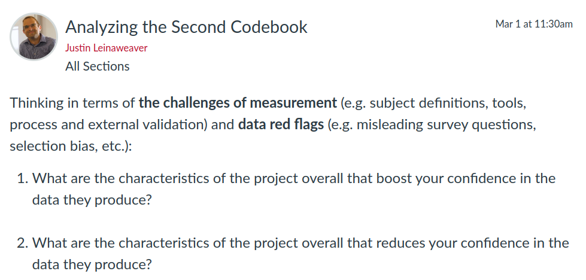

# Today's Agenda {background-image="libs/Images/background-data_blue_v3.png"}

```{r}
#  background-size="1920px 1080px"
library(tidyverse)
library(readxl)
```

<br>

**Make a presentation of Report 1**

<br>

<br>

::: r-stack
Justin Leinaweaver (Spring 2024)
:::

::: notes
Prep for Class

1.  Bring multiple markers to class (for group work)

<br>

**How are the R&Rs going?**

- **Any questions or need for clarification?**

<br>

Today I want us to work together to design a presentation that conveys the key findings of your first reports

<br>

As I mentioned last class, I'm not a comms expert, I'm a data scientist

- This means I'm pretty good at building data visualizations but I do not mean to present myself as an expert at building beautiful presentations.

- Most of my work with slides is for teaching and since I teach up to 12 classes a week I err towards speed, functionality and clarity in my slides.

<br>

However, when I present research at an academic conference I make sure to invest a ton of time in prepping and revising those slides!

<br>

**SLIDE**: Let's use our readings for today to set us out on the right foot
:::


## Advice for Better Presentation Slides {background-image="libs/Images/background-slate_v2.png" .center}

<br>

:::: {.columns}
::: {.column width='50%'}
Davis (2019) Consolidated

- One idea per slide

- Replace text with graphics

- Polish visualizations

- Apply the rule of thirds
:::
::: {.column width='50%'}
Naegle (2021) Consolidated

- One minute per slide

- Use informative headings

- Avoid cognitive overload
:::
::::

::: notes
Lots of very good, and overlapping, ideas across these two sources

- I really like how these two articles address what I often see as the biggest problems with slide presentations

- Too many words, not enough ideas, not enough pictures

<br>

**Any questions on the rules presented in these readings?**

- **Anything you disagreed with?**

<br>

**Notes**

[Davis list](https://www.sfmagazine.com/articles/2019/may/10-tips-to-improve-your-presentation-slides/)

1. Present one idea per slide
2. Change bulleted lists to graphical elements
3. Change bulleted lists to meaningful pictures
4. Use an original slide template
5. Modify default graph formats
6. Use pictures as your background
7. Use white space to improve readability
8. Resize, crop, and recolor pictures
9. Apply the rule of thirds
10. Eliminate unnecessary text

[Naegle List](https://www.ncbi.nlm.nih.gov/pmc/articles/PMC8638955/)

1. Rule 1: Include only one idea per slide
2. Rule 2: Spend only 1 minute per slide
3. Rule 3: Make use of your heading
4. Rule 4: Include only essential points
5. Rule 5: Give credit, where credit is due
6. Rule 6: Use graphics effectively
7. Rule 7: Design to avoid cognitive overload
8. Rule 8: Design the slide so that a distracted person gets the main takeaway
9. Rule 9: Iteratively improve slide design through practice
10. Rule 10: Design to mitigate the impact of technical disasters
:::


## Report 1 {background-image="libs/Images/background-slate_v2.png" .center}

1. Why is this project important?

2. How confident should we be in the methodology?

3. What do the measures currently show us?

4. How are these measures changing across time?

<br>

::: {.fragment}
**What are the big ideas / key conclusions from your analyses?**
:::

::: notes
*Split class into THREE groups (4 per group-ish)*

<br>

**SLIDE**: Groups, claim some space on the board and get to work

- We want a list of the main conclusions you would include in a presentation of your work on the first report

- Make sure you have at least two big conclusions for each of the four sections of the report

<br>

Don't aim to be comprehensive, aim to be compelling!

- If the audience wants the fine-grained details they should read your report

- The presentation highlights the important findings of your research

<br>

Take a few minutes and make your outline on the board

<br>

*PRESENT each and make sure the ideas on the board are big, meaty and compelling (no summary or description just for the sake of it)*
:::


## Report 1 {background-image="libs/Images/background-slate_v2.png" .center}

1. Why is this project important?

2. How confident should we be in the methodology?

3. What do the measures currently show us?

4. How are these measures changing across time?

<br>

**Design a presentation slide for each of the ideas on your list**

- Each slide must have a header and a sketch of the information to be included

::: notes
Groups, your next job is to sketch out your presentation

- Each idea in your list should be represented by a single slide in your presentation

<br>

Use the board to sketch out what each slide could look like

- Each slide must have a clear header/informative title

- Each slide should specify the kinds of picture, data visualization or (maybe) bullet points you propose to include
    - We prefer pictures or data to words!

<br>

### Questions on the task?

- Go!

<br>

*PRESENT and DISCUSS each*

<br>

*Depending on time remaining*

- Slide on building a presentation in RStudio, OR

- Jump straight to the end with codebook assignment for Monday
:::


## Quarto Presentations Using Revealjs {background-image="libs/Images/background-slate_v2.png" .center}

[How to use quarto in RStudio to make a presentation](https://quarto.org/docs/presentations/revealjs/)

- Output as html (can print as pdf if needed)
- Simple YAML
- New slides: ##
- Built-in themes
- Slide background or picture {background-image="libs/Images/background-forest_v3.png" }
- Add an image: 
- Add R analyses

::: notes

Themes: beige, blood, dark, default, league, moon, night, serif, simple, sky, solarized

format:
  revealjs: 
    theme: dark
:::

## {background-image="libs/Images/background-blue_triangles_flipped.png"}

<br>

```{r, fig.align='center'}

```

- CoW-NMC-Codebook.pdf

::: notes
For Wednesday we need to analyze the new codebook!

<br>

### Questions on the assignment?
:::