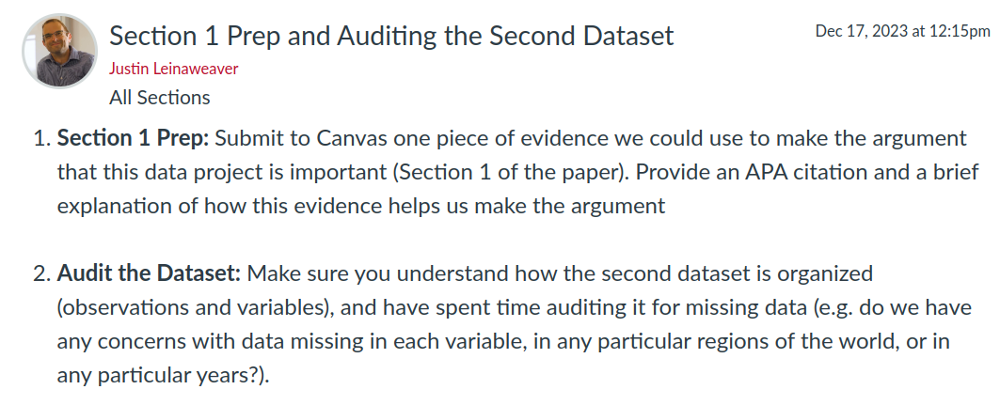

# Today's Agenda {background-image="libs/Images/background-data_blue_v3.png"}

```{r}
#  background-size="1920px 1080px"
library(tidyverse)
library(haven)

d <- read_csv("../Data_in_Class-SP24/CoW-National_Material_Capabailities/CoW-NMC-Data.csv", na = "-9")
```

<br>

Critically Analyze the Research Design of Data Project 2

<br>

<br>

::: r-stack
Justin Leinaweaver (Spring 2024)
:::

::: notes
Prep for Class

1. Update slides BEFORE class
    - Insert research question agreed upon last class and update DAG
    - Add measures to evaluate

2. Bring markers for every group (x6 in SP24)

3. Make sure the codebook and dataset are on Canvas
    - [CoW NMC website](https://correlatesofwar.org/data-sets/national-material-capabilities/)
:::


## Research Question? {background-image="libs/Images/background-slate_v2.png" .center}

<br>

```{r, fig.width = 10, fig.height=2}
## Manual DAG
d1 <- tibble(
  x = c(-3, 3),
  y = c(1, 1),
  labels = c("Military\nPower\n(CoW NMC)", "Human rights\nand\nthe rule of law\n(FFP)")
)

ggplot(data = d1, aes(x = x, y = y)) +
  geom_point(size = 8) +
  theme_void() +
  coord_cartesian(xlim = c(-4, 4)) +
  geom_label(aes(label = labels), size = 7) +
  annotate("segment", x = -1.9, xend = 1.85, y = 1, yend = 1, arrow = arrow())
```

::: notes
Research question brainstorming from Canvas forum

- How does militarization influence states' violation of human rights?

- Do states with more military power have more human rights violations?

- How do defense capabilities impact the quality of human rights in a country?

- Does a state's military capacity impact the likelihood of human rights violations?

<br>

Your Brainstorming

- Do states that prioritize their military capabilities respect human rights and the rule of law?

- Do more powerful states tend to undermine the human rights of their citizens?

:::


## Report 2 {background-image="libs/Images/background-slate_v2.png"}

<br>

**Analyzing our Predictor Variable(s)**

<br>

1. Why is this project important?

2. How confident should we be in the methodology?

3. What do the measures currently show us?

4. How are these measures changing across time?

::: notes
This week we work on your second report

- This will be due at the end of spring break (March 17th), and 

- In terms of structure and expectations it mirrors the work you did for the first report

<br>

Our plan this week

- Today focus on Section 2 by analyzing the codebook 

- Wednesday we work on Section 1 and audit the dataset

- Friday we work on Sections 3 and 4
:::


## National Material Capabilities (CoW) {background-image="libs/Images/background-slate_v2.png" .center .smaller}

<br>

**Six Indicators Used to Produce the CINC**

1. Military Expenditures, thousands of dollars (`milex`)

2. Military Personnel, thousands (`milper`)

3. Iron and steel production, thousands of tons (`irst`)

4. Primary Energy Consumption, metric ton coal equivalent (`pec`)

5. Total Population, thousands (`tpop`)

6. Urban population, pop living in cities +100,000 in thousands (`upop`)

::: notes
As you read for today, the Correlates of War's National Material Capabilities dataset is a project aimed at measuring state power across time

- Version 6 of the dataset covers 1816-2016

<br>

These six indicators are processed and averaged in order to produce a CINC score for every country in every year of the dataset

- The CINC is the "Composite Index of National Capability"

<br>

In broad strokes, the cinc for a single country-year is produced by:

1. Converting the value of each indicator into a proportion of the global total, and

2. Calculating the average proportion across the six indicators

<br>

**SLIDE**: Let's make sure everybody has this intuition down before we get to analyzing the codebook
:::


## What is the `cinc` for the US in 1816? {background-image="libs/Images/background-slate_v2.png"}

<br>

:::: {.columns}
::: {.column width='50%'}
```{r}
# Filter by 1816
d1816 <- filter(d, year == 1816) 

d1816 |>
  select(stateabb, year, irst) |>
  arrange(desc(irst)) |>
  slice_head(n = 6) |>
  kableExtra::kbl(align = c("l", "c", "c"))
```

And 17 more states...

:::
::: {.column width='50%'}
```{r}
# Combine
d1816 |>
  summarize(
    irst_1816 = sum(irst)
  ) |>
  kableExtra::kbl(col.names = "Sum of irst in 1816")
```
:::
::::

::: notes
First step, sum each variable across all countries for the year 1816

<br>

On the slide:

- LEFT: The top six iron and steel producing countries in 1816

- RIGHT: The sum of all iron and steel production in 1816

<br>

**So, what proportion of global iron and steel production did the US represent in 1816?**

- (**SLIDE**)
:::


## What is the `cinc` for the US in 1816? {background-image="libs/Images/background-slate_v2.png"}

<br>

:::: {.columns}
::: {.column width='50%'}
```{r}
# Filter by 1816
d1816 <- filter(d, year == 1816) 

d1816 |>
  select(stateabb, year, irst) |>
  arrange(desc(irst)) |>
  slice_head(n = 6) |>
  kableExtra::kbl(align = c("l", "c", "c"))
```

And 17 more states...

:::
::: {.column width='50%'}
```{r}
# Combine
d1816 |>
  summarize(
    irst_1816 = sum(irst)
  ) |>
  kableExtra::kbl(col.names = "Sum of irst in 1816")
```

<br>

<br>

**US in 1816 = 9.5% total**
:::
::::

::: notes
80/839 = .095

<br>

**Everybody understand how we got to this proportion of the total for the US in 1816?**
:::


## What is the `cinc` for the US in 1816? {background-image="libs/Images/background-slate_v2.png"}

```{r}
# Filter by 1816
d1816 <- filter(d, year == 1816) 

# Collect US only scores
#filter(d1816, stateabb == "USA")

# Combine
d1816 |>
  pivot_longer(cols = milex:upop, names_to = "Indicators", values_to = "Value") |>
  group_by(Indicators) |>
  summarize(
    Total = sum(Value, na.rm = TRUE)
  ) |>
  mutate(
    US = case_when(
      Indicators == "irst" ~ 80,
      Indicators == "milex" ~ 3823,
      Indicators == "milper" ~ 17,
      Indicators == "pec" ~ 254,
      Indicators == "tpop" ~ 8659,
      Indicators == "upop" ~ 101,
    ),
    Proportion = str_c(round(US/Total, 3)*100, '%')
  ) |>
  kableExtra::kbl(align = c("l", "c", "c", "c"))
```

<br>

::: {.r-stack}
**The Average Proportion (e.g. the CINC) = 3.97%**
:::

::: notes
Here's the data on the US and the world in 1816 across all six indicators

- *Walk through the table*

<br>

**Does calculating the CINC make sense in an intuitive sense?**

<br>

**So, how many sources of uncertainty are there in every country-year cinc score?**

<br>

Sources of Uncertainty

- Are these the right six indicators?

- How confident are we in the value of each indicator and each year?

- Since we're talking "proportion of the global total," are we confident this sample of countries represents the global total? 

<br>

**SLIDE**: Today I'd like us to focus our analysis of the codebook on the indicators themselves.
:::


## Gathering Analyses for Section 2 {background-image="libs/Images/background-slate_v2.png" .center}

<br>

:::: {.columns}
::: {.column width="55%"}
**The Measures**

1. `milex`: Taylor and Annabelle

2. `milper`: Rachael and Maverick

3. `irst`: Devin and Clayton

4. `pec`: Gilly and Sam

5. `tpop`: Mattie and Tryn

6. `upop`: Peyton and Riley
:::

::: {.column width="45%"}
**Analyze the Methodology**

- Source of the Data

- Operationalization

- Instrumentation

- Measurement Process

- Data Validation
:::
::::

::: notes
In order to analyze the CINC, we need to first analyze the indicators as measures

- So, I've paired you off and assigned each pair to a single indicator

<br>

Pairs, your job is to make two lists on the board

- What are the strengths and weaknesses of this indicator's methodology?

<br>

### Any questions?

- Please work directly on the board as the whole class will need your notes to help them write Section 2!

- Get to work!

<br>

*PRESENT each*

- Everybody write down all the work on the board! 

- The pros and cons for each indicator IS the material you need to make an argument about the usefulness of the overall CINC score!
:::


## For Next Class {background-image="libs/Images/background-slate_v2.png" .center}

<br>

```{r}

```

::: notes
- Audit the Dataset: Make sure you understand how the data is organized (observations and variables), and have spent time auditing it for missing data (time or region)

- Explore the Dataset: Submit THREE interesting, puzzling or surprising things about the world of this dataset. Fully explain each of your findings and how you can support your claims using the data.

<br>

**VERY IMPORTANT NOTE:** Missing data in the NMC is coded as -9 so you HAVE to put that in the na field when you import the data!
:::

