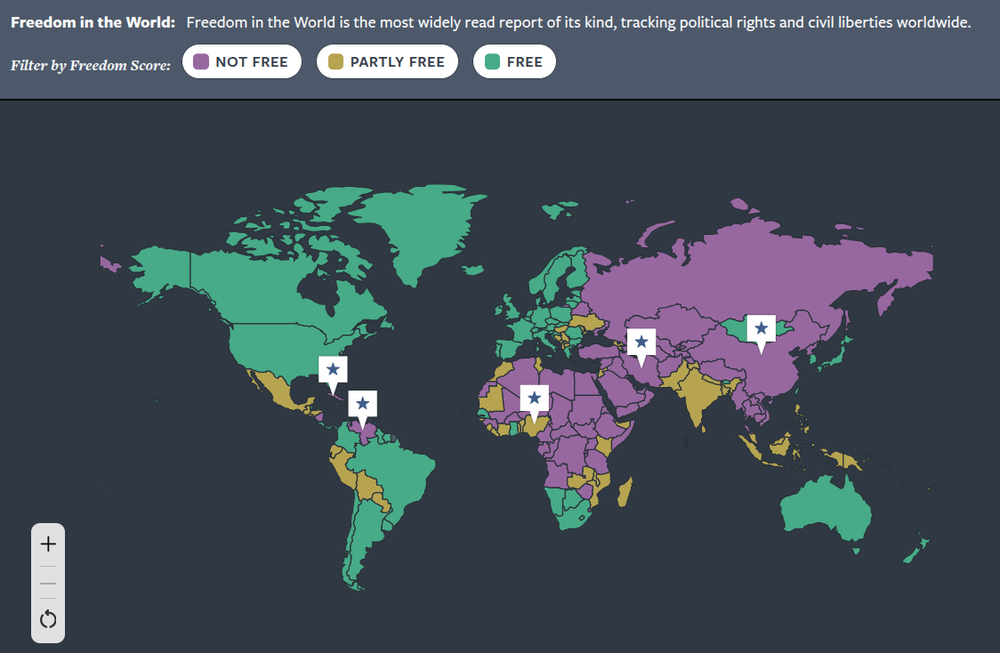

## Today's Agenda {background-image="Images/background-data_blue_v4.png" .center}

```{r}
library(tidyverse)
library(readxl)
library(kableExtra)

load("../../DATA/2026-Spring/Miller_Saunders_Farhart2016/Miller_Saunders_Farhart2016_v2.RData")

# Build the CT index
d$ct_index <- as.numeric(d$CT_Obama) + as.numeric(d$CT_DeathPanels) + as.numeric(d$CT_Govt_911) + as.numeric(d$CT_Katrina_Levees) + as.numeric(d$CT_Climate_Hoax) + as.numeric(d$CT_Bush_WMDs) + as.numeric(d$CT_Hussein_911) + as.numeric(d$CT_2004_election)

# Rescale the index to start at zero
d$ct_index0 <- d$ct_index - 8

# Convert to percentage out of 24
d$ct_index_pct <- d$ct_index0 / 24

# Build the knowledge index
# Recode nominal variables into dummies
d$Majority_House2 <- if_else(d$Majority_House == "Republican Party", 1, 0)
d$More_Conservative2 <- if_else(d$More_Conservative == "Republican Party", 1, 0)
d$JRoberts_Job2 <- if_else(d$JRoberts_Job == "Chief Justice of the Supreme Court", 1, 0)
d$Pres_Russia2 <- if_else(d$Pres_Russia == "Vladimir Putin", 1, 0)
d$Speaker2 <- if_else(d$Speaker == "John Boehner", 1, 0)
d$JBiden_Job2 <- if_else(d$JBiden_Job == "Vice President of the United States", 1, 0)
d$DCameron_Job2 <- if_else(d$DCameron_Job == "Prime Minister of the United Kingdom", 1, 0)
d$Nominates_Judges2 <- if_else(d$Nominates_Judges == "The President", 1, 0)
d$Senate_Term2 <- if_else(d$Senate_Term == "6 years", 1, 0)
d$Reviews_Laws2 <- if_else(d$Reviews_Laws == "The Supreme Court", 1, 0)
d$Veto_Override2 <- if_else(d$Veto_Override == "2/3", 1, 0)
d$Sec_State2 <- if_else(d$Sec_State == "John Kerry", 1, 0)
d$Sec_Treasury2 <- if_else(d$Sec_Treasury == "Jacob Lew", 1, 0)
d$PM_Canada2 <- if_else(d$PM_Canada == "Stephen Harper", 1, 0)

d$knowledge_index <- d$Majority_House2 + d$More_Conservative2 + d$JRoberts_Job2 + d$Pres_Russia2 + d$Speaker2 + d$JBiden_Job2 + d$DCameron_Job2 + d$Nominates_Judges2 + d$Senate_Term2 + d$Reviews_Laws2 + d$Veto_Override2 + d$Sec_State2 + d$Sec_Treasury2 + d$PM_Canada2

# Rescale to proportion
d$knowledge_index2 <- d$knowledge_index / 14
```

<br>

::: {.r-fit-text}

**The Challenge in Establishing Causation**

- Good research design is vital to all knowledge formation

:::

<br>

::: r-stack
Justin Leinaweaver (Spring 2026)
:::

::: notes
Prep for Class

1. Review Canvas submissions

2. Markers x 3

<br>

Today we wrap up the first half of the semester with a huge and hugely important topic: establishing causality

- The scientific method basically exists to help us tackle what is the fundamental problem facing all of us who want to understand the why's of the world

- No matter what you do or how much money you throw at the problem you can never escape the fundamental problem of causal inference

<br>

But before we dive into that topic, let's review your Canvas assignment

- **What visualization type did you make in order to test the first two hypotheses focused on the relationship between trust and belief in conspiracy theories?**

- (**NEXT SLIDE**: Box plots, **AFTER THAT** x 2: Histogram with facets)

:::


##  {background-image="Images/background-data_blue_v4.png" .center}

::: {.r-fit-text}
**H1 & 2. Belief in CTs &#8593; as trust in government &#8595;**
:::

```{r, echo=FALSE, fig.align='center', fig.asp=.618, fig.width=9}
d |>
  filter(!is.na(Trust_Govt)) |>
  pivot_longer(cols = c(Lib_Conspiracy_Index, Cons_Conspiracy_Index), names_to = "index", values_to = "values") |>
  ggplot(aes(x = index, y = values, fill = Trust_Govt)) +
  geom_boxplot() +
  labs(fill = "Trust in\nGovernment", x = "", y = "Belief in Conspiracies") +
  scale_y_continuous(labels = scales::percent_format()) +
  theme(legend.position = "top") +
  scale_x_discrete(limits = c("Cons_Conspiracy_Index", "Lib_Conspiracy_Index"), label = c("Conservative Conspiracies", "Liberal Conspiracies")) +
  scale_fill_brewer(type = "div", palette = 4, direction = -1)
```

::: notes

**Does this visualization support the hypothesis or not?**

<br>

**What does this suggest is true about the relationship we're studying?**


:::


##  {background-image="Images/background-data_blue_v4.png" .center}

::: {.r-fit-text}
**H1 & 2. Belief in CTs &#8593; as trust in government &#8595;**
:::

```{r, echo=FALSE, fig.align='center', fig.asp=.9, fig.width=10}
# histogram and facet wraps
d |>
  filter(!is.na(Trust_Govt)) |>
  pivot_longer(cols = c(Lib_Conspiracy_Index, Cons_Conspiracy_Index), names_to = "index", values_to = "values") |>
  ggplot(aes(x = values)) +
  geom_histogram(bins = 12, color = "white", fill = "orange3") +
  facet_grid(Trust_Govt ~ index, scales = "free_y") +
  labs(y = "Count", x = "Belief in Conspiracies") +
  scale_x_continuous(labels = scales::percent_format()) +
  theme_bw()
```

::: notes

**Does this visualization support the hypothesis or not?**

<br>

**What does this suggest is true about the relationship we're studying?**

<br>

**What visualization type did you make in order to test the final two hypotheses focused on the relationship between partisanship and belief in conspiracy theories?**

- (**NEXT SLIDE**: Box plots, **AFTER THAT** x 2: Histogram with facets)

:::


##  {background-image="Images/background-data_blue_v4.png" .center}

::: {.r-fit-text}
**H3 & 4. Belief in CTs &#8593; when CTs appeal to your partisanship**
:::

```{r, echo=FALSE, fig.align='center', fig.asp=.618, fig.width=9}
d |>
  filter(!is.na(Party3)) |>
  pivot_longer(cols = c(Lib_Conspiracy_Index, Cons_Conspiracy_Index), names_to = "index", values_to = "values") |>
  ggplot(aes(x = index, y = values, fill = Party3)) +
  geom_boxplot() +
  labs(fill = "", x = "", y = "Belief in Conspiracies") +
  scale_y_continuous(labels = scales::percent_format()) +
  theme(legend.position = "top") +
  scale_x_discrete(limits = c("Cons_Conspiracy_Index", "Lib_Conspiracy_Index"), label = c("Conservative Conspiracies", "Liberal Conspiracies")) +
  scale_fill_manual(values = c("blue2", "grey", "red3"))
```

::: notes

**Does this visualization support the hypothesis or not?**

<br>

**What does this suggest is true about the relationship we're studying?**

:::


## {background-image="Images/background-data_blue_v4.png" .center}

::: {.r-fit-text}
**H3 & 4. Belief in CTs &#8593; when CTs appeal to your partisanship**
:::

```{r, echo=FALSE, fig.align='center', fig.asp=.9, fig.width=10}
# histogram and facet wraps
d |>
  filter(!is.na(Party3)) |>
  pivot_longer(cols = c(Lib_Conspiracy_Index, Cons_Conspiracy_Index), names_to = "index", values_to = "values") |>
  ggplot(aes(x = values)) +
  geom_histogram(bins = 10, color = "white", fill = "orange3") +
  facet_grid(index ~ Party3, scales = "free") +
  labs(y = "Count", x = "Belief in Conspiracies") +
  scale_x_continuous(labels = scales::percent_format()) +
  theme_bw()
```

::: notes

**Does this visualization support the hypothesis or not?**

<br>

**What does this suggest is true about the relationship we're studying?**

<br>

**SLIDE**: At this point...

:::


## {background-image="Images/background-data_blue_v4.png" .center}

::: {.r-fit-text}
**Miller, Saunders and Farhart (2016)**
:::

:::: {.columns}
::: {.column width="50%"}
```{r, echo=FALSE, fig.align='center', fig.asp=1, fig.width=7}
d |>
  filter(!is.na(Trust_Govt)) |>
  pivot_longer(cols = c(Lib_Conspiracy_Index, Cons_Conspiracy_Index), names_to = "index", values_to = "values") |>
  ggplot(aes(x = index, y = values, fill = Trust_Govt)) +
  geom_boxplot() +
  labs(fill = "Trust in\nGovernment", x = "", y = "Belief in Conspiracies") +
  scale_y_continuous(labels = scales::percent_format()) +
  theme(legend.position = "top") +
  scale_x_discrete(limits = c("Cons_Conspiracy_Index", "Lib_Conspiracy_Index"), label = c("Conservative Conspiracies", "Liberal Conspiracies")) +
  scale_fill_brewer(type = "div", palette = 4, direction = -1)
```
:::

::: {.column width="50%"}
```{r, echo=FALSE, fig.align='center', fig.asp=1, fig.width=7}
d |>
  filter(!is.na(Party3)) |>
  pivot_longer(cols = c(Lib_Conspiracy_Index, Cons_Conspiracy_Index), names_to = "index", values_to = "values") |>
  ggplot(aes(x = index, y = values, fill = Party3)) +
  geom_boxplot() +
  labs(fill = "", x = "", y = "Belief in Conspiracies") +
  scale_y_continuous(labels = scales::percent_format()) +
  theme(legend.position = "top") +
  scale_x_discrete(limits = c("Cons_Conspiracy_Index", "Lib_Conspiracy_Index"), label = c("Conservative Conspiracies", "Liberal Conspiracies")) +
  scale_fill_manual(values = c("blue2", "grey", "red3"))
```
:::
::::

::: notes

**At this point, how comfortable are you concluding that trust and partisanship are useful predictors of believing in conspiracy theories? Why or why not?**

<br>

**SLIDE**: Time to check the political knowledge predictor!

:::


## {background-image="Images/background-data_blue_v4.png" .center}

::: {.r-fit-text}
**Miller, Saunders and Farhart (2016)**
:::

<br>

**H5. Do increases in political knowledge reduce the belief in conspiracy theories?**

- Box plot: Overall CT index x Political knowledge index

<br>

::: {.fragment}
```{r, echo=TRUE, eval=FALSE}
# The "x" in a box plot MUST be categorical
factor(political_knowledge_index)
```
:::

::: notes

One more thing to check, does increasing political knowledge reduce the likelihood of believing a conspiracy theory?

<br>

Everybody build this box plot to test this hypothesis

- **REVEAL**: One code tweak you'll need!

- geom_boxplot requires one of the variables to be a number and the other to be categorical

- This means we can use the factor argument to tell R that the knowledge index is actually a series of levels and not numbers

- Go!

:::


## {background-image="Images/background-data_blue_v4.png" .center .smaller}

**H5. Do increases in political knowledge reduce the belief in conspiracy theories?**

```{r, fig.align='center', fig.asp=.618, fig.width=9}
# Overall Test
color_range1 <- colorRampPalette(c("red", "white"), bias = 2)   
my_colors <- color_range1(14)  

d |>
  filter(!is.na(knowledge_index)) |>
  ggplot(aes(x = factor(knowledge_index), y = ct_index_pct)) +
  #geom_boxplot(fill = my_colors) +
  geom_boxplot(fill = c(rep("red", 5), rep("pink2", 5), rep("white", 4))) +
  labs(x = "Political Knowledge Index", y = "Belief in Conspiracy Theories") +
  scale_y_continuous(labels = scales::percent_format()) +
  theme_bw()
```

::: notes

**Conclusions from this visualization?**

- Effect not as strong as I might have hoped

- Have to go from zero info to total info to cut the belief in CTs in half

    - Not a great return on the investment!

<br>

**SLIDE**: Let's repeat this but focused on the two separate types of CTs

:::


## {background-image="Images/background-data_blue_v4.png" .center}

::: {.r-fit-text}
**Miller, Saunders and Farhart (2016)**
:::

<br>

**H5. Do increases in political knowledge reduce the belief in conspiracy theories?**

1. Box plot: Liberal CT index x Political knowledge index

2. Box plot: Conservative CT index x Political knowledge index

::: notes

Everybody now build these two box plot diagrams to test this hypothesis

- Go!

:::


## {background-image="Images/background-data_blue_v4.png" .center .smaller}

**H5. Do increases in political knowledge reduce the belief in conspiracy theories?**

```{r, fig.align='center', fig.asp=.618, fig.width=9}
# Partisanship Test
d |>
  filter(!is.na(knowledge_index)) |>
  pivot_longer(cols = c(Lib_Conspiracy_Index, Cons_Conspiracy_Index), names_to = "index", values_to = "values") |>
  ggplot(aes(x = index, y = values, fill = factor(knowledge_index))) +
  geom_boxplot() +
  #theme(legend.position = "top") +
  labs(fill = "", x = "", y = "Belief in Conspiracies") +
  scale_y_continuous(labels = scales::percent_format())  +
  scale_x_discrete(limits = c("Cons_Conspiracy_Index", "Lib_Conspiracy_Index"), label = c("Conservative Conspiracies", "Liberal Conspiracies")) +
  guides(fill = FALSE) +
  scale_fill_manual(values = my_colors)

```

::: notes

**Conclusions from this visualization?**

- Knowledge lowers belief in CTs, BUT

- Appears that knowledge has a stronger impact on the conseravtive CTs!

- Liberal CTs more believed than conservative ones

<br>

**Everybody feeling comfortable with making and interpreting bivariate analyses of an interval variable across the levels of a categorical variable?**

<br>

**SLIDE**: Our work for today on causal inference

:::


## Building a Causal Argument {background-image="Images/background-data_blue_v4.png" .center}

<br>

"Causal inference refers to the process of drawing a conclusion that a specific treatment (i.e. intervention) was the 'cause' of the effect (or outcome) that was observed" (Frey 2018). 

<br>

```{r, fig.align = 'center', fig.width = 6, fig.height=1.25}
## Manual DAG
d1 <- tibble(
  x = c(-3, 3),
  y = c(1, 1),
  labels = c("Treatment", "Effect")
)

ggplot(data = d1, aes(x = x, y = y)) +
  geom_point(size = 0, color = "white") +
  theme_void() +
  coord_cartesian(xlim = c(-4, 4)) +
  geom_label(aes(label = labels), size = 7) +
  annotate("segment", x = -1.9, xend = 2.2, y = 1, yend = 1, arrow = arrow())
```

::: notes

Ok, today we introduce some of the big concepts we will need moving forward in the scientific method

- The aim of any scientific discipline is to generate new knowledge that explains why things happen in the world

- We refer to this as explanatory or causal analysis

<br>

Much of this language comes from medicine where they focus on treatments and effects

-   Think new medicines and curing a disease

-   For our purposes, think of "treatment to effect" as synonymous with "predictor to outcome."

- In other words, we want to demonstrate that changes in our chosen predictors CAUSE a change in the outcome variable

<br>

**SLIDE**: Let's step through a toy example to think about how we build a causal argument.

:::


## Building a Causal Argument {.center background-image="Images/background-data_blue_v4.png"}

<br>

:::: columns
::: {.column width="50%"}


:::

::: {.column width="50%"}


:::
::::

```{r, fig.retina = 3, fig.align = 'center', fig.width = 7, fig.height=1}
## Manual DAG
d1 <- tibble(
  x = c(-3, 3),
  y = c(1, 1),
  labels = c("Class\nSize", "Student\nSuccess")
)

ggplot(data = d1, aes(x = x, y = y)) +
  geom_point(size = 0, color = "white") +
  theme_void() +
  coord_cartesian(xlim = c(-4, 4)) +
  geom_label(aes(label = labels), size = 7) +
  annotate("segment", x = -2.15, xend = 2, y = 1, yend = 1, arrow = arrow())
```

::: notes


<br>

Let's say we have a hypothesis that smaller class sizes will lead to better student success

-   The theory is that in smaller classes teachers can provide more individualized attention, and

-   Students who receive more personalized attention grow faster than those who do not

<br>

Easy peasy, now let's use an experiment to show I am right!

-   I am now going to walk you through a solid gold, infallible research design for PROVING causality
:::


## Building a Causal Argument {background-image="Images/background-data_blue_v4.png"}

{.absolute bottom="100" left="0" width="45%"}

{.absolute bottom="130" right="0" width="50%"}

::: notes
Step 1:

-   Take a specific student, say, Bob here who is a hypothetical 3rd grader.

- Over the summer we give Bob a pre-test to establish his current academic ability

-   This coming August place Bob in a small class and ensure he attends all year

-   Next May we record his test scores

<br>

The difference of pre-test to post-test gives us a measure of Bob's growth for the year

- **Everybody with me?**

- **SLIDE**: the next step is the tricky one
:::


##  {background-image="Images/background-data_blue_v4.png"}

{.absolute top="0" left="250" width="60%"}

{.absolute bottom="0" left="0" width="35%"}

{.absolute bottom="0" right="0" width="45%"}

::: notes
Step 2

In May, AFTER RECORDING BOB's TEST SCORES, you use a time machine to return to August

-   In the past August you place Bob in a large class and ensure he attends all year

-   Then in past future May we record his test scores

<br>

**Did I lose anybody here?**
:::


##  {background-image="Images/background-data_blue_v4.png"}

{.absolute top="0" left="340" width="35%"}

{.absolute bottom="0" left="0" width="45%"}

{.absolute bottom="0" right="0" width="45%"}

::: notes
Step 3: Calculate the difference in test scores between past Bob and past revised Bob

-   You have a firm estimate of the causal effect of class size on Bob's individual success.
:::


##  {background-image="Images/background-data_blue_v4.png"}

{.absolute top="0" left="25" width="40%"}

{.absolute top="50" right="0" width="45%"}

{.absolute bottom="0" left="0" width="45%"}

{.absolute bottom="0" right="0" width="45%"}

::: notes
Now all you have to do is repeat this process for a few hundred randomly selected students and you will be able to conclusively demonstrate a causal effect of class size on student success.

<br>

**Questions?**
:::


## {.center background-image="Images/background-data_blue_v4.png"}

::: r-fit-text
The Fundamental Problem of Causal Inference
:::

<br>

"To measure causal effects, we need to compare the factual outcome with the counter-factual outcome, but **we can never observe the counter-factual outcome**" (Llaudet and Imai 2023).

::: notes
This is what we call the fundamental problem of causal inference

-   In the real world we observe only the actual outcome (Student X in small class) and never the counter-factual (Student X in large class)!

<br>

NOTE: This is a problem for ALL science, not just the social sciences.

-   Whether its gravity, speed, biological reproduction or whatever else, we cannot observe actual counter-factuals

<br>

THIS is a big reason why we can never PROVE anything in science

- The fundamental problem is serious and unavoidable

<br>

**SLIDE**: So, how do we solve this problem?

:::


## Randomized Controlled Trials (RCTs) {.center background-image="Images/background-data_blue_v4.png"}

```{r, fig.retina=3, fig.align='center', fig.asp=.6, fig.width=10}
## Manual DAG
d2 <- tibble(
  x = c(2.5, 2, 3),
  y = c(3, 2, 2),
  labels = c("Participants", "Treatment\nGroup", "Control\nGroup")
)

ggplot(data = d2, aes(x = x, y = y)) +
  geom_point(size = 0, color = "white") +
  theme_void() +
  coord_cartesian(xlim = c(1.75, 3.25), ylim = c(1.5, 3.25)) +
  geom_label(aes(label = labels), size = 10) +
  annotate("segment", x = 2.5, xend = 2.5, y = 2.85, yend = 2.7, arrow = arrow(length = unit(0.1, "inches"))) +
  annotate("segment", x = 2.5, xend = 2.2, y = 2.5, yend = 2.2, arrow = arrow()) +
  annotate("segment", x = 2.5, xend = 2.85, y = 2.5, yend = 2.2, arrow = arrow()) +
  annotate("text", x = 2.5, y = 2.6, label = "Random Allocation", color = "red", size = 10)
```

::: notes

Where possible, the "gold" standard solution across the scientific fields is to run a Randomized Controlled Trial (RCTs)

<br>

The key to what makes an RCT powerful is that its design is based on randomly assigning the treatment and control groups

- For example, take a random sample of third grade students in Springfield and assign them to either a small class (the treatment) or a large class (the control) using the flip of a coin.

<br>

Why randomize the assignment?

- Random assignment means that every individual has an equal chance of being assigned to either group

- So, each randomly created group should have a similar proportion of students by gender, race, background, ability, etc

- The real power here is we don't have to know, a priori, which factors matter for our hypothesis, the random assignment takes care of it.

<br>

Bottom line:

1. Random assignment means that even though both groups are composed of different individuals, the two groups are comparable to each other **on average** in all respects.

2. Random assignment means that the only thing that distinguishes the treatment group from the control group **BESIDES THE TREATMENT** is chance.

<br>

**Does this make sense?**
:::


## Randomized Controlled Trials (RCTs) {.center background-image="Images/background-data_blue_v4.png"}

```{r, fig.retina=3, fig.align='center', fig.asp=.6, fig.width=10}
## Manual DAG
d2 <- tibble(
  x = c(2.5, 2, 3, 2, 3),
  y = c(3, 2, 2, 1, 1),
  labels = c("Participants", "Treatment\nGroup", "Control\nGroup", "Outcome", "Outcome")
)

ggplot(data = d2, aes(x = x, y = y)) +
  geom_point(size = 0, color = "white") +
  theme_void() +
  coord_cartesian(xlim = c(1.75, 3.25), ylim = c(0.75, 3.25)) +
  geom_label(aes(label = labels), size = 10) +
  annotate("segment", x = 2.5, xend = 2.5, y = 2.85, yend = 2.7, arrow = arrow(length = unit(0.1, "inches"))) +
  annotate("segment", x = 2.5, xend = 2.2, y = 2.5, yend = 2.2, arrow = arrow()) +
  annotate("segment", x = 2.5, xend = 2.85, y = 2.5, yend = 2.2, arrow = arrow()) +
  annotate("segment", x = 2, xend = 2, y = 1.75, yend = 1.15, arrow = arrow()) +
 annotate("segment", x = 3, xend = 3, y = 1.75, yend = 1.15, arrow = arrow()) +
  annotate("text", x = 2.5, y = 2.6, label = "Random Allocation", color = "red", size = 10)
```

::: notes

Since the groups are "identical" on average we can use the factual outcome of each group as the counter-factual for the other group.

- The average difference in outcomes between the two groups is called the "average treatment effect" and THAT is our measure of the effect

<br>

So, RCT is an approach in which we randomly assign the treatment in order to generate an estimate of the causal effect

- This approach does NOT give us the actual counter-factual, BUT

- If the size of our sample is large AND the quality of our random assignment is good then we can develop an estimate of the "average treatment effect" (ATE)

<br>

**Does this make sense in big picture terms?**

- There is a growing movement in political science to use experiments to test our theories, BUT

- **SLIDE**: Too many of the problems we work on don't lend themselves to an RCT experiment

:::


## The Challenge of Observational Data {.center background-image="Images/background-data_blue_v4.png"}

{style="display: block; margin: 0 auto"}

::: notes

Much of what we do in the social sciences is dependent on observational, NOT experimental, data

- e.g. data from observing the world, not directly manipulating it as is done in an RCT.

<br>

We'd love to know the effect of nuclear weapons on the likelihood of war, BUT

- Countries of the world aren't going to let us confiscate all the nukes and then randomly assign them to some countries and not others to see what happens

<br>

**SLIDE**: Example 2

:::


## The Challenge of Observational Data {.center background-image="Images/background-data_blue_v4.png"}

{style="display: block; margin: 0 auto"}

::: notes

Which personal freedoms or civil liberties have the biggest impact on economic growth?

<br>

To run an RCT we just need to get rid of all civil rights in every country THEN reassign them at random

- No problem, right?

<br>

**SLIDE**: So, what happens if your groups are NOT randomly assigned?

:::


## Randomized Controlled Trials (RCTs) {background-image="Images/background-data_blue_v4.png" .center}

<br>

```{r, fig.retina=3, fig.align='center', out.width='77%', fig.asp=.6, fig.width=10}
## Manual DAG
d2 <- tibble(
  x = c(2.5, 2, 3, 2, 3),
  y = c(3, 2, 2, 1, 1),
  labels = c("Participants", "Treatment\n Group", "Control\n Group", "Outcome", "Outcome")
)

ggplot(data = d2, aes(x = x, y = y)) +
  geom_point(size = 0, color = "white") +
  theme_void() +
  coord_cartesian(xlim = c(1.75, 3.25), ylim = c(0.75, 3.25)) +
  geom_label(aes(label = labels), size = 10) +
  annotate("segment", x = 2.5, xend = 2.5, y = 2.9, yend = 2.7, arrow = arrow()) +
  annotate("segment", x = 2.5, xend = 2.2, y = 2.5, yend = 2.2, arrow = arrow()) +
  annotate("segment", x = 2.5, xend = 2.85, y = 2.5, yend = 2.2, arrow = arrow()) +
  annotate("segment", x = 2, xend = 2, y = 1.75, yend = 1.15, arrow = arrow()) +
 annotate("segment", x = 3, xend = 3, y = 1.75, yend = 1.15, arrow = arrow()) +
  annotate("text", x = 2.5, y = 2.6, label = "Random Allocation", color = "red", size = 10)
```

::: notes

Remember, the primary benefits of using random allocation are:

1. EVEN though both groups have **different people**, they will be the same **on average** in all respects.

2. SINCE the groups are the same **on average** the only difference between them is the **treatment effect**

3. SINCE the only difference between them is the treatment effect **we can use the factual outcome of each group as the counter-factual for the other group.**

<br>

**SLIDE**: Now we shift to using observational data (e.g. non-RCT)

:::


## The Challenge of Observational Data {background-image="Images/background-data_blue_v4.png" .center}

<br>

```{r, fig.retina=3, fig.align='center', out.width='77%', fig.asp=.6, fig.width=10}
## Manual DAG
d3 <- tibble(
  x = c(2.5, 2, 3, 2, 3),
  y = c(3, 2, 2, 1, 1),
  labels = c("Nature", "Treatment\n Group", "Control\n Group", "Outcome", "Outcome")
)

ggplot(data = d3, aes(x = x, y = y)) +
  geom_point(size = 0, color = "white") +
  theme_void() +
  coord_cartesian(xlim = c(1.75, 3.25), ylim = c(0.75, 3.25)) +
  geom_label(aes(label = labels), size = 10) +
  annotate("segment", x = 2.5, xend = 2.2, y = 2.85, yend = 2.25, arrow = arrow()) +
  annotate("segment", x = 2.5, xend = 2.85, y = 2.85, yend = 2.25, arrow = arrow()) +
  annotate("segment", x = 2, xend = 2, y = 1.75, yend = 1.15, arrow = arrow()) +
 annotate("segment", x = 3, xend = 3, y = 1.75, yend = 1.15, arrow = arrow())
```

::: notes

IF nature assigns our groups then:

- FIRST, we can no longer assume that the groups are identical on average, AND

- SECOND, if the groups are not identical on average then we CANNOT assume the outcomes of group 1 are the counter-factual outcomes for group 2!

- Put these together and that means we cannot interpret the differences between the groups as a causal effect, just an association

- Hence, analyses of observational data often runs into the "correlation is not causation" criticism

<br>

**SLIDE**: So, what do we do?

:::


## An Identification Strategy {background-image="Images/background-data_blue_v4.png" .center}

<br>

```{r, fig.retina=3, fig.align='center', out.width='77%', fig.asp=.6, fig.width=10}
## Manual DAG
d3 <- tibble(
  x = c(2.5, 2, 3, 2, 3),
  y = c(3, 2, 2, 1, 1),
  labels = c("CONFOUNDERS", "Treatment\n Group", "Control\n Group", "Outcome", "Outcome")
)

ggplot(data = d3, aes(x = x, y = y)) +
  geom_point(size = 0, color = "white") +
  theme_void() +
  coord_cartesian(xlim = c(1.75, 3.25), ylim = c(0.75, 3.25)) +
  geom_label(aes(label = labels), size = 10) +
  annotate("segment", x = 2.5, xend = 2.2, y = 2.85, yend = 2.25, arrow = arrow()) +
  annotate("segment", x = 2.5, xend = 2.85, y = 2.85, yend = 2.25, arrow = arrow()) +
  annotate("segment", x = 2, xend = 2, y = 1.75, yend = 1.15, arrow = arrow()) +
 annotate("segment", x = 3, xend = 3, y = 1.75, yend = 1.15, arrow = arrow())
```

::: notes

We develop **identification strategies** that identify the **confounders** in our observational relationships.

- Think of the confounders as a list of reasons why the groups are not identical on average

- If you can identify all the confounders, and adjust your analysis for them, you can treat the groups as identical on average!

<br>

In research design terms, a confounder is a variable that represents WHY the groups we are comparing are not identical on average

- So a big part of making a causal argument with observational data is identifying all the confounders in the key relationship

- IFF you "control" for all the confounders THEN we can assume that the groups are identical on average

- And just like before, if the groups are identical on average than any differences between them are the causal effect you are trying to measure!

<br>

**SLIDE**: What is a confounder?

:::


## {background-image="Images/background-data_blue_v4.png" .center}

```{r, fig.retina = 3, fig.align = 'center', out.width='85%', fig.asp=.65}
## Manual DAG
d1 <- tibble(
  x = c(1, 2, 3),
  y = c(1, 2, 1),
  labels = c("Treatment", "Confounder", "Outcome")
)

ggplot(data = d1, aes(x = x, y = y)) +
  geom_point(size = 0, color = "white") +
  theme_void() +
  coord_cartesian(xlim = c(0, 4), ylim = c(.75, 2.25)) +
  geom_label(aes(label = labels), size = 7) +
  annotate("segment", x = 1.5, xend = 2.5, y = 1, yend = 1, arrow = arrow()) +
  annotate("segment", x = 1.7, xend = 1, y = 1.85, yend = 1.15, arrow = arrow()) +
  annotate("segment", x = 2.3, xend = 3, y = 1.85, yend = 1.15, arrow = arrow())
```

::: notes

How do we know if a variable is a confounder in our relationship?

- In short, a confounder is a variable that explains some of the variation in both the treatment and the outcome variables.

- In other words, the confounder causes at least some of the variation in the predictor, AND

- The confounder causes at least some of the variation in the outcome.

<br>

This is how we show a confounder in a DAG.

- Causal arrows run from the confounder variable to the predictor AND the outcome.

<br>

Two arguments required to establish a confounder:

1. The confounder MUST cause BOTH variables in the mechanism

2. The direction of effect is FROM the confounder TO the mechanism

<br>

**SLIDE**: Let me give you an example before asking if this makes sense

:::


## Do ice cream sales create arsonists? {background-image="Images/background-data_blue_v4.png" .center}

:::: {.columns}
::: {.column width="50%"}
```{r, fig.retina=3, out.width='80%'}

```
:::

::: {.column width="50%"}
```{r, fig.retina=3, out.width='80%'}

```
:::
::::

```{r, fig.retina = 3, fig.align = 'center', fig.width = 6, fig.height=1, out.width='95%'}
## Manual DAG
d1 <- tibble(
  x = c(-3, 3),
  y = c(1, 1),
  labels = c("Ice Cream\n Sales", "Forest\n Fires")
)

ggplot(data = d1, aes(x = x, y = y)) +
  geom_point(size = 0, color = "white") +
  theme_void() +
  coord_cartesian(xlim = c(-4, 4)) +
  geom_label(aes(label = labels), size = 7) +
  annotate("segment", x = -1.9, xend = 2.2, y = 1, yend = 1, arrow = arrow())
```

::: notes

So, it turns out that there is a rather high correlation between ice cream sales and the number of forest fires in a given area.

<br>

Almost certainly "correlation, not causation", right?

- I don't think buying ice cream leads someone to want to start a fire.
:::


## {background-image="Images/background-data_blue_v4.png" .center}

```{r, fig.retina = 3, fig.align = 'center', out.width='85%', fig.asp=.65}
## Manual DAG
d1 <- tibble(
  x = c(1, 2, 3),
  y = c(1, 2, 1),
  labels = c("Ice Cream\n Sales", "Confounder", "Forest\n Fires")
)

ggplot(data = d1, aes(x = x, y = y)) +
  geom_point(size = 0, color = "white") +
  theme_void() +
  coord_cartesian(xlim = c(0, 4), ylim = c(.75, 2.25)) +
  geom_label(aes(label = labels), size = 7) +
  annotate("segment", x = 1.5, xend = 2.5, y = 1, yend = 1, arrow = arrow()) +
  annotate("segment", x = 1.7, xend = 1, y = 1.85, yend = 1.15, arrow = arrow()) +
  annotate("segment", x = 2.3, xend = 3, y = 1.85, yend = 1.15, arrow = arrow())
```

::: notes
**So, what's likely going on here?**

- **What may be confounding this relationship?**

- (**SLIDE**)
:::


## {background-image="Images/background-data_blue_v4.png" .center}

```{r, fig.retina = 3, fig.align = 'center', out.width='85%', fig.asp=.65}
## Manual DAG
d1 <- tibble(
  x = c(1, 2, 3),
  y = c(1, 2, 1),
  labels = c("Ice Cream\n Sales", "Summer!", "Forest\n Fires")
)

ggplot(data = d1, aes(x = x, y = y)) +
  geom_point(size = 0, color = "white") +
  theme_void() +
  coord_cartesian(xlim = c(0, 4), ylim = c(.75, 2.25)) +
  geom_label(aes(label = labels), size = 7) +
  annotate("segment", x = 1.5, xend = 2.5, y = 1, yend = 1, arrow = arrow()) +
  annotate("segment", x = 1.7, xend = 1, y = 1.85, yend = 1.15, arrow = arrow()) +
  annotate("segment", x = 2.3, xend = 3, y = 1.85, yend = 1.15, arrow = arrow())
```

::: notes

Ice cream sales and forest fires are correlated because they both spike in the summertime!

- Summer is confounding this mechanism.

- If you adjust your analyses to this confounder, e.g. cities in summer vs other cities in summer, the correlation is greatly reduced.

<br>

This is what we call a spurious correlation, e.g. a fake relationship

- This is also what people mean when they warn that correlation does not imply causation. 

- Confounding effects can make two unrelated variables look related!

<br>

### Does this make sense?

<br>

**SLIDE**: Let me now introduce the technical definition of confounding.
:::


## Building a Causal Argument {background-image="Images/background-data_blue_v4.png" .center}

<br>

**Confronting Confounding Problems**

"...any context in which the association between an outcome Y and a predictor of interest X is not the same as it would be, if we had experimentally determined the values of X" (Pearl 2000).

::: notes

This is Judea Pearl's technical definition of confounding.

- *Read slide*

- Thinking about confounding means thinking about what our data would look like if we had run this as an experiment.

<br>

Basically, with observational data we suspect our comparison groups are not identical on average, and so, we need to identify the important differences between them.

<br>

**SLIDE**: I know this is a little dense, but let's think about what this means in the context of our ice cream and arson example.
:::


## {background-image="Images/background-data_blue_v4.png" .center}

```{r, fig.retina = 3, fig.align = 'center', out.width='85%', fig.asp=.65}
## Manual DAG
d1 <- tibble(
  x = c(1, 2, 3),
  y = c(1, 2, 1),
  labels = c("Ice Cream\n Sales", "Summer!", "Forest\n Fires")
)

ggplot(data = d1, aes(x = x, y = y)) +
  geom_point(size = 0, color = "white") +
  theme_void() +
  coord_cartesian(xlim = c(0, 4), ylim = c(.75, 2.25)) +
  geom_label(aes(label = labels), size = 7) +
  annotate("segment", x = 1.5, xend = 2.5, y = 1, yend = 1, arrow = arrow()) +
  #annotate("segment", x = 1.7, xend = 1, y = 1.85, yend = 1.15, arrow = arrow()) +
  annotate("segment", x = 2.3, xend = 3, y = 1.85, yend = 1.15, arrow = arrow())
```

::: notes

What if we could run an RCT to test our "ice cream leads to arson" hypothesis?

- In other words, wait until summer and then control how much ice cream different cities get for sale

- Flip a coin with head's meaning a city gets a bunch of ice cream and tails meaning almost none.

<br>

The question then becomes, do we expect randomly assigned ice cream sales to impact the number of forest fires that are started?

- If we believe that removing the effect of summertime changes the results then it is a confounder in the relationship.

- So in this case we expect ice cream sales and forest fires to correlate only until we remove the effect of summertime

- Hence, summer is a confounder

<br>

Another way to think of this is as saying that a confounder is a variable that causes BOTH your predictor and your outcome to change

- Summertime causes ice cream sales to increase, and

- Summertime causes forest fires to increase

- Therefore: confounder!

<br>

**Does this make sense?**

<br>

**SLIDE**: Back to the challenge

:::


## An Identification Strategy {background-image="Images/background-data_blue_v4.png" .center}

<br>

```{r, fig.retina=3, fig.align='center', out.width='77%', fig.asp=.6, fig.width=10}
## Manual DAG
d3 <- tibble(
  x = c(2.5, 2, 3, 2, 3),
  y = c(3, 2, 2, 1, 1),
  labels = c("CONFOUNDERS", "Treatment\n Group", "Control\n Group", "Outcome", "Outcome")
)

ggplot(data = d3, aes(x = x, y = y)) +
  geom_point(size = 0, color = "white") +
  theme_void() +
  coord_cartesian(xlim = c(1.75, 3.25), ylim = c(0.75, 3.25)) +
  geom_label(aes(label = labels), size = 10) +
  annotate("segment", x = 2.5, xend = 2.2, y = 2.85, yend = 2.25, arrow = arrow()) +
  annotate("segment", x = 2.5, xend = 2.85, y = 2.85, yend = 2.25, arrow = arrow()) +
  annotate("segment", x = 2, xend = 2, y = 1.75, yend = 1.15, arrow = arrow()) +
 annotate("segment", x = 3, xend = 3, y = 1.75, yend = 1.15, arrow = arrow())
```

::: notes

**Any big picture questions on this introduction to causal arguments?**

<br>

**SLIDE**: Let's do some brainstorming to practice

:::


## {background-image="Images/background-data_blue_v4.png" .center}

### What explains the variation in Americans' belief in conspiracy theories?

- Model 1: Trust in Government

- Model 2: Partisanship

- Model 3: Political knowledge

::: notes

*Split class into three groups*

- Go sit with your group and claim some space on the board

- *Assign one model per group*

<br>

Groups, work directly on the board to construct a DAG of your assigned model

- Each DAG should include AT LEAST ONE confounder in this relationship

- **Questions?**

- Go!

<br>

*PRESENT and DISCUSS each*

<br>

**SLIDE**: After Spring break

:::


## For Next Class {background-image="Images/background-data_blue_v4.png" .center}

<br>

::: {.r-fit-text}

Pollock & Edwards Chapter 7

- Making Controlled Comparisons

:::

::: notes


<br>

**Questions on the assignment?**
:::