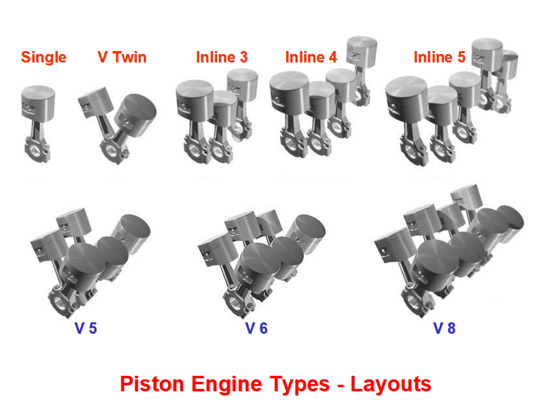

# Today's Agenda {background-image="Images/background-data_blue_v4.png"}

```{r}
library(tidyverse)
library(readxl)
library(kableExtra)
```

<br>

<br>

**Bivariate Analyses**

- Descriptive Statistics and Correlations

<br>

<br>

::: r-stack
Justin Leinaweaver (Spring 2025)
:::

::: notes
Prep for Class

1. Update research question on slide 2

Readings:

- Wheelan chapter 4 "Correlation"
- Wheelan chapter 5 "Basic Probability"
- Chang, W. (2018) [recipe 15.14](https://r-graphics.org/recipe-dataprep-recode-continuous) (Recoding a Continuous Variable to a Categorical Variable))

:::


## Are powerful states more likely to respect the human rights of their citizens? {background-image="Images/background-slate_v2.png" .center}

<br>

```{r, fig.width = 10, fig.height=2}
## Manual DAG
d1 <- tibble(
  x = c(-3, 3),
  y = c(1, 1),
  labels = c("Military\nPower\n(CoW NMC)", "Human rights\nand\nthe rule of law\n(FFP)")
)

ggplot(data = d1, aes(x = x, y = y)) +
  geom_point(size = 8) +
  theme_void() +
  coord_cartesian(xlim = c(-4, 4)) +
  geom_label(aes(label = labels), size = 7) +
  annotate("segment", x = -1.9, xend = 1.85, y = 1, yend = 1, arrow = arrow())
```

::: notes
*Sam's version: How does militarization influence states' violation of human rights?*

<br>

As we build toward answering our research question with data we will need to pick up some new concepts and tools!

- New concepts: Probability and correlation

- New tools: Bivariate descriptive statistics

<br>

**Everybody ready to go with a new script file?**

- I would suggest you put "bivariate analyses" in the name so its easy to find in future!
:::


## Tidyverse Dataset: mpg {background-image="Images/background-slate_v2.png" .center}

<br>

```{r, echo=FALSE}
set.seed(134)

mpg |>
  slice_sample(n = 9) |>
  kbl(digits = 1, align = c('l', 'l', rep('c', 9))) |>
  kableExtra::kable_styling(font_size = 24)
```

::: notes
I'd love to play with more exciting data today and Wednesday, but because we are building your notes for the future I want to use built-in data

- This way, in future, the code should always work

- If we explored external datasets then you'd need the code PLUS the dataset in order to refresh your memory with these notes

<br>

To refresh our memories, the `mpg` dataset is part of the tidyverse package

- The data was produced by the EPA and tracks fuel economy data for 38 popular models of cars in  1999 and 2008.

<br>

The Variables

- Displacement is a proxy for engine size
- Number of cylinders
- Type of transmission
- Type of drive train
- city and highway fuel economy
:::


## 3. Variable type determines the tool {background-image="Images/background-slate_v2.png" .center}

```{r, fig.align='center', out.width='90%'}
knitr::include_graphics("Images/01_2-levels_measurement.png")
```

::: notes
Just as we did previously, we will be guided in learning our new tools by this rule of data science!

- If you know the variable types you are analyzing, choosing the right tool is done for you!
:::


## Bivariate Analyses {background-image="Images/background-slate_v2.png" .center}

**Categorical x Categorical**

<br>

```{r, echo=FALSE}
set.seed(134)

mpg |>
  slice_sample(n = 9) |>
  kbl(digits = 1, align = c('l', 'l', rep('c', 9))) |>
  column_spec(6:7, background = "pink") |>
  kableExtra::kable_styling(font_size = 22)
```

::: notes

Analysis of the relationship between two categorical variables

<br>

**Remind me, what function did we use to calculate descriptive statistics for a single categorical variable?**

- **e.g. to count the levels?**

- (**SLIDE**: table())
:::


## Categorical x Categorical {background-image="Images/background-slate_v2.png" .center .smaller}

<br>

:::: {.columns}
::: {.column width="55%"}
**Univariate Analyses**

```{r}
options(width = 60)
```

```{r, echo=TRUE}
table(mpg$trans)
```

<br>

```{r, echo=TRUE}
table(mpg$drv)
```
:::

::: {.column width="45%"}
**Bivariate Analyses**

```{r, echo=TRUE}
table(mpg$trans, mpg$drv)
```
:::
::::

::: notes
Adding a second variable to the table function is quite simple

- On the left we see that 58 cars are manual transmission with five gears

- On the right we see how that 58 cars is distributed across the different drive trains

<br>

**Make sense?**

<br>

**Which combinations of transmission and drive train are the most common in this data set?**

<br>

**Remind me again, how do we convert a table of counts into a table of proportions?**

- (**SLIDE**: proportions())

:::


## Categorical x Categorical {background-image="Images/background-slate_v2.png" .center .smaller}

<br>

:::: {.columns}
::: {.column width="55%"}
**Univariate Analyses**

```{r}
options(width = 60)
```

```{r, echo=TRUE}
proportions(table(mpg$trans))
```

<br>

```{r, echo=TRUE}
proportions(table(mpg$drv))
```
:::

::: {.column width="45%"}
**Bivariate Analyses**

```{r, echo=TRUE}
proportions(table(mpg$trans, mpg$drv))
```
:::
::::

::: notes
Note for SP23: I just discovered that prop.table() is being replaced by proportions() which makes way more intuitive sense!

<br>

proportions converted the counts to proportions of the entire data set.

<br>

**Any questions on this code or how to interpret the output?**

<br>

**SLIDE**: Practice
:::


## Bivariate Analyses {background-image="Images/background-slate_v2.png" .center}

**Categorical x Categorical**

<br>

What proportion of SUVs (`class`) are four wheel drive (`drv`)?

::: notes
Alright, use these tools to answer this question!
:::


## Bivariate Analyses {background-image="Images/background-slate_v2.png" .center}

**Categorical x Categorical**

<br>

What proportion of SUVs (`class`) are four wheel drive (`drv`)?

```{r, echo=TRUE}
proportions(table(mpg$class, mpg$drv))
```

::: notes
**Ok, why is the answer to my question definitely not 22%?**

- (These are proportions OVERALL)

- (e.g. 22% of ALL the cars in the mpg dataset are 4wd SUVs)

<br>

**SLIDE**: What we want is for R to calculate proportions separately for each class of cars.
:::


## Bivariate Analyses {background-image="Images/background-slate_v2.png" .center}

```{r, echo=TRUE}
# Proportions by Row
proportions(table(mpg$class, mpg$drv), margin = 1)
```

```{r, echo=TRUE}
# Proportions by Column
proportions(table(mpg$class, mpg$drv), margin = 2)
```

::: notes

The 'margin' argument let's you recalculate proportions by either the rows or the columns

<br>

Row margins means each class of car is estimated separately

- 82% of SUVs in the sample are 4wd

- 100% minivans are front wheel drive

<br>

Column margins means each drive train type is estimated separately

- 50% of 4wd cars are SUVs

- Most front weel drive cars are compact (33%), midsize (36%) or subcompact (21%)

<br>

**Any questions on using table and proportions to perform bivariate analyses on two categorical variables?**

- Sometimes you want proportions overall and sometimes you'll want proportions across categories

- Either case, the code is simple!

<br>

**SLIDE**: Let's tie this to the Wheelan chapter on probability you read for class today.
:::


## "Probability is the study of events and outcomes involving an element of uncertainty" {background-image="Images/background-slate_v2.png" .center}

```{r, fig.align='center'}
knitr::include_graphics("Images/08_2-probability.jpg")
```

<br>

Source: Wheelan (2014), 71

::: notes
Wheelan defines "probability" as "the study of events and outcomes involving an element of uncertainty"

<br>

**Any big picture questions on the material in the Wheelan chapter before we use it?**
:::


## "Probability is the study of events and outcomes involving an element of uncertainty" {background-image="Images/background-slate_v2.png" .center}

<br>

```{r, echo=TRUE}
# Proportions by Row
proportions(table(mpg$class, mpg$drv), margin = 1)
```

::: notes

**How confident should we be in using these proportions as estimates of the "true" probabilities?**

- **In other words, how confident are you that 83% of the SUVs on the roads today are 4wd?**

<br>

`mpg` dataset...

- Only includes a sample from two years: 1999 and 2008

- We have no idea how the researchers chose these specific models: 38 "popular" cars

- We have no idea how the EPA chose the cars to study here

<br>

I hope this is helping to reinforce a REALLY important idea for us

- The tools of statistics are frequently used to help us estimate real-world probabilities using things like proportions in a dataset

- HOWEVER, without understanding the measures in our data we really can't say anything about how they represent the probabilities

- BUT, once we understand the measures we CAN say something useful about probability (with uncertainty attached)

<br>

In short, our datasets are a representation of the wider world (the population)

- Only by analyzing where the data came from and pairing that with statistics can we say anything useful about the real world.

<br>

**Any questions on this?**
:::


## Bivariate Analyses {background-image="Images/background-slate_v2.png" .center .smaller}

**Categorical x Numeric**

<br>

```{r, echo=FALSE}
set.seed(134)

mpg |>
  slice_sample(n = 7) |>
  kbl(digits = 1, align = c('l', 'l', rep('c', 9))) |>
  column_spec(7:8, background = "pink") |>
  kableExtra::kable_styling(font_size = 24)
```

::: notes

Now let's shift to bivariate analysis of the relationship between a single categorical and a single numeric variable.

<br>

Using our `mpg` dataset we might ask, do cars with different drive trains have different levels of fuel efficiency?
:::


## Categorical x Numeric {background-image="Images/background-slate_v2.png" .center}

<br>

:::: {.columns}
::: {.column width="45%"}
**Univariate Analyses**

```{r, echo=TRUE}
table(mpg$drv)
```

<br>

```{r, echo=TRUE}
summary(mpg$cty)
```
:::

::: {.column width="10%"}

:::

::: {.column width="45%"}
::: {.r-fit-text}
**Bivariate Analyses**

The Aggregate Function

- aggregate(data, y ~ x, FUN)
:::
:::
::::

::: notes
We'll use the aggregate function to calculate the bivariate version of descriptive statistics

<br>

The aggregate function looks a little different from what we've done so far

- The "data" argument you've seen before

- The "y tilde x" argument is what R refers to as a formula
    - "y" is the NUMERIC outcome you are trying to summarize
    - "x" is the CATEGORICAL predictor
    
- FUN is the argument where you specify a function to apply to the Y variable
    - e.g. summary, sd, mean, median, min, max, etc
    
<br>    

**SLIDE**: Example
:::


## Bivariate Analyses {background-image="Images/background-slate_v2.png" .center}

**Categorical x Numeric**

<br>

The Aggregate Function

```{r}
options(width = 80)
```

```{r, echo=TRUE}
aggregate(data = mpg, cty ~ drv, FUN = summary)
```

<br>

::: {.fragment}
**Practice: Redo the above for highway fuel economy (`hwy`)**
:::

::: notes

So, this code asks R to summarize city fuel economy separately for each type of drive train

<br>

**Questions on this new function?**

<br>

Interpret these results for me

- **What do we learn from comparing the drive trains by fuel economy?**

<br>

As practice, repeat this analysis but for highway fuel economy!

- **SLIDE**
:::


## Bivariate Analyses {background-image="Images/background-slate_v2.png" .center}

**Categorical x Numeric**

<br>

```{r, echo=TRUE}
aggregate(data = mpg, cty ~ drv, FUN = summary)
```

<br>

```{r, echo=TRUE}
aggregate(data = mpg, hwy ~ drv, FUN = summary)
```

::: notes
**What do we learn from this comparison?**
:::


## Bivariate Analyses {background-image="Images/background-slate_v2.png" .center}

**Numeric x Numeric**

<br>

```{r, echo=FALSE}
set.seed(134)

mpg |>
  slice_sample(n = 9) |>
  kbl(digits = 1, align = c('l', 'l', rep('c', 9))) |>
  column_spec(c(3, 8), background = "pink") |>
  kableExtra::kable_styling(font_size = 22)
```

::: notes
Now we shift to bivariate analysis of the relationship between two numeric variables.

- For this challenge you will have two tools to consider 

<br>

1. Transform a numeric into a categorical variable and use aggregate, OR

2. Calculate a correlation
:::


## Bivariate Analyses {background-image="Images/background-slate_v2.png" .center}

**Numeric x Numeric**

<br>

```{r, echo=TRUE}
aggregate(data = mpg, cty ~ displ, FUN = summary)
```

::: notes
**Why is using the aggregate function on two numeric variables a bad idea?**

- **In other words, why should I be SUPER careful when interpreting these results?**

<br>

FIRST big problem is that this will produce a massive and unreadably long table

<br>

SECOND big problem is that many of these rows represent a single observation and summary stats for one observation don't mean what we want it to

- If the goal is to approximate a probabilty then an n of 1 is cartoonishly imprecise

<br>

We solved this kind of problem previously when we moved from drawing bar plots to histograms by hand

- We converted the numeric variable into a categorical variable using bins and counting the levels

- **SLIDE**: Now let's have R do it for us!
:::


## Cut: Convert Numeric to Factor {background-image="Images/background-slate_v2.png" .center}

<br>

cut(x, breaks, labels)

- 'x' is the variable to transform

- 'breaks' lists the cut-off points for the groups

- 'labels' lists the names of the new groups

::: notes
Everybody write down the elements of the cut function

- *step through it*

<br>

This will make more sense when you start applying it
:::


## Cut: Convert Numeric to Factor {background-image="Images/background-slate_v2.png" .center}

<br>

cut(x, breaks, labels)

```{r, echo=TRUE}
# Use the cut function and save the new variable in mpg
mpg$displ2 <- cut(x = mpg$displ, breaks = c(0, 4, 8), 
                  labels = c("Small", "Large"))
```

<br>

```{r, echo=TRUE}
# Check that the new variable was saved
table(mpg$displ2)
```

::: notes

Here's my example of adding a new engine size variable in the mpg data set.

<br>

FIRST, to the left of the arrow I have created a new variable ('displ2') and this will save it in the 'mpg' data set

- Note that this change only lasts while your current instance of R is open. This new variable will disappear the next time you restart RStudio

<br>

SECOND, the breaks argument is three numbers which creates two bins

- The first bin is all displ values between 0-4

- The second bin is all displ values between 4-8

<br>

THIRD, the labels argument lets us name the new groups.

<br>

**Is everybody clear on why there are three numbers in 'breaks' but only two words in 'labels'?**

<br>

**Any questions on how to convert a numeric variable into a categorical variable?**

<br>

Ok, everybody now use aggregate on our new displacement variable!
:::


## Numeric x Numeric (cut) {background-image="Images/background-slate_v2.png" .center}

**Univariate Analysis**
```{r, echo=TRUE}
table(mpg$displ2)
summary(mpg$cty)
```

**Bivariate Analysis**
```{r, echo=TRUE}
aggregate(data = mpg, cty ~ displ2, FUN = summary)
```

::: notes

**What do we learn about the relationship between these two variables?**

- (Small engines get WAY better fuel economy!)

- 5-6 mpg improvement on average

- Max increase from 16 to 35!

<br>

**SLIDE**: Let's practice!
:::


## Numeric x Numeric (cut) {background-image="Images/background-slate_v2.png" .center}

<br>

**Practice: Summarize city fuel economy using the four quartiles of `displ` (e.g. 25th, 50th, 75th and 100th percentile)**

- cut(x, breaks, labels)

- aggregate(data, y ~ x, FUN)

```{r, echo=TRUE}
quantile(mpg$displ)
```

::: notes

Everybody redo this analysis but now let's transform engine size into a FOUR level categorical variable with one level per quartile

- Remember to set your breaks below 1.6 and above 7 so you catch any observations with these exact scores
:::


## Numeric x Numeric {background-image="Images/background-slate_v2.png" .center}

```{r, echo=TRUE}
mpg$displ2 <- cut(x = mpg$displ, 
                  breaks = c(0, 2.4, 3.3, 4.6, 8), 
                  labels = c("1st Quartile", "2nd Quartile", 
                             "3rd Quartile", "4th Quartile"))
```

<br>

```{r, echo=TRUE}
aggregate(data = mpg, cty ~ displ2, FUN = summary)
```

::: notes
**Did everybody get these results?**

<br>

**What does this tell us about the relationship between engine size and fuel economy?**

<br>

So, your first option for calculating descriptive statistics using two numeric variables is to convert one of them into a categorical variable

- **Make sense?**
:::


## Bivariate Analyses {background-image="Images/background-slate_v2.png" .center}

**Numeric x Numeric**

<br>

```{r, echo=FALSE}
set.seed(134)

mpg |>
  select(-displ2) |>
  slice_sample(n = 8) |>
  kbl(digits = 1, align = c('l', 'l', rep('c', 9))) |>
  column_spec(c(3, 8), background = "pink") |>
  kableExtra::kable_styling(font_size = 22)
```

::: notes

Your second option is to calculate the correlation between the two numeric variables.

- **Any questions on correlations from the Wheelan chapter?**

<br>

**Per Wheelan, what are the "fabulous" advantages of correlation?**

1. Measure of linear association

2. Always between -1 and 1

3. No units attached
:::


## Correlation {background-image="Images/background-slate_v2.png" .center}

**1) A Measure of Linear Association**

<br>

```{r, fig.align = 'center', fig.asp = .32, fig.width = 9}
## Show correlations
cor_examples <- function(sd) {
    tibble(
    x = rnorm(50, mean = 8, sd = 2),
    y = x + rnorm(50, 0, sd),
    Group = str_c("Correlation: ", round(cor(x, y), 2))
    )
}

# Generate sims
set.seed(54)
rbind(cor_examples(1),
      cor_examples(3),
      cor_examples(18)) |>
ggplot(aes(x = x, y = y)) +
    geom_point() +
    geom_smooth(method = "lm", se = FALSE) +
    theme_bw() +
  labs(x = "", y = "") +
    facet_wrap(~Group, scales = "free")
```

::: notes
The closer the value to '1', the closer the points are to the line

- **Does the intuition here make sense?**

<br>

Importantly this means correlation is not a good measure when relationships are non-linear!

- More on this in a sec!
:::


## Correlation {background-image="Images/background-slate_v2.png" .center}

**2) Always between -1 and 1**

<br>

```{r, fig.align = 'center', fig.asp = .32, fig.width = 9}
# Show inverse correlations
inv_cor_examples <- function(sd) {
    tibble(
    x = rnorm(50, mean = 8, sd = 2),
    y = -2 * x + rnorm(50, 0, sd),
    Group = str_c("Correlation: ", round(cor(x, y), 2))
    )
}

set.seed(54)
rbind(inv_cor_examples(2),
      inv_cor_examples(6),
      inv_cor_examples(11)) |>
ggplot(aes(x = x, y = y)) +
    geom_point() +
    geom_smooth(method = "lm", se = FALSE) +
    theme_bw() +
  labs(x = "", y = "") +
    facet_wrap(~Group, scales = "free")
```

::: notes

Correlations can be either positive or negative

- Positive: Increases in X are associated with increases in Y

- Negative: Increases in X are associated with decreases in Y

<br>

The key is that as the value approaches 1 or -1 the points get closer to a line

<br>

**Make sense?**
:::


## Correlation {background-image="Images/background-slate_v2.png" .center}

**3) No Units Attached**

<br>

:::: {.columns}
::: {.column width="50%"}
```{r, echo = FALSE, fig.align = 'center'}

```
:::

::: {.column width="50%"}
```{r, echo = FALSE, fig.align = 'center'}

```
:::
::::

::: notes

Correlation provides a numeric representation of a linear relationship REGARDLESS of the underlying units.

<br>

Normally you have to put two things into the same scale to combine or compare them, right?

- e.g. the "apples-and-oranges" problem!

<br>

Correlation focuses on the variation not attached to the units.

<br>

### Make sense?

<br>

**SLIDE**: Let's test ourselves!
:::


## Which has the largest correlation? {background-image="Images/background-slate_v2.png" .center}

```{r, fig.align = 'center', fig.asp = .78, fig.width = 7}
pair1 <- tibble(anscombe[, c("x1", "y1")]) |> rename(x = x1, y = y1) |> mutate(Group = "Example 1")
pair2 <- tibble(anscombe[, c("x2", "y2")]) |> rename(x = x2, y = y2) |> mutate(Group = "Example 2")
pair3 <- tibble(anscombe[, c("x3", "y3")]) |> rename(x = x3, y = y3) |> mutate(Group = "Example 3")
pair4 <- tibble(anscombe[, c("x4", "y4")]) |> rename(x = x4, y = y4) |> mutate(Group = "Example 4")

d <- rbind(pair1, pair2, pair3, pair4)

d |>
    ggplot(aes(x = x, y = y)) +
    geom_point() +
    #geom_smooth(method = "lm", se = FALSE) +
    theme_bw() +
    facet_wrap(~ Group, ncol = 2) +
  labs(x = "", y = "")
```


## Anscombe’s Quartet (1973) {background-image="Images/background-slate_v2.png" .center}

<br>

:::: {.columns}
::: {.column width="50%"}
```{r, fig.align = 'center', fig.asp = .85, fig.width = 6}
pair1 <- tibble(anscombe[, c("x1", "y1")]) |> rename(x = x1, y = y1) |> mutate(Group = "Example 1")
pair2 <- tibble(anscombe[, c("x2", "y2")]) |> rename(x = x2, y = y2) |> mutate(Group = "Example 2")
pair3 <- tibble(anscombe[, c("x3", "y3")]) |> rename(x = x3, y = y3) |> mutate(Group = "Example 3")
pair4 <- tibble(anscombe[, c("x4", "y4")]) |> rename(x = x4, y = y4) |> mutate(Group = "Example 4")

d <- rbind(pair1, pair2, pair3, pair4)

d |>
    ggplot(aes(x = x, y = y)) +
    geom_point() +
    geom_smooth(method = "lm", se = FALSE) +
    theme_bw() +
    facet_wrap(~ Group, ncol = 2) +
  labs(x = "", y = "")
```
:::

::: {.column width="50%"}

<br>

```{r, echo = FALSE}
d |>
    group_by(Group) |>
    summarize(
        MeanX = round(mean(x), 1),
        MeanY = round(mean(y), 1),
        Correlation = round(cor(x,y), 2)
        ) |>
  kbl(align = c("l", "c", "c", "c")) |>
  kableExtra::kable_styling(font_size = 26)
```
:::
::::

::: notes

Lesson: **ALWAYS** visualize your data before interpreting ANY statistic!

- Examples 2 and 3 are REALLY strong indicators of association

- Example 1 is weaker

- Example 4 is non-existent

<br>

### Make sense?

- **SLIDE**: Alright, let's calculate some correlations in R
:::


## Correlations in R {background-image="Images/background-slate_v2.png" .center}

<br>

```{r, echo=TRUE}
# Calculate the correlation
cor(mpg$cty, mpg$hwy)
```

<br>

```{r, echo=TRUE}
# Test of Correlation (Pearsons)
cor.test(mpg$cty, mpg$hwy)
```

::: notes

Two functions to calculate correlations.

- cor() is a simple tool for calculating the correlation coefficient

- cor.test() does the same but includes confidence intervals and a significance test of the correlation.

<br>

**What do we learn about the relationship between city and highway fuel economy from these correlations?**
:::


## Practice using the `diamonds` dataset {background-image="Images/background-slate_v2.png" .center}

```{r}
diamonds |>
  select(price, cut, clarity, carat) |>
  slice_sample(n = 12) |>
  kbl(align = "c") |>
  kableExtra::kable_styling(font_size = 25)
```

::: notes
The diamonds dataset is in the tidyverse package

- It includes details on approximately 54,000 diamonds

- `price` is the dollar value of the diamond

- `cut` is the quality of the cut
    - e.g. Fair, Good, Very Good, Premium, Ideal

- 'clarity' is a measurement of how clear the diamond is
    - e.g. I1 (worst), SI2, SI1, VS2, VS1, VVS2, VVS1, IF (best)
    
- `carat` is the size of the diamond
:::


## Analyze the relationship between: {background-image="Images/background-slate_v2.png" .center}

<br>

1. `cut` and `clarity`

2. `cut` and `price`

3. `carat` and `price` (convert `carat` to a categorical variable)

4. `carat` and `price` (correlation)

**Source:** `diamonds` dataset in tidyverse

::: notes
Practice exercises for next class!
:::


