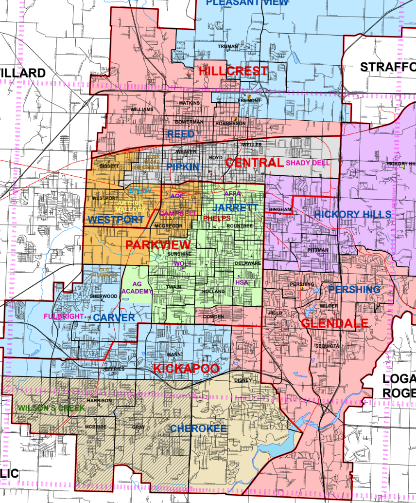

## Today's Agenda {background-image="Images/background-data_blue_v4.png" .center}

```{r}
library(tidyverse)
library(readxl)
library(kableExtra)
library(modelsummary)
```

<br>

::: {.r-fit-text}

**Controlled Comparison Analysis**

- Making causal arguments by adjusting for confounders

:::

<br>

::: r-stack
Justin Leinaweaver (Spring 2026)
:::

::: notes
Prep for Class

1. Review Canvas submissions

2. Markers x 3

<br>

Welcome back from Spring Break!

- **SLIDE**: Let's quickly review our work so far this semester

:::


## {background-image="Images/background-data_blue_v4.png" .center}

### The aim of our class is to generate useful knowledge by analyzing the empirical world

::: {.incremental}

1. Evaluate the measures for validity and reliability

2. Describe the distribution of each measure (univariate analysis)

3. Describe the relationship between two measures (bivariate analysis)

4. Build a causal argument (multivariate analysis)

:::

::: notes

*Read slide*

<br>

**REVEAL**: The first three weeks of the semester we focused on the importance of thinking critically about measurement

- If your data is not valid and reliable there is nothing you can do with it

<br>

**REVEAL**: The next three weeks we focused on the tools you need to perform univariate analyses

- UNTIL you are confident there is actual variation to explain, there is no theory testing to be done!

- Univariate analysis is the step where we figure out if we have a question to answer!

<br>

**REVEAL**: We focused the last two weeks before break on bivariate analysis

- e.g. describing the relationship between two variables

- THIS is where we start building answers to our research questions

<br>

**REVEAL**: Our work of the second half of the semester is to learn the tools and concepts we need to build compelling answers to our research questions

- This will mean grappling with DAGs, types of connections, confounders and uncertainty in our statistics

<br>

**SLIDE**: Before the break we introduced the conceptual challenge of trying to make a causal argument

:::


## Building a Causal Argument {background-image="Images/background-data_blue_v4.png" .center}

<br>

"Causal inference refers to the process of drawing a conclusion that a specific treatment (i.e. intervention) was the 'cause' of the effect (or outcome) that was observed" (Frey 2018). 

<br>

```{r, fig.align = 'center', fig.width = 6, fig.height=1.25}
## Manual DAG
d1 <- tibble(
  x = c(-3, 3),
  y = c(1, 1),
  labels = c("Treatment", "Effect")
)

ggplot(data = d1, aes(x = x, y = y)) +
  geom_point(size = 0, color = "white") +
  theme_void() +
  coord_cartesian(xlim = c(-4, 4)) +
  geom_label(aes(label = labels), size = 7) +
  annotate("segment", x = -1.9, xend = 2.2, y = 1, yend = 1, arrow = arrow())
```

::: notes

Remember, the aim of any scientific discipline is to generate new knowledge that explains why things happen in the world

- We refer to this as explanatory or causal analysis

<br>

Much of this language comes from medicine where they focus on treatments and effects

- Think new medicines and curing a disease

-   For our purposes, think of "treatment to effect" as synonymous with "predictor to outcome."

<br>

In short, we want to demonstrate that changes in our chosen predictors CAUSE a change in the outcome variable

- **SLIDE**: Sounds easy, right?

:::


## Building a Causal Argument {.center background-image="Images/background-data_blue_v4.png"}

<br>

:::: columns
::: {.column width="50%"}


:::

::: {.column width="50%"}


:::
::::

```{r, fig.retina = 3, fig.align = 'center', fig.width = 7, fig.height=1}
## Manual DAG
d1 <- tibble(
  x = c(-3, 3),
  y = c(1, 1),
  labels = c("Class\nSize", "Student\nSuccess")
)

ggplot(data = d1, aes(x = x, y = y)) +
  geom_point(size = 0, color = "white") +
  theme_void() +
  coord_cartesian(xlim = c(-4, 4)) +
  geom_label(aes(label = labels), size = 7) +
  annotate("segment", x = -2.15, xend = 2, y = 1, yend = 1, arrow = arrow())
```

::: notes

Remember, our toy example about class sizes determining student success?

- We hypothesized that smaller class sizes would improve student success through extra teacher attention

<br>

**Why is this such a hard study to execute?**

- **How does this example illustrate the fundamental problem of causation?**

- (We can never observe the counter-factual outcome)

- We either enroll a kid in a small class or a large class and we'll never REALLY know how they would have performed in the other

<br>

**What technique have we developed in science to address this problem?**

- (**SLIDE**: RCT)

:::


## Randomized Controlled Trials (RCTs) {.center background-image="Images/background-data_blue_v4.png"}

```{r, fig.retina=3, fig.align='center', fig.asp=.6, fig.width=10}
## Manual DAG
d2 <- tibble(
  x = c(2.5, 2, 3),
  y = c(3, 2, 2),
  labels = c("Participants", "Treatment\nGroup", "Control\nGroup")
)

ggplot(data = d2, aes(x = x, y = y)) +
  geom_point(size = 0, color = "white") +
  theme_void() +
  coord_cartesian(xlim = c(1.75, 3.25), ylim = c(1.5, 3.25)) +
  geom_label(aes(label = labels), size = 10) +
  annotate("segment", x = 2.5, xend = 2.5, y = 2.85, yend = 2.7, arrow = arrow(length = unit(0.1, "inches"))) +
  annotate("segment", x = 2.5, xend = 2.2, y = 2.5, yend = 2.2, arrow = arrow()) +
  annotate("segment", x = 2.5, xend = 2.85, y = 2.5, yend = 2.2, arrow = arrow()) +
  annotate("text", x = 2.5, y = 2.6, label = "Random Allocation", color = "red", size = 10)
```

::: notes

**How does an RCT help us address the fundamental problem?**

1. Random assignment means that even though both groups are composed of different individuals, the two groups are comparable to each other **on average** in all respects.

2. Random assignment means that the only thing that distinguishes the treatment group from the control group **BESIDES THE TREATMENT** is chance.

<br>

**This ringing a bell from last class and your readings of the textbook?**

<br>

**Why isn't RCT the answer for all our work?**

- **In other words, why is it harder to be a political scientist than a natural scientist? :)**

- (**SLIDE**: Observational data is VERY limiting)
:::


## The Challenge of Observational Data {.center background-image="Images/background-data_blue_v4.png"}

{style="display: block; margin: 0 auto"}

::: notes

Much of what we do in the social sciences is dependent on observational, NOT experimental, data

- e.g. data from observing the world, not directly manipulating it as is done in an RCT.

<br>

We'd love to know the effect of nuclear weapons on the likelihood of war, BUT

- Countries of the world aren't going to let us confiscate all the nukes and then randomly assign them to some countries and not others to see what happens

<br>

**SLIDE**: Example 2

:::


## The Challenge of Observational Data {.center background-image="Images/background-data_blue_v4.png"}

{style="display: block; margin: 0 auto"}

::: notes

Which personal freedoms or civil liberties have the biggest impact on economic growth?

<br>

To run an RCT we just need to get rid of all civil rights in every country THEN reassign them at random

- No problem, right?

<br>

**SLIDE**: So, what happens if your groups are NOT randomly assigned?

:::


## The Challenge of Observational Data {background-image="Images/background-data_blue_v4.png" .center}

<br>

```{r, fig.retina=3, fig.align='center', out.width='77%', fig.asp=.6, fig.width=10}
## Manual DAG
d3 <- tibble(
  x = c(2.5, 2, 3, 2, 3),
  y = c(3, 2, 2, 1, 1),
  labels = c("Nature", "Treatment\n Group", "Control\n Group", "Outcome", "Outcome")
)

ggplot(data = d3, aes(x = x, y = y)) +
  geom_point(size = 0, color = "white") +
  theme_void() +
  coord_cartesian(xlim = c(1.75, 3.25), ylim = c(0.75, 3.25)) +
  geom_label(aes(label = labels), size = 10) +
  annotate("segment", x = 2.5, xend = 2.2, y = 2.85, yend = 2.25, arrow = arrow()) +
  annotate("segment", x = 2.5, xend = 2.85, y = 2.85, yend = 2.25, arrow = arrow()) +
  annotate("segment", x = 2, xend = 2, y = 1.75, yend = 1.15, arrow = arrow()) +
 annotate("segment", x = 3, xend = 3, y = 1.75, yend = 1.15, arrow = arrow())
```

::: notes

IF nature assigns our groups then:

- FIRST, we can no longer assume that the groups are identical on average, AND

- SECOND, if the groups are not identical on average then we CANNOT assume the outcomes of group 1 are the counter-factual outcomes for group 2!

<br>

Put these together and that means we cannot interpret the differences between the groups as a causal effect, just an association

- Hence, analyses of observational data often runs into the "correlation is not causation" criticism

<br>

**SLIDE**: So, what do we do?

:::


## Making Controlled Comparisons {background-image="Images/background-data_blue_v4.png" .center}

```{r, fig.retina=3, fig.align='center', fig.asp=.6, fig.width=8}
## Manual DAG
d1 <- tibble(
  x = c(1, 2, 3),
  y = c(1, 2, 1),
  labels = c("Treatment", "Confounder", "Outcome")
)

ggplot(data = d1, aes(x = x, y = y)) +
  geom_point(size = 0, color = "white") +
  theme_void() +
  coord_cartesian(xlim = c(0, 4), ylim = c(.75, 2.25)) +
  geom_label(aes(label = labels), size = 7) +
  annotate("segment", x = 1.5, xend = 2.5, y = 1, yend = 1, arrow = arrow()) +
  annotate("segment", x = 1.7, xend = 1, y = 1.85, yend = 1.15, arrow = arrow()) +
  annotate("segment", x = 2.3, xend = 3, y = 1.85, yend = 1.15, arrow = arrow())
```

::: notes

We develop **identification strategies** that identify the **confounders** in our observational relationships.

- This is what the textbook refers to as a "controlled comparison" (p160)

<br>

How do we know if a variable is a confounder in our relationship?

- In short, a confounder is a variable that explains some of the variation in both the treatment and the outcome variables.

- In other words, the confounder causes at least some of the variation in the predictor, AND

- The confounder causes at least some of the variation in the outcome.

<br>

Two arguments required to establish a confounder:

1. The confounder MUST cause BOTH variables in the mechanism

2. The direction of effect is FROM the confounder TO the mechanism

<br>

**SLIDE**: Let's go back to our toy example to think about what it means to identify the confounders

:::


## Our Challenge {background-image="Images/background-data_blue_v4.png"}

**Estimating Causal Effects Using Observational Data**

{.absolute left=75 width="40%"}

{.absolute top=150 right=75 width="33%"}

{.absolute bottom=20 right=75 width="33%"}

::: notes

Let's keep going with our student success research, but shift to using observational data.

<br>

Let's say the local school board has agreed to give us last year's anonymized data on all of the third grade students in Springfield

-   e.g. The size of their classes and their end of year test scores

<br>

This is all observational data from the recent past so we have no opportunity to move anybody around

- We just have groups determined by who is already enrolled in each school and the class sizes available at that school

<br>

A good strategy to identifying the confounders is to map out what we call the Data Generating Process (DGP)

- **SLIDE**: Let's start with the predictor, class sizes

:::


## The Data Generating Process (DGP) {.center background-image="Images/background-data_blue_v4.png"}

<br>

```{r, fig.retina=3, fig.align='center', fig.asp=.6, fig.width=10}
## Manual DAG
d2 <- tibble(
  x = c(2.5, 2, 3),
  y = c(3, 2, 2),
  labels = c("Nature", "Small\nClasses", "Large\nClasses")
)

ggplot(data = d2, aes(x = x, y = y)) +
  geom_point(size = 0, color = "white") +
  theme_void() +
  coord_cartesian(xlim = c(1.75, 3.25), ylim = c(1.75, 3.25)) +
  geom_label(aes(label = labels), size = 10) +
  #annotate("text", x = 2.5, y = 2.6, label = "::: notes?????????", color = "red", size = 10) +
  #annotate("segment", x = 2.5, xend = 2.5, y = 2.9, yend = 2.7, arrow = arrow()) +
  annotate("segment", x = 2.5, xend = 2.15, y = 2.9, yend = 2.2, arrow = arrow()) +
  annotate("segment", x = 2.5, xend = 2.85, y = 2.9, yend = 2.2, arrow = arrow())
```

::: notes

Let's start by focusing on the DGP for the predictor in our question

- **In the real world, what mechanisms do you think explain why some students are in small classes and others are in large classes?**

- *BRAINSTORM ON BOARD*

- *GIVE THIS EXERCISE TIME TO BREATHE, WORK IN GROUPS BEFORE AS A CLASS*

<br>

- Wealthier families more likely to spend money (private tuition, move into a better district) to get their kids into smaller classes/better schools

- Some kids might be in smaller class sizes because their district is more rural (e.g. fewer kids)

- Some kids might be in smaller class sizes because they have special needs

- Number of students in district

- Level of funding from state / equalization of resources

- Number of schools in district

<br>

So, unlike in the RCT example we can see that we have a number of reasons to suspect that in the real world these two groups **ARE NOT** identical on average.

-   If the groups are not identical on average then we **cannot** interpret differences in the outcome as a measure of the effect of class sizes.

-   It is actually the effect of **class size differences + the effect of any other differences between the groups**

<br>

**SLIDE**: But that's only half the problem!

:::


## The Data Generating Process (DGP) {.center background-image="Images/background-data_blue_v4.png"}

<br>

```{r, fig.retina=3, fig.align='center', fig.asp=.6, fig.width=10}
## Manual DAG
d3 <- tibble(
  x = c(2.5, 2, 3),
  y = c(3, 2, 2),
  labels = c("Nature", "Low\nScores", "High\nScores")
)

ggplot(data = d3, aes(x = x, y = y)) +
  geom_point(size = 0, color = "white") +
  theme_void() +
  coord_cartesian(xlim = c(1.75, 3.25), ylim = c(1.75, 3.25)) +
  geom_label(aes(label = labels), size = 10) +
  # annotate("text", x = 2.5, y = 2.6, label = "????????????", color = "red", size = 10) +
  # annotate("segment", x = 2.5, xend = 2.5, y = 2.9, yend = 2.7, arrow = arrow()) +
  annotate("segment", x = 2.5, xend = 2.15, y = 2.9, yend = 2.2, arrow = arrow()) +
  annotate("segment", x = 2.5, xend = 2.85, y = 2.9, yend = 2.2, arrow = arrow())

```

::: notes

We also need to describe the DGP for our outcome variable!

<br>

**In the real world, what mechanisms do you think explain why some students get high scores on standardized tests and why others get lower scores?**

- *BRAINSTORM ON BOARD*

- *GIVE THIS EXERCISE TIME TO BREATHE, WORK IN GROUPS BEFORE AS A CLASS*

<br>

-   Wealthy families more likely to provide tutoring, read to their kids, provide enough food and healthcare so they can succeed at school

-   Highly educated families more likely to make education a priority

-   Some students have higher aptitude for test-taking than others

-   Some student experience stronger test anxiety than others

-   Willingness to hard work,

<br>

Now we have two lists that together represent the parts we know of our DGP.

- The effect of class sizes on student success is the part we don't know

<br>

**SLIDE**: Now to the confounders

:::


## Making Controlled Comparisons {background-image="Images/background-data_blue_v4.png" .center}

```{r, fig.retina=3, fig.align='center', fig.asp=.6, fig.width=8}
## Manual DAG
d1 <- tibble(
  x = c(1, 2, 3),
  y = c(1, 2, 1),
  labels = c("Class\nSize", "Confounder", "Student\nSuccess")
)

ggplot(data = d1, aes(x = x, y = y)) +
  geom_point(size = 0, color = "white") +
  theme_void() +
  coord_cartesian(xlim = c(0, 4), ylim = c(.75, 2.25)) +
  geom_label(aes(label = labels), size = 7) +
  annotate("segment", x = 1.5, xend = 2.5, y = 1, yend = 1, arrow = arrow()) +
  annotate("segment", x = 1.7, xend = 1, y = 1.85, yend = 1.15, arrow = arrow()) +
  annotate("segment", x = 2.3, xend = 3, y = 1.85, yend = 1.15, arrow = arrow())
```

::: notes

Here's the idea: Anything on BOTH lists are confounders

- e.g. reasons the two groups are not identical on average

- Anything on both lists confounds the relationship we are trying to measure!

- **Make sense?**

<br>

Our work moving forward in this class will focus on learning statistical approaches for adjusting our analyses for confounders

<br>

**SLIDE**: Let's review your assignment for today as a means to practice applying these concepts

:::


## {background-image="Images/background-data_blue_v4.png" .center}

::: {.r-fit-text}
**Pollock & Edwards Exercise 1: Brainstorming Confounders**
:::

<br>

**Hypotheses**

1. In a comparison of individuals, younger people are more likely to vote Democratic than are older people.

2. In a comparison of countries, democracies are less likely than nondemocracies to initiate international military conflict.

3. In a comparison of individuals, southerners are less likely to turn out to vote than are nonsoutherners.

::: notes

*Split class into three groups*

- Go sit with your group and claim space on the board

- *Assign one hypothesis to each group*

<br>

GROUPS

1. Convert this hypothesis into a DAG, and

2. Add AT LEAST one confounder to the DAG

<br>

*PRESENT and DISCUSS each*

<br>

*Chapter notes*

- "In controlled comparison research, the observed relationship between an independent variable (X) and a dependent variable (Y) may be caused by some other, uncontrolled compositional difference (Z). So, we always ask, 'How else, besides the independent variable, are the groups I am comparing not the same?'" 

- H1 example answer: Level of education - Younger people might have higher levels of education compared to older individuals, and education is often associated with Democratic voting patterns. If education influences both age and voting behavior, then differences in education, not age, could explain the relationship between age and voting preference.

- H2 example answer: Level of economic development - Democracies are often economically developed, and wealthier nations may have less incentive to engage in military conflict due to economic interdependence or stronger diplomatic resources. If economic development affects both regime type and likelihood of conflict, then the observed relationship might be due to differences in economic status rather than democracy itself.

- H3 example answer: Socioeconomic status - Southerners may have lower average income or education levels, which are factors associated with lower voter turnout. If socioeconomic differences explain both regional identity and voting behavior, then these compositional differences, rather than regional identity, could account for the relationship.

:::


## {background-image="Images/background-data_blue_v4.png" .center .smaller}

::: {.r-fit-text}
**Pollock & Edwards Exercise 2: Spurious Relationships**
:::

<br>

**Conclusions**

1. Students who smoke (X) earn lower grades (Y) than students who do not smoke. Conclusion: Smoking causes poor grades.

2. Expectant mothers who drink bottled water (X) have healthier babies (Y) than do expectant mothers who do not drink bottled water. Conclusion: Drinking bottled water causes healthier babies to be born.

3. Tea drinkers (X) are more likely to be Democrats (Y) than are non–tea drinkers. Conclusion: Tea drinking causes people to become Democrats.

::: notes

*Split class into three groups*

- Go sit with your group and claim space on the board

- *Assign one hypothesis to each group*

<br>

GROUPS: Identify the confounder that shows this relationship is spurious!

<br>

*PRESENT and DISCUSS each*

<br>

**SLIDE**: Wrapping up

<br>

*Chapter notes*

- Each of the conclusions listed below (A, B, and C) is based on a relationship between X and Y that is completely spurious. For each one, do the following: (i) Think up a plausible variable, Z, that defines a compositional difference across the values of X. (ii) Describe how Z creates the relationship between X and Y.

- 1. Time spent studying (Z) - Students who smoke may spend less time studying compared to non-smoking students. Less time spent studying leads to lower grades (Y). As smoking behavior (X) varies, study time (Z) also varies, which affects grades (Y).

- 2. Socioeconomic status (Z) - Expectant mothers who drink bottled water might have higher socioeconomic status, which gives them access to better healthcare and nutrition, leading to healthier babies (Y). As bottled water consumption (X) varies, socioeconomic status (Z) also varies, driving the relationship with baby health (Y).

- 3. Regional culture (Z) - Tea drinking may be more prevalent in regions or communities that also lean Democratic politically. Regional culture (Z) influences both tea consumption (X) and political affiliation (Y), creating the observed relationship.

:::


## Making Controlled Comparisons {background-image="Images/background-data_blue_v4.png" .center}

```{r, fig.retina=3, fig.align='center', fig.asp=.6, fig.width=8}
## Manual DAG
d1 <- tibble(
  x = c(1, 2, 3),
  y = c(1, 2, 1),
  labels = c("Treatment", "Confounder", "Outcome")
)

ggplot(data = d1, aes(x = x, y = y)) +
  geom_point(size = 0, color = "white") +
  theme_void() +
  coord_cartesian(xlim = c(0, 4), ylim = c(.75, 2.25)) +
  geom_label(aes(label = labels), size = 7) +
  annotate("segment", x = 1.5, xend = 2.5, y = 1, yend = 1, arrow = arrow()) +
  annotate("segment", x = 1.7, xend = 1, y = 1.85, yend = 1.15, arrow = arrow()) +
  annotate("segment", x = 2.3, xend = 3, y = 1.85, yend = 1.15, arrow = arrow())
```

::: notes

**Ok, how are we doing with the material on making causal arguments?**

- **Any questions on the material in chapters 6 and 7 on research design and making controlled comparisons?**

<br>

**SLIDE**: For next class

:::


## For Next Class {.center background-image="Images/background-data_blue_v4.png"}

<br>

::: {.r-fit-text}

**Chapter 7 Assessments (Part 2)**

1. Exercise 4

2. Exercise 5

:::

::: notes

Next two questions in the textbook will help you keep exploring these ideas.

- **Questions on the assignment?**

:::
