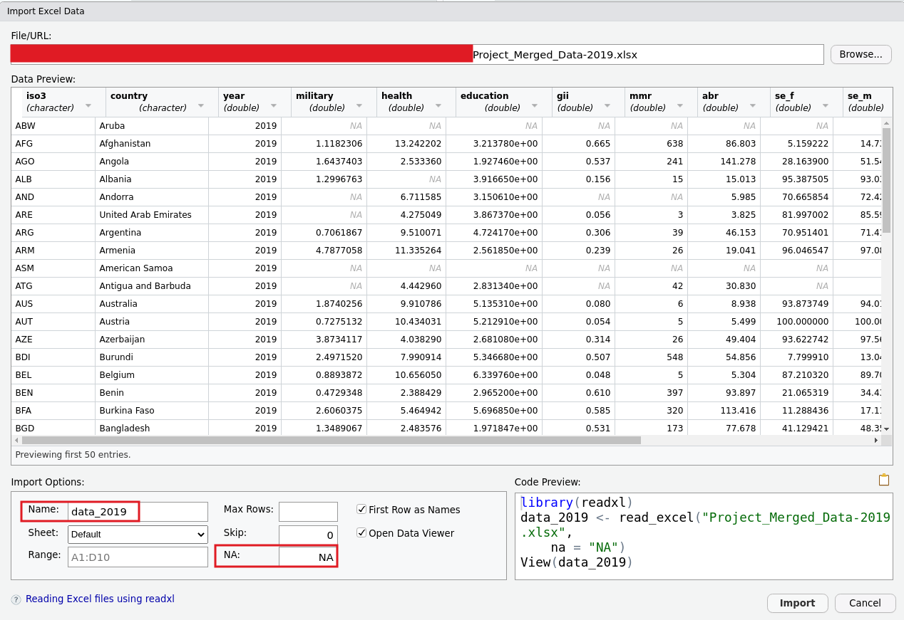

---
output:
  xaringan::moon_reader:
    css: ["default", "extra.css"]
    lib_dir: libs
    seal: false
    nature:
      highlightStyle: github
      highlightLines: true
      countIncrementalSlides: false
      ratio: '16:9'
---

```{r, echo = FALSE, warning = FALSE, message = FALSE}
##xaringan::inf_mr()
## For offline work: https://bookdown.org/yihui/rmarkdown/some-tips.html#working-offline
## Images not appearing? Put images folder inside the libs folder as that is the main data directory

library(tidyverse)
library(readxl)
library(kableExtra)
##library(modelr)

knitr::opts_chunk$set(echo = FALSE,
                      eval = TRUE,
                      error = FALSE,
                      message = FALSE,
                      warning = FALSE,
                      comment = NA)

# Restrict diamonds dataset
set.seed(154)
diamonds <- slice_sample(diamonds, n = 5000)
```

background-image: url('libs/Images/background-data_blue_v3.png')
background-size: 100%
background-position: center
class: middle, inverse

.size80[**Today's Agenda**]

<br>

.size50[
1. Polish bivariate visualizations

2. Apply bivariate analyses to our research project
]

<br>

.center[.size40[
  Justin Leinaweaver (Spring 2024)
]]

???

## Prep for Class
1. ?


---

background-image: url('libs/Images/background-teal3.png')
background-size: 100%
background-position: center
class: middle

.center[.size60[**Bivariate Analyses for our Project**]]

.size40[
1. Descriptive Statistics by Group
    - Counts, Proportions, Means, Medians, Standard Deviations, Percentiles, Ranges, Interquartile Ranges (IQR) and Correlations

2. Visualizations
    - Bar plots (stacked, side-by-side, proportions), box plots and scatter plots
]

???


---

class: middle

.pull-left[
.code70[
```{r, echo=TRUE, fig.align='center', fig.asp=.6, fig.retina=3, out.width='70%', cache=TRUE}
ggplot(diamonds, aes(x = carat, y = price)) +
  geom_point(alpha = .1) +
  scale_y_continuous(labels = scales::dollar_format()) #<<
```

```{r, echo=TRUE, fig.align='center', fig.asp=.6, fig.retina=3, out.width='70%', cache=TRUE}
ggplot(diamonds, aes(x = carat, y = price)) +
  geom_point(alpha = .1) +
  scale_y_continuous(labels = scales::comma_format()) #<<
```
]]

.pull-right[
.code70[
```{r, echo=TRUE, fig.align='center', fig.asp=.6, fig.retina=3, out.width='70%', cache=TRUE}
ggplot(diamonds, aes(x = carat, y = price)) +
  geom_point(alpha = .1) +
  scale_y_continuous(labels = scales::scientific_format()) #<<
```

```{r, echo=TRUE, fig.align='center', fig.asp=.6, fig.retina=3, out.width='70%', cache=TRUE}
ggplot(diamonds, aes(x = carat, y = price)) +
  geom_point(alpha = .1) +
  scale_y_continuous(labels = scales::percent_format()) #<<
```
]]

???


---

class: middle

.pull-left[
.code70[
```{r, echo=TRUE, fig.align='center', fig.asp=.6, fig.retina=3, out.width='70%'}
ggplot(mpg, aes(x = class, fill = drv)) +
  geom_bar(position = "fill") +
  theme(legend.position = "top") #<<
```

```{r, echo=TRUE, fig.align='center', fig.asp=.6, fig.retina=3, out.width='70%'}
ggplot(mpg, aes(x = class, fill = drv)) +
  geom_bar(position = "fill") +
  theme(legend.position = "bottom") #<<
```
]]

.pull-right[
.code70[
```{r, echo=TRUE, fig.align='center', fig.asp=.6, fig.retina=3, out.width='70%'}
ggplot(mpg, aes(x = class, fill = drv)) +
  geom_bar(position = "fill") +
  theme(legend.position = "left") #<<
```

```{r, echo=TRUE, fig.align='center', fig.asp=.6, fig.retina=3, out.width='70%'}
ggplot(mpg, aes(x = class, fill = drv)) +
  geom_bar(position = "fill") +
  theme(legend.position = "right") #<<
```
]]

???

legend placement


---

class: middle

.pull-left[
.code70[
```{r, echo=TRUE, fig.align='center', fig.asp=.6, fig.retina=3, out.width='70%'}
ggplot(mpg, aes(x = class, fill = drv)) +
  geom_bar(position = "fill") +
  scale_fill_manual(values = c("orange", "green", "blue")) #<<
```

```{r, echo=TRUE, fig.align='center', fig.asp=.6, fig.retina=3, out.width='70%'}
ggplot(mpg, aes(x = class, fill = drv)) +
  geom_bar(position = "fill") +
  scale_fill_grey() #<<
```
]]

.pull-right[
.code70[
```{r, echo=TRUE, fig.align='center', fig.asp=.6, fig.retina=3, out.width='70%'}
ggplot(mpg, aes(x = class, fill = drv)) +
  geom_bar(position = "fill") +
  scale_fill_brewer(type = "qual", palette = 1) #<<
```

```{r, echo=TRUE, fig.align='center', fig.asp=.6, fig.retina=3, out.width='70%'}
ggplot(mpg, aes(x = class, fill = drv)) +
  geom_bar(position = "fill") +
  scale_fill_brewer(type = "seq", palette = 1) #<<
```
]]

???

bars colors


---

class: middle

```{r, echo=TRUE, fig.align='center', fig.asp=.6, fig.retina=3, out.width='70%'}
ggplot(mpg, aes(x = class, fill = drv)) +
  geom_bar(position = "fill") +
  scale_fill_brewer(type = "qual", palette = 1, #<<
                    labels = c("Four Wheel", "Front Wheel", "Rear Wheel")) + #<<
  labs(fill = "Drive Train") #<<
```

???

legend labels


---

background-image: url('libs/Images/background-blue_cubes_lighter3.png')
background-size: 100%
background-position: center
class: middle

```{r, echo = FALSE, fig.align = 'center', out.width = '83%'}

```


---

background-image: url('libs/Images/background-blue_cubes_lighter3.png')
background-size: 100%
background-position: center
class: middle

.center[.size65[**Report 3: Bivariate Analyses**]]

.size45[
1. Make a scatterplot .textblue[**AND**] calculate the correlation for each (2019 only):
    - GII x military
    - GII x education
    - GII x health

2. Repeat the above using the all years data set.
]

???

**SAVE TIME TO GIVE THEM A HEAD'S UP ON READINGS FOR MONDAY!!!!**

<br>

Part 1 requires you to make three scatterplots and discuss the correlations for each in your analysis.

<br>

Part 2 requires you to do the same thing but using the data set with all years included.

### Questions on the assignment?

- So, today you make six scatterplots and calculate six correlations.

<br>

```{r, echo=TRUE, eval=FALSE}
library(tidyverse)
library(readxl)

d <- read_excel("../Project-SP23/Project_Merged_Data-2019.xlsx", na = "NA")
d

cor.test(d$gii, d$military)
cor.test(d$gii, d$education)
cor.test(d$gii, d$health)

ggplot(d, aes(x = military, y = gii)) +
  geom_point() +
  geom_smooth(method = "lm")

ggplot(d, aes(x = education, y = gii)) +
  geom_point() +
  geom_smooth(method = "lm")

ggplot(d, aes(x = health, y = gii)) +
  geom_point() +
  geom_smooth(method = "lm")

### Across time
d <- read_excel("../Project-SP23/Project_Merged_Data-2008-2019.xlsx", na = "NA")

cor.test(d$gii, d$military)
cor.test(d$gii, d$education)
cor.test(d$gii, d$health)

ggplot(d, aes(x = military, y = gii)) +
  geom_point() +
  geom_smooth(method = "lm")

ggplot(d, aes(x = education, y = gii)) +
  geom_point() +
  geom_smooth(method = "lm")

ggplot(d, aes(x = health, y = gii)) +
  geom_point() +
  geom_smooth(method = "lm")
```


---

background-image: url('libs/Images/background-blue_cubes_lighter3.png')
background-size: 100%
background-position: center
class: middle

.size80[**For Next Class**]

.size65[
1. Wheelan chapter 11 "Regression"
]

???

Next week we start regressions!

- Make sure to do the readings BEFORE class or you're going to be lost when we get to work on Monday!


