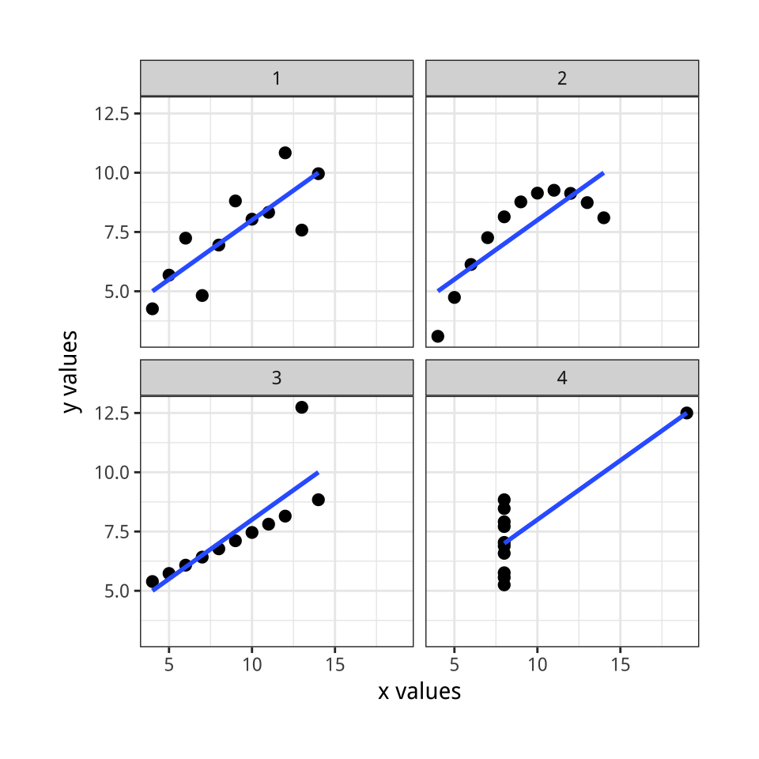

---
output:
  beamer_presentation:
    theme: "CambridgeUS"
    colortheme: "dolphin"
    fonttheme: "structurebold"
    df_print: kable
fontsize: 14pt
classoption: "aspectratio=169"
header-includes:
- \usepackage{caption}
- \captionsetup[figure]{labelformat=empty}
- \captionsetup[table]{labelformat=empty}
- \setbeamertemplate{page number in head/foot}[]{}
---

```{r, echo = FALSE, warning = FALSE, message = FALSE}
## Render the pdf
##rmarkdown::render(input = "./08_2-Correlation_and_Bivariate_Viz.Rmd", output_file = "./08_2-Correlation_and_Bivariate_Viz.pdf")

library(tidyverse)
library(readxl)
library(stargazer)
##library(kableExtra)
library(modelr)

knitr::opts_chunk$set(echo = FALSE,
                      eval = TRUE,
                      error = FALSE,
                      message = FALSE,
                      warning = FALSE,
                      comment = NA)
```


## Today's Agenda
\Large

\vspace{.2in}

\textbf{Bivariate Analyses}

1. Descriptive statistics by group

2. Bivariate visualizations

3. Correlations

\vspace{.2in}

\normalsize
\begin{center}
Justin Leinaweaver (Fall 2021)
\end{center}


## Practice Data
::: columns
:::: column
\center
\includegraphics[keepaspectratio=true,width=.48\paperwidth]{Images/08_2-diamonds.png}

::::
:::: column
\vspace{.5in}
\textbf{Tidyverse Dataset: diamonds}

\vspace{.25in}

A dataset containing the prices and other attributes of almost 54,000 diamonds.

\vspace{.2in}

\small
```{r, eval=FALSE, echo=TRUE}
# To access the data
library(tidyverse)
```
::::
:::


## Bivariate Analyses: 1. Stats by Group
```{r, echo = TRUE, eval = FALSE}
## 1) Categorical Predictor x Numerical Outcome
dataset |>
   group_by(Categorical_Predictor) |>
   summarize(
     N = n(),
     Mean = mean(Outcome),
     StdDev = sd(Outcome)
)
```


## Bivariate Analyses: 1. Stats by Group
\center
**On average, are diamonds with fewer imperfections (`clarity`) more expensive (`price`)?** 

\vspace{.2in}

\small
```{r, echo = TRUE, eval = FALSE}
## 1) Categorical Predictor x Numerical Outcome
dataset |>
   group_by(Categorical_Predictor) |>
   summarize(
     N = n(),
     Mean = mean(Outcome),
     StdDev = sd(Outcome)
)
```


## {.plain}
::: columns
:::: column

\footnotesize
```{r, echo = TRUE, eval = TRUE}
diamonds |>
   group_by(clarity) |>
   summarize(
     N = n(), 
     Mean = round(mean(price), 2),
     StdDev = sd(price)
)
```

::::
:::: column
\vspace{.5in}

\center

\includegraphics[keepaspectratio=true,width=.45\paperwidth]{Images/08_2-diamonds.png}

::::
:::


## Bivariate Analyses: 1. Stats by Group {.plain}
::: columns
:::: column
\vspace{.4in}

\small
```{r, echo = TRUE, eval = FALSE}
## What happens with a numerical
## variable in group_by?
diamonds |>
   group_by(depth) |>
   summarize(
     N = n(), 
     Mean = mean(price),
     StdDev = sd(price)
)
```

::::
:::: column

\footnotesize
```{r, echo = FALSE, eval = TRUE}
## What happens with a numerical variable in group_by?
diamonds |>
   group_by(depth) |>
   summarize(
     N = n(), 
     Mean = mean(price),
     StdDev = sd(price)
) |> slice(1:15)
```

::::
:::


## Bivariate Analyses: 1. Stats by Group {.plain}
\small
```{r, echo = TRUE, eval = TRUE}
## cut(): numerical -> categorical
## Chang (2018) Recipe 15.14
diamonds2 <- diamonds |>
  mutate(
    depth2 = cut(x = depth, breaks = c(0, 61.8, 100), 
                 labels = c("Percentiles < 50", "Percentiles > 50"))
  )

## Make a table of the new predictor
table(diamonds2$depth2)
```


## Bivariate Analyses: 1. Stats by Group {.plain}
\small
```{r, echo=TRUE}
diamonds2 |>
  group_by(depth2) |>
   summarize(
     N = n(), 
     Mean = mean(price),
     StdDev = sd(price)
)
```


## Bivariate Analyses: 1. Stats by Group {.plain}
\small
```{r, echo=TRUE}
## See Chang (2018) 15.14
diamonds2 <- diamonds |>
  mutate(
    depth2 = cut(x = depth, breaks = c(40, 61.8, 80), 
                 labels = c("Bottom 50%", "Top 50%"))
  )
```

\vspace{.3in}
\large

\begin{center}
\textbf{Redo the above code but break `depth` into four quartiles.}

(e.g. 0-25\%, 25-50\%, 50-75\%, 75-100\%)
\end{center}


## {.plain}
\vspace{.15in}
\footnotesize
```{r, echo=TRUE}
diamonds2 <- diamonds |>
  mutate(
    depth2 = cut(x = depth, breaks = c(0, 61, 61.8, 62.5, 100), 
                 labels = c("0-25%", "26-50%", "51-75%", "76-100%")))

diamonds2 |>
  group_by(depth2) |>
   summarize(
     N = n(), 
     Mean = mean(price),
     StdDev = sd(price)
)
```


## Bivariate Analyses: 2. Bivariate visualizations
\large

1. Categorical x Categorical: Side-by-side bar plots

2. Categorical x Categorical: Stacked bar plots

3. Categorical x Categorical: Stacked, proportional bar plots

4. Categorical x Numerical: Box Plots

5. Numerical x Numerical: Scatter plots


## 2. Bivariate Viz: Categorical x Categorical
\small
```{r, echo = TRUE, fig.asp = 0.5, fig.width = 6, fig.align = 'center', out.height = '65%'}
## Side-by-side bar plots
ggplot(data = diamonds, aes(x = cut, fill = clarity)) +
  geom_bar(position = "dodge")
```


## 2. Bivariate Viz: Categorical x Categorical
\small
```{r, echo = TRUE, fig.asp = 0.5, fig.width = 6, fig.align = 'center', out.height = '65%'}
## Stacked bar plots
ggplot(data = diamonds, aes(x = cut, fill = clarity)) +
  geom_bar(position = "stack")
```


## 2. Bivariate Viz: Categorical x Categorical
\small
```{r, echo = TRUE, fig.asp = 0.5, fig.width = 6, fig.align = 'center', out.height = '65%'}
## Stacked, proportional bar plots
ggplot(data = diamonds, aes(x = cut, fill = clarity)) +
  geom_bar(position = "fill")
```


## 2. Bivariate Viz: Categorical x Numerical
\small
```{r, echo = TRUE, fig.asp = 0.5, fig.width = 6, fig.align = 'center', out.height = '65%'}
## Box plots
ggplot(data = diamonds, aes(x = clarity, y = price)) +
  geom_boxplot()
```


## 2. Bivariate Viz: Numerical x Numerical
\small
```{r, echo = TRUE, fig.asp = 0.5, fig.width = 6, fig.align = 'center', out.height = '65%'}
## Scatter plots
ggplot(data = diamonds, aes(x = carat, y = price)) +
  geom_point()
```


## 2. Bivariate Viz: Numerical x Numerical
\small
```{r, echo = TRUE, fig.asp = 0.5, fig.width = 6, fig.align = 'center', out.height = '65%'}
## Scatter plots
ggplot(data = diamonds, aes(x = carat, y = price)) +
  geom_point(alpha = .05)
```


## Bivariate Analyses: 3. Correlations
\center
\huge

**Any questions on correlations from the chapter?**

\vspace{.2in}

\Large

(e.g. What are the "fabulous" advantages of correlation?)


## Bivariate Analyses: 3. Correlations
\Large

**The "Fabulous" Advantages**

+ Measure of linear association

+ Always between -1 and 1

+ No units attached


## Question: Are X and Y correlated?
```{r, fig.align = 'center', out.width = '60%', fig.asp = .75, fig.width = 6}
## Show correlations
cor_examples <- function(sd) {
    tibble(
    x = rnorm(50, mean = 8, sd = 2),
    y = x + rnorm(50, 0, sd),
    Group = str_c("Correlation: ", round(cor(x, y), 2))
    )
}

set.seed(54)
p1 <- cor_examples(1.5) |>
  ggplot(aes(x = x, y = y)) +
    geom_point() +
    #geom_smooth(method = "lm", se = FALSE) +
    theme_bw()

p1
```


## X and Y show a strong, positive correlation
```{r, fig.align = 'center', out.width = '60%', fig.asp = .75, fig.width = 6}
p1 +
  geom_smooth(method = "lm", se = FALSE) +
  facet_wrap(~Group, scales = "free")
```


## Correlation: The Degree of Linear Association
```{r, fig.align = 'center', out.width = '98%', fig.asp = .32, fig.width = 9}

set.seed(54)
rbind(cor_examples(1),
      cor_examples(3),
      cor_examples(18)) |>
ggplot(aes(x = x, y = y)) +
    geom_point() +
    geom_smooth(method = "lm", se = FALSE) +
    theme_bw() +
  labs(x = "", y = "") +
    facet_wrap(~Group, scales = "free")
```


## Correlation: Positive or Negative Associations
```{r, fig.align = 'center', out.width = '98%', fig.asp = .32, fig.width = 9}
## Show inverse correlations
inv_cor_examples <- function(sd) {
    tibble(
    x = rnorm(50, mean = 8, sd = 2),
    y = -2 * x + rnorm(50, 0, sd),
    Group = str_c("Correlation: ", round(cor(x, y), 2))
    )
}

set.seed(54)
rbind(inv_cor_examples(2),
      inv_cor_examples(6),
      inv_cor_examples(11)) |>
ggplot(aes(x = x, y = y)) +
    geom_point() +
    geom_smooth(method = "lm", se = FALSE) +
    theme_bw() +
  labs(x = "", y = "") +
    facet_wrap(~Group, scales = "free")
```


## Which has the largest correlation?
```{r, fig.align = 'center', out.height = '90%', fig.asp = .78, fig.width = 5}
pair1 <- tibble(anscombe[, c("x1", "y1")]) |> rename(x = x1, y = y1) |> mutate(Group = "Example 1")
pair2 <- tibble(anscombe[, c("x2", "y2")]) |> rename(x = x2, y = y2) |> mutate(Group = "Example 2")
pair3 <- tibble(anscombe[, c("x3", "y3")]) |> rename(x = x3, y = y3) |> mutate(Group = "Example 3")
pair4 <- tibble(anscombe[, c("x4", "y4")]) |> rename(x = x4, y = y4) |> mutate(Group = "Example 4")

d <- rbind(pair1, pair2, pair3, pair4)

d |>
    ggplot(aes(x = x, y = y)) +
    geom_point() +
    #geom_smooth(method = "lm", se = FALSE) +
    theme_bw() +
    facet_wrap(~ Group, ncol = 2) +
  labs(x = "", y = "")
```


## Anscombe’s Quartet (1973)
::: columns
:::: column
```{r, fig.align = 'center', out.height = '80%', fig.asp = .85, fig.width = 5}
##
pair1 <- tibble(anscombe[, c("x1", "y1")]) |> rename(x = x1, y = y1) |> mutate(Group = "Example 1")
pair2 <- tibble(anscombe[, c("x2", "y2")]) |> rename(x = x2, y = y2) |> mutate(Group = "Example 2")
pair3 <- tibble(anscombe[, c("x3", "y3")]) |> rename(x = x3, y = y3) |> mutate(Group = "Example 3")
pair4 <- tibble(anscombe[, c("x4", "y4")]) |> rename(x = x4, y = y4) |> mutate(Group = "Example 4")

d <- rbind(pair1, pair2, pair3, pair4)

d |>
    ggplot(aes(x = x, y = y)) +
    geom_point() +
    geom_smooth(method = "lm", se = FALSE) +
    theme_bw() +
    facet_wrap(~ Group, ncol = 2) +
  labs(x = "", y = "")
```
::::
:::: column
\vspace{.4in}
\footnotesize
```{r, echo = FALSE}
d |>
    group_by(Group) |>
    summarize(
        MeanX = round(mean(x), 1),
        MeanY = round(mean(y), 1),
        Correlation = round(cor(x,y), 2)
        )
```
::::
:::


## {.plain}
::: columns
:::: column
```{r, fig.align = 'center', out.height = '80%', fig.asp = .85, fig.width = 5}
d |>
    ggplot(aes(x = x, y = y)) +
    geom_point() +
    geom_smooth(method = "lm", se = FALSE) +
    theme_bw() +
    facet_wrap(~ Group, ncol = 2) +
  labs(x = "", y = "")
```
::::
:::: column
\vspace{.4in}
\footnotesize
```{r, echo = FALSE}
d |>
    group_by(Group) |>
    summarize(
        MeanX = round(mean(x), 1),
        MeanY = round(mean(y), 1),
        Correlation = round(cor(x,y), 2)
        )
```
::::
:::

\center
\large
Correlation is \textcolor{red}{\textbf{not causation}} and \textcolor{red}{\textbf{must be visualized}} to be interpreted.


## Bivariate Analyses: 3. Correlations
```{r, echo = TRUE, eval = FALSE}
## Pearson's Correlation Coefficient
cor.test(data$Predictor, data$Outcome, method = "pearson")
```

\vspace{.2in}
\normalsize

### Practice
\vspace{.1in}
1. Make a scatter plot of `carat` x `price`
\vspace{.1in}
2. Calculate the correlation


## Bivariate Analyses: 3. Correlations
\small

\vspace{.1in}

```{r, echo = TRUE, eval = FALSE}
## Example
cor.test(diamonds$carat, diamonds$price, method = "pearson")
```

\vspace{.1in}

::: columns
:::: column

\scriptsize
```{r, echo = FALSE, eval = TRUE}
## Example
cor.test(diamonds$carat, diamonds$price, method = "pearson")
```

::::
:::: column

```{r, echo = FALSE, out.width='90%', fig.asp=0.75, fig.width=4.5}
ggplot(diamonds, aes(x = carat, y = price)) +
  geom_point(alpha = .1) +
  theme_bw() +
  labs(x = "Carats", y = "Price ($)")
```

::::
:::


## Bivariate Analyses: 3. Correlations
::: columns
:::: column

\scriptsize
```{r, echo = TRUE, eval = FALSE}
ggplot(diamonds, aes(x = carat, y = price)) +
  geom_point(alpha = .1) +
  geom_smooth() +
  theme_bw() +
  labs(x = "Carats", y = "Price ($)",
       title = )
```

\vspace{.2in}
```{r, echo = FALSE, eval = TRUE}
cor.test(diamonds$carat, diamonds$price, method = "pearson")
```

::::
:::: column

```{r, echo = FALSE, out.width='93%', fig.asp=0.85, fig.width=4.5}
ggplot(diamonds, aes(x = carat, y = price)) +
  geom_point(alpha = .1) +
  geom_smooth() +
  theme_bw() +
  labs(x = "Carats", y = "Price ($)")
```

::::
:::


## Practice Data 2
**Tidyverse Dataset: mpg**

"This dataset contains a subset of the fuel economy data that the EPA makes available on \url{https://fueleconomy.gov/}. 

\vspace{.2in}

It contains only models which had a new release every year between 1999 and 2008 - this was used as a proxy for the popularity of the car."

\vspace{.2in}

```{r, eval=FALSE, echo=TRUE}
# To access the data
library(tidyverse)
```


## Practice: mpg dataset

1. Calculate the mean and std dev of fuel economy in the city (`cty`) for:
    i. the types of drive train (`drv`)
    ii. engine displacement cut into quartiles (`displ`)

2. What is the best bivariate bar plot for visualizing how drive trains differ across types of car? (`class` x `drv`)

3. Make a box plot of city fuel economy (`cty`) by the types of car (`class`)

4. Make a scatter plot with a line of best fit and check the correlation for city fuel economy (`cty`) and engine displacement (`displ`)


##
::: columns
:::: column

\footnotesize
```{r, echo=TRUE}
mpg |>
  group_by(drv) |>
  summarize(
    Mean = round(mean(cty), 2),
    StdDev = round(sd(cty), 2)
  )
```

::::
:::: column

\scriptsize
```{r, echo=TRUE}
mpg |>
  mutate(
    displ2 = cut(displ, 
                 breaks = c(0, 2.4, 3.3, 4.6, 8))
  ) |>
  group_by(displ2) |>
  summarize(
    Mean = round(mean(cty), 2),
    StdDev = round(sd(cty), 2)
  )
```

::::
:::


## {.plain}
```{r, fig.show="hold", out.width="48%", out.height="50%"}
mpg2 <- mpg |>
  mutate(
    drv2 = case_when(
      drv == 4 ~ "4-wheel",
      drv == "f" ~ "Front-wheel",
      drv == "r" ~ "Rear-wheel"
    )
  )

p <- ggplot(mpg2, aes(x = class, fill = drv2))

p + 
  geom_bar(position = "dodge") +
  theme_bw() +
  theme(legend.position = "top") +
  labs(fill = "", x = "", y = "") +
  scale_fill_viridis_d(begin = .5)

p + 
  geom_bar(position = "stack") +
  theme_bw() +
  theme(legend.position = "top") +
  labs(fill = "", x = "", y = "") +
  scale_fill_viridis_d(begin = .5)
```

\center
```{r, echo = FALSE, out.width='50%', fig.asp=0.618, fig.width=4.5}
p + 
  geom_bar(position = "fill") +
  theme_bw() +
  theme(legend.position = "top") +
  labs(fill = "", x = "", y = "") +
  scale_fill_viridis_d(begin = .5) +
  scale_y_continuous(labels = scales::percent_format())
```


## {.plain}
```{r, out.width='95%', fig.asp=0.618, fig.width=6}
ggplot(mpg, aes(x = class, y = cty)) +
  geom_boxplot() +
  theme_bw() +
  labs(x = "", y = "Fuel Economy (city mpg)") +
  scale_x_discrete(limits = c("pickup", "suv", "2seater", "minivan", "midsize", "subcompact", "compact"))

```


## {.plain}
```{r, out.width='80%', fig.asp=0.7, fig.width=6, fig.align='center'}
ggplot(mpg, aes(x = displ, y = cty)) +
  geom_point() +
  geom_smooth() +
  theme_bw() +
  labs(x = "Engine Displacement (l)", y = "Fuel Economy (city mpg)",
       title = str_c("Correlation: ", round(cor(mpg$cty, mpg$displ), 2)))
```


## {.plain}
```{r, out.width='80%', fig.asp=0.7, fig.width=6, fig.align='center'}
mpg_1 <- mpg |> filter(displ < 4)
mpg_2 <- mpg |> filter(displ >= 4)

ggplot(mpg, aes(x = displ, y = cty)) +
  geom_point() +
  geom_smooth(data = mpg_1, method = "lm") +
  geom_smooth(data = mpg_2, method = "lm") +
  theme_bw() +
  labs(x = "Engine Displacement (l)", y = "Fuel Economy (city mpg)",
       title = str_c("Correlation: ", round(cor(mpg$cty, mpg$displ), 2)))
```


## For Next Tuesday
\Large

1. Wheelan chapter 11 "Regression"

\vspace{.3in}

2. *Linear Regression in R* on Moodle, "Simple OLS" section only
