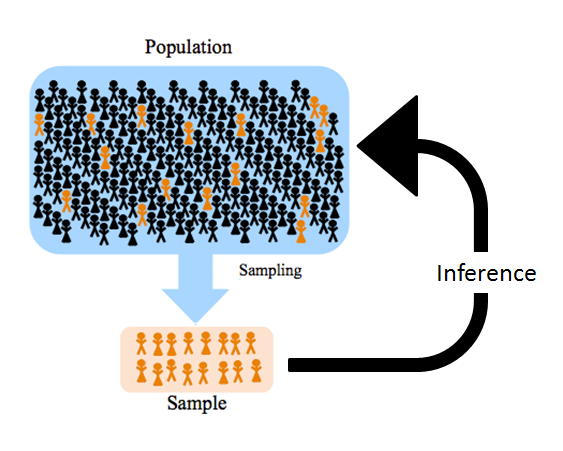
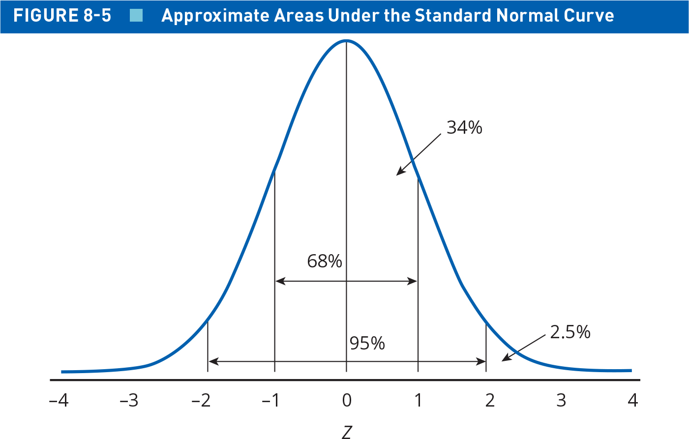
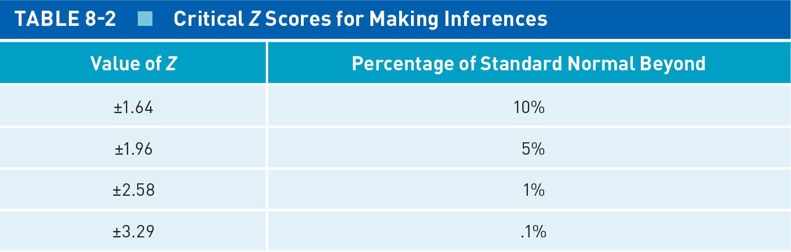

## Today's Agenda {background-image="Images/background-data_blue_v4.png" .center}

```{r}
library(tidyverse)
library(readxl)
library(kableExtra)
library(crosstable)

load("../../DATA/2026-Spring/ANES/ANES2020_Data_Extract.RData")
```

<br>

::: {.r-fit-text}

**Foundations of Statistical Inference**

- Samples and populations

- Standard errors and confidence intervals

:::

<br>

::: r-stack
Justin Leinaweaver (Spring 2026)
:::

::: notes
Prep for Class

1. Review Canvas submissions

2. NOTE: Remember, they covered ALL of this material in the reading. You are reinforcing these ideas NOT introducing them!

<br>

Today we lay the foundations you will need to make inferences using statistics

- **SLIDE**: Let's build to these ideas by connecting the dots of our semester so far

:::


## {background-image="Images/background-data_blue_v4.png" .center}

### Our **goal** as political scientists is to **generate knowledge** about the social world using the **scientific method**

::: notes

*Read slide*

<br>

All your work so far this semester has been designed around deepening your skills as a quantitative political scientist

<br>

Because of this aim we started our semester focused on measurement 

- We learned to ask key questions about our data, such as:

- Where does the data come from?

- How was it constructed? 

- Who designed the measures and for what purposes?

- How have they validated their measures?

<br>

**Our first big takeaway was that only when we understand the validity and reliability of our data should we do anything with it**

<br>

**SLIDE**: That took us to level one of doing "statistics"

:::


## {background-image="Images/background-data_blue_v4.png" .center}

::: {.r-fit-text}
**Defining Statistics: Level 1**

Statistics offers tools we can use to summarize data
:::

<br>

:::: {.columns}
::: {.column width="33%"}
```{r, fig.asp=1, fig.width=4.5}
ggplot(mpg, aes(x = cty)) +
  geom_histogram(bins = 10, color = "white") +
  labs(x = "", y = "",
       title = "Univariate Analysis") +
  theme_bw()
```
:::

::: {.column width="33%"}
```{r, fig.asp=1, fig.width=4.5}
ggplot(mpg, aes(x = drv, y = cty)) +
  geom_boxplot() +
  labs(x = "", y = "",
       title = "Bivariate Analysis") +
  theme_bw() +
  scale_x_discrete(labels = c("", "", ""))
```
:::

::: {.column width="33%"}
```{r, fig.asp=1, fig.width=4.5}
new1 <- tribble(
  ~party, ~x1, ~y1,
  "Democrat", 5, .3,
  "Democrat", 4, .28,
  "Democrat", 3, .31,
  "Democrat", 2, .2,
  "Democrat", 1, .17,
  "Independent", 5, .39,
  "Independent", 4, .38,
  "Independent", 3, .39,
  "Independent", 2, .33,
  "Independent", 1, .32,
  "Republican", 5, .59,
  "Republican", 4, .62,
  "Republican", 3, .67,
  "Republican", 2, .64,
  "Republican", 1, .65,
)

ggplot(new1, aes(x = x1, y = y1, color = party)) +
  geom_line(linewidth = 1.3) +
  theme_bw() +
  scale_y_continuous(labels = scales::percent_format()) +
  labs(x = "", y = "", color = "",
       title = "Making Controlled Comparisons") +
  scale_x_continuous(breaks = 1:5, 
  labels = c("Not at all", "A little", "Moderately", "Very", "Extremely")) +
  scale_color_manual(values = c("darkblue", "grey", "darkred"))  +
  guides(color = "none")
```
:::

::::

::: notes

At its most basic level, statistics is about summary

- By summary we mean simplifying a complex world

- Giving "a brief statement of the main points of (something)" (Oxford Dictionary).

<br>

Don't underestimate the usefulness of statistical summaries!

- We used univariate analyses to identify WHERE the variation is in the world and to describe that variation

- We used bivariate analyses to describe the relationship between two variables, and

- We used controlled comparisons to develop causal arguments about causes and effects

<br>

That's an impressive amount of value for simply summarizing data!

<br>

**SLIDE**: Our work today takes us to the next level of statistics and serves as the foundation for everything to come the rest of the semester

:::


## {background-image="Images/background-data_blue_v4.png" .center}

::: {.r-fit-text}
**Defining Statistics: Level 2**

Statistics helps us draw inferences from sample to population
:::

<br>

{style="display: block; margin: 0 auto"}

::: notes

Statistics is also a collection of tools meant to help us with the process of inference

- Inference is a process by which we study something specific in order to learn something generalizable

<br>

Examples:

- In survey terms that means asking 1,000 Americans a question while intending to use that to represent the opinion of all Americans

- In cross-national analyses, that's like analyzing 25 civil wars in order to identify the general causes of rebellion

- In biology it's Prof Jansen catching and measuring frogs to make inferences about the levels of pollution in our local waterways 

<br>

The next big step in your training as a scientist is to learn how to move from a sample estimate to a population parameter

- And THAT is what chapter 8 in the textbook is all about

- I hope you gave yourself time to read and reflect on the chapter before class

- There's simply no shortcut to understanding, you have to put in the work

<br>

**SLIDE**: Let's highlight the two big intuitions we'll need moving forward

:::


## Statistical Inference: The Intuitions {background-image="Images/background-data_blue_v4.png" .center .smaller}

<br>

::: {.fragment}

$$ \text{Sample Statistic} = \text{Pop. Parameter} \pm \text{Random Sampling Error} $$

:::

::: notes

The textbook exercises for today were to make sure you can use the formulas to calculate the measures you will need going forward

- e.g. standard errors, margins of error, confidence intervals, etc

- BUT, before we review those, let's make sure you have a good grasp of the intuitions underpinning them

<br>

**REVEAL**

Intuition 1: All sample statistics may be thought of as a combination of the true population value plus error

- So, you run a survey of 1,000 Americans and calculate their average presidential approval

- This sample average represents the actual approval in the population plus (or minus) error

<br>

Quick aside, all our work moving forward will be in dealing with this random sampling error

- This is NOT the same thing as error caused by having unreliable or invalid data

- Data quality problems are systematic errors and no amount of fancy statistics will fix that

<br>

**SLIDE**: intuition 2

:::


## Statistical Inference: The Intuitions {background-image="Images/background-data_blue_v4.png" .center .smaller}

<br>

$$ \text{Sample Statistic} = \text{Pop. Parameter} \pm \text{Random Sampling Error} $$

<br>

$$ \text{Random Sampling Error} = \frac{\text{Variation component}}{\text{Sample size component}} $$

::: notes

Intuition 2: Random sampling error is actually a function of two things that can offset each other!

- The variation component in the numerator refers to how spread out the values are in a measure (e.g. the standard deviation).

- The sample size component in the denominator refers to how many subjects are in your sample

<br>

Let's use computer simulations to visualize EACH of these intuitions

- **SLIDE**: We'll start with the variation component

:::


## Running a Simulation in R {background-image="Images/background-data_blue_v4.png" .center}

<br>

sample(x, size, replace)

- "x" lists the options to pick from

- "size" is how many to choose

- "replace" is whether or not to allow duplicate picks

::: {.fragment}
```{r, echo=TRUE}
# One coin flip
sample(x = c("heads", "tails"), size = 1, replace = TRUE)
```
:::

::: notes

R has a base function called sample that makes it easy to generate fake data

- *Talk through the slide*

<br>

Let's use this function to simulate flipping a fair coin

- **REVEAL**: *Talk through code and result*

- **Everybody run this line of code 10 times and report back how many heads you get**

<br>

**SLIDE**: The sample function can do this too!

:::


## Running a Simulation in R {background-image="Images/background-data_blue_v4.png" .center}

<br>

sample(x, size, replace)

- "x" lists the options to pick from

- "size" is how many to choose

- "replace" is whether or not to allow duplicate picks

```{r, echo=TRUE}
# Ten coin flips
sample(x = c("heads", "tails"), size = 10, replace = TRUE)
```

::: notes

Simply increase the "size" argument (and make sure replace = TRUE)

- Each time you run this code you should get different results (e.g. simulated randomness)

<br>

**Everybody with me on this?**

<br>

Ok, let's use this to talk about the first source of random sampling error

- **SLIDE**: Different kinds of measures carry different levels of variation

:::


## {background-image="Images/background-data_blue_v4.png" .center}

::: {.r-fit-text}
**Random Sampling Error: The Variation Component**
:::

```{r, echo=TRUE}
# Flipping a fair coin
sample(x = c(1, 0), size = 20, replace = TRUE)
```

<br>

```{r, echo=TRUE}
# Survey question (5 point scale)
sample(x = c(1:5), size = 20, replace = TRUE)
```

<br>

```{r, echo=TRUE}
# Country GDP per capita (from $154 to $288k)
sample(x = 154:288000, size = 20, replace = TRUE) 
```

::: notes

Here are three different simulations each meant to produce a different kind of data

- You DON'T have to copy these down!

- Just make sure you understand what each one is doing

<br>

For our first measure, we'll stick with flipping a fair coin

- Here I'm using "1" for heads and "0" for tails

<br>

The second measure simulates asking 20 people a survey question with five ordinal options

- Think of a Likert scale running from "Not at all satisfied" to "Completely satisfied"

<br>

The final measure simulates the GDP per capita of 20 different countries

- Running from the low end, Burundi at only \$154, to the high end where Monaco is at approximately \$288k

<br>

**Does everybody see how each of these measures has been generated?**

<br>

**Which one of these three measures do you think is the hardest to accurately SAMPLE? e.g. design a measure that will capture all of the variation in the world of the question?**

- (**SLIDE**)

:::


## {background-image="Images/background-data_blue_v4.png" .center}

::: {.r-fit-text}
**Random Sampling Error: The Variation Component**
:::

```{r, echo=TRUE}
# Flipping a fair coin
sample(x = c(1, 0), size = 20, replace = TRUE) |>
  sd()
```

<br>

```{r, echo=TRUE}
# Survey question (5 point scale)
sample(x = c(1:5), size = 20, replace = TRUE) |>
  sd()
```

<br>

```{r, echo=TRUE}
# Country GDP per capita (from $154 to $288k)
sample(x = 154:288000, size = 20, replace = TRUE)  |>
  sd()
```

::: notes

Here I'm piping our simulated results into the function for calculating the standard deviation

<br>

**What does this teach us about the first source of error in our measures?**

- (The larger the variation in your sample, the larger the error in your sample statistic)

- A sample drawn from only two options is simply more likely to cover the options

- A sample drawn from a range in the hundreds of thousands is always going to carry greater chances of error

<br>

**SLIDE**: Back to the formulas

:::


## Statistical Inference: The Intuitions {background-image="Images/background-data_blue_v4.png" .center .smaller}

<br>

$$ \text{Sample Statistic} = \text{Pop. Parameter} \pm \text{Random Sampling Error} $$

<br>

$$ \text{Random Sampling Error} = \frac{\text{Variation component}}{\text{Sample size component}} $$

::: notes

So, the variation component of our random error depends on how much your sample can vary

- This is why all the statistics you had to calculate today include some version of the standard deviation 

- Key takeaway: A larger SD means a larger variation component and more random error in your sample

<br>

**SLIDE**: Now let's talk sample size

:::


## {background-image="Images/background-data_blue_v4.png" .center}

::: {.r-fit-text}
**Random Sampling Error: Sample Size**
:::

<br>

Hypothetical "Fact"

- 80% of college students use social media everyday

::: notes

In order to examine the effect of increasing sample size on random sampling error, we start with a "fact" and assume it is true.

<br>

Here's a made-up fact!

- REMEMBER, our interest here is NOT in testing if the 80% is right

- Instead, we want to know how good our stats are at discovering the 80% as right

- **Does that distinction make sense?**

<br>

So, let's also assume that we have designed a valid and reliable survey to measure social media use in college students

- Question: "Did you use social media in the last 24 hours? Yes or No"

<br>

**SLIDE**: Now we can use our sample function to run this survey one time

:::


## {background-image="Images/background-data_blue_v4.png" .center}

::: {.r-fit-text}
**Random Sampling Error: Sample Size**
:::

<br>

Population Parameter: 80% of college students use social media everyday

<br>

```{r, echo=TRUE}
# Simulate a survey of ten students
sample(x = c(1, 0), size = 10, replace = TRUE, prob = c(.8,.2))
```

::: notes

To represent the population parameter we add the "prob" argument to the sample function

- This lets you specify the probability of each possible answer

- Here I am giving "1", which represents "yes", an 80% chance of being selected

<br>

Everytime we run this line of code we'll get slightly different results

- e.g. random selection!

- Everybody try it! **How many "yes" answers did you get?**

<br>

**SLIDE**: To make the results easier to interpret let's sum the "yes" answers

:::


## {background-image="Images/background-data_blue_v4.png" .center}

::: {.r-fit-text}
**Random Sampling Error: Sample Size**
:::

Population Parameter: 80% of college students use social media everyday

```{r, echo=TRUE}
# Repeat the simulation
sum(sample(x = c(1, 0), size = 10, replace = TRUE, prob = c(.8,.2)))

sum(sample(x = c(1, 0), size = 10, replace = TRUE, prob = c(.8,.2)))

sum(sample(x = c(1, 0), size = 10, replace = TRUE, prob = c(.8,.2)))

sum(sample(x = c(1, 0), size = 10, replace = TRUE, prob = c(.8,.2)))
```

::: notes

**Does everybody understand what we're doing here in this code?**

<br>

Now remember, we set this up so that 80% is the true population value

- **Based on these simulation results, what is our best estimate of the proportion of college students who use social media everyday?**

- (Different results each time, but somewhere between 70% and 100%?)

<br>

Let's extend this logic even further!

- **SLIDE**: Let's simulate running this survey 100 times

:::


## {background-image="Images/background-data_blue_v4.png"}

::: {.r-fit-text}
**Random Sampling Error: Sample Size**
:::

```{r, echo=FALSE, fig.align='center', fig.asp=.75, fig.width=7, out.width="65%"}
# Run the simulation 10 times
res10 <- tibble(x1 = rep(NA_integer_, 100))

for (i in 1:100) {
  
  res10$x1[i] <- sum(sample(x = c(1, 0), size = 10, 
                           replace = TRUE, prob = c(.8,.2)))
  
}

# Visualize the results
hist(res10$x1, main = "100 Surveys of 10 Students Each")
```

::: notes

Don't worry about the code for this

- In short, I'm using a for loop to run the sample line of code we all have made 100 times

- SO, this histogram shows the results of running our ten student survey 100 times!

<br>

**Based on these simulation results, what is our best estimate of the proportion of college students who use social media everyday?**

- (Ten student survey gives us a wide range)

    - Min: `r str_c(min(res10$x1/10)*100, "%")`
    - Max: `r str_c(max(res10$x1/10)*100, "%")`

- If the random sample was kind to us then the results will approximate a normal curve with a peak around 8 which is the population proportion! (e.g. the actual fact!)

<br>

Bottom line is that any single survey of ten people is likely to carry a lot of random error

- **What do we need to do to shrink this error?**

- (**SLIDE**: Ask more students!)

:::


## {background-image="Images/background-data_blue_v4.png"}

::: {.r-fit-text}
**Random Sampling Error: Sample Size**
:::

```{r, echo=FALSE, fig.align='center', fig.asp=.75, fig.width=7, out.width="65%"}
# Run the simulation 10 times
res100 <- tibble(x1 = rep(NA_integer_, 100))

for (i in 1:100) {
  
  res100$x1[i] <- sum(sample(x = c(1, 0), size = 100, 
                           replace = TRUE, prob = c(.8,.2)))
  
}

# Visualize the results
hist(res100$x1, main = "100 Surveys of 100 Students Each")
```

::: notes

Now we're asking 100 students in each survey instead of just 10

- **What has changed in our results here?**

- (Ten student survey gave us a wide range)

    - Min: `r str_c(min(res10$x1/10)*100, "%")`
    - Max: `r str_c(max(res10$x1/10)*100, "%")`

- (100 students has shrunk that down a bit)

    - Min: `r str_c(min(res100$x1/100)*100, "%")`
    - Max: `r str_c(max(res100$x1/100)*100, "%")`

<br>

**Everybody understand how I'm getting the proportion here?**

<br>

**SLIDE**: Let's ask 1,000 students

:::


## {background-image="Images/background-data_blue_v4.png"}

::: {.r-fit-text}
**Random Sampling Error: Sample Size**
:::

```{r, echo=FALSE, fig.align='center', fig.asp=.75, fig.width=7, out.width="65%"}
# Run the simulation 10 times
res1000 <- tibble(x1 = rep(NA_integer_, 100))

for (i in 1:100) {
  
  res1000$x1[i] <- sum(sample(x = c(1, 0), size = 1000, 
                           replace = TRUE, prob = c(.8,.2)))
  
}

# Visualize the results
hist(res1000$x1, main = "100 Surveys of 1,000 Students Each")
```

::: notes

**What is the range of values across these hundred surveys of 1,000 students each?**

- (Ten student survey gave us a wide range)

    - Min: `r str_c(min(res10$x1/10)*100, "%")`
    - Max: `r str_c(max(res10$x1/10)*100, "%")`

- (100 students has shrunk that down a bit)

    - Min: `r str_c(min(res100$x1/100)*100, "%")`
    - Max: `r str_c(max(res100$x1/100)*100, "%")`
    
- (1k students, even tighter!)

    - Min: `r str_c(min(res1000$x1/1000)*100, "%")`
    - Max: `r str_c(max(res1000$x1/1000)*100, "%")`

<br>

We're getting closer!

- **SLIDE**: Let's ask 10,000 students

:::


## {background-image="Images/background-data_blue_v4.png"}

::: {.r-fit-text}
**Random Sampling Error: Sample Size**
:::

```{r, echo=FALSE, fig.align='center', fig.asp=.75, fig.width=7, out.width="65%"}
# Run the simulation 10 times
res10000 <- tibble(x1 = rep(NA_integer_, 100))

for (i in 1:100) {
  
  res10000$x1[i] <- sum(sample(x = c(1, 0), size = 10000, 
                           replace = TRUE, prob = c(.8,.2)))
  
}

# Visualize the results
hist(res10000$x1, main = "100 Surveys of 10,000 Students Each")
```

::: notes

- (Ten student survey gave us a wide range)

    - Min: `r str_c(min(res10$x1/10)*100, "%")`
    - Max: `r str_c(max(res10$x1/10)*100, "%")`

- (100 students has shrunk that down a bit)

    - Min: `r str_c(min(res100$x1/100)*100, "%")`
    - Max: `r str_c(max(res100$x1/100)*100, "%")`
    
- (1k students, even tighter!)

    - Min: `r str_c(min(res1000$x1/1000)*100, "%")`
    - Max: `r str_c(max(res1000$x1/1000)*100, "%")`
    
- (100k gets really close to actual population parameter!)

- Min: `r str_c(min(res10000$x1/10000)*100, "%")`
- Max: `r str_c(max(res10000$x1/10000)*100, "%")`

<br>

**Ok, what is the lesson here?**

- **How does sample size contribute to random error?**

<br>

1. The bigger the sample, the smaller the error

    - Makes sense that as you ask more and more of the total population you come closer to the population's result!
    
    - Big sample, more confidence your sample statistic is close to the population parameter
    
2. The more samples you take (e.g. surveys you run), the more the sample statistic comes to approximate a normal distribution

	- Technically, as the number of samples approaches the limit the curve of the estimated means approaches normal.
	
	- And THAT is the logic of the central limit theorem
	
<br>

**Questions on these two takeaways?**

<br>

**SLIDE**: The intuitions again

:::


## Statistical Inference: The Intuitions {background-image="Images/background-data_blue_v4.png" .center .smaller}

<br>

$$ \text{Sample Statistic} = \text{Pop. Parameter} \pm \text{Random Sampling Error} $$

<br>

$$ \text{Random Sampling Error} = \frac{\text{Variation component}}{\text{Sample size component}} $$

::: notes

**What questions do you have about the two sources of random sampling error?**

<br>

**Is everybody clear on how they impact error differently?**

- Increasing variation increases error

- Increase sample size decreases error

<br>

**SLIDE**: The formulas you learned in the chapter take these intuitions into our data analyses

:::


## Connecting the Intuitions to the Data {background-image="Images/background-data_blue_v4.png" .center}

<br>

$$ \text{Random Sampling Error} = \frac{\text{Variation component}}{\text{Sample size component}} $$

<br>

$$ \text{SE of the mean} (\bar{x}) = \frac{\sigma_x}{\sqrt{n}} $$

::: {.fragment}

$$ \text{SE of a proportion} = \frac{\sqrt{p \times (1-p)}}{\sqrt{n}} $$

:::
::: notes

What I want you to see is how these two measures of the error come directly from the intuition

<br>

When calculating the error around a mean value we need two measures

1. The POPULATION standard deviation for the variable in question, and

2. The square root of the sample size

<br>

Note that you almost never know the population standard deviation so we typically substitute the sample SD in its place

- With large enough samples this won't cause a problem but you should be aware you are making this assumption

<br>

**Does everybody see how increasing the size of the SD increases the random sampling error in our measure?**

- (Bigger numbers in the numerator make for larger values)

<br>

**And how increasing sample size shrinks the error?**

- (Bigger numbers in the denominator shrink the value!)

<br>

**REVEAL**: In the case of a proportion, the variation component is a little different

- Remember, the sd describes the spread of values around the mean

- In a proportion the mean is not a real value, answers are either yes or no (1s and 0s)

- This formula says the variation is the product of the proportion and (1 minus the proportion)

- **Did the reading do a good job explaining that?**

<br>

**To Test: What proportion in a measure (e.g. 25%, 35%, etc) contributes the most error?**

- (50% x 50%! = .25)

- If the outcome in your survey is evenly split then the variation in your population is at its max

- If 90% agree on something then there is basically no variation to worry about

- **Questions on this?**

<br>

**And according to the textbook, what do we do with these SEs?**

- (**SLIDE**: Calculate confidence intervals!)

:::


## Connecting the Intuitions to the Data {background-image="Images/background-data_blue_v4.png" .center .smaller}

<br>

$$ \text{Sample Statistic} = \text{Pop. Parameter} \pm \text{Random Sampling Error} $$

<br>

$$ \text{95% CI} = \text{Sample Statistic} \pm (1.96 \times \text{Standard Error}) $$

::: notes

Our SE formulas made the second intuition more concrete

- Our CI formula takes us back to the big idea we started with

- If you have at least 30 cases in your sample (rule of thumb), then you can calculate a 95% CI with this formula!

<br>

The starting intuition tells us that our sample statistic has error around it, and the CI is our attempt to quantify how much error there is

- The SE formula is a shortcut that means you don't actually have to run 10k simulations to measure the error in your estimates

<br>

**SLIDE**: But since we did run those simulations, let's keep connecting these dots!

:::


## {background-image="Images/background-data_blue_v4.png"}

```{r, echo=FALSE, fig.align='center', fig.asp=.75, fig.width=7, out.width="65%"}
# Visualize the results
hist(res10$x1, main = "100 Surveys of 10 Students Each")
```

::: notes

Here was our simulated results from running 100 surveys of 10 students each

- Remember, the goal was to identify the actual true population parameter

- e.g. what proportion of college students use social media everyday

<br>

And how did we do?

- The mean sample proportion we estimated in this simulation is `r str_c(mean(res10$x1)/10*100, "%")` which isn't bad!

- BUT the middle 95% of values in this distribution runs from `r str_c(quantile(res10$x1, probs = .025)/10*100, "%")` to `r str_c(quantile(res10$x1, probs = .975)/10*100, "%")`

- So, we say to the experts that the mean is our best bet, BUT that given the uncertainty in our approach, the true population parameter could lie anywhere along this wide interval

<br>

THIS is how you communicate to an expert audience how close you think you actually are to the population parameter

- The mean value is a snapshot in the "middle", but the CI tells us about your confidence in that estimate

<br>

**SLIDE**: Now we move to the much larger sample and...

:::


## {background-image="Images/background-data_blue_v4.png"}

```{r, echo=FALSE, fig.align='center', fig.asp=.75, fig.width=7, out.width="65%"}
# Visualize the results
hist(res10000$x1, main = "100 Surveys of 10,000 Students Each")
```

::: notes

And how did our confidence change?

- The mean sample proportion we estimated in this simulation is `r str_c(mean(res10000$x1)/10000*100, "%")` 

- And the middle 95% of values in this distribution runs from `r str_c(quantile(res10000$x1, probs = .025)/10000*100, "%")` to `r str_c(quantile(res10000$x1, probs = .975)/10000*100, "%")`

- NOW we say to the audience that our best estimate is 80% and we are 95% confident that with repeated experiments the true value will run very close to it!

<br>

**Everybody with me on why the CI helps us communicate our findings?**

<br>

Forgive me for this, but I have to give you the following warning

- The 95% CI DOES NOT TELL YOU the range of values that contain the true population parameter 95% of the time

- The 95% CI tells you the range of values that contain the true population parameter in 95% of repeated samples

- In other words, the CI is describing the results you would get if you re-ran your entire experiment over and over again

- Run the experiment 100 times, calculate the CI 100 times and 95 of them would contain the true population parameter

- Just let this sink in for a sec and then don't stress it yet.

<br>

The formulas you learned and practiced for today enable you to generate CIs WITHOUT having to simulate multiple experiments

- The SE gives you a measure of uncertainty in your work

- The CI uses the SE to describe a confidence interval

- A wide CI means we should not be very confident in the precision of our estimate, a narrow CI means more confidence

<br>

Don't worry if this doesn't make a ton of sense yet, we'll keep hitting these ideas over and over

- *NOTES for you: Chapter does way more, but this feels like a good selection of points to hit*

<br>

**SLIDE**: Let's review your assignments for today to make sure you can use the formulas

:::


## Pollock & Edwards (2026) Ch 8 {background-image="Images/background-data_blue_v4.png" .center .smaller}

<br>

$$ \text{SE of a proportion} = \frac{\sqrt{p \times (1-p)}}{\sqrt{n}} $$

$$ \text{95% CI} = \text{Sample Statistic} \pm (1.96 \times \text{Standard Error}) $$

**Exercise 1**

A. 
    - SE = 0.036
    - CI = [0.13, 0.27]

B. 
    - SE = 0.050
    - CI = [0.37, 0.57]

C. 
    - SE = 0.033
    - CI = [0.33, 0.47]

::: notes

**Did everybody get these results?**

<br>

**SLIDE**: Code to get these results

:::


## {background-image="Images/background-data_blue_v4.png" .center .smaller}

$$ \text{SE of a proportion} = \frac{\sqrt{p \times (1-p)}}{\sqrt{n}} $$

$$ \text{95% CI} = \text{Sample Statistic} \pm (1.96 \times \text{Standard Error}) $$

```{r, echo=TRUE}
# A
se <- sqrt(.2 * .8) / sqrt(121)
.2 - 2 * se
.2 + 2 * se

# B
se <- sqrt(0.47 * 0.53) / sqrt(100)
.47 - 2 * se
.47 + 2 * se

# C 
se <- sqrt(0.4 * 0.6) / sqrt(225)
.4 - 2 * se
.4 + 2 * se
```

::: notes

Note that this exercise asks us to use the +-2 shortcut for CIs instead of the 1.96 value

- **Did everybody get these approximate results (depending on your rounding)?**

<br>

This +-2 shortcut is fine in many cases, but this gives us a good chance 
to talk about the 1.96 in the CI formula

- **Why does the 95% CI formula use 1.96?**

- (**SLIDE**)

:::


## {background-image="Images/background-data_blue_v4.png"}

{.absolute width="65%" left=150 top=0}

{.absolute width="65%" left=150 bottom=0}

::: notes

This normal curve is labelled using z-scores

- BUT as you saw in the chapter a z-score is simply a value that has been centered and scaled by the standard deviation

- The zero here is the average for some statistics and each estimate can be plotted by how far from the average it is

- These distances are scaled as SDs so a "1" is 1 SD above the average

- **Make sense?**

<br>

Shifting to our CI math just means replacing SD with SE

- The zero here now represents your sample statistic (e.g. the group mean)

- And the z-scores are how many SEs the true parameter could be away from your best estimate

- When you give someone a 95% CI you're saying the true parameter value could be anywhere in the range of about two SEs above and below your sample statistic

<br>

Assuming your sample size is large enough, then:

- A value of 1.96 covers 95% of the area under the curve

- A value of 1.64 covers 90% of the area under the curve

<br>

This means you can give someone any size CI you want

- A 99% CI is +- 2.58 SEs

- A 99.9% CI is +- 3.29 SEs

<br>

SO, to be clear, a CI gives a range of plausible values around your estimate

- The size of that range depends on the % CI you want to generate

<br>

**Does that make sense?**

<br>

**SLIDE**: Ok, Exercise 2

:::


## Pollock & Edwards (2026) Ch 8 {background-image="Images/background-data_blue_v4.png" .center .smaller}

$$ \text{Sample Std Dev} (s_x) = \sqrt{\frac{\Sigma (x_i - \bar{x})^2}{n-1}} $$

$$ \text{SE of the mean} (\bar{x}) = \frac{\sigma_x}{\sqrt{n}} $$

$$ \text{95% CI} = \text{Sample Statistic} \pm (1.96 \times \text{Standard Error}) $$

**Exercise 2**

A. SE = 0.40

B. CI = [1.14, 2.73]

::: notes

**Did everybody get these results?**

<br>

**SLIDE**: Code to get these results

:::


## Pollock & Edwards (2026) Ch 8 {background-image="Images/background-data_blue_v4.png" .center .smaller}

$$ \text{SE of the mean} (\bar{x}) = \frac{\sigma_x}{\sqrt{n}} $$

$$ \text{95% CI} = \text{Sample Statistic} \pm (1.96 \times \text{Standard Error}) $$

**Exercise 2**

```{r, echo=TRUE}
# The Data
x1 <- c(0, 0, 0, 1, 1, 1, 2, 2, 2, 2, 2, 3, 4, 4, 5)

# The SE
se <- sd(x1) / sqrt(15)
se

# The 95% CI (ballpark)
mean(x1) - 2 * se

mean(x1) + 2 * se
```

::: notes

**How are we doing?**

<br>

**SLIDE**: Question 3

:::


## Pollock & Edwards (2026) Ch 8 {background-image="Images/background-data_blue_v4.png" .center .smaller}

$$ \text{SE of the mean} (\bar{x}) = \frac{\sigma_x}{\sqrt{n}} $$

$$ \text{95% CI} = \text{Sample Statistic} \pm (1.96 \times \text{Standard Error}) $$

**Exercise 3**

A. SE = 0.07

B. CI = [1.67, 1.95]

::: notes

**Did everybody get these results?**

<br>

**SLIDE**: Code to get these results

:::


## Pollock & Edwards (2026) Ch 8 {background-image="Images/background-data_blue_v4.png" .center .smaller}

$$ \text{SE of the mean} (\bar{x}) = \frac{\sigma_x}{\sqrt{n}} $$

$$ \text{95% CI} = \text{Sample Statistic} \pm (1.96 \times \text{Standard Error}) $$

**Exercise 3**

```{r, echo=TRUE}
# The SE
se <- 1.98 / sqrt(816)
se

# The 95% CI (ballpark)
1.81 - 2 * se

1.81 + 2 * se
```

::: notes

*Read slide*

<br>

**How's everybody doing?**

<br>

**SLIDE**: Practice using ANES

:::


## ANES (2020) Practice Exercises {background-image="Images/background-data_blue_v4.png" .center}

<br>

1. What proportion of Americans get at least some of their campaign news using the newspaper (campaign.news.papers)? Calculate the proportion who "1. Mentioned" newspapers in their survey and provide a 95% CI around that statistic.

2. What is the mean level of support for President Trump in the 2020 ANES survey (ft.trump.post)? Calculate the mean and provide a 95% CI around that statistic.

::: notes

**SLIDE**: Results

:::


## ANES (2020) Practice Exercises {background-image="Images/background-data_blue_v4.png" .center}

```{r, echo=TRUE}
# Campaign News in Newspapers

# Proportions per category
proportions(table(anes$campaign.news.papers))
```

<br>

```{r, echo=TRUE}
# Calculate SE of a proportion
se <- sqrt(0.59 * 0.41) / sqrt(8152)

# Calculate CI 
.41 - 1.96 * se
.41 + 1.96 * se
```


## ANES (2020) Practice Exercises {background-image="Images/background-data_blue_v4.png" .center}

```{r, echo=TRUE}
# Feeling Thermometer: Trump

# Mean value
mean(anes$ft.trump.post, na.rm = TRUE)
```

<br>

```{r, echo=TRUE}
# Calculate SE of a mean
se <- sd(anes$ft.trump.post, na.rm = TRUE) / sqrt(7375)

# Calculate CI 
mean(anes$ft.trump.post, na.rm = TRUE) - 1.96 * se
mean(anes$ft.trump.post, na.rm = TRUE) + 1.96 * se
```


## For Next Class {background-image="Images/background-data_blue_v4.png" .center}

<br>

::: {.r-fit-text}

Pollock and Edwards (2026): Chapter 9

- Read p223-229

- Submit selected exercises to Canvas

:::
::: notes

Canvas Assignment: Chapter 8 and 9 Assessment

1. Submit your answers to Exercise 6 on p220-221
2. Submit your answers to Exercise 7 on p221
3. Submit your answers to Ch9, Exercise 1 on p245
4. Was there anything specific in the excerpt that didn't make sense or that you'd like to make sure we discuss in class?

:::

