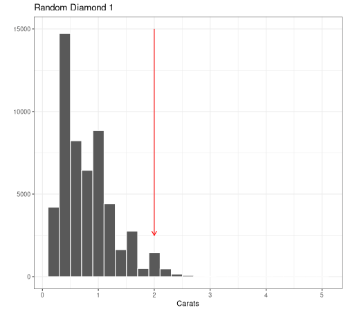
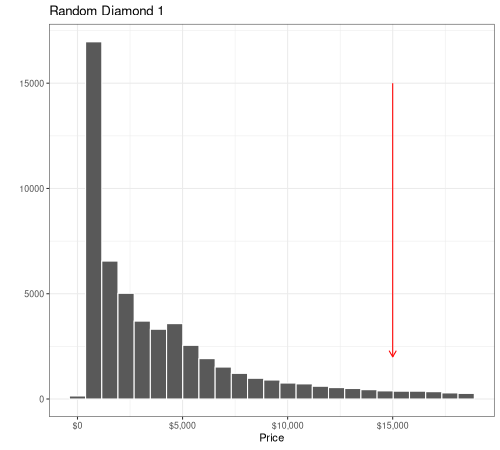
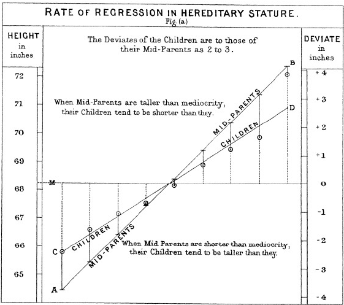

---
output:
  xaringan::moon_reader:
    css: ["default", "extra.css"]
    lib_dir: libs
    seal: false
    nature:
      highlightStyle: github
      highlightLines: true
      countIncrementalSlides: false
      ratio: '16:9'
---

```{r, echo = FALSE, warning = FALSE, message = FALSE}
##xaringan::inf_mr()
## For offline work: https://bookdown.org/yihui/rmarkdown/some-tips.html#working-offline
## Images not appearing? Put images folder inside the libs folder as that is the main data directory

library(tidyverse)
library(readxl)
library(stargazer)
library(kableExtra)
library(modelsummary)
##library(modelr)

knitr::opts_chunk$set(echo = FALSE,
                      eval = TRUE,
                      error = FALSE,
                      message = FALSE,
                      warning = FALSE,
                      comment = NA)
```

background-image: url('libs/Images/background-blue_cubes_lighter3.png')
background-size: 100%
background-position: center

.size80[**Today's Agenda**]

<br>

.size65[.center[
Fitting, interpreting and analyzing simple OLS regressions
]]

<br>

.center[.size40[
  Justin Leinaweaver (Spring 2024)
]]

???

## Prep for Class
1. 


---

background-image: url('libs/Images/background-blue_cubes_lighter3.png')
background-size: 100%
background-position: center
class: middle, center

.size80[
**Part 1**

**Why do we need regressions?**
]

???

Both in terms of the approach to summarizing data and what do we mean by the word 'regression'?


---

background-image: url('libs/Images/background-blue_cubes_lighter3.png')
background-size: 100%
background-position: center
class: middle, center

```{r, fig.align = 'center', fig.retina=3, fig.asp=.7, out.width = '80%', fig.width = 6, cache=TRUE}
diamonds |>
  slice_sample(prop = .1) |>
  ggplot(aes(x = carat, y = price)) +
  geom_point(alpha = .05) +
  theme_bw() +
  labs(x = "Carats", y = "Price",
       title = str_c("The correlation of diamond weight to price is ", round(cor(diamonds$carat, diamonds$price), 2))) +
  scale_y_continuous(labels = scales::dollar_format()) +
  coord_cartesian(xlim = c(0,4))
```

???

### What conclusions can we draw based on the visualization and the correlation?

### - In other words, based on these stats what is the specific relationship between diamond size and price?


---

background-image: url('libs/Images/background-blue_cubes_lighter3.png')
background-size: 100%
background-position: center
class: middle, center

```{r, fig.align = 'center', fig.retina=3, fig.asp=.7, out.width = '80%', fig.width = 6, cache=TRUE}
range1 <- range(diamonds$price[diamonds$carat == 1.5])
range2 <- range(diamonds$price[diamonds$carat == 2.5])

diamonds |>
  slice_sample(prop = .1) |>
  ggplot(aes(x = carat, y = price)) +
  geom_point(alpha = .05) +
  theme_bw() +
  labs(x = "Carats", y = "Price",
       title = str_c("The correlation of diamond weight to price is ", round(cor(diamonds$carat, diamonds$price), 2))) +
  scale_y_continuous(labels = scales::dollar_format()) +
  coord_cartesian(xlim = c(0,4)) +
  annotate("segment", x = 1.5, xend = 1.5, y = range1[1], yend = range1[2], color = "blue", arrow = arrow(angle = 90, length = unit(0.1, "inches"), ends = "both")) +
  annotate("segment", x = 2.5, xend = 2.5, y = range2[1], yend = range2[2], color = "blue", arrow = arrow(angle = 90, length = unit(0.1, "inches"), ends = "both"))
```

???

Let's get more specific!

### What is your most precise estimate of the price difference between a 1.5 carat and a 2.5 carat diamond?

- My blue line segments show the range of prices at each size in the dataset.

<br>

**SLIDE**: Regression is an estimation tool that aims to answer this type of question.


---

background-image: url('libs/Images/background-blue_cubes_lighter3.png')
background-size: 100%
background-position: center
class: middle, center

.size60[
Regression is a technique for estimating the relationship between predictor variables (X) and an outcome (Y) using the formula for a line.
]

.size80[
Y = $\alpha$ + $\beta$ X
]

???

### What clarifications do you need from the readings?


---

background-image: url('libs/Images/background-blue_cubes_lighter3.png')
background-size: 100%
background-position: center
class: middle, center

.size60[**Why 'Regression'?**]

.pull-left[
```{r, eval=FALSE}
# Let's try creating an animation showing various diamonds pulled from the "bag"
library(gifski)

# In descending order
carat_selection <- c(2, 1.6, 1, .6)
line_ends <- c(2500, 3500, 10000, 9000)

# carat_selection <- c(2, .6, 1.6, 1)
# line_ends <- c(2500, 9000, 3500, 10000)

for (i in 1:4) {

  # Save as png
  png(str_c("hist-", i, "-diamonds.png"), width = 500, height = 450, units = "px")

  # Make histogram with arrow
  plot1 <- diamonds |>
    ggplot(aes(x = carat)) +
    geom_histogram(bins = 25, color = "white") +
    theme_bw() +
    labs(x = "Carats", y = "", title = str_c("Random Diamond ", i)) +
    annotate("segment", x = carat_selection[i], xend = carat_selection[i], y = 15000, yend = line_ends[i], color = "red", arrow = arrow(angle = 30, length = unit(0.1, "inches")))

  # This shouldn't be necessary but png is acting weird
  print(plot1)

  # Close output
  dev.off()
}

# Make a list of the saved map files
png_files <- list.files(pattern = ".*diamonds.png$", full.names = TRUE)

# Use gifski to combine the separate images
gifski(png_files, gif_file = "libs/Images/11_1-diamonds_carats.gif", delay = 1) #, width = 850, height = 600
```

```{r, echo = FALSE, fig.retina=3, fig.align = 'center', out.width = '100%'}

```
]

.pull-right[
```{r, eval=FALSE}
# Let's try creating an animation showing various diamonds pulled from the "bag"
library(gifski)

# Descending order
price_selection <- c(15000, 10000, 5000, 2000)
line_ends <- c(2000, 2000, 5000, 7000)

# price_selection <- c(15000, 2000, 5000, 10000)
# line_ends <- c(2000, 7000, 5000, 2000)

for (i in 1:4) {

  # Save as png
  png(str_c("hist-", i, "-diamonds.png"), width = 500, height = 450, units = "px")

  # Make histogram with arrow
  plot2 <- diamonds |>
    ggplot(aes(x = price)) +
    geom_histogram(bins = 25, color = "white") +
    theme_bw() +
    scale_x_continuous(labels = scales::dollar_format()) +
    labs(x = "Price", y = "", title = str_c("Random Diamond ", i)) +
    annotate("segment", x = price_selection[i], xend = price_selection[i], y = 15000, yend = line_ends[i], color = "red", arrow = arrow(angle = 30, length = unit(0.1, "inches")))

  # This shouldn't be necessary but png is acting weird
  print(plot2)

  # Close output
  dev.off()
}

# Make a list of the saved map files
png_files <- list.files(pattern = ".*diamonds.png$", full.names = TRUE)

# Use gifski to combine the separate images
gifski(png_files, gif_file = "libs/Images/11_1-diamonds_prices.gif", delay = 1) #, width = 850, height = 600
```

```{r, echo = FALSE, fig.retina=3, fig.align = 'center', out.width = '100%'}

```
]

???

Imagine you are holding a bag of diamonds.

- Each diamond in the bag has weight and a price

- We can visualize the distribution of each using these two histograms

- Any single diamond you pull out of the bag will have a specific weight that corresponds to a specific value. 

<br>


### If you pull a single diamond from this collection at random, what is the most likely price and size it will be?


---

background-image: url('libs/Images/background-blue_cubes_lighter3.png')
background-size: 100%
background-position: center
class: middle, center

.size60[**Why 'Regression'?**]

.pull-left[
```{r, echo = FALSE, fig.retina=3, fig.asp=0.9, fig.align = 'center', out.width = '100%', cache=TRUE}
diamonds |>
  #slice_sample(prop = .4) |>
  ggplot(aes(x = carat)) +
  geom_histogram(bins = 25, color = "white") +
  theme_bw() +
  labs(x = "Carats", y = "") +
  geom_vline(xintercept = mean(diamonds$carat), color = "red", linewidth=1.5) +
  annotate("text", x = 3, y = 12500, label = str_c("Mean(Carats) = ", round(mean(diamonds$carat), 2)), size = 7)
```
]

.pull-right[
```{r, echo = FALSE, fig.retina=3, fig.asp=0.9, , fig.align = 'center', out.width = '100%', cache=TRUE}
diamonds |>
  #slice_sample(prop = .4) |>
  ggplot(aes(x = price)) +
  geom_histogram(bins = 25, color = "white") +
  theme_bw() +
  labs(x = "Price", y = "") +
  geom_vline(xintercept = mean(diamonds$price), color = "red", linewidth=1.5) +
  scale_x_continuous(labels = scales::dollar_format()) +
  annotate("text", x = 12500, y = 12500, label = str_c("Mean(Price) = ", round(mean(diamonds$price), 2)), size = 7)
```
]

???

### Pros and cons of guessing the average?

- Clearly the price of the diamonds isn't normally distributed, so maybe you're better off guessing lower.


---

background-image: url('libs/Images/background-blue_cubes_lighter3.png')
background-size: 100%
background-position: center
class: middle, center

.size60[**Why 'Regression'?**]

.pull-left[
```{r, echo = FALSE, fig.retina=3, fig.asp=0.9, fig.align = 'center', out.width = '100%', cache=TRUE}
diamonds |>
  #slice_sample(prop = .4) |>
  ggplot(aes(x = carat)) +
  geom_histogram(bins = 25, color = "white") +
  theme_bw() +
  labs(x = "Carats", y = "") +
  annotate("segment", x = 2.2, xend = 2.2, y = 5000, yend = 1000, arrow = arrow(angle = 30, length = unit(0.1, "inches")), color = "red")
```
]

.pull-right[
```{r, echo = FALSE, fig.retina=3, fig.asp=0.9, , fig.align = 'center', out.width = '100%', cache=TRUE}
diamonds |>
  #slice_sample(prop = .4) |>
  ggplot(aes(x = price)) +
  geom_histogram(bins = 25, color = "white") +
  theme_bw() +
  labs(x = "Price ($)", y = "") +
  annotate("segment", x = 14600, xend = 14600, y = 5000, yend = 1000, arrow = arrow(angle = 30, length = unit(0.1, "inches")), color = "red") +
  scale_x_continuous(labels = scales::dollar_format())
```
]

???

### Does your guess change if the first diamond you pull out of the bag is massive?

### - In other words, if you first pull a massive diamond from the collection, what is the most likely price and size of the next one you draw?


---

background-image: url('libs/Images/background-blue_cubes_lighter3.png')
background-size: 100%
background-position: center
class: middle, center

.size60[**Regression aka 'regression to the mean'**]

.pull-left[
```{r, echo = FALSE, fig.retina=3, fig.asp=0.9, fig.align = 'center', out.width = '100%', cache=TRUE}
diamonds |>
  #slice_sample(prop = .4) |>
  ggplot(aes(x = carat)) +
  geom_histogram(bins = 25, color = "white") +
  theme_bw() +
  labs(x = "Carats", y = "") +
  geom_vline(xintercept = mean(diamonds$carat), color = "red", size=1.5)
```
]

.pull-right[
```{r, echo = FALSE, fig.retina=3, fig.asp=0.9, , fig.align = 'center', out.width = '100%', cache=TRUE}
diamonds |>
  #slice_sample(prop = .4) |>
  ggplot(aes(x = price)) +
  geom_histogram(bins = 25, color = "white") +
  theme_bw() +
  labs(x = "Price ($)", y = "") +
  geom_vline(xintercept = mean(diamonds$price), color = "red", size=1.5) +
  scale_x_continuous(labels = scales::dollar_format())
```
]

???

(A random draw of an outlier is more likely to be followed by an average value than another outlier.)

<br>

In statistical terms, we tend to see data trend toward its central tendency.

- e.g. "middle" values are more common than outliers.


---

background-image: url('libs/Images/background-blue_cubes_lighter3.png')
background-size: 100%
background-position: center
class: middle, center

```{r, echo = FALSE, fig.align = 'center', out.width = '66%'}

```

???

We get the word "regression" from Sir Francis Galton
- A statistician working in the late 19th century

<br>

In 1886 he ran a now very famous experiment in which he gathered the heights of 930 children and their parents.

- The horizontal line here is the average height of the sample

- Dots below the line are shorter than average, above the line taller

- The average parent heights are on one line and their kids on the other

<br>

"It appeared from these experiments that the offspring did not tend to resemble their parents in size, but always to be more mediocre than they – to be smaller than the parents, if the parents were large; to be larger than the parents, if the parents were small."

- "regression to the mean"

- Per Galton, 'regress' means to go back or revert to an earlier or more primitive state.

- It means that, in general, relatively high (or low) observations are likely to be followed by less extreme ones nearer the subject’s true mean.

<br>

**SLIDE**: Let me see if I can clarify this intuition using a simple simulated counting experiment.


---

class: middle, slideblue

.center[.content-box-blue[.size60[**Let's Simulate an Experiment!**]]]

.pull-left[
```{r, fig.retina=3, fig.align='center', fig.asp=1, cache=FALSE}
# Set up
d_base <- tibble(
  obs = 1:100,
  current = 50
)

p1 <- ggplot(data = d_base, aes(x = current, y = obs)) +
  scale_x_continuous(limits = c(0, 100), breaks = seq(0, 100, 10), labels = c("", seq(10, 50, 10), seq(40, 10, -10), "")) +
  ggthemes::theme_tufte() +
  geom_vline(xintercept = seq(0, 100, 10), color = "white") +
  geom_vline(xintercept = 50, color = "white", linewidth = 1.4) +
  theme(panel.background = element_rect(fill = "springgreen3", colour = "springgreen3")) +
  geom_rect(xmin = -5, xmax = 0, ymin = -5, ymax = 105, fill = "white", color = "black") +
  geom_rect(xmin = 100, xmax = 105, ymin = -5, ymax = 105, fill = "white", color = "black") +
  labs(x = "", y = "") +
  scale_y_continuous(labels = NULL)

p1 +
  geom_point(data = d_base, size = 2.5, color = "red")
```
]

.pull-right[
```{r, fig.retina=3, fig.align='center', fig.asp=1, cache=FALSE}
d_base |>
  mutate(
    current_f = factor(current, levels = seq(40,60, 1))
  ) |>
  ggplot(aes(x = current_f)) +
  geom_bar(width = .7) +
  theme_bw() +
  scale_x_discrete(drop = FALSE) +
  labs(x = "", y = "Count of Positions")
```
]

???

*Idea taken from McElreath book*

<br>

Imagine we line up 100 people on the 50 yard line of a football field

- Each person gets a fair coin

- We will ask each person to flip the coin
    - Heads take one step to the right (+1)
    - Tails take one step to the left (-1)

<br>

On the left I have a picture of our hypothetical field and all 100 subjects

On the right I have a bar plot showing where on the field each person is now

<br>

### Questions on the set-up here?


---

class: middle, slideblue

.center[.content-box-blue[.size60[**Coin Flip 1**]]]

.pull-left[
```{r, fig.retina=3, fig.align='center', fig.asp=1, cache=FALSE}
# Flip 1 coin
d1 <- d_base |>
  mutate(
    flip = sample(x = c(-1, 1), size = 100, prob = c(.5, .5), replace = TRUE),
    new = current + flip
  )

p1 +
  geom_point(data = d1, size = 2.5, color = "red", aes(x = new))
```
]

.pull-right[
```{r, fig.retina=3, fig.align='center', fig.asp=1, cache=FALSE}
d1 |>
  mutate(
    new_f = factor(new, levels = seq(45,55, 1))
  ) |>
  ggplot(aes(x = new_f)) +
  geom_bar(width = .7) +
  theme_bw() +
  scale_x_discrete(drop = FALSE) +
  labs(x = "", y = "Count of Positions")
```
]

???

### What happens after the first flip? Describe the outcome for me.


---

class: middle, slideblue

.center[.content-box-blue[.size60[**Coin Flip 2**]]]

.pull-left[
```{r, fig.retina=3, fig.align='center', fig.asp=1, cache=FALSE}
# Flip again
d2a <- d1 |>
  mutate(
    current = new,
    flip = NULL,
    new = NULL
  )

d2 <- d2a |>
  mutate(
    flip = sample(x = c(-1, 1), size = 100, prob = c(.5, .5), replace = TRUE),
    new = current + flip
  )

p1 +
  geom_point(data = d2, size = 2.5, color = "red", aes(x = new))
```
]

.pull-right[
```{r, fig.retina=3, fig.align='center', fig.asp=1, cache=FALSE}
d2 |>
  mutate(
    new_f = factor(new, levels = seq(45,55, 1))
  ) |>
  ggplot(aes(x = new_f)) +
  geom_bar(width = .7) +
  theme_bw() +
  scale_x_discrete(drop = FALSE) +
  labs(x = "", y = "Count of Positions")
```
]

???

### What happens after the second flip? Describe the outcome for me.


---

class: middle, slideblue

.center[.content-box-blue[.size60[**Coin Flip 3**]]]

.pull-left[
```{r, fig.retina=3, fig.align='center', fig.asp=1, cache=FALSE}
# Flip again
d3a <- d2 |>
  mutate(
    current = new,
    flip = NULL,
    new = NULL
  )

d3 <- d3a |>
  mutate(
    flip = sample(x = c(-1, 1), size = 100, prob = c(.5, .5), replace = TRUE),
    new = current + flip
  )

p1 +
  geom_point(data = d3, size = 2.5, color = "red", aes(x = new))
```
]

.pull-right[
```{r, fig.retina=3, fig.align='center', fig.asp=1, cache=FALSE}
d3 |>
  mutate(
    new_f = factor(new, levels = seq(45,55, 1))
  ) |>
  ggplot(aes(x = new_f)) +
  geom_bar(width = .7) +
  theme_bw() +
  scale_x_discrete(drop = FALSE) +
  labs(x = "", y = "Count of Positions")
```
]

???

Ok, third flip.

### What do we see here?


---

class: middle, slideblue

.center[.content-box-blue[.size60[**Coin Flip 4**]]]

.pull-left[
```{r, fig.retina=3, fig.align='center', fig.asp=1, cache=FALSE}
# Flip again
d4a <- d3 |>
  mutate(
    current = new,
    flip = NULL,
    new = NULL
  )

d4 <- d4a |>
  mutate(
    flip = sample(x = c(-1, 1), size = 100, prob = c(.5, .5), replace = TRUE),
    new = current + flip
  )

p1 +
  geom_point(data = d4, size = 2.5, color = "red", aes(x = new))
```
]

.pull-right[
```{r, fig.retina=3, fig.align='center', fig.asp=1, cache=FALSE}
d4 |>
  mutate(
    new_f = factor(new, levels = seq(45,55, 1))
  ) |>
  ggplot(aes(x = new_f)) +
  geom_bar(width = .7) +
  theme_bw() +
  scale_x_discrete(drop = FALSE) +
  labs(x = "", y = "Count of Positions")
```
]

???

Flip 4!

And then on to...


---

class: middle, slideblue

.center[.content-box-blue[.size60[**Coin Flip 10**]]]

.pull-left[
```{r, fig.retina=3, fig.align='center', fig.asp=1, cache=FALSE}
# Simulate 10 flips
repo10 <- vector("list", 10)

for (i in 1:10) {
  repo10[[i]] <- sample(x = c(-1, 1), size = 100, prob = c(.5, .5), replace = TRUE)
}

d10 <- d1

d10$current <- as_tibble(repo10, .name_repair = "unique") |>
  rowSums() + 50

p1 +
  geom_point(data = d10, size = 2.5, color = "red")
```
]

.pull-right[
```{r, fig.retina=3, fig.align='center', fig.asp=1, cache=FALSE}
d10 |>
  mutate(
    current_f = factor(current, levels = seq(40,60, 1))
  ) |>
  ggplot(aes(x = current_f)) +
  geom_bar(width = .7) +
  theme_bw() +
  scale_x_discrete(drop = FALSE) +
  labs(x = "", y = "Count of Positions")
```
]

???

Ok, what are we seeing develop here?

### Describe this distribution for me.

<br>

### Why are we seeing so many subjects at or near the 50 yard line after 10 flips?
- (A mix of heads and tails keeps you basically in place!)

<br>

**SLIDE**: Let's unpack this using counting!


---

class: middle, slideblue

.center[.content-box-blue[.size60[**Coin Flip 3: Possible Paths**]]]

.pull-left[
```{r, fig.retina=3, fig.align='center', fig.asp=1, cache=FALSE}
# Flip again
p1 +
  geom_point(data = d3, size = 2.5, color = "red", aes(x = new))
```
]

.pull-right[
.size45[
- T, T, T = -3
- H, T, T = -1
- T, H, T = -1
- T, T, H = -1
- H, H, T = +1
- H, T, H = +1
- T, H, H = +1
- H, H, H = +3
]]

???

Go back to flip 3

- There are only eight possible paths for our coin flippers to flip a coin three times

### Does everybody understand how to read these entries?

<br>

### How does this list explain why so many subjects are still close to the 50 yard line?
- (Importantly, out of all eight paths six of them (75%) keep the flipper one away from the start!)

<br>

**SLIDE**: Let's check four flips!


---

class: middle, slideblue

.center[.content-box-blue[.size50[**Coin Flip 4: Possible Paths**]]]

.pull-left[
```{r, fig.retina=3, fig.align='center', fig.asp=1, cache=FALSE}
p1 +
  geom_point(data = d4, size = 2.5, color = "red", aes(x = new))
```
]

.pull-right[
.size25[
- T, T, T, T = -4
- H, T, T, T = -2
- T, H, T, T = -2
- T, T, H, T = -2
- T, T, T, H = -2
- H, H, T, T = 0
- T, H, H, T = 0
- T, T, H, H = 0
- T, H, T, H = 0
- H, T, H, T = 0
- H, T, T, H = 0
- H, H, H, T = +2
- H, H, T, H = +2
- H, T, H, H = +2
- T, H, H, H = +2
- H, H, H, H = +4
]]

???

Here we see the 16 ways a person could flip a coin four times.

<br>

### How does this list explain why so many subjects are still close to the 50 yard line?

- 6/16 (38%) keep them directly on the mean

- 14/16 (88%) are within 2!

- Only 2 paths reach the extremes!


---

class: middle, slideblue

.center[.content-box-blue[.size60[**Coin Flip 4**]]]

.pull-left[
```{r, fig.retina=3, fig.align='center', fig.asp=1, cache=FALSE}
p1 +
  geom_point(data = d4, size = 2.5, color = "red", aes(x = new))
```
]

.pull-right[
```{r, fig.retina=3, fig.align='center', fig.asp=1, cache=FALSE}
d4 |>
  mutate(
    new_f = factor(new, levels = seq(45,55, 1))
  ) |>
  ggplot(aes(x = new_f)) +
  geom_bar(width = .7) +
  theme_bw() +
  scale_x_discrete(drop = FALSE) +
  labs(x = "", y = "Count of Positions")
```
]

???

And here we see the results of our experiment after flip 4.

- We know from the counts WHY extreme values are unlikely and the bar plot shows us that those values WERE unlikely

<br>

Expecting "regression to the mean" can be explained through a counting process

- The key observation: When you add a bunch of things together there are more ways for them to stay near the average than near one of the extremes.

- The output of most complex systems in the natural world are more likely to produce values close to the "normal" than at the extremes.

<br>

1. Why are some people wealthier than others?
    - Family wealth + Education + Experience + Opportunities + etc

2. Why are some people healthier than others?
    - Genetics + Access to food + Food quality + exercise + etc

<br>

### Does this make sense?


---

background-image: url('libs/Images/background-blue_cubes_lighter3.png')
background-size: 100%
background-position: center
class: middle, center

```{r, echo = FALSE, fig.align = 'center', out.width = '66%'}

```

???

THIS is what Galton found with his research into parent-child heights.

- The mix of factors that explain why someone is very tall or very short (e.g. the extreme values) are less likely than those that reproduce the average

- HENCE, tall parents more likely to have kids shorter than them

- HENCE, short parents more likely to have kids taller than them

<br>

THIS is the power of regression.

- When trying to represent a relationship why not use the means since the world conspires to reach the averages?

<br>

### Any questions on the intuition of why predicting the average is frequently useful for us?


---

background-image: url('libs/Images/background-blue_cubes_lighter3.png')
background-size: 100%
background-position: center
class: middle, center

```{r, fig.retina=3, fig.align='center', out.width='96%', fig.width=8, fig.asp=0.618, cache=TRUE}
diamonds |>
  slice_sample(prop = .4) |>
  ggplot(aes(x = carat, y = price)) +
  geom_point(alpha = .05) +
  annotate("point", x = mean(diamonds$carat), y = mean(diamonds$price), color = "red", size = 3) +
  theme_bw() +
  labs(x = "Carats", y = "Price") +
  coord_cartesian(xlim = c(0,4)) +
  scale_y_continuous(labels = scales::dollar_format()) +
  annotate("text", x = 3, y = 5000, label = str_c("mean(Carats) = ", round(mean(diamonds$carat), 2)), size = 5) +
  annotate("text", x = 3, y = 2500, label = str_c("mean(Price) = ", round(mean(diamonds$price), 2)), size = 5)
```

???

Back to the diamonds!

<br>

If data tends towards its 'central tendency' then let's start building a model of this relationship from the sample means.

- Random draws from our hypothetical bag of diamonds should come closer to this dot rather than farther away.

<br>

### Make sense?


---

background-image: url('libs/Images/background-blue_cubes_lighter3.png')
background-size: 100%
background-position: center
class: middle, center

```{r, fig.retina=3, fig.align='center', out.width='96%', fig.width=8, fig.asp=0.618, cache=TRUE}
## Add line guesses
x1 <- .798
y1 <- 3933
x2 <- 0
y2 <- 0
x3 <- .25
y3 <- 500
x4 <- .5
y4 <- 500

b1 <- (y2-y1)/(x2-x1)
a1 <- y1 - b1*x1

b2 <- (y3-y1)/(x3-x1)
a2 <- y1 - b2*x1

b3 <- (y4-y1)/(x4-x1)
a3 <- y1 - b3*x1


diamonds |>
  slice_sample(prop = .4) |>
  ggplot(aes(x = carat, y = price)) +
  geom_point(alpha = .05) +
  geom_abline(slope = b1, intercept = a1, color = "green", size = 1.1) +
  geom_abline(slope = b2, intercept = a2, color = "orange", size = 1.1) +
  geom_abline(slope = b3, intercept = a3, color = "purple", size = 1.1) +
  annotate("point", x = mean(diamonds$carat), y = mean(diamonds$price), color = "red", size = 3) +
  theme_bw() +
  labs(x = "Carats", y = "Price") +
  coord_cartesian(xlim = c(0,4)) +
  scale_y_continuous(labels = scales::dollar_format()) +
  annotate("text", x = 3, y = 5000, label = str_c("mean(Carats) = ", round(mean(diamonds$carat), 2)), size = 5) +
  annotate("text", x = 3, y = 2500, label = str_c("mean(Price) = ", round(mean(diamonds$price), 2)), size = 5)
```

???

That gives us our first point in our model.

- However, we need two points to make a line.

<br>

### How do we pick the second point we need to identify the "best" line?


---

background-image: url('libs/Images/background-blue_cubes_lighter3.png')
background-size: 100%
background-position: center
class: middle, center

```{r, fig.retina=3, fig.align='center', out.width='96%', fig.width=8, fig.asp=0.618, cache=TRUE}
# Quadrant Counts
quad_counts <- diamonds |>
  mutate(
    Quadrants = case_when(
      carat < mean(diamonds$carat) & price > mean(diamonds$price) ~ "1",
      carat < mean(diamonds$carat) & price < mean(diamonds$price) ~ "3",
      carat > mean(diamonds$carat) & price > mean(diamonds$price) ~ "2",
      carat > mean(diamonds$carat) & price < mean(diamonds$price) ~ "4"
    )
  ) |> 
  count(Quadrants)

diamonds |>
  slice_sample(prop = .1) |>
  ggplot(aes(x = carat, y = price)) +
  geom_point(alpha = .05) +
  annotate("point", x = mean(diamonds$carat), y = mean(diamonds$price), color = "red", size = 2) +
  geom_vline(xintercept = mean(diamonds$carat), color = "red", linetype = "dashed") +
  geom_hline(yintercept = mean(diamonds$price), color = "red", linetype = "dashed") +
  scale_y_continuous(labels = scales::dollar_format()) +
  theme_bw() +
  labs(x = "Carats", y = "Price ($)") +
  annotate("text", x = c(0, 1, 0, 1), y = c(17000, 17000, 500, 500), label = c("1", "2", "3", "4"), size = 7, color = "red") +
  coord_cartesian(xlim = c(0,4)) +
  annotate("text", x = 3, y = c(16000, 14000, 12000, 10000), 
           label = c(str_c("Quadrant 1: ", scales::comma(quad_counts$n[1])),
                     str_c("Quadrant 2: ", scales::comma(quad_counts$n[2])),
                     str_c("Quadrant 3: ", scales::comma(quad_counts$n[3])),
                     str_c("Quadrant 4: ", scales::comma(quad_counts$n[4]))), 
           size = 5, hjust = 0)
```

???

The model line should follow the data, so let's divide the plot into four quadrants split around the mean values.

- Once we have our quadrants we can focus on the one with the most observations.


---

background-image: url('libs/Images/background-blue_cubes_lighter3.png')
background-size: 100%
background-position: center
class: middle, center

```{r, fig.retina=3, fig.align='center', out.width='96%', fig.width=8, fig.asp=0.618, cache=TRUE}
# Quadrant 3 stats
quad3 <- diamonds |>
  filter(carat < mean(diamonds$carat), price < mean(diamonds$price)) |>
  pivot_longer(cols = c(carat, price), names_to = "Variable", values_to = "Values") |>
  group_by(Variable) |>
  summarize(
    Mean = round(mean(Values), 2)
  ) |>
  mutate(
    Group = "Quadrant 3"
  ) |>
  select(Group, everything())

diamonds |>
  slice_sample(prop = .1) |>
  ggplot(aes(x = carat, y = price)) +
  geom_point(alpha = .05) +
  annotate("point", x = mean(diamonds$carat), y = mean(diamonds$price), color = "red", size = 4) +
  geom_vline(xintercept = mean(diamonds$carat), color = "red", linetype = "dashed") +
  geom_hline(yintercept = mean(diamonds$price), color = "red", linetype = "dashed") +
  scale_y_continuous(labels = scales::dollar_format()) +
  theme_bw() +
  labs(x = "Carats", y = "Price ($)") +
  annotate("text", x = c(0, 1, 0, 1), y = c(17000, 17000, 500, 500), label = c("1", "2", "3", "4"), size = 7, color = "red") +
  coord_cartesian(xlim = c(0,4)) +
  annotate("point", x = .4631, y = 1358, color = "red", size = 4) +
  annotate("text", x = 2.8, y = 15000, label = "Quadrant 3 Only", hjust=0, size = 5) +
  annotate("text", x = 2.8, y = 13000, label = str_c("mean(Price)= ", quad3$Mean[2]), hjust=0, size = 5) +
  annotate("text", x = 2.8, y = 11000, label = str_c("mean(Carat)= ", quad3$Mean[1]), hjust=0, size = 5)
```

???

The mean values in quadrant three give us a second point!


---

background-image: url('libs/Images/background-blue_cubes_lighter3.png')
background-size: 100%
background-position: center
class: middle, center

.size40[**Two-Point Line: Price = -2,203 + 7,689 (Carats)**]

```{r, fig.retina=3, fig.align='center', out.width='82%', fig.width=6.5, fig.asp=0.618, cache=TRUE}
diamonds |>
  slice_sample(prop = .1) |>
  ggplot(aes(x = carat, y = price)) +
  geom_point(alpha = .05) +
  annotate("point", x = mean(diamonds$carat), y = mean(diamonds$price), color = "red", size = 2) +
  annotate("point", x = .4631, y = 1358, color = "red", size = 2) +
  theme_bw() +
  labs(x = "Carats", y = "Price ($)") +
  geom_abline(slope = 7689.65, intercept = -2203.0767779328, color = "red") +
  coord_cartesian(xlim = c(0,4)) +
  scale_y_continuous(labels = scales::dollar_format())
```

???

### How do we interpret this estimated formula for a line?

### - In other words, what does the slope indicate?

<br>

### What are the strengths and weaknesses of this two-point estimator of the 'general tendency' line?

<br>

Crucial for us is that we can improve the fit of our model using Ordinary Least Squares (OLS).

### Per the readings, how does OLS fit a line to the data?

- (**SLIDE**)


---

background-image: url('libs/Images/background-blue_cubes_lighter3.png')
background-size: 100%
background-position: center
class: middle, center

.size40[**OLS: Price = -2,256 + 7,756 (Carats)**]

```{r, fig.retina=3, fig.align='center', out.width='82%', fig.width=6.5, fig.asp=0.618, cache=TRUE}
model1 <- lm(data = diamonds, price ~ carat)
preds1 <- ggeffects::ggpredict(model1, "carat")

set.seed(277)
d2 <- diamonds |>
  slice_sample(prop = .002)

d2 |>
  modelr::add_predictions(model1) |> 
  ggplot(aes(x = carat)) +
  geom_point(aes(y = price)) +
  geom_ribbon(data = preds1, aes(x = x, ymin = conf.low, ymax = conf.high), fill = "lightblue") +
  geom_line(data = preds1, aes(x = x, y = predicted), color = "royalblue1", size = 1.2) +
  geom_segment(aes(xend = carat, y = price, yend = pred), color = "red") +
  theme_bw() +
  labs(x = "Carats", y = "Price") +
  coord_cartesian(ylim = c(0, 19000), xlim = c(0,4)) +
  scale_y_continuous(labels = scales::dollar_format())
```

???

OLS finds the line that minimizes the squared residuals of ALL THE POINTS.

- e.g. the line of "best fit"


---

background-image: url('libs/Images/background-blue_cubes_lighter3.png')
background-size: 100%
background-position: center
class: middle, center

.size45[**What is the predicted price of a 1.5 carat diamond?**]

```{r, fig.retina=3, fig.align='center', out.width='65%', fig.width=6.5, fig.asp=0.618, cache=TRUE}
diamonds |>
  ggplot(aes(x = carat)) +
  geom_point(alpha = .05, aes(y = price)) +
  geom_ribbon(data = preds1, aes(x = x, ymin = conf.low, ymax = conf.high), fill = "lightblue") +
  geom_line(data = preds1, aes(x = x, y = predicted), color = "royalblue1", size = 1.2) +
  theme_bw() +
  labs(x = "Carats", y = "Price") +
  coord_cartesian(ylim = c(0, 19000), xlim = c(0,4)) +
  scale_y_continuous(labels = scales::dollar_format())
```

.size45[**Price = -2,256.36 + 7,756.43 x Carats**]


---

background-image: url('libs/Images/background-blue_cubes_lighter3.png')
background-size: 100%
background-position: center
class: middle, center

.size45[**What is the predicted price of a 1.5 carat diamond?**]

```{r, fig.retina=3, fig.align='center', out.width='50%', fig.width=6.5, fig.asp=0.618, cache=TRUE}
diamonds |>
  ggplot(aes(x = carat)) +
  geom_point(alpha = .05, aes(y = price)) +
  geom_ribbon(data = preds1, aes(x = x, ymin = conf.low, ymax = conf.high), fill = "lightblue") +
  geom_line(data = preds1, aes(x = x, y = predicted), color = "royalblue1", linewidth = 1.2) +
  annotate("point", x = 1.5, y = 9378.285, color = "red", size = 3) +
  annotate("segment", x = 1.5, xend = 1.5, y = 0, yend = 9378, color = "red", linetype = "dashed", size = 1) +
  annotate("segment", x = 0, xend = 1.5, y = 9378, yend = 9378, color = "red", linetype = "dashed", size = 1) +
  theme_bw() +
  labs(x = "Carats", y = "Price") +
  coord_cartesian(ylim = c(0, 19000), xlim = c(0,4)) +
  scale_y_continuous(labels = scales::dollar_format())
```

.size40[
**Price = -2,256.36 + 7,756.43 x 1.5 = $9,378.29**

**(95% confidence interval: $9,354 - $9,401)**
]

???

### Make sense?

<br>

CLASS: Now you calculate the predicted price of a 2.5 carat diamond using this estimate of the model


---

background-image: url('libs/Images/background-blue_cubes_lighter3.png')
background-size: 100%
background-position: center
class: middle, center

.size45[**What is the predicted price of a 2.5 carat diamond?**]

```{r, fig.retina=3, fig.align='center', out.width='50%', fig.width=6.5, fig.asp=0.618, cache=TRUE}
diamonds |>
  ggplot(aes(x = carat)) +
  geom_point(alpha = .05, aes(y = price)) +
  geom_ribbon(data = preds1, aes(x = x, ymin = conf.low, ymax = conf.high), fill = "lightblue") +
  geom_line(data = preds1, aes(x = x, y = predicted), color = "royalblue1", linewidth = 1.2) +
  annotate("point", x = 2.5, y = 17134.72, color = "red", size = 3) +
  annotate("segment", x = 2.5, xend = 2.5, y = 0, yend = 17134.72, color = "red", linetype = "dashed", size = 1) +
  annotate("segment", x = 0, xend = 2.5, y = 17134.72, yend = 17134.72, color = "red", linetype = "dashed", size = 1) +
  theme_bw() +
  labs(x = "Carats", y = "Price") +
  coord_cartesian(ylim = c(0, 19000), xlim = c(0,4)) +
  scale_y_continuous(labels = scales::dollar_format())
```

.size40[
**Price = -2,256.36 + 7,756.43 x 2.5 = $17,134.72**

**(95% confidence interval: $17,085 - $17,183)**
]

???

### Questions on making a prediction using the OLS estimates?

<br>

**SLIDE**: Now we can answer our question from  the start of class: What is the average price difference between 1.5 and 2.5 carat diamonds?


---

background-image: url('libs/Images/background-blue_cubes_lighter3.png')
background-size: 100%
background-position: center
class: middle, center

.size45[**Predicted price difference of a 1.5 and a 2.5 carat diamond?**]

```{r, fig.retina=3, fig.align='center', out.width='58%', fig.width=6.5, fig.asp=0.618, cache=TRUE}
diamonds |>
  slice_sample(prop = .1) |>
  ggplot(aes(x = carat, y = price)) +
  geom_point(alpha = .05) +
  geom_smooth(method = "lm") +
  annotate("point", x = 2.5, y = 17134.72, color = "red", size = 3) +
  annotate("point", x = 1.5, y = 9378.29, color = "red", size = 3) +
  theme_bw() +
  labs(x = "Carats", y = "Price") +
  coord_cartesian(ylim = c(0, 18000), xlim = c(0,4)) +
  scale_y_continuous(labels = scales::dollar_format())
```

.size40[
**$17,134.72 - $9,378.29 = $7,756.43 (on average)**
]

???

<br>

**SLIDE**: Let's practice!


---

background-image: url('libs/Images/background-blue_cubes_lighter3.png')
background-size: 100%
background-position: center
class: middle, center

```{r, echo = FALSE, fig.retina=3, fig.asp=0.618, fig.align = 'center', out.width = '96%', fig.width=12}
library(fivethirtyeight)

bechdel2 <- bechdel |>
  mutate(
    box_office = (domgross_2013 + intgross_2013)/1e6,
    budget = budget_2013/1e6
  )

bechdel_labels <- bechdel2 |>
  filter(box_office > 2000 | budget > 270)

ggplot(data = bechdel2, aes(x = budget, y = box_office)) +
  geom_point(alpha = .2) +
  #geom_smooth(method = "lm") +
  ggrepel::geom_text_repel(data = bechdel_labels, aes(label = title), size = 3) +
  theme_bw() +
  labs(x = "Budget (millions 2013 USD)", y = "Box Office (millions 2013 USD)", title = "Analyzing Movie Box Office Returns", caption = "Source: FiveThirtyEight")

```

???

**What explains the variation in movie box office?**

- I'm using some publicly available data from the website FiveThirtyEight to build a model of box office returns.

<br>

Values here in millions of 2013 dollars.

### First, what do we learn from this scatterplot?


---

background-image: url('libs/Images/background-blue_cubes_lighter3.png')
background-size: 100%
background-position: center
class: middle, center

.content-box-blue[.size45[**What explains the variation in movie box office?**]]

<br>

```{r, echo = FALSE, fig.retina=3, fig.asp=0.618, fig.align = 'center', out.width = '65%', fig.width=9}
model3 <- lm(data = bechdel2, box_office ~ budget)
#summary(model3)

ggplot(data = bechdel2, aes(x = budget, y = box_office)) +
  geom_point(alpha = .2) +
  geom_smooth(method = "lm") +
  theme_bw() +
  labs(x = "Budget (millions 2013 USD)", y = "Box Office (millions 2013 USD)", title = "Analyzing Movie Box Office Returns", caption = "Source: FiveThirtyEight")

predictions3 <- ggeffects::ggpredict(model3, terms = "budget")
# 
# modelsummary(list("Box Office (millions)" = model3), fmt = 2, stars = c('*' = .05), gof_omit = "IC|Log|F",
#              coef_map = c("budget"= "Budget (millions)", "(Intercept)" = "Constant")) |>
#   column_spec(1, width = "10em") |>
#   kable_styling(font_size = 24)
```

.size45[**Box Office = 63.7 + 4.17 x Budget**]

???

Now let's fit an OLS model to this.

### Interpret this model for me!

<br>

### what does this model predict will be the box office for a movie with a 60 million dollar budget?
- ($310.66, CI $295 - $326)

<br>

### How about a 120 million dollar budget?
- ($557.66, CI $533.81 - $581.51)

<br>

### Any questions on interpreting an OLS using the formula for a line?


---

background-image: url('libs/Images/background-blue_cubes_lighter3.png')
background-size: 100%
background-position: center
class: middle

.center[.size60[**Why use OLS regressions?**]]

.size50[
**Basics**
- Quantifies the relationship between variables

- Can be used to make predictions

- Provides estimates of uncertainty
]


---

background-image: url('libs/Images/background-blue_cubes_lighter3.png')
background-size: 100%
background-position: center
class: middle

.center[.size60[**Why use OLS regressions?**]]

.size40[
**Basics**
- Quantifies the relationship between variables
- Can be used to make predictions
- Provides estimates of uncertainty

**Future Weeks**
- Can be adjusted for confounders (e.g. control variables), nonlinear relationships and different data structures
]


---

background-image: url('libs/Images/background-blue_cubes_lighter3.png')
background-size: 100%
background-position: center
class: middle, center

.size80[
**Part 2**

**How do we fit a regression and make predictions in R?**
]

???


---

background-image: url('libs/Images/background-blue_cubes_lighter3.png')
background-size: 100%
background-position: center
class: middle

.code110[
```{r, echo = TRUE, eval = FALSE}
## Fitting OLS Regressions in R
## lm(data = dataset, outcome ~ predictor)

## Regress `price` on `carat` in the `diamonds` dataset
model1 <- lm(data = diamonds, price ~ carat)

## Check the Results
summary(model1)
```
]

.center[.code70[
```{r}
model1 <- lm(data = diamonds, price ~ carat)
summary(model1)
```
]]

???

### Everybody get these results?


---

background-image: url('libs/Images/background-blue_cubes_lighter3.png')
background-size: 100%
background-position: center
class: middle, center

.size60[**An OLS Estimate of Diamond Prices**]

.pull-left[
```{r, echo = FALSE, fig.retina=3, fig.asp=0.8, fig.align = 'center', out.width = '85%', fig.width = 5, cache=TRUE}
diamonds |>
  slice_sample(prop = .1) |>
  ggplot(aes(x = carat, y = price)) +
  geom_point(alpha = .05) +
  geom_smooth(method = "lm") +
  theme_bw() +
  labs(x = "Carats", y = "Price") +
  coord_cartesian(ylim = c(0, 18000), xlim = c(0,4)) +
  scale_y_continuous(labels = scales::dollar_format())
```
]

.pull-right[

.code70[
```{r, echo = FALSE}
model1 <- lm(data = diamonds, price ~ carat)

summary(model1)
```
]]

.size40[
Y = $\alpha$ + $\beta$ X

Price = -2,256.36 + 7,756.43 x Carats
]

???

### Everybody clear on how to connect the summary results to the formula for a line?

<br>

### Everybody clear on how to make predictions using the formula for a line?


---

background-image: url('libs/Images/background-blue_cubes_lighter3.png')
background-size: 100%
background-position: center
class: middle

.pull-left[
.code100[
```{r, echo=TRUE, eval=FALSE}
# Fit the OLS
model1 <- lm(data = diamonds, price ~ carat)

# Output OLS table for reports
# (install package 'modelsummary')
modelsummary(model1)

# Optional arguments
modelsummary(model1, 
             fmt = 2, 
             stars = c('*' = .05), 
             gof_omit = "IC|Log|F")
```
]]

.pull-right[
```{r}
modelsummary(model1, fmt = 2, stars = c('*' = .05), gof_omit = "IC|Log|F", output = "kableExtra") |>
  column_spec(1, width = "10em") |>
  kable_styling(font_size = 24)
```
]

???

For reporting OLS results

- fmt is how many digits after the decimal

- I set the significance stars to one level (.05)

- I omitted a bunch of fit statistics we don't need at the moment


---

background-image: url('libs/Images/background-blue_cubes_lighter3.png')
background-size: 100%
background-position: center
class: middle

.center[.size50[**Making Predictions**]]

```{r, echo=TRUE}
# Automated Option (install package 'ggeffects')
library(ggeffects)

# Make the Predictions
predictions1 <- ggpredict(model1, terms = "carat")
```

.pull-left[
```{r, echo=TRUE}
# Predictions as a table
predictions1
```
]

.pull-right[
```{r, echo = TRUE, fig.retina=3, fig.asp=0.7, fig.align = 'center', out.width = '70%', fig.width = 5, cache=TRUE}
# Predictions as Viz
plot(predictions1)
```
]

???

Automated approach with confidence intervals

### Questions on this code or these results?


---

background-image: url('libs/Images/background-blue_cubes_lighter3.png')
background-size: 100%
background-position: center
class: middle

.size60[**For next class, fit, interpret and make predictions using OLS:**]

.size50[
1. Regress city fuel economy ('cty') on engine displacement ('displ') in the 'mpg' datatset

2. Regress percent college educated ('percollege') on the percent of people below the  poverty line ('percbelowpoverty') in the 'midwest' datatset
]

???

```{r}
lm(data = mpg, cty ~ displ) |> summary()

lm(data = midwest, percollege ~ percbelowpoverty) |> summary()
```