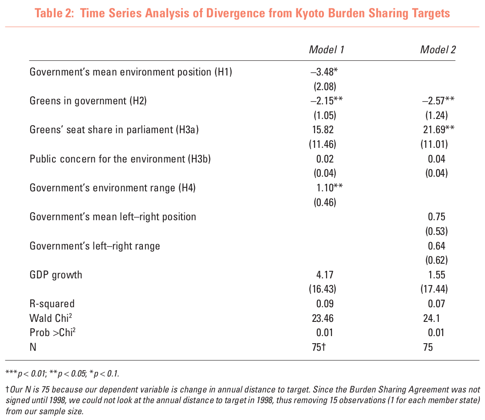

# Today's Agenda {background-image="libs/Images/background-data_blue_v3.png"}

```{r}
library(tidyverse)
library(readxl)
library(kableExtra)
library(modelsummary)
```

<br>

<br>

**Fitting, interpreting and analyzing simple OLS regressions**

<br>

<br>

::: r-stack
Justin Leinaweaver (Spring 2024)
:::

::: notes
Prep for Class

1. Consider printing sheets for "best fit" line practice in class (one per student) AND rulers for all

<br>

Today we begin exploring regressions: A powerful and common tool used by scientists of all stripes for estimating relationships

<br>

**IMPORTANT**: You have to keep up with the assigned readings

- Today's class SHOULD NOT be your intro to regression!

- Everything today will make so much more sense if you already have been exposed to basic elements

<br>

Regression, to the uninitiated, will appear confusing.

- BUT I promise that each time you go through the material it will make more sense
:::


## {background-image="libs/Images/background-slate_v2.png" .center}

::: {.r-fit-text}
**Part 1 **

<br>

**Why do scientists use regressions?**
:::

::: notes
Big picture:

- What is a "regression"?

- And why do we need it?
:::


## {background-image="libs/Images/background-slate_v2.png" .center}

```{r, fig.align = 'center', fig.asp=.7, fig.width = 6, cache=TRUE}
diamonds |>
  slice_sample(prop = .1) |>
  ggplot(aes(x = carat, y = price)) +
  geom_point(alpha = .05) +
  theme_bw() +
  labs(x = "Carats", y = "Price",
       title = str_c("The correlation of diamond weight to price is ", round(cor(diamonds$carat, diamonds$price), 2))) +
  scale_y_continuous(labels = scales::dollar_format()) +
  coord_cartesian(xlim = c(0,4))
```

::: notes

Let's start by looking at some data you are now pretty familiar with from last week.

- The diamonds dataset includes details on 53k+ diamonds in terms of their characteristics and estimated prices

<br>

### What conclusions can we draw based on the visualization and the correlation?

- (Bigger diamonds are typically more expensive)

- (There is a strong linear correlation between the two variables)

<br>

As a matter of description these two data summaries are very useful.

- Thanks to these we have a much better sense of what the world of diamonds actually looks like

<br>

HOWEVER, this approach is also incredibly limited for helping us understand HOW and WHY these two things are related

<br>

**SLIDE**: I think these limitations are most evident when we try to answer specific questions with our summaries
:::


## {background-image="libs/Images/background-slate_v2.png" .center}

**How much more should we expect to pay in order to move from a 1.5 carat to a 2.5 carat diamond?**

```{r, fig.align = 'center', fig.asp=.7, fig.width = 6, cache=TRUE}
range1 <- range(diamonds$price[diamonds$carat == 1.5])
range2 <- range(diamonds$price[diamonds$carat == 2.5])

diamonds |>
  slice_sample(prop = .1) |>
  ggplot(aes(x = carat, y = price)) +
  geom_point(alpha = .05) +
  theme_bw() +
  labs(x = "Carats", y = "Price") +
  scale_y_continuous(labels = scales::dollar_format()) +
  coord_cartesian(xlim = c(0,4)) +
  annotate("segment", x = 1.5, xend = 1.5, y = range1[1], yend = range1[2], color = "blue", arrow = arrow(angle = 90, length = unit(0.1, "inches"), ends = "both")) +
  annotate("segment", x = 2.5, xend = 2.5, y = range2[1], yend = range2[2], color = "blue", arrow = arrow(angle = 90, length = unit(0.1, "inches"), ends = "both"))
```

::: notes

Now that we have access to real diamond prices for 53k examples, it MUST be possible to answer simple questions like this.

<br>

**Based on your tools to this point in the class, what kind of answer could we provide to this question?**

- **What tools could you use to provide an answer to this question?**

<br>

- (**SLIDE**: Results)
:::


## Using Descriptive Statistics {background-image="libs/Images/background-slate_v2.png" .center}

```{r, echo=TRUE}
# Make subsets
diamonds1_5 <- filter(diamonds, carat == 1.5)
diamonds2_5 <- filter(diamonds, carat == 2.5)
```

<br>

```{r, echo=TRUE}
# Summarize
summary(diamonds1_5$price)
```

<br>

```{r, echo=TRUE}
summary(diamonds2_5$price)
```

::: notes

**What answer could we give using these descriptive stats?**

<br>

**Is this a good answer? Why or why not?**

- **In other words, why not just answer the question by comparing the prices of 1.5 and 2.5 carat diamonds in the dataset?**

:::


## The Limits of Descriptive Statistics {background-image="libs/Images/background-slate_v2.png" .center}

<br>

::: {.r-fit-text}
**1. Choosing a point of comparison is somewhat arbitrary**
:::

```{r, echo=FALSE, fig.align='center', fig.asp=.618, cache=TRUE}
# Overlapping densities
diamonds |>
  mutate(
    class2 = case_when(
      carat == 1.5 ~ "1.5 carats",
      carat == 2.5 ~ "2.5 carats",
      TRUE ~ NA_character_
    )
  ) |>
  na.omit() |>
  ggplot(aes(x = price, fill = class2)) +
  geom_density(alpha = .5) +
  theme_bw() +
  scale_x_continuous(labels = scales::dollar_format()) +
  labs(x = "Diamond Prices", y = "Density", fill = "")

# diamonds |>
#   mutate(
#     class2 = case_when(
#       carat == 1.5 ~ "1.5 carats",
#       carat == 2.5 ~ "2.5 carats",
#       TRUE ~ NA_character_
#     )
#   ) |>
#   na.omit() |>
#   ggplot(aes(x = price)) +
#   #geom_histogram(bins = 20) +
#   geom_density() +
#   theme_bw() +
#   facet_wrap(~class2, ncol = 1, scales = "free_y")
```

::: notes
Quick Aside: These are density curves

- Think of them like a smoothed version of a histogram.

- Useful because you don't have to play with bin sizes and and its easier to overlay two distributions on top of each other

<br>

Back to the point! The FIRST big problem with trying to answer our question with descriptive stats is that our choice of comparison is somewhat arbitrary

- There isn't really a robust way to defend our choice of which descriptive stats to compare

- e.g. compare means, medians, IQRs?

<br>

In this case comparing the means and medians shows an increase in price with weight, but comparing the maximums doesn't

- Is one of these more "true" or "correct" than the others?

- What if you have one of the super expensive small diamonds? You could upgrade and get money back!

<br>

This is why descriptive stats are important for helping the reader see your data but not necessarily for answering specific questions on their own.

- These stats give us a sense of the distribution, but the distribution isn't the same as a sense of any single diamond chosen at random

:::


## The Limits of Descriptive Statistics {background-image="libs/Images/background-slate_v2.png" .center}

<br>

**2. Hard to quantify uncertainty**

```{r, echo=FALSE, fig.align='center', fig.asp=.618, cache=TRUE}
# Overlapping densities
diamonds |>
  mutate(
    class2 = case_when(
      carat == 1.5 ~ "1.5 carats",
      carat == 2.5 ~ "2.5 carats",
      TRUE ~ NA_character_
    )
  ) |>
  na.omit() |>
  ggplot(aes(x = price, fill = class2)) +
  geom_boxplot() +
  theme_bw() +
  scale_x_continuous(labels = scales::dollar_format()) +
  labs(x = "Diamond Prices", y = "Density", fill = "")
```

::: notes

**REVEAL**: The SECOND big problem is that this approach doesn't give us an easy way to describe our uncertainty in the comparisons

- These descriptive stats don't include any caveats for sample size or precision

- In other words, how confident should we be in these estimates of the mean or median?

<br>

We have the standard deviation for the mean, but nothing exactly comparable for the other comparisons.

:::


## The Limits of Descriptive Statistics {background-image="libs/Images/background-slate_v2.png" .center}

<br>

**3. Sample size matters (and may be hidded)!**

```{r, echo=TRUE}
# Count the observations
nrow(diamonds1_5)
```

<br>

```{r, echo=TRUE}
nrow(diamonds2_5)
```

::: notes

THIRD big problem, the descriptive statistics approach can mislead you if the subsets of the data are small!

- Out of 53k diamonds in this dataset only 793 have exactly 1.5 carats (e.g. 1%)

- Out of 53k diamonds in this dataset only 17 have exactly 2.5 carats (e.g. .03%)

- We probably shouldn't be confident drawing conclusions about the relationship between diamond weight and value using 1% of the sample!

<br>

**SLIDE**: Regression can help us with all three issues!
:::


## Part 1 {background-image="libs/Images/background-slate_v2.png" .center}

**Why do scientists use regressions?**

<br>

1. Assumes "regression to the mean" describes most natural processes

2. Produces estimates based on ALL of the data

3. Produces estimates with measures of uncertainty

::: notes

Let's now talk through these characteristics to make sure we're clear on the intutions underpinning regression

- **SLIDE**
:::


## 'Regression to the mean' {background-image="libs/Images/background-slate_v2.png" .center}

```{r, echo = FALSE, fig.align = 'center', out.width = '66%'}
knitr::include_graphics("libs/Images/11_1-Galtons-rate_regression-diagram.png")
```

::: notes

The answer to that question, and the word "regression" itself comes from the work of a 19th century statistician, Sir Francis Galton.

<br>

In 1886 he ran a now very famous experiment in which he gathered the heights of 930 children and their parents.

- The horizontal line here is the average height of the sample

- Dots below the line are shorter than average, above the line taller

- The average parent heights are on one line and their kids on the other

<br>

Generally, what Galton found was:

1. The children of tall parents tended to be taller than average, BUT were shorter than their parents

2. The children of short parents were taller than their parents but still shorter than average

<br>

Galton described this as "regression to the mean"

- In short, across tons of different processes in nature we typically see extreme observations followed by less extreme observations

- For example, a football player with a long career of being average may put up an all star year, but the odds are that next year they go back to their averages

<br>

**SLIDE**: Let me clarify this with a simulation
:::


## Let's Simulate an Experiment! {background-image="libs/Images/background-slate_v2.png" .center}

:::: {.columns}
::: {.column width="50%"}
```{r, fig.align='center', fig.asp=1, fig.width=6, cache=TRUE}
# Set up
d_base <- tibble(
  obs = 1:100,
  current = 50
)

p1 <- ggplot(data = d_base, aes(x = current, y = obs)) +
  scale_x_continuous(limits = c(0, 100), breaks = seq(0, 100, 10), labels = c("", seq(10, 50, 10), seq(40, 10, -10), "")) +
  ggthemes::theme_tufte() +
  geom_vline(xintercept = seq(0, 100, 10), color = "white") +
  geom_vline(xintercept = 50, color = "white", linewidth = 1.4) +
  theme(panel.background = element_rect(fill = "springgreen3", colour = "springgreen3")) +
  geom_rect(xmin = -5, xmax = 0, ymin = -5, ymax = 105, fill = "white", color = "black") +
  geom_rect(xmin = 100, xmax = 105, ymin = -5, ymax = 105, fill = "white", color = "black") +
  labs(x = "", y = "") +
  scale_y_continuous(labels = NULL)

p1 +
  geom_point(data = d_base, size = 2.5, color = "red")
```
:::

::: {.column width="50%"}
```{r, fig.align='center', fig.asp=1, fig.width=6, cache=TRUE}
d_base |>
  mutate(
    current_f = factor(current, levels = seq(40,60, 1))
  ) |>
  ggplot(aes(x = current_f)) +
  geom_bar(width = .7) +
  theme_bw() +
  scale_x_discrete(drop = FALSE) +
  labs(x = "", y = "Count of Positions")
```
:::
::::

::: notes

*Idea taken from McElreath book*

<br>

Imagine we line up 100 people on the 50 yard line of a football field

- Each person gets a fair coin

- We will ask each person to flip the coin
    - Heads take one step to the right (+1)
    - Tails take one step to the left (-1)

<br>

On the left I have a picture of our hypothetical field and all 100 subjects

On the right I have a bar plot showing where on the field each person is now

<br>

### Questions on the set-up here?

<br>

Let's collect some guesses about the outcome of this experiment

<br>

**After 10 flips of the coin, how many of our 100 subjects will still be on the 50 yard line?**

- *ON BOARD*

:::


## Coin Flip 1 {background-image="libs/Images/background-slate_v2.png" .center}

<br>

:::: {.columns}
::: {.column width="50%"}
```{r, fig.align='center', fig.asp=1, fig.width=6, cache=TRUE}
# Flip 1 coin
d1 <- d_base |>
  mutate(
    flip = sample(x = c(-1, 1), size = 100, prob = c(.5, .5), replace = TRUE),
    new = current + flip
  )

p1 +
  geom_point(data = d1, size = 2.5, color = "red", aes(x = new))
```
:::

::: {.column width="50%"}
```{r, fig.align='center', fig.asp=1, fig.width=6, cache=TRUE}
d1 |>
  mutate(
    new_f = factor(new, levels = seq(45,55, 1))
  ) |>
  ggplot(aes(x = new_f)) +
  geom_bar(width = .7) +
  theme_bw() +
  scale_x_discrete(drop = FALSE) +
  labs(x = "", y = "Count of Positions")
```
:::
::::

::: notes
After the first flip EVERYONE has moved away from the 50 yard line by one randomly selected step!

:::


## Coin Flip 2 {background-image="libs/Images/background-slate_v2.png" .center}

<br>

:::: {.columns}
::: {.column width="50%"}
```{r, fig.align='center', fig.asp=1, fig.width=6, cache=TRUE}
# Flip again
d2a <- d1 |>
  mutate(
    current = new,
    flip = NULL,
    new = NULL
  )

d2 <- d2a |>
  mutate(
    flip = sample(x = c(-1, 1), size = 100, prob = c(.5, .5), replace = TRUE),
    new = current + flip
  )

p1 +
  geom_point(data = d2, size = 2.5, color = "red", aes(x = new))
```
:::

::: {.column width="50%"}
```{r, fig.align='center', fig.asp=1, fig.width=6, cache=TRUE}
d2 |>
  mutate(
    new_f = factor(new, levels = seq(45,55, 1))
  ) |>
  ggplot(aes(x = new_f)) +
  geom_bar(width = .7) +
  theme_bw() +
  scale_x_discrete(drop = FALSE) +
  labs(x = "", y = "Count of Positions")
```
:::
::::

::: notes
After two random steps we have about half the sample two steps away from the 50 yard line and half back on it!
:::


## Coin Flip 3 {background-image="libs/Images/background-slate_v2.png" .center}

<br>

:::: {.columns}
::: {.column width="50%"}
```{r, fig.align='center', fig.asp=1, fig.width=6, cache=TRUE}
# Flip again
d3a <- d2 |>
  mutate(
    current = new,
    flip = NULL,
    new = NULL
  )

d3 <- d3a |>
  mutate(
    flip = sample(x = c(-1, 1), size = 100, prob = c(.5, .5), replace = TRUE),
    new = current + flip
  )

p1 +
  geom_point(data = d3, size = 2.5, color = "red", aes(x = new))
```
:::

::: {.column width="50%"}
```{r, fig.align='center', fig.asp=1, fig.width=6, cache=TRUE}
d3 |>
  mutate(
    new_f = factor(new, levels = seq(45,55, 1))
  ) |>
  ggplot(aes(x = new_f)) +
  geom_bar(width = .7) +
  theme_bw() +
  scale_x_discrete(drop = FALSE) +
  labs(x = "", y = "Count of Positions")
```
:::
::::

::: notes

Ok, third flip

<br>

Again, random flips have moved some further away from the 50 and a number have again returned closer!

<br>

**SLIDE**: Let's unpack what were' seeing here with simple counting
:::


## Coin Flip 3: Possible Paths {background-image="libs/Images/background-slate_v2.png" .center}

<br>

:::: {.columns}
::: {.column width="50%"}
```{r, fig.retina=3, fig.align='center', fig.asp=1, fig.width=6, cache=TRUE}
# Flip again
p1 +
  geom_point(data = d3, size = 2.5, color = "red", aes(x = new))
```
:::

::: {.column width="25%"}
- H, T, T = -1
- T, H, T = -1
- T, T, H = -1
- H, H, T = +1
- H, T, H = +1
- T, H, H = +1
:::

::: {.column width="25%"}
- T, T, T = -3
- H, H, H = +3
:::
::::

::: notes
There are only eight possible outcomes from flipping a fair coin 3 times

- In six of these eight outcomes the flipper is only 1 step away from the starting point! (75%)

- In only two of the outcomes has a flipper moved three steps away

<br>

So, apply these percentages to any group of subjects and our expectation is that after three flips most are very close to the starting place!

<br>

**SLIDE**: Let's check four flips!
:::


## Coin Flip 4: Possible Paths {background-image="libs/Images/background-slate_v2.png" .center .smaller}

<br>

:::: {.columns}
::: {.column width="40%"}
```{r, fig.retina=3, fig.align='center', fig.asp=1, fig.width=6, cache=TRUE}
# Flip again
d4a <- d3 |>
  mutate(
    current = new,
    flip = NULL,
    new = NULL
  )

d4 <- d4a |>
  mutate(
    flip = sample(x = c(-1, 1), size = 100, prob = c(.5, .5), replace = TRUE),
    new = current + flip
  )

p1 +
  geom_point(data = d4, size = 2.5, color = "red", aes(x = new))
```
:::

::: {.column width="20%"}
- T, H, T, H = 0
- H, T, H, T = 0
- H, T, T, H = 0
- H, H, T, T = 0
- T, H, H, T = 0
- T, T, H, H = 0
:::

::: {.column width="20%"}
- H, T, T, T = -2
- T, H, T, T = -2
- T, T, H, T = -2
- T, T, T, H = -2
- H, H, H, T = +2
- H, H, T, H = +2
- H, T, H, H = +2
- T, H, H, H = +2
:::

::: {.column width="20%"}
- T, T, T, T = -4
- H, H, H, H = +4
:::
::::

::: notes

Here we see the 16 ways a person could flip a coin four times.

- We expect 38% of our subjects (6/16) to end up back on the 50!

- All in that puts 88% of subjects (14/16) within 2 steps!

- Only 2 paths or 13% reach the extremes!

<br>

**SLIDE**: And check the bar plot!
:::


## Coin Flip 4 {background-image="libs/Images/background-slate_v2.png" .center}

<br>

:::: {.columns}
::: {.column width="50%"}
```{r, fig.retina=3, fig.align='center', fig.asp=1, fig.width=6, cache=TRUE}
p1 +
  geom_point(data = d4, size = 2.5, color = "red", aes(x = new))
```
:::

::: {.column width="50%"}
```{r, fig.retina=3, fig.align='center', fig.asp=1, fig.width=6, cache=TRUE}
d4 |>
  mutate(
    new_f = factor(new, levels = seq(45,55, 1))
  ) |>
  ggplot(aes(x = new_f)) +
  geom_bar(width = .7) +
  theme_bw() +
  scale_x_discrete(drop = FALSE) +
  labs(x = "", y = "Count of Positions")
```
:::
::::

::: notes
And here we see the results of our experiment after flip 4.

- Adding together a bunch of small, randomly assigned changes means that extremes tend to counter each other

<br>

**SLIDE**: Let's jump ahead to flip 10!
:::


## Coin Flip 10 {background-image="libs/Images/background-slate_v2.png" .center}

<br>

:::: {.columns}
::: {.column width="50%"}
```{r, fig.align='center', fig.asp=1, fig.width=6, cache=TRUE}
# Simulate 10 flips
repo10 <- vector("list", 10)

for (i in 1:10) {
  repo10[[i]] <- sample(x = c(-1, 1), size = 100, prob = c(.5, .5), replace = TRUE)
}

d10 <- d1

d10$current <- as_tibble(repo10, .name_repair = "unique") |>
  rowSums() + 50

p1 +
  geom_point(data = d10, size = 2.5, color = "red")
```
:::

::: {.column width="50%"}
```{r, fig.align='center', fig.asp=1, fig.width=6, cache=TRUE}
d10 |>
  mutate(
    current_f = factor(current, levels = seq(40,60, 1))
  ) |>
  ggplot(aes(x = current_f)) +
  geom_bar(width = .7) +
  theme_bw() +
  scale_x_discrete(drop = FALSE) +
  labs(x = "", y = "Count of Positions")
```
:::
::::

::: notes
The results will always be different given the random coin flips, but after ten flips we tend to see:

- 25-30% of cases on the 50 yard line

- 55% within 2 steps!

<br>

The key observation: When you add a bunch of small differences together there are more ways for them to stay near the average than near one of the extremes.

- The output of most complex systems in the natural world are more likely to produce values close to the "normal" than at the extremes.

:::


## 'Regression to the mean'{background-image="libs/Images/background-slate_v2.png" .center}

```{r, echo = FALSE, fig.align = 'center', out.width = '66%'}
knitr::include_graphics("libs/Images/11_1-Galtons-rate_regression-diagram.png")
```

::: notes

THIS is what Galton found with his research into parent-child heights.

- The mix of factors that explain why someone is very tall or very short (e.g. the extreme values) are less likely than those that reproduce the average

- HENCE, tall parents more likely to have kids shorter than them

- HENCE, short parents more likely to have kids taller than them

<br>

THIS is the power of regression.

- When trying to represent a relationship why not use the means since the world conspires to reach the averages?

<br>

### Any questions on the intuition of why predicting the average is frequently useful for us?

<br>

**SLIDE**: Time to talk about what regression produces, how to interpret it and how to fit them in R
:::


## {background-image="libs/Images/background-slate_v2.png" .center}

Regression is a technique for estimating the relationship between predictor variables (X) and an outcome (Y) using the formula for a line.

<br>

::::: {.columns}
:::: {.column width="50%"}
```{r, fig.align = 'center', fig.asp=.8, fig.width = 6, cache=TRUE}
diamonds |>
  slice_sample(prop = .1) |>
  ggplot(aes(x = carat, y = price)) +
  geom_point(alpha = .05) +
  geom_smooth(method = "lm", se = FALSE) +
  theme_bw() +
  labs(x = "Carats", y = "Price",
       title = str_c("The correlation of diamond weight to price is ", round(cor(diamonds$carat, diamonds$price), 2))) +
  scale_y_continuous(labels = scales::dollar_format())
```
::::

:::: {.column width="50%"}

<br>

::: {.r-fit-text}
Y = $\alpha$ + $\beta$ X
:::

::::
:::::

::: notes
So, a simple regression estimates the relationship between two numeric variables with a straight line.

- This means it generates an estimate of the relationship between weight and price based on ALL of the data and not just two subsets

<br>

And reaching back to your old math classes, and the readings for today, the formula for a line represents this relationship

- The 'Y' is the outcome of interest (e.g. diamond price)

- The 'X' is the predictor (e.g. diamond weight)

- The 'alpha' is the y-intercept (e.g. where the line crosses the y-axis)

- The 'beta' is the slope term and that represents the relationship between the two variables

<br>

**With me so far?**

<br>

So, we want to draw a line that represents the relationship between two numeric variables.

- The next question is, "how"?
:::


## {background-image="libs/Images/background-slate_v2.png" .center}

```{r, fig.retina=3, fig.align='center', fig.width=8, fig.asp=0.618, cache=TRUE}
diamonds |>
  slice_sample(prop = .4) |>
  ggplot(aes(x = carat, y = price)) +
  geom_point(alpha = .05) +
  annotate("point", x = mean(diamonds$carat), y = mean(diamonds$price), color = "red", size = 3) +
  theme_bw() +
  labs(x = "Carats", y = "Price") +
  coord_cartesian(xlim = c(0,4)) +
  scale_y_continuous(labels = scales::dollar_format()) +
  annotate("text", x = 3, y = 5000, label = str_c("mean(Carats) = ", round(mean(diamonds$carat), 2)), size = 5) +
  annotate("text", x = 3, y = 2500, label = str_c("mean(Price) = ", round(mean(diamonds$price), 2)), size = 5)
```

::: notes

Back to the diamonds!

<br>

Let's draw a line using the logic of regression to the mean

- And that means starting by identifying the mean of the sample

:::


## {background-image="libs/Images/background-slate_v2.png" .center}

```{r, fig.retina=3, fig.align='center', out.width='96%', fig.width=8, fig.asp=0.618, cache=TRUE}
## Add line guesses
x1 <- .798
y1 <- 3933
x2 <- 0
y2 <- 0
x3 <- .25
y3 <- 500
x4 <- .5
y4 <- 500

b1 <- (y2-y1)/(x2-x1)
a1 <- y1 - b1*x1

b2 <- (y3-y1)/(x3-x1)
a2 <- y1 - b2*x1

b3 <- (y4-y1)/(x4-x1)
a3 <- y1 - b3*x1


diamonds |>
  slice_sample(prop = .4) |>
  ggplot(aes(x = carat, y = price)) +
  geom_point(alpha = .05) +
  geom_abline(slope = b1, intercept = a1, color = "green", size = 1.1) +
  geom_abline(slope = b2, intercept = a2, color = "orange", size = 1.1) +
  geom_abline(slope = b3, intercept = a3, color = "purple", size = 1.1) +
  annotate("point", x = mean(diamonds$carat), y = mean(diamonds$price), color = "red", size = 3) +
  theme_bw() +
  labs(x = "Carats", y = "Price") +
  coord_cartesian(xlim = c(0,4)) +
  scale_y_continuous(labels = scales::dollar_format()) +
  annotate("text", x = 3, y = 5000, label = str_c("mean(Carats) = ", round(mean(diamonds$carat), 2)), size = 5) +
  annotate("text", x = 3, y = 2500, label = str_c("mean(Price) = ", round(mean(diamonds$price), 2)), size = 5)
```

::: notes
That gives us our first point in our model.

- However, we need two points to make a line.

<br>

**SLIDE**: Let's keep following the logic of regression to the mean
:::


## {background-image="libs/Images/background-slate_v2.png" .center}

```{r, fig.retina=3, fig.align='center', out.width='96%', fig.width=8, fig.asp=0.618, cache=TRUE}
# Quadrant Counts
quad_counts <- diamonds |>
  mutate(
    Quadrants = case_when(
      carat < mean(diamonds$carat) & price > mean(diamonds$price) ~ "1",
      carat < mean(diamonds$carat) & price < mean(diamonds$price) ~ "3",
      carat > mean(diamonds$carat) & price > mean(diamonds$price) ~ "2",
      carat > mean(diamonds$carat) & price < mean(diamonds$price) ~ "4"
    )
  ) |> 
  count(Quadrants)

diamonds |>
  slice_sample(prop = .1) |>
  ggplot(aes(x = carat, y = price)) +
  geom_point(alpha = .05) +
  annotate("point", x = mean(diamonds$carat), y = mean(diamonds$price), color = "red", size = 2) +
  geom_vline(xintercept = mean(diamonds$carat), color = "red", linetype = "dashed") +
  geom_hline(yintercept = mean(diamonds$price), color = "red", linetype = "dashed") +
  scale_y_continuous(labels = scales::dollar_format()) +
  theme_bw() +
  labs(x = "Carats", y = "Price ($)") +
  annotate("text", x = c(0, 1, 0, 1), y = c(17000, 17000, 500, 500), label = c("1", "2", "3", "4"), size = 7, color = "red") +
  coord_cartesian(xlim = c(0,4)) +
  annotate("text", x = 3, y = c(16000, 14000, 12000, 10000), 
           label = c(str_c("Quadrant 1: ", scales::comma(quad_counts$n[1])),
                     str_c("Quadrant 2: ", scales::comma(quad_counts$n[2])),
                     str_c("Quadrant 3: ", scales::comma(quad_counts$n[3])),
                     str_c("Quadrant 4: ", scales::comma(quad_counts$n[4]))), 
           size = 5, hjust = 0)
```

::: notes
The model line should follow the data, so let's divide the plot into four quadrants split around the mean values.

<br>

Once we have our quadrants we can focus on the one with the most observations.
:::


## {background-image="libs/Images/background-slate_v2.png" .center}

```{r, fig.retina=3, fig.align='center', out.width='96%', fig.width=8, fig.asp=0.618, cache=TRUE}
# Quadrant 3 stats
quad3 <- diamonds |>
  filter(carat < mean(diamonds$carat), price < mean(diamonds$price)) |>
  pivot_longer(cols = c(carat, price), names_to = "Variable", values_to = "Values") |>
  group_by(Variable) |>
  summarize(
    Mean = round(mean(Values), 2)
  ) |>
  mutate(
    Group = "Quadrant 3"
  ) |>
  select(Group, everything())

diamonds |>
  slice_sample(prop = .1) |>
  ggplot(aes(x = carat, y = price)) +
  geom_point(alpha = .05) +
  annotate("point", x = mean(diamonds$carat), y = mean(diamonds$price), color = "red", size = 4) +
  geom_vline(xintercept = mean(diamonds$carat), color = "red", linetype = "dashed") +
  geom_hline(yintercept = mean(diamonds$price), color = "red", linetype = "dashed") +
  scale_y_continuous(labels = scales::dollar_format()) +
  theme_bw() +
  labs(x = "Carats", y = "Price ($)") +
  annotate("text", x = c(0, 1, 0, 1), y = c(17000, 17000, 500, 500), label = c("1", "2", "3", "4"), size = 7, color = "red") +
  coord_cartesian(xlim = c(0,4)) +
  annotate("point", x = .4631, y = 1358, color = "red", size = 4) +
  annotate("text", x = 2.8, y = 15000, label = "Quadrant 3 Only", hjust=0, size = 5) +
  annotate("text", x = 2.8, y = 13000, label = str_c("mean(Price)= ", quad3$Mean[2]), hjust=0, size = 5) +
  annotate("text", x = 2.8, y = 11000, label = str_c("mean(Carat)= ", quad3$Mean[1]), hjust=0, size = 5)
```

::: notes
The mean values in quadrant three give us a second point!
:::


## Two-Point Line {background-image="libs/Images/background-slate_v2.png" .center}

**Price = -2,203 + 7,689 (Carats)**

<br>

```{r, fig.retina=3, fig.align='center', out.width='82%', fig.width=6.5, fig.asp=0.618, cache=TRUE}
diamonds |>
  slice_sample(prop = .1) |>
  ggplot(aes(x = carat, y = price)) +
  geom_point(alpha = .05) +
  annotate("point", x = mean(diamonds$carat), y = mean(diamonds$price), color = "red", size = 2) +
  annotate("point", x = .4631, y = 1358, color = "red", size = 2) +
  theme_bw() +
  labs(x = "Carats", y = "Price ($)") +
  geom_abline(slope = 7689.65, intercept = -2203.0767779328, color = "red") +
  coord_cartesian(xlim = c(0,4)) +
  scale_y_continuous(labels = scales::dollar_format())
```

::: notes
Interpret this formula of the line for me.

- **What does the slope indicate in terms of diamond weight and price?**

<br>

**What is the big weakness of this estimate of the line?**

- (Big weakness is that this line fits only two estimates of the mean, NOT all the data!) 

<br>

Crucial for us is that we can improve the fit of our model using Ordinary Least Squares (OLS).

**Per the readings, how does OLS fit a line to the data using ALL of the data?**

- (**SLIDE**)
:::


## OLS {background-image="libs/Images/background-slate_v2.png" .center}

**Price = -2,256 + 7,756 (Carats)**

<br>

```{r, fig.retina=3, fig.align='center', out.width='82%', fig.width=6.5, fig.asp=0.618, cache=TRUE}
model1 <- lm(data = diamonds, price ~ carat)
preds1 <- ggeffects::ggpredict(model1, "carat")

set.seed(277)
d2 <- diamonds |>
  slice_sample(prop = .002)

d2 |>
  modelr::add_predictions(model1) |> 
  ggplot(aes(x = carat)) +
  geom_point(aes(y = price)) +
  geom_ribbon(data = preds1, aes(x = x, ymin = conf.low, ymax = conf.high), fill = "lightblue") +
  geom_line(data = preds1, aes(x = x, y = predicted), color = "royalblue1", size = 1.2) +
  geom_segment(aes(xend = carat, y = price, yend = pred), color = "red") +
  theme_bw() +
  labs(x = "Carats", y = "Price") +
  coord_cartesian(ylim = c(0, 19000), xlim = c(0,4)) +
  scale_y_continuous(labels = scales::dollar_format())
```

::: notes

OLS finds the line that minimizes the squared residuals of ALL THE POINTS.

- e.g. the line of "best fit"

<br>

**How do I interpret the slope of this line?**

<br>

**Using this formula, what is our predicted price for a diamond that weighs 1.5 carats?**

- (**SLIDE**)
:::


## {background-image="libs/Images/background-slate_v2.png" .center}

::: {.r-fit-text}
**What is the predicted price of a 1.5 carat diamond?**
:::

```{r, fig.retina=3, fig.align='center', out.width='50%', fig.width=6.5, fig.asp=0.618, cache=TRUE}
diamonds |>
  ggplot(aes(x = carat)) +
  geom_point(alpha = .05, aes(y = price)) +
  geom_ribbon(data = preds1, aes(x = x, ymin = conf.low, ymax = conf.high), fill = "lightblue") +
  geom_line(data = preds1, aes(x = x, y = predicted), color = "royalblue1", linewidth = 1.2) +
  annotate("point", x = 1.5, y = 9378.285, color = "red", size = 3) +
  annotate("segment", x = 1.5, xend = 1.5, y = 0, yend = 9378, color = "red", linetype = "dashed", size = 1) +
  annotate("segment", x = 0, xend = 1.5, y = 9378, yend = 9378, color = "red", linetype = "dashed", size = 1) +
  theme_bw() +
  labs(x = "Carats", y = "Price") +
  coord_cartesian(ylim = c(0, 19000), xlim = c(0,4)) +
  scale_y_continuous(labels = scales::dollar_format())
```

**Price = -2,256.36 + 7,756.43 x 1.5**

- Price = $9,378.29

- (95% confidence interval: $9,354 - $9,401)

::: notes
**Make sense?**

<br>

We'll get to confidence intervals shortly, but I want you to see that this should always be provided when you make a prediction with an OLS regression.

<br>

Practice time!

- CLASS: Now you calculate the predicted price of a 2.5 carat diamond using this estimate of the model
:::


## {background-image="libs/Images/background-slate_v2.png" .center}

::: {.r-fit-text}
**What is the predicted price of a 2.5 carat diamond?**
:::

```{r, fig.retina=3, fig.align='center', out.width='50%', fig.width=6.5, fig.asp=0.618, cache=TRUE}
diamonds |>
  ggplot(aes(x = carat)) +
  geom_point(alpha = .05, aes(y = price)) +
  geom_ribbon(data = preds1, aes(x = x, ymin = conf.low, ymax = conf.high), fill = "lightblue") +
  geom_line(data = preds1, aes(x = x, y = predicted), color = "royalblue1", linewidth = 1.2) +
  annotate("point", x = 2.5, y = 17134.72, color = "red", size = 3) +
  annotate("segment", x = 2.5, xend = 2.5, y = 0, yend = 17134.72, color = "red", linetype = "dashed", size = 1) +
  annotate("segment", x = 0, xend = 2.5, y = 17134.72, yend = 17134.72, color = "red", linetype = "dashed", size = 1) +
  theme_bw() +
  labs(x = "Carats", y = "Price") +
  coord_cartesian(ylim = c(0, 19000), xlim = c(0,4)) +
  scale_y_continuous(labels = scales::dollar_format())
```

**Price = -2,256.36 + 7,756.43 x 2.5**

- Price = $17,134.72

- (95% confidence interval: $17,085 - $17,183)
]

::: notes
**Questions on making a prediction using the OLS estimates?**

<br>

You can produce an estimate for any diamond using our OLS regression formula.

- Just plug in a diamond size and out comes a predicted value.

<br>

**Out of curiosity, what does our model predict is the price of a 10 carat diamond?**

- (**SLIDE**: $75k!)

:::


## {background-image="libs/Images/background-slate_v2.png" .center}

```{r, fig.retina=3, fig.align='center', out.width='50%', fig.width=6.5, fig.asp=0.618, cache=TRUE}
diamonds |>
  ggplot(aes(x = carat)) +
  geom_point(alpha = .05, aes(y = price)) +
  geom_ribbon(data = preds1, aes(x = x, ymin = conf.low, ymax = conf.high), fill = "lightblue") +
  geom_line(data = preds1, aes(x = x, y = predicted), color = "royalblue1", linewidth = 1.2) +
  #annotate("point", x = 2.5, y = 17134.72, color = "red", size = 3) +
  annotate("segment", x = 10, xend = 10, y = 0, yend = 75000, color = "red", linetype = "dashed", size = 1) +
  annotate("segment", x = 0, xend = 10, y = 75000, yend = 75000, color = "red", linetype = "dashed", size = 1) +
  theme_bw() +
  labs(x = "Carats", y = "Price") +
  coord_cartesian(ylim = c(0, 80000), xlim = c(0,11)) +
  scale_y_continuous(labels = scales::dollar_format())
```

::: notes

**Why is this prediction nonsense?**

- The biggest diamond in our dataset is only 5 carats so our model has ZERO idea of what bigger diamonds should cost

- Be VERY careful! Just because the model will let you, do NOT go beyond the range of your actual data!

<br>

A linear model will assume an infinite line

- Your job as the data scientist is to remember that the model is built from data and so cannot say anything about a world outside its data

<br>

**Make sense?**

:::


## Why use OLS regressions? {background-image="libs/Images/background-slate_v2.png" .center}

<br>

**Basics**

- Quantifies the relationship between variables

- Uses ALL of the data

- Can be used to make predictions with estimates of uncertainty

::: {.fragment}

**Future Weeks**

- Can be adjusted for confounders (e.g. control variables), nonlinear relationships and different data structures

:::


## Part 2 {background-image="libs/Images/background-slate_v2.png" .center}

<br>

**How do we fit a regression, output a table and make predictions in R?**

::: notes
Three tools for your proverbial toolbox

1. Fitting regressions with lm()

2. Making regression tables with modelsummary()

3. Making predictions with ggeffect
:::


## Fitting OLS Regressions in R {background-image="libs/Images/background-slate_v2.png"}

<br>

::: {.r-fit-text}
lm(data = dataset, outcome ~ predictor)
:::

{.absolute width="70%" bottom=100 left=150}

::: notes
We use the lm function to fit simple linear models in R

<br>

While the help file shows you can do a ton of stuff with the lm() function, we'll be starting with just these three elements

- Specify the dataset,

- The outcome variable, and

- The predictor

<br>

**SLIDE**: Applied example
:::


## Fitting OLS Regressions in R {background-image="libs/Images/background-slate_v2.png" .center}

```{r, echo = TRUE, eval = TRUE}
# Regress `price` on `carat` in the `diamonds` dataset
model1 <- lm(data = diamonds, price ~ carat)

# Check the Results
summary(model1)
```

:::: {.fragment}
::: {.r-fit-text}
Price = -2,256.36 + 7,756.43 x Carats
:::
::::

::: notes
**Everybody get these results?**

<br>

**REVEAL**: The estimates here in the middle is the main element we've been working with today

- These are your alpha and beta in the formula for a line

<br>

**Questions on this code?**

<br>

**Everybody clear on how to pull the estimates from the summary results to the formula for a line?**
:::


## Formatting Regression Tables in R {background-image="libs/Images/background-slate_v2.png"}

{.absolute width="65%" bottom=0 left=170}

::: notes
Let's talk about reporting regression results in professional situations (presentations and reports)

<br>

This example comes from a paper by Jensen and Spoon that tries to explain why some countries met their climate change targets from the Kyoto Protocol and others did not.

<br>

This is essentially the standard you should see in basically every quantitative research paper you read

- Each column represents a different run of the model (or different models)

- Each row is labelled to explain what it is and then gives the results from the regression

- The top of the table leads with the predictors in the model, the bottom of the table gives the model fit stats we'll explore next class

- Each predictor specifies its coefficient estimate with the standard error below it

- After the variables come the model fit statistics which we'll discuss next class

<br>

**SLIDE**: The good news is that we can make this using code in R
:::


## Formatting Regression Tables in R {background-image="libs/Images/background-slate_v2.png" .center}

<br>

:::: {.columns}
::: {.column width="65%"}
```{r, echo=TRUE, eval=FALSE}
# Fit the regression
model1 <- lm(data = diamonds, price ~ carat)

# Formatting a regression table
# (install package 'modelsummary')
library(modelsummary)

modelsummary(model1)

# Use this one!
modelsummary(model1, 
             fmt = 2, 
             stars = c('*' = .05), 
             gof_omit = "IC|Log|F")
```
:::

::: {.column width="35%"}
```{r}
modelsummary(model1, output = "gt",
             fmt = 2, stars = c('*' = .05), gof_omit = "IC|Log|F") |>
  gt::tab_style(style = list(
                  gt::cell_fill(color = 'white'),
                  gt::cell_text(size = "large")
  ), locations = gt::cells_body())
```
:::
::::

::: notes
There are a bunch of packages that can do this, but recently I've been using modelsummary

- Makes a wide variety of elegant tables and the code isn't too tough to tweak

<br>

Everyone will have to install the modelsummary package before they can use it

<br>

If you run line 8 you'll get a HUGE table with all possible statistics included

- This is fine for rough and ready model testing but for reporting you don't want to include unneccesary information

<br>

Our preferred version modifies three of the arguments in the modelsummary function

- fmt is how many digits after the decimal (two is a good rule of thumb)

- I set the significance stars to one level (.05)

- I omitted a bunch of fit statistics we don't need at the moment

<br>

We'll go through all of this on Wednesday.

<br>

**Did everybody get this code to run?**

<br>

**SLIDE**: Last bit of new code, making regression predictions in R
:::


## Making Predictions in R {background-image="libs/Images/background-slate_v2.png" .center}

<br>

**Install the ggeffects package**

<br>

ggpredict(model, terms)

- "model" is the regression model you've already fit

- "terms" is the variable you want to examine

::: notes
You can always use the formula for a line to make predictions using your regression models

- However, ONCE YOU UNDERSTAND THAT PROCESS, automated methods are incredibly useful

- More precise, faster and can automatically calculate confidence intervals

<br>

Just as before, there are many packages that aim to help with this but I've found ggeffects the best of the current bunch.

- Make sure to install the package before you try to use it!

<br>

The key here is the ggpredict function

- It can do a TON but we'll focus on just these two parts

- You have to tell ggpredict the name of your regression object and which predictor you want to use to make predictions

<br>

**SLIDE**: Example
:::


## Making Predictions in R {background-image="libs/Images/background-slate_v2.png" .center .smaller}

<br>

```{r, echo=TRUE}
# Fit the regression
model1 <- lm(data = diamonds, price ~ carat)

# (Make sure the package is installed!)
library(ggeffects)

# Make the Predictions
predictions1 <- ggpredict(model1, terms = "carat")
```

<br>

:::: {.columns}
::: {.column width="55%"}
```{r, echo=TRUE}
# Predictions table
predictions1
```
:::

::: {.column width="45%"}
```{r, echo = TRUE, fig.retina=3, fig.asp=0.7, fig.align = 'center', out.width = '70%', fig.width = 5, cache=TRUE}
# Predictions visualization
plot(predictions1)
```
:::
::::

::: notes
Our current regression model only has one predictor so we have only one choice for the ggpredict function

- This asks for predictions across the main integers of the carat variable in the dataset

<br>

The table shows the predicted value of a diamond at these six possible weights according to our model (plus CIs).

<br>

The visualization converts this table into a line plot

- This will include the confidence interval, but the CI is so tight here you can't see it

<br>

**Questions on this code or these results?**
:::


## For next class, fit, interpret and make predictions using OLS: {background-image="libs/Images/background-slate_v2.png" .center}

<br>

1. Regress city fuel economy (`cty`) on engine displacement (`displ`) in the `mpg` datatset

2. Regress percent college educated (`percollege`) on the percent of people below the  poverty line (`percbelowpoverty`) in the `midwest` datatset

::: notes

```{r}
lm(data = mpg, cty ~ displ) |> summary()

lm(data = midwest, percollege ~ percbelowpoverty) |> summary()
```
:::