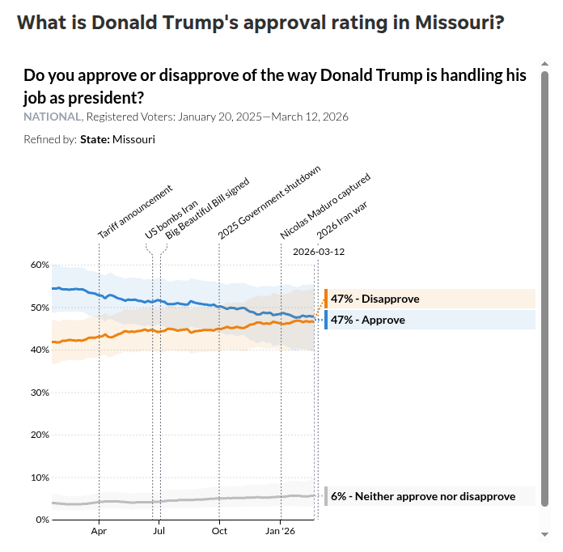
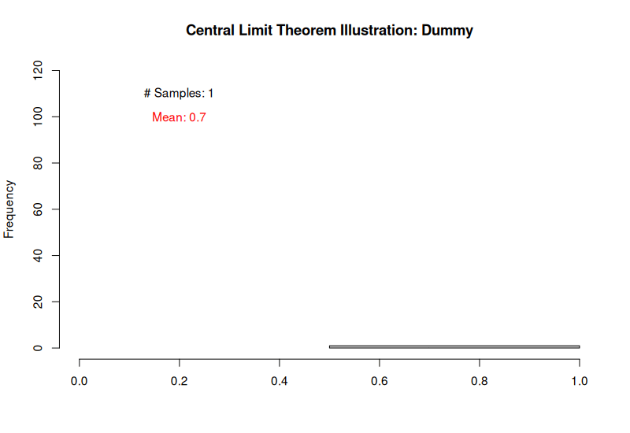
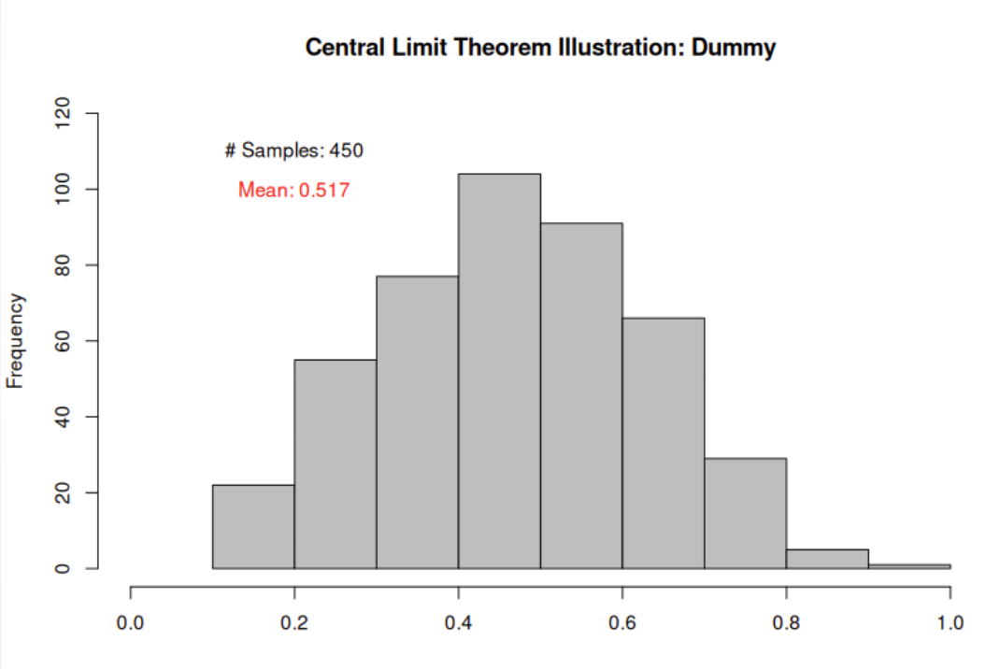
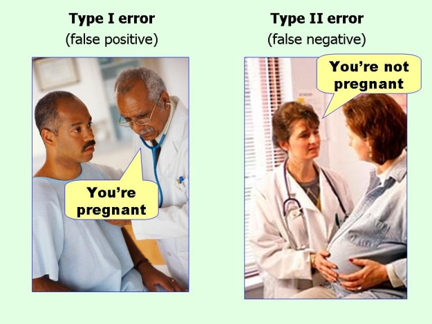
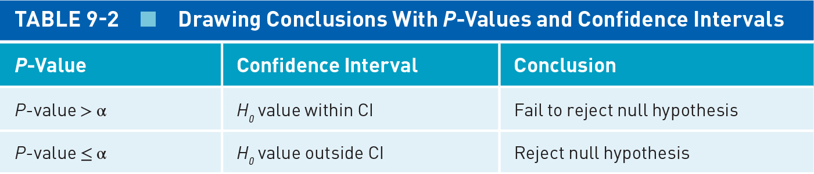

## Today's Agenda {background-image="Images/background-data_blue_v4.png" .center}

```{r}
library(tidyverse)
library(readxl)
library(kableExtra)
library(crosstable)

load("../../DATA/2026-Spring/ANES/ANES2020_Data_Extract.RData")
```

<br>

::: {.r-fit-text}

**Foundations of Statistical Inference**

- Null hypothesis testing

:::

<br>

::: r-stack
Justin Leinaweaver (Spring 2026)
:::

::: notes
Prep for Class

1. Review Canvas submissions

2. NOTE: Remember, they covered ALL of this material in the reading. You are reinforcing these ideas NOT introducing the

3. See "Central_Limit_Animation.R" file for all gifs

<br>

**SLIDE**: Let's recap our work last class

:::


## {background-image="Images/background-data_blue_v4.png" .center}

::: {.r-fit-text}
**Defining Statistics: Level 2**

Statistics helps us draw inferences from sample to population
:::

<br>

{style="display: block; margin: 0 auto"}

::: notes

On Monday, we started setting the foundations to enable us to perform statistical inference

- Inference is a process by which we study something specific in order to learn something generalizable

<br>

Examples:

- In survey terms that means asking 1,000 Americans a question while intending to use that to represent the opinion of all Americans

- In cross-national analyses, that's like analyzing 25 civil wars in order to identify the general causes of rebellion

<br>

**SLIDE**: The intuitions of inference

:::


## Statistical Inference: The Intuitions {background-image="Images/background-data_blue_v4.png" .center .smaller}

<br>

$$ \text{Sample Statistic} = \text{Pop. Parameter} \pm \text{Random Sampling Error} $$

<br>

$$ \text{Random Sampling Error} = \frac{\text{Variation component}}{\text{Sample size component}} $$

::: notes

Useful statistical inferences are built on two key intuitions

<br>

FIRST, we have to remember that every statistical estimate you make is actually a mix of the true population parameter AND random sampling error

- A single poll can tell us that the president's approval IN THAT SAMPLE is 35%

- But THAT estimate is a mix of signal and noise

- Some of it is us actually measuring the popular sentiment and some is random sampling error

<br>

SECOND, all random sampling error is a function of two things: variation and sample size

- The variation piece depends on the kinds of measure we design

    - e.g. Answering either yes or no, do you approve of the president?
    
    - e.g. On a 100 point scale, how would you rate your approval of the president?
    
    - The more variation, the higher the random error

- The sample size piece depends on how many people in your random sample

    - The bigger the sample, the smaller the random error

<br>

**SLIDE**: Sum those two intuitions and tell me how to react to this...

:::


## Statistical Inference: The Intuitions {background-image="Images/background-data_blue_v4.png" .center}

{style="display: block; margin: 0 auto"}

::: notes

I've never heard of "The Center Square" but here's what came up when googling Trump's approval

- **Based on these results can we conclude that most Americans are unhappy with Trump's performance? Why or why not?**

<br>

(Highly doubtful)

- EVERY sample statistic includes random sampling error, SO AN ESTIMATE IS ONLY USEFUL IF IT CAN TELL YOU HOW MUCH ERROR SURROUNDS IT!

- Where is the SE, a CI or a MoE???

<br>

When I see a news headline touting a change in presidential approval of 1 or 2 points or a change in unemployment of .1% I want to beat my head against the wall

- There's simply no way to know if those moves are meaningful without the error

- And given how those measures are made I don't believe those small differences can actually be distinguished from the error!

<br>

**SLIDE**: Better example

:::


## Statistical Inference: The Intuitions {background-image="Images/background-data_blue_v4.png" .center}

{style="display: block; margin: 0 auto"}

::: notes

Civiqs is a much better known public pollster

- Here we see the approval and disapproval lines include shaded region that is either a CI or a MoE

- I very much appreciate their attempt to include a measure of uncertainty here, but the note needs to make clear WHAT is being measured

<br>

**Given the measure of uncertainty here, what inference do we draw about Trump's approval rate?**

- (Impossible to know given the closeness of the proportions which is bigger in the population!)

- Remember, the variation component of the error is maximized when the proportions are close together!

<br>

**Does everybody see how our two intuitions about inference are important in the real world?**

<br>

**SLIDE**: From the intuitions we moved to the formulas that make these ideas more concrete!

:::


## Quantifying Uncertainty {background-image="Images/background-data_blue_v4.png"}

$$ \text{SE of the mean} (\bar{x}) = \frac{\sigma_x}{\sqrt{n}} $$

$$ \text{SE of a proportion} = \frac{\sqrt{p \times (1-p)}}{\sqrt{n}} $$

$$ \text{95% CI} = \text{Sample Statistic} \pm (1.96 \times \text{Standard Error}) $$

::: {.fragment}

{.absolute width="65%" left=200 bottom=0}

:::

::: notes

**Any questions on the formulas we reviewed last class?**

<br>

**Remind me, if I want a 90% CI instead of 95% what do I change in the CI equation?**

- (**REVEAL**)

- We know from this table that we can replace the 1.96 with other numbers to get different sized CIs

- 1.64 gets you a 90% CI, etc

<br>

The next question for us is why.

- Why are these the threshold numbers we need to calculate certain sized CIs?

<br>

We know from this table that these thresholds are z-scores

- Back in Chapter 3 when we explore variable transformations you all practiced converting measures into z-scores as an assignment

- **Remind me, how do you rescale a variable into its z-scores?**

- (**SLIDE**: From Chapter 3)

:::


## Standardizing Measures: Z-Score {background-image="Images/background-data_blue_v4.png"}

<br>

Transform observed sample values:

$$ z_i = \frac{x_i - \bar{x}}{s_x} $$

<br>

::: {.fragment}

Transform sample statistics:

$$ \text{Z score} = \frac{\bar{x} - \mu}{\text{SE of } \bar{x}} $$

:::

::: notes

As you all remember, we can transform an interval variable into z scores by:

1. Center a measure by subtracting the mean, then

2. Standardize the measure by dividing by the SD

<br>

So, we run a 100 person survey to measure presidential approval and we convert all of the responses to z-scores

- If the mean of the entire sample is 35% approval

- A respondent who gives the president 25% approval would have a negative z-score (below the mean) and specifying how far below in SD terms

- A respondent who gives the president 45% approval would have a positive z-score (above the mean) and specifying how far above in SD terms

- **Ringing a bell?**

<br>

**REVEAL**: In terms of inference, our interest in this chapter moves us from standardizing values and into standardizing statistics

- Each observation then represents distance from the mean in SE units

- What we just did for individual respondents we can now do for the entire survey

- THIS version of the z-score helps us figure out if our entire sample is above or below the population mean

- A positive z-score means your sample of 100 people are more positive about the president than the avg in the whole population

- The size of the z-score is how far away from the mean they are in SE terms

<br>

**SLIDE**: That's a dense turn, so let's explore this some more

:::


## {background-image="Images/background-data_blue_v4.png" .center}


::: notes

Standardizing values and sample statistics are all meant to let you interpret your data using a standard normal curve

- Standardizing MEANS transforming to a standard normal

<br>

I want to strongly emphasize that you read and re-read Section 8.2 of the textbook which is all about the standard normal curve and the central limit theorem

- The more you can deepen your understanding of the standard normal curve, the easier all of our advanced tools become to understand

- If you genuinely want to understand the material for the rest of the semester you should go back to this section every week or so an re-read it

- It will make WAY more sense each time you do

<br>

**SLIDE**: Let's play with another simulation to connect some dots

:::


## Simulate a Population {background-image="Images/background-data_blue_v4.png" .center}

```{r, echo=TRUE}
population1 <- sample(x = c("Heads", "Tails"), size = 1e6, 
                      replace = TRUE, prob = c(.52,.48))
```

<br>

```{r, echo=TRUE}
# Calculate the population parameter
table(population1)
```

<br>

```{r, echo=TRUE}
# Calculate the population parameter
proportions(table(population1))
```

::: notes

I'm using the sample function to generate a complete population

<br>

Imagine this is the flipping of an imaginary coin 1 million times and this represents EVERY flip of that coin in a single year

- This means the TRUE population probability for this coin is 52% heads

<br>

We never actually have access to the complete population and that's why we take samples!

- Our samples are meant to help us reveal the true population parameter

- **SLIDE**

:::


## Take a Single Sample {background-image="Images/background-data_blue_v4.png" .center}

```{r, echo=TRUE, eval=FALSE}
sample1 <- sample(x = population1, replace = TRUE, size = 10)
```

```{r}
sample1 <- c(rep("Heads", 7), rep("Tails", 3))
```

<br>

```{r, echo=TRUE, eval=FALSE}
# Calculate the sample statistic
table(sample1)
```

```{r}
table(sample1)
```

<br>

```{r, echo=TRUE, eval=FALSE}
# Calculate the sample statistic
proportions(table(sample1))
```

```{r}
proportions(table(sample1))
```

::: notes

So we take a random sample of 10 coin flips from the complete population and calculate the proportion of heads in those 10 flips 

<br>

REMEMBER, you don't know the true population %!

- So, this sample of ten flips gives us a heads probability of 70%

- **How confident are you that this sample accurately represents the population probability? Why?**

<br>

(You shouldn't be!)

- With only 10 out of a million flips we can't possibly be very accurate!

<br>

**Let's not just assume, everybody calculate the SE and CI for this sample statistic of 70%**

- **How big is the 95% CI?**

- (**SLIDE**)

:::


## How "precise" is our sample statistic? {background-image="Images/background-data_blue_v4.png" .center}

<br>

$$ \text{SE} = \frac{\sqrt{.7 \times .3}}{\sqrt{10}} = .145 $$

$$ \text{95% CI, Low} = .7 - 1.96 \times .145 = .42 $$

$$ \text{95% CI, High} = .7 + 1.96 \times .145 = .98 $$

::: notes

**Did everybody get these?**

<br>

**And how uncertain is our 70% estimate?**

- (That's a HUGE range of possible probabilities due to the very large SE)

- In other words, our ten coin sample is NOT at all precise

<br>

**But what does it mean to say that our SE here is .145?**

- **Remind me, what is the SE measuring?**

- (The average distance of our sample proportion to the population parameter)

<br>

BUT, how do we know the distance to the true population parameter based on a single, wildly uncertain estimate???

- Remember, our sample proportion has some signal in it (we drew it from the real population)

- Our SE formula is simply trying to say how much error is likely attached

- It doesn't know where the "truth" is, but it can estimate how far off we likely are

- **Make sense?**

<br>

Let's continue our simulation in order to see where the SE comes from

- **SLIDE**: Specifically, let's keep drawing new samples of ten coins each and see what happens

:::


## {background-image="Images/background-data_blue_v4.png" .center}

{style="display: block; margin: 0 auto"}

::: notes

Here I've animated the sampling process

- What your watching here is R randomly selecting 10 coins from the population and counting the number of heads then adding that estimate to this histogram

- I'm running this 450 times (meaning we're randomly selecting 450 sets of ten coins each)

- This lets us visualize ALL 450 random experiments on one plot

<br>

*After gif finishes*

Remember, this histogram represents 450 different samples

- This is essentially an overview of tons of hypothetical experiments drawing samples from the same population

<br>

**What do we see in this histogram of 450 separate random samples?**

- **Describe the results for me?**

1. (While some samples of ten coin flips have a super low or super high number of heads, most of our samples are right in the middle)

2. (This middle value is 52% which is also our population probability!)

<br>

**And what is the shape of the distribution here?**

- (A normal curve!)

<br>

**How do we get a normal distribution from a population of only two possible values: heads and tails?**

- (The central limit theorem)

- As you take more and more samples from the population, the means of those samples will follow a normal distribution!

- This is REGARDLESS of what the original data looked like!

<br>

**Everybody with me on this?**

- So what you're looking at here is the result of 450 separate 10 coin experiments

- And those 450 means create a normal curve!

<br>

**SLIDE**: Ok, that's a cool trick, but how does it connect to our prior work?

:::


## {background-image="Images/background-data_blue_v4.png" .center}

{style="display: block; margin: 0 auto"}

```{r}
population1 <- sample(x = c("Heads", "Tails"), size = 10000, replace = TRUE, prob = c(.52,.48))

test <- NA

for (i in 1:10000){
  
  test[i] <- mean(sample(population1, 10) == "Heads")

}
```

```{r, echo=TRUE}
# Standard Deviation
sd(test)
```

::: notes

**Remind me, what does the standard deviation measure?**

- (The spread of values around the mean)

<br>

**So, what does THIS standard deviation tell us?**

- (Each of our 450 coin flipping experiments missed the population parameter by an average of `r sd(test)`)

<br>

**Does that number look like anything else we've calculated so far?**

- (**SLIDE**: The SE!)

:::


## Connecting the Dots of Inference {background-image="Images/background-data_blue_v4.png" .center}

<br>

```{r, echo=TRUE}
# Standard Deviation
# e.g. spread of the sample stats around the population parameter
sd(test)
```

$$ \text{SE (Sample 1 %)} = \frac{\sqrt{.7 \times .3}}{\sqrt{10}} = .145 $$

::: {.fragment}

$$ \text{SE (All Samples %)} = \frac{\sqrt{.52 \times .48}}{\sqrt{10}} = .158$$

:::

::: notes

Your calculation of the SE was based on an estimated proportion of 70% heads, BUT we now know that was off

- **REVEAL**: Here's the SE updated to use the 52% we found in the mean of the histogram

<br>

**Ok, put this together for me, what does this mean the SE actually is?**

- (**SLIDE**)

:::


## {background-image="Images/background-data_blue_v4.png" .center}

{style="display: block; margin: 0 auto"}

Simulation SD = .158

Estimated SE = .158

::: notes

The standard error IS the standard deviation of the simulation

- It describes, on average, how far away your sample statistic is from the true population parameter

<br>

This means the SE formula is an approximation of what would happen if you ran your survey or experiment hundreds or thousands of times

- In other words, the SE gives you a sense of how far off your estimates are without making you actually run thousands of experiments

- A big SE relative to your estimate means you are likely far off the true population parameter and you should be careful interpreting the results

<br>

**Does that make sense?**

<br>

**SLIDE**: Let's take all this into our review of the Canvas assignments

:::


## Pollock & Edwards (2026) Ch 8 {background-image="Images/background-data_blue_v4.png" .center}

<br>

::: {.r-fit-text}

**Exercise 6**

- SE = 4 / √400 = 0.2

- 95% CI = 6 ± 2 × 0.2 = [5.6, 6.4]

:::

::: notes

Exercise 6 asks us to examine data on gender stereotypes

- Specifically, do people have a good sense of height differences by gender across the population?

- In the population, men, on average, are 5 inches taller than women

- Random sample of 400 individuals, mean difference in perceived heights is 6 inches, sample standard deviation is 4 inches.

<br>

**Everybody get these answers?**

<br>

**So, does the public overestimate the true height difference? Is there evidence of a gender stereotype here?**

- (Some evidence yes)

- (CI does not include true parameter difference of 5 inches)

<br>

**SLIDE**: Exercise 7

:::


## Pollock & Edwards (2026) Ch 8 {background-image="Images/background-data_blue_v4.png" .center}

<br>

::: {.r-fit-text}

**Exercise 7**

- SE = 8 / √100 = 0.8

- 95% CI = 47 ± 2 × 0.8 = [45.4, 48.6]

:::
::: notes

The sheriff is concerned about speeders on a certain stretch of county road

- Radar device calculates mean vehicle speed of 50 miles per hour

- Policy change: Cracks down on speeders

- New random sample (n = 100), sample mean 47 mph, sd 8mph

<br>

**Everybody get these answers?**

<br>

**So, is the skeptical county commissioner right? Has the crackdown failed?**

- (No!)

- The 95% CI does not include 50 mph, so the data suggests the crackdown had an effect

- The sample mean and confidence interval indicate a statistically significant reduction in average speed

<br>

Good work with the SE and CI formulas!

<br>

**SLIDE**: Let's shift to the material in Chapter 9 on hypothesis testing

:::


## Pollock & Edwards (2026) Ch 9 {background-image="Images/background-data_blue_v4.png" .center}

<br>

**Null Hypothesis Testing**

1. Specifying Research Hypothesis and Null Hypothesis

2. Setting Threshold for Statistical Significance

3. Estimating Parameters With Sample Data

4. P-Value and Confidence Interval Approaches

5. Drawing Conclusions

::: notes

Now that you have methods for calculating sample statistics AND quantifying the uncertainty in those estimates we can move to the next step

- All of this material in chapter 9 is helping us build to the point where we can "test" the relationships at the heart of our research questions

<br>

Moving forward we're going to explore and apply a process that is referred to as null hypothesis testing

- **SLIDE**: Let's step through these five steps in big picture

:::


## {background-image="Images/background-data_blue_v4.png" .center}

::: {.r-fit-text}
**1. Specify your research and null hypotheses**
:::

<br>

**Exercise 1**

- **How does age predict participation in political protests?**

    - Null hypothesis?
    
    - Directional hypothesis?

    - Non-Directional hypothesis?

::: notes

Step 1 of null hypothesis testing begins with specifying your null and research hypotheses

<br>

**What would a null hypothesis for this question be?**

- (There is no relationship between age and participating in a political protest)

- The null hypothesis (H0) states that, in the population, there is no relationship between the independent and dependent variables.

<br>

**Give me an example of a directional, research hypothesis for Exercise 1?**

- **What did you submit to Canvas?**

<br>

**Give me an example of a non-directional, research hypothesis for Exercise 1?**

- **What did you submit to Canvas?**

<br>

**SLIDE**: Step 2

<br>

*My Notes*

- A directional hypothesis specifies the expected direction of a relationship or difference between variables, such as predicting a positive or negative effect.

- A non-directional hypothesis predicts a significant relationship or difference but does not specify its direction, allowing for effects in either direction.

:::


## {background-image="Images/background-data_blue_v4.png" .center}

::: {.r-fit-text}
**2. Set a threshold for statistical significance**
:::

<br>

Null Hypothesis: There is no relationship between age and participating in a political protest

::: notes

Your second step in null hypothesis testing is to set the threshold for statistical significance

<br>

In null hypothesis testing we begin by asserting that the null hypothesis is true

- e.g. there is no relationship between age and participating in a political protest

- Step 2 requires us to specify what level of evidence we would need to see in order to reject the null 

<br>

We set this significance level while trying to avoid Type I and Type II errors

- **SLIDE**: My favorite way of thinking about the types of error

:::


## {background-image="Images/background-data_blue_v4.png" .center}

::: {.r-fit-text}
**2. Setting a Threshold for Statistical Significance**
:::

{style="display: block; margin: 0 auto"}

::: notes

A Type I error is called a false positive

- e.g. there is no relationship between the variables BUT you think there is

- In other words, you reject the null hypothesis when you shouldn't have

<br>

A Type II error is a false negative

- e.g. there IS a relationship between the variables BUT you don't believe it

- In other words, you ACCEPT the null hypothesis when you shouldn't have

<br>

The trick is setting a significance threshold to demand good evidence but not too much evidence

- If that sounds impossible, you're not alone in worrying about it.

<br>

**What is the conventional level of significance used by most researchers?**

- (5%)

- Famed statistician Sir Ronald Fisher proposed this threshold BUT he acknowledged it was an arbitrary line

- People kept asking for a standard and he liked the idea of plus or minus two standard deviations in a standard normal curve

<br>

My advice to you: Start at 5% but adjust your threshold based on what you are doing, the caliber of your evidence and the size of your sample. 

- If measurement is super precise then increase the threshold and consider the vice versa

- If you have a massive sample size almost certainly increase the threshold as sample size directly informs the size of your standard error

- REMEMBER, the goal of a scientist is to improve our knowledge NOT to find a "significant" result.

<br>

**SLIDE**: Step 3

:::


## {background-image="Images/background-data_blue_v4.png" .center}

::: {.r-fit-text}
**3. Estimating Parameters With Sample Data**
:::

<br>

```{r}
aggregate(anes, ft.trump.pre ~ econ.current + partyid3, mean) |>
 pivot_wider(names_from = partyid3, values_from = ft.trump.pre) |>
 kable(digits = 1, 
  col.names = c("View of the Economy", "Democrats", "Independents", "Republicans")) |>
 kable_styling(font_size = 30)
```

::: notes

Your third step in null hypothesis testing is to estimate the parameters of interest

- This is what we've been doing for the last few weeks (e.g. comparing proportions, means, etc with crosstabs and visualizations)

<br>

**SLIDE**: Step 4!

:::


## {background-image="Images/background-data_blue_v4.png" .center}

::: {.r-fit-text}
**4. Use inferential statistics to evaluate the threshold**
:::

<br>

::: {.fragment}

**Option 1: The Confidence Interval Approach**

$$ \text{95% CI} = \text{Sample Statistic} \pm (1.96 \times \text{Standard Error}) $$

```{r, fig.align='center', fig.asp=.618, fig.width=5}
tribble(
  ~cat1, ~low1, ~pred1, ~high1,
  "Reject", -1, 2, 5,
  "Accept", 2,4,6
) |>
  ggplot(aes(y = cat1, x = pred1)) +
  geom_point(size = 3) +
  theme_bw() +
  geom_vline(xintercept = 0, color = "darkgrey") +
  scale_x_continuous(limits = c(-2,7), breaks = -2:7) +
  geom_segment(aes(x = low1, xend = high1, y = cat1, yend = cat1), linetype = "dashed") +
  labs(x = "Sample Statistic", y = "") +
  scale_y_discrete(labels = c("Accept the Null", "Reject the Null"))
```
:::

::: notes

In step 4 of null hypothesis testing you use inferential statistics to check and see if the threshold you set in Step 2 has been met or not

- The book will walk us through two approaches to doing this and I think you should do both!

<br>

**REVEAL**: Approach 1 uses confidence intervals

- A CI tells you the range of values around your estimate that are 95% likely to include the true population parameter

- Assuming a conventional 5% threshold then calculating this CI will let you see if you can reject the null or not

- If the null is no relationship then it is typically the assumption that the effect on question is 0

    - e.g. increase predictor by 1 and outcome doesn't change

- If the CI includes zero in the range then you cannot reject the null

- In most real-world situations the CI will be the easiest way to communicate your finding to other people

<br>

**Make sense?**

<br>

**SLIDE**: Approach 2

:::


## {background-image="Images/background-data_blue_v4.png" .center}

::: {.r-fit-text}
**4. Use inferential statistics to evaluate the threshold**
:::

<br>

**Option 2: The P-Value Approach**

::: {.fragment}

- Assuming the null hypothesis is TRUE, how much random sampling error would it take to get your sample statistic? 

:::

::: notes

CIs are intuitive as they present a range of possible values, BUT they don't actually try to estimate the likelihood of getting your precise result

<br>

Approach 2 is the p-value and this gives you a single value that actually aims to test your precise result

- HOWEVER, it does it kind of backwards

<br>

The p-value is NOT the likelihood that your sample statistic matches the population parameter (e.g. your result is correct)

- **REVEAL**: It is the likelihood your result is possible ASSUMING the null is actually true

<br>

I'm going to say this again

- The p-value approach assumes a world where you are wrong

- The entire distribution of outcomes are centered around the null hypothesis as the mean

- The p-value measures how much error it would take to get to your result if the null is true

<br>

**SLIDE**: Let's visualize this

:::


## {background-image="Images/background-data_blue_v4.png" .center}

::: {.r-fit-text}
**4. Use inferential statistics to evaluate the threshold**
:::

**Option 2: The P-Value Approach**

```{r, fig.align='center', fig.asp=.618}
sample1 <- density(rnorm(n = 10000, mean = 0, sd = 1))

d1 <- tibble(
  x1 = sample1$x,
  y1 = sample1$y
) 

p1 <- d1 |>
  ggplot(aes(x = x1, y = y1)) +
  geom_line() +
  theme_bw() +
  labs(x = "", y = "Density") +
  scale_x_continuous(limits = c(-3.5, 3.5), breaks = -3:3,
      labels = c("-3", "-2", "-1", "Null\nHypothesis", "1", "2", "3"))

p1 +
  geom_vline(xintercept = 0, color = "darkred")
```

::: notes

We're back to our standard normal curve, except this time we're centering it on the null hypothesis

- e.g. the peak is where the estimated relationship between the predictor and the outcome is ZERO

<br>

**SLIDE**: Let's assume we want to give the null hypothesis a 95% CI

:::


## {background-image="Images/background-data_blue_v4.png" .center}

::: {.r-fit-text}
**4. Use inferential statistics to evaluate the threshold**
:::

**Option 2: The P-Value Approach**

```{r, fig.align='center', fig.asp=.618}
p1 +
  geom_area(data = subset(d1, d1$x1 <= 1.96 & d1$x1 >= -1.96), fill = "lightblue") +
  geom_vline(xintercept = 0, color = "darkred")
```

::: notes

The p-value approach centers the standard normal curve at 0, the null, AND gives it the benefit of a 95% CI

- This means that any sample statistic you calculate with a Z-score between -1.96 and 1.96 gets REJECTED

<br>

**Does this make sense?**

<br>

**SLIDE**: So, how do you reject the null?

:::


## {background-image="Images/background-data_blue_v4.png" .center}

::: {.r-fit-text}
**4. Use inferential statistics to evaluate the threshold**
:::

**Option 2: The P-Value Approach**

```{r, fig.align='center', fig.asp=.618}
p1 +
  geom_area(data = subset(d1, d1$x1 <= -1.96), fill = "lightblue") +
  geom_area(data = subset(d1, d1$x1 >= 1.96), fill = "lightblue") +
  geom_vline(xintercept = 0, color = "darkred")
```

::: notes

In a two-tailed test, our usual approach, requires sample statistic Z-score be in the tails

- e.g. ABOVE 1.96 or BELOW -1.96

<br>

The various tools we will learn next class will let you estimate the p-values associated with various sample statistics

<br>

**SLIDE**: Final step!

:::


## {background-image="Images/background-data_blue_v4.png" .center}

::: {.r-fit-text}
**5. Draw conclusions and communicate your findings**
:::

<br>

{style="display: block; margin: 0 auto"}

::: notes

My advice going forward will be to perform both tests each time

- The CI helps you communicate your findings and shows a range or possible population parameters

- The p-value approach asks if your findings survive a comparison to the null hypothesis

- If you can't tell the difference, you can't be confident you've found something useful!

<br>

**SLIDE**: Practice

:::


## Pollock & Edwards (2026) Ch 9 {background-image="Images/background-data_blue_v4.png" .center}

<br>

**Null Hypothesis Testing**

1. Specifying Research Hypothesis and Null Hypothesis

2. Setting Threshold for Statistical Significance

3. Estimating Parameters With Sample Data

4. P-Value and Confidence Interval Approaches

5. Drawing Conclusions

::: notes

**Questions on the five steps of null hypothesis testing?**

<br>

*In future, feel free to put the pracitce ANES exercise back in*

<br>

**SLIDE**: For next class

:::


## For Next Class {background-image="Images/background-data_blue_v4.png" .center}

<br>

::: {.r-fit-text}

Pollock and Edwards (2026): Chapter 9

- Read p229-244

- Submit selected exercises to Canvas

:::

::: notes

Chapter 9 Assessment (NOTE to you: No difference of proportions in textbook exercises so give them your own...)

1. The Rome Statute (1998) is an international treaty that designed and organized the International Criminal Court (ICC). As of June 2021, 75 democracies (out of 86 invited) and 29 autocracies (out of 82 invited) had ratified the treaty. Perform a two-sample significance test of the difference in proportions between democratic and autocratic ratifications of the Rome Statute.
    - Research hypothesis: Democracies are more likely to join the ICC than autocracies
    - Null hypothesis: There is no difference between the likelihoods of democracies and autocracies in joining the ICC.
    1) Calculate the standard error of the difference in the proportions
    2) Calculate the 95% CI for the difference in proportions 
    3) Does the CI of the difference suggest we can reject the null hypothesis? Why or why not?
    
2. Submit your answers to Exercise 3 on p245 (two sample difference of means test)

3. Submit your answers to Exercise 4 on p245-246 (two sample difference of means test)

4. Was there anything specific in the excerpt that didn't make sense or that you'd like to make sure we discuss in class?

:::


