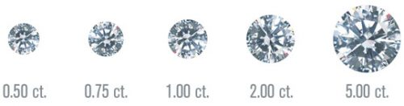

# Today's Agenda {background-image="Images/background-data_blue_v4.png"}

```{r}
library(tidyverse)
library(readxl)
library(kableExtra)
library(modelsummary)
library(modelr)
library(ggeffects)
```

<br>

::: {.r-fit-text}

**Ordinary Least Squares (OLS) Regression**

- The concepts and tools

:::

<br>

::: r-stack
Justin Leinaweaver (Spring 2025)
:::

::: notes
Prep for Class

1. Update presidential results (if needed)

<br>

Today we begin exploring regressions: A powerful and common tool used by scientists of all stripes for estimating relationships

<br>

**IMPORTANT**: You have to keep up with the assigned readings

- Today's class SHOULD NOT be your intro to regression!

- Everything today will make so much more sense if you already have been exposed to basic elements

<br>

Regression, to the uninitiated, will appear confusing.

- BUT I promise that each time you go through the material it will make more sense
:::


## {background-image="Images/background-slate_v2.png" .center}

::: {.r-fit-text}
**Part 1 **

<br>

**Why do scientists use regressions?**
:::

::: notes
Big picture:

- What is a "regression"?

- And why do we need it?
:::


## {background-image="Images/background-slate_v2.png" .center}

```{r, fig.align = 'center', fig.asp=.7, fig.width = 6, cache=TRUE}
diamonds |>
  slice_sample(prop = .1) |>
  ggplot(aes(x = carat, y = price)) +
  geom_point(alpha = .05) +
  theme_bw() +
  labs(x = "Carats", y = "Price",
       title = str_c("The correlation of diamond weight to price is ", round(cor(diamonds$carat, diamonds$price), 2))) +
  scale_y_continuous(labels = scales::dollar_format()) +
  coord_cartesian(xlim = c(0,4))
```

::: notes

Let's start by looking at some data you are now pretty familiar with from last week.

- The diamonds dataset includes details on 53k+ diamonds in terms of their characteristics and estimated prices

<br>

### What conclusions can we draw based on the visualization and the correlation?

- (Bigger diamonds are typically more expensive)

- (There is a strong linear correlation between the two variables)

<br>

As a matter of description these two data summaries are very useful.

- Thanks to these we have a much better sense of what the world of diamonds actually looks like

<br>

HOWEVER, this approach is also incredibly limited for helping us understand HOW and WHY these two things are related

<br>

**SLIDE**: I think these limitations are most evident when we try to answer specific questions with our summaries
:::


## {background-image="Images/background-slate_v2.png" .center}

**How much more should we expect to pay in order to move from a 1.5 carat to a 2.5 carat diamond?**

```{r, fig.align = 'center', fig.asp=.7, fig.width = 6, cache=TRUE}
range1 <- range(diamonds$price[diamonds$carat == 1.5])
range2 <- range(diamonds$price[diamonds$carat == 2.5])

diamonds |>
  slice_sample(prop = .1) |>
  ggplot(aes(x = carat, y = price)) +
  geom_point(alpha = .05) +
  theme_bw() +
  labs(x = "Carats", y = "Price") +
  scale_y_continuous(labels = scales::dollar_format()) +
  coord_cartesian(xlim = c(0,4)) +
  annotate("segment", x = 1.5, xend = 1.5, y = range1[1], yend = range1[2], color = "blue", arrow = arrow(angle = 90, length = unit(0.1, "inches"), ends = "both")) +
  annotate("segment", x = 2.5, xend = 2.5, y = range2[1], yend = range2[2], color = "blue", arrow = arrow(angle = 90, length = unit(0.1, "inches"), ends = "both"))
```

::: notes

Now that we have access to real diamond prices for 53k examples, it MUST be possible to answer simple questions like this.

<br>

**Based on your tools to this point in the class, what kind of answer could we provide to this question?**

- **What tools could you use to provide an answer to this question?**

<br>

- (**SLIDE**: Results)
:::


## Using Descriptive Statistics {background-image="Images/background-slate_v2.png" .center}

```{r, echo=TRUE}
# Make subsets
diamonds1_5 <- filter(diamonds, carat == 1.5)
diamonds2_5 <- filter(diamonds, carat == 2.5)
```

<br>

```{r, echo=TRUE}
# Summarize
summary(diamonds1_5$price)
```

<br>

```{r, echo=TRUE}
summary(diamonds2_5$price)
```

::: notes

**What answer could we give using these descriptive stats?**

<br>

**Is this a good answer? Why or why not?**

- **In other words, why not just answer the question by comparing the prices of 1.5 and 2.5 carat diamonds in the dataset?**

:::


## The Limits of Descriptive Statistics {background-image="Images/background-slate_v2.png" .center}

<br>

::: {.r-fit-text}
**1. Choosing a point of comparison is somewhat arbitrary**
:::

```{r, echo=FALSE, fig.align='center', fig.asp=.618, cache=TRUE}
# Overlapping densities
diamonds |>
  mutate(
    class2 = case_when(
      carat == 1.5 ~ "1.5 carats",
      carat == 2.5 ~ "2.5 carats",
      TRUE ~ NA_character_
    )
  ) |>
  na.omit() |>
  ggplot(aes(x = price, fill = class2)) +
  geom_density(alpha = .5) +
  theme_bw() +
  scale_x_continuous(labels = scales::dollar_format()) +
  labs(x = "Diamond Prices", y = "Density", fill = "")

# diamonds |>
#   mutate(
#     class2 = case_when(
#       carat == 1.5 ~ "1.5 carats",
#       carat == 2.5 ~ "2.5 carats",
#       TRUE ~ NA_character_
#     )
#   ) |>
#   na.omit() |>
#   ggplot(aes(x = price)) +
#   #geom_histogram(bins = 20) +
#   geom_density() +
#   theme_bw() +
#   facet_wrap(~class2, ncol = 1, scales = "free_y")
```

::: notes
Quick Aside: These are density curves

- Think of them like a smoothed version of a histogram.

- Useful because you don't have to play with bin sizes and and its easier to overlay two distributions on top of each other

<br>

Back to the point! The FIRST big problem with trying to answer our question with descriptive stats is that our choice of comparison is somewhat arbitrary

- There isn't really a robust way to defend our choice of which descriptive stats to compare

- e.g. compare means, medians, IQRs?

<br>

In this case comparing the means and medians shows an increase in price with weight, but comparing the maximums doesn't

- Is one of these more "true" or "correct" than the others?

- What if you have one of the super expensive small diamonds? You could upgrade and get money back!

<br>

This is why descriptive stats are important for helping the reader see your data but not necessarily for answering specific questions on their own.

- These stats give us a sense of the distribution, but the distribution isn't the same as a sense of any single diamond chosen at random

:::


## The Limits of Descriptive Statistics {background-image="Images/background-slate_v2.png" .center}

<br>

**2. Hard to quantify uncertainty**

```{r, echo=FALSE, fig.align='center', fig.asp=.618, cache=TRUE}
# Overlapping densities
diamonds |>
  mutate(
    class2 = case_when(
      carat == 1.5 ~ "1.5 carats",
      carat == 2.5 ~ "2.5 carats",
      TRUE ~ NA_character_
    )
  ) |>
  na.omit() |>
  ggplot(aes(x = price, fill = class2)) +
  geom_boxplot() +
  theme_bw() +
  scale_x_continuous(labels = scales::dollar_format()) +
  labs(x = "Diamond Prices", y = "Density", fill = "")
```

::: notes

**REVEAL**: The SECOND big problem is that this approach doesn't give us an easy way to describe our uncertainty in the comparisons

- These descriptive stats don't include any caveats for sample size or precision

- In other words, how confident should we be in these estimates of the mean or median?

<br>

We have the standard deviation for the mean, but nothing exactly comparable for the other comparisons.

:::


## The Limits of Descriptive Statistics {background-image="Images/background-slate_v2.png" .center}

<br>

**3. Sample size matters (and may be hidden)!**

```{r, echo=TRUE}
# Count the observations
nrow(diamonds1_5)
```

<br>

```{r, echo=TRUE}
nrow(diamonds2_5)
```

::: notes

THIRD big problem, the descriptive statistics approach can mislead you if the subsets of the data are small!

- Out of 53k diamonds in this dataset only 793 have exactly 1.5 carats (e.g. 1%)

- Out of 53k diamonds in this dataset only 17 have exactly 2.5 carats (e.g. .03%)

- We probably shouldn't be confident drawing conclusions about the relationship between diamond weight and value using 1% of the sample!

<br>

**SLIDE**: Regression can help us with all three issues!
:::


## Part 1 {background-image="Images/background-slate_v2.png" .center}

**Why do scientists use regressions?**

<br>

1. Key assumption: "regression to the mean"

2. Produces estimates based on ALL of the data

3. Produces estimates with measures of uncertainty

::: notes

Let's now talk through these characteristics to make sure we're clear on the intutions underpinning regression

- **SLIDE**
:::


## 'Regression to the mean' {background-image="Images/background-slate_v2.png" .center}

```{r, echo = FALSE, fig.align = 'center', out.width = '66%'}
knitr::include_graphics("Images/11_1-Galtons-rate_regression-diagram.png")
```

::: notes

The answer to that question, and the word "regression" itself comes from the work of a 19th century statistician, Sir Francis Galton.

<br>

In 1886 he ran a now very famous experiment in which he gathered the heights of 930 children and their parents.

- The horizontal line here is the average height of the sample

- Dots below the line are shorter than average, above the line taller

- The average parent heights are on one line and their kids on the other

<br>

Generally, what Galton found was:

1. The children of tall parents tended to be taller than average, BUT were shorter than their parents

2. The children of short parents were taller than their parents but still shorter than average

<br>

Galton described this as "regression to the mean"

- In short, across tons of different processes in nature we typically see extreme observations followed by less extreme observations

- For example, a football player with a long career of being average may put up an all star year, but the odds are that next year they go back to their averages

<br>

**SLIDE**: Let me clarify this with a simulation
:::


## Let's Simulate an Experiment! {background-image="Images/background-slate_v2.png" .center}

:::: {.columns}
::: {.column width="50%"}
```{r, fig.align='center', fig.asp=1, fig.width=6, cache=TRUE}
# Set up
d_base <- tibble(
  obs = 1:100,
  current = 50
)

p1 <- ggplot(data = d_base, aes(x = current, y = obs)) +
  scale_x_continuous(limits = c(0, 100), breaks = seq(0, 100, 10), labels = c("", seq(10, 50, 10), seq(40, 10, -10), "")) +
  ggthemes::theme_tufte() +
  geom_vline(xintercept = seq(0, 100, 10), color = "white") +
  geom_vline(xintercept = 50, color = "white", linewidth = 1.4) +
  theme(panel.background = element_rect(fill = "springgreen3", colour = "springgreen3")) +
  geom_rect(xmin = -5, xmax = 0, ymin = -5, ymax = 105, fill = "white", color = "black") +
  geom_rect(xmin = 100, xmax = 105, ymin = -5, ymax = 105, fill = "white", color = "black") +
  labs(x = "", y = "") +
  scale_y_continuous(labels = NULL)

p1 +
  geom_point(data = d_base, size = 2.5, color = "red")
```
:::

::: {.column width="50%"}
```{r, fig.align='center', fig.asp=1, fig.width=6, cache=TRUE}
d_base |>
  mutate(
    current_f = factor(current, levels = seq(40,60, 1))
  ) |>
  ggplot(aes(x = current_f)) +
  geom_bar(width = .7) +
  theme_bw() +
  scale_x_discrete(drop = FALSE) +
  labs(x = "", y = "Count of Positions")
```
:::
::::

::: notes

*Idea taken from McElreath book*

<br>

Imagine we line up 100 people on the 50 yard line of a football field

- Each person gets a fair coin

- We will ask each person to flip the coin
    - Heads take one step to the right (+1)
    - Tails take one step to the left (-1)

<br>

On the left I have a picture of our hypothetical field and all 100 subjects

On the right I have a bar plot showing where on the field each person is now

<br>

### Questions on the set-up here?

<br>

Let's collect some guesses about the outcome of this experiment

<br>

**After 10 flips of the coin, how many of our 100 subjects will still be on the 50 yard line?**

- *ON BOARD*

:::


## Coin Flip 1 {background-image="Images/background-slate_v2.png" .center}

<br>

:::: {.columns}
::: {.column width="50%"}
```{r, fig.align='center', fig.asp=1, fig.width=6, cache=TRUE}
# Flip 1 coin
d1 <- d_base |>
  mutate(
    flip = sample(x = c(-1, 1), size = 100, prob = c(.5, .5), replace = TRUE),
    new = current + flip
  )

p1 +
  geom_point(data = d1, size = 2.5, color = "red", aes(x = new))
```
:::

::: {.column width="50%"}
```{r, fig.align='center', fig.asp=1, fig.width=6, cache=TRUE}
d1 |>
  mutate(
    new_f = factor(new, levels = seq(45,55, 1))
  ) |>
  ggplot(aes(x = new_f)) +
  geom_bar(width = .7) +
  theme_bw() +
  scale_x_discrete(drop = FALSE) +
  labs(x = "", y = "Count of Positions")
```
:::
::::

::: notes
After the first flip EVERYONE has moved away from the 50 yard line by one randomly selected step!

:::


## Coin Flip 2 {background-image="Images/background-slate_v2.png" .center}

<br>

:::: {.columns}
::: {.column width="50%"}
```{r, fig.align='center', fig.asp=1, fig.width=6, cache=TRUE}
# Flip again
d2a <- d1 |>
  mutate(
    current = new,
    flip = NULL,
    new = NULL
  )

d2 <- d2a |>
  mutate(
    flip = sample(x = c(-1, 1), size = 100, prob = c(.5, .5), replace = TRUE),
    new = current + flip
  )

p1 +
  geom_point(data = d2, size = 2.5, color = "red", aes(x = new))
```
:::

::: {.column width="50%"}
```{r, fig.align='center', fig.asp=1, fig.width=6, cache=TRUE}
d2 |>
  mutate(
    new_f = factor(new, levels = seq(45,55, 1))
  ) |>
  ggplot(aes(x = new_f)) +
  geom_bar(width = .7) +
  theme_bw() +
  scale_x_discrete(drop = FALSE) +
  labs(x = "", y = "Count of Positions")
```
:::
::::

::: notes
After two random steps we have about half the sample two steps away from the 50 yard line and half back on it!
:::


## Coin Flip 3 {background-image="Images/background-slate_v2.png" .center}

<br>

:::: {.columns}
::: {.column width="50%"}
```{r, fig.align='center', fig.asp=1, fig.width=6, cache=TRUE}
# Flip again
d3a <- d2 |>
  mutate(
    current = new,
    flip = NULL,
    new = NULL
  )

d3 <- d3a |>
  mutate(
    flip = sample(x = c(-1, 1), size = 100, prob = c(.5, .5), replace = TRUE),
    new = current + flip
  )

p1 +
  geom_point(data = d3, size = 2.5, color = "red", aes(x = new))
```
:::

::: {.column width="50%"}
```{r, fig.align='center', fig.asp=1, fig.width=6, cache=TRUE}
d3 |>
  mutate(
    new_f = factor(new, levels = seq(45,55, 1))
  ) |>
  ggplot(aes(x = new_f)) +
  geom_bar(width = .7) +
  theme_bw() +
  scale_x_discrete(drop = FALSE) +
  labs(x = "", y = "Count of Positions")
```
:::
::::

::: notes

Ok, third flip

<br>

Again, random flips have moved some further away from the 50 and a number have again returned closer!

<br>

**SLIDE**: Let's unpack what were' seeing here with simple counting
:::


## Coin Flip 3: Possible Paths {background-image="Images/background-slate_v2.png" .center}

<br>

:::: {.columns}
::: {.column width="50%"}
```{r, fig.retina=3, fig.align='center', fig.asp=1, fig.width=6, cache=TRUE}
# Flip again
p1 +
  geom_point(data = d3, size = 2.5, color = "red", aes(x = new))
```
:::

::: {.column width="25%"}
- H, T, T = -1
- T, H, T = -1
- T, T, H = -1
- H, H, T = +1
- H, T, H = +1
- T, H, H = +1
:::

::: {.column width="25%"}
- T, T, T = -3
- H, H, H = +3
:::
::::

::: notes
There are only eight possible outcomes from flipping a fair coin 3 times

- In six of these eight outcomes the flipper is only 1 step away from the starting point! (75%)

- In only two of the outcomes has a flipper moved three steps away

<br>

So, apply these percentages to any group of subjects and our expectation is that after three flips most are very close to the starting place!

<br>

**SLIDE**: Let's check four flips!
:::


## Coin Flip 4: Possible Paths {background-image="Images/background-slate_v2.png" .center .smaller}

<br>

:::: {.columns}
::: {.column width="40%"}
```{r, fig.retina=3, fig.align='center', fig.asp=1, fig.width=6, cache=TRUE}
# Flip again
d4a <- d3 |>
  mutate(
    current = new,
    flip = NULL,
    new = NULL
  )

d4 <- d4a |>
  mutate(
    flip = sample(x = c(-1, 1), size = 100, prob = c(.5, .5), replace = TRUE),
    new = current + flip
  )

p1 +
  geom_point(data = d4, size = 2.5, color = "red", aes(x = new))
```
:::

::: {.column width="20%"}
- T, H, T, H = 0
- H, T, H, T = 0
- H, T, T, H = 0
- H, H, T, T = 0
- T, H, H, T = 0
- T, T, H, H = 0
:::

::: {.column width="20%"}
- H, T, T, T = -2
- T, H, T, T = -2
- T, T, H, T = -2
- T, T, T, H = -2
- H, H, H, T = +2
- H, H, T, H = +2
- H, T, H, H = +2
- T, H, H, H = +2
:::

::: {.column width="20%"}
- T, T, T, T = -4
- H, H, H, H = +4
:::
::::

::: notes

Here we see the 16 ways a person could flip a coin four times.

- We expect 38% of our subjects (6/16) to end up back on the 50!

- All in that puts 88% of subjects (14/16) within 2 steps!

- Only 2 paths or 13% reach the extremes!

<br>

**SLIDE**: And check the bar plot!
:::


## Coin Flip 4 {background-image="Images/background-slate_v2.png" .center}

<br>

:::: {.columns}
::: {.column width="50%"}
```{r, fig.retina=3, fig.align='center', fig.asp=1, fig.width=6, cache=TRUE}
p1 +
  geom_point(data = d4, size = 2.5, color = "red", aes(x = new))
```
:::

::: {.column width="50%"}
```{r, fig.retina=3, fig.align='center', fig.asp=1, fig.width=6, cache=TRUE}
d4 |>
  mutate(
    new_f = factor(new, levels = seq(45,55, 1))
  ) |>
  ggplot(aes(x = new_f)) +
  geom_bar(width = .7) +
  theme_bw() +
  scale_x_discrete(drop = FALSE) +
  labs(x = "", y = "Count of Positions")
```
:::
::::

::: notes
And here we see the results of our experiment after flip 4.

- Adding together a bunch of small, randomly assigned changes means that extremes tend to counter each other

<br>

**SLIDE**: Let's jump ahead to flip 10!
:::


## Coin Flip 10 {background-image="Images/background-slate_v2.png" .center}

<br>

:::: {.columns}
::: {.column width="50%"}
```{r, fig.align='center', fig.asp=1, fig.width=6, cache=TRUE}
# Simulate 10 flips
repo10 <- vector("list", 10)

for (i in 1:10) {
  repo10[[i]] <- sample(x = c(-1, 1), size = 100, prob = c(.5, .5), replace = TRUE)
}

d10 <- d1

d10$current <- as_tibble(repo10, .name_repair = "unique") |>
  rowSums() + 50

p1 +
  geom_point(data = d10, size = 2.5, color = "red")
```
:::

::: {.column width="50%"}
```{r, fig.align='center', fig.asp=1, fig.width=6, cache=TRUE}
d10 |>
  mutate(
    current_f = factor(current, levels = seq(40,60, 1))
  ) |>
  ggplot(aes(x = current_f)) +
  geom_bar(width = .7) +
  theme_bw() +
  scale_x_discrete(drop = FALSE) +
  labs(x = "", y = "Count of Positions")
```
:::
::::

::: notes
The results will always be different given the random coin flips, but after ten flips we tend to see:

- 25-30% of cases on the 50 yard line

- 55% within 2 steps!

<br>

The key observation: When you add a bunch of small differences together there are more ways for them to stay near the average than near one of the extremes.

- The output of most complex systems in the natural world are more likely to produce values close to the "normal" than at the extremes.

:::


## 'Regression to the mean'{background-image="Images/background-slate_v2.png" .center}

```{r, echo = FALSE, fig.align = 'center', out.width = '66%'}
knitr::include_graphics("Images/11_1-Galtons-rate_regression-diagram.png")
```

::: notes

THIS is what Galton found with his research into parent-child heights.

- The mix of factors that explain why someone is very tall or very short (e.g. the extreme values) are less likely than those that reproduce the average

- HENCE, tall parents more likely to have kids shorter than them

- HENCE, short parents more likely to have kids taller than them

<br>

THIS is the power of regression.

- When trying to represent a relationship why not use the means since the world conspires to reach the averages?

<br>

### Any questions on the intuition of why predicting the average is frequently useful for us?

<br>

**SLIDE**: Time to talk about what regression produces, how to interpret it and how to fit them in R
:::


## {background-image="Images/background-slate_v2.png" .center}

Regression is a technique for estimating the relationship between predictor variables (X) and an outcome (Y) using the formula for a line.

<br>

::::: {.columns}
:::: {.column width="50%"}
```{r, fig.align = 'center', fig.asp=.8, fig.width = 6, cache=TRUE}
diamonds |>
  slice_sample(prop = .1) |>
  ggplot(aes(x = carat, y = price)) +
  geom_point(alpha = .05) +
  geom_smooth(method = "lm", se = FALSE) +
  theme_bw() +
  labs(x = "Carats", y = "Price",
       title = str_c("The correlation of diamond weight to price is ", round(cor(diamonds$carat, diamonds$price), 2))) +
  scale_y_continuous(labels = scales::dollar_format())
```
::::

:::: {.column width="50%"}

<br>

::: {.r-fit-text}
Y = $\alpha$ + $\beta$ X
:::

::::
:::::

::: notes
So, a simple regression estimates the relationship between two numeric variables with a straight line.

- This means it generates an estimate of the relationship between weight and price based on ALL of the data and not just two subsets

<br>

And reaching back to your old math classes, and the readings for today, the formula for a line represents this relationship

- The 'Y' is the outcome of interest (e.g. diamond price)

- The 'X' is the predictor (e.g. diamond weight)

- The 'alpha' is the y-intercept (e.g. where the line crosses the y-axis)

- The 'beta' is the slope term and that represents the relationship between the two variables

<br>

**With me so far?**

<br>

So, we want to draw a line that represents the relationship between two numeric variables.

- The next question is, "how"?
:::


## {background-image="Images/background-slate_v2.png" .center}

```{r, fig.retina=3, fig.align='center', fig.width=8, fig.asp=0.618, cache=TRUE}
diamonds |>
  slice_sample(prop = .4) |>
  ggplot(aes(x = carat, y = price)) +
  geom_point(alpha = .05) +
  annotate("point", x = mean(diamonds$carat), y = mean(diamonds$price), color = "red", size = 3) +
  theme_bw() +
  labs(x = "Carats", y = "Price") +
  coord_cartesian(xlim = c(0,4)) +
  scale_y_continuous(labels = scales::dollar_format()) +
  annotate("text", x = 3, y = 5000, label = str_c("mean(Carats) = ", round(mean(diamonds$carat), 2)), size = 5) +
  annotate("text", x = 3, y = 2500, label = str_c("mean(Price) = ", round(mean(diamonds$price), 2)), size = 5)
```

::: notes

Back to the diamonds!

<br>

Let's draw a line using the logic of regression to the mean

- And that means starting by identifying the mean of the sample

:::


## {background-image="Images/background-slate_v2.png" .center}

```{r, fig.retina=3, fig.align='center', out.width='96%', fig.width=8, fig.asp=0.618, cache=TRUE}
## Add line guesses
x1 <- .798
y1 <- 3933
x2 <- 0
y2 <- 0
x3 <- .25
y3 <- 500
x4 <- .5
y4 <- 500

b1 <- (y2-y1)/(x2-x1)
a1 <- y1 - b1*x1

b2 <- (y3-y1)/(x3-x1)
a2 <- y1 - b2*x1

b3 <- (y4-y1)/(x4-x1)
a3 <- y1 - b3*x1


diamonds |>
  slice_sample(prop = .4) |>
  ggplot(aes(x = carat, y = price)) +
  geom_point(alpha = .05) +
  geom_abline(slope = b1, intercept = a1, color = "green", size = 1.1) +
  geom_abline(slope = b2, intercept = a2, color = "orange", size = 1.1) +
  geom_abline(slope = b3, intercept = a3, color = "purple", size = 1.1) +
  annotate("point", x = mean(diamonds$carat), y = mean(diamonds$price), color = "red", size = 3) +
  theme_bw() +
  labs(x = "Carats", y = "Price") +
  coord_cartesian(xlim = c(0,4)) +
  scale_y_continuous(labels = scales::dollar_format()) +
  annotate("text", x = 3, y = 5000, label = str_c("mean(Carats) = ", round(mean(diamonds$carat), 2)), size = 5) +
  annotate("text", x = 3, y = 2500, label = str_c("mean(Price) = ", round(mean(diamonds$price), 2)), size = 5)
```

::: notes
That gives us our first point in our model.

- However, we need two points to make a line.

<br>

**SLIDE**: Let's keep following the logic of regression to the mean
:::


## {background-image="Images/background-slate_v2.png" .center}

```{r, fig.retina=3, fig.align='center', out.width='96%', fig.width=8, fig.asp=0.618, cache=TRUE}
# Quadrant Counts
quad_counts <- diamonds |>
  mutate(
    Quadrants = case_when(
      carat < mean(diamonds$carat) & price > mean(diamonds$price) ~ "1",
      carat < mean(diamonds$carat) & price < mean(diamonds$price) ~ "3",
      carat > mean(diamonds$carat) & price > mean(diamonds$price) ~ "2",
      carat > mean(diamonds$carat) & price < mean(diamonds$price) ~ "4"
    )
  ) |> 
  count(Quadrants)

diamonds |>
  slice_sample(prop = .1) |>
  ggplot(aes(x = carat, y = price)) +
  geom_point(alpha = .05) +
  annotate("point", x = mean(diamonds$carat), y = mean(diamonds$price), color = "red", size = 2) +
  geom_vline(xintercept = mean(diamonds$carat), color = "red", linetype = "dashed") +
  geom_hline(yintercept = mean(diamonds$price), color = "red", linetype = "dashed") +
  scale_y_continuous(labels = scales::dollar_format()) +
  theme_bw() +
  labs(x = "Carats", y = "Price ($)") +
  annotate("text", x = c(0, 1, 0, 1), y = c(17000, 17000, 500, 500), label = c("1", "2", "3", "4"), size = 7, color = "red") +
  coord_cartesian(xlim = c(0,4)) +
  annotate("text", x = 3, y = c(16000, 14000, 12000, 10000), 
           label = c(str_c("Quadrant 1: ", scales::comma(quad_counts$n[1])),
                     str_c("Quadrant 2: ", scales::comma(quad_counts$n[2])),
                     str_c("Quadrant 3: ", scales::comma(quad_counts$n[3])),
                     str_c("Quadrant 4: ", scales::comma(quad_counts$n[4]))), 
           size = 5, hjust = 0)
```

::: notes
The model line should follow the data, so let's divide the plot into four quadrants split around the mean values.

<br>

Once we have our quadrants we can focus on the one with the most observations.
:::


## {background-image="Images/background-slate_v2.png" .center}

```{r, fig.retina=3, fig.align='center', out.width='96%', fig.width=8, fig.asp=0.618, cache=TRUE}
# Quadrant 3 stats
quad3 <- diamonds |>
  filter(carat < mean(diamonds$carat), price < mean(diamonds$price)) |>
  pivot_longer(cols = c(carat, price), names_to = "Variable", values_to = "Values") |>
  group_by(Variable) |>
  summarize(
    Mean = round(mean(Values), 2)
  ) |>
  mutate(
    Group = "Quadrant 3"
  ) |>
  select(Group, everything())

diamonds |>
  slice_sample(prop = .1) |>
  ggplot(aes(x = carat, y = price)) +
  geom_point(alpha = .05) +
  annotate("point", x = mean(diamonds$carat), y = mean(diamonds$price), color = "red", size = 4) +
  geom_vline(xintercept = mean(diamonds$carat), color = "red", linetype = "dashed") +
  geom_hline(yintercept = mean(diamonds$price), color = "red", linetype = "dashed") +
  scale_y_continuous(labels = scales::dollar_format()) +
  theme_bw() +
  labs(x = "Carats", y = "Price ($)") +
  annotate("text", x = c(0, 1, 0, 1), y = c(17000, 17000, 500, 500), label = c("1", "2", "3", "4"), size = 7, color = "red") +
  coord_cartesian(xlim = c(0,4)) +
  annotate("point", x = .4631, y = 1358, color = "red", size = 4) +
  annotate("text", x = 2.8, y = 15000, label = "Quadrant 3 Only", hjust=0, size = 5) +
  annotate("text", x = 2.8, y = 13000, label = str_c("mean(Price)= ", quad3$Mean[2]), hjust=0, size = 5) +
  annotate("text", x = 2.8, y = 11000, label = str_c("mean(Carat)= ", quad3$Mean[1]), hjust=0, size = 5)
```

::: notes
The mean values in quadrant three give us a second point!
:::


## Two-Point Line {background-image="Images/background-slate_v2.png" .center}

**Price = -2,203 + 7,689 (Carats)**

<br>

```{r, fig.retina=3, fig.align='center', out.width='82%', fig.width=6.5, fig.asp=0.618, cache=TRUE}
diamonds |>
  slice_sample(prop = .1) |>
  ggplot(aes(x = carat, y = price)) +
  geom_point(alpha = .05) +
  annotate("point", x = mean(diamonds$carat), y = mean(diamonds$price), color = "red", size = 2) +
  annotate("point", x = .4631, y = 1358, color = "red", size = 2) +
  theme_bw() +
  labs(x = "Carats", y = "Price ($)") +
  geom_abline(slope = 7689.65, intercept = -2203.0767779328, color = "red") +
  coord_cartesian(xlim = c(0,4)) +
  scale_y_continuous(labels = scales::dollar_format())
```

::: notes
Interpret this formula of the line for me.

- **What does the slope indicate in terms of diamond weight and price?**

<br>

**What is the big weakness of this estimate of the line?**

- (Big weakness is that this line fits only two estimates of the mean, NOT all the data!) 

<br>

Crucial for us is that we can improve the fit of our model using Ordinary Least Squares (OLS).

**Per the readings, how does OLS fit a line to the data using ALL of the data?**

- (**SLIDE**)
:::


## OLS {background-image="Images/background-slate_v2.png" .center}

**Price = -2,256 + 7,756 (Carats)**

<br>

```{r, fig.retina=3, fig.align='center', out.width='82%', fig.width=6.5, fig.asp=0.618, cache=TRUE}
model1 <- lm(data = diamonds, price ~ carat)
preds1 <- ggeffects::ggpredict(model1, "carat")

set.seed(277)
d2 <- diamonds |>
  slice_sample(prop = .002)

d2 |>
  modelr::add_predictions(model1) |> 
  ggplot(aes(x = carat)) +
  geom_point(aes(y = price)) +
  geom_ribbon(data = preds1, aes(x = x, ymin = conf.low, ymax = conf.high), fill = "lightblue") +
  geom_line(data = preds1, aes(x = x, y = predicted), color = "royalblue1", size = 1.2) +
  geom_segment(aes(xend = carat, y = price, yend = pred), color = "red") +
  theme_bw() +
  labs(x = "Carats", y = "Price") +
  coord_cartesian(ylim = c(0, 19000), xlim = c(0,4)) +
  scale_y_continuous(labels = scales::dollar_format())
```

::: notes

OLS finds the line that minimizes the squared residuals of ALL THE POINTS.

- e.g. the line of "best fit"

<br>

**How do I interpret the slope of this line?**

<br>

**Using this formula, what is our predicted price for a diamond that weighs 1.5 carats?**

- (**SLIDE**)
:::


## {background-image="Images/background-slate_v2.png" .center}

::: {.r-fit-text}
**What is the predicted price of a 1.5 carat diamond?**
:::

```{r, fig.retina=3, fig.align='center', out.width='50%', fig.width=6.5, fig.asp=0.618, cache=TRUE}
diamonds |>
  ggplot(aes(x = carat)) +
  geom_point(alpha = .05, aes(y = price)) +
  geom_ribbon(data = preds1, aes(x = x, ymin = conf.low, ymax = conf.high), fill = "lightblue") +
  geom_line(data = preds1, aes(x = x, y = predicted), color = "royalblue1", linewidth = 1.2) +
  annotate("point", x = 1.5, y = 9378.285, color = "red", size = 3) +
  annotate("segment", x = 1.5, xend = 1.5, y = 0, yend = 9378, color = "red", linetype = "dashed", size = 1) +
  annotate("segment", x = 0, xend = 1.5, y = 9378, yend = 9378, color = "red", linetype = "dashed", size = 1) +
  theme_bw() +
  labs(x = "Carats", y = "Price") +
  coord_cartesian(ylim = c(0, 19000), xlim = c(0,4)) +
  scale_y_continuous(labels = scales::dollar_format())
```

**Price = -2,256.36 + 7,756.43 x 1.5**

- Price = $9,378.29

- (95% confidence interval: $9,354 - $9,401)

::: notes
**Make sense?**

<br>

We'll get to confidence intervals shortly, but I want you to see that this should always be provided when you make a prediction with an OLS regression.

<br>

Practice time!

- CLASS: Now you calculate the predicted price of a 2.5 carat diamond using this estimate of the model
:::


## {background-image="Images/background-slate_v2.png" .center}

::: {.r-fit-text}
**What is the predicted price of a 2.5 carat diamond?**
:::

```{r, fig.retina=3, fig.align='center', out.width='50%', fig.width=6.5, fig.asp=0.618, cache=TRUE}
diamonds |>
  ggplot(aes(x = carat)) +
  geom_point(alpha = .05, aes(y = price)) +
  geom_ribbon(data = preds1, aes(x = x, ymin = conf.low, ymax = conf.high), fill = "lightblue") +
  geom_line(data = preds1, aes(x = x, y = predicted), color = "royalblue1", linewidth = 1.2) +
  annotate("point", x = 2.5, y = 17134.72, color = "red", size = 3) +
  annotate("segment", x = 2.5, xend = 2.5, y = 0, yend = 17134.72, color = "red", linetype = "dashed", size = 1) +
  annotate("segment", x = 0, xend = 2.5, y = 17134.72, yend = 17134.72, color = "red", linetype = "dashed", size = 1) +
  theme_bw() +
  labs(x = "Carats", y = "Price") +
  coord_cartesian(ylim = c(0, 19000), xlim = c(0,4)) +
  scale_y_continuous(labels = scales::dollar_format())
```

**Price = -2,256.36 + 7,756.43 x 2.5**

- Price = $17,134.72

- (95% confidence interval: $17,085 - $17,183)
]

::: notes
**Questions on making a prediction using the OLS estimates?**

<br>

You can produce an estimate for any diamond using our OLS regression formula.

- Just plug in a diamond size and out comes a predicted value.

<br>

**Out of curiosity, what does our model predict is the price of a 10 carat diamond?**

- (**SLIDE**: $75k!)

:::


## {background-image="Images/background-slate_v2.png" .center}

```{r, fig.retina=3, fig.align='center', out.width='50%', fig.width=6.5, fig.asp=0.618, cache=TRUE}
diamonds |>
  ggplot(aes(x = carat)) +
  geom_point(alpha = .05, aes(y = price)) +
  geom_ribbon(data = preds1, aes(x = x, ymin = conf.low, ymax = conf.high), fill = "lightblue") +
  geom_line(data = preds1, aes(x = x, y = predicted), color = "royalblue1", linewidth = 1.2) +
  #annotate("point", x = 2.5, y = 17134.72, color = "red", size = 3) +
  annotate("segment", x = 10, xend = 10, y = 0, yend = 75000, color = "red", linetype = "dashed", size = 1) +
  annotate("segment", x = 0, xend = 10, y = 75000, yend = 75000, color = "red", linetype = "dashed", size = 1) +
  theme_bw() +
  labs(x = "Carats", y = "Price") +
  coord_cartesian(ylim = c(0, 80000), xlim = c(0,11)) +
  scale_y_continuous(labels = scales::dollar_format())
```

::: notes

**Why is this prediction nonsense?**

- The biggest diamond in our dataset is only 5 carats so our model has ZERO idea of what bigger diamonds should cost

- Be VERY careful! Just because the model will let you, do NOT go beyond the range of your actual data!

<br>

A linear model will assume an infinite line

- Your job as the data scientist is to remember that the model is built from data and so cannot say anything about a world outside its data

<br>

**Make sense?**

:::


## Why use OLS regressions? {background-image="Images/background-slate_v2.png" .center}

<br>

**Basics**

- Quantifies the relationship between variables

- Uses ALL of the data

- Can be used to make predictions with estimates of uncertainty

::: {.fragment}

**Future Weeks**

- Can be adjusted for confounders (e.g. control variables), nonlinear relationships and different data structures

:::


## Part 2 {background-image="Images/background-slate_v2.png" .center}

### Evaluating the Fit of an OLS Regression

<br>

1. Missing data problems?

2. Are the coefficients significant?

3. What does the R<sup>2</sup> indicate? 

4. Any problems in the residuals plot?

::: notes

Everybody TAKE NOTES on these as we go!

- These are the four parts to making an argument that your OLS regression is useful

- In other words, you will need to make these four arguments in future reports that include an OLS regression

<br>

Let's go back to our diamond size models from last class.
:::


## Evaluate the Fit {background-image="Images/background-slate_v2.png" .center}

**1. Missing data problems?**

:::: {.columns}
::: {.column width="60%"}

<br>

"Missing Not At Random" (MNAR)

- Survey Bias

- Lack of infrastructure

- Inaccessibility

- Governmental Interference
:::

::: {.column width="40%"}
```{r}
model3 <- lm(data = diamonds, price ~ carat)
predictions3 <- ggpredict(model3, terms = "carat")

modelsummary(list("Diamond Value" = model3), output = "gt",
             fmt = 2, 
             stars = c('*' = .05), 
             gof_omit = "IC|Log|F",
             coef_map = c("carat"= "Size (carats)", "(Intercept)" = "Constant")) |>
  gt::tab_style(style = list(
                  gt::cell_fill(color = 'white'),
                  gt::cell_text(size = "large")
  ), locations = gt::cells_body()) |>
  gt::tab_style(style = gt::cell_fill(color = 'orange'), locations = gt::cells_body(columns = 2, rows = 5))
```

```{r, echo = TRUE}
# All observations
nrow(diamonds)
```
:::
::::

::: notes
Important note: R will omit observations with missing data and it's up to YOU to check for problems!

<br>

If your regression is being fit on less than ALL the data in your sample it's up to you to investigate why and to look for patterns in the missing data.

- The key is to identify any Missing Not At Random (MNAR) problems

<br>

Surveys deal with tons of biases

1. Social-desirability bias: The tendency of survey respondents to answer questions in a manner that will be viewed favorably by others.
    - e.g. over-reporting "good" behavior or under-reporting "bad" behavior.

2. Non-response bias is currently a massive problem for political polling in this country.
    - Trump voters have simply been less likely to participate in phone polls than Democratic voters in the last few cycles.
    
3. Language Barriers: How do you word a survey question so it will have the same meaning across different languages? Across different cultures?
    
<br>

Collecting observational data faces it's own serious challenges

- Lack of infrastructure: I'm guessing South Sudan lacks the infrastructure needed to develop high quality GDP figures

- Inaccessibility: Studies examining things like the effects of poverty, war or gender discrimination often cannot get reliable data from those places where these lived experiences are hardest.

- Governmental Interference: If I have to hear one more idiotic report of "polling data" from Russia showing Putin's sky-high approval ratings I will lose it.

<br>

**Does all of this make sense? Questions on evaluation step 1?**

- This will be very relevant for us as we work on our project.

- **Ultimately, it is your job to make an argument that the missing data isn't a problem for the conclusions you are drawing from the regression results.**
:::


## Evaluate the Fit {background-image="Images/background-slate_v2.png" .center}

**2. Are the coefficients significant?**

<br>

```{r}
modelsummary(models = list("Diamond Value" = model3), output = "gt",
             fmt = 2, 
             stars = c('*' = .05), 
             gof_omit = "IC|Log|F",
             coef_map = c("carat"= "Size (carats)", "(Intercept)" = "Constant")) |>
  gt::tab_style(style = list(
                  gt::cell_fill(color = 'white'),
                  gt::cell_text(size = "x-large")
  ), locations = gt::cells_body())
```

::: notes

Statistical significance aka does the coefficient have a '*'?

- Here we see that in this model the beta coefficient on diamond size clearly meets the test of statistical significance.

- Ok, but what does that actually mean?

<br>

**SLIDE**: Let's take a brief detour to talk more deeply about statistical significance.
:::


## What is Statistical Significance? {background-image="Images/background-slate_v2.png" .center}

<br>

H<sub>A</sub> = Larger diamonds are more expensive than smaller ones

```{r, echo = FALSE, fig.align = 'center', out.width = '75%'}

```

<br>

H<sub>0</sub> = Diamond size has no impact on price

::: notes
Conventional statistical significance testing is based on the idea of a null hypothesis.

<br>

In essence, we can frame our model as a competition between two hypotheses.

- The alternative hypothesis is what we suspect is true, that larger diamonds are associated with higher prices.

<br>

For every alternative hypothesis we can also describe the null hypothesis as the absence of that effect.

- e.g. Diamond size is not associated with price.

<br>

**SLIDE**: We can do this with any hypothesis.
:::


## What is Statistical Significance? {background-image="Images/background-slate_v2.png" .center}

<br>

H<sub>A</sub> = Greater levels of education lead to high voter turnout

```{r, echo = FALSE, fig.align = 'center'}

```

<br>

H<sub>0</sub> = Education has no impact on voter turnout


::: notes
Some research has proposed that increasing levels of education may increase the likelihood of voting.

- AND, conventional hypothesis testing requires us to specify a null hypothesis

<br>

Let's be honest, this is probably the biggest weakness of testing hypotheses for "statistical significance"

- The assumption of ZERO relationship between two amorphous social dynamics is almost certainly not likely

<br>

**Does everybody understand this first step, specifying the null hypothesis?**

<br>

**SLIDE**: Let's go back to the diamonds regression
:::


## What is Statistical Significance? {background-image="Images/background-slate_v2.png" .center}

<br>

:::: {.columns}
::: {.column width="50%"}
```{r, fig.asp=0.9, fig.align = 'center', fig.width=6, cache=TRUE}
diamonds |>
  slice_sample(prop = .1) |>
  ggplot(aes(x = carat, y = price)) +
  geom_point(alpha = .05) +
  geom_smooth(method = "lm") +
  theme_bw() +
  labs(x = "Carats", y = "Price",
       title = expression(paste("H"["A"], ": Larger diamonds are more expensive than smaller ones")),
       subtitle = str_c("Sum of Squared Errors: ", round(sum((model3$residuals)^2)/1e9, 1), " billion")) +
  coord_cartesian(ylim = c(0, 18000), xlim = c(0,4)) +
  scale_y_continuous(labels = scales::dollar_format())
```
:::

::: {.column width="50%"}
```{r, fig.asp=0.9, fig.align = 'center', fig.width=6, cache=TRUE}
model0 <- lm(data = diamonds, price ~ 1)

diamonds |>
  slice_sample(prop = .1) |>
  ggplot(aes(x = carat, y = price)) +
  geom_point(alpha = .05) +
  geom_hline(yintercept = mean(diamonds$price), color = "red") +
  theme_bw() +
  labs(x = "Carats", y = "Price",
       title = expression(paste("H"["0"], ": Diamond size has no impact on price")),
       subtitle = str_c("Sum of Squared Errors: ", round(sum((model0$residuals)^2)/1e9, 1), " billion")) +
  coord_cartesian(ylim = c(0, 18000), xlim = c(0,4)) +
  scale_y_continuous(labels = scales::dollar_format())
```
:::
::::

::: notes

Here you can see I've visualized the two hypotheses for us.

### Why is the null hypothesis a horizontal line? What does that mean?
- (For any level of diamond size, the model makes the same price prediction)
    - In this case, the sample average of prices.
    
<br>

### Is everybody clear on how we draw these two different lines?

<br>

We can also see from these plots the staggering difference in the errors attached to each line

- The regression line has a residual error of 129 billion

- The null line has 6 times the error in its line!

<br>

As we did last class, we prefer a line that minimizes the error

- THIS is the significance test!
:::


## What is Statistical Significance? {background-image="Images/background-slate_v2.png" .center}

<br>

:::: {.columns}
::: {.column width="50%"}
```{r, fig.asp=0.9, fig.align = 'center', fig.width=6, cache=TRUE}
diamonds |>
  slice_sample(prop = .1) |>
  ggplot(aes(x = carat, y = price)) +
  geom_point(alpha = .05) +
  geom_smooth(method = "lm") +
  geom_hline(yintercept = mean(diamonds$price), color = "red") +
  theme_bw() +
  labs(x = "Carats", y = "Price", title = "Alternative vs Null Hypothesis") +
  coord_cartesian(ylim = c(0, 18000), xlim = c(0,4)) +
  scale_y_continuous(labels = scales::dollar_format())
```
:::

::: {.column width="50%"}
```{r}
modelsummary(list("Diamond Value" = model3), output = "gt",
             fmt = 2, 
             stars = c('*' = .05), 
             gof_omit = "IC|Log|F",
             coef_map = c("carat"= "Size (carats)", "(Intercept)" = "Constant")) |>
  gt::tab_style(style = list(
                  gt::cell_fill(color = 'white'),
                  gt::cell_text(size = "large")
  ), locations = gt::cells_body()) |>
  gt::tab_style(style = gt::cell_fill(color = 'orange'), locations = gt::cells_body(columns = 2, rows = c(1,3)))
```
:::
::::

::: notes

The significance test, as represented by the p-value, essentially tells us if the data better matches the red or the blue line.

<br>

To be completely technical, the p-value is a kind of weird test

- ASSUMING the null hypothesis is true, how likely are you to get a value as extreme as the slope of the blue line?

<br>

Lots of problems with this, not least of which is, the null hypothesis is never likely to be true in the real-world.

- Even if the relationship is small, assuming ZERO relationship is an extreme position to take.

<br>

**SLIDE**: Let me show you an insignificant relationship.
:::


## {background-image="Images/background-slate_v2.png" .center}

::: {.r-fit-text}
**Are deeper diamonds more expensive?**
:::

<br>

:::: {.columns}
::: {.column width="50%"}
```{r, fig.asp=0.9, fig.align = 'center', fig.width=6, cache=TRUE}
# Diamonds dataset is so huge result is significant
# shrink sample
set.seed(234)
diamonds2 <- diamonds |> slice_sample(prop = .1)

diamonds2 |>
  ggplot(aes(x = depth, y = price)) +
  geom_point(alpha = .05) +
  geom_hline(yintercept = mean(diamonds$price), color = "red") +
  geom_smooth(method = "lm") +
  theme_bw() +
  labs(x = "Depth", y = "Price",
       title = "Alternative vs Null Hypothesis") +
  scale_y_continuous(labels = scales::dollar_format())
```
:::

::: {.column width="50%"}
```{r}
model4 <- lm(data = diamonds2, price ~ depth)

modelsummary(list("Diamond Value" = model4), output = "gt",
             fmt = 2, 
             stars = c('*' = .05), 
             gof_omit = "IC|Log|F",
             coef_map = c("depth"= "Total Depth", "(Intercept)" = "Constant")) |>
  gt::tab_style(style = list(
                  gt::cell_fill(color = 'white'),
                  gt::cell_text(size = "large")
  ), locations = gt::cells_body()) |>
  gt::tab_style(style = gt::cell_fill(color = 'orange'), locations = gt::cells_body(columns = 2, rows = c(1,3)))
```
:::
::::

::: notes

Here I'm fitting an OLS model to only 10% of the diamonds data.

- **Can everybody see why the regression cannot differentiate between the null and the alternative hypotheses?**

<br>

**Questions on this basic intro to statistical significance?**

<br>

Ultimately, statistical significance is one piece of evidence, among many, that implies your model "fits" the data better than the null argument.

- None of these are the end-all, be-all, you need all of them!

<br>

Our Takeaway: A model with significance stars is preferred because it fits the data better than the null.

**Make sense?**
:::


## Evaluate the Fit: {background-image="Images/background-slate_v2.png" .center}

**3. What does the R<sup>2</sup> indicate?**

<br>

```{r, fig.align = 'center', fig.asp = 0.618, fig.width = 8, cache=TRUE}
set.seed(50)
d1 <- tibble(
    x = rnorm(50, 12, 3),
    y1 = x + rnorm(50, 15, 8),
    y2 = x + rnorm(50, 15, 5),
    y3 = x + rnorm(50, 15, 1.5),
    y4 = x + rnorm(50, 15, .5)    
)

d2 <- d1 |>
pivot_longer(cols = y1:y4, names_to = "Version", values_to = "Values") |>
mutate(
    Version = case_when(
        Version == "y1" ~ "R2 = 0",
        Version == "y2" ~ "R2 = 0.24",
        Version == "y3" ~ "R2 = 0.81",
        Version == "y4" ~ "R2 = 0.97")
    )

ggplot(data = d2, aes(x = x, y = Values)) +
    geom_point() +
    geom_smooth(method = "lm", se = FALSE) +
    theme_bw() +
    facet_wrap(~ Version) +
  labs(x = "", y = "")
```

::: notes
Your third step in evaluating a regression model is to consider the R2 value

- In our simple OLS terms, the R-squared is the square of the correlation coefficient

<br>

The correlation coefficient describes the association between two variables

- Runs from -1 to 1, focuses on linear relationships, has no units attached and can be positive or negative

<br>

The R-squared tells you what proportion of the outcome can be explained by the predictor

- This runs from 0 (e.g. explains none of the variation) to 1 (e.g. explains all of the variation)

- Much more useful than correlation when your model includes more than one predictor (e.g. multiple regression)

<br>

The takeaway is that, all things equal, we prefer models that explain more of the outcome (e.g. higher R-squared values)
:::


## Evaluate the Fit {background-image="Images/background-slate_v2.png" .center}

**3. What does the R<sup>2</sup> indicate?**

<br>

:::: {.columns}
::: {.column width="50%"}
```{r}
modelsummary(list("Diamond Value" = model3), output = "gt",
             fmt = 2, 
             stars = c('*' = .05), 
             gof_omit = "IC|Log|F",
             coef_map = c("carat"= "Size (carats)", "(Intercept)" = "Constant")) |>
  gt::tab_style(style = list(
                  gt::cell_fill(color = 'white'),
                  gt::cell_text(size = "x-large")
  ), locations = gt::cells_body()) |>
  gt::tab_style(style = gt::cell_fill(color = 'orange'), locations = gt::cells_body(columns = 2, rows = 6))
```
:::

::: {.column width="50%"}
```{r, fig.align='center', fig.asp=.75, fig.width=6, cache=TRUE}
diamonds |>
  ggplot(aes(x = carat, y = price)) +
  geom_point(alpha = .06) +
  geom_smooth(method = "lm", se = FALSE) +
  theme_bw() +
  labs(x = "Diamond Size (carats)", y = "Price") +
  scale_y_continuous(labels = scales::dollar_format(), limits = c(0, 20000))
```
:::
::::

::: notes
Here we see the OLS results from the regression we began with.

- I hope you can clearly see that this line fits the data points quite well

- The observations cluster nicely and that carries an R2 value of .849

<br>

So, our model that focuses entirely on the size of a diamond explains 85% of the variation in the price of a diamond.

- **Make sense?**

<br>

**SLIDE**: The other model...
:::


## Evaluate the Fit {background-image="Images/background-slate_v2.png" .center}

**3. What does the R<sup>2</sup> indicate?**

<br>

:::: {.columns}
::: {.column width="50%"}
```{r}
modelsummary(list("Diamond Value" = model4), output = "gt",
             fmt = 2, 
             stars = c('*' = .05), 
             gof_omit = "IC|Log|F",
             coef_map = c("depth"= "Total Depth", "(Intercept)" = "Constant")) |>
  gt::tab_style(style = list(
                  gt::cell_fill(color = 'white'),
                  gt::cell_text(size = "x-large")
  ), locations = gt::cells_body()) |>
  gt::tab_style(style = gt::cell_fill(color = 'orange'), locations = gt::cells_body(columns = 2, rows = 6))
```
:::

::: {.column width="50%"}
```{r, fig.align='center', fig.asp=.75, fig.width=6, cache=TRUE}
diamonds2 |>
  ggplot(aes(x = depth, y = price)) +
  geom_point(alpha = .06) +
  geom_smooth(method = "lm", se = FALSE) +
  theme_bw() +
  labs(x = "Diamond Depth", y = "Price") +
  scale_y_continuous(labels = scales::dollar_format(), limits = c(0, 20000))
```
:::
::::

::: notes
And here we see the OLS results from the regression with the non-significant coefficients

- Nice visualization of how a predictor that isn't better than the null, also doesn't explain any of the variation in the outcome.

<br>

**Everybody following me on the R2?**

<br>

**SLIDE**: HUGE CAVEAT THOUGH, "bigger" doesn't always mean "better"
:::


## Be Careful Interpreting the R<sup>2</sup> {background-image="Images/background-slate_v2.png" .center}

<br>

:::: {.columns}
::: {.column width="50%"}
```{r, echo = FALSE, fig.align = 'center', out.width = '100%'}

```
:::

::: {.column width="50%"}
```{r, echo = FALSE, fig.align = 'center', out.width = '100%'}
knitr::include_graphics("Images/11_2-voting.jpg")
```
:::
::::

::: notes
Easy model example: Striking a match explains creation of fire
- We would expect this model to have a very high R2

<br>

MUCH more complicated example: Building a model of voting

- Many, many factors inform the decision to vote

- e.g. age, wealth, partisanship, history of prior voting

<br>

So, a model focused on just one of those will certainly have a small R^2 BUT might still offer us a useful estimate of the effect of that predictor on voting.

- The estimate is useful for testing our hypothesis even if the R^2 is small.

- Still valuable but not a complete model of the behavior.

<br>

### Make sense?
:::


## Evaluate the Fit: {background-image="Images/background-slate_v2.png" .center}
**4. Evaluate the Residuals**

<br>

```{r, fig.align = 'center', fig.asp = 0.75, fig.width = 9, cache=TRUE}
# Create fake data
set.seed(111)
x1 <- rnorm(n = 250, mean = 5, sd = 5)

set.seed(6)
y1 <- x1 + 8 + rnorm(n = 250, mean = 2, sd = .5)

d1 <- tibble(
  x1, 
  y1
  )

model4 <- lm(data = d1, y1 ~ x1)

plot(model4, which = 1, main = "Homoskedastic errors are good!")
```

::: notes

A residuals plot for fake data.

- x-axis are all the predictions from your model

- y-axis is the error in each predictions (e.g. the residual)

- Your "best" model predictions would each have a value of zero on the y-axis (e.g. horizontal line at 0)

<br>

The red line is an effort to show you if your errors tend to be positive or negative and where along the line they happen.

- Here we see a red line that indicates a more or less even spread of errors above and below the line.

<br>

This is what we would describe as a good result, e.g. homoscedastic errors

- From the Greek: Homo meaning "same" and skedastic meaning “able to be scattered”

- If your residuals plot looks like someone threw dots at a wall you're probably in good shape

<br>

**SLIDE**: What does a bad residual plot look like?
:::


## Evaluate the Fit: {background-image="Images/background-slate_v2.png" .center}

**4. Evaluate the Residuals**

<br>

```{r, fig.align = 'center', fig.asp = 0.75, fig.width=8}
# Create fake data with heteroskedastic errors
n <- rep(1:100,2)
a <- 0
b <- 1
sigma2 <- n^1.3

set.seed(128)
eps <- rnorm(n, mean=0, sd=sqrt(sigma2))
y <- a + b * n + eps

d2 <- tibble(
  x1 = n, 
  y1 = y
  )

model5 <- lm(data = d2, y1 ~ x1)

d2 |>
  modelr::add_residuals(model5) |>
  modelr::add_predictions(model5) |>
  ggplot(aes(x = pred, y = resid)) +
  geom_hline(yintercept = 0, linetype = "dashed", color = "darkgrey") +
  geom_point() +
  theme_bw() +
  labs(x = "Regression Fitted Values", y = "Residuals",
       title = "Heteroskedastic Errors are Bad!") +
  geom_abline(slope = .6, intercept = 4, linetype = "dashed", color = "red") +
  geom_abline(slope = -.2, intercept = -16, linetype = "dashed", color = "red") 
```


::: notes

Heteroskedastic Errors are Bad

- Heteroskedasticity means that the variance of the errors is not constant across observations.

- In other words, when the scatter of the errors is different, varying depending on the value of one or more of the independent variables, the error terms are heteroskedastic.

<br>

In this hypothetical case our model makes much more accurate predictions at the low end than at the high end

- This is a bad sign

- It means our regression hasn't found a representative path through the conditional means
:::


## Evaluate the Fit: {background-image="Images/background-slate_v2.png" .center}
**4. Evaluate the Residuals**

<br>

```{r, echo = FALSE, fig.align = 'center'}
knitr::include_graphics("Images/09_1-nonlinear_errors.png")
```

::: notes

Non-Linear Errors are Bad

- OLS assumes the residuals have constant variance (homoskedasticity) AND that there is no pattern in them 

<br>

Remember our talk about correlation missing important relationships if they were non-linear?

- Same thing here!

<br>

The good news is that you can alter your regression to solve these kinds of problems!
:::


## Evaluate the Fit: {background-image="Images/background-slate_v2.png" .center}
**4. Evaluate the Residuals**

<br>

```{r, fig.align = 'center', fig.asp = 0.75, fig.width = 9, cache=TRUE}
# Create fake data
x1 <- rnorm(n = 100, mean = 5, sd = 5)
y1 <- x1 + 8 + rnorm(n = 100, mean = 2, sd = .5)
model4 <- lm(y1 ~ x1)

plot(model4, which = 1)
```

::: notes
This is what you want a residuals plot to look like

1. Homoskedastic errors 

2. No evidence of trends in the errors

<br>

### Make sense?

- **SLIDE**: How to do it in R
:::


## {background-image="Images/background-slate_v2.png" .center}

```{r, echo=TRUE, fig.align = 'center', fig.asp = 0.618, fig.width = 10, cache=TRUE}
# Fit the OLS
model3 <- lm(data = diamonds, price ~ carat)

# Plot the OLS object with the "which" option
plot(model3, which = 1)
```

::: notes

Here's the code you need to check the residuals plot.

- My diamonds regression is named model3.

<br>

### Do we see anything of concern in the model residuals?

- (Yes, both kinds!)

<br>

FIRST, there is clearly some heteroskedasticity

- Model is super accurate for cheap diamonds and then varying accuracy for the rest

- Slight funneling effect from left to right (bigger on left than right)

<br>

SECOND, there is a clear non-linear trend

- Low values diamonds have mostly positive errors (under-predicts actual prices)

- High value diamonds have mostly negative errors (over-estimates actual prices)
    
<br>

**Questions?**

- Fixing this requires some more advanced tools for a future class!
:::


## Evaluating the Fit of an OLS Regression {background-image="Images/background-slate_v2.png" .center}

<br>

1. Missing data problems?

2. Are the coefficients significant?

3. What does the R<sup>2</sup> indicate? 

4. Any problems in the residuals plot?

::: notes
**Any questions on these four steps?**

<br>

Let's practice as a group...
:::


## {background-image="Images/background-slate_v2.png" .center}

```{r, fig.retina=3, fig.asp=.65, fig.align='center'}
# President 2 party vote share ~ Incumbent party approval 
# Incumbents only

# Gallup approval: https://news.gallup.com/poll/311825/presidential-job-approval-related-reelection-historically.aspx
# June 2020 Trump: https://news.gallup.com/poll/203198/presidential-approval-ratings-donald-trump.aspx
# June 2024 Biden: https://news.gallup.com/poll/329384/presidential-approval-ratings-joe-biden.aspx

# Vote share (not two party): https://www.presidency.ucsb.edu/statistics/elections/2020
# President 2 party vote share: Wikipedia has all so sum Rep and Dem and calculate 2 party share 
# https://en.wikipedia.org/wiki/List_of_United_States_presidential_candidates_by_number_of_votes_received

d <- tibble(
  incumbent = c("Biden", "Trump", "Obama", "GWBush", "Clinton", "GHWBush", "Reagan", "Carter", "Ford", "Nixon", "Johnson", "Eisenhower", "Truman"),
  year = c(2024, 2020, 2012, 2004, 1996, 1992, 1984, 1980, 1976, 1972, 1964, 1956, 1948),
  approval_june = c(38, 38, 46, 49, 55, 37, 54, 32, 45, 59, 74, 72, 40),
  vote_share = c(NA_integer_, 46.86, 51.1, 50.7, 49.2, 37.4, 58.8, 41, 48, 60.7, 61.1, 57.4, 49.5)
)

# Scatterplot with names
d |>
  ggplot(aes(x = approval_june, y = vote_share)) +
  geom_point() +
  #geom_smooth(method = "lm", se=F) +
  ggrepel::geom_text_repel(aes(label = incumbent)) +
  theme_bw() +
  labs(x = "Incumbent Approval (% in June of Election Year)", y = "Popular Vote Share (%)",
       title = "How strong is the relationship between presidential approval and the popular vote?",
       caption = "Source: Approval data from Gallup, vote shares from The American Presidency Project at UC Santa Barbara") +
  scale_x_continuous(limits = c(30, 75)) +
  scale_y_continuous(limits = c(35, 65)) 
```

::: notes

```{r}
# Very high correlation
cor(d$approval_june, d$vote_share, use = "pairwise")
```

But what is the specific relationship?

- How do specific changes in approval translate into changes in vote share?

:::


## {background-image="Images/background-slate_v2.png" .center}

:::: {.columns}

::: {.column width="50%"}

<br>

```{r, fig.retina=3, fig.asp=1, fig.align='center', fig.width=7}
## Scatter plot
d |>
  ggplot(aes(x = approval_june, y = vote_share)) +
  geom_point() +
  geom_smooth(method = "lm", se=F) +
  ggrepel::geom_text_repel(aes(label = incumbent)) +
  theme_bw() +
  labs(x = "Incumbent Approval (June of Election Year)", y = "Popular Vote Share (%)",
       caption = "Source: Approval data from Gallup, vote shares from The American Presidency Project at UC Santa Barbara") +
  scale_x_continuous(limits = c(30, 75)) +
  scale_y_continuous(limits = c(35, 65))
```
:::

::: {.column width="50%"}
```{r}
# Regression Table
res1 <- lm(data = d, vote_share ~ approval_june)

modelsummary(res1, output = "gt", fmt = 2, stars = c('*' = .05), gof_omit = "IC|Log|F",
             coef_map = c("approval_june"= "Approval in June (%)", "(Intercept)" = "Constant"))
```

```{r, fig.retina=3, fig.asp=.7, fig.align='center', fig.width=6}
## Residuals plot
d|>
  add_residuals(res1) |>
  add_predictions(res1) |>
  ggplot(aes(x = pred, y = resid)) +
  geom_hline(yintercept = 0, color = "darkgrey") +
  geom_point() +
  theme_bw() +
  scale_y_continuous(limits = c(-10, 10)) +
  labs(x = "Fitted Values of Vote Share", y = "Residuals")
```
:::

::::

::: notes

Groups, dig in!


:::

