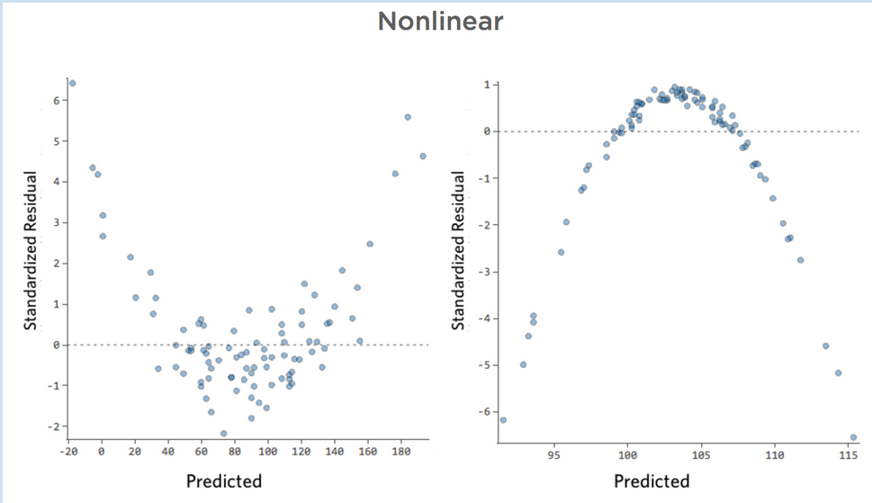

# Today's Agenda {background-image="libs/Images/background-data_blue_v3.png"}

```{r}
library(tidyverse)
library(readxl)
library(kableExtra)
library(modelsummary)
library(ggeffects)
```

<br>

<br>

**Evaluating the fit of OLS regressions**

<br>

<br>

::: r-stack
Justin Leinaweaver (Spring 2024)
:::

::: notes
Prep for Class

1. ...
:::


## For next class, fit, interpret and make predictions using OLS: {background-image="libs/Images/background-slate_v2.png" .center}

<br>

1. Regress city fuel economy (`cty`) on engine displacement (`displ`) in the `mpg` datatset

2. Regress percent college educated (`percollege`) on the percent of people below the  poverty line (`percbelowpoverty`) in the `midwest` datatset

::: notes
**How did this go?**

<br>

```{r, eval=FALSE}
lm(data = mpg, cty ~ displ) |> summary()

lm(data = midwest, percollege ~ percbelowpoverty) |> summary()
```
:::


## City Fuel Economy and Engine Size {background-image="libs/Images/background-slate_v2.png" .center .smaller}

:::: {.columns}
::: {.column width="50%"}

<br>

```{r}
model1 <- lm(data = mpg, cty ~ displ)
predictions1 <- ggpredict(model1, terms = "displ")

modelsummary(list("Fuel Economy (City)" = model1), output = "gt", fmt = 2, stars = c('*' = .05), gof_omit = "IC|Log|F",
             coef_map = c("displ"= "Engine Size", "(Intercept)" = "Constant")) |>
  gt::tab_style(style = list(
                  gt::cell_fill(color = 'white'),
                  gt::cell_text(size = "x-large")
  ), locations = gt::cells_body())
  

# modelsummary(list("Fuel Economy (City)" = model1), output = 'kableExtra', fmt = 2, stars = c('*' = .05), gof_omit = "IC|Log|F",
#              coef_map = c("displ"= "Engine Size", "(Intercept)" = "Constant")) |>
#   column_spec(1:2, background = "white") |>
#   row_spec(0, background = "lightblue") |>
#   kable_styling(font_size = 22)
```
:::

::: {.column width="50%"}
```{r, echo = FALSE, fig.asp=0.7, fig.align = 'center', fig.width=5, cache=TRUE}
plot(predictions1) +
  labs(x = "Engine Displacement", y = "City Fuel Economy",
       title = "OLS Predicted Values")
```

```{r}
predictions1
```
:::
::::

::: notes

As you think about including OLS tables in reports, think about polishing them!

- Variable names should be in plain english

- Model name should be the dependent variable

<br>

This table makes clear that this regression focuses on engine size as a predictor of fuel economy.

- **Make sense?**
:::


## College Education and Poverty {background-image="libs/Images/background-slate_v2.png" .center .smaller}

:::: {.columns}
::: {.column width="50%"}

<br>

```{r}
model2 <- lm(data = midwest, percollege ~ percbelowpoverty)
predictions2 <- ggpredict(model2, terms = "percbelowpoverty")

modelsummary(list("College (%)" = model2), output = "gt", fmt = 2, stars = c('*' = .05), gof_omit = "IC|Log|F",
             coef_map = c("percbelowpoverty"= "Below Poverty (%)", "(Intercept)" = "Constant")) |>
  gt::tab_style(style = list(
                  gt::cell_fill(color = 'white'),
                  gt::cell_text(size = "x-large")
  ), locations = gt::cells_body())

# modelsummary(list("College (%)" = model2), fmt = 2, stars = c('*' = .05), gof_omit = "IC|Log|F",
#              coef_map = c("percbelowpoverty"= "Below Poverty (%)", "(Intercept)" = "Constant")) |>
#   column_spec(1:2, background = "white") |>
#   row_spec(0, background = "lightblue") |>
#   kable_styling(font_size = 22)
```
:::

::: {.column width="50%"}
```{r, echo = FALSE, fig.asp=0.7, fig.align = 'center', fig.width=5, cache=TRUE}
plot(predictions2) +
  labs(x = "Below Poverty Line (%)", y = "College Education (%)",
       title = "OLS Predicted Values")
```

```{r}
predictions2
```
:::
::::


## Evaluating the Fit of an OLS Regression {background-image="libs/Images/background-slate_v2.png" .center}

<br>

1. Missing data problems?

2. Are the coefficients significant?

3. What does the R<sup>2</sup> indicate? 

4. Any problems in the residuals plot?

::: notes

Everybody TAKE NOTES on these as we go!

- These are the four parts to making an argument that your OLS regression is useful

- In other words, you will need to make these four arguments in future reports that include an OLS regression

<br>

Let's go back to our diamond size models from last class.
:::


## Evaluate the Fit {background-image="libs/Images/background-slate_v2.png" .center}

**1. Missing data problems?**

:::: {.columns}
::: {.column width="60%"}

<br>

"Missing Not At Random" (MNAR)

- Survey Bias

- Lack of infrastructure

- Inaccessibility

- Governmental Interference
:::

::: {.column width="40%"}
```{r}
model3 <- lm(data = diamonds, price ~ carat)
predictions3 <- ggpredict(model3, terms = "carat")

modelsummary(list("Diamond Value" = model3), output = "gt",
             fmt = 2, 
             stars = c('*' = .05), 
             gof_omit = "IC|Log|F",
             coef_map = c("carat"= "Size (carats)", "(Intercept)" = "Constant")) |>
  gt::tab_style(style = list(
                  gt::cell_fill(color = 'white'),
                  gt::cell_text(size = "large")
  ), locations = gt::cells_body()) |>
  gt::tab_style(style = gt::cell_fill(color = 'orange'), locations = gt::cells_body(columns = 2, rows = 5))
```

```{r, echo = TRUE}
# All observations
nrow(diamonds)
```
:::
::::

::: notes
Important note: R will omit observations with missing data and it's up to YOU to check for problems!

<br>

If your regression is being fit on less than ALL the data in your sample it's up to you to investigate why and to look for patterns in the missing data.

- The key is to identify any Missing Not At Random (MNAR) problems

<br>

Surveys deal with tons of biases

1. Social-desirability bias: The tendency of survey respondents to answer questions in a manner that will be viewed favorably by others.
    - e.g. over-reporting "good" behavior or under-reporting "bad" behavior.

2. Non-response bias is currently a massive problem for political polling in this country.
    - Trump voters have simply been less likely to participate in phone polls than Democratic voters in the last few cycles.
    
3. Language Barriers: How do you word a survey question so it will have the same meaning across different languages? Across different cultures?
    
<br>

Collecting observational data faces it's own serious challenges

- Lack of infrastructure: I'm guessing South Sudan lacks the infrastructure needed to develop high quality GDP figures

- Inaccessibility: Studies examining things like the effects of poverty, war or gender discrimination often cannot get reliable data from those places where these lived experiences are hardest.

- Governmental Interference: If I have to hear one more idiotic report of "polling data" from Russia showing Putin's sky-high approval ratings I will lose it.

<br>

**Does all of this make sense? Questions on evaluation step 1?**

- This will be very relevant for us as we work on our project.

- **Ultimately, it is your job to make an argument that the missing data isn't a problem for the conclusions you are drawing from the regression results.**
:::


## Evaluate the Fit {background-image="libs/Images/background-slate_v2.png" .center}

**2. Are the coefficients significant?**

<br>

```{r}
modelsummary(models = list("Diamond Value" = model3), output = "gt",
             fmt = 2, 
             stars = c('*' = .05), 
             gof_omit = "IC|Log|F",
             coef_map = c("carat"= "Size (carats)", "(Intercept)" = "Constant")) |>
  gt::tab_style(style = list(
                  gt::cell_fill(color = 'white'),
                  gt::cell_text(size = "x-large")
  ), locations = gt::cells_body())
```

::: notes

Statistical significance aka does the coefficient have a '*'?

- Here we see that in this model the beta coefficient on diamond size clearly meets the test of statistical significance.

- Ok, but what does that actually mean?

<br>

**SLIDE**: Let's take a brief detour to talk more deeply about statistical significance.
:::


## What is Statistical Significance? {background-image="libs/Images/background-slate_v2.png" .center}

<br>

H<sub>A</sub> = Larger diamonds are more expensive than smaller ones

```{r, echo = FALSE, fig.align = 'center', out.width = '75%'}
knitr::include_graphics("libs/Images/11_1-Diamonds_2.jpg")
```

<br>

H<sub>0</sub> = Diamond size has no impact on price

::: notes
Conventional statistical significance testing is based on the idea of a null hypothesis.

<br>

In essence, we can frame our model as a competition between two hypotheses.

- The alternative hypothesis is what we suspect is true, that larger diamonds are associated with higher prices.

<br>

For every alternative hypothesis we can also describe the null hypothesis as the absence of that effect.

- e.g. Diamond size is not associated with price.

<br>

**SLIDE**: We can do this with any hypothesis.
:::


## What is Statistical Significance? {background-image="libs/Images/background-slate_v2.png" .center}

<br>

H<sub>A</sub> = Greater levels of education lead to high voter turnout

```{r, echo = FALSE, fig.align = 'center'}
knitr::include_graphics("libs/Images/10_2-voters_v2.png")
```

<br>

H<sub>0</sub> = Education has no impact on voter turnout


::: notes
Some research has proposed that increasing levels of education may increase the likelihood of voting.

- AND, conventional hypothesis testing requires us to specify a null hypothesis

<br>

Let's be honest, this is probably the biggest weakness of testing hypotheses for "statistical significance"

- The assumption of ZERO relationship between two amorphous social dynamics is almost certainly not likely

<br>

**Does everybody understand this first step, specifying the null hypothesis?**

<br>

**SLIDE**: Let's go back to the diamonds regression
:::


## What is Statistical Significance? {background-image="libs/Images/background-slate_v2.png" .center}

<br>

:::: {.columns}
::: {.column width="50%"}
```{r, fig.asp=0.9, fig.align = 'center', fig.width=6, cache=TRUE}
diamonds |>
  slice_sample(prop = .1) |>
  ggplot(aes(x = carat, y = price)) +
  geom_point(alpha = .05) +
  geom_smooth(method = "lm") +
  theme_bw() +
  labs(x = "Carats", y = "Price",
       title = expression(paste("H"["A"], ": Larger diamonds are more expensive than smaller ones")),
       subtitle = str_c("Sum of Squared Errors: ", round(sum((model3$residuals)^2)/1e9, 1), " billion")) +
  coord_cartesian(ylim = c(0, 18000), xlim = c(0,4)) +
  scale_y_continuous(labels = scales::dollar_format())
```
:::

::: {.column width="50%"}
```{r, fig.asp=0.9, fig.align = 'center', fig.width=6, cache=TRUE}
model0 <- lm(data = diamonds, price ~ 1)

diamonds |>
  slice_sample(prop = .1) |>
  ggplot(aes(x = carat, y = price)) +
  geom_point(alpha = .05) +
  geom_hline(yintercept = mean(diamonds$price), color = "red") +
  theme_bw() +
  labs(x = "Carats", y = "Price",
       title = expression(paste("H"["0"], ": Diamond size has no impact on price")),
       subtitle = str_c("Sum of Squared Errors: ", round(sum((model0$residuals)^2)/1e9, 1), " billion")) +
  coord_cartesian(ylim = c(0, 18000), xlim = c(0,4)) +
  scale_y_continuous(labels = scales::dollar_format())
```
:::
::::

::: notes

Here you can see I've visualized the two hypotheses for us.

### Why is the null hypothesis a horizontal line? What does that mean?
- (For any level of diamond size, the model makes the same price prediction)
    - In this case, the sample average of prices.
    
<br>

### Is everybody clear on how we draw these two different lines?

<br>

We can also see from these plots the staggering difference in the errors attached to each line

- The regression line has a residual error of 129 billion

- The null line has 6 times the error in its line!

<br>

As we did last class, we prefer a line that minimizes the error

- THIS is the significance test!
:::


## What is Statistical Significance? {background-image="libs/Images/background-slate_v2.png" .center}

<br>

:::: {.columns}
::: {.column width="50%"}
```{r, fig.asp=0.9, fig.align = 'center', fig.width=6, cache=TRUE}
diamonds |>
  slice_sample(prop = .1) |>
  ggplot(aes(x = carat, y = price)) +
  geom_point(alpha = .05) +
  geom_smooth(method = "lm") +
  geom_hline(yintercept = mean(diamonds$price), color = "red") +
  theme_bw() +
  labs(x = "Carats", y = "Price", title = "Alternative vs Null Hypothesis") +
  coord_cartesian(ylim = c(0, 18000), xlim = c(0,4)) +
  scale_y_continuous(labels = scales::dollar_format())
```
:::

::: {.column width="50%"}
```{r}
modelsummary(list("Diamond Value" = model3), output = "gt",
             fmt = 2, 
             stars = c('*' = .05), 
             gof_omit = "IC|Log|F",
             coef_map = c("carat"= "Size (carats)", "(Intercept)" = "Constant")) |>
  gt::tab_style(style = list(
                  gt::cell_fill(color = 'white'),
                  gt::cell_text(size = "large")
  ), locations = gt::cells_body()) |>
  gt::tab_style(style = gt::cell_fill(color = 'orange'), locations = gt::cells_body(columns = 2, rows = c(1,3)))
```
:::
::::

::: notes

The significance test, as represented by the p-value, essentially tells us if the data better matches the red or the blue line.

<br>

To be completely technical, the p-value is a kind of weird test

- ASSUMING the null hypothesis is true, how likely are you to get a value as extreme as the slope of the blue line?

<br>

Lots of problems with this, not least of which is, the null hypothesis is never likely to be true in the real-world.

- Even if the relationship is small, assuming ZERO relationship is an extreme position to take.

<br>

**SLIDE**: Let me show you an insignificant relationship.
:::


## {background-image="libs/Images/background-slate_v2.png" .center}

::: {.r-fit-text}
**Are deeper diamonds more expensive?**
:::

<br>

:::: {.columns}
::: {.column width="50%"}
```{r, fig.asp=0.9, fig.align = 'center', fig.width=6, cache=TRUE}
# Diamonds dataset is so huge result is significant
# shrink sample
set.seed(234)
diamonds2 <- diamonds |> slice_sample(prop = .1)

diamonds2 |>
  ggplot(aes(x = depth, y = price)) +
  geom_point(alpha = .05) +
  geom_hline(yintercept = mean(diamonds$price), color = "red") +
  geom_smooth(method = "lm") +
  theme_bw() +
  labs(x = "Depth", y = "Price",
       title = "Alternative vs Null Hypothesis") +
  scale_y_continuous(labels = scales::dollar_format())
```
:::

::: {.column width="50%"}
```{r}
model4 <- lm(data = diamonds2, price ~ depth)

modelsummary(list("Diamond Value" = model4), output = "gt",
             fmt = 2, 
             stars = c('*' = .05), 
             gof_omit = "IC|Log|F",
             coef_map = c("depth"= "Total Depth", "(Intercept)" = "Constant")) |>
  gt::tab_style(style = list(
                  gt::cell_fill(color = 'white'),
                  gt::cell_text(size = "large")
  ), locations = gt::cells_body()) |>
  gt::tab_style(style = gt::cell_fill(color = 'orange'), locations = gt::cells_body(columns = 2, rows = c(1,3)))
```
:::
::::

::: notes

Here I'm fitting an OLS model to only 10% of the diamonds data.

- **Can everybody see why the regression cannot differentiate between the null and the alternative hypotheses?**

<br>

**Questions on this basic intro to statistical significance?**

<br>

Ultimately, statistical significance is one piece of evidence, among many, that implies your model "fits" the data better than the null argument.

- None of these are the end-all, be-all, you need all of them!

<br>

Our Takeaway: A model with significance stars is preferred because it fits the data better than the null.

**Make sense?**
:::


## Evaluate the Fit: {background-image="libs/Images/background-slate_v2.png" .center}

**3. What does the R<sup>2</sup> indicate?**

<br>

```{r, fig.align = 'center', fig.asp = 0.618, fig.width = 8, cache=TRUE}
set.seed(50)
d1 <- tibble(
    x = rnorm(50, 12, 3),
    y1 = x + rnorm(50, 15, 8),
    y2 = x + rnorm(50, 15, 5),
    y3 = x + rnorm(50, 15, 1.5),
    y4 = x + rnorm(50, 15, .5)    
)

d2 <- d1 |>
pivot_longer(cols = y1:y4, names_to = "Version", values_to = "Values") |>
mutate(
    Version = case_when(
        Version == "y1" ~ "R2 = 0",
        Version == "y2" ~ "R2 = 0.24",
        Version == "y3" ~ "R2 = 0.81",
        Version == "y4" ~ "R2 = 0.97")
    )

ggplot(data = d2, aes(x = x, y = Values)) +
    geom_point() +
    geom_smooth(method = "lm", se = FALSE) +
    theme_bw() +
    facet_wrap(~ Version) +
  labs(x = "", y = "")
```

::: notes
Your third step in evaluating a regression model is to consider the R2 value

- In our simple OLS terms, the R-squared is the square of the correlation coefficient

<br>

The correlation coefficient describes the association between two variables

- Runs from -1 to 1, focuses on linear relationships, has no units attached and can be positive or negative

<br>

The R-squared tells you what proportion of the outcome can be explained by the predictor

- This runs from 0 (e.g. explains none of the variation) to 1 (e.g. explains all of the variation)

- Much more useful than correlation when your model includes more than one predictor (e.g. multiple regression)

<br>

The takeaway is that, all things equal, we prefer models that explain more of the outcome (e.g. higher R-squared values)
:::


## Evaluate the Fit {background-image="libs/Images/background-slate_v2.png" .center}

**3. What does the R<sup>2</sup> indicate?**

<br>

:::: {.columns}
::: {.column width="50%"}
```{r}
modelsummary(list("Diamond Value" = model3), output = "gt",
             fmt = 2, 
             stars = c('*' = .05), 
             gof_omit = "IC|Log|F",
             coef_map = c("carat"= "Size (carats)", "(Intercept)" = "Constant")) |>
  gt::tab_style(style = list(
                  gt::cell_fill(color = 'white'),
                  gt::cell_text(size = "x-large")
  ), locations = gt::cells_body()) |>
  gt::tab_style(style = gt::cell_fill(color = 'orange'), locations = gt::cells_body(columns = 2, rows = 6))
```
:::

::: {.column width="50%"}
```{r, fig.align='center', fig.asp=.75, fig.width=6, cache=TRUE}
diamonds |>
  ggplot(aes(x = carat, y = price)) +
  geom_point(alpha = .06) +
  geom_smooth(method = "lm", se = FALSE) +
  theme_bw() +
  labs(x = "Diamond Size (carats)", y = "Price") +
  scale_y_continuous(labels = scales::dollar_format(), limits = c(0, 20000))
```
:::
::::

::: notes
Here we see the OLS results from the regression we began with.

- I hope you can clearly see that this line fits the data points quite well

- The observations cluster nicely and that carries an R2 value of .849

<br>

So, our model that focuses entirely on the size of a diamond explains 85% of the variation in the price of a diamond.

- **Make sense?**

<br>

**SLIDE**: The other model...
:::


## Evaluate the Fit {background-image="libs/Images/background-slate_v2.png" .center}

**3. What does the R<sup>2</sup> indicate?**

<br>

:::: {.columns}
::: {.column width="50%"}
```{r}
modelsummary(list("Diamond Value" = model4), output = "gt",
             fmt = 2, 
             stars = c('*' = .05), 
             gof_omit = "IC|Log|F",
             coef_map = c("depth"= "Total Depth", "(Intercept)" = "Constant")) |>
  gt::tab_style(style = list(
                  gt::cell_fill(color = 'white'),
                  gt::cell_text(size = "x-large")
  ), locations = gt::cells_body()) |>
  gt::tab_style(style = gt::cell_fill(color = 'orange'), locations = gt::cells_body(columns = 2, rows = 6))
```
:::

::: {.column width="50%"}
```{r, fig.align='center', fig.asp=.75, fig.width=6, cache=TRUE}
diamonds2 |>
  ggplot(aes(x = depth, y = price)) +
  geom_point(alpha = .06) +
  geom_smooth(method = "lm", se = FALSE) +
  theme_bw() +
  labs(x = "Diamond Depth", y = "Price") +
  scale_y_continuous(labels = scales::dollar_format(), limits = c(0, 20000))
```
:::
::::

::: notes
And here we see the OLS results from the regression with the non-significant coefficients

- Nice visualization of how a predictor that isn't better than the null, also doesn't explain any of the variation in the outcome.

<br>

**Everybody following me on the R2?**

<br>

**SLIDE**: HUGE CAVEAT THOUGH, "bigger" doesn't always mean "better"
:::


## Be Careful Interpreting the R<sup>2</sup> {background-image="libs/Images/background-slate_v2.png" .center}

<br>

:::: {.columns}
::: {.column width="50%"}
```{r, echo = FALSE, fig.align = 'center', out.width = '100%'}
knitr::include_graphics("libs/Images/11_2-Fire_with_Match.jpg")
```
:::

::: {.column width="50%"}
```{r, echo = FALSE, fig.align = 'center', out.width = '100%'}

```
:::
::::

::: notes
Easy model example: Striking a match explains creation of fire
- We would expect this model to have a very high R2

<br>

MUCH more complicated example: Building a model of voting

- Many, many factors inform the decision to vote

- e.g. age, wealth, partisanship, history of prior voting

<br>

So, a model focused on just one of those will certainly have a small R^2 BUT might still offer us a useful estimate of the effect of that predictor on voting.

- The estimate is useful for testing our hypothesis even if the R^2 is small.

- Still valuable but not a complete model of the behavior.

<br>

### Make sense?
:::


## Evaluate the Fit: {background-image="libs/Images/background-slate_v2.png" .center}
**4. Evaluate the Residuals**

<br>

```{r, fig.align = 'center', fig.asp = 0.75, fig.width = 9, cache=TRUE}
# Create fake data
set.seed(111)
x1 <- rnorm(n = 250, mean = 5, sd = 5)

set.seed(6)
y1 <- x1 + 8 + rnorm(n = 250, mean = 2, sd = .5)

d1 <- tibble(
  x1, 
  y1
  )

model4 <- lm(data = d1, y1 ~ x1)

plot(model4, which = 1, main = "Homoskedastic errors are good!")
```

::: notes

A residuals plot for fake data.

- x-axis are all the predictions from your model

- y-axis is the error in each predictions (e.g. the residual)

- Your "best" model predictions would each have a value of zero on the y-axis (e.g. horizontal line at 0)

<br>

The red line is an effort to show you if your errors tend to be positive or negative and where along the line they happen.

- Here we see a red line that indicates a more or less even spread of errors above and below the line.

<br>

This is what we would describe as a good result, e.g. homoscedastic errors

- From the Greek: Homo meaning "same" and skedastic meaning “able to be scattered”

- If your residuals plot looks like someone threw dots at a wall you're probably in good shape

<br>

**SLIDE**: What does a bad residual plot look like?
:::


## Evaluate the Fit: {background-image="libs/Images/background-slate_v2.png" .center}

**4. Evaluate the Residuals**

<br>

```{r, fig.align = 'center', fig.asp = 0.75, fig.width=8}
# Create fake data with heteroskedastic errors
n <- rep(1:100,2)
a <- 0
b <- 1
sigma2 <- n^1.3

set.seed(128)
eps <- rnorm(n, mean=0, sd=sqrt(sigma2))
y <- a + b * n + eps

d2 <- tibble(
  x1 = n, 
  y1 = y
  )

model5 <- lm(data = d2, y1 ~ x1)

d2 |>
  modelr::add_residuals(model5) |>
  modelr::add_predictions(model5) |>
  ggplot(aes(x = pred, y = resid)) +
  geom_hline(yintercept = 0, linetype = "dashed", color = "darkgrey") +
  geom_point() +
  theme_bw() +
  labs(x = "Regression Fitted Values", y = "Residuals",
       title = "Heteroskedastic Errors are Bad!") +
  geom_abline(slope = .6, intercept = 4, linetype = "dashed", color = "red") +
  geom_abline(slope = -.2, intercept = -16, linetype = "dashed", color = "red") 
```


::: notes

Heteroskedastic Errors are Bad

- Heteroskedasticity means that the variance of the errors is not constant across observations.

- In other words, when the scatter of the errors is different, varying depending on the value of one or more of the independent variables, the error terms are heteroskedastic.

<br>

In this hypothetical case our model makes much more accurate predictions at the low end than at the high end

- This is a bad sign

- It means our regression hasn't found a representative path through the conditional means
:::


## Evaluate the Fit: {background-image="libs/Images/background-slate_v2.png" .center}
**4. Evaluate the Residuals**

<br>

```{r, echo = FALSE, fig.align = 'center'}

```

::: notes

Non-Linear Errors are Bad

- OLS assumes the residuals have constant variance (homoskedasticity) AND that there is no pattern in them 

<br>

Remember our talk about correlation missing important relationships if they were non-linear?

- Same thing here!

<br>

The good news is that you can alter your regression to solve these kinds of problems!
:::


## Evaluate the Fit: {background-image="libs/Images/background-slate_v2.png" .center}
**4. Evaluate the Residuals**

<br>

```{r, fig.align = 'center', fig.asp = 0.75, fig.width = 9, cache=TRUE}
# Create fake data
x1 <- rnorm(n = 100, mean = 5, sd = 5)
y1 <- x1 + 8 + rnorm(n = 100, mean = 2, sd = .5)
model4 <- lm(y1 ~ x1)

plot(model4, which = 1)
```

::: notes
This is what you want a residuals plot to look like

1. Homoskedastic errors 

2. No evidence of trends in the errors

<br>

### Make sense?

- **SLIDE**: How to do it in R
:::


## {background-image="libs/Images/background-slate_v2.png" .center .smaller}

```{r, echo=TRUE, fig.align = 'center', fig.asp = 0.618, fig.width = 10, cache=TRUE}
# Fit the OLS
model3 <- lm(data = diamonds, price ~ carat)

# Plot the OLS object with the "which" option
plot(model3, which = 1)
```

::: notes

Here's the code you need to check the residuals plot.

- My diamonds regression is named model3.

<br>

### Do we see anything of concern in the model residuals?

- (Yes, both kinds!)

<br>

FIRST, there is clearly some heteroskedasticity

- Model is super accurate for cheap diamonds and then varying accuracy for the rest

- Slight funneling effect from left to right (bigger on left than right)

<br>

SECOND, there is a clear non-linear trend

- Low values diamonds have mostly positive errors (under-predicts actual prices)

- High value diamonds have mostly negative errors (over-estimates actual prices)
    
<br>

**Questions?**

- Fixing this requires some more advanced tools for a future class!
:::


## Evaluating the Fit of an OLS Regression {background-image="libs/Images/background-slate_v2.png" .center}

<br>

1. Missing data problems?

2. Are the coefficients significant?

3. What does the R<sup>2</sup> indicate? 

4. Any problems in the residuals plot?

::: notes
**Any questions on these four steps?**

<br>

Let's practice as a group...
:::


## Exploring Movie Box Office Returns {background-image="libs/Images/background-slate_v2.png" .center}

<br>

```{r}
#library(fivethirtyeight)
d <- read_excel("../Data_in_Class-SP24/FiveThirtyEight-Movie_Box_Office/Movie_Box_Office_Data-538.xlsx")

d |>
  select(year, title, budget_millions, boxoffice_millions) |>
  slice_sample(n = 13) |>
  kbl(align = c("c", "l", "c", "c"), digits = 2) |>
  kableExtra::column_spec(1:4, background = "white") |>
  kableExtra::row_spec(0, background = "lightblue") |>
  kableExtra::kable_styling(font_size = 22)
```

::: notes
Everybody grab the data file on Canvas modules for today

- Movie_Box_Office_Data-538.xlsx

<br>

This dataset includes a sample of movies selected from the IMDB between 1970 and 2013 by 538

- Each film comes with its budget and box office total converted into millions of 2013 US dollars

<br>

Everybody make a scatterplot of budget and box office for all the movies in the dataset

- (**SLIDE**)
:::


## Exploring Movie Box Office Returns {background-image="libs/Images/background-slate_v2.png" .center}

```{r, fig.align='center', fig.asp=.618, fig.width=9, cache=TRUE}
bechdel_labels <- d |>
  filter(boxoffice_millions > 2000 | budget_millions > 270)

ggplot(data = d, aes(x = budget_millions, y = boxoffice_millions)) +
  geom_point(alpha = .2) +
  #geom_smooth(method = "lm") +
  ggrepel::geom_text_repel(data = bechdel_labels, aes(label = title), size = 3) +
  theme_bw() +
  labs(x = "Budget (millions 2013 USD)", y = "Box Office (millions 2013 USD)", title = "Analyzing Movie Box Office Returns", caption = "Source: FiveThirtyEight")
```

::: notes
**Any surprises on this scatterplot?**
:::


## {background-image="libs/Images/background-slate_v2.png" .center}

**Can we make useful predictions of movie earnings (`boxoffice_millions`) using a regression on budget (`budget_millions`)?**

<br>

:::: {.columns}
::: {.column width="50%"}
```{r, fig.align='center', fig.asp=.9, fig.width=7, cache=TRUE}
ggplot(data = d, aes(x = budget_millions, y = boxoffice_millions)) +
  geom_point(alpha = .2) +
  #geom_smooth(method = "lm") +
  #ggrepel::geom_text_repel(data = bechdel_labels, aes(label = title), size = 3) +
  theme_bw() +
  labs(x = "Budget (millions 2013 USD)", y = "Box Office (millions 2013 USD)", title = "Analyzing Movie Box Office Returns", caption = "Source: FiveThirtyEight")
```
:::

::: {.column width="50%"}
1. Missing data problems?

2. Are the coefficients significant?

3. What does the R<sup>2</sup> indicate? 

4. Any problems in the residuals plot?
:::
::::

::: notes
Let's now practice regression

- Everybody regress box office returns on movie budgets and evaluate the results with our four steps
:::


## {background-image="libs/Images/background-slate_v2.png" .center}

**1. Missing data problems?**

<br>

:::: {.columns}
::: {.column width="50%"}
```{r}
model3 <- lm(data = d, boxoffice_millions ~ budget_millions)

predictions3 <- ggeffects::ggpredict(model3, terms = "budget_millions")

modelsummary(list("Box Office (millions)" = model3), output = "gt",
             fmt = 2, stars = c('*' = .05), gof_omit = "IC|Log|F",
             coef_map = c("budget_millions"= "Budget (millions)", "(Intercept)" = "Constant")) |>
  gt::tab_style(style = list(
                  gt::cell_fill(color = 'white'),
                  gt::cell_text(size = "x-large")
  ), locations = gt::cells_body())
```
:::

::: {.column width="50%"}
```{r, echo=TRUE}
# Count the observations
nrow(d)
```
:::
::::


## {background-image="libs/Images/background-slate_v2.png" .center}

**2. Are the coefficients significant?**

<br>

:::: {.columns}
::: {.column width="50%"}
```{r}
modelsummary(list("Box Office (millions)" = model3), output = "gt",
             fmt = 2, stars = c('*' = .05), gof_omit = "IC|Log|F",
             coef_map = c("budget_millions"= "Budget (millions)", "(Intercept)" = "Constant")) |>
  gt::tab_style(style = list(
                  gt::cell_fill(color = 'white'),
                  gt::cell_text(size = "x-large")
  ), locations = gt::cells_body()) |>
  gt::tab_style(style = gt::cell_fill(color = 'orange'), locations = gt::cells_body(columns = 2, rows = c(1,3)))
```
:::

::: {.column width="50%"}
```{r, fig.align='center', fig.asp=.9, fig.width=7, cache=TRUE}
ggplot(data = d, aes(x = budget_millions, y = boxoffice_millions)) +
  geom_point(alpha = .2) +
  geom_smooth(method = "lm") +
  #ggrepel::geom_text_repel(data = bechdel_labels, aes(label = title), size = 3) +
  theme_bw() +
  labs(x = "Budget (millions 2013 USD)", y = "Box Office (millions 2013 USD)", title = "Analyzing Movie Box Office Returns", caption = "Source: FiveThirtyEight")
```
:::
::::


## {background-image="libs/Images/background-slate_v2.png" .center}

**3. What does the R<sup>2</sup> indicate?**

<br>

:::: {.columns}
::: {.column width="50%"}
```{r}
modelsummary(list("Box Office (millions)" = model3), output = "gt",
             fmt = 2, stars = c('*' = .05), gof_omit = "IC|Log|F",
             coef_map = c("budget_millions"= "Budget (millions)", "(Intercept)" = "Constant")) |>
  gt::tab_style(style = list(
                  gt::cell_fill(color = 'white'),
                  gt::cell_text(size = "x-large")
  ), locations = gt::cells_body()) |>
  gt::tab_style(style = gt::cell_fill(color = 'orange'), locations = gt::cells_body(columns = 2, rows = c(6,7)))
```
:::

::: {.column width="50%"}
```{r, fig.align='center', fig.asp=.9, fig.width=7, cache=TRUE}
ggplot(data = d, aes(x = budget_millions, y = boxoffice_millions)) +
  geom_point(alpha = .2) +
  geom_smooth(method = "lm") +
  #ggrepel::geom_text_repel(data = bechdel_labels, aes(label = title), size = 3) +
  theme_bw() +
  labs(x = "Budget (millions 2013 USD)", y = "Box Office (millions 2013 USD)", title = "Analyzing Movie Box Office Returns", caption = "Source: FiveThirtyEight")
```
:::
::::


## {background-image="libs/Images/background-slate_v2.png" .center}

**4. Any problems in the residuals plot?**

<br>

:::: {.columns}
::: {.column width="50%"}
```{r}
modelsummary(list("Box Office (millions)" = model3), output = "gt",
             fmt = 2, stars = c('*' = .05), gof_omit = "IC|Log|F",
             coef_map = c("budget_millions"= "Budget (millions)", "(Intercept)" = "Constant")) |>
  gt::tab_style(style = list(
                  gt::cell_fill(color = 'white'),
                  gt::cell_text(size = "x-large")
  ), locations = gt::cells_body())
```
:::

::: {.column width="50%"}
```{r, fig.align='center', fig.asp=.9, fig.width=7, cache=TRUE}
# Check residuals
plot(model3, which = 1)
```
:::
::::


## {background-image="libs/Images/background-slate_v2.png" .center}

**Can we make useful predictions of movie earnings (`boxoffice_millions`) using a regression on budget (`budget_millions`)?**

<br>

:::: {.columns}
::: {.column width="50%"}
```{r, fig.align='center', fig.asp=.9, fig.width=7, cache=TRUE}
ggplot(data = d, aes(x = budget_millions, y = boxoffice_millions)) +
  geom_point(alpha = .2) +
  geom_smooth(method = "lm") +
  theme_bw() +
  labs(x = "Budget (millions 2013 USD)", y = "Box Office (millions 2013 USD)", title = "Analyzing Movie Box Office Returns", caption = "Source: FiveThirtyEight")
```
:::

::: {.column width="50%"}
```{r}
modelsummary(list("Box Office (millions)" = model3), output = "gt",
             fmt = 2, stars = c('*' = .05), gof_omit = "IC|Log|F",
             coef_map = c("budget_millions"= "Budget (millions)", "(Intercept)" = "Constant")) |>
  gt::tab_style(style = list(
                  gt::cell_fill(color = 'white'),
                  gt::cell_text(size = "x-large")
  ), locations = gt::cells_body())
```
:::
::::


## For next class, evaluate the fit of both regressions (all four steps): {background-image="libs/Images/background-slate_v2.png" .center}

<br>

1. Regress city fuel economy on engine displacement ('mpg' datatset)

2. Regress percent college educated on the percent of people below the  poverty line ('midwest' datatset)

::: notes


:::

