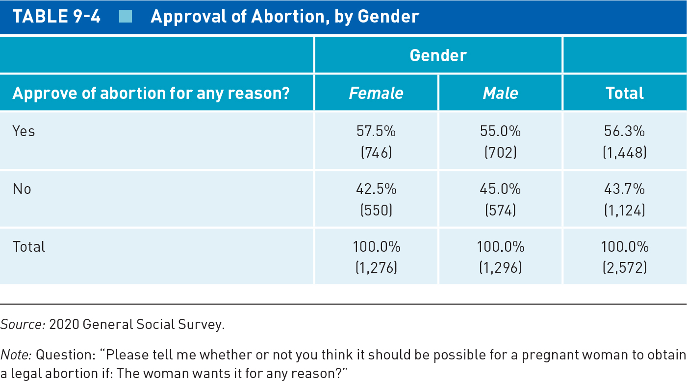
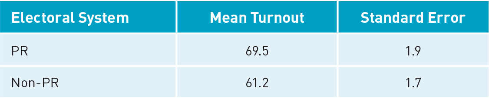
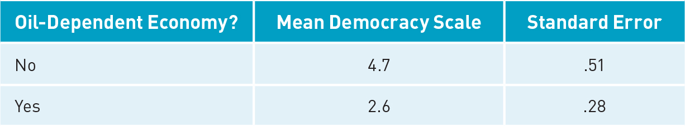

## Today's Agenda {background-image="Images/background-data_blue_v4.png" .center}

```{r}
library(tidyverse)
library(readxl)
library(kableExtra)
library(crosstable)

world <- read_excel("../../DATA/2026-Spring/Pollock_Edwards_Textbook/Pollock_Edwards-World.xlsx", na = "NA")
```

<br>

::: {.r-fit-text}

**Making Statistical Inferences**

- Hypothesis tests with one or two samples

- New Notes: Null_Hypothesis_Testing.R

:::

<br>

::: r-stack
Justin Leinaweaver (Spring 2026)
:::

::: notes
Prep for Class

1. Review Canvas submissions

2. NOTE: Remember, they covered ALL of this material in the reading. You are reinforcing these ideas NOT introducing the

3. R code notes: 296-Data_Analysis/DATA/2026-Spring/Pollock_Edwards_Textbook/Chapter9_R_Code.R

<br>

**SLIDE**: Big picture aim

:::


## {background-image="Images/background-data_blue_v4.png" .center}

::: {.r-fit-text}
**Defining Statistics: Level 2**

Statistics helps us draw inferences from sample to population
:::

<br>

{style="display: block; margin: 0 auto"}

::: notes

Our work beginning this week, and for the rest of the semester, will focus on inferential statistics

- e.g. Using a sample to learn about the wider population

<br>

This means our work for the rest of the semester will focus on measuring, and adapting to, the error in our samples

- The error tells us how closely our sample matches the population

- And THAT is what we need to actually answer research questions with data

<br>

Ok, quick pop quiz!

1. **What are the two main contributors to random sampling error?**

    - (The variation component and the sample size component)

2. **Give me an example of a measurement with high variation and a measurement with low variation**

    - (Low variation: Coin flip)
    - (Medium variation: Adult heights)
    - (High variation: GDP)

3. **WHY does increasing the sample size REDUCE random sampling error?**

    - (The bigger the sample the more of the population represented)
    - (The bigger the sample the better chance of representing more of the actual variation)

<br>

**SLIDE**: Last class we then shifted our focus to the framework for null hypothesis testing

:::


## Null Hypothesis Testing {background-image="Images/background-data_blue_v4.png" .center}

<br>

1. Specifying Research Hypothesis and Null Hypothesis

2. Setting Threshold for Statistical Significance

3. Estimating Parameters With Sample Data

4. P-Value and Confidence Interval Approaches

5. Drawing Conclusions

::: notes

Given the name, it certainly seems like the NULL is an important part of this process!

- **Questions on the process we introduced last class?**

<br>

Our work so far this week has focused on calculating SEs and using them to define confidence intervals

- **SLIDE**: But as we noted last class, that is only one of the ways we test the null hypothesis

:::


## Null Hypothesis Testing {background-image="Images/background-data_blue_v4.png" .center}

:::: {.columns}
::: {.column width="50%"}
```{r, fig.align='center', fig.asp=.9, fig.width=6.5}
tribble(
  ~cat1, ~low1, ~pred1, ~high1,
  "Reject", -1, 2, 5,
  "Accept", 2,4,6
) |>
  ggplot(aes(y = cat1, x = pred1)) +
  geom_point(size = 3) +
  theme_bw() +
  geom_vline(xintercept = 0, color = "darkgrey") +
  scale_x_continuous(limits = c(-2,7), breaks = -2:7) +
  geom_segment(aes(x = low1, xend = high1, y = cat1, yend = cat1), linetype = "dashed") +
  labs(x = "Sample Statistic", y = "", title = "The Confidence Interval Approach") +
  scale_y_discrete(labels = c("Accept the Null", "Reject the Null"))
```


:::

::: {.column width="50%"}

```{r, fig.align='center', fig.asp=.9, fig.width=6.5}
sample1 <- density(rnorm(n = 10000, mean = 0, sd = 1))

d1 <- tibble(
  x1 = sample1$x,
  y1 = sample1$y
) 

p1 <- d1 |>
  ggplot(aes(x = x1, y = y1)) +
  geom_line() +
  theme_bw() +
  labs(x = "Z Scores", y = "Density", title = "The P-Value Approach") +
  scale_x_continuous(limits = c(-3.5, 3.5), breaks = -3:3,
      labels = c("-3", "-2", "-1", "Null\nHypothesis", "1", "2", "3"))

p1 +
  geom_area(data = subset(d1, d1$x1 <= 1.96 & d1$x1 >= -1.96), fill = "darkred") +
  geom_area(data = subset(d1, d1$x1 <= -1.96), fill = "lightblue") +
  geom_area(data = subset(d1, d1$x1 >= 1.96), fill = "lightblue") +
  annotate("text", x = 0, y = .1, label = "Null Wins", color = "white", size = 11) +
  annotate("text", x = -3, y = .06, label = "Alternative\nHypothesis\nWins", color = "black", size = 6) +
  annotate("text", x = 3, y = .06, label = "Alternative\nHypothesis\nWins", color = "black", size = 6)
```

:::
::::

::: notes

Our focus so far has been on estimating confidence intervals (especially at the 95% level)

- In these tests our goal was to show that our 95% CIs do NOT include zero (e.g. the null hypothesis of no relationship)

<br>

Let's interpret the CI plot

- In the top CI on the plot our best estimate is 2, BUT we cannot say with any certainty that the true population parameter isn't actually negative!

- If your CI isn't tight enough to establish a positive vs negative effect then you can't reject the null!

- In the bottom CI our best estimate is 4 and we are 95% confident that 95% of samples will confirm the true population parameter is positive and in the range of 2 to 6.

<br>

**Everybody feeling good about the CI approach?**

<br>

On the right is the p-value approach

- The red shaded area here is the 95% CI around the null hypothesis of no relationship

- The blue shaded areas are the tails in the bottom and top 2.5% of the distribution

- If you run your test and get a sample statistic with a standardize score below -2 or above +2 you can reject the null hypothesis

<br>

You should always use both approaches to test and communicate your research results

- The CI let's you communicate what you've found in real-world terms

- e.g. I am 95% confident that repeated samples would show Trump's approval rating is between 32 and 37%! 

- The p-value let's you communicate your confidence in the specific sample statistic you have generated

- e.g. I am 95% confident that my best estimate of Trump's approval at 34% fits the data better than some null hypothesis

<br>

**Make sense?**

<br>

Today we'll learn the R code we need to begin doing these kinds of tests

- Specifically we'll focus on two types of null hypothesis testing

1. NHT for the difference between two proportions, AND 

2. NHT for the difference between two means

<br>

**SLIDE**: Let's start with a difference of proportions test

- *NOTE: I'm going to skip the one-sample proportion test (9.2). Technically the chapter describes calculating a difference of proportions within a single variable (e.g. 45% yes vs 55% no) which allows a p-value test of IS this difference significant. You get most of the way here with a CI and I'm not sure it's worth the time to get them to the distinction for a use case that I'm not sure comes up very often and is harder to implement in R.*

:::


## NHT: Difference of Proportions Test {background-image="Images/background-data_blue_v4.png" .center}

<br>

::: {.r-fit-text}
**The Rome Statute (1998) and the International Criminal Court (ICC)**
:::

- $H_A$: Democracies are more likely to join the ICC than autocracies

- $H_0$: There is no difference between democracies and autocracies in joining the ICC.

<br>

**Can we reject the null hypothesis? Why or why not?**

::: notes

Ok, compare your answers to Q1 of the Canvas assignment with the people around you and get ready to report back:

- Did you all calculate the same SE and 95% CI?

- Did you all agree on the result of our hypothesis test?

<br>

**SLIDE**: (Results)

<br>

*Assignment Question*

The Rome Statute (1998) is an international treaty that designed and organized the International Criminal Court (ICC). As of June 2021, 75 democracies (out of 86 invited) and 29 autocracies (out of 82 invited) had ratified the treaty. Perform a two-sample significance test of the difference in proportions between democratic and autocratic ratifications of the Rome Statute.

- Research hypothesis: Democracies are more likely to join the ICC than autocracies
- Null hypothesis: There is no difference between the likelihoods of democracies and autocracies in joining the ICC.

1) Calculate the standard error of the difference in the proportions
2) Calculate the 95% CI for the difference in proportions 
3) Does the CI of the difference suggest we can reject the null hypothesis? Why or why not?

:::


## NHT: Difference of Proportions Test {background-image="Images/background-data_blue_v4.png" .center}

$$ \text{SE of }(p_1 - p_2) = \sqrt{\frac{p_1 q_1}{n_1} + \frac{p_2 q_2}{n_2}} $$

$$ \text{95% CI} = \text{Sample Statistic} \pm (1.96 \times \text{Standard Error}) $$

<br>

::: {.r-fit-text}
**The Rome Statute (1998) and the International Criminal Court (ICC)**
:::

- The Difference of Proportions = Democracies +52%

- The SE of the Difference = 0.06

- The 95% CI = [0.39, 0.64]

::: notes

**Did everybody get these results?**

<br>

**Can we reject the null hypothesis of no difference between democracies and dictatorships when joining the ICC? Why or why not?**

- (Yes!)

- The difference is positive and the CI does not cross the 0

<br>

**SLIDE**: Let's make things even EASIER!

:::


## {background-image="Images/background-data_blue_v4.png" .center}

::: {.r-fit-text}

**NHT: Difference of Proportions Test**

<br>

prop.test(x, n)

- "x" counts the successes

- "n" counts the trials
:::

::: notes

We use prop.test to test the null hypothesis that the proportions in several groups are the same

<br>

In our case we are asking if the probabilities of success (e.g. joining the ICC) are the same across regime types

<br>

The two basic elements of the code are to specify the successes and the trials

- By "trials" we mean the number of cases or possible successes

<br>

**SLIDE**: Let's apply this to our case

:::


## {background-image="Images/background-data_blue_v4.png" .center}

::: {.r-fit-text}
**The Rome Statute (1998) and the International Criminal Court (ICC)**
:::

- The Difference of Proportions = Democracies +52%
- The SE of the Difference = 0.06
- The 95% CI = [0.39, 0.64]

```{r, echo=TRUE}
prop.test(x = c(75, 29), n = c(86, 82))
```

::: notes

*Talk through the code*

- Remember, the "x" is the successes per group and the "n" is the number of cases per group

- **Did everybody get the code to run and match this output?**

<br>

What's super handy about this approach is that prop.test runs BOTH tests suggested by the book (e.g. the CI and the p-value)

- *Show them where to find each in the output*

- **Does everybody see where the manual output is in the prop.test output?**

<br>

Thus far we've used the CI approach to test our research hypothesis

- e.g. the 95% CI excludes zero so we can reject the null

<br>

Now let's do the same using the p-value approach

- **Remind me, what do p-values represent?**

- (Assuming the null hypothesis is true, how unlikely is it that you would get a sample estimate of democracies at +52%?)

- In other words, are we in the tail of the distribution of error or in the middle?

<br>

**And how unlikely is our sample statistic of +52% based on this specific p-value?**

- We are below the conventional threshold of .05, but does everybody understand how small 1.4e-11 is?

- That's 10 zeroes BEFORE the 1!

- That's a 1 in 100 billion chance of getting this amount of error IF the null hypothesis is true!

<br>

**Everybody with me on this?**

<br>

**SLIDE**: Let's practice

:::


## {background-image="Images/background-data_blue_v4.png" .center}

{style="display: block; margin: 0 auto"}

$H_A$: Women support abortion rights more than men

$H_0$: There is no difference in support for abortion by gender

::: notes

Section 9.3.1 provides the example of abortion approvals by gender with the cross-tab data in Table 9.4

- One important note that boggles my mind, the counts and %s in Table 9.4 do NOT match

- For the women column, 57.5% of 1,276 cases would be approximately 734 successes, not 746

- I genuinely don't know why these don't match

<br>

Ok, so test yourself by testing our hypotheses here BUT use the counts provided by the table

- e.g. ignore the incorrect %s!

- Use the prop.test function and get ready to tell me if we can reject the null hypothesis

<br>

**SLIDE**: (Results)

:::


## {background-image="Images/background-data_blue_v4.png" .center}

$H_A$: Women support abortion rights more than men

$H_0$: There is no difference in support for abortion by gender

<br>

```{r, echo=TRUE}
prop.test(x = c(746, 702), n = c(1276, 1296))
```

::: notes

**Is the data from the 2020 General Social Survey consistent with the null hypothesis or not?**

<br>

No! There is a small but significant difference

- 95% CI = [.004, .08]

- p-value is below the 0.05 threshold

<br>

So, this suggests we CAN identify a difference that is bigger than what random sampling error is likely contributing

- **Make sense?**

<br>

**SLIDE**: Let's do one more difference in proportions test

:::


## {background-image="Images/background-data_blue_v4.png" .center}

ANES (2020) questions with identical answer options:

- How much is China a threat to the U.S.?

- How much is Russia a threat to the U.S.?

<br>

Hypotheses

- $H_A$: Americans perceive China as a greater threat than Russia

- $H_0$: Americans perceive no difference in the threat level

::: notes

You can also use a difference in proportions test to compare DIFFERENT questions that are answered by the same respondents in the same way!

<br>

ANES includes questions about how big a threat other countries are (five point scale from "Not at all" to "A great deal")

<br>

Here I am proposing the hypothesis that we perceive China as a greater threat than Russia (in 2020)

<br>

**SLIDE**: The data

:::


## {background-image="Images/background-data_blue_v4.png" .center}

ANES (2020) Data

- 2,218 respondents rated China's threat as "A great deal" (out of 7,337 respondents)

- 1,905 respondents rated Russia's threat as "A great deal" (out of 7,336 respondents)

<br>

Hypotheses

- $H_A$: Americans perceive China as a greater threat than Russia

- $H_0$: Americans perceive no difference in the threat level

::: notes

Alright, test this hypothesis for me!

- (**SLIDE**)

:::


## NHT: Difference of Proportions Test {background-image="Images/background-data_blue_v4.png" .center}

- $H_A$: Americans perceive China as a greater threat than Russia

- $H_0$: Americans perceive no difference in the threat level

```{r, echo=TRUE}
prop.test(x = c(2218, 1905), n = c(7337, 7336))
```

::: notes

**Is the 2020 ANES data consistent with the null hypothesis or not?**

<br>

No! There is a small but significant difference

- 95% CI = [.03, .06]

- p-value is TINY (1 in 100 million?)

<br>

**Ok, questions on null hypothesis testing for a difference in proportions?**

- Powerful tools, right?

<br>

**SLIDE**: Let's now shift to the difference of means test

:::


## NHT: Difference of Means Test {background-image="Images/background-data_blue_v4.png" .center}

<br>

:::: {.fragment}

::: {.r-fit-text}
**Electoral System Design and Voter Turnout**
:::



A. What is the null hypothesis?

B. Test the null with 95% CIs

C. Test the null with an eyeball test of the difference of means

::::

::: notes

We can use fairly similar techniques to perform null hypothesis testing on the difference of means

<br>

**REVEAL**: 

Ok, groups, compare your answers to Exercise 3 from the textbook with the people around you and get ready to report back your findings (Canvas Assignment Q2)

- Can we reject the null or not?

- Did you get the same answers on the CIs and the eyeball test?

<br>

**SLIDE**: (Results)

<br>

*Assignment Question*

Suppose that a group of U.S. election reformers argues that switching to a system based on proportional representation (PR) would significantly increase turnout. Skeptics claim that the reform would not have a significant effect on turnout. The following table, which reports mean turnouts and accompanying standard errors for PR and non-PR countries, will help you determine which side—the reformers or the skeptics—is more correct.

:::


## NHT: Difference of Means Test {background-image="Images/background-data_blue_v4.png" .center .smaller}

$H_0$: No difference in turnout between PR and non-PR countries

<br>

**Difference of Means: CI Approach**

- PR 95% CI = [65.8, 73.2]

- Non-PR 95% CI = [57.9, 64.5]

<br>

**Difference of Means: P-value Approach**

$$ \text{SE of } (\bar{x_1} - \bar{x_2}) = \sqrt{(\text{SE of } \bar{x_1})^2 + (\text{SE of } \bar{x_2})^2} $$

- Mean difference = 8.3

- SE of the mean difference = 2.55

- Eyeball Test = 8.3 / 2.55 = 3.3

::: notes

**Did everybody get these results?**

<br>

**Can we reject the null hypothesis of no difference between PR and non-PR countries in terms of voter turnout? Why or why not?**

- (Yes!)

- (CI Approach: Since the intervals do not overlap, the null hypothesis should be rejected)

- (P-value approach "eyeball approach":  If the observed difference is more than double the SE then it is likely significant)

<br>

- Mean difference = 8.3

- SE of the mean difference = √((1.9)^2 + (1.7)^2)) = 2.55

- Eyeball Test = 8.3 / 2.55 = 3.3

<br>

When we introduce our R method for calculating t-tests we'll move beyond the eyeball test for the p-value approach

- But for now let's just focus on making sure we're all on the same page with this at the "eyeballing it" level

<br>

**SLIDE**: Let's practice again on Exercise 4!

:::


## NHT: Difference of Means Test {background-image="Images/background-data_blue_v4.png" .center}

<br>

::: {.r-fit-text}
**Analyzing the Oil vs Democracy Curse**
:::



A. What is the null hypothesis?

B. Test the null with 95% CIs

C. Test the null with an eyeball test of the difference of means

::: notes

I know the question prompts are a little different in the book, but I want us to replicate what we just did

- Groups, make sure you're on the same page and get ready to discuss

<br>

**What is the null hypothesis here?**

- (There is no difference in democracy scores between oil-dependent and non-oil-dependent countries)

- (Any observed difference is due to random sampling error)

<br>

**SLIDE**: (Results)

<br>

*Assignment Question*

Scholars of political development have investigated the so-called oil curse, the idea that oil-rich countries tend not to develop democratic systems of governance, that “oil and democracy do not mix.”1 Framing this idea in the form of a hypothesis: In a comparison of countries, those having economies less dependent on oil wealth will be more democratic than will countries having economies more dependent on oil wealth. Consider the following data, which present information for twenty countries with non-oil-dependent economies and fifteen countries with oil-dependent economies. The dependent variable is a 7-point level-of-democracy scale, with higher scores denoting more democracy. Here are the mean values and standard errors of the democracy scale for non-oil-dependent and oil-dependent countries:

:::


## NHT: Difference of Means Test {background-image="Images/background-data_blue_v4.png" .center .smaller}

$H_0$: No difference in level of democracy between oil and non-oil dependent countries

<br>

**Difference of Means: CI Approach**

- Not Oil Dependent 95% CI = [3.7, 5.7]

- Oil Dependent 95% CI = [2.1, 3.1]

<br>

**Difference of Means: P-value Approach**

$$ \text{SE of } (\bar{x_1} - \bar{x_2}) = \sqrt{(\text{SE of } \bar{x_1})^2 + (\text{SE of } \bar{x_2})^2} $$

- Mean difference = 2.1

- SE of the mean difference = √((.51)^2 + (.28)^2)) = .58

- Eyeball Test = 2.1 / .58 = 3.6

::: notes

**Did everybody get these results?**

<br>

**Based on the CI approach, can we reject the null?**

- (Since the intervals do not overlap, the null hypothesis should be rejected)

<br>

**What do we learn about these groups from the sizes of the CIs?**

- (Much less variation in oil dependent countries, much worse democracies)

- (Much more variation in not oil group)

<br>

**Based on the p-value approach, can we reject the null based on an "eyeball test"?**

- (Yes!)

- If the observed difference is more than double the SE then it is likely significant

<br>

**Questions on our null hypothesis tests of the difference of means?**

<br>

**SLIDE**: Let's put R to work on these difference of means tests!

:::


## NHT: Difference of Means Test {background-image="Images/background-data_blue_v4.png" .center}

<br>

t.test(formula, data)

- "formula" describes the relationship you are testing

    - e.g. outcome ~ predictor

- "data" is the name of your data object

::: notes

To execute the p-value approach on a difference of means we'll be using the t.test function

- The arguments you'll need depend if you're focused on one or two samples (but we'll get to that)

<br>

One important difference from prop.test is that t.test only works if you have access to the actual, underlying data

- t.test is a function for analyzing datasets

- prop.test only needs the number of successes and the number of total cases

<br>

**SLIDE**: to play with this function let's dip into some new data

:::


## New Dataset {background-image="Images/background-data_blue_v4.png" .center}

<br>

1. Grab the new files from Canvas

    - Pollock_Edwards-World.xlsx

    - Pollock_Edwards2023-RCompanion-Appendix-World.pdf
    
2. "Import Dataset", "From Excel"

    - Rename the object, and
    
    - Exclude "NA"

::: notes

Everybody grab this dataset and the appendix that lists all of the variables in it

- Import the data and let's get ready to use t.test to explore it!

<br>

**SLIDE**: Let's start by examining carbon footprints around the world

:::


## One Sample t-Test {background-image="Images/background-data_blue_v4.png" .center}

```{r, echo=TRUE}
t.test(world$carbon.footprint)
```

::: notes

The carbon footprint variable is a 2017 estimate of the "number of hectares per person to sequester the country's carbon emissions"

- So, how much land would it take per person to capture all of the carbon emissions by your country?

- Essentially, the one sample t-test calculates a 95% CI around the mean

- It also sets a null hypothesis which is that the true mean is qual to zero

- *Step through output*

<br>

A two-sample t-test simply extends this logic to cover groups in the dataset

- **SLIDE**
:::


## NHT: Difference of Means Test {background-image="Images/background-data_blue_v4.png" .center}

<br>

$H_A$: Democracies have larger carbon footprints than autocracies

$H_0$: Carbon footprints do not vary by regime type

```{r, echo=TRUE}
t.test(carbon.footprint ~ vdem.2cat, data = world)
```

::: notes

**Did everybody get this code to run?**

<br>

**Ok, can we reject the null using the 95% CI approach?**

- (Yes! Difference excludes zero)

<br>

**Can we reject the null using the p-value approach?**

- (Yes!)

- P-value is under 5%

- In a world where the null is true, this estimated difference is a 5 in 100 chance.

<br>

**Everybody with me on using and interpreting this t.test function?**

<br>

**SLIDE**: Practice

:::


## NHT: Difference of Means Test {background-image="Images/background-data_blue_v4.png" .center}

<br>

Explore the World Dataset

1. Pick an interval outcome measure to explain with regime type (`vdem.2cat`)

2. Propose a research hypothesis (and null)

3. Test it with t.test

4. Report back to the class!

::: notes

Ok, work with the people near you to find us something interesting in the world dataset

- Pick an interval outcome you think varies by regime type

- Agree a hypothesis BEFORE testing

- Then test it and report your findings to the class!

- Go!

<br>

*As they report back you replicate their work on screen*

<br>

*IFF time remains: Visualize one of the results as CIs*

```{r, echo=TRUE, eval=FALSE}
# Visualize confidence intervals
new1 <- tribble(
  ~group1, ~low, ~est, ~high,
  "PR Countries", 65.8, 69.5, 73.2,
  "Non-PR Countries", 57.9, 61.2, 64.5
)

ggplot(data = new1, aes(x = est, y = group1)) +
  geom_point() +
  geom_segment(aes(x = low, xend = high))
```

<br>

**SLIDE**: For next class

:::


## For Next Class {background-image="Images/background-data_blue_v4.png" .center}

<br>

**Null Hypothesis Testing with Multiple Groups**

- Read excerpts from Pollock and Edwards Chapter 10

- Submit answers to selected exercises on Canvas

::: notes


Ch10, p249-259 and p268-273

Canvas Assignment: Chapter 10 Assessment

1. Submit your answers to Exercise 2 on p276
2. Submit your answers to Exercise 3 on p277 (you do not have to calculate the lambda in sub-letter C)
3. Perform a chi-square test on the data in the table provided in Exercise 4 on p277
    - You will need to add the total column and row
    - You will need to convert all cells into frequencies 
    - Then use the frequencies to calculate the chi-square statistic and compare it to the critical value at the .05 level of significance 
4. Submit your answers to Exercise 6 on p278. IMPORTANT: the table in the textbook reversed the "n" and "k." "n" is the sample size and "k" is the number of groups.

:::
