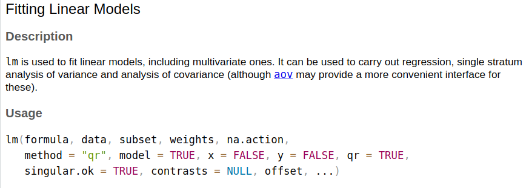

# Today's Agenda {background-image="Images/background-data_blue_v3.png"}

```{r}
library(tidyverse)
library(readxl)
library(kableExtra)
library(modelsummary)
library(modelr)
library(ggeffects)

#d <- read_excel("../Data_in_Class/World_Development_Indicators/Practice_Simple_OLS/WDI-Practice_Simple_OLS-2024-04-04.xlsx", na = "NA")
```

<br>

::: {.r-fit-text}

**Ordinary Least Squares (OLS) Regression**

- Time to code!

:::

<br>

::: r-stack
Justin Leinaweaver (Spring 2025)
:::

::: notes
Prep for Class

1. ...

<br>

Ok, based on our work this week I think it is safe to say that we all need some more practice with simple OLS regressions

- THEREFORE, I am postponing the deadline for Report 3 by one week

<br>

Today we'll take a breather from your project and focus on practicing fitting, interpreting and evaluating simple OLS regressions

<br>

So, what is a regression and how does it fit into the work we've been doing all semester?

- **SLIDE**
:::


## How much more expensive are larger diamonds than smaller ones? {background-image="Images/background-slate_v2.png" .center}

::: notes
Someone comes to you with a question to answer.

<br>

You are a social scientist so you decide to collect a bunch of data...

:::


## {background-image="Images/background-slate_v2.png" .center}

::: {.r-fit-text}
**How much more expensive are larger diamonds than smaller ones?**
:::

<br>

:::: {.columns}
::: {.column width="50%"}
**Sizes (carats)**
```{r}
options(width = 35)
diamonds$carat[1:150]
```
:::

::: {.column width="50%"}
**Prices ($)**
```{r}
diamonds$price[1:150]
```
:::
::::

::: notes

You get your hands on a sample of 54k diamonds from a large database of diamond sellers

<br>

Here we see 54k diamond observations in terms of their sizes and prices

- A long, long, long list of numbers is definitely not a useful answer to the question

<br>

So, you reach into your bag of statistical tools because you know that, at its heart, statistics is a set of tools designed for simplifying and summarizing the world

:::


## {background-image="Images/background-slate_v2.png" .center}

::: {.r-fit-text}
**How much more expensive are larger diamonds than smaller ones?**
:::

:::: {.columns}
::: {.column width="50%"}
**Sizes (carats)**
```{r, fig.align='left', fig.asp=.75, fig.width=6.5, cache=TRUE}
ggplot(diamonds, aes(x = carat)) +
  geom_histogram(color = "white", bins = 15) +
  theme_bw() +
  labs(x = "Diamond Sizes (carats)", y = "Count of Observations")

# Descriptive stats
diamonds |>
  summarize(
    Min = min(carat),
    Median = median(carat),
    Max = max(carat)
  ) |>
  kbl(digits = 2) |>
  kableExtra::kable_styling(font_size = 25)
```
:::

::: {.column width="50%"}
**Prices ($)**
```{r, fig.align='left', fig.asp=.75, fig.width=6.5, cache=TRUE}
ggplot(diamonds, aes(x = price)) +
  geom_histogram(color = "white", bins = 15) +
  theme_bw() +
  labs(x = "Diamond Prices ($)", y = "Count of Observations")

# Descriptive stats
diamonds |>
  summarize(
    Min = min(price),
    Median = median(price),
    Max = max(price)
  ) |>
  kbl(digits = 2) |>
  kableExtra::kable_styling(font_size = 25)
```
:::
::::

::: notes

First you analyze each variable on its own to get a sense of the distribution

- This means visualizations and descriptive statistics

<br>

From this you see considerable variation in both the predictor and the outcome

- This means your sample includes large and small diamonds, AND

- Your sample includes cheap and expensive diamonds

<br>

If there is variation in both variables, then it is worth checking to see if there is evidence of a relationship

:::


## {background-image="Images/background-slate_v2.png" .center}

::: {.r-fit-text}
**How much more expensive are larger diamonds than smaller ones?**
:::

```{r, fig.align = 'center', fig.asp=.8, fig.width = 8, cache=TRUE}
diamonds |>
  slice_sample(prop = .2) |>
  ggplot(aes(x = carat, y = price)) +
  geom_point(alpha = .05) +
  #geom_smooth(method = "lm", se = FALSE) +
  theme_bw() +
  labs(x = "Diamond Sizes (carats)", y = "Diamond Prices ($)",
       title = str_c("Correlation: ", round(cor(diamonds$price, diamonds$carat), 2))) +
  scale_y_continuous(limits = c(0, 20000), labels = scales::dollar_format()) +
  scale_x_continuous(limits = c(0, 3))
```

::: notes
Here we visualize the relationship and calculate a statistic, the correlation, that aims to summarize what we are seeing

<br>

This scatterplot and correlation suggest a strong positive correlation

- Larger diamonds do tend to be more expensive

<br>

BUT, the question is, HOW MUCH more expensive?

:::


## {background-image="Images/background-slate_v2.png" .center}

::: {.r-fit-text}
**How much more expensive are larger diamonds than smaller ones?**
:::

```{r, fig.align = 'center', fig.asp=.8, fig.width = 8, cache=TRUE}
diamonds |>
  slice_sample(prop = .2) |>
  ggplot(aes(x = carat, y = price)) +
  geom_point(alpha = .05) +
  geom_smooth(method = "lm", se = TRUE) +
  theme_bw() +
  labs(x = "Diamond Sizes (carats)", y = "Diamond Prices ($)") +
  scale_y_continuous(limits = c(0, 20000), labels = scales::dollar_format()) +
  scale_x_continuous(limits = c(0, 3))
```

::: notes

Regression is a technique for estimating the relationship between predictor variables (X) and an outcome (Y) using the formula for a line

- Y = $\alpha$ + $\beta$ X

<br>

Here that line is the price of a diamond is equal to the intercept plus the size of the diamond times its slope coefficient

<br>

As we have discussed, and the readings explain, OLS draws this line through the data points by minimizing the sum of the squared residuals

- e.g. finding a line that best fits the "middle" of the data points

<br>

**SLIDE**: And the result of this work is...

:::


## {background-image="Images/background-slate_v2.png" .center}

::: {.r-fit-text}
**How much more expensive are larger diamonds than smaller ones?**
:::

```{r, fig.align = 'center', fig.asp=.8, fig.width = 8, cache=TRUE}
diamonds |>
  slice_sample(prop = .2) |>
  ggplot(aes(x = carat, y = price)) +
  #geom_point(alpha = .05) +
  geom_smooth(method = "lm", se = TRUE) +
  theme_bw() +
  labs(x = "Diamond Sizes (carats)", y = "Diamond Prices ($)") +
  scale_y_continuous(limits = c(0, 20000), labels = scales::dollar_format()) +
  scale_x_continuous(limits = c(0, 3))
```

::: notes

In purely technical terms, OLS regression is a method for summarizing the relationship between two variables using a line

- That's it.

<br>

Rather than show someone a cloud of observations and asking them to intuit the relationship, we provide a single line that summarizes it!

- So much cleaner, right?

:::


## {background-image="Images/background-slate_v2.png" .center}

::: {.r-fit-text}
**How much more expensive are larger diamonds than smaller ones?**
:::

```{r, fig.align = 'center', fig.asp=.7, fig.width = 7, cache=TRUE}
res1 <- lm(data = diamonds, price ~ carat)
predict1 <- ggpredict(res1, terms = "carat")

plot(predict1) +
  scale_y_continuous(labels = scales::dollar_format(scale = 1/1000, suffix = "k")) +
  labs(x = "Diamond Sizes (carats)", y = "Diamond Prices ($)",
       title = "The Predicted Values of Diamonds Based on Size") +
  annotate("point", x = 1, y = 5400, shape = 23, size = 6, fill = "orange")# +
  #annotate("point", x = 3, y = 21000, shape = 23, size = 6, fill = "orange")
```


::: notes

The summary using a line technique is useful because we can use it to make predictions for any value of the predictor

- Again, this summary allows us to answer specific questions in a way we cannot do with a cloud of 54k observations

<br>

Our model predicts that a 1 carat diamond, on average, costs around $5k

- And the ggpredict function estimates a confidence interval of approximately +- $14

- Given the huge number of observations at the 1 carat level our regression is quite confident about its predictions!

:::


## {background-image="Images/background-slate_v2.png" .center}

::: {.r-fit-text}
**How much more expensive are larger diamonds than smaller ones?**
:::

```{r, fig.align = 'center', fig.asp=.7, fig.width = 7, cache=FALSE}
res1 <- lm(data = diamonds, price ~ carat)
predict1 <- ggpredict(res1, terms = "carat")

plot(predict1) +
  scale_y_continuous(labels = scales::dollar_format(scale = 1/1000, suffix = "k")) +
  labs(x = "Diamond Sizes (carats)", y = "Diamond Prices ($)",
       title = "The Predicted Values of Diamonds Based on Size") +
  #annotate("point", x = 1, y = 5400, shape = 23, size = 6, fill = "orange") +
  annotate("point", x = 3, y = 21000, shape = 23, size = 6, fill = "orange")
```


::: notes

Jumping to the bigger diamonds, our model predicts that a 3 carat diamond, on average, costs around $20k

- With fewer cases at this level the CI increases to approximately +- $62!

- Still very confident!

:::


## {background-image="Images/background-slate_v2.png" .center}

::: {.r-fit-text}
**How much more expensive are larger diamonds than smaller ones?**
:::

```{r, fig.align = 'center', fig.asp=.7, fig.width = 7, cache=FALSE}
plot(predict1) +
  scale_y_continuous(labels = scales::dollar_format(scale = 1/1000, suffix = "k")) +
  labs(x = "Diamond Sizes (carats)", y = "Diamond Prices ($)",
       title = "The Predicted Values of Diamonds Based on Size") +
  annotate("segment", x = 0, xend = 1, y = 5400, yend = 5400, linetype = "dashed") +
  annotate("point", x = 1, y = 5400, shape = 23, size = 6, fill = "orange") +
  annotate("text", x = 0, y = 7000, label = "$5.4k") +
  annotate("segment", x = 0, xend = 3, y = 21000, yend = 21000, linetype = "dashed") +
  annotate("point", x = 3, y = 21000, shape = 23, size = 6, fill = "orange") +
  annotate("text", x = 0, y = 23000, label = "$21k")
  
```

::: notes

With these predictions we can also estimate differences along the line

- This lets us say with some confidence that moving from a 1 to 3 carat diamond will cost you, on average, some $15k!

<br>

More useful than a scatterplot or a correlation coefficient!

:::


## Why do we use OLS regressions? {background-image="Images/background-slate_v2.png" .center}

<br>

::: {.r-fit-text}

- Quantifies the relationship between variables

- Uses **ALL** of the data

- Makes predictions with estimates of uncertainty

- Gives us criteria for evaluating the fit of the line

:::

::: notes

Bottom line, OLS is simply an extension of everything we've been doing this semester to summarize data

- A regression simply summarizes the relationship between two variables using a line

<br>

**Questions on the intuitions?**

<br>

**SLIDE**: Let's practice!

:::


## Part 2 {background-image="Images/background-slate_v2.png" .center}

<br>

**How do we fit a regression, output a table and make predictions in R?**

::: notes
Three tools for your proverbial toolbox

1. Fitting regressions with lm()

2. Making regression tables with modelsummary()

3. Making predictions with ggeffect
:::


## Fitting OLS Regressions in R {background-image="Images/background-slate_v2.png"}

<br>

::: {.r-fit-text}
lm(data = dataset, outcome ~ predictor)
:::

{.absolute width="70%" bottom=100 left=150}

::: notes
We use the lm function to fit simple linear models in R

<br>

While the help file shows you can do a ton of stuff with the lm() function, we'll be starting with just these three elements

- Specify the dataset,

- The outcome variable, and

- The predictor

<br>

**SLIDE**: Applied example
:::


## Fitting OLS Regressions in R {background-image="Images/background-slate_v2.png" .center}

```{r, echo = TRUE, eval = TRUE}
# Regress `price` on `carat` in the `diamonds` dataset
model1 <- lm(data = diamonds, price ~ carat)

# Check the Results
summary(model1)
```

:::: {.fragment}
::: {.r-fit-text}
Price = -2,256.36 + 7,756.43 x Carats
:::
::::

::: notes
**Everybody get these results?**

<br>

**REVEAL**: The estimates here in the middle is the main element we've been working with today

- These are your alpha and beta in the formula for a line

<br>

**Questions on this code?**

<br>

**Everybody clear on how to pull the estimates from the summary results to the formula for a line?**
:::


## Formatting Regression Tables in R {background-image="Images/background-slate_v2.png"}

{.absolute width="65%" bottom=0 left=170}

::: notes
Let's talk about reporting regression results in professional situations (presentations and reports)

<br>

This example comes from a paper by Jensen and Spoon that tries to explain why some countries met their climate change targets from the Kyoto Protocol and others did not.

<br>

This is essentially the standard you should see in basically every quantitative research paper you read

- Each column represents a different run of the model (or different models)

- Each row is labelled to explain what it is and then gives the results from the regression

- The top of the table leads with the predictors in the model, the bottom of the table gives the model fit stats we'll explore next class

- Each predictor specifies its coefficient estimate with the standard error below it

- After the variables come the model fit statistics which we'll discuss next class

<br>

**SLIDE**: The good news is that we can make this using code in R
:::


## Formatting Regression Tables in R {background-image="Images/background-slate_v2.png" .center}

<br>

:::: {.columns}
::: {.column width="60%"}
```{r, echo=TRUE, eval=FALSE}
# Fit the regression
model1 <- lm(data = diamonds, 
             price ~ carat)

# Formatting a regression table
# (install package 'modelsummary')
library(modelsummary)

modelsummary(model1)

# Use this one!
modelsummary(model1, 
             fmt = 2, 
             stars = c('*' = .05), 
             gof_omit = "IC|Log|F")
```
:::

::: {.column width="40%"}
```{r}
modelsummary(model1, output = "gt",
             fmt = 2, stars = c('*' = .05), gof_omit = "IC|Log|F") |>
  gt::tab_style(style = list(
                  gt::cell_fill(color = 'white'),
                  gt::cell_text(size = "large")
  ), locations = gt::cells_body())
```
:::
::::

::: notes
There are a bunch of packages that can do this, but recently I've been using modelsummary

- Makes a wide variety of elegant tables and the code isn't too tough to tweak

<br>

Everyone will have to install the modelsummary package before they can use it

<br>

If you run line 8 you'll get a HUGE table with all possible statistics included

- This is fine for rough and ready model testing but for reporting you don't want to include unneccesary information

<br>

Our preferred version modifies three of the arguments in the modelsummary function

- fmt is how many digits after the decimal (two is a good rule of thumb)

- I set the significance stars to one level (.05)

- I omitted a bunch of fit statistics we don't need at the moment

<br>

We'll go through all of this on Wednesday.

<br>

**Did everybody get this code to run?**

<br>

**SLIDE**: Last bit of new code, making regression predictions in R
:::


## Making Predictions in R {background-image="Images/background-slate_v2.png" .center}

<br>

**Install the ggeffects package**

<br>

ggpredict(model, terms)

- "model" is the regression model you've already fit

- "terms" is the predictor you want to focus on

::: notes
You can always use the formula for a line to make predictions using your regression models

- However, ONCE YOU UNDERSTAND THAT PROCESS, automated methods are incredibly useful

- More precise, faster and can automatically calculate confidence intervals

<br>

Just as before, there are many packages that aim to help with this but I've found ggeffects the best of the current bunch.

- Make sure to install the package before you try to use it!

<br>

The key here is the ggpredict function

- It can do a TON but we'll focus on just these two parts

- You have to tell ggpredict the name of your regression object and which predictor you want to use to make predictions

<br>

**SLIDE**: Example
:::


## Making Predictions in R {background-image="Images/background-slate_v2.png" .center}

::::: {.panel-tabset}

### Code
```{r, echo=TRUE, eval=FALSE}
# Fit the regression
model1 <- lm(data = diamonds, price ~ carat)

# Install one time: install.packages("ggeffects")
library(ggeffects)

# Make the Predictions
predictions1 <- ggpredict(model1, terms = "carat")

# Output: Table
predictions1

# Output: Marginal effects plot
plot(predictions1)
```

### Outputs

:::: {.columns}
::: {.column width="60%"}
```{r, fig.align='center'}
predictions1 <- ggpredict(model1, terms = "carat")

predictions1
```
:::

::: {.column width="40%"}
```{r, fig.align='center', fig.asp=0.95, fig.width=6}
plot(predictions1)
```
:::
::::

:::::

::: notes
Our current regression model only has one predictor so we have only one choice for the ggpredict function

- This asks for predictions across the main integers of the carat variable in the dataset

<br>

The table shows the predicted value of a diamond at these six possible weights according to our model (plus CIs).

<br>

The visualization converts this table into a line plot

- This will include the confidence interval, but the CI is so tight here you can't see it

<br>

**Questions on this code or these results?**
:::


## Evaluating the "Fit" of the Regression {background-image="Images/background-slate_v2.png" .center}

Pull slides from 10-2


## Practice 1 {background-image="Images/background-slate_v2.png" .center}

Regress presidential vote share (`vote_share`) on presidential approval rating (`approval_june`) in the datatset on Canvas

1. What is the estimated relationship?

2. Is this a good model of the relationship? Why or why not?

```{r}
d <- read_excel("../Data_in_Class/Class10-2-SimpleOLS_Analyses_to_Interpret/SP25-Incumbent_Performance_US_Elections.xlsx", na = "NA")
```


## {background-image="Images/background-slate_v2.png" .center}

:::: {.columns}

::: {.column width="50%"}

<br>

```{r, fig.retina=3, fig.asp=1, fig.align='center', fig.width=7}
## Scatter plot
d |>
  ggplot(aes(x = approval_june, y = vote_share)) +
  geom_point() +
  geom_smooth(method = "lm", se=F) +
  ggrepel::geom_text_repel(aes(label = incumbent)) +
  theme_bw() +
  labs(x = "Incumbent Approval (June of Election Year)", y = "Popular Vote Share (%)",
       caption = "Source: Approval data from Gallup, vote shares from The American Presidency Project at UC Santa Barbara") +
  scale_x_continuous(limits = c(30, 75)) +
  scale_y_continuous(limits = c(35, 65))
```
:::

::: {.column width="50%"}
```{r}
# Regression Table
res1 <- lm(data = d, vote_share ~ approval_june)

modelsummary(res1, output = "gt", fmt = 2, stars = c('*' = .05), gof_omit = "IC|Log|F",
             coef_map = c("approval_june"= "Approval in June (%)", "(Intercept)" = "Constant"))
```

```{r, fig.retina=3, fig.asp=.7, fig.align='center', fig.width=6}
## Residuals plot
d|>
  add_residuals(res1) |>
  add_predictions(res1) |>
  ggplot(aes(x = pred, y = resid)) +
  geom_hline(yintercept = 0, color = "darkgrey") +
  geom_point() +
  theme_bw() +
  scale_y_continuous(limits = c(-10, 10)) +
  labs(x = "Fitted Values of Vote Share", y = "Residuals")
```
:::

::::


## Practice 2 {background-image="Images/background-slate_v2.png" .center}

Regress city fuel economy (`cty`) on engine displacement (`displ`) in the `mpg` datatset

1. What is the estimated relationship?

2. Is this a good model of the relationship? Why or why not?


## {background-image="Images/background-slate_v2.png" .center}

:::: {.columns}

::: {.column width="50%"}

<br>

```{r, fig.retina=3, fig.asp=1, fig.align='center', fig.width=7}
## Scatter plot
mpg |>
  ggplot(aes(x = displ, y = cty)) +
  geom_point() +
  geom_smooth(method = "lm", se=F) +
  #ggrepel::geom_text_repel(aes(label = incumbent)) +
  theme_bw() +
  labs(x = "Engine Size (displacement)", y = "Fuel Economy (city)",
       caption = "Source: EPA's fuel economy tracking data")
```
:::

::: {.column width="50%"}
```{r}
# Regression Table
res1 <- lm(data = mpg, cty ~ displ)

modelsummary(res1, output = "gt", fmt = 2, stars = c('*' = .05), gof_omit = "IC|Log|F",
             coef_map = c("displ"= "Engine Size", "(Intercept)" = "Constant"))
```

```{r, fig.retina=3, fig.asp=.7, fig.align='center', fig.width=6}
## Residuals plot
mpg |>
  add_residuals(res1) |>
  add_predictions(res1) |>
  ggplot(aes(x = pred, y = resid)) +
  geom_hline(yintercept = 0, color = "darkgrey") +
  geom_point() +
  theme_bw() +
  scale_y_continuous(limits = c(-10, 10)) +
  labs(x = "Fitted Values of Vote Share", y = "Residuals")
```
:::

::::


## For next class, fit, interpret and make predictions using OLS: {background-image="Images/background-slate_v2.png" .center}

<br>

Regress percent of people below the  poverty line (`percbelowpoverty`) on the percent college educated (`percollege`) in the `midwest` datatset

::: notes

```{r}
## Scatter plot
midwest |>
  ggplot(aes(x = percollege, y = percbelowpoverty)) +
  geom_point() +
  geom_smooth(method = "lm", se=F) +
  #ggrepel::geom_text_repel(aes(label = incumbent)) +
  theme_bw() +
  labs(x = "College Degree (%)", y = "Population Below Poverty (%)",
       caption = "Source: Demographic information of midwest counties from 2000 US census")

# Regression Table
res1 <- lm(data = midwest, percbelowpoverty ~ percollege)

modelsummary(res1, output = "gt", fmt = 2, stars = c('*' = .05), gof_omit = "IC|Log|F",
             coef_map = c("percollege"= "College Degree (%)", "(Intercept)" = "Constant"))

## Residuals plot
midwest |>
  add_residuals(res1) |>
  add_predictions(res1) |>
  ggplot(aes(x = pred, y = resid)) +
  geom_hline(yintercept = 0, color = "darkgrey") +
  geom_point() +
  theme_bw() +
  scale_y_continuous(limits = c(-10, 10)) +
  labs(x = "Fitted Values of Vote Share", y = "Residuals")
```
:::


## Next Class {background-image="Images/background-slate_v2.png" .center}

<br>

**Causal Inference Week**

- Huntington-Klein 2022 chapter 5 "The Challenge of Identification"

::: notes

Next week we tackle some big, important ideas.

- Specifically, how do we make an argument about causality if all our methods so far have just been aimed at describing associations?

- Important material for social scientists AND for those heading off to Research Design and Senior Seminar!


:::