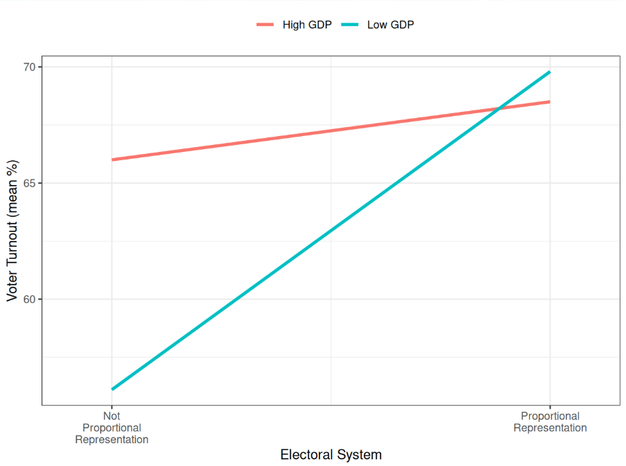
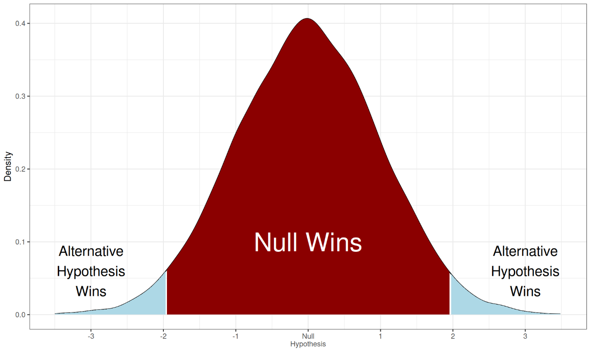
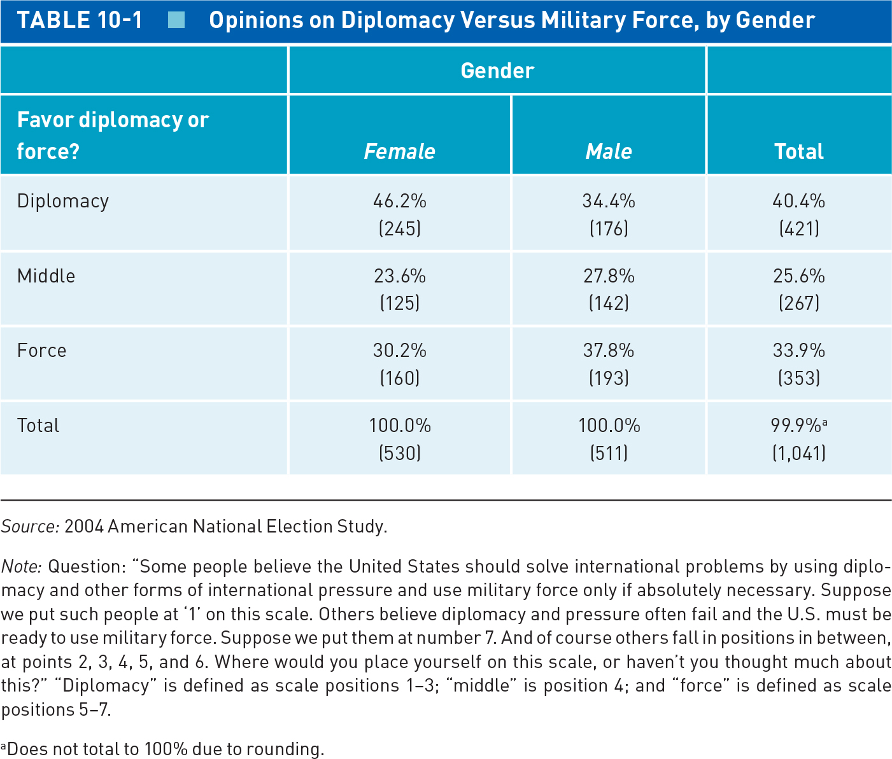
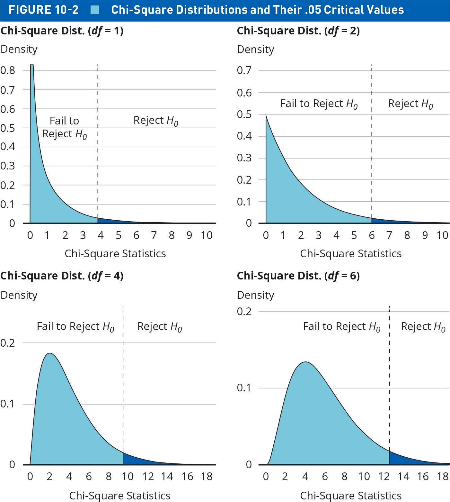
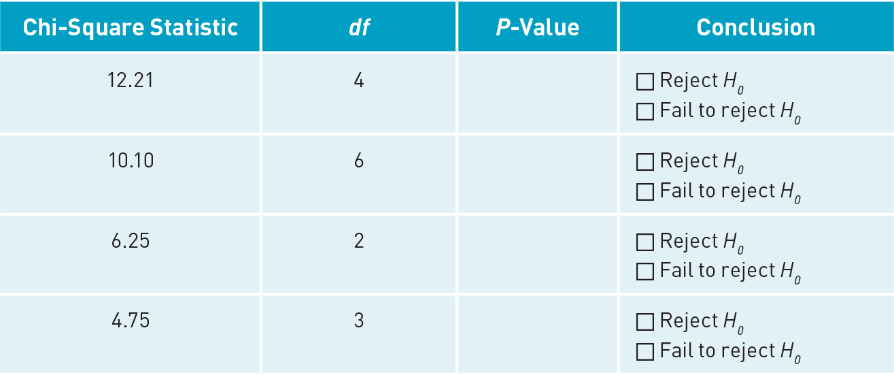
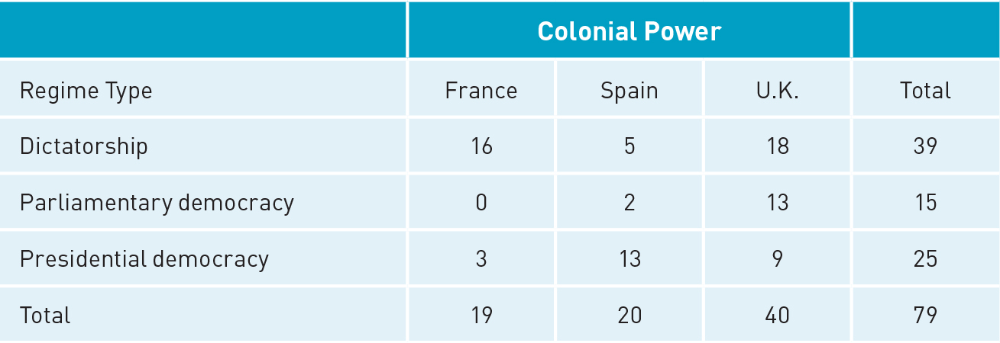

## Today's Agenda {background-image="Images/background-data_blue_v4.png" .center}

```{r}
library(tidyverse)
library(readxl)
library(kableExtra)
library(modelsummary)
library(crosstable)

load("../../DATA/2026-Spring/ANES/ANES2020_Data_Extract.RData")

states <- read_excel("../../DATA/2026-Spring/Pollock_Edwards_Textbook/Pollock_Edwards-US_States.xlsx", na = "NA")
```

<br>

::: {.r-fit-text}

**Making Statistical Inferences**

- Null Hypothesis Testing with Multiple Groups

- Chi-Square Tests

- Notes: Null_Hypothesis_Testing.R

:::

<br>

::: r-stack
Justin Leinaweaver (Spring 2026)
:::

::: notes
Prep for Class

1. Review Canvas submissions

<br>

ANNOUNCE: Same R file for your notes as what you started last Friday

- We're continuing on in the same set of approaches

<br>

After spending the first half of our semester focused on learning to use statistics to describe the world, we have now dived into the next level of our work

- **SLIDE**

:::


## Data Science: Level 2 {background-image="Images/background-data_blue_v4.png" .center}

1. Building causal arguments

2. Using samples to learn about the population

{style="display: block; margin: 0 auto"}

::: notes

Since spring break we have moved from using statistics to describe variation into using statistics to make causal arguments and learn about populations

- These new challenges represent the skills you must develop in order to do useful scientific research

- And, importantly, the tools to do these things are built on everything we have done so far!

- e.g. evaluating measures, describing variation in one variable, describing relationships between two variables, etc.

<br>

**SLIDE**: We began in Week 9 by making controlled comparisons in order to develop causal arguments

:::


## {background-image="Images/background-data_blue_v4.png" .center}

::: {.r-fit-text}
**Causal Arguments and Controlled Comparisons**
:::

:::: {.columns}
::: {.column width="40%"}

<br>

```{r, fig.align='center', fig.asp=.9, fig.width=7}
## Manual DAG
d1 <- tibble(
  x = c(1, 2, 3),
  y = c(1, 2, 1),
  labels = c("Treatment", "Confounder", "Outcome")
)

ggplot(data = d1, aes(x = x, y = y)) +
  geom_point(size = 0, color = "white") +
  theme_void() +
  coord_cartesian(xlim = c(0, 4), ylim = c(.75, 2.25)) +
  geom_label(aes(label = labels), size = 7) +
  annotate("segment", x = 1.5, xend = 2.5, y = 1, yend = 1, arrow = arrow()) +
  annotate("segment", x = 1.7, xend = 1, y = 1.85, yend = 1.15, arrow = arrow()) +
  annotate("segment", x = 2.3, xend = 3, y = 1.85, yend = 1.15, arrow = arrow())
```
:::

::: {.column width="60%"}

:::
::::

::: notes

Doing useful science means confronting the fundamental problem of causal inference

- Whether you run a randomized control trial or collect observational data you will need to show the reader that your groups of interest are likely identical on average

- This will mean adjusting your comparisons for control variables

- In Week 9 we did this both with partial effects tables and line plots

<br>

**SLIDE**: Last week we dove into inferential statistics

:::


## {background-image="Images/background-data_blue_v4.png" .center}

::: {.r-fit-text}
**Inferential Statistics: Null Hypothesis Testing**
:::

{style="display: block; margin: 0 auto"}

:::: {.columns}
::: {.column width="50%"}
1. Specify $H_0$ and $H_A$

2. Set a significance threshold

3. Calculate sample statistics
:::

::: {.column width="50%"}
4. Evaluate using p-value and/or CIs

5. Draw Conclusions
:::
::::

::: notes

Big picture our work focused on using samples to describe populations

- e.g. 1,000 Americans views of the president tells us something about the views of 350 million Americans

<br>

At the heart of this is an intuitive connection I hope you keep in mind

- EVERY numerical variable has variation that can be described with a standard deviation

    - e.g. the spread around the mean
    
- AND EVERY statistic you calculate from a sample has variation that can be described with a standard error

    - e.g. the spread around the true population parameter

<br>

If you can internalize this intuition it will make null hypothesis testing FAR easier to understand.

<br>

**SLIDE**: We spent the rest of the week learning our first tools of inferential statistics

:::


## {background-image="Images/background-data_blue_v4.png" .center}

::: {.r-fit-text}
**Inferential Statistics: Null Hypothesis Testing**
:::

{style="display: block; margin: 0 auto"}

:::: {.columns}
::: {.column width="47%"}
**Difference of Proportions**

- prop.test()
:::

::: {.column width="6%"}

:::

::: {.column width="47%"}
**Difference of Means**

- t.test()
:::
::::


::: notes

Our difference of proportions test let us test if the differences between two proportions were large enough to represent more than just random sampling error

- e.g. Are democracies more likely to join the ICC than autrocracies?

<br>

Our difference of means test shifted from proportions to comparing group averages

- e.g. How confident can we be that PR electoral systems have higher voter turnout than non-PR systems?

<br>

Key to both of those was that we were comparing across one or two samples at most

<br>

This week we move to null hypothesis testing when you have more than two groups

- This will lead us to chi-square tests and analysis of variance

<br>

**SLIDE**: Let's use our time today to explore the chi-square test of independence

:::


## {background-image="Images/background-data_blue_v4.png" .center}

::: {.r-fit-text}
**The Chi-Square Test of Independence**
:::

{style="display: block; margin: 0 auto"}

::: notes

Time to report back your answers to Q1 in the Canvas assignment!

<br>

**1. When do we use a chi-square test?**

- (THIS is the test for evaluating your multi-group cross-tabs: cat x cat)

- (Use it when you are analyzing the relationship between a categorical outcome AND a categorical predictor that has more than two groups)

<br>

**2. What is the null hypothesis in a chi-square test?**

- (Assumes that the marginal distribution is the same across the sub-groups)

- The null hypothesis in Table 10-1 is that 40% favor diplomacy, 25% are in the middle and 34% prefer force AND this should be true for men and for women

- Any difference from that should only be due to random sampling error

<br>

**3. What does a significant p-value from a chi-square test tell us?**

- (We can reject the null)

- e.g. the differences in each sub-group from the marginal proportions is MORE than random sampling error

<br>

**4. Why prefer a chi-square test to a series of pairwise comparisons (e.g. group A vs B, then B vs C, then A vs C)?**

- (More tests raises the risk of a false positive)

- (Remember, a conventional p-value threshold of .05 means you will have a false positive only 5% of the time, BUT...)

- 20 pairwise comparisons at a 5% risk essentially guarantees at least one false positive!

- SO, run a single chi-square test to evaluate all of the possible pairs at once!

<br>

**5. Finally, what are the limitations of a chi square test?**

1. (Like all NHT it is sensitive to the sample size)

2. (It cannot tell you how strong the relationship is)

3. (It cannot tell you which direction the relationship goes)

<br>

Ok, so we use a chi-square test to do null hypothesis testing on a cross-tab with more than two groups

- But how do we generate a p-value for a chi-square statistic?

- **SLIDE**: Turns out we have to segue first into the degrees of freedom concept

:::


## Degrees of Freedom {background-image="Images/background-data_blue_v4.png" .center}

{style="display: block; margin: 0 auto"}

::: notes

Statistical *degrees of freedom* can be a complicated concept, but we can explain the heart of the idea quite simply

<br>

Imagine you and three friends are going on a road trip

- The first person gets to pick any seat in the car (4 choices!)

- The second person gets to pick any of the remaining three

- The third person gets a pick between the last two seats

- The fourth person gets no choice and MUST choose the remaining seat

- THEREFORE, we would say there are three degrees of freedom in this example

- Three people were free to make some kind of choice and one did not

<br>

**SLIDE**: Not a big fan of car analogies?

:::


## Degrees of Freedom {background-image="Images/background-data_blue_v4.png" .center}

{style="display: block; margin: 0 auto"}

::: notes

Let's talk weekly menu planning

- If you have 7 different meals to eat over 7 days, your choices for the first 6 days are free. 

- On the 7th day, you are forced to eat the last remaining meal. 

- You only had 6 "degrees of freedom" to choose your meals

<br>

**SLIDE**: Let's give one more example that connects these examples to inferential statistics

:::


## Degrees of Freedom {background-image="Images/background-data_blue_v4.png" .center}

<br>

Imagine a hypothetical vector that meets two conditions:

$$ x = x_1, x_2, x_3, x_4 \tag{1} $$

$$ \bar{x} = 10 \tag{2} $$

You can essentially plug in ANY numbers you want for $x_1$, $x_2$, and $x_3$ as long as you leave $x_4$ for last

::: {.fragment}
```{r, echo=TRUE}
mean(c(4, 4, 12, 20))
```
:::

::: notes

*Read slide*

<br>

So, let's say you give me 4, 4 and 12

- That adds up to 20

- **REVEAL**

- To get a mean of 100 we just make $x_4$ = 20!

<br>

**Does this make sense?**

<br>

**SLIDE**: Now let's talk inferential stats

:::


## Degrees of Freedom {background-image="Images/background-data_blue_v4.png" .center}

<br>

Imagine drawing a sample from a population and calculating the mean

- Sample mean = 10

<br>

::: {.fragment}

We assume n-1 degrees of freedom so we can say:

- Population mean = sample mean + $x_1$

:::
::: notes

In inferential statistics we sample a population and use it to generate a sample statistic

- e.g. sample mean of 10

- The SE tells us something about how far that mean is from the true population parameter

<br>

Since we know our sample statistic is unlikely to match the population parameter exactly we adjust our null hypothesis tests

- **REVEAL**

- We ask our test to reserve one unknown value that, if we had it, would make our sample mean match the population mean

<br>

**Does that make sense?**

<br>

So, what does it look like to reserve one unknown value from our tests?

- **SLIDE**: It turns out that degrees of freedom completely change the shape of the chi-square distribution

:::


## {background-image="Images/background-data_blue_v4.png" .center}

::: {.r-fit-text}
**Null Hypothesis Testing with A Chi-Square Distribution**
:::

{style="display: block; margin: 0 auto"}

::: notes

Figure 10-2 illustrates four chi square distributions with different degrees of freedom

- A chi-square statistic has its own distribution that is different from a normal curve and depends entirely on the degrees of freedom for its shape

- The larger the number of degrees of freedom, the closer the distribution looks to a normal curve

- HOWEVER, when degrees of freedom are low the distribution is VERY right-skewed

<br>

This should make some sense give we are testing cross-tabs

- If your cross-tab has very few groups in it (e.g. rows and columns) then there isn't much room for it to have a lot of error and that means needing to set a low bar for rejecting the null

- If your cross-tab has many, many groups then there will be more error so we need a higher threshold to reject the null

- You can see this in the four plots on 10-2 as you need a threshold of only 4 to reject the null in the df 1 case, but a 13 if df is 6

<br>

The p-value approach here is the same as it was with the normal curve.

- Assuming a standard threshold of .05 we assume the null is true for any chi-squared statistic in 95% of the curve

- We only reject the null if the statistic is in the extreme tail end of the null distribution

- **Make sense?**

<br>

**SLIDE**: Let's now discuss Exercise 2 that reinforces this point

:::


## {background-image="Images/background-data_blue_v4.png" .center}

::: {.r-fit-text}
**The Chi-Square Test of Independence**
:::

::: {.panel-tabset}

### Function

The distribution function for the chi-squared distribution

<br>

pchisq(q, df)

- "q" is the value of the test statistic

- "df" is the degrees of freedom

### Table

{style="display: block; margin: 0 auto"}

### Code

```{r, echo=TRUE}
pchisq(q = 12.21, df = 4, lower.tail = FALSE)
pchisq(q = 10.1, df = 6, lower.tail = FALSE)
pchisq(q = 6.25, df = 2, lower.tail = FALSE)
pchisq(q = 4.75, df = 3, lower.tail = FALSE)
```

:::

::: notes

*ONLY SHOW THE CODE IF THEY TAKE THE LEAD. It's an assignment for a reason!*

<br>

**Function**

To complete Exercise 2 you needed to practice using the pchisq function

- **How did this go?**

<br>

**Table**

- *Step through each one on the Table*

- **Is the p-value significant (e.g. can we reject the null)?**

```{r, echo=TRUE}
pchisq(q = 12.21, df = 4, lower.tail = FALSE)
pchisq(q = 10.1, df = 6, lower.tail = FALSE)
pchisq(q = 6.25, df = 2, lower.tail = FALSE)
pchisq(q = 4.75, df = 3, lower.tail = FALSE)
```

<br>

Ok, to reiterate:

- The chi-square test is the statistical tool we use to on cross-tabs to perform null hypothesis tests

- The chi-square statistic calculates the difference between the actual counts in your cross-tab and the null hypothesis

- THEN we look to see if that statistic is large enough to reject the null

<br>

**SLIDE**: I think this will all make more sense if we work through Exercise 3 together

:::


## Exercise 3 {background-image="Images/background-data_blue_v4.png" .center}

$$ \chi^2 = \Sigma \frac{(f_o - f_e)^2}{f_e} $$

{style="display: block; margin: 0 auto"}

::: notes

Exercise 3 asks you to run a complete analysis of this cross-tab

- That means calculating the chi-square value by hand, and

- Calculating a p-value for that statistic to see if we can reject the null or not

<br>

This is the formula for calculating the chi-square value for a cross-tab

- In future you will use R to do all of this for you, BUT

- It is INCREDIBLY valuable to do this a few times by hand so you learn the intuition behind the method

<br>

Ok, step 1 of the process is to identify the observed frequencies ($f_o$)

- **So, what are the observed frequencies in this table?**

- (**SLIDE**)

:::


## {background-image="Images/background-data_blue_v4.png" .center}

::: {.r-fit-text}
**The Chi-Square Test of Independence**
:::

1. Observed frequencies ($f_o$)

|Regime Type|France|Spain|UK|Total|
|:----------|:----:|:----:|:----:|:----:|
|Dictatorship|$f_o$ = 16|$f_o$ = 5|$f_o$ = 18|39|
|Parliamentary|$f_o$ = 0|$f_o$ = 2|$f_o$ = 13|15|
|Presidential|$f_o$ = 3|$f_o$ = 13|$f_o$ = 9|25|
|Total|19|20|40|79|

::: notes

Step 1 is easy, just record the actual counts in each cell

- Those are your observed frequencies

<br>

Step 2 of the process is to calculate the expected frequencies for each cell

- **How do we do that? How did you complete step 2?**

- (**SLIDE**)

:::


## {background-image="Images/background-data_blue_v4.png" .center}

::: {.r-fit-text}
**The Chi-Square Test of Independence**
:::

2. Expected frequencies ($f_e$)

|Regime Type|France|Spain|UK|Total|
|:----------|:----:|:----:|:----:|:----:|
|Dictatorship|$f_o$ = 16 \n $f_e$ = 9|$f_o$ = 5 \n $f_e$ = 10|$f_o$ = 18 \n $f_e$ = 20|39 \n (49%)|
|Parliamentary|$f_o$ = 0 \n $f_e$ = 4|$f_o$ = 2 \n $f_e$ = 4|$f_o$ = 13 \n $f_e$ = 8|15 \n (19%)|
|Presidential|$f_o$ = 3 \n $f_e$ = 6|$f_o$ = 13 \n $f_e$ = 6|$f_o$ = 9 \n $f_e$ = 13|25 \n (32%)|
|Total|19|20|40|79|

::: notes

Step 2 is the big intuition here that underpins what a chi square test actually does

- The null hypothesis is that the marginal distribution is the same across all sub-groups

<br>

So we convert the marginal frequencies to proportions and then apply those %s to each sub-group

- e.g. 49% of French, Spanish and British colonies should all be dictatorships

<br>

**SLIDE**: Step 3 is pretty darn simple!

:::


## {background-image="Images/background-data_blue_v4.png" .center .smaller}

::: {.r-fit-text}
**The Chi-Square Test of Independence**
:::

3. $f_o$ - $f_e$

|Regime Type|France|Spain|UK|Total|
|:----------|:----:|:----:|:----:|:----:|
|Dictatorship|$16-9=7$|$5-10=-5$|$18-20=-2$|39 \n (49%)|
|Parliamentary|$0-4=-4$|$2-4=-2$|$13-8=5$|15 \n (19%)|
|Presidential|$3-6=-3$|$13-6=7$|$9-13=-4$|25 \n (32%)|

::: notes

Step 3 finds the difference between the expected and observed frequencies

- In other words, how far away from the null hypothesis are our actual observations?

<br>

**SLIDE**: Step 4 squares the differences

:::


## {background-image="Images/background-data_blue_v4.png" .center .smaller}

::: {.r-fit-text}
**The Chi-Square Test of Independence**
:::

4. $(f_o - f_e)^2$

|Regime Type|France|Spain|UK|Total|
|:----------|:----:|:----:|:----:|:----:|
|Dictatorship|$(16-9)^2 = 49$|$(5-10)^2 = 25$|$(18-20)^2 = 4$|39 \n (49%)|
|Parliamentary|$(0-4)^2= 16$|$(2-4)^2 = 4$|$(13-8)^2 = 25$|15 \n (19%)|
|Presidential|$(3-6)^2 = 9$|$(13-6)^2 = 49$|$(9-13)^2 = 16$|25 \n (32%)|

::: notes

**If the goal is to create a measure that represents the amount of difference between the observed and expected frequencies why do we square these differences?**

- (This way the negative and positive values don't offset each other)

- We want to make sure any difference, positive or negative, pushes us away from the null hypothesis

:::


## {background-image="Images/background-data_blue_v4.png" .center .smaller}

::: {.r-fit-text}
**The Chi-Square Test of Independence**
:::

5. $\frac{(f_o - f_e)^2}{f_e}$

|Regime Type|France|Spain|UK|Total|
|:----------|:----:|:----:|:----:|:----:|
|Dictatorship|$\frac{(16-9)^2}{9} = 5.4$|$\frac{(5-10)^2}{10} = 2.5$|$\frac{(18-20)^2}{20} = .2$|39 \n (49%)|
|Parliamentary|$\frac{(0-4)^2}{4} = 4$|$\frac{(2-4)^2}{4} = 1$|$\frac{(13-8)^2}{8} = 3.125$|15 \n (19%)|
|Presidential|$\frac{(3-6)^2}{6} = 1.5$|$\frac{(13-6)^2}{6} =8.16$|$\frac{(9-13)^2}{13} = 1.23$|25 \n (32%)|

::: notes

Step 5 scales each difference by the expected frequency

- **What does this do for us? How does it change the meaning of the score in each cell?**

<br>

We do this because a squared value like 25 or 49 doesn't really mean anything on its own

- Is that big or small? It depends on how big the table is and how big your sample is

<br>

Step 5 is kind of like calculating a z-score

- Dividing by the expected frequency means each cell is now a measure of how far away the counts are from the null hypothesis

- e.g. French colonies are far away from the null number of dictatorships

- e.g. Spanish parliaments are close to the expected amount

<br>

**Does everybody see how cells where $f_o$ and $f_e$ are close have small values?**

<br>

**What do we do with all these standardized values in each cell?**

- (**SLIDE**)


:::


## {background-image="Images/background-data_blue_v4.png" .center .smaller}

::: {.r-fit-text}
**The Chi-Square Test of Independence**
:::

6. $\Sigma \frac{(f_o - f_e)^2}{f_e}$

|Regime Type|France|Spain|UK|Total|
|:----------|:----:|:----:|:----:|:----:|
|Dictatorship|$\frac{(16-9)^2}{9} = 5.4$|$\frac{(5-10)^2}{10} = 2.5$|$\frac{(18-20)^2}{20} = .2$|39 \n (49%)|
|Parliamentary|$\frac{(0-4)^2}{4} = 4$|$\frac{(2-4)^2}{4} = 1$|$\frac{(13-8)^2}{8} = 3.125$|15 \n (19%)|
|Presidential|$\frac{(3-6)^2}{6} = 1.5$|$\frac{(13-6)^2}{6} =8.16$|$\frac{(9-13)^2}{13} = 1.23$|25 \n (32%)|

<br>

$\chi^2 = 5.4+2.5+.2+4+1+3.125+1.5+8.17+1.23 \approx 27$

::: notes

The big sigma means add all the values together and that gives us our chi-square value for the cross-tab

- In other words, the chi-square statistic for a table is the sum of all the differences in the table between the counts and the null hypothesis

<br>

So, is this a big enough difference to reject the null?

- **What did we learn we need in Exercise 2 in order to run the p-value test of the chi-square distribution? 

- (**SLIDE**)

:::


## {background-image="Images/background-data_blue_v4.png" .center .smaller}

::: {.r-fit-text}
**The Chi-Square Test of Independence**
:::

7. $df = (\text{ncol} - 1) \times (\text{nrow} - 1)$

|Regime Type|France|Spain|UK|Total|
|:----------|:----:|:----:|:----:|:----:|
|Dictatorship|$\frac{(16-9)^2}{9} = 5.4$|$\frac{(5-10)^2}{10} = 2.5$|$\frac{(18-20)^2}{20} = .2$|39 \n (49%)|
|Parliamentary|$\frac{(0-4)^2}{4} = 4$|$\frac{(2-4)^2}{4} = 1$|$\frac{(13-8)^2}{8} = 3.125$|15 \n (19%)|
|Presidential|$\frac{(3-6)^2}{6} = 1.5$|$\frac{(13-6)^2}{6} =8.16$|$\frac{(9-13)^2}{13} = 1.23$|25 \n (32%)|

<br>

$\chi^2 = 5.4+2.5+.2+4+1+3.125+1.5+8.17+1.23 \approx 27$

$df = (3-1) \times (3-1) = 4$

::: notes

The p-value approach to testing this null requires one more piece of information: the degrees of freedom

- df = (ncol - 1) x (nrow - 1)

<br>

Just like our car seats and meal planning we subtract one from the options because one row and one column don't get a choice

<br>

**SLIDE**: Let's see the distribution

:::


## {background-image="Images/background-data_blue_v4.png" .center}

::: {.r-fit-text}
**The Chi-Square Test of Independence**
:::

$\chi^2 \approx 27$, $df = 4$

```{r, fig.align='center', fig.asp=.618, fig.width=6}
x1 <- rchisq(n = 100000, df = 4)
data1 <- density(x1)

data2 <- tibble(
  x1 = data1$x,
  y1 = data1$y
)

ggplot(data2, aes(x = x1, y = y1)) +
  geom_line() +
  scale_x_continuous(limits = c(0, 30), breaks = seq(0,30, 5)) +
  theme_bw() +
  labs(x = "Chi-Square Statistics (df = 4)", y = "Density")
```

::: notes

Ok, our next job is to calculate the p-value for this chi-square statistic and see if we can reject the null hypothesis

- That is EXACTLY the exercise you practiced in textbook Exercise 2 for today!

<br>

**So, what is the p-value for this chi-square statistic?**

- (**SLIDE**)

:::


## {background-image="Images/background-data_blue_v4.png" .center}

```{r, fig.align='center', fig.asp=.618, fig.width=6}
data3 <- subset(data2, x1 < 9.5)

ggplot(data2, aes(x = x1, y = y1)) +
  geom_area(data = data3, aes(x = x1, y = y1), fill = "lightblue") +
  geom_line() +
  geom_vline(xintercept = 27, color = "red") +
  scale_x_continuous(limits = c(0, 30), breaks = seq(0,30, 5)) +
  theme_bw() +
  labs(x = "Chi-Square Statistics (df = 4)", y = "Density") +
  annotate("text", x = 4.75, y = .02, label = "Null Wins")
```

```{r, echo=TRUE}
# Our Chi-Square Test of Independence
pchisq(q = 27, df = 4, lower.tail = FALSE)
```

```{r, echo=FALSE}
# # Check the exercise in R
# tab1 <- tibble(
#   regime = c(rep("Dictatorship", 39), rep("Parliamentary", 15), rep("Presidential", 25)),
#   colonial = c(rep("France", 16), rep("Spain", 5), rep("UK", 18),
#                rep("Spain", 2), rep("UK", 13),
#                rep("France", 3), rep("Spain", 13), rep("UK", 9))
# )
# 
# # tabulate with margins
# addmargins(table(tab1$regime, tab1$colonial))
# 
# chisq.test(table(tab1$regime, tab1$colonial))
```

::: notes

We estimate a 2 in 50,000 chance we're this wrong if the null is true

- The 95% of the curve where the null hypothesis wins is all back in the area below 9.5

<br>

Ok, big picture on the chi-square test

- This is the null hypothesis test you use IF you have a cross-tab with more than two groups in the predictor, the outcome or both

- The process goes:

1. Calculate the chi-square statistic,

2. Calculate the degrees of freedom for the table, and

3. Then generate a p-value for that combination of statistic and df

<br>

**Questions on the process?**

<br>

**SLIDE**: IFF you have access to the data, R makes this incredibly simple to do

:::


## {background-image="Images/background-data_blue_v4.png" .center}

::: {.r-fit-text}
**The Chi-Square Test of Independence**
:::

<br>

chisq.test(x)

- "x" a table of counts (cross-tab)

<br>

```{r, echo=TRUE, eval=FALSE}
# A simple cross-tab
table(diamonds$clarity, diamonds$cut)

# The chi-square test of the cross-tab
chisq.test(table(diamonds$clarity, diamonds$cut))
```

::: notes

The chisq.test function wraps around your table code

- We use it the same way we use the proportions function, e.g. wrapped around a table

<br>

**SLIDE**: Let's practice

:::


## {background-image="Images/background-data_blue_v4.png" .center}

::: {.r-fit-text}
**The Chi-Square Test of Independence**
:::

<br>

$H_A$: Does party ID (partyid3) influence how Americans view the threat from Russia (threat.from.russia)?

<br>

$H_0$: Any difference in a perceived threat from Russia is due to random sampling error

::: notes

The ANES dataset includes measures of party identification and perceptions of international threat to America

- We previously used a difference of proportions test to examine if Americans viewed China or Russia as the biggest threat

- Now let's examine a cross-tab for the relationship between perceived party identification and all levels of perceived threat

<br>

**Everybody make a POLISHED cross-tab for this relationship**

- Let's eyeball the differences across the parties

- (**SLIDE**)

:::


## {background-image="Images/background-data_blue_v4.png" .center}

$H_A$: Does party ID (partyid3) influence how Americans view the threat from Russia (threat.from.russia)?

<br>

```{r}
anes |>
  select("Russian Threat" = threat.from.russia, "Party" = partyid3) |>
  na.omit() |>
  crosstable(cols = `Russian Threat`, by = `Party`, percent_digits = 0, percent_pattern = "{p_col}\n({n})") |>
  as_flextable(fontsizes = list(body = 14, header = 14))
```

::: notes

Note: I removed the NAs

<br>

**Just eyeballing this, does it look like there are big differences across the parties?**

<br>

**Any idea why Democrats view the Russian threat more than the Republicans in 2020?**

- :)

<br>

Now, everybody run the chisq.test function on your table

- **Can we reject the null?**

- (**SLIDE**)

:::


## {background-image="Images/background-data_blue_v4.png" .center}

$H_A$: Does party ID (partyid3) influence how Americans view the threat from Russia (threat.from.russia)?

```{r}
anes |>
  select("Russian Threat" = threat.from.russia, "Party" = partyid3) |>
  na.omit() |>
  crosstable(cols = `Russian Threat`, by = `Party`, percent_digits = 0, percent_pattern = "{p_col}\n({n})") |>
  as_flextable(fontsizes = list(body = 14, header = 14))
```

```{r, echo=TRUE}
chisq.test(table(anes$threat.from.russia, anes$partyid3))
```

::: notes

**Did everybody get this code to run?**

<br>

**So, can we reject the null that the distribution of perceptions about Russia are the same across the parties?**

<br>

**SLIDE**: Let's try it again!

:::


## {background-image="Images/background-data_blue_v4.png" .center}

::: {.r-fit-text}
**The Chi-Square Test of Independence**
:::

<br>

$H_A$: Does party ID (partyid3) influence how Americans view the threat from Iran (threat.from.iran)?

<br>

$H_0$: Any difference in a perceived threat from Iran is due to random sampling error

::: notes

Let's replicate the work but now focused on the Iranian threat

- Everybody make a POLISHED cross-tab for this relationship AND run the chi-square test to see if we can reject the null

- (**SLIDE**)

:::


## {background-image="Images/background-data_blue_v4.png" .center}

$H_A$: Does party ID (partyid3) influence how Americans view the threat from Iran (threat.from.iran)?

```{r}
anes |>
  select("Iran Threat" = threat.from.iran, "Party" = partyid3) |>
  na.omit() |>
  crosstable(cols = `Iran Threat`, by = `Party`, percent_digits = 0, percent_pattern = "{p_col}\n({n})") |>
  as_flextable(fontsizes = list(body = 14, header = 14))
```

```{r, echo=TRUE}
chisq.test(table(anes$threat.from.iran, anes$partyid3))
```

::: notes

**Just eyeballing this, does it look like there are big differences across the parties?**

- (Republicans much more threatened by Iran?)

<br>

**And can we reject the null?**

- (Yes!)

<br>

**SLIDE**: Let's keep exploring the ANES

:::


## Analyzing the US States {background-image="Images/background-data_blue_v4.png" .center}

<br>

"File" -> "Import Datatset" -> "From Excel"

- Pollock_Edwards-US_States.xlsx

<br>

Make sure to:

1. Name the object

2. Exclude "NA"

::: notes

On Canvas I have posted an excel file of measures about the US states

- Everybody load this excel file in R

- Let's use this to learn something about the United States of America

<br>

**SLIDE**: Test 1

:::


## Analyzing the US States {background-image="Images/background-data_blue_v4.png" .center}

<br>

$H_A$: More religious states (`religiosity3`) will have fewer protections for LGBTQ residents (`lgbtq.equality.3cat`)

$H_0$: Differences in religiosity do not explain the variation in protections for LGBTQ residents

<br>

1. Convert both into ordinal variables with factor()

2. Create a polished cross-tab of the relationship

3. Run a chi-square test of independence on the relationship

::: notes

Let's practice some coding!

- Go!

<br>

(**SLIDE**)

:::


## Analyzing the US States {background-image="Images/background-data_blue_v4.png"}

::: {.panel-tabset}

### Results

```{r, echo=FALSE}
# 1. Convert the variables
states$`Religiosity` <- factor(states$religiosity3, levels = c("Low", "Mid", "High"))
states$`LGBTQ Equality` <- factor(states$lgbtq.equality.3cat, levels = c("Low", "Medium", "High"))

# 2. Output the table
crosstable(data = states, cols = `LGBTQ Equality`, by = `Religiosity`, 
           percent_pattern = "{p_col} ({n})", percent_digits = 0) |>
  as_flextable(fontsizes = list(body = 19, header = 19))

# 3. Chi-square test
chisq.test(table(states$`Religiosity`, states$`LGBTQ Equality`))
```

### Code
```{r, echo=TRUE, eval=FALSE}
# 1. Convert the variables
states$`Religiosity` <- factor(states$religiosity3, 
                    levels = c("Low", "Mid", "High"))
states$`LGBTQ Equality` <- factor(states$lgbtq.equality.3cat, 
                    levels = c("Low", "Medium", "High"))

# 2. Output the table
crosstable(data = states, cols = `LGBTQ Equality`, by = `Religiosity`, 
           percent_pattern = "{p_col} ({n})", percent_digits = 0) |>
  as_flextable(fontsizes = list(body = 19, header = 19))

# 3. Chi-square test
chisq.test(table(states$`Religiosity`, states$`LGBTQ Equality`))
```
:::

::: notes

**SLIDE**: For Next Class

:::


## For Next Class {background-image="Images/background-data_blue_v4.png" .center}

<br>

::: {.r-fit-text}

1. Calculate a chi-square statistic by hand

2. Read Chapter 10, p268-273 (ANOVA)

3. Complete selected textbook exercises on ANOVA

:::
::: notes

**Questions on the assignment?**

<br>

Canvas Assignment: Chapter 10 Assessment (Part II)

1. Replicate textbook Exercise 3 but using the Iran threat hypothesis we examined in class. Build a cross-tab of the perceived iranian threat (threat.from.iran) and respondent party ID (partyid3). BY HAND calculate the chi-square statistic and submit your table with all of the components included.
2. Submit your answer to Exercise 5 on p278
3. Submit your answers to Exercise 6 on p278. IMPORTANT: The table in the textbook reversed the "n" and "k" columns. The sample sizes must be greater than the number of groups (e.g. 100 countries split into two regime types). Use the the Exploring_Statistical_Distributions_Reference_SP26.pdf on Canvas focused on the F-distribution.

:::