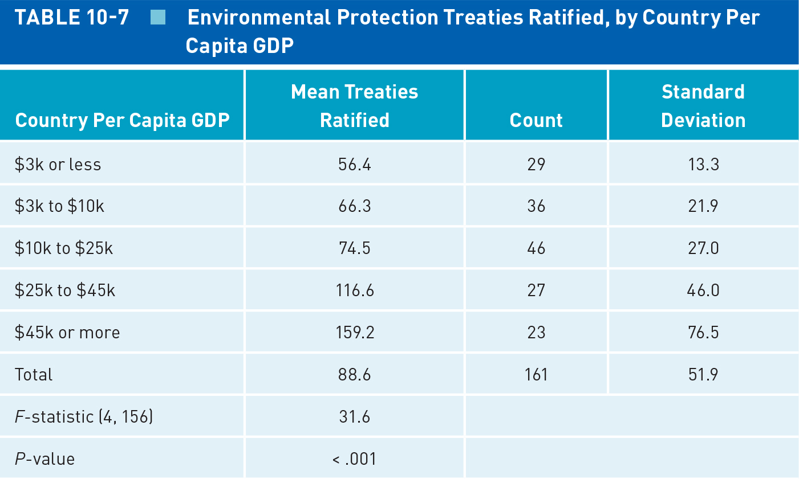
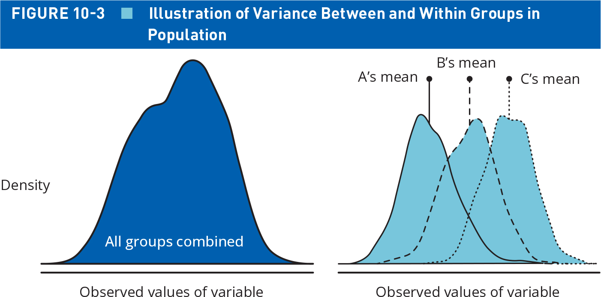
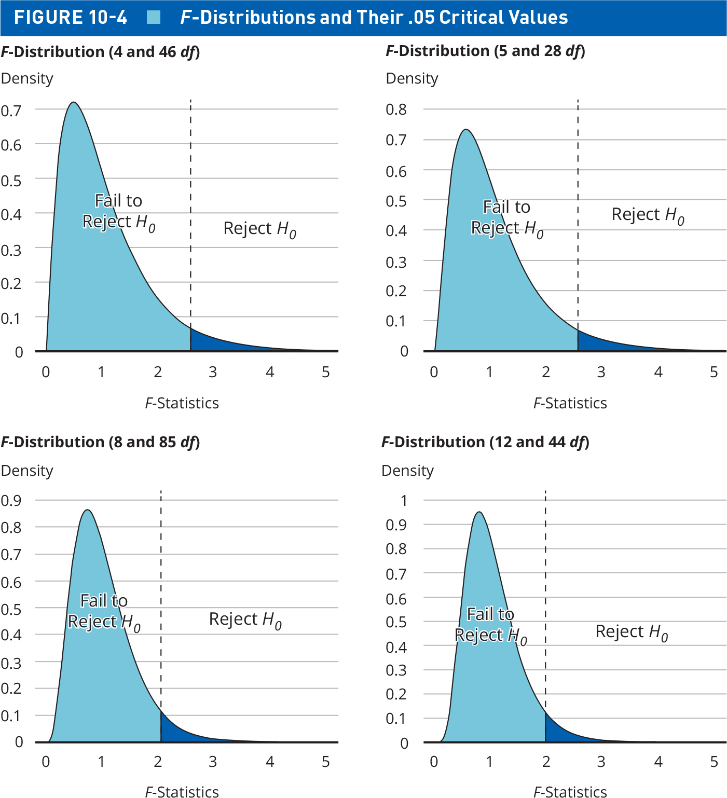
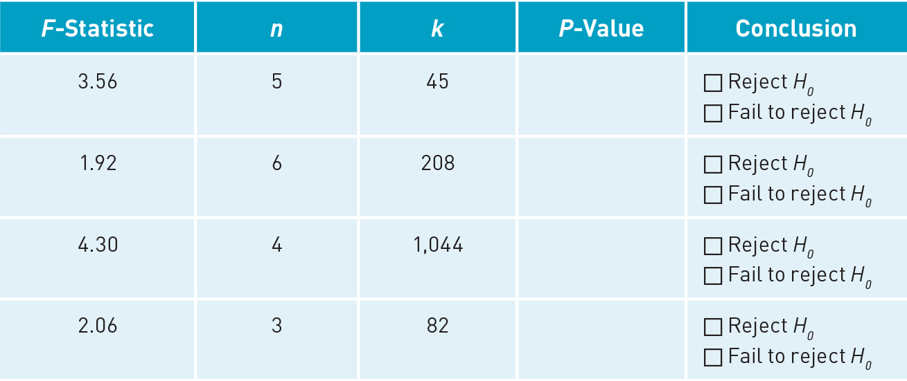

## Today's Agenda {background-image="Images/background-data_blue_v4.png" .center}

```{r}
library(tidyverse)
library(readxl)
library(kableExtra)
library(modelsummary)
library(crosstable)

load("../../DATA/2026-Spring/ANES/ANES2020_Data_Extract.RData")

states <- read_excel("../../DATA/2026-Spring/Pollock_Edwards_Textbook/Pollock_Edwards-US_States.xlsx", na = "NA")
```

<br>

::: {.r-fit-text}

**Making Statistical Inferences**

- Null Hypothesis Testing with Multiple Groups

- Analysis of Variance (ANOVA)

- Notes: Null_Hypothesis_Testing.R

:::

<br>

::: r-stack
Justin Leinaweaver (Spring 2026)
:::

::: notes
Prep for Class

1. Review Canvas submissions

<br>

ANNOUNCE: Same R file for your notes as what you started last Friday

- We're continuing on in the same set of approaches

<br>

**SLIDE**: Let's start with a refresher on the chi-square test of independence we explored last class

:::


## {background-image="Images/background-data_blue_v4.png"}

::: {.r-fit-text}
**Null Hypothesis Testing with A Chi-Square Distribution**
:::

:::: {.columns}
::: {.column width="40%"}

<br>

```{r}
tibble(
  "Regime Type" = c("Dictatorship", "Parliamentary", "Presidential"),
  France = c(16,0,3),
  Spain = c(5,2,13),
  UK = c(18,13,9),
  Total = c(16+5+18, 0+2+13, 3+13+9)
) |>
  kable(align = c("l", rep("c",4))) |>
  kable_styling(font_size = 20)

```

<br>

$$ \chi^2 = \Sigma \frac{(f_o - f_e)^2}{f_e} $$

:::

::: {.column width="60%"}
{.absolute width="525" right=0 bottom=0}
:::
::::

::: notes

**When do I use a chi-square test of independence?**

- (Null hypothesis testing a cross-tab where at least one variable has more than two groups)

<br>

**What is the null hypothesis being tested in a chi-square test?**

- (Marginal distribution is the same across sub-groups; any observed difference is random sampling error)

<br>

**What is the difference between $f_o$ and $f_e$?**

- (Observed and expected frequencies)

    - $f_o$ is the actual counts (frequencies)
    
    - $f_e$ is the marginal distribution applied to each group

<br>

**In the chi-square statistic formula do we divide the squared difference by the expected frequency?**

- (We want the difference expressed in units of distance away from the expected frequency)

- Otherwise the size of the "error" in each cell would relate more to the sample size rather than differences from the null

<br>

For the p-value test we need to know how many degrees of freedom to associate with the chi-square distribution

- **How do we determine the degrees of freedom associated with a cross-tab?**

- df = (nrow - 1) x (ncol - 1)

<br>
    
**What do big values of a chi-square statistic mean for the null hypothesis?**

- (Bigger differences from the null, e.g. reject the null!)

<br>

**SLIDE**: For class today I asked you to run a chi-square test by hand 

:::


## {background-image="Images/background-data_blue_v4.png" .center}

### **Does party ID influence how Americans view the seriousness of threats from Iran?**

<br>

**My Estimates (by hand)**

- $\chi^2 \approx 319.83$

- $df = 8$

- $p = 2.5e^{-64}$

```{r}
chisq.test(table(anes$threat.from.iran, anes$partyid3))
```

::: notes

**How did you do?**

- **Did anybody get closer to the R estimate of the chi-square?**

<br>

**Any questions on the chi-square material from the textbook or our work last class?**

<br>

**SLIDE**: Our work for today is to practice with ANOVA which extends difference of means testing to more than two groups

<br>

```{r, echo=TRUE, eval=FALSE}
table(anes$threat.from.iran, anes$partyid3)
addmargins(table(anes$threat.from.iran, anes$partyid3))

# marginal distribution %s
rte1 <- round(c(362, 1082, 2308, 1840, 1709)/7301, 2)

# Apply those rates to parties
round(rte1 * 2546,0)
round(rte1 * 2482,0)
round(rte1 * 2273,0)

# Calculate per cell amounts
((134-127)^2)/127
((419-382)^2)/382
((911-815)^2)/815
((619-636)^2)/636
((463-586)^2)/586

((181-124)^2)/124
((436-372)^2)/372
((794-794)^2)/794
((598-620)^2)/620
((473-571)^2)/571

((47-114)^2)/114
((227-341)^2)/341
((603-727)^2)/727
((623-568)^2)/568
((773-523)^2)/523

.39+26.2+39.38+3.58+11.01+38.11+11.31+0+21.15+.45+.78+5.33+25.82+16.82+119.5
pchisq(q = 319.83, df=8, lower.tail = FALSE)

chisq.test(table(anes$threat.from.iran, anes$partyid3))
pchisq(q = 317.06, df=8, lower.tail = FALSE)

table(anes$threat.from.iran, anes$partyid3)
addmargins(table(anes$threat.from.iran, anes$partyid3))
proportions(table(anes$threat.from.iran, anes$partyid3), margin = 2)
chisq.test(table(anes$threat.from.iran, anes$partyid3))
```

:::


## {background-image="Images/background-data_blue_v4.png" .center}

::: {.r-fit-text}
**Analysis of Variance (ANOVA)**
:::

{style="display: block; margin: 0 auto"}

::: notes

Time to report back your answers to textbook Exercise 5!

<br>

**1. When do we use ANOVA?**

- (Performing a null hypothesis test on group means when you have more than two groups)

- In other words, ANOVA is for situations where you want to analyze the relationship between an interval variable and a categorical variable with at least two groups

- If only two groups then just run a difference of means

<br>

**2. What is the null hypothesis in ANOVA?**

- (Null hypothesis: The predictor has no effect on the outcome so the mean of the outcome should be approximately the same in each group)

- Any difference from that should only be due to random sampling error

<br>

**3. What does a significant p-value from an ANOVA tell us?**

- (We can reject the null)

- e.g. the differences in each sub-group from the group means is MORE than random sampling error

<br>

**4. Why prefer an ANOVA to a series of pairwise comparisons (e.g. group A vs B, then B vs C, then A vs C)?**

- (1. More tests raises the risk of a false positive)

    - (Remember, a conventional p-value threshold of .05 means you will have a false positive only 5% of the time, BUT...)

- (2. More efficient because it uses ALL of the variation across the groups not just focused on two groups at a time)

<br>

**5. Finally, what are the limitations of an ANOVA test?**

1. (It tells us groups differ, not which SPECIFIC groups differ)

2. (Means sensitive to outliers)

3. (Assumes data within each group is normally distributed)

<br>

Ok, so the ANOVA generates an F-statistic and we use that to estimate the p-value associated with the null hypothesis

- **SLIDE**: That means we need to discuss the F distribution

:::


## ANOVA and the F Distribution {background-image="Images/background-data_blue_v4.png" .center}

```{r, fig.align='center', fig.asp=.618, fig.width=7}
# what does it look like to vary the ratio in an F distribution
# Make a gif that cycles through different df1's and df2's

# df1a <- c(1:10, rep(5, 10))
# df2a <- c(rep(5, 10), 1:10)

# df1a <- c(1:8, rep(8, 12))
# df2a <- c(rep(10,10), 11:20)
# 
# for (i in 1:20) {
#   
#   # Generate simulated data
#   sim1 <- tibble(
#     x1 = rf(n = 125, df1 = df1a[i], df2 = df2a[i])
#   )
#   
#   # Visualize it
#   p <- ggplot(sim1, aes(x = x1)) +
#     geom_density() +
#     theme_bw() +
#     scale_x_continuous(limits = c(0,5)) +
#     scale_y_continuous(limits = c(0, 1)) +
#     labs(x = "", y = "Density", 
#          title = str_c("F Distribution (df1 = ", df1a[i], ", df2 = ", df2a[i], ")"))
#   
#   print(p)
# }


## Vary both df's
sim1 <- tibble(
  x1 = rf(n = 60, df1 = 2, df2 = 4),
  x2 = rf(n = 60, df1 = 2, df2 = 6),
  x3 = rf(n = 60, df1 = 3, df2 = 4),
  x4 = rf(n = 60, df1 = 3, df2 = 6),
  x5 = rf(n = 60, df1 = 5, df2 = 4)
)

sim1a <- sim1 |>
  pivot_longer(cols = x1:x5, names_to = "version", values_to = "value")

ggplot(sim1a, aes(x = value, color = version)) +
  geom_density() +
  theme_bw() +
  scale_x_continuous(limits = c(0,4)) +
  guides(color = FALSE) +
  labs(x = "", y = "Density", color = "",
       title = "The F Distribution with Varying Degrees of Freedom") +
  theme(color = "none")
```

::: notes

ANOVA generates F-statistics that are evaluated using an F distribution

- That distribution changes shaped based on TWO different degrees of freedom

- The first component focuses on the number of groups being evaluated (minus 1 of course!)

- The second component focuses on the overall sample size (minus the number of groups)

<br>

Why two contributors to the degrees of freedom in an F distribution?

- That's because the F-statistic is actually a ratio between the error between the groups and that within the groups

<br>

**SLIDE**: Let's unpack that visually

:::


## ANOVA and the F Statistic {background-image="Images/background-data_blue_v4.png" .center}

{style="display: block; margin: 0 auto"}

$$\text{F-statistic} = \frac{\frac{SS_{between}}{k-1}}{\frac{SS_{within}}{n-k}} $$

::: notes

Figure 10-3 in the textbook is meant to help you visualize the formula for the F Statistic

<br>

The plot on the left represents the work we've done all semester

- Think of this like the distribution of any variable 

- Typically here we describe the spread around the mean using the standard deviation

<br>

The plot on the right shows what we're studying when we calculate group means

- The overall distribution is split into each group AND each group has its own variation around the mean

- The question we are trying to answer is, does splitting the data into the separate groups help us explain the outcome better or not?

<br>

**SLIDE**: Let's keep going with this but in a more applied fashion

:::


##  {background-image="Images/background-data_blue_v4.png" .center}

```{r, fig.align='center', fig.asp=.618, fig.width=8}
new2 <- tibble(
  income = rnorm(n = 10000, mean = 60000, sd = 20000)
)

ggplot(new2, aes(x = income)) +
  geom_density() +
  theme_bw() +
  labs(x = "Yearly Income", y = "Density",
       title = "A Somewhat Egalitarian Society") +
  scale_y_continuous(labels = NULL) +
  scale_x_continuous(labels = scales::dollar_format(), limits = c(0,1.25e5)) +
  annotate("text", x = 1e5, y = 1.9e-5, hjust = 0, label = "Mean:") +
  annotate("text", x = 1e5, y = 1.7e-5, hjust = 0, label = str_c("- Overall: ", str_c("$", round(mean(new2$income)/1000, 1), "k"))) +
  geom_vline(xintercept = mean(new2$income))

```

::: notes

Let's say our interest is in examining the relationship between education and income

- Here I'm plotting hypothetical income data from a society that is much more egaliatrian than ours

- Most people are right in the middle of the distribution with a few on the very poor end and a few on the very rich end

<br>

Let's start by visualizing the null hypothesis

- Imagine we have a measure of education in three levels:

1. Those with a HS diploma, 

2. Those with a four year college degree, and 

3. Those with an advanced degree

<br>

**What would the null hypothesis be for this proposed relationship?**

- (The predictor has no effect on the outcome so the mean of the outcome should be approximately the same in each group)

- In other words, the mean for each education group should be the same as this overall mean

<br>

**SLIDE**: Let's visualize the null

:::


##  {background-image="Images/background-data_blue_v4.png" .center}

```{r, fig.align='center', fig.asp=.618, fig.width=8}
new2 <- tibble(
  "High School" = rnorm(n = 10000, mean = 49800, sd = 10000),
  "College" = rnorm(n = 10000, mean = 50000, sd = 10000),
  "Advanced" = rnorm(n = 10000, mean = 50200, sd = 10000)
)

new3 <- new2 |>
  pivot_longer(cols = "High School":"Advanced", names_to = "Education", values_to = "value")

ggplot(new3, aes(x = value, color = Education)) +
  geom_density() +
  theme_bw() +
  labs(x = "Yearly Income", y = "Density",
       title = "The Null Hypothesis") +
  scale_y_continuous(labels = NULL) +
  scale_x_continuous(labels = scales::dollar_format(), limits = c(0,1.25e5)) +
  guides(color = FALSE) +
  annotate("text", x = 1e5, y = 3.5e-5, hjust = 0, label = "Means:") +
  annotate("text", x = 1e5, y = 3.2e-5, hjust = 0, label = str_c("- Overall: ", str_c("$", round(mean(new3$value)/1000, 1), "k"))) +
  annotate("text", x = 1e5, y = 2.9e-5, hjust = 0, label = str_c("- High School: ", str_c("$", round(mean(new2$`High School`)/1000, 1), "k"))) +
  annotate("text", x = 1e5, y = 2.6e-5, hjust = 0, label = str_c("- College: ", str_c("$", round(mean(new2$College)/1000, 1), "k"))) +
  annotate("text", x = 1e5, y = 2.3e-5, hjust = 0, label = str_c("- Advanced: ", str_c("$", round(mean(new2$Advanced)/1000, 1), "k"))) +
  geom_vline(xintercept = mean(new2$`High School`), color = "lightblue") +
  geom_vline(xintercept = mean(new2$College), color = "green3") +
  geom_vline(xintercept = mean(new2$Advanced), color = "red3")

```

$$\text{F-statistic} = \frac{\frac{SS_{between}}{k-1}}{\frac{SS_{within}}{n-k}} $$

::: notes

**If this is our data, then how big is the F statistic likely to be for this relationship?**

<br>

Key here is to remember that the F statistic is the ratio of the error between the groups to the error within the groups

- **How much error is there between the groups?**

    - (Basically none!)
    
- **And how much error or spread is there within each group?**

    - (Way more!)
    
    - Each distribution spreads around the mean and includes many other values
    
<br>

**So, according to this F statistic formula how big is the result if the numerator is tiny and the denominator is large?**

- (Very, very small)

- A fraction with a small number on top and a large number on bottom is a very, very small number

- e.g. 1/10 or 1/100 or 1/1000

<br>

SO, a tiny F statistic tells us the null is likely correct

- e.g. the group means are the same as the overall mean OR only differ due to random sampling error

<br>

**Make sense?**

<br>

**SLIDE**: Now let's add some explanatory power to our predictor variable

:::


##  {background-image="Images/background-data_blue_v4.png" .center}

```{r, fig.align='center', fig.asp=.618, fig.width=8}
new2 <- tibble(
  "High School" = rnorm(n = 10000, mean = 30000, sd = 10000),
  "College" = rnorm(n = 10000, mean = 50000, sd = 10000),
  "Advanced" = rnorm(n = 10000, mean = 75000, sd = 10000)
)

new3 <- new2 |>
  pivot_longer(cols = "High School":"Advanced", names_to = "Education", values_to = "value")

ggplot(new3, aes(x = value, color = Education)) +
  geom_density() +
  theme_bw() +
  labs(x = "Yearly Income", y = "Density",
       title = "The Research Hypothesis") +
  scale_y_continuous(labels = NULL) +
  scale_x_continuous(labels = scales::dollar_format(), limits = c(0,1.25e5)) +
  guides(color = FALSE) +
  annotate("text", x = 1e5, y = 3.5e-5, hjust = 0, label = "Means:") +
  annotate("text", x = 1e5, y = 3.2e-5, hjust = 0, label = str_c("- Overall: ", str_c("$", round(mean(new3$value)/1000, 1), "k"))) +
  annotate("text", x = 1e5, y = 2.9e-5, hjust = 0, label = str_c("- High School: ", str_c("$", round(mean(new2$`High School`)/1000, 1), "k"))) +
  annotate("text", x = 1e5, y = 2.6e-5, hjust = 0, label = str_c("- College: ", str_c("$", round(mean(new2$College)/1000, 1), "k"))) +
  annotate("text", x = 1e5, y = 2.3e-5, hjust = 0, label = str_c("- Advanced: ", str_c("$", round(mean(new2$Advanced)/1000, 1), "k"))) +
  geom_vline(xintercept = mean(new2$`High School`), color = "lightblue") +
  geom_vline(xintercept = mean(new2$College), color = "green3") +
  geom_vline(xintercept = mean(new2$Advanced), color = "red3")


```

$$\text{F-statistic} = \frac{\frac{SS_{between}}{k-1}}{\frac{SS_{within}}{n-k}} $$

::: notes

Now imagine the case where education has a big impact on income

- **How much error is there between the groups?**

    - (Way more!)
    
- **And how much error or spread is there within each group?**

    - (Definitely still some, but less than before!)
    
<br>

**So, according to this F statistic formula how big is the result if the numerator is large and the denominator is smaller?**

- (A large numerator with a small denominator makes for big values of the F-statistic)

- e.g. 10/1 or 100/1 or 1000/1

<br>

SO, a big F statistic means the actual group means are far from the null hypothesis and we may be able to reject the null!

<br>

**Questions on these intuitions?**

<br>

**SLIDE**: Back to the p-values

:::


## ANOVA and Null Hypothesis Testing {background-image="Images/background-data_blue_v4.png" .center}

{style="display: block; margin: 0 auto"}

::: notes

Since the F statistic is a ratio between two different sources of error, the F distribution includes two different degrees of freedom

- The first degrees of freedom focuses on the number of groups (minus 1)

- The second degrees of freedom focuses on the sample size (minus the number of groups)

- The F distribution is then drawn for the likely values of the relationship between the number of groups and the sample size

<br>

Once you've defined the F distribution you can identify a statistic threshold for 95% of the area under the curve

- e.g. the area where we say the null hypothesis wins

<br>

**Make sense?**

<br>

**SLIDE**: Ok, how did you do calculating p values with the F distribution?

:::


## ANOVA and Null Hypothesis Testing {background-image="Images/background-data_blue_v4.png" .center}

::: {.panel-tabset}

### Function

The distribution function for the F distribution

<br>

pf(q, df1, df2)

- "q" is the value of the test statistic

- "df1" is between group error degrees of freedom (k-1)

- "df2" is within group error degrees of freedom (n-k)

### Table

|F-Statistic|Groups (k)|Sample Size (n)|
|:---------:|:--------:|:--------:|
|3.56|5|45|
|1.92|6|208|
|4.30|4|1,044|
|2.06|3|82|


### Code

```{r, echo=TRUE}
pf(3.56, df1 = (5-1), df2 = (45-5), lower.tail = FALSE)

pf(1.92, df1 = (6-1), df2 = (208-6), lower.tail = FALSE)

pf(4.3, df1 = (4-1), df2 = (1044-4), lower.tail = FALSE)

pf(2.06, df1 = (3-1), df2 = (82-3), lower.tail = FALSE)
```

:::

::: notes

*ONLY SHOW THE CODE IF THEY TAKE THE LEAD. It's an assignment for a reason!*

<br>

**Function**

To complete Exercise 6 you needed to practice using the pf function

- **How did this go?**

<br>

**Table**

- *Step through each one on the Table*

- IMPORTANT NOTE: The textbook reversed the columns for sample size (n) and groups (k)

- **Did you remember to use k-1 and n-k for the dfs?**

- **Is the p-value significant (e.g. can we reject the null)?**

```{r, echo=TRUE}
# {style="display: block; margin: 0 auto"}

pf(3.56, df1 = (5-1), df2 = (45-5), lower.tail = FALSE)

pf(1.92, df1 = (6-1), df2 = (208-6), lower.tail = FALSE)

pf(4.3, df1 = (4-1), df2 = (1044-4), lower.tail = FALSE)

pf(2.06, df1 = (3-1), df2 = (82-3), lower.tail = FALSE)
```

<br>

Ok, to reiterate:

- The anova test is the statistical tool we use when running a null hypothesis test on an interval variable by a categorical variable with more than two groups

<br>

**SLIDE**: Let's use R to do this for us!

:::


## Analysis of Variance (ANOVA) {background-image="Images/background-data_blue_v4.png" .center}

1. aggregate(x, data, FUN)

    - "x" is the formula (outcome ~ predictor)
    - "data" is the dataset
    - "FUN" is the function

2. aov(formula, data)

    - "formula" and "data" is same as above

3. summary()


::: notes

To do the ANOVA in R we'll use three functions

<br>

We'll use the aggregate function to calculate our group means

<br>

We'll use aov() to fit the ANOVA to the data

<br>

We'll then send the aov result to the summary function to see the F statistic and the p-value

<br>

**Any questions on the code we'll be using?**

<br>

**SLIDE**: Let's practice

:::


## Analysis of Variance (ANOVA) {background-image="Images/background-data_blue_v4.png" .center}

<br>

$H_A$: Presidential approval (ft.trump.post) is determined by partisan identity (partyid3)

$H_o$: Presidential approval is NOT determined by partisan identity

<br>

```{r, echo=TRUE, eval=TRUE}
# 1. Calculate the group means
aggregate(data = anes, ft.trump.post ~ partyid3, mean)
```

::: notes

Here's the aggregate results we've calculated many times before!

- Clearly the group means are quite different from each other

- **SLIDE**: BUT, are they distant enough to reject the null?

:::


## Analysis of Variance (ANOVA) {background-image="Images/background-data_blue_v4.png" .center}

<br>

$H_A$: Presidential approval (ft.trump.post) is determined by partisan identity (partyid3)

$H_o$: Presidential approval is NOT determined by partisan identity

```{r, echo=TRUE, eval=TRUE}
# 1. Fit the anova and output the results
aov(data = anes, ft.trump.post ~ partyid3) |>
  summary()
```

::: notes

Of course they are!

- The F statistic is 3,644 which has a p-value smaller than 2 in a quadrillion chance of getting an answer this extreme if the null is true

<br>

**Any questions on ANOVA or the code we use to calculate it?**

<br>

**SLIDE**: Let's practice some more!

:::


## Analyzing the US States with ANOVA {background-image="Images/background-data_blue_v4.png" .center .smaller}

:::: {.columns}
::: {.column width="50%"}
**Categorical Variables**

- abortlaws.3cat
- cig.tax.3cat
- cook.index3
- deathpen.status
- gay.policy
- gay.policy2
- gay.policy.con
- gay.support3
- giffords.grade
- gunlaws.3cat

:::
::: {.column width="50%"}

- judge.selection
- lgbtq.equality.3cat
- medicaid.expansion
- pot.policy
- region
- religiosity3
- rtw
- secularism3
- tax.source
- term.limits
- unionized.4cat
- voter.id.law

:::
::::

::: notes

On Canvas I have posted an excel file of measures about the US states

- Everybody load this excel file in R

- Let's use this to learn something about the United States of America

<br>

Everybody choose ONE of the categorical variables from the slide and ONE interval variable from the dataset

- Go find me something cool in the data!

- I want a hypothesis, group means and p-value test using an ANOVA

- Go!

<br>

*REPORT BACK and REPLICATE on the SCREEN*

<br>

**SLIDE**: Next week

:::


## For Next Class {background-image="Images/background-data_blue_v4.png" .center}

<br>

**Correlation and Simple Linear Regression**

- Read Chapter 11, p279-286

- Complete three exercises from the textbook (details on Canvas)


```{r, eval=FALSE}
# Spring 2026 Class Analyses

# Chi-square
table(states$rtw, states$unionized.4cat)

chisq.test(table(states$rtw, states$unionized.4cat))


crosstable(data = states, cols = rtw, by = unionized.4cat, percent_pattern = "{p_col}")


chisq.test(table(states$religiosity3, states$deathpen.status))


# aov(data, formula)

## Not significant
aggregate(data = states, alcohol ~ cig.tax.3cat, mean)
aov(data = states, alcohol ~ cig.tax.3cat) |>
  summary()

aggregate(data = states, states$crime.rate.violent ~ states$gunlaws.3cat, mean)
aov(data = states, states$crime.rate.violent ~ states$gunlaws.3cat) |>
  summary()


## significant
aggregate(data = states, states$covid.vaccinated ~ states$religiosity3, mean)
aov(data = states, states$covid.vaccinated ~ states$religiosity3) |>
  summary()

aggregate(data = states, states$abortion.rate ~ states$abortlaws.3cat, mean)
aov(data = states, states$abortion.rate ~ states$abortlaws.3cat) |>
  summary()

aggregate(data = states, states$cigarettes ~ states$gay.support3, mean)
aov(data = states, states$cigarettes ~ states$gay.support3) |>
  summary()

aggregate(data = states, states$hh.income ~ states$abortlaws.3cat, mean)
aov(data = states, states$hh.income ~ states$abortlaws.3cat) |>
  summary()

aggregate(data = states, states$hh.income ~ states$abortlaws.3cat, mean)
aov(data = states, states$hh.income ~ states$abortlaws.3cat) |>
  summary()

aggregate(data = states, states$relig.import ~ states$lgbtq.equality.3cat, mean)
aov(data = states, states$relig.import ~ states$lgbtq.equality.3cat) |>
  summary()

aggregate(data = states, states$relig.import ~ states$lgbtq.equality.3cat, mean)
aov(data = states, states$relig.import ~ states$lgbtq.equality.3cat) |>
  summary()


```


## Old slides

## {background-image="Images/background-data_blue_v4.png" .center .smaller}

|Iran Threat|Democrat|Independent|Republican|Total|
|:----------|:----:|:----:|:----:|:----:|
|Not at all|$\frac{(134-127)^2}{127} = .39$|$\frac{(181-124)^2}{124} = 26.2$|$\frac{(47-114)^2}{114} = 39.38$|362 \n (5%)|
|A little|$\frac{(419-382)^2}{382} = 3.58$|$\frac{(436-372)^2}{372} = 11.01$|$\frac{(227-341)^2}{341} = 38.11$|1082 \n (15%)|
|Moderate amount|$\frac{(911-815)^2}{815} = 11.31$|$\frac{(794-794)^2}{794} =0$|$\frac{(603-727)^2}{727} = 21.15$|2308 \n (32%)|
|A lot|$\frac{(619-636)^2}{636} = .45$|$\frac{(598-620)^2}{620} =.78$|$\frac{(623-568)^2}{568} = 5.33$|1840 \n (25%)|
|A great deal|$\frac{(463-586)^2}{586} = 25.82$|$\frac{(473-571)^2}{571} =16.82$|$\frac{(773-523)^2}{523} = 119.5$|1709 \n (23%)|

