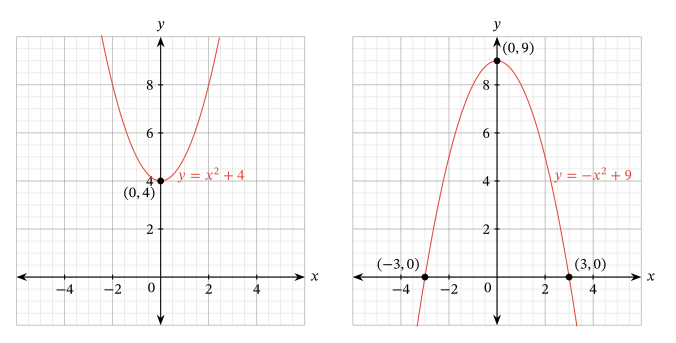

# Today's Agenda {background-image="libs/Images/background-data_blue_v3.png"}

```{r}
library(tidyverse)
library(readxl)
library(kableExtra)
library(modelsummary)
library(ggeffects)

d <- read_excel("../Data_in_Class-SP24/World_Development_Indicators/Practice_Simple_OLS/WDI-Practice_Simple_OLS-2024-04-04.xlsx", na = "NA")
```

<br>

<br>

**Practice fitting, interpreting and evaluating OLS regressions**

<br>

<br>

::: r-stack
Justin Leinaweaver (Spring 2024)
:::

::: notes
Prep for Class

1. ...

<br>

Ok, based on our work this week I think it is safe to say that we all need some more practice with simple OLS regressions

- THEREFORE, I am postponing the deadline for Report 3 by one week

<br>

Today we'll take a breather from your project and focus on practicing fitting, interpreting and evaluating simple OLS regressions

<br>

So, what is a regression and how does it fit into the work we've been doing all semester?

- **SLIDE**
:::


## How much more expensive are larger diamonds than smaller ones? {background-image="libs/Images/background-slate_v2.png" .center}

::: notes
Someone comes to you with a question to answer.

<br>

You are a social scientist so you decide to collect a bunch of data...

:::


## {background-image="libs/Images/background-slate_v2.png" .center}

::: {.r-fit-text}
**How much more expensive are larger diamonds than smaller ones?**
:::

<br>

:::: {.columns}
::: {.column width="50%"}
**Sizes (carats)**
```{r}
options(width = 35)
diamonds$carat[1:150]
```
:::

::: {.column width="50%"}
**Prices ($)**
```{r}
diamonds$price[1:150]
```
:::
::::

::: notes

You get your hands on a sample of 54k diamonds from a large database of diamond sellers

<br>

Here we see 54k diamond observations in terms of their sizes and prices

- A long, long, long list of numbers is definitely not a useful answer to the question

<br>

So, you reach into your bag of statistical tools because you know that, at its heart, statistics is a set of tools designed for simplifying and summarizing the world

:::


## {background-image="libs/Images/background-slate_v2.png" .center}

::: {.r-fit-text}
**How much more expensive are larger diamonds than smaller ones?**
:::

:::: {.columns}
::: {.column width="50%"}
**Sizes (carats)**
```{r, fig.align='left', fig.asp=.75, fig.width=6.5, cache=TRUE}
ggplot(diamonds, aes(x = carat)) +
  geom_histogram(color = "white", bins = 15) +
  theme_bw() +
  labs(x = "Diamond Sizes (carats)", y = "Count of Observations")

# Descriptive stats
diamonds |>
  summarize(
    Min = min(carat),
    Median = median(carat),
    Max = max(carat)
  ) |>
  kbl(digits = 2) |>
  kableExtra::kable_styling(font_size = 25)
```
:::

::: {.column width="50%"}
**Prices ($)**
```{r, fig.align='left', fig.asp=.75, fig.width=6.5, cache=TRUE}
ggplot(diamonds, aes(x = price)) +
  geom_histogram(color = "white", bins = 15) +
  theme_bw() +
  labs(x = "Diamond Prices ($)", y = "Count of Observations")

# Descriptive stats
diamonds |>
  summarize(
    Min = min(price),
    Median = median(price),
    Max = max(price)
  ) |>
  kbl(digits = 2) |>
  kableExtra::kable_styling(font_size = 25)
```
:::
::::

::: notes

First you analyze each variable on its own to get a sense of the distribution

- This means visualizations and descriptive statistics

<br>

From this you see considerable variation in both the predictor and the outcome

- This means your sample includes large and small diamonds, AND

- Your sample includes cheap and expensive diamonds

<br>

If there is variation in both variables, then it is worth checking to see if there is evidence of a relationship

:::


## {background-image="libs/Images/background-slate_v2.png" .center}

::: {.r-fit-text}
**How much more expensive are larger diamonds than smaller ones?**
:::

```{r, fig.align = 'center', fig.asp=.8, fig.width = 8, cache=TRUE}
diamonds |>
  slice_sample(prop = .2) |>
  ggplot(aes(x = carat, y = price)) +
  geom_point(alpha = .05) +
  #geom_smooth(method = "lm", se = FALSE) +
  theme_bw() +
  labs(x = "Diamond Sizes (carats)", y = "Diamond Prices ($)",
       title = str_c("Correlation: ", round(cor(diamonds$price, diamonds$carat), 2))) +
  scale_y_continuous(limits = c(0, 20000), labels = scales::dollar_format()) +
  scale_x_continuous(limits = c(0, 3))
```

::: notes
Here we visualize the relationship and calculate a statistic, the correlation, that aims to summarize what we are seeing

<br>

This scatterplot and correlation suggest a strong positive correlation

- Larger diamonds do tend to be more expensive

<br>

BUT, the question is, HOW MUCH more expensive?

:::


## {background-image="libs/Images/background-slate_v2.png" .center}

::: {.r-fit-text}
**How much more expensive are larger diamonds than smaller ones?**
:::

```{r, fig.align = 'center', fig.asp=.8, fig.width = 8, cache=TRUE}
diamonds |>
  slice_sample(prop = .2) |>
  ggplot(aes(x = carat, y = price)) +
  geom_point(alpha = .05) +
  geom_smooth(method = "lm", se = TRUE) +
  theme_bw() +
  labs(x = "Diamond Sizes (carats)", y = "Diamond Prices ($)") +
  scale_y_continuous(limits = c(0, 20000), labels = scales::dollar_format()) +
  scale_x_continuous(limits = c(0, 3))
```

::: notes

Regression is a technique for estimating the relationship between predictor variables (X) and an outcome (Y) using the formula for a line

- Y = $\alpha$ + $\beta$ X

<br>

Here that line is the price of a diamond is equal to the intercept plus the size of the diamond times its slope coefficient

<br>

As we have discussed, and the readings explain, OLS draws this line through the data points by minimizing the sum of the squared residuals

- e.g. finding a line that best fits the "middle" of the data points

<br>

**SLIDE**: And the result of this work is...

:::


## {background-image="libs/Images/background-slate_v2.png" .center}

::: {.r-fit-text}
**How much more expensive are larger diamonds than smaller ones?**
:::

```{r, fig.align = 'center', fig.asp=.8, fig.width = 8, cache=TRUE}
diamonds |>
  slice_sample(prop = .2) |>
  ggplot(aes(x = carat, y = price)) +
  #geom_point(alpha = .05) +
  geom_smooth(method = "lm", se = TRUE) +
  theme_bw() +
  labs(x = "Diamond Sizes (carats)", y = "Diamond Prices ($)") +
  scale_y_continuous(limits = c(0, 20000), labels = scales::dollar_format()) +
  scale_x_continuous(limits = c(0, 3))
```

::: notes

In purely technical terms, OLS regression is a method for summarizing the relationship between two variables using a line

- That's it.

<br>

Rather than show someone a cloud of observations and asking them to intuit the relationship, we provide a single line that summarizes it!

- So much cleaner, right?

:::


## {background-image="libs/Images/background-slate_v2.png" .center}

::: {.r-fit-text}
**How much more expensive are larger diamonds than smaller ones?**
:::

```{r, fig.align = 'center', fig.asp=.7, fig.width = 7, cache=TRUE}
res1 <- lm(data = diamonds, price ~ carat)
predict1 <- ggpredict(res1, terms = "carat")

plot(predict1) +
  scale_y_continuous(labels = scales::dollar_format(scale = 1/1000, suffix = "k")) +
  labs(x = "Diamond Sizes (carats)", y = "Diamond Prices ($)",
       title = "The Predicted Values of Diamonds Based on Size") +
  annotate("point", x = 1, y = 5400, shape = 23, size = 6, fill = "orange")# +
  #annotate("point", x = 3, y = 21000, shape = 23, size = 6, fill = "orange")
```


::: notes

The summary using a line technique is useful because we can use it to make predictions for any value of the predictor

- Again, this summary allows us to answer specific questions in a way we cannot do with a cloud of 54k observations

<br>

Our model predicts that a 1 carat diamond, on average, costs around $5k

- And the ggpredict function estimates a confidence interval of approximately +- $14

- Given the huge number of observations at the 1 carat level our regression is quite confident about its predictions!

:::


## {background-image="libs/Images/background-slate_v2.png" .center}

::: {.r-fit-text}
**How much more expensive are larger diamonds than smaller ones?**
:::

```{r, fig.align = 'center', fig.asp=.7, fig.width = 7, cache=FALSE}
res1 <- lm(data = diamonds, price ~ carat)
predict1 <- ggpredict(res1, terms = "carat")

plot(predict1) +
  scale_y_continuous(labels = scales::dollar_format(scale = 1/1000, suffix = "k")) +
  labs(x = "Diamond Sizes (carats)", y = "Diamond Prices ($)",
       title = "The Predicted Values of Diamonds Based on Size") +
  #annotate("point", x = 1, y = 5400, shape = 23, size = 6, fill = "orange") +
  annotate("point", x = 3, y = 21000, shape = 23, size = 6, fill = "orange")
```


::: notes

Jumping to the bigger diamonds, our model predicts that a 3 carat diamond, on average, costs around $20k

- With fewer cases at this level the CI increases to approximately +- $62!

- Still very confident!

:::


## {background-image="libs/Images/background-slate_v2.png" .center}

::: {.r-fit-text}
**How much more expensive are larger diamonds than smaller ones?**
:::

```{r, fig.align = 'center', fig.asp=.7, fig.width = 7, cache=FALSE}
plot(predict1) +
  scale_y_continuous(labels = scales::dollar_format(scale = 1/1000, suffix = "k")) +
  labs(x = "Diamond Sizes (carats)", y = "Diamond Prices ($)",
       title = "The Predicted Values of Diamonds Based on Size") +
  annotate("segment", x = 0, xend = 1, y = 5400, yend = 5400, linetype = "dashed") +
  annotate("point", x = 1, y = 5400, shape = 23, size = 6, fill = "orange") +
  annotate("text", x = 0, y = 7000, label = "$5.4k") +
  annotate("segment", x = 0, xend = 3, y = 21000, yend = 21000, linetype = "dashed") +
  annotate("point", x = 3, y = 21000, shape = 23, size = 6, fill = "orange") +
  annotate("text", x = 0, y = 23000, label = "$21k")
  
```

::: notes

With these predictions we can also estimate differences along the line

- This lets us say with some confidence that moving from a 1 to 3 carat diamond will cost you, on average, some $15k!

<br>

More useful than a scatterplot or a correlation coefficient!

:::


## Why do we use OLS regressions? {background-image="libs/Images/background-slate_v2.png" .center}

<br>

::: {.r-fit-text}

- Quantifies the relationship between variables

- Uses **ALL** of the data

- Makes predictions with estimates of uncertainty

- Gives us criteria for evaluating the fit of the line

:::

::: notes

Bottom line, OLS is simply an extension of everything we've been doing this semester to summarize data

- A regression simply summarizes the relationship between two variables using a line

<br>

**Questions on the intuitions?**

<br>

**SLIDE**: Let's practice!

:::


## Global Life Expectancy {background-image="libs/Images/background-slate_v2.png" .center}

```{r, fig.align='center', fig.asp=.618, fig.width=9, cache=TRUE}
d |>
  ggplot(aes(x = life_expectancy_total)) +
  geom_histogram(color = "white") +
  theme_bw() +
  labs(x = "Life Expectancy (Years)", y = "Count of Observations", caption = "Source: WDI 2020 data") +
  annotate("text", x = 82.3, y = .5, label = "Ireland", color = "white", srt = 90, hjust = 0) +
  annotate("text", x = 75.6, y = .5, label = "United States", color = "white", srt = 90, hjust = 0) +
  annotate("text", x = 71, y = .5, label = "Russia", color = "white", srt = 90, hjust = 0) +
  annotate("text", x = 62, y = .5, label = "Afghanistan", color = "white", srt = 90, hjust = 0) +
  scale_x_continuous(breaks = seq(50,90,5))

#View(d |> select(`Country Name`, life_expectancy_total))
```

::: notes

I've uploaded World Bank data to our Canvas modules for today

- Everybody grab that data!

<br>

Countries around the world vary dramatically in terms of their life expectancies

- Ireland: 82
- USA: 76
- Russia: 71
- Afghanistan: 62
- Nigeria: 53

<br>

Our job today is to use regressions to identify and evaluate possible answers to the question of why people in some countries tend to live longer than those in others

:::


## Regress life expectancy on... {background-image="libs/Images/background-slate_v2.png" .center}

<br>

::::: {.columns}
:::: {.column width="50%"}
```{r, fig.align='left', fig.asp=.8, fig.width=6, cache=TRUE}
d |>
  ggplot(aes(x = life_expectancy_total)) +
  geom_histogram(color = "white") +
  theme_bw() +
  labs(x = "Life Expectancy (Years)", y = "Count of Observations", caption = "Source: WDI 2020 data") +
  # annotate("text", x = 82.3, y = .5, label = "Ireland", color = "white", srt = 90, hjust = 0) +
  # annotate("text", x = 75.6, y = .5, label = "United States", color = "white", srt = 90, hjust = 0) +
  # annotate("text", x = 71, y = .5, label = "Russia", color = "white", srt = 90, hjust = 0) +
  # annotate("text", x = 62, y = .5, label = "Afghanistan", color = "white", srt = 90, hjust = 0) +
  scale_x_continuous(breaks = seq(50,90,5))
```
::::

:::: {.column width="50%"}

<br>

::: {.r-fit-text}
1. fertility_rate_per_woman

2. tobacco_use_pct

3. compulsory_education_yrs
:::
::::
:::::

::: notes
Work with the people around you to fit three regressions of life expectancy

- Model 1 regresses life expectancy on the fertility rate per woman

- Model 2 regresses life expectancy on the proportion of adults who use tobacco products

- Model 3 regresses life expectancy on the number of years of education you are required to complete

<br>

Your job:

1. Fit each model and interpret the coefficient, then 

2. Evaluate each model with our four steps

<br>

**Questions?**

- Get to it!

:::


## Explaining Global Life Expectancy {background-image="libs/Images/background-slate_v2.png" .center}

```{r}
res1 <- lm(data = d, life_expectancy_total ~ fertility_rate_per_woman)
res2 <- lm(data = d, life_expectancy_total ~ tobacco_use_pct)
res3 <- lm(data = d, life_expectancy_total ~ compulsory_education_yrs)

modelsummary(models = list(res1, res2, res3),
             out = "gt",
             fmt = 2, stars = c("*" = .05), gof_omit = "IC|F|Log",
             coef_map = c("fertility_rate_per_woman" = "Fertility (births per woman)", "tobacco_use_pct" = "Tobacco Use (%)", "compulsory_education_yrs" = "Compulsory Education (years)", "(Intercept)" = "Constant")) |>
  gt::tab_style(style = list(
                  gt::cell_fill(color = 'white'),
                  gt::cell_text(size = "x-large")
  ), locations = gt::cells_body())

```

::: notes
**Everybody get these results?**

<br>

**Interpret each coefficient for me**

- As average births per woman increases by one, life expectancy decreases by almost 5 years!

- As tobacco use in the adult population increases by 1%, average life expectancy increases by .2 years
    - So, add 5% more smokers and extend life expectancies by one year!
    
- Add one year of compulsory education and see an average increase of life expectancies by almost one year

<br>

**Missing data issues?**

- (Definitely for the tobacco model!)

<br>

**What do we learn from these R2 values?**

<br>

**SLIDE**: Let's check residual plots
:::


## Check the Residuals {background-image="libs/Images/background-slate_v2.png" .center}

```{r, fig.asp=.85, fig.width=8, fig.align='center'}
plot(res1, which = 1)
```

::: notes
**Any concerns with heteroskedasticity in the fertility rate regression?**

- Slight non-linearity here but the effect is rather minor

- Does appear that we have fewer cases at the low end of the scale (e.g. very high fertility rates) and so the model fits this extreme less well
:::


## Check the Residuals {background-image="libs/Images/background-slate_v2.png" .center}

```{r, fig.asp=.85, fig.width=8, fig.align='center'}
plot(res2, which = 1)
```

::: notes
**Any concerns with heteroskedasticity in the tobacco use regression?**

- YES!

- Appears like the regression line is missing a clear non-linear effect

<br>

**SLIDE**: At the end of class we'll come back and try to address this!
:::


## Check the Residuals {background-image="libs/Images/background-slate_v2.png" .center}

```{r, fig.asp=.85, fig.width=8, fig.align='center'}
plot(res3, which = 1)
```

::: notes
**Any concerns with heteroskedasticity in the education regression?**

- This residual plot shows the flaw in just relying on the red line because it's tracking changes across the levels that are probably just scattered randomly

- Some evidence of heteroskedasticity: At the low end error is high, at the high end it's the opposite

- Probably not a deal breaker but not a clear case of homoscedasticity
:::


## Models of Global Life Expectancy {background-image="libs/Images/background-slate_v2.png" .center}

```{r}
modelsummary(models = list(res1, res2, res3),
             out = "gt",
             fmt = 2, stars = c("*" = .05), gof_omit = "IC|F|Log",
             coef_map = c("fertility_rate_per_woman" = "Fertility (births per woman)", "tobacco_use_pct" = "Tobacco Use (%)", "compulsory_education_yrs" = "Compulsory Education (years)", "(Intercept)" = "Constant")) |>
  gt::tab_style(style = list(
                  gt::cell_fill(color = 'white'),
                  gt::cell_text(size = "x-large")
  ), locations = gt::cells_body())

```

::: notes
**Ok, where does this leave us?**

- **Is one model more useful than the others?**

<br>

- Tobacco missing a ton of data and appears to have some unmodeled non-linearity

- The other two are pretty good fits, so...

<br>

**SLIDE**: A "usefulness" argument should ABSOLUTELY consider the predictions!
:::


## Check the Predictions {background-image="libs/Images/background-slate_v2.png" .center .smaller}

<br>

:::: {.columns}
::: {.column width="60%"}
```{r}
ggpredict(res3)
```
:::

::: {.column width="40%"}
```{r, fig.align='center', fig.asp=.85, fig.width=7}
plot(ggpredict(res3))
```
:::
::::

::: notes

**What do we learn about the education regression from considering the predictions?**

<br>

- A country with ZERO required school that implements a primary education requirement will see, on average, an improvement of 4 years of life expectancy
    - 0 to 6 yrs education = 69.64-65.31 = 4.33
    
- A country moving from a primary only requirement to a secondary ed requirement will see, on average, an improvement of 4 years of life expectancy

- Do both and add 8 years!

<br>

**Make sense?**

<br>

**SLIDE**: Let's check fertility rate
:::


## Check the Predictions {background-image="libs/Images/background-slate_v2.png" .center .smaller}

<br>

:::: {.columns}
::: {.column width="60%"}
```{r}
ggpredict(res1)
```
:::

::: {.column width="40%"}
```{r, fig.align='center', fig.asp=.85, fig.width=7}
plot(ggpredict(res1))
```
:::
::::

::: notes
**What is obvious from this set of predictions?**

<br>

The effect is DRAMATICALLY larger

- ONE additional child is a 5 year decrease in life expectancy (on average)!

- The effect of fertility rate on life expectancy is staggeringly large!

<br>

**So, if you ran a development agency would you get more bang from your buck focusing on women's rights and healthcare or increasing compulsory education?**

<br>

Data is cool, right?

<br>

**Any questions on our practice work from today?**

<br>

**SLIDE**: Before we end today, let's see if we can fix the tobacco non-linearity problem!
:::


## Adapting to Non-Linear Trends



::: notes

Don't stress this, but we're just reaching back to your basic algebra skills

- The key here is that we can add squared terms to a function in order to describe parabolic shapes

- e.g. curves!

<br>

These approaches allow us to model:

1. exponential growth

2. exponential declines

3. effects that change across the levels of the predictor from positive to negative and back again

<br>

**SLIDE**: Applied to the tobacco problem...

:::


## {background-image="libs/Images/background-slate_v2.png" .center}

Life Exp = $\alpha$ + $\beta_1$ (Tobacco) + $\beta_2$ (Tobacco$^2$)

<br>

:::: {.columns}
::: {.column width="50%"}
```{r}
res2 <- lm(data = d, life_expectancy_total ~ tobacco_use_pct)
res2a <- lm(data = d, life_expectancy_total ~ tobacco_use_pct + I(tobacco_use_pct^2))

modelsummary(models = list(res2, res2a),
             out = "gt",
             fmt = 2, stars = c("*" = .05), gof_omit = "IC|F|Log",
             coef_map = c("tobacco_use_pct" = "Tobacco Use (%)", "I(tobacco_use_pct^2)" = "Tobacco^2", "(Intercept)" = "Constant")) |>
  gt::tab_style(style = list(
                  gt::cell_fill(color = 'white'),
                  gt::cell_text(size = "x-large")
  ), locations = gt::cells_body())
```
:::

::: {.column width="50%"}
```{r, fig.align='center', fig.asp=.85, fig.width=6}
plot(ggpredict(res2a))

#plot(res2a, which = 1)
```
:::
::::

::: notes

Think of this like a preview of multiple regression

- e.g. adding more variables to a regression

<br>

Model 1 in the Table is what you fit, Model 2 adds a squared version of tobacco to the regression

- We are still dealing with the formula for a line, but there are two separate slope terms that both combine to estimate the relationship

- We interpret this the same way as before but now each increase in tobacco use has TWO simultaneous effects

- Each 1 adds the first coefficient, but also the square of that 1 adds the second coefficient

- This is why we are now producing a curved line

<br>

**First of all, does Model 2 fit the data better?**

- (Yes: Increases R2, both coefficients significant, reduced error)

<br>

**SLIDE**: We can see this improvement in the residuals too

:::


## Check the Residuals {background-image="libs/Images/background-slate_v2.png" .center}

<br>

:::: {.columns}
::: {.column width="50%"}
```{r, fig.align='center', fig.asp=.85, fig.width=8}
plot(res2, which = 1)
```
:::

::: {.column width="50%"}
```{r, fig.align='center', fig.asp=.85, fig.width=8}
plot(res2a, which = 1)
```
:::
::::

::: notes
**Pretty clear improvements, no?**

<br>

**SLIDE**: Let's interpret the new model
:::


## {background-image="libs/Images/background-slate_v2.png" .center}

Life Exp = $\alpha$ + $\beta_1$ (Tobacco) + $\beta_2$ (Tobacco$^2$)

<br>

:::: {.columns}
::: {.column width="50%"}
```{r}
res2 <- lm(data = d, life_expectancy_total ~ tobacco_use_pct)
res2a <- lm(data = d, life_expectancy_total ~ tobacco_use_pct + I(tobacco_use_pct^2))

modelsummary(models = list(res2, res2a),
             out = "gt",
             fmt = 2, stars = c("*" = .05), gof_omit = "IC|F|Log",
             coef_map = c("tobacco_use_pct" = "Tobacco Use (%)", "I(tobacco_use_pct^2)" = "Tobacco^2", "(Intercept)" = "Constant")) |>
  gt::tab_style(style = list(
                  gt::cell_fill(color = 'white'),
                  gt::cell_text(size = "x-large")
  ), locations = gt::cells_body())
```
:::

::: {.column width="50%"}
```{r, fig.align='center', fig.asp=.85, fig.width=6}
plot(ggpredict(res2a))

#plot(res2a, which = 1)
```
:::
::::

::: notes

Let's talk interpretation of the curved line

- Just as before we can think of the coefficients as changes in the predictor by one

- HOWEVER, the second coefficient doesn't change by ones, it changes by squares

- So, the model prediction at 10% tobacco use is 10 x 1.36 PLUS 10^2 or 100 x -.03

- And the model prediction at 40% tobacco use is 40 x 1.36 PLUS 40^2 or 1600 x -.03

<br>

This means at low levels of tobacco use the first coefficient is bigger than the second

- e.g. tobacco use extends life expectancies on average

<br>

HOWEVER, once you get beyond the mid-20s in tobacco use, the second coefficient starts to outweigh the increases

- So, even though the squared coefficient is tiny it gets added thousands of times at the high end of the scale

<br>

**Anybody want to take a stab at explaining why we might see this relationship in the real world?**

- **Do we think tobacco use actually improves lives?**

<br>

(Definitely not. My guess is this is a proxy for wealth at the low end)

- As income goes up from a very low point access to entertainment products like tobacco increases

- BUT, at a certain point the effect of the tobacco use harms health and lowers life expectancies

<br>

Pretty cool, right?

:::


## Next Class {background-image="libs/Images/background-slate_v2.png" .center}

<br>

**Causal Inference Week**

- Huntington-Klein 2022 chapter 5 "The Challenge of Identification"

::: notes

Next week we tackle some big, important ideas.

- Specifically, how do we make an argument about causality if all our methods so far have just been aimed at describing associations?

- Important material for social scientists AND for those heading off to Research Design and Senior Seminar!


:::