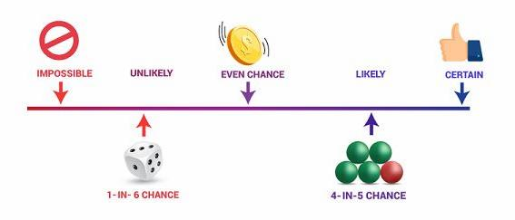

---
output:
  xaringan::moon_reader:
    css: ["default", "extra.css"]
    lib_dir: libs
    seal: false
    nature:
      highlightStyle: github
      highlightLines: true
      countIncrementalSlides: false
      ratio: '16:9'
---

```{r, echo = FALSE, warning = FALSE, message = FALSE}
##xaringan::inf_mr()
## For offline work: https://bookdown.org/yihui/rmarkdown/some-tips.html#working-offline
## Images not appearing? Put images folder inside the libs folder as that is the main data directory

library(tidyverse)
library(readxl)
library(stargazer)
##library(kableExtra)
##library(modelr)

knitr::opts_chunk$set(echo = FALSE,
                      eval = TRUE,
                      error = FALSE,
                      message = FALSE,
                      warning = FALSE,
                      comment = NA)
```

class: slideblue

.size80[**Today's Agenda**]

<br>

.size40[
1. Answering questions in a probabilistic world

2. Causal inference, Identification and DAGs
]

<br>
<br>

.center[.size40[
  Justin Leinaweaver (Fall 2021)
]]


---

class: center, middle

```{r, fig.align='center', out.width='90%', fig.retina=3}

```

.size40["Probability is the study of events and outcomes involving an element of uncertainty" (p71).]


---

class: center, middle, slideorange

.size50[**Probability (Wheelan ch 5 and 6)**]

<br>

.size50[
In what specific ways does the concept of probability connect to the data work we've done so far this semester?
]


---

class: center, middle
  
.size40[**Probability and Univariate Analyses**]

```{r, fig.retina=3, fig.align='center', fig.asp=0.65, out.width='65%', fig.width=5}
ggplot(data = diamonds, aes(x = price)) +
  geom_histogram(bins = 20, color = "white") +
  theme_bw() +
  labs(x = "Diamonds by Price ($)", y = "") +
  scale_x_continuous(breaks = seq(0, 20000, 2000), labels = str_c(seq(0, 20, 2), "k"))
```

.size30[
**How much would you pay for the chance to receive one diamond at random from this collection?**
]


---

class: center, middle
  
.size40[**Probability and Univariate Analyses**]

```{r, fig.retina=3, fig.align='center', fig.asp=0.65, out.width='65%', fig.width=5}
ggplot(data = diamonds, aes(x = price)) +
  geom_histogram(bins = 20, color = "white") +
  geom_vline(xintercept = 3933, color = "red") +
  theme_bw() +
  labs(x = "Diamonds by Price ($)", y = "") +
  scale_x_continuous(breaks = seq(0, 20000, 2000), labels = str_c(seq(0, 20, 2), "k"))

##Expected value
# diamonds |>
#   count(price) |>
#   mutate(
#     cases = nrow(diamonds),
#     probs = n/cases,
#     values = price * probs
#   ) |> 
#   summarize(
#     sum(probs),
#     sum(values)
#   )
```

.size30[
**E(diamonds) = $3,933**
]


---

class: center, middle
  
.size50[**Probability and Bivariate Analyses**]

```{r, fig.retina=3, fig.align='center', fig.asp=0.7, out.width='55%', fig.width=5}
mpg |>
  ggplot(aes(x = displ, y = cty)) +
  geom_point() +
  #geom_smooth(method = "lm") +
  theme_bw() +
  labs(x = "Engine Displacement", y = "Fuel Economy (city mpg)")
```

.size30[
**Would forcing automakers to use smaller engines improve fuel economy in new cars?**
]


---

class: center, middle
  
.size50[**Probability and Bivariate Analyses**]

<br>

```{r, fig.retina=3, out.width='100%'}
knitr::include_graphics("libs/Images/08_2-xkcd_correlation.png")
```


---

class: center
  
.size40[**Regression: Significance is a Probability**]

.pull-left[

<br>

```{r, fig.retina=3, fig.align = 'center', fig.asp=.75, out.width = '97%', fig.width = 3.5}
mpg |>
  ggplot(aes(x = displ, y = cty)) +
  geom_point() +
  geom_hline(yintercept = mean(mpg$cty), color = "red") +
  geom_smooth(method = "lm", se = FALSE) +
  theme_bw() +
  labs(x = "Engine Displacement", y = "Fuel Economy (city mpg)") +
  annotate("text", x = 6.5, y = 18.3, label = "Null", color = "red", size = 3) +
  annotate("text", x = 6.7, y = 9.75, label = "Alternative", color = "blue", size = 3, angle = -22)
```

]

.pull-right[.size20[

```{r, results='asis'}
model2 <- lm(data = mpg, cty ~ displ)

stargazer(model2, type = "html", digits = 2, header = FALSE, dep.var.caption = "", dep.var.labels = "Fuel Economy", star.cutoffs = .05, notes = "*p < 0.05", notes.append = FALSE, omit.stat = c("rsq"), font.size = "footnotesize", float = FALSE, covariate.labels = "Engine Displacement")
```
]]


---

.center[.size40[**Regression: Predictions are Probabilities**]]

.pull-left[.code105[

<br>

```{r, echo=TRUE, eval=FALSE}
## Load packages
library(tidyverse)
library(ggeffects)

## The Model
model1 <- lm(data = mpg, cty ~ displ)

## The Predictions with CIs
ggpredict(model1, terms = "displ")
```

]]

.pull-right[.code120[

<br>

```{r, echo=FALSE, eval=TRUE}
## The Model
model2 <- lm(data = mpg, cty ~ displ)

## The Predictions with CIs
ggeffects::ggpredict(model2, terms = "displ")
```

]]


---

class: middle, slideblue

.size60[.center[
**Any questions on probability from the Wheelan chapters?**
]]

<br>

.size40[
+ Chapter 5 on the basics

+ Chapter 6 on the most common errors
]


---

class: center

.size50[
**Science: The Search for Causality**
]

.size40[
"Causal inference refers to the process of drawing a conclusion that a specific treatment (i.e. intervention) was the 'cause' of the effect (or outcome) that was observed" (Frey 2018). 
]

```{r, fig.retina = 3, fig.align = 'center', fig.width = 6, fig.height=2, out.width='95%'}
## Manual DAG
d1 <- tibble(
  x = c(-3, 3),
  y = c(1, 1),
  labels = c("Treatment", "Effect")
)

ggplot(data = d1, aes(x = x, y = y)) +
  geom_point(size = 8) +
  theme_void() +
  coord_cartesian(xlim = c(-4, 4)) +
  geom_label(aes(label = labels), size = 7) +
  annotate("segment", x = -1.9, xend = 2.2, y = 1, yend = 1, arrow = arrow())
```


---

.size40[.center[**Directed Acyclic Graphs (DAGs)**]]

```{r, fig.retina = 3, fig.align = 'center', fig.width = 6, fig.height=1, out.width='95%'}
## Manual DAG
d1 <- tibble(
  x = c(-3, 3),
  y = c(1, 1),
  labels = c("Treatment", "Effect")
)

ggplot(data = d1, aes(x = x, y = y)) +
  geom_point(size = 8) +
  theme_void() +
  coord_cartesian(xlim = c(-4, 4)) +
  geom_label(aes(label = labels), size = 7) +
  annotate("segment", x = -1.9, xend = 2.2, y = 1, yend = 1, arrow = arrow())
```

.size40[
+ 'Directed' = Paths indicate direction of effect

+ 'Acyclic' = No immediate feedback loops

+ 'Graphs' = Visualized
]


---

.size40[.center[**Does ice cream create arsonists?**]]

.pull-left[

```{r, fig.retina=3, out.width='85%'}
knitr::include_graphics("libs/Images/12_1-ice_cream_truck.jpg")
```

]

.pull-right[

```{r, fig.retina=3, out.width='85%'}

```

]

```{r, fig.retina = 3, fig.align = 'center', fig.width = 6, fig.height=1, out.width='95%'}
## Manual DAG
d1 <- tibble(
  x = c(-3, 3),
  y = c(1, 1),
  labels = c("Treatment", "Effect")
)

ggplot(data = d1, aes(x = x, y = y)) +
  geom_point(size = 8) +
  theme_void() +
  coord_cartesian(xlim = c(-4, 4)) +
  geom_label(aes(label = labels), size = 7) +
  annotate("segment", x = -1.9, xend = 2.2, y = 1, yend = 1, arrow = arrow())
```


---

```{r, fig.retina = 3, fig.align = 'center', fig.width = 6, fig.height=1, out.width='95%'}
## Manual DAG
d1 <- tibble(
  x = c(-3, 3),
  y = c(1, 1),
  labels = c("Ice Cream\n Sales", "Forest\n Fires")
)

ggplot(data = d1, aes(x = x, y = y)) +
  geom_point(size = 8) +
  theme_void() +
  coord_cartesian(xlim = c(-4, 4)) +
  geom_label(aes(label = labels), size = 7) +
  annotate("segment", x = -1.9, xend = 2.2, y = 1, yend = 1, arrow = arrow())
```

```{r, fig.retina=3, fig.align='center', fig.asp=0.7, out.width='63%', fig.width=4.5}
## Show simulated data: scatterplot and correlation
d2 <- tibble(
  obs = 1:12,
  month = month.abb,
  summer = if_else(month %in% c("Jun", "Jul", "Aug"), 1, 0),
  fires = c(13, 2, 1, 3, 10, 17, 21, 20, 8, 10, 6, 12),
  ice_cream = c(27, 28, 29, 40, 65, 85, 95, 100, 70, 58, 45, 30)
)

#cor.test(d2$fires, d2$ice_cream)
model9 <- lm(data = d2, fires ~ ice_cream)

d2 |>
  ggplot(aes(x = ice_cream, y = fires)) +
  geom_smooth(method = "lm", se = FALSE) +
  geom_point() +
  theme_bw() +
  labs(x = "Ice Cream Sales (Thousands USD)", y = "Forest Fires",
       title = str_c("Beta coefficient on Ice Cream Sales: ", round(coef(model9)[[2]], 2)))
#  labs(x = "Ice Cream Sales (Thousands USD)", y = "Forest Fires",
#       title = str_c("Forest Fires = ", round(coef(model9)[[1]], 2), " + ", #round(coef(model9)[[2]], 2), " (Ice Cream Sales)"))
```


---

```{r, fig.retina = 3, fig.align = 'center', fig.width = 6, fig.height=1, out.width='95%'}
## Manual DAG
d1 <- tibble(
  x = c(-3, 3),
  y = c(1, 1),
  labels = c("Ice Cream\n Sales", "Forest\n Fires")
)

ggplot(data = d1, aes(x = x, y = y)) +
  geom_point(size = 8) +
  theme_void() +
  coord_cartesian(xlim = c(-4, 4)) +
  geom_label(aes(label = labels), size = 7) +
  annotate("segment", x = -1.9, xend = 2.2, y = 1, yend = 1, arrow = arrow())
```

.size40[
+ A causal argument depends on having an identification strategy
]

--

.size40[
+ An identification strategy specifies all of the confounders involved in your model
]

--

.size40[
+ Confounders are variables that impact both your predictor and outcome.
]


---

```{r, fig.retina=3, fig.align = 'center', fig.asp=.65, fig.height=2.5, out.width='100%'}
## Manual DAG
d3 <- tibble(
  x = c(3, -3, 0),
  y = c(1, 1, 3.2),
  labels = c("Forest\n Fires", "Ice Cream\n Sales", "?")
)

ggplot(data = d3, aes(x = x, y = y)) +
  geom_point(size = 8) +
  theme_void() +
  coord_cartesian(xlim = c(-4, 4), ylim = c(0.5, 3.5)) +
  geom_label(aes(label = labels), size = 7) +
  annotate("segment", x = .4, xend = 2.5, y = 2.9, yend = 1.4, arrow = arrow()) +
  annotate("segment", x = -.4, xend = -2.5, y = 2.9, yend = 1.4, arrow = arrow()) +
  annotate("segment", x = -1.5, xend = 2, y = 1, yend = 1, arrow = arrow())
```


---

.size40[**Confounder: Summertime!**]

.pull-left[

```{r, fig.retina=3, fig.align='center', fig.asp=0.85, out.width='98%', fig.width=4.5}
d2 |>
  ggplot(aes(x = obs, y = fires)) +
  annotate("rect", xmin = 6, xmax = 8, ymin = 2.5, ymax = 25, fill = "pink") +
  geom_line() +
  theme_bw() +
  scale_x_continuous(breaks = 1:12, labels = month.abb) +
  labs(x = "", y = "Count",
       title = "Forest Fires")
```

]

.pull-right[

```{r, fig.retina=3, fig.align='center', fig.asp=0.85, out.width='98%', fig.width=4.5}
d2 |>
  ggplot(aes(x = obs, y = ice_cream)) +
  annotate("rect", xmin = 6, xmax = 8, ymin = 30, ymax = 110, fill = "pink") +
  geom_line() +
  theme_bw() +
  scale_x_continuous(breaks = 1:12, labels = month.abb) +
  labs(x = "", y = "Thousands USD",
       title = "Ice Cream Sales")
```

]


---

```{r, fig.retina=3, fig.align = 'center', fig.asp=.65, fig.height=2.5, out.width='100%'}
## Manual DAG
d3 <- tibble(
  x = c(3, -3, 0),
  y = c(1, 1, 3.2),
  labels = c("Forest\n Fires", "Ice Cream\n Sales", "Summer Months")
)

ggplot(data = d3, aes(x = x, y = y)) +
  geom_point(size = 8) +
  theme_void() +
  coord_cartesian(xlim = c(-4, 4), ylim = c(0.5, 3.5)) +
  geom_label(aes(label = labels), size = 7) +
  annotate("segment", x = .4, xend = 2.5, y = 2.9, yend = 1.4, arrow = arrow()) +
  annotate("segment", x = -.4, xend = -2.5, y = 2.9, yend = 1.4, arrow = arrow()) +
  annotate("segment", x = -1.5, xend = 2, y = 1, yend = 1, arrow = arrow())
```


---

class: center

.size40[**Our Identification Strategy in Data Viz**]

```{r, fig.retina=3, fig.asp=0.4, out.width='95%', fig.width=8, fig.align='center'}
d2 |>
  mutate(
    Summer2 = if_else(summer == 1, "Summer Months", "Other Months")
  ) |>
  ggplot(aes(x = ice_cream, y = fires)) +
  geom_point() +
  geom_smooth(method = "lm", se = FALSE) +
  theme_bw() +
  facet_wrap(~ Summer2) +
  labs(x = "Ice Cream Sales (Thousands USD)", y = "Forest Fires")
```

<br>

.size40[**Does this solve our confounder problem?**]


---

class: center

.size40[**Our Identification Strategy in Data Viz**]

```{r, fig.retina=3, fig.asp=0.4, out.width='95%', fig.width=8, fig.align='center'}
d2 |>
  mutate(
    Summer2 = if_else(summer == 1, "Summer Months", "Other Months")
  ) |>
  ggplot(aes(x = ice_cream, y = fires)) +
  geom_point() +
  geom_smooth(method = "lm", se = FALSE) +
  theme_bw() +
  facet_wrap(~ Summer2) +
  labs(x = "Ice Cream Sales (Thousands USD)", y = "Forest Fires")
```

.size30[
The Good: Evidence the confounder impacts our causal effect

The Bad: Not a single estimate of the effect using all the data.
]


---

class: center

.size40[**How do we adjust the relationship for the confounder?**]

```{r, fig.retina=3, fig.align = 'center', fig.asp=.7, fig.width = 5, ,out.width='70%'}
## Controlling for a confounder

## Break into subsets
d2_summer <- d2 |> 
  filter(summer == 1)

d2_other <- d2 |> 
  filter(summer == 0)

## Center variables
d2_summer2 <- d2_summer |> 
  mutate(
    fires2 = fires - mean(d2_summer$fires),
    ice_cream2 = ice_cream - mean(d2_summer$ice_cream)
  )

d2_other2 <- d2_other |> 
  mutate(
    fires2 = fires - mean(d2_other$fires),
    ice_cream2 = ice_cream - mean(d2_other$ice_cream)
  )

d3 <- rbind(d2_other2, d2_summer2) |>
  arrange(obs)

d10 <- d3

model10 <- lm(data = d3, fires ~ ice_cream)
model11 <- lm(data = d3, fires ~ ice_cream + summer)

## Group means
# d2 |>
#   group_by(summer) |>
#   summarize(
#     mean(fires),
#     mean(ice_cream)
#   )

d3 |>
  ggplot(aes(x = ice_cream, y = fires)) +
  geom_point() +
  geom_smooth(method = "lm", se=FALSE) +
  theme_bw() +
  labs(x = "Ice Cream Sales (Thousands USD)", y = "Forest Fires") +
  annotate("text", 
           x = 28, 
           y = 20, 
          hjust = 0,
           label = str_c("Forest Fires = ",
                         round(coef(model10)[[1]], 2),
                         " + ",
                         round(coef(model10)[[2]], 2),
                         " (Ice Cream Sales)"))

# title = str_c("Original data and model (Slope = ", round(coef(model10)[[2]], 2), "*)"))
```


---

```{r, fig.retina=3, fig.align = 'center', fig.asp=.75, fig.width = 5.5, out.width='80%'}
d3 |>
  ggplot(aes(x = ice_cream, y = fires, color = factor(summer))) +
  geom_point() +
  theme_bw() +
  labs(x = "Ice Cream Sales (Thousands USD)", y = "Forest Fires",
       title = "1. Identify data points by time of year: Summer vs Other") +
  guides(color = "none") +
  scale_color_manual(values = c("blue", "red")) +
  annotate("text", x = 80, y = 20, label = "Summer Months", color = "red") +
  annotate("text", x = 50, y = 2.5, label = "Other Months", color = "blue")
```


---

```{r, fig.retina=3, fig.align = 'center', fig.asp=.75, fig.width = 5.5, out.width='80%'}
d3 |>
  ggplot(aes(x = ice_cream, y = fires, color = factor(summer))) +
  geom_point() +
  theme_bw() +
  labs(x = "Ice Cream Sales (Thousands USD)", y = "Forest Fires",
       title = "2. Calculate average ice cream sales by time of year") +
  guides(color = "none") +
  scale_color_manual(values = c("blue", "red")) +
  geom_vline(xintercept = mean(d2_summer$ice_cream), color = "red") +
  geom_vline(xintercept = mean(d2_other$ice_cream), color = "blue") +
  annotate("text", color = "blue", x = 49, y = 1, label = "$43.6") +
  annotate("text", color = "red", x = 99, y = 1, label = "$93.3")

# d3 |>
#   group_by(summer) |>
#   summarize(
#     mean(ice_cream)
#   )
```


---

```{r, cache=TRUE, eval=TRUE, fig.retina=3, fig.align = 'center', fig.asp=.75, fig.width = 5.5, out.width='80%'}
## install gifski to create gifs
library(gganimate)

d3 |>
  pivot_longer(cols = c(ice_cream, ice_cream2), names_to = "State", values_to = "Values") |>
  ggplot(aes(x = Values, y = fires, color = factor(summer))) +
  geom_point(show.legend = FALSE) +
  theme_bw() +
  labs(x = "Ice Cream Sales (Thousands USD)", y = "Forest Fires",
       title = "3. Subtract ice cream avg's from actual sales") +
  scale_color_manual(values = c("blue", "red")) +
  geom_vline(xintercept = mean(d2_summer$ice_cream), color = "red") +
  geom_vline(xintercept = mean(d2_other$ice_cream), color = "blue") +
  annotate("text", color = "blue", x = 49, y = 1, label = "$43.6") +
  annotate("text", color = "red", x = 99, y = 1, label = "$93.3") +
  transition_states(State, wrap=FALSE)
```

???

Result: Ice cream sales adjusted for the time of year


---

```{r, fig.retina=3, fig.align = 'center', fig.asp=.75, fig.width = 5.5, out.width='80%'}
d3 |>
  ggplot(aes(x = ice_cream2, y = fires, color = factor(summer))) +
  geom_point() +
  theme_bw() +
  labs(x = "Ice Cream Sales (Thousands USD)", y = "Forest Fires",
       title = "4. Now adjust forest fires for the time of year") +
  guides(color = "none") +
  scale_color_manual(values = c("blue", "red")) +
  coord_cartesian(xlim = c(-20, 120), ylim = c(-10,25))
```


---

```{r, fig.retina=3, fig.align = 'center', fig.asp=.75, fig.width = 5.5, out.width='80%'}
d3 |>
  ggplot(aes(x = ice_cream2, y = fires, color = factor(summer))) +
  geom_point() +
  theme_bw() +
  labs(x = "Ice Cream Sales (Thousands USD)", y = "Forest Fires",
       title = "4. Calculate average forest fires by time of year") +
  guides(color = "none") +
  scale_color_manual(values = c("blue", "red")) +
  geom_hline(yintercept = mean(d2_summer$fires), color = "red") +
  geom_hline(yintercept = mean(d2_other$fires), color = "blue") +
  coord_cartesian(xlim = c(-20, 120), ylim = c(-10,25)) +
  annotate("text", color = "blue", x = 100, y = 9, label = "7.2") +
  annotate("text", color = "red", x = 100, y = 21, label = "19.3")
```


---

```{r, cache=TRUE, eval=TRUE, fig.retina=3, fig.align = 'center', fig.asp=.75, fig.width = 5.5, out.width='80%'}
d3 |>
  pivot_longer(cols = c(fires, fires2), names_to = "State", values_to = "Values") |>
  ggplot(aes(x = ice_cream2, y = Values, color = factor(summer))) +
  geom_point(show.legend = FALSE) +
  theme_bw() +
  labs(x = "Ice Cream Sales (Thousands USD)", y = "Forest Fires",
       title = "4. Subtract fire avg's from actual fires") +
  scale_color_manual(values = c("blue", "red")) +
  geom_hline(yintercept = mean(d2_summer$fires), color = "red") +
  geom_hline(yintercept = mean(d2_other$fires), color = "blue") +
  annotate("text", color = "blue", x = 100, y = 9, label = "7.2") +
  annotate("text", color = "red", x = 100, y = 21, label = "19.3") +
  transition_states(State, wrap=FALSE) +
  coord_cartesian(xlim = c(-20, 120), ylim = c(-10,25))
```


---

```{r, fig.retina=3, fig.align = 'center', fig.asp=.75, fig.width = 5.5, out.width='80%'}
d3 |>
  ggplot(aes(x = ice_cream2, y = fires2)) +
  geom_point(aes(color = factor(summer))) +
  geom_point(aes(x = ice_cream, y = fires), color = "grey") +
  theme_bw() +
  labs(x = "Ice Cream Sales (Thousands USD)", y = "Forest Fires",
       title = "Result: Both variables adjusted for time of year") +
  guides(color = "none") +
  scale_color_manual(values = c("blue", "red")) +
  coord_cartesian(xlim = c(-20, 120), ylim = c(-10,25))
```


---

```{r, fig.retina=3, fig.align = 'center', fig.asp=.75, fig.width = 5.5, out.width='80%'}
d3 |>
  ggplot(aes(x = ice_cream2, y = fires2)) +
  geom_point(aes(color = factor(summer))) +
  geom_point(aes(x = ice_cream, y = fires), color = "grey") +
  geom_smooth(method = "lm", aes(x = ice_cream, y = fires), se = FALSE, color = "darkgrey") +
  geom_smooth(method = "lm", aes(x = ice_cream2, y = fires2), se = FALSE) +
  theme_bw() +
  labs(x = "Ice Cream Sales (Thousands USD)", y = "Forest Fires",
       title = "5. Re-fit regression model on adjusted data") +
  guides(color = "none") +
  scale_color_manual(values = c("blue", "red")) +
  coord_cartesian(xlim = c(-20, 120), ylim = c(-10,25)) +
  annotate("text", x = 15, y = -9, label = "Model adjusted for confounder", color = "blue") +
  annotate("text", x = 60, y = 20, label = "Model with no confounder")
```


---

```{r, fig.retina=3, fig.align = 'center', fig.asp=.75, fig.width = 5.5, out.width='80%'}
d3 |>
  ggplot(aes(x = ice_cream2, y = fires2)) +
  geom_point(aes(color = factor(summer))) +
  geom_point(aes(x = ice_cream, y = fires), color = "grey") +
  geom_smooth(method = "lm", aes(x = ice_cream, y = fires), se = FALSE, color = "darkgrey") +
  geom_smooth(method = "lm", aes(x = ice_cream2, y = fires2), se = FALSE) +
  theme_bw() +
  labs(x = "Ice Cream Sales (Thousands USD)", y = "Forest Fires",
       title = "Result: Ice cream sales do not promote forest fires!") +
  guides(color = "none") +
  scale_color_manual(values = c("blue", "red")) +
  coord_cartesian(xlim = c(-20, 120), ylim = c(-10,25)) +
  annotate("text", x = -8, y = -8, 
           hjust = 0,
           label = str_c("Forest Fires = ",
                         round(coef(model11)[[1]], 2),
                         " + ",
                         round(coef(model11)[[2]], 2),
                         " (Ice Cream Sales)"), color = "blue") +
  annotate("text", x = 20, y = 24, 
           hjust = 0,
           label = str_c("Forest Fires = ",
                         round(coef(model10)[[1]], 2),
                         " + ",
                         round(coef(model10)[[2]], 2),
                         " (Ice Cream Sales)"))
```


---

class: center

.size40[**Our Identification Strategy in a Regression**]

.size20[
```{r, results='asis'}
# model12 <- lm(data = d3, fires2 ~ ice_cream2)
# summary(model12)
stargazer(model10, model11, type = "html", digits = 2, header = FALSE, dep.var.caption = "", dep.var.labels = "Forest Fires", star.cutoffs = .05, notes = "*p < 0.05", notes.append = FALSE, omit.stat = c("rsq", "ser"), float = FALSE, covariate.labels = c("Ice Cream Sales", "Summer"))
```
]


---

```{r, fig.retina=3, fig.align = 'center', fig.asp=.65, fig.height=2, out.width='80%'}
## Manual DAG
d3 <- tibble(
  x = c(3, -3, 0),
  y = c(1, 1, 3.2),
  labels = c("Forest\n Fires", "Ice Cream\n Sales", "Summer Months")
)

ggplot(data = d3, aes(x = x, y = y)) +
  geom_point(size = 8) +
  theme_void() +
  coord_cartesian(xlim = c(-4, 4), ylim = c(0.5, 3.5)) +
  geom_label(aes(label = labels), size = 7) +
  annotate("segment", x = .4, xend = 2.5, y = 2.9, yend = 1.4, arrow = arrow()) +
  annotate("segment", x = -.4, xend = -2.5, y = 2.9, yend = 1.4, arrow = arrow()) +
  annotate("segment", x = -1.5, xend = 2, y = 1, yend = 1, arrow = arrow())
```

.center[.size40[**Rule 1: Control for all confounders**]]


---

.center[.size40[**Should we control for experience in this DAG?**]]

```{r, fig.retina=3, fig.align = 'center', fig.asp=.65, fig.height=2, out.width='80%'}
## Manual DAG
tibble(
  x = c(3, -3, 0),
  y = c(1, 1, 2),
  labels = c("Salary", "Education", "Experience")
) |>
  ggplot(aes(x = x, y = y)) +
  geom_point(size = 8) +
  theme_void() +
  coord_cartesian(xlim = c(-4, 4), ylim = c(0.5, 2.5)) +
  geom_label(aes(label = labels), size = 7) +
  #annotate("segment", x = .4, xend = 2.5, y = 1.9, yend = 1.2, arrow = arrow()) +
  #annotate("segment", x = -.4, xend = -2.5, y = 1.9, yend = 1.2, arrow = arrow()) +
  annotate("segment", x = -1.5, xend = 2, y = 1, yend = 1, arrow = arrow())
```


---

.center[.size40[**Rule 2: Do NOT control for mediators**]]

<br>

```{r, fig.retina=3, fig.align = 'center', fig.asp=.65, fig.height=2, out.width='80%'}
## Manual DAG
tibble(
  x = c(3, -3, 0),
  y = c(1, 1, 2.5),
  labels = c("Salary", "Education", "Experience")
) |>
  ggplot(aes(x = x, y = y)) +
  geom_point(size = 8) +
  theme_void() +
  coord_cartesian(xlim = c(-4, 4), ylim = c(0.5, 2.5)) +
  geom_label(aes(label = labels), size = 7) +
  annotate("segment", x = .4, xend = 2.5, y = 2.3, yend = 1.2, arrow = arrow()) +
annotate("segment", x = -2.5, xend = -.4, y = 1.2, yend = 2.3, arrow = arrow()) +
  annotate("segment", x = -1.5, xend = 2, y = 1, yend = 1, arrow = arrow(), size = 3)
```


---

```{r, fig.retina=3, fig.align = 'center', fig.asp=.75, fig.width = 5.5, ,out.width='75%'}
d10 |>
  ggplot(aes(x = ice_cream2, y = fires2)) +
  geom_point(color = "blue") +
  geom_point(aes(x = ice_cream, y = fires), color = "red") +
  geom_smooth(method = "lm", aes(x = ice_cream, y = fires), se = FALSE, color = "red") +
  geom_smooth(method = "lm", aes(x = ice_cream2, y = fires2), se = FALSE) +
  theme_bw() +
  labs(x = "Predictor", y = "Outcome",
       title = "Controlling for a mediator hides the actual causal effect!") +
  guides(color = "none") +
  annotate("text", color = "red", x = 60, y = 20, label = "No Controls") +
  annotate("text", color = "blue", x = 25, y = -5, label = "With Controls") +
  coord_cartesian(xlim = c(-20, 120), ylim = c(-10,25))
```


---

class: center

.size40[**Assignment for Thursday**]

.size40[**Do countries with larger military enlistments have fewer political freedoms?**]

```{r, fig.retina = 3, fig.align = 'center', fig.width = 6, fig.height=1.5, out.width='95%'}
## Manual DAG
d1 <- tibble(
  x = c(-3, 3),
  y = c(1, 1),
  labels = c("Military\n Enlistment", "Political\n Freedoms")
)

ggplot(data = d1, aes(x = x, y = y)) +
  geom_point(size = 8) +
  theme_void() +
  coord_cartesian(xlim = c(-4, 4)) +
  geom_label(aes(label = labels), size = 7) +
  annotate("segment", x = -1.9, xend = 1.8, y = 1, yend = 1, arrow = arrow())
```

.size40[**Explore the World Bank's WDI Database to identify possible confounders to our model.**]


