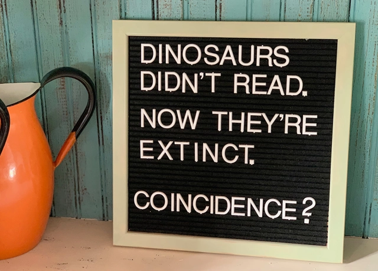

# Today's Agenda {background-image="Images/background-data_blue_v4.png"}

```{r}
library(tidyverse)
library(readxl)
library(modelr)
library(kableExtra)
#library(modelsummary)
#library(ggeffects)

load("../../DATA/2026-Spring/ANES/ANES2020_Data_Extract.RData")
```

<br>

::: {.r-fit-text}

**Correlation Analyses**

- Pearson's correlation, Phi coefficient, Spearman's rank

- New Notes: Correlation_Analysis.R

:::

<br>

::: r-stack
Justin Leinaweaver (Spring 2026)
:::

::: notes
Prep for Class

1. Print sheets for "best fit" line practice in class (one per student) AND rulers for all

    - Graph paper with axes printed on them so everyone using same reference points
    
    - Make sure to have enough paper for everyone to get a SECOND sheet for the homework
    
2. Bring rulers to class

3. AS STUDENTS COME IN give them graph paper and a ruler

4. Try to get through the correlation material quickly!
    
<br>

This week we begin our transition into one of the most useful and adaptable tools of quantitative research: ordinary least squares regression

- Today we'll focus on correlation analysis and then use that to set us up for regression on Wednesday

<br>

**SLIDE**: First of all, correlation gets an unfair bad wrap from morons...

:::


## Correlation Does Not Imply Causation {.center background-image="Images/background-data_blue_v4.png"}

```{r, fig.align='center'}

```

::: notes

Morons like me.

<br>

Now remember, we were being dismissive of correlation as a tool to establish causality

- e.g. arguing two things are associated is NOT an argument that one causes the other

- HOWEVER, as you have learned, establishing causality depends on the quality of your argument (and identification strategy) NOT on the type of statistic you use

<br>

Correlation is an incredibly useful tool for measuring the strength and direction of a relationship between two variables

- It only goes wrong when you forget that it is describing an association NOT a causal argument

<br>

I can measure your heights with a ruler and those measurements can be super useful

- If someone takes those measurements and makes an argument that the ruler caused your height I don't think we'd decide the ruler is useless

- We'd agree that person is confused and move on with our lives

<br>

Same thing with correlation!

- AND there are MANY good reasons to add correlation to your toolbox

<br>

**SLIDE**: Let's use Q1 from your assignment today to talk big picture

:::


## Textbook Question 1 {background-image="Images/background-data_blue_v4.png"}

<br>

::: {.r-fit-text}
**What is correlation analysis and when is it useful?**
:::

::: {.fragment}
{.absolute width="700" bottom=0 left=175}
:::

::: notes

The What: 

- The goal is to determine the strength and direction of an association between two interval-level variables WITHOUT assuming a causal relationship

<br>

The Why:

- It is simple

- It focuses on identifying patterns, and 

- It does not impose a causal structure.

<br>

**REVEAL** Example: 

- Is time spent exercising associated with greater life satisfaction?

- Causal arrow could go either way, but correlation can tell us if they are actually associated

<br>

**SLIDE**: And regression analysis?

:::


## Textbook Question 1 {background-image="Images/background-data_blue_v4.png" .center}

<br>

::: {.r-fit-text}
**What is regression analysis and when is it useful?**
:::

::::: {.fragment}

:::: {.columns}
::: {.column width="50%"}

:::

::: {.column width="50%"}

:::
::::

:::::

::: notes

The What: 

- (The goal is to estimate the effect of an independent variable on a dependent variable WHILE assuming a causal relationship)

<br>

The Why:

- It allows you to do predictive modeling (e.g. will these two countries go to war?)

- It allows you to do inferential statistics (e.g. test null hypotheses)

- It provides measures of both significance and magnitude of relationships

<br>

**REVEAL** Example: 

- Does adding a single daily jog to our daily routine impact our level of personal happiness?

- How much does exercise precisely impact happiness?

- How confident are we in this mechanism?

<br>

**SLIDE**: Let's kick off our week on regression by zooming in briefly on correlation

:::


## {background-image="Images/background-data_blue_v4.png" .center}

$$ \text{Pearson's } r = \frac{\Sigma(\frac{x_i - \bar{x}}{s_x}) (\frac{y_i - \bar{y}}{s_y})}{n-1} $$

```{r, fig.align = 'center', fig.asp = .618, fig.width = 9}
## Show correlations
cor_examples <- function(sd) {
    tibble(
    x = rnorm(50, mean = 8, sd = 2),
    y = x + rnorm(50, 0, sd),
    Group = str_c("Correlation: ", round(cor(x, y), 2))
    )
}

# Show inverse correlations
inv_cor_examples <- function(sd) {
    tibble(
    x = rnorm(50, mean = 8, sd = 2),
    y = -2 * x + rnorm(50, 0, sd),
    Group = str_c("Correlation: ", round(cor(x, y), 2))
    )
}

# Generate sims
set.seed(54)
rbind(cor_examples(1),
      cor_examples(3),
      cor_examples(18),
      inv_cor_examples(2),
      inv_cor_examples(6),
      inv_cor_examples(11)) |>
ggplot(aes(x = x, y = y)) +
    geom_point() +
    geom_smooth(method = "lm", se = FALSE) +
    theme_bw() +
  labs(x = "", y = "") +
    facet_wrap(~Group, scales = "free")
```

::: notes

Here is the formula for calculating Pearson's correlation coefficient AND some example correlations like those you drew by hand before class

- As you all noted, the closer the correlation to the extremes (1 or -1) the tighter the observations around the line

- Correlation values closer to zero shows less of a linear relationship between the x and y

<br>

**What are the specific components of this formula that we've seen already in our work building up to this point?**

- **What do you recognize in the formula?**

<br>

- Each variable, x and y, only appear in the numerator

    - Unlike out others, this formula includes both instead of just one
    
- Each variable is transformed into its z-score (e.g. centered and divided by the SD)

    - So, each X and Y is transformed into its distance away from the mean and measured in SD units

- Finally, the denominator is adjusted for the degrees of freedom like we have seen in so many other formulas

<br>

So, correlation standardizes two variables and then measures how often they move in tandem in the data

- In other words, when X is bigger than the mean and far away does y also look like an extreme value? If so, correlated!

<br>

**SLIDE**: Let's step through an example using the ANES data to illustrate the intuitions and learn the R code

:::


## {background-image="Images/background-data_blue_v4.png" .center}


::: notes

**If you had to guess, would you suspect that approval of Trump and Biden are correlated?**

- **If yes, positively or negatively?**

<br>

- (Strongly negative, right?)

- e.g. Strong supporters of Trump will almost certainly disapprove of Biden and vice versa

<br>

**SLIDE**: Let's check

:::


## {background-image="Images/background-data_blue_v4.png" .center}

```{r, echo=TRUE}
# Focus the dataset and remove missing
anes2 <- select(anes, ft.trump.post, ft.biden.post) |>
  na.omit()

# Look at the first 10 respondents
slice_head(anes2, n = 10)
```

::: notes

Here I am creating a subset of the ANES dataset with only two variables: approval of Trump and approval of Biden

- I am then removing any observation with missing data in one or the other variable

<br>

**Take a look at the first ten respondents and tell me what you see when comparing their measures of approval to the two candidates**

- (Looks like a VERY strong negative correlation!)

<br>

The first person loves Trump the most and hates Biden completely and the second person seems to dislike both of them

- **SLIDE**: Let's step through the Pearson's correlation formula for two types of respondent

:::


## {background-image="Images/background-data_blue_v4.png" .center}

$$ \text{Pearson's } r = \frac{\Sigma(\frac{x_i - \bar{x}}{s_x}) (\frac{y_i - \bar{y}}{s_y})}{n-1} $$

<br>

**Person 1: Trump 100, Biden 0**

$$ \frac{100 - 38}{40} \times \frac{0 - 53}{35} = 1.55 \times -1.51 = -2.34$$

::: notes

We'll use these hypothetical respondents to focus just on the numerator

- I want you to see how each respondent contributes to the association

<br>

Person 1 loves Trump and hates Biden

- Here you see that this puts him far away from the mean score of each candidate

- Specifically, respondent 1 loves Trump 1.55 SDs above the mean and hates Biden 1.51 SDs below the mean

- **Make sense?**

<br>

**SLIDE**: Respondent 2

:::


## {background-image="Images/background-data_blue_v4.png" .center}

$$ \text{Pearson's } r = \frac{\Sigma(\frac{x_i - \bar{x}}{s_x}) (\frac{y_i - \bar{y}}{s_y})}{n-1} $$

<br>

**Person 1: Trump 100, Biden 0**

$$ \frac{100 - 38}{40} \times \frac{0 - 53}{35} = 1.55 \times -1.51 = -2.34$$
**Person 2: Trump 50, Biden 50**

$$ \frac{50 - 38}{40} \times \frac{50 - 53}{35} = .3 \times -.09 = -0.03$$

::: notes

And how about an independent respondent?

- This respondent gives both candidates a "meh" of 50

- Since 50 is close to both of their averages this person adds very little to moving the r coefficient

- **Make sense**

<br>

If you do this for all 7,400 respondents and add together their scores then divide by the sample size minus 1 you get Pearson's r coefficient

- **SLIDE**: Let's have R do this for us!

:::


## {background-image="Images/background-data_blue_v4.png" .center}

$$ \text{Pearson's } r = \frac{\Sigma(\frac{x_i - \bar{x}}{s_x}) (\frac{y_i - \bar{y}}{s_y})}{n-1} $$

<br>

cor(x, y, method)

- "x" is variable 1

- "y" is variable 2

- "method" can be "pearson" or "spearman"

::: notes

Save these notes!

- *Step through the slide*

<br>

Remember from the textbook

- IFF the two variables are interval then use pearson

- IFF the two variables are ordinal, convert them into numbers and use spearman

<br>

**SLIDE**: To the example!

:::


## The Negative Correlation Between Trump and Biden Approval {background-image="Images/background-data_blue_v4.png" .center}

<br>

$$ \text{Pearson's } r = \frac{\Sigma(\frac{x_i - \bar{x}}{s_x}) (\frac{y_i - \bar{y}}{s_y})}{n-1} $$

```{r, echo=TRUE}
# Pearson's correlation
cor(x = anes2$ft.trump.post, 
    y = anes2$ft.biden.post, 
    method = "pearson")
```

::: notes

**Everybody get this code to work?**

<br>

**Remind me, what does this mean about the association between these measures?**

<br>

**Questions on correlation?**

- Remember, we use the Pearson correlation coefficient when examining the association between TWO INTERVAL VARIABLES only

<br>

The textbook also walked you through the Spearman coefficient and the Phi coefficient

- These just don't come up very often in political science and, when they do, we simply model them with regressions

- So, let's save those relationships for OLS

<br>

**SLIDE**: Alright, let's use this to transition into regression analysis

:::


## The Intuitions of OLS Regression {background-image="Images/background-data_blue_v4.png" .center}

1. Take a piece of prepared graph paper and a ruler

2. Draw a y-axis (1-7) and an x-axis (1-9)

3. Plot the following (X, Y) coordinates

| X | Y |
|---|---|
|2|3|
|3|2|
|4|4|
|5|3|
|6|5|

::: notes

*Distribute paper and rulers*

<br>

My advice:

1. Do your own page, BUT help each other

2. Remember the old advice: measure twice, cut once

    - Use a pencil and THINK before you mark the paper!

<br>

**SLIDE**: The set-up

:::


## {background-image="Images/background-data_blue_v4.png" .center}

```{r, fig.retina=3, fig.asp=.65, fig.align='center', fig.width = 7}
d_test <- tibble(
  x1 = c(2, 3, 4, 5, 6),
  y1 = c(3, 2, 4, 3, 5)
)

d_test |>
  ggplot(aes(x = x1, y = y1)) + 
  geom_point(size = 3) +
  scale_x_continuous(limits = c(.4, 9), breaks = 1:9) +
  scale_y_continuous(limits = c(.4, 7), breaks = 1:7) +
  theme_bw() +
  labs(x = "Predictor Variable (X)", y = "Outcome Variable (Y)")
```

::: notes

**Everybody have this?**

<br>

**As a correlation is this likely positive or negative?**

<br>

**Is it close or far from "1"? Why?**

<br>

Simple OLS regression is a bivariate tool meant to help us describe the relationship between two variables USING A LINE

- **SLIDE**: p288 gives you the formula for a line

:::


## {background-image="Images/background-data_blue_v4.png" .center}

::: {.r-fit-text}

**The Regression Formula for a Line**

$$ y = \alpha + \beta (x) $$

:::

::: notes

You need to memorize and understand this formula DEEPLY in order to use regression analysis

- You may have learned this formula in math as y = mx + c

- It's the same thing but in stats we use the alpha and beta version here

- Unless you are a math major, memorize this one

<br>

So, regression generates a line that summarizes the relationship between two or more variables

- This line version of a summary is incredibly useful because it allows us to ask directional questions

- The regression line directly estimates how changes in X, the predictor, are associated with changes in Y, the outcome.

<br>

I think the best way to approach this is to draw some lines by hand and interpret them

<br>

**SLIDE**: Let's take a step back now and focus just on Y for a moment

:::


## The Outcome to be Explained {background-image="Images/background-data_blue_v4.png" .center}


<br>

:::: {.columns}

::: {.column width="20%"}

:::

::: {.column width="30%"}

| Y |
|---|
|3|
|2|
|4|
|3|
|5|

:::

::: {.column width="50%"}


:::

::::

::: notes

Imagine each of these five observations is written on a small ball and placed into a bag.

- In a moment you will reach your hand in the bag and pull out one of the balls.

<br>

**What is your best guess for the value of the ball you will pull out? Why?**

- (Probability: 2/5 balls are "3" so that's a 40% chance vs 1/5 for "2", "4" and "5" or a 20% chance)

- (Median: 3)

- (Mean: 3.4)

<br>

Certainly seems like a bunch of reasons to predict the number 3!

- SO, if you had NO other information about the bag or the balls themselves, three seems like a good guess

<br>

**SLIDE**: Let's go back to our plot

:::


## {background-image="Images/background-data_blue_v4.png" .center}

::: {.r-fit-text}
**Relationship Summary 1: Ignoring the X variable**
:::

```{r, fig.retina=3, fig.asp=.65, fig.align='center', fig.width = 7, cache=TRUE}
d_test |>
  ggplot(aes(x = x1, y = y1)) + 
  geom_point(size = 3) +
  scale_x_continuous(limits = c(.4, 9), breaks = 1:9) +
  scale_y_continuous(limits = c(.4, 7), breaks = 1:7) +
  theme_bw() +
  labs(x = "Predictor Variable (X)", y = "Outcome Variable (Y)") +
  annotate("text", x = 1, y = 6.5, hjust = 0, label = "Our 'Best' Guess = 3", size = 6, color = "darkblue")
```

::: notes

In a sense, this is our null hypothesis

- Meaning a prediction based on no information beyond the outcome variable

<br>

Everybody take a second and think about this for me before you say or draw anything.

- What would a line look like on your plot that predicts a Y value of 3 for EVERY value of X

- Put your ruler on your plot where you think the line would go

<br>

*Walk around and check them*

<br>

Ok, draw those lines!

<br>

**SLIDE**: represent using formula

:::


## {background-image="Images/background-data_blue_v4.png" .center}

::: {.r-fit-text}
**Relationship Summary 1: Ignoring the X variable**
:::

```{r, fig.retina=3, fig.asp=.65, fig.align='center', fig.width = 7, cache=TRUE}
d_test |>
  ggplot(aes(x = x1, y = y1)) + 
  geom_point(size = 3) +
  scale_x_continuous(limits = c(.4, 9), breaks = 1:9) +
  scale_y_continuous(limits = c(.4, 7), breaks = 1:7) +
  theme_bw() +
  labs(x = "Predictor Variable (X)", y = "Outcome Variable (Y)") +
  annotate("text", x = 1, y = 6.5, hjust = 0, label = "Formula for a Line: Y = \U03B1 + \U03B2 X", size = 6, color = "darkblue") +
  geom_hline(yintercept = 3, color = "darkblue")
```

::: notes

**Everybody has this line drawn, yes?**

<br>

Now take a second and think about this for me before you say anything.

- **What is the formula for this line?**

- **In other words, a line that predicts the outcome will be 3 NO MATTER the value of X**

- Don't say it out loud, just write it down

<br>

(**SLIDE**)

:::


## {background-image="Images/background-data_blue_v4.png" .center}

::: {.r-fit-text}
**Relationship Summary 1: Ignoring the X variable**
:::

```{r, fig.retina=3, fig.asp=.65, fig.align='center', fig.width = 8, cache=TRUE}
d_test |>
  ggplot(aes(x = x1, y = y1)) + 
  geom_point(size = 3) +
  scale_x_continuous(limits = c(.4, 9), breaks = 1:9) +
  scale_y_continuous(limits = c(.4, 7), breaks = 1:7) +
  theme_bw() +
  labs(x = "Predictor Variable (X)", y = "Outcome Variable (Y)") +
  geom_hline(yintercept = 3, color = "darkblue") +
  annotate("text", x = 1, y = 6.5, hjust = 0, label = "Y = \U03B1 + \U03B2 X", size = 7, color = "darkblue") +
  annotate("text", x = 1, y = 5.5, hjust = 0, label = "Y = 3 + 0X", size = 7, color = "darkblue")
```

::: notes

**Everybody comfortable matching this formula to this line?**

- **Why is the alpha set to 3?** 

    - (The y-intercept of the line)

- **Why is the beta set to zero?** 

    - (The slope of the line does not increase or decrease)

<br>

Alright, let's use this summary of the relationship to make predictions!

- **Use some basic algebra to tell me, if X = 4 then what is your prediction for Y?** (3!)

- **And if X = 150 million, what is your prediction for Y?** (3!)

- Just checking...

<br>

Before we use this regression line as an answer to any question, we need to evaluate how well it fits the data

- Let's start with just your sense of this.

- **In what ways is this a "good" fit and in what ways a "bad" fit?**

<br>

The first MASSIVE problem with this summary of the relationship is that it makes NO attempt to model the actual relationship!

- This line completely ignores all the information in X!

- As an answer to the question, does X explain the variation in Y this is not getting the job done.

<br>

**SLIDE**: Second big problem

:::


## {background-image="Images/background-data_blue_v4.png" .center}

::: {.r-fit-text}
**Relationship Summary 1: Ignoring the X variable**
:::

```{r, fig.retina=3, fig.asp=.65, fig.align='center', fig.width = 8, cache=TRUE}
d_test |>
  ggplot(aes(x = x1, y = y1)) + 
  annotate("rect", xmin = 0.5, xmax = 9, ymin = 2, ymax = 5, alpha = .3, fill = "darkgreen") +
  geom_point(size = 3) +
  scale_x_continuous(limits = c(.4, 9), breaks = 1:9) +
  scale_y_continuous(limits = c(.4, 7), breaks = 1:7) +
  theme_bw() +
  labs(x = "Predictor Variable (X)", y = "Outcome Variable (Y)") +
  geom_hline(yintercept = 3, color = "darkblue") +
  annotate("text", x = 1, y = 6.5, hjust = 0, label = "Y = \U03B1 + \U03B2 X", size = 7, color = "darkblue") +
  annotate("text", x = 1, y = 5.5, hjust = 0, label = "Y = 3 + 0X", size = 7, color = "darkblue") +
  annotate("segment", x = 8, xend = 8, y = 2, yend = 5, arrow = arrow(ends = "both"), color = "darkgreen", linewidth = 1.5)
```

::: notes

The second MASSIVE problem with this summary of the relationship is, in reality, Y varies from two up to five but our line only ever predicts 3

- This means our summary line is incredibly unhelpful in achieving the main purpose of explaining the outcome

<br>

**Do these two problems with this line make sense at an intuitive level?**

<br>

**SLIDE**: Let's try to actually measure the error in this summary line

:::


## {background-image="Images/background-data_blue_v4.png" .center}

::: {.r-fit-text}
**Relationship Summary 1: Ignoring the X variable**
:::

```{r, fig.retina=3, fig.asp=.65, fig.align='center', fig.width = 8, cache=TRUE}
d_test2 <- d_test |>
  mutate(
    pred = 3,
    residual = pred - y1
  )

d_test2 |>
  ggplot(aes(x = x1, y = y1)) + 
  geom_point(size = 3) +
  scale_x_continuous(limits = c(.4, 9), breaks = 1:9) +
  scale_y_continuous(limits = c(.4, 7), breaks = 1:7) +
  theme_bw() +
  labs(x = "Predictor Variable (X)", y = "Outcome Variable (Y)") +
  geom_hline(yintercept = 3, color = "darkblue") +
  annotate("text", x = 1, y = 6.5, hjust = 0, label = "Y = \U03B1 + \U03B2 X", size = 7, color = "darkblue") +
  annotate("text", x = 1, y = 5.5, hjust = 0, label = "Y = 3 + 0X", size = 7, color = "darkblue") +
  annotate("segment", x = d_test2$x1, xend = d_test2$x1, y = d_test2$y1, yend = d_test2$pred, color = "red")
```

::: notes

The "error" here is how far off our summary line is from the actual outcomes we are interested in explaining.

- We call these the residuals

- The higher the error, the worse the line fits the data

- **Make sense?**

<br>

Everybody use your graph paper and ruler to measure these five residuals in inches

- Since we're on the lines this should be easy, right?

<br>

(**SLIDE**)

:::


## {background-image="Images/background-data_blue_v4.png" .center}

::: {.r-fit-text}
**Relationship Summary 1: Ignoring the X variable**
:::

```{r, fig.retina=3, fig.asp=.65, fig.align='center', fig.width = 8, cache=TRUE}
d_test2 |>
  ggplot(aes(x = x1, y = y1)) + 
  geom_point(size = 3) +
  scale_x_continuous(limits = c(.4, 9), breaks = 1:9) +
  scale_y_continuous(limits = c(.4, 7), breaks = 1:7) +
  theme_bw() +
  labs(x = "Predictor Variable (X)", y = "Outcome Variable (Y)") +
  geom_hline(yintercept = 3, color = "darkblue") +
  annotate("text", x = 1, y = 6.5, hjust = 0, label = "Y = \U03B1 + \U03B2 X", size = 7, color = "darkblue") +
  annotate("text", x = 1, y = 5.5, hjust = 0, label = "Y = 3 + 0X", size = 7, color = "darkblue") +
  annotate("segment", x = d_test2$x1, xend = d_test2$x1, y = d_test2$y1, yend = d_test2$pred, color = "red") +
  annotate("text", x = 1.7:5.7, y = c(2.8, 2.5, 3.5, 2.8, 4), label = d_test2$residual, color = "red")
```

::: notes

**Everybody come close to these?**

<br>

To caluclate the "error" in the line we're going to add all of these up AFTER we square them

- **Remind me, why do we square the residuals before adding them?**

- (We square the residuals so the negative and positive values don't erase each other)

<br>

**SLIDE**: And here is the sum of squared residuals

:::


## {background-image="Images/background-data_blue_v4.png" .center}

::: {.r-fit-text}
**Relationship Summary 1: Ignoring the X variable**
:::

```{r, fig.retina=3, fig.asp=.65, fig.align='center', fig.width = 8, cache=TRUE}
d_test2 |>
  ggplot(aes(x = x1, y = y1)) + 
  geom_point(size = 3) +
  scale_x_continuous(limits = c(.4, 9), breaks = 1:9) +
  scale_y_continuous(limits = c(.4, 7), breaks = 1:7) +
  theme_bw() +
  labs(x = "Predictor Variable (X)", y = "Outcome Variable (Y)") +
  geom_hline(yintercept = 3, color = "darkblue") +
  annotate("text", x = 1, y = 6.5, hjust = 0, label = "Y = \U03B1 + \U03B2 X", size = 7, color = "darkblue") +
  annotate("text", x = 1, y = 5.5, hjust = 0, label = "Y = 3 + 0X", size = 7, color = "darkblue") +
  annotate("segment", x = d_test2$x1, xend = d_test2$x1, y = d_test2$y1, yend = d_test2$pred, color = "red") +
  annotate("text", x = 1.7:5.7, y = c(2.8, 2.5, 3.5, 2.8, 4), label = d_test2$residual, color = "red") +
  annotate("text", x = 1, y = 1, hjust = 0, label = "RSS = 0\U00B2 + 1\U00B2 + -1\U00B2 + 0\U00B2 + -2\U00B2 = 6", color = "red", size = 7)
```

::: notes

The sum of squared residuals is also known as the RSS or Residual Sum of Squares

- `r sum((d_test2$residual)^2)`

<br>

We will primarily use the RSS to compare different lines to each other

- Generally speaking we prefer regression lines with less error to those with more error

- HOWEVER, in an absolute sense this value of "6" doesn't hold a lot of meaning

<br>

The other thing we check for with the errors is if we see any patterns to them

- In this case, there are more errors above the line than below, AND

- The errors above the line are bigger than those below

- This tells me we should be able to draw a line that fits this data better!

<br>

**How are we doing so far? Any questions?**

<br>

**SLIDE**: Alright let's practice all of this and generate a better summary line!

:::


## {background-image="Images/background-data_blue_v4.png" .center}

::: {.r-fit-text}
**Relationship Summary 2: Adapt the line for two observations**
:::

```{r, fig.retina=3, fig.asp=.65, fig.align='center', fig.width = 8, cache=TRUE}
d_test2 |>
  ggplot(aes(x = x1, y = y1)) + 
  geom_point(size = 3) +
  scale_x_continuous(limits = c(.4, 9), breaks = 1:9) +
  scale_y_continuous(limits = c(.4, 7), breaks = 1:7) +
  theme_bw() +
  labs(x = "Predictor Variable (X)", y = "Outcome Variable (Y)") +
  annotate("point", x = c(3,5), y = c(2,3), color = "red", size = 3)
```

::: notes

Let's summarize this relationship again but now we add some of the information in X

- To start we'll consider some of the information provided by the X variable

- Everybody use your ruler to draw a straight line through these two observations (Points: 3,2 and 5,3)

<br>

**SLIDE**: Result and assignment

:::


## {background-image="Images/background-data_blue_v4.png" .center}

::: {.r-fit-text}
**Relationship Summary 2: Adapt the line for two observations**
:::

```{r, fig.retina=3, fig.asp=.65, fig.align='center', fig.width = 8}
d3 <- tibble(
  x1 = c(3, 5),
  y1 = c(2, 3)
)

res1 <- lm(data = d3, y1 ~ x1)

d_test2 |>
  ggplot(aes(x = x1, y = y1)) + 
  geom_point(size = 3) +
  scale_x_continuous(limits = c(.4, 9), breaks = 1:9) +
  scale_y_continuous(limits = c(.4, 7), breaks = 1:7) +
  theme_bw() +
  labs(x = "Predictor Variable (X)", y = "Outcome Variable (Y)") +
  annotate("point", x = c(3,5), y = c(2,3), color = "red", size = 3) +
  geom_abline(slope = res1$coefficients[2], intercept = res1$coefficients[1], color = "darkblue") +
  annotate("text", x = .5, y = 6.5, hjust = 0, label = "Formula for a Line: Y = \U03B1 + \U03B2 X", size = 7, color = "darkblue")
```

::: notes

**Did everybody draw this line?**

<br>

**Alright, everybody convert this line into the formula for a line**

- Remember the alpha is the y-intercept, and

- The beta is the rise/run or the change in y divided by the change in x between any two points

<br>

(**SLIDE**)

:::


## {background-image="Images/background-data_blue_v4.png" .center}

::: {.r-fit-text}
**Relationship Summary 2: Adapt the line for two observations**
:::

```{r, fig.retina=3, fig.asp=.65, fig.align='center', fig.width = 8, cache=TRUE}
d_test2 |>
  ggplot(aes(x = x1, y = y1)) + 
  geom_point(size = 3) +
  scale_x_continuous(limits = c(.4, 9), breaks = 1:9) +
  scale_y_continuous(limits = c(.4, 7), breaks = 1:7) +
  theme_bw() +
  labs(x = "Predictor Variable (X)", y = "Outcome Variable (Y)") +
  annotate("point", x = c(3,5), y = c(2,3), color = "red", size = 3) +
  geom_abline(slope = res1$coefficients[2], intercept = res1$coefficients[1], color = "darkblue") +
  annotate("text", x = .5, y = 6.5, hjust = 0, label = "Y = 0.5 + 0.5 X", size = 9, color = "darkblue")
```

::: notes

**Did everybody get this formula?**

- **Why is the alpha 0.5?**

- **Why is the beta 0.5?**

<br>

Let's now use this line to make predictions

<br>

**What does our line predict is the value of Y when X = 1?**

- (x = 1 then y = 1)

<br>

**What does our line predict is the value of Y when X = 7?**

- (x = 7 then y = 4)

<br>

So, that's our new summary of this relationship.

- Now I want each of you to evaluate how well this line fits the data

- Calculate the residual sum of squares and evaluate the line

- Go!

:::


## {background-image="Images/background-data_blue_v4.png" .center}

::: {.r-fit-text}
**Relationship Summary 2: Adapt the line for two observations**
:::

```{r, fig.retina=3, fig.asp=.65, fig.align='center', fig.width = 8, cache=TRUE}
d_test3 <- d_test |>
  add_predictions(res1) |>
  add_residuals(res1)

d_test3 |>
  ggplot(aes(x = x1, y = y1)) + 
  geom_point(size = 3) +
  scale_x_continuous(limits = c(.4, 9), breaks = 1:9) +
  scale_y_continuous(limits = c(.4, 7), breaks = 1:7) +
  theme_bw() +
  labs(x = "Predictor Variable (X)", y = "Outcome Variable (Y)") +
  annotate("point", x = c(3,5), y = c(2,3), color = "red", size = 3) +
  geom_abline(slope = res1$coefficients[2], intercept = res1$coefficients[1], color = "darkblue") +
  annotate("text", x = .5, y = 6.5, hjust = 0, label = "Y = 0.5 + 0.5 X", size = 8, color = "darkblue") +
  annotate("segment", x = 2:6, xend = 2:6, y = d_test3$y1, yend = d_test3$pred, color = "red") +
  annotate("text", x = 1.7:5.7, y = c(2.2, 1.5, 3.2, 2.5, 4.25), label = round(d_test3$resid, 1), color = "red") +
  annotate("text", x = .5, y = 5.5, hjust = 0, label = "RSS = 6.75", size = 8, color = "red")
```

::: notes

**Ok, is this line a better summary of the relationship between X and Y than our null hypothesis prediction?**

<br>

Pro:

- Actually predicts values of Y across the actual range (2-5)!

- Includes more information from the world (two observations of X)

Cons:

- RSS is higher (6.75 > 6)

- Almost all of the errors are above the line (bad pattern)

<br>

**Ok, check in, how are we doing?**

<br>

**SLIDE**: Let's do it again!

:::


## {background-image="Images/background-data_blue_v4.png" .center}

::: {.r-fit-text}
**Relationship Summary 3: Adapt the line for three observations**
:::

```{r, fig.retina=3, fig.asp=.65, fig.align='center', fig.width = 8}
d4 <- tibble(
  x1 = c(2,4,6),
  y1 = c(3,4,5)
)

res2 <- lm(data = d4, y1 ~ x1)

d_test2 |>
  ggplot(aes(x = x1, y = y1)) + 
  geom_point(size = 3) +
  scale_x_continuous(limits = c(.4, 9), breaks = 1:9) +
  scale_y_continuous(limits = c(.4, 7), breaks = 1:7) +
  theme_bw() +
  labs(x = "Predictor Variable (X)", y = "Outcome Variable (Y)") +
  annotate("point", x = c(2,4,6), y = c(3,4,5), color = "red", size = 3) +
  geom_abline(slope = res2$coefficients[2], intercept = res2$coefficients[1], color = "darkblue") +
  annotate("text", x = .5, y = 6.5, hjust = 0, label = "Formula for a Line: Y = \U03B1 + \U03B2 X", size = 7, color = "darkblue")
```

::: notes

Alright, draw a new line through these three observations then evaluate this line as a summary of the relationship

- Estimate the formula and evaluate the line

- Go!

<br>

(**SLIDE**)

:::


## {background-image="Images/background-data_blue_v4.png" .center}

::: {.r-fit-text}
**Relationship Summary 3: Adapt the line for three observations**
:::

```{r, fig.retina=3, fig.asp=.65, fig.align='center', fig.width = 8}
d_test4 <- d_test |>
  add_predictions(res2) |>
  add_residuals(res2)

d_test4 |>
  ggplot(aes(x = x1, y = y1)) + 
  geom_point(size = 3) +
  scale_x_continuous(limits = c(.4, 9), breaks = 1:9) +
  scale_y_continuous(limits = c(.4, 7), breaks = 1:7) +
  theme_bw() +
  labs(x = "Predictor Variable (X)", y = "Outcome Variable (Y)") +
  annotate("point", x = c(2,4,6), y = c(3,4,5), color = "red", size = 3) +
  geom_abline(slope = res2$coefficients[2], intercept = res2$coefficients[1], color = "darkblue") +
  annotate("text", x = .5, y = 6.5, hjust = 0, label = "Y = 2.0 + 0.5 X", size = 7, color = "darkblue") +
  annotate("segment", x = 2:6, xend = 2:6, y = d_test4$y1, yend = d_test4$pred, color = "red") +
  annotate("text", x = 1.7:5.7, y = c(2.4, 2.7, 3.5, 3.75, 4.4), label = round(d_test4$resid, 1), color = "red") +
  annotate("text", x = .5, y = 5.5, hjust = 0, label = "RSS = 4.5", size = 8, color = "red")
```

::: notes

**Ok, is this line a better summary of the relationship between X and Y than our prior two attempts?**

<br>

Pro:

- Actually predicts values of Y across the actual range (2-5)!

- Includes more information from the world (THREE observations of X)

- Lower RSS! (4.5 < 6 < 6.75)

Cons:

- Almost all of the errors are below the line (bad pattern)

<br>

**SLIDE**: For next class

:::


## For Next Class {background-image="Images/background-data_blue_v4.png" .center}

<br>

:::: {.columns}

::: {.column width="65%"}

1. Finish Chapter 11

2. Submit Exercise 3

3. Submit your line of best fit BY HAND (new data on Canvas)

    i. Draw it
    ii. Estimate the line
    iii. Calculate the RSS
:::

::: {.column width="5%"}

:::

::: {.column width="30%"}

| X | Y |
|---|---|
|1|2|
|2|4|
|3|4|
|4|3|
|5|5|
|5|6|


```{r, fig.asp=1, fig.align='center', fig.width = 5, eval=FALSE}
d_homework <- tribble(
  ~x1, ~y1,
  1,2,
  2,4,
  3,4,
  4,3,
  5,5,
  5,6
)

lm(data = d_homework, y1 ~ x1) |> summary()

d_homework |>
  ggplot(aes(x = x1, y = y1)) + 
  geom_point(size = 3) +
  scale_x_continuous(limits = c(.4, 9), breaks = 1:9) +
  scale_y_continuous(limits = c(.4, 7), breaks = 1:7) +
  theme_bw() +
  labs(x = "Predictor Variable (X)", y = "Outcome Variable (Y)",
       title = "Assignment: Draw your line of best fit by hand")
```
:::

::::

::: notes

**Questions on the assignment?**

<br>

Canvas Assignment: Chapter 11 Assessment (II)

1. Read the rest of Chapter 11

2. Submit your answers to Exercise 3 on p305-306

3. Estimating a line of best fit by hand: Use a ruler to hand draw a line of best fit to the data we've been working on in class. Submit the formula for a line that represents your hand drawn line and give us your estimate of the sum of squared error for this line.
    - Remember the points on the plot should be: (2,3), (3,2), (4,4), (5,3), (6,5)

:::