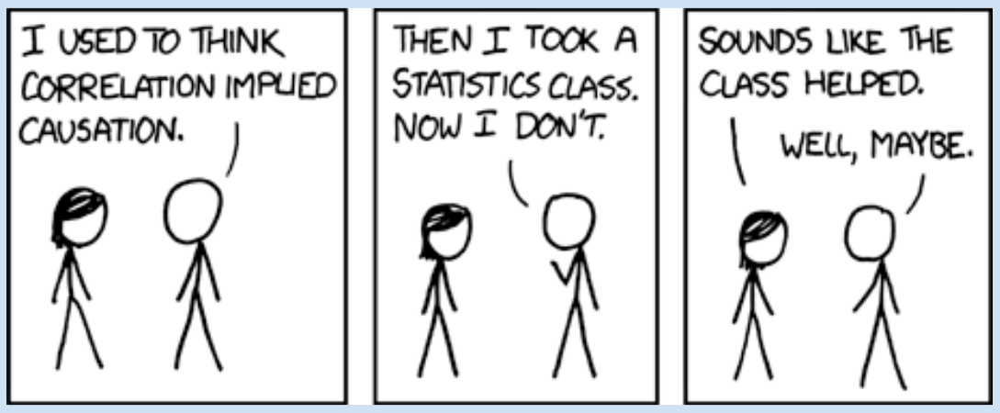
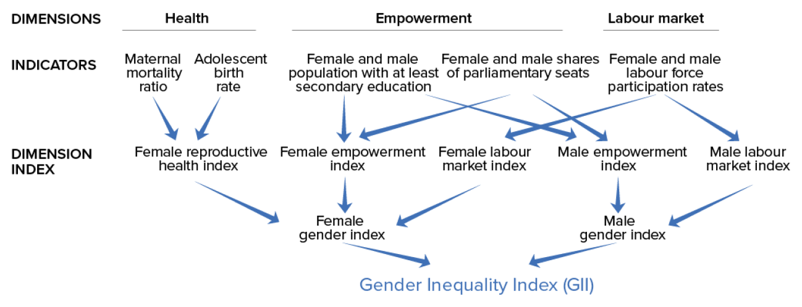
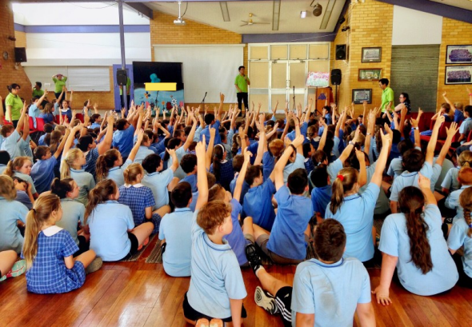
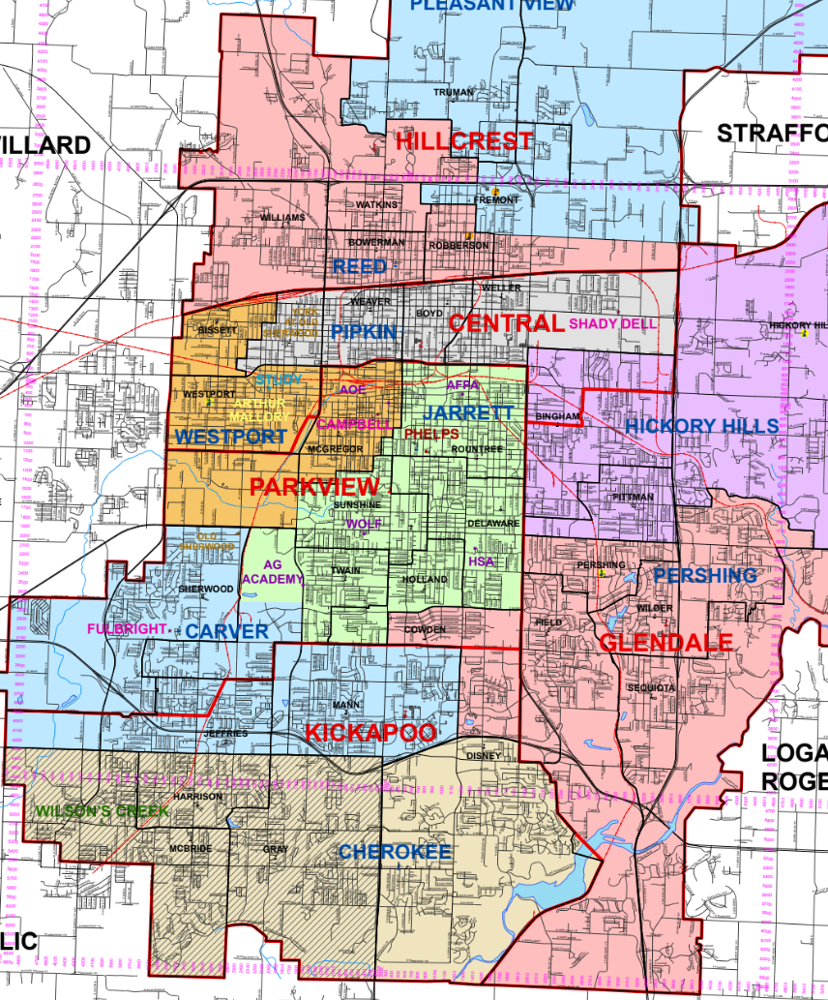
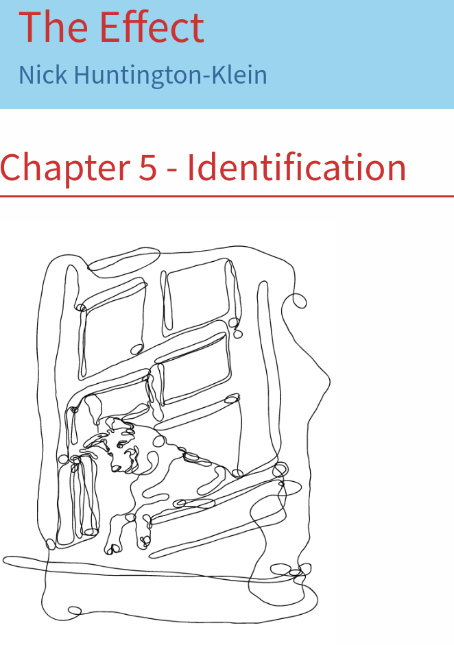
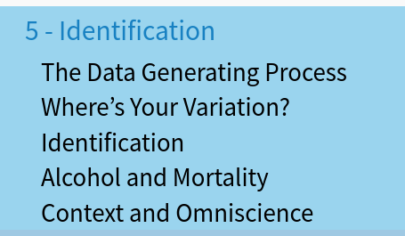

---
output:
  xaringan::moon_reader:
    css: ["default", "extra.css"]
    lib_dir: libs
    seal: false
    nature:
      highlightStyle: github
      highlightLines: true
      countIncrementalSlides: false
      ratio: '16:9'
---

```{r, echo = FALSE, warning = FALSE, message = FALSE}
##xaringan::inf_mr()
## For offline work: https://bookdown.org/yihui/rmarkdown/some-tips.html#working-offline
## Images not appearing? Put images folder inside the libs folder as that is the main data directory

library(tidyverse)
library(readxl)
library(stargazer)
library(kableExtra)
##library(modelr)

knitr::opts_chunk$set(echo = FALSE,
                      eval = TRUE,
                      error = FALSE,
                      message = FALSE,
                      warning = FALSE,
                      comment = NA)
```

background-image: url('libs/Images/background-blue_cubes_lighter3.png')
background-size: 100%
background-position: center

.size80[**Today's Agenda**]

<br>

.size50[
Thinking Carefully About Causal Inference

- The Data Generating Process (DGP)

- An Identification Strategy
]

<br>

.center[.size40[
  Justin Leinaweaver (Spring 2024)
]]

???

## Prep for Class
1. Save brainstormed lists in this Rmd file AND next class

<br>

Reading: Huntington-Klein (2022) Chapter 5 [LINK](https://theeffectbook.net/ch-Identification.html)

<br>

This week I want us to explore causal inference.

- What does it mean to establish causality with an argument and data?

- How do we start to build this argument in our project this semester?


---

background-image: url('libs/Images/background-blue_cubes_lighter3.png')
background-size: 100%
background-position: center
class: center, middle
  
.size50[**Correlation Does Not Imply Causation (???)**]

<br>

```{r, fig.retina=3, out.width='75%'}

```

???

You've all probably heard the old saw, "correlation does not imply causation."

- But if that's true, then what does "imply" causation?

- In other words, how do we make a convincing argument that changes in our predictor variable cause changes in our outcome variable?

<br>

To do this I want us to take a proverbial step back from the work we've been doing all semester.

- We need to start our exploration of causal inference by talking about where data comes from.


---

background-image: url('libs/Images/background-blue_cubes_lighter3.png')
background-size: 100%
background-position: center
class: middle

.center[.size50[.content-box-blue[**Exploratory (aka Descriptive) Data Analyses**]]]

<br>

.size25[
```{r}
# GII Data
d <- read_excel("../Project-SP23/OUTCOME-GII/GII-2021-Tidy.xlsx", na = "NA")

d |>
  select(country, year, gii:lfpr_m) |>
  slice_head(n = 9) |>
  kbl(digits = 2)
```
]

???

So far this semester we have been engaged in what might be called an exploratory or descriptive analysis process

- In short, I gave you data (gathered by someone else) and you used it to tell me about the world FROM THE PERSPECTIVE OF THAT DATA.

<br>

**SLIDE**: Our approach to this task followed three general steps


---

class: middle

.center[.size55[.content-box-blue[**1. Analyzed the Methodology**]]]

<br>

```{r, echo = FALSE, fig.align = 'center', out.width = '100%'}

```

???

First we analyzed the research design that produced these measures.

<br>

We evaluated:

1. The source(s) of the data,

2. How the concepts were operationalized,

3. The process by which those tools produced measurements, and

4. The data validation done by the researchers.

<br>

I hope everyone now better understands how THESE choices are far more impactful on the data than anything we might do using "statistics."


---

class: middle

.center[.size55[.content-box-blue[**2. Univariate Analyses of the  Distribution**]]]

<br>

.pull-left[
.size25[
```{r}
d <- read_excel("../Project-SP23/OUTCOME-GII/GII-2021-Tidy.xlsx", na = "NA")

d |>
  select(country, year, gii) |>
  slice_head(n = 10) |>
  kbl(digits = 2)
```
]]

.pull-right[
```{r, fig.retina=3, fig.align='center', fig.asp=1, fig.width=6, ,out.width='90%'}
d |>
  ggplot(aes(x = gii)) +
  geom_histogram(bins = 25, color = "white", fill = "thistle") +
  theme_bw() +
  labs(x = "Gender Inequality Index", y = "",
       caption = "Source: United Nations Development Programme",
       title = "Economic growth is being dramatically harmed by gender\n  discrimination across the world") +
  scale_x_continuous(limits = c(0,1))
```
]

???

Our second step was to use univariate analysis tools to describe the distribution of the data.

- Is there variation in the measures?
    - No variation, nothing to explain

- What is the shape or distribution of these measures?

<br>

As I hope was clear from the reading today, THIS step is vital for learning about the world

- THIS is the variation you want your model to explain!

- The whole ballgame of statistical modeling!


---

class: middle

.center[.size55[.content-box-blue[**3. Bivariate Analyses of the  Association**]]]

<br>

.pull-left[
.size25[
```{r}
d <- read_excel("../Project-SP23/Project_Merged_Data-2019.xlsx", na = "NA")

d |>
  select(country, year, gii, military) |>
  slice_head(n = 10) |>
  kbl(digits = 2, align = c("l", "c", "c", "c"))
```
]]

.pull-right[
```{r, fig.retina=3, fig.align='center', fig.asp=1, fig.width=7, ,out.width='90%'}
# Merged data


#cor(d$gii, d$military, use = "complete.obs")
#cor.test(d$gii, d$military, use = "complete.obs")
# cor(d$gii, d$education, use = "complete.obs")
# cor(d$gii, d$health, use = "complete.obs")

d |>
  ggplot(aes(x = military, y = gii)) +
  geom_point() +
  theme_bw() +
  geom_smooth(method = "lm") +
  labs(x = "Government Spending on the Military (% GDP)", y = "Gender Inequality Index",
       caption = "Source: United Nations Development Programme and the Stockholm International Peace Research Institute",
       title = "There is not a clear linear association between gender discrimination and\n  military spending",
       subtitle = str_c("(Pearson's Product-Moment Correlation: ", round(cor(d$gii, d$military, use = "complete.obs"), 2), ")")) +
  scale_y_continuous(limits = c(0, 1))
```
]

???

Our third step was to use bivariate analysis tools to describe the relationships between our predictors and the outcome variables.

- Bivariate tables, visualizations and simple OLS regressions

- HOWEVER, these are associations, not evidence of causation!


---

class: center, middle, slideblue

.size50[.content-box-blue[**Building a Causal Argument**]]

.size40[
"Causal inference refers to the process of drawing a conclusion that a specific treatment (i.e. intervention) was the 'cause' of the effect (or outcome) that was observed" (Frey 2018). 
]

```{r, fig.retina = 3, fig.align = 'center', fig.width = 6, fig.height=1.25, out.width='95%'}
## Manual DAG
d1 <- tibble(
  x = c(-3, 3),
  y = c(1, 1),
  labels = c("Treatment", "Effect")
)

ggplot(data = d1, aes(x = x, y = y)) +
  geom_point(size = 8) +
  theme_void() +
  coord_cartesian(xlim = c(-4, 4)) +
  geom_label(aes(label = labels), size = 7) +
  annotate("segment", x = -1.9, xend = 2.2, y = 1, yend = 1, arrow = arrow())
```

???

Our final job this semester is to try and push beyond demonstrating associations or correlations.

<br>

Our aim is explanatory or causal analysis

- e.g. making an argument with data about why the world works like it does.

- In other words, we want to demonstrate that changes in our chosen predictors CAUSE a change in the outcome variable

<br>

To be clear, a "causal relationship" refers to a cause-and-effect connection between a predictor variable and an outcome.

- Much of this language comes from medicine where they focus on treatments and effects
    - Think new medicines and curing a disease
  
- For our purposes think of treatment to effect as synonymous with predictor to outcome.


---

background-image: url('libs/Images/background-blue_cubes_lighter3.png')
background-size: 100%
background-position: center
class: middle

.center[.size50[.content-box-blue[**Building a Causal Argument**]]]

<br>

.pull-left[
```{r, echo = FALSE, fig.align = 'center', out.width = '100%'}

```
]

.pull-right[
```{r, echo = FALSE, fig.align = 'center', out.width = '100%'}

```
]

```{r, fig.retina = 3, fig.align = 'center', fig.width = 7, fig.height=1, out.width='80%'}
## Manual DAG
d1 <- tibble(
  x = c(-3, 3),
  y = c(1, 1),
  labels = c("Class\nSize", "Student\nSuccess")
)

ggplot(data = d1, aes(x = x, y = y)) +
  geom_point(size = 8) +
  theme_void() +
  coord_cartesian(xlim = c(-4, 4)) +
  geom_label(aes(label = labels), size = 7) +
  annotate("segment", x = -2.15, xend = 2, y = 1, yend = 1, arrow = arrow())
```

???

Let's step through a toy example to think about how we build a causal argument.

<br>

Example: Student class size (predictor) -> Student success (outcome)

- Theory is that smaller classes, more individualized attention, more growth

<br>

Let's talk about how to test this theory in a way that will CONCLUSIVELY demonstrate a causal relationship.


---

background-image: url('libs/Images/background-blue_cubes_lighter3.png')
background-size: 100%
background-position: center
class: middle

.center[.size50[.content-box-blue[**Building a Causal Argument**]]]

<br>

.pull-left[
```{r, echo = FALSE, fig.align = 'center', out.width = '100%'}

```
]

.pull-right[

<br>

```{r, echo = FALSE, fig.align = 'center', out.width = '100%'}

```
]

???

Step 1:

- Take a specific student, say, Bob here who is a hypothetical 3rd grader.

- This August (2023) place Bob in a small class and ensure he attends all year

- Next May (2024) we record his test scores

<br>

Easy peasy.


---

background-image: url('libs/Images/background-blue_cubes_lighter3.png')
background-size: 100%
background-position: center
class: middle

.center[.size50[.content-box-blue[**Building a Causal Argument**]]]

<br>

```{r, echo = FALSE, fig.align = 'center', out.width = '90%'}
knitr::include_graphics("libs/Images/13_1-delorean-time-travel.gif")
```

???

Step 2

In May of 2024, AFTER RECORDING BOB's TEST SCORES, you use a time machine to return to August 2023


---

background-image: url('libs/Images/background-blue_cubes_lighter3.png')
background-size: 100%
background-position: center
class: middle

.center[.size50[.content-box-blue[**Building a Causal Argument**]]]

<br>

.pull-left[
```{r, echo = FALSE, fig.align = 'center', out.width = '100%'}

```
]

.pull-right[

<br>

```{r, echo = FALSE, fig.align = 'center', out.width = '100%'}

```
]

???

Step 3

- August (2023) place Bob in a large class and ensure he attends all year

- Next May (2024) we record his test scores


---

background-image: url('libs/Images/background-blue_cubes_lighter3.png')
background-size: 100%
background-position: center
class: middle

.center[.size50[.content-box-blue[**Building a Causal Argument**]]]

<br>

.pull-left[
```{r, echo = FALSE, fig.align = 'center', out.width = '100%'}

```
]

.pull-right[

```{r, echo = FALSE, fig.align = 'center', out.width = '100%'}

```
]

???

Step 4: Calculate the difference between Bob's two outcomes and there you go.

- You have a firm estimate of the causal effect of class size on Bob's individual success.

<br>

Now all you have to do is repeat this process for a few hundred randomly selected students and you will be able to conclusively demonstrate a causal effect.


---

background-image: url('libs/Images/background-blue_cubes_lighter3.png')
background-size: 100%
background-position: center
class: middle, center

.center[.size50[.content-box-blue[**The Fundamental Problem of Causal Inference**]]]

<br>

.size50[
"To measure causal effects, we need to compare the factual outcome with the counter-factual outcome, but we can never observe the counter-factual outcome" (Llaudet and Imai 2023).
]

???

This is what we call the fundamental problem of causal inference

- In the real world we observe only the actual outcome (Student X in small class) and never the  counter-factual (Student X in large class)!

<br>

NOTE: This is a problem for ALL science, not just the social sciences.

- Whether its gravity, speed, biological reproduction or whatever we cannot observe the counter-factual.

<br>

**SLIDE**: So, how do we solve this problem?


---

background-image: url('libs/Images/background-blue_cubes_lighter3.png')
background-size: 100%
background-position: center
class: middle

.center[.size45[.content-box-blue[**Randomized Controlled Trials (RCTs)**]]]

<br>

```{r, fig.retina=3, fig.align='center', out.width='77%', fig.asp=.6, fig.width=10}
## Manual DAG
d2 <- tibble(
  x = c(2.5, 2, 3, 2, 3),
  y = c(3, 2, 2, 1, 1),
  labels = c("Participants", "Treatment\nGroup", "Control\nGroup", "Outcome", "Outcome")
)

ggplot(data = d2, aes(x = x, y = y)) +
  geom_point(size = 8) +
  theme_void() +
  coord_cartesian(xlim = c(1.75, 3.25), ylim = c(0.75, 3.25)) +
  geom_label(aes(label = labels), size = 10) +
  annotate("segment", x = 2.5, xend = 2.5, y = 2.9, yend = 2.7, arrow = arrow()) +
  annotate("segment", x = 2.5, xend = 2.2, y = 2.5, yend = 2.2, arrow = arrow()) +
  annotate("segment", x = 2.5, xend = 2.85, y = 2.5, yend = 2.2, arrow = arrow()) +
  annotate("segment", x = 2, xend = 2, y = 1.75, yend = 1.15, arrow = arrow()) +
 annotate("segment", x = 3, xend = 3, y = 1.75, yend = 1.15, arrow = arrow()) +
  annotate("text", x = 2.5, y = 2.6, label = "Random Allocation", color = "red", size = 10)

# OLD
# ggplot(data = d2, aes(x = x, y = y)) +
#   geom_point(size = 8) +
#   theme_void() +
#   coord_cartesian(xlim = c(1.75, 3.25), ylim = c(0.75, 3.25)) +
#   geom_label(aes(label = labels), size = 10) +
#   annotate("segment", x = 2.5, xend = 2.1, y = 2.9, yend = 2.25, arrow = arrow()) +
#   annotate("segment", x = 2.5, xend = 2.9, y = 2.9, yend = 2.25, arrow = arrow()) +
#   annotate("segment", x = 2, xend = 2, y = 1.75, yend = 1.15, arrow = arrow()) +
#  annotate("segment", x = 3, xend = 3, y = 1.75, yend = 1.15, arrow = arrow()) +
#   annotate("text", x = 2.5, y = 2.6, label = "Random Allocation", color = "red", size = 12)
```

???

The "Gold" Standard Solution: Randomized Controlled Trials (RCTs)

- The key here is a research design based on randomly assigning the treatment and control groups

- For example, take a group of students and assign them to either a small class (the treatment) or a large class (the control) using the flip of a coin.

<br>

When treatment is randomized, the only thing that distinguishes the treatment group from the control group BESIDES THE TREATMENT is chance. 

- In other words, even though both groups are composed of different individuals, the two groups are comparable to each other on average in all respects.

<br>

Since the groups were identical, on average, going into the experiment we can use the factual outcome of each group as the counter-factual for the other group. 

- In other words, we can assume that the average outcome of the treatment group is a good estimate of the average outcome of the control group, had the control group received the treatment.

<br>

RCTs help us estimate the "average treatment effect"

- The difference between the avg outcome of the treatment group and the avg outcome of the control group

<br>

Ultimately, even this "gold standard" approach is somewhat flawed

- It still doesn't give us the counter-factual

- It attempts to estimate the counter-factual which is sensitive to the size of the sample and the quality of the random allocation

<br>

### Make sense?


---

background-image: url('libs/Images/13_1-armed-forces-personnel.svg')
background-size: 80%
background-position: center
class: middle

???

Our Challenge: Estimating causal effects using observational data

- Much of what we do in the social sciences is dependent on observational, NOT experimental, data

- e.g. data from observing the world, not directly manipulating it as is done in an RCT.

<br>

The countries of the world simply aren't going to let us randomly assign the size of their armies in order to test some theory.

<br>

So, the question becomes, how do you identify a causal effect in the absence of a time machine or random assignment.


---

background-image: url('libs/Images/background-blue_cubes_lighter3.png')
background-size: 100%
background-position: center
class: middle

.pull-left[

<br>

<br>

.center[.size45[**Our Challenge:**]]

<br>

<br>

.center[.size45[**Estimating Causal Effects Using Observational Data**]]
]

.pull-right[
```{r, echo = FALSE, fig.align = 'center', out.width = '100%'}

```
]

???

Let's keep going with our student success research, but shift to using observational data.

<br>

Let's say the local school board has agreed to give us last year's anonymized data on all of the third grade students in Springfield

- e.g. The size of their classes and their end of year test scores


---

background-image: url('libs/Images/background-blue_cubes_lighter3.png')
background-size: 100%
background-position: center
class: middle

.center[.size45[.content-box-blue[**The Challenge of Observational Data**]]]

<br>

```{r, fig.retina=3, fig.align='center', out.width='77%', fig.asp=.6, fig.width=10}
## Manual DAG
d2 <- tibble(
  x = c(2.5, 2, 3),
  y = c(3, 2, 2),
  labels = c("Nature", "Small\nClasses", "Large\nClasses")
)

ggplot(data = d2, aes(x = x, y = y)) +
  geom_point(size = 8) +
  theme_void() +
  coord_cartesian(xlim = c(1.75, 3.25), ylim = c(1.75, 3.25)) +
  geom_label(aes(label = labels), size = 10) +
  #annotate("text", x = 2.5, y = 2.6, label = "????????????", color = "red", size = 10) +
  #annotate("segment", x = 2.5, xend = 2.5, y = 2.9, yend = 2.7, arrow = arrow()) +
  annotate("segment", x = 2.5, xend = 2.15, y = 2.9, yend = 2.2, arrow = arrow()) +
  annotate("segment", x = 2.5, xend = 2.85, y = 2.9, yend = 2.2, arrow = arrow())
```

???

This means we have students in different class sizes but we didn't get to assign them to those classes.

- THEREFORE, the first thing we have to think about is what explains the variation in how students end up in different sized classes?

<br>

*BRAINSTORM ON BOARD*

*GIVE THIS EXERCISE TIME TO BREATHE, WORK IN GROUPS BEFORE AS A CLASS*

### In the real world, what mechanisms do you think explain why some students are in small classes and others are in large classes?

- Wealthier families more likely to spend money (private tuition, move into a better district) to get their kids into smaller classes/better schools

- Some kids might be in smaller class sizes because their district is more rural (e.g. fewer kids)

- Some kids might be in smaller class sizes because they have special needs

- # students in district

- Level of funding from state / equalization of resources

- # of schools in district

<br>

So, unlike in the RCT example we can see that we have a number of reasons to suspect that in the real world these two groups **ARE NOT** identical on average.

- If the groups are not identical on average then we **cannot** interpret differences in the outcome as a measure of the effect of class sizes.

- It is actually the effect of **class size differences + the effect of any other differences between the groups**

<br>

### Make sense?


---

background-image: url('libs/Images/background-blue_cubes_lighter3.png')
background-size: 100%
background-position: center
class: middle

.pull-left[
```{r, echo = FALSE, fig.align = 'center', out.width = '75%'}

```
]

.pull-right[

<br>

<br>

<br>

```{r, echo = FALSE, fig.align = 'center', out.width = '100%'}

```
]

???

Reading: Huntington-Klein 2022 chapter 5 "The Challenge of Identification" [LINK](https://theeffectbook.net/ch-Identification.html)

<br>

What do we do about this? 

- Reading today all about introducing you to the big, important concepts we need to think about causality

- Two big ideas we need to explore: The data generating process (DGP) and the need for an identification strategy

<br>

I'm always on the lookout for better and more accessible readings on this material.

- Ideally, freely available is also key!

<br>

### So, what did you think of the reading? 

<br>

**SLIDE**: Let's build up to the first big idea: 


---

background-image: url('libs/Images/background-blue_cubes_lighter3.png')
background-size: 100%
background-position: center
class: middle, center

.center[.size50[.content-box-blue[**Describing the Data Generating Process (DGP)**]]]

<br>

<br>

```{r, fig.retina = 3, fig.align = 'center', fig.width = 8, fig.height=1.75, out.width='100%'}
## Manual DAG
d1 <- tibble(
  x = c(-3, 0, 3),
  y = c(1, 1, 1),
  labels = c("Nature", "Measurement", "Data")
)

ggplot(data = d1, aes(x = x, y = y)) +
  geom_point(size = 8) +
  theme_void() +
  coord_cartesian(xlim = c(-4, 4)) +
  geom_label(aes(label = labels), size = 7) +
  annotate("segment", x = -2.3, xend = -1.2, y = 1, yend = 1, arrow = arrow()) +
  annotate("segment", x = 1.2, xend = 2.5, y = 1, yend = 1, arrow = arrow())
```

???

In order to make an argument that we have identified a causal mechanism using observational data we must first describe the Data Generating Process (DGP)

<br>

HOWEVER, before we can describe the DGP we must first take a step back and think about where DATA comes from.

<br>

Data is how we see and experience the world.

- HOWEVER, data is the result of a system NOT the engine of that system

- As scientists our goal is to understand the system!

<br>

This way of thinking about science reminds us that the data we see depends BOTH on the underlying laws of nature AND the measurements we use to "see" the world!

- All data is the result of natural laws and measurement error which makes it very hard to simply use data to draw inferences about natural laws!

- We simply can't be certain about which parts of our data represent the laws and which part the error!

<br>

**SLIDE**: In a slightly more applied way of thinking...


---

background-image: url('libs/Images/background-blue_cubes_lighter3.png')
background-size: 100%
background-position: center
class: middle

.center[.size50[.content-box-blue[**Describing the Data Generating Process (DGP)**]]]

<br>

```{r, fig.retina = 3, fig.align = 'center', fig.width = 8, fig.height=1.25, out.width='100%'}
d1a <- tibble(
  x = c(-3, 0, 3),
  y = c(1, 1, 1),
  labels = c("Nature\n(model)", "Measurement", "Data")
)

ggplot(data = d1a, aes(x = x, y = y)) +
  geom_point(size = 8) +
  theme_void() +
  coord_cartesian(xlim = c(-4, 4)) +
  geom_label(aes(label = labels), size = 7) +
  annotate("segment", x = -2.3, xend = -1.2, y = 1, yend = 1, arrow = arrow()) +
  annotate("segment", x = 1.2, xend = 2.5, y = 1, yend = 1, arrow = arrow())
```

.size40[
1. Model produces data

2. Model has unknown parameters

3. Data reduces the uncertainty in the parameters
]

???

We try to represent the laws of nature with a model so we'll switch to that language here.

<br>

1. ALL DATA is produced by a model

2. We don't know what is in that model

3. We can use data to uncover what is in that model and the more data we have the more of the model we can uncover.

<br>

### Does this make sense in broad strokes?

<br>

### Is this a fundamentally different way of thinking about data for you too?

- Blew my damn mind when I first read this in graduate school!

<br>

In a sense, science is the process of studying data and measurement in order to learn about the models/laws that make the world move in the way that it does.

- Our goal is to understand the underlying "rules" of the system but all we have to go on is the data!

<br>

And all of that brings us to the data generating process (DGP)

- Per the HK chapter, in order to use the data we must first describe "the parts we know, and the parts we don't" that produced it

<br>

### How have we already started to do this in our student success research?

- (**SLIDE**)


---

background-image: url('libs/Images/background-blue_cubes_lighter3.png')
background-size: 100%
background-position: center
class: middle

.center[.size45[.content-box-blue[**The Data Generating Process (DGP)**]]]

<br>

```{r, fig.retina=3, fig.align='center', out.width='77%', fig.asp=.6, fig.width=10}
## Manual DAG
d2 <- tibble(
  x = c(2.5, 2, 3),
  y = c(3, 2, 2),
  labels = c("Nature", "Small\nClasses", "Large\nClasses")
)

ggplot(data = d2, aes(x = x, y = y)) +
  geom_point(size = 8) +
  theme_void() +
  coord_cartesian(xlim = c(1.75, 3.25), ylim = c(1.75, 3.25)) +
  geom_label(aes(label = labels), size = 10) +
  # annotate("text", x = 2.5, y = 2.6, label = "????????????", color = "red", size = 10) +
  # annotate("segment", x = 2.5, xend = 2.5, y = 2.9, yend = 2.7, arrow = arrow()) +
  annotate("segment", x = 2.5, xend = 2.15, y = 2.9, yend = 2.2, arrow = arrow()) +
  annotate("segment", x = 2.5, xend = 2.85, y = 2.9, yend = 2.2, arrow = arrow())
```

???

Our work to describe how students in SGF end up in large vs small classrooms was us trying to describe the parts of the DGP that "we know"
- Or think we do...

<br>

**SLIDE**: BUT, THIS work is only HALF of the DGP!


---

background-image: url('libs/Images/background-blue_cubes_lighter3.png')
background-size: 100%
background-position: center
class: middle

.center[.size45[.content-box-blue[**The Data Generating Process (DGP)**]]]

<br>

```{r, fig.retina=3, fig.align='center', out.width='77%', fig.asp=.6, fig.width=10}
## Manual DAG
d3 <- tibble(
  x = c(2.5, 2, 3),
  y = c(3, 2, 2),
  labels = c("Nature", "Low\nScores", "High\nScores")
)

ggplot(data = d3, aes(x = x, y = y)) +
  geom_point(size = 8) +
  theme_void() +
  coord_cartesian(xlim = c(1.75, 3.25), ylim = c(1.75, 3.25)) +
  geom_label(aes(label = labels), size = 10) +
  # annotate("text", x = 2.5, y = 2.6, label = "????????????", color = "red", size = 10) +
  # annotate("segment", x = 2.5, xend = 2.5, y = 2.9, yend = 2.7, arrow = arrow()) +
  annotate("segment", x = 2.5, xend = 2.15, y = 2.9, yend = 2.2, arrow = arrow()) +
  annotate("segment", x = 2.5, xend = 2.85, y = 2.9, yend = 2.2, arrow = arrow())

```

???

We also need to describe the DGP for our outcome variable!

*BRAINSTORM ON BOARD*

*GIVE THIS EXERCISE TIME TO BREATHE, WORK IN GROUPS BEFORE AS A CLASS*

### In the real world, what mechanisms do you think explain why some students get high scores on standardized tests and why others get lower scores?

- Wealthy families more likely to provide tutoring, read to their kids, provide enough food and healthcare so they can succeed at school

- Highly educated families more likely to make education a priority

- Some students have higher aptitude for test-taking than others

- Some student experience stronger test anxiety than others

- Willingness to hard work, 


<br>

Now we have two lists that together represent "the parts we know" of our DGP.

<br>

### What is the "parts we don't know" in our DGP?
- (It's the part we are testing with our research!)
    - e.g. How do class sizes effect student success?
    
<br>

### Make sense?


---

background-image: url('libs/Images/13_1-cartoon-dog.jpg')
background-size: 100%
background-position: center
class: top

.center[.size55[.content-box-blue[**Identification**]]]

???

The second big step in making a causal argument using observational data is to move from the DGP to an identification strategy.

- Per the chapter, "Identification is the process of figuring out what part of the variation in your data answers your research question. It’s called identification because we’ve ensured that our calculation identifies a single theoretical mechanism of interest."

<br>

### In the chapter, what did Abel and Annie do to figure out how their dog kept escaping the house at night?

<br>

### Do you understand how our brainstormed DGP is represented by Abel and Annie going through the house and identifying all the ways the dog could escape?

<br>

**SLIDE**: Let's wrap up our work for today with the suggested plan of attack from the reading


---

background-image: url('libs/Images/background-blue_cubes_lighter3.png')
background-size: 100%
background-position: center
class: middle

.center[.size55[.content-box-blue[**Identification and the DGP**]]]

.size45[
1. Using theory, paint the most accurate picture possible of what the data generating process looks like

2. Use that data generating process to figure out the reasons our data might look the way it does that don’t answer our research question

3. Find ways to block out those alternate reasons and so dig out the variation we need
]

???

Our work today has primarily focused on this first step.

- Our work on Wednesday will be much more focused on steps two and three.


---

background-image: url('libs/Images/background-blue_cubes_lighter3.png')
background-size: 100%
background-position: center
class: middle

.size50[**For next class:**]

.size45[
1. Read HK (2022) ch 6 and 7

2. Brainstorm the DGP for our project (e.g. **SUBMIT** four separate lists of reasons why states would vary in):
    - GII
    - Education Spending
    - Military Spending
    - Healthcare Spending
]

???

Submit your lists to Canvas before class!

- Remember, your list for GII should NOT include these three predictors! They are what we are hoping to test!

### Questions on the assignment?


